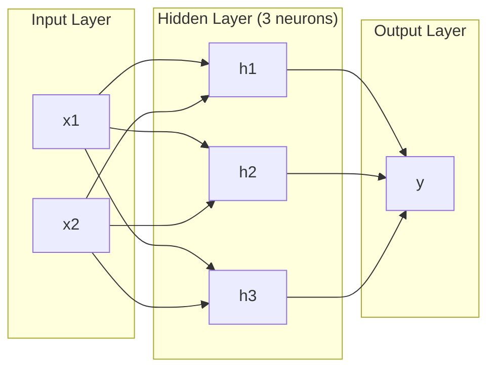
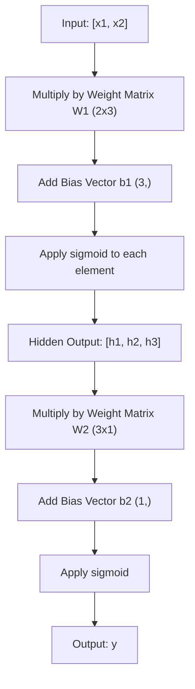
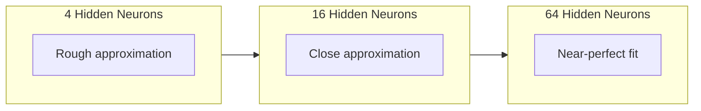

# Multi-Layer Networks and Forward Pass

> One neuron draws a line. Stack them, and you can draw anything.

**Type:** Build
**Languages:** Python
**Prerequisites:** Phase 01 (Math Foundations), Lesson 03.01 (The Perceptron)
**Time:** ~90 minutes

## Learning Objectives

- Build a multi-layer network from scratch with Layer and Network classes that perform a complete forward pass
- Trace matrix dimensions through each layer of a network and identify shape mismatches
- Explain how stacking nonlinear activations enables a network to learn curved decision boundaries
- Solve the XOR problem using a 2-2-1 architecture with hand-tuned sigmoid weights

## The Problem

A single neuron is a line drawer. Every real problem in AI requires curves. Stacking neurons into layers is how you get curves.

In 1969, Minsky and Papert proved this limitation was fatal: a single-layer network cannot learn XOR. This killed neural network funding for over a decade. The fix was obvious in hindsight: stop using one layer. Stack neurons into layers. Let the first layer carve the input space into new features, and let the second layer combine those features into decisions no single line could make.

## The Concept

### Layers: Input, Hidden, Output

A multi-layer network has three types of layers:

**Input layer** -- holds your raw data. No computation happens here.

**Hidden layers** -- where the work happens. Each neuron takes every output from the previous layer, applies weights and a bias, then passes through an activation function.

**Output layer** -- the final answer. For binary classification, one neuron with sigmoid.



This is a 2-3-1 network. Two inputs, three hidden neurons, one output. Every connection carries a weight. Every neuron (except input) carries a bias.

### Neurons and Activations

Each neuron does three things:
1. Multiply every input by its corresponding weight
2. Sum all the products and add a bias
3. Pass the sum through an activation function

For now, the activation is sigmoid: `sigmoid(z) = 1 / (1 + e^(-z))`. Sigmoid squashes any number into the range (0, 1). This smooth curve is what makes learning possible -- unlike the perceptron's hard step, sigmoid has a gradient everywhere.

### Forward Pass: How Data Flows

The forward pass pushes input data through the network, layer by layer, until it reaches the output. No learning happens during the forward pass. It is pure computation: multiply, add, activate, repeat.



At each layer: `z = W * input + b` (linear transformation), then `a = sigmoid(z)` (activation).

### Matrix Dimensions

Tracking dimensions is the single most important debugging skill in deep learning:

| Step | Operation | Dimensions | Result Shape |
|------|-----------|------------|-------------|
| Input | x | -- | (2,) |
| Hidden linear | W1 * x + b1 | W1: (3, 2), b1: (3,) | (3,) |
| Hidden activation | sigmoid(z1) | -- | (3,) |
| Output linear | W2 * h + b2 | W2: (1, 3), b2: (1,) | (1,) |
| Output activation | sigmoid(z2) | -- | (1,) |

The rule: weight matrix W at layer k has shape (neurons_in_layer_k, neurons_in_layer_k_minus_1).

### Universal Approximation Theorem

In 1989, George Cybenko proved: a neural network with a single hidden layer and enough neurons can approximate any continuous function to any desired accuracy. Deeper networks (more layers, fewer neurons per layer) learn the same functions with far fewer total parameters.



## Build It

Pure Python. No numpy. Every matrix operation written from scratch.

### Step 1: Sigmoid Activation

```python
import math

def sigmoid(x):
    x = max(-500.0, min(500.0, x))
    return 1.0 / (1.0 + math.exp(-x))
```

The clamp to [-500, 500] prevents overflow.

### Step 2: Layer Class

A layer holds a weight matrix and a bias vector. Its forward method takes an input vector and returns the activated output.

```python
class Layer:
    def __init__(self, n_inputs, n_neurons, weights=None, biases=None):
        if weights is not None:
            self.weights = weights
        else:
            import random
            self.weights = [
                [random.uniform(-1, 1) for _ in range(n_inputs)]
                for _ in range(n_neurons)
            ]
        if biases is not None:
            self.biases = biases
        else:
            self.biases = [0.0] * n_neurons

    def forward(self, inputs):
        self.last_input = inputs
        self.last_output = []
        for neuron_idx in range(len(self.weights)):
            z = sum(w * x for w, x in zip(self.weights[neuron_idx], inputs))
            z += self.biases[neuron_idx]
            self.last_output.append(sigmoid(z))
        return self.last_output
```

### Step 3: Network Class

A network is a list of layers. The forward pass chains them.

```python
class Network:
    def __init__(self, layers):
        self.layers = layers

    def forward(self, inputs):
        current = inputs
        for layer in self.layers:
            current = layer.forward(current)
        return current
```

That is the entire forward pass. Four lines of logic.

### Step 4: XOR with Hand-Tuned Weights

2-2-1 architecture: two inputs, two hidden neurons, one output.

```python
hidden = Layer(
    n_inputs=2, n_neurons=2,
    weights=[[20.0, 20.0], [-20.0, -20.0]],
    biases=[-10.0, 30.0],
)

output = Layer(
    n_inputs=2, n_neurons=1,
    weights=[[20.0, 20.0]],
    biases=[-30.0],
)

xor_net = Network([hidden, output])
```

The large weights (20, -20) make sigmoid act like a step function. The first hidden neuron approximates OR. The second approximates NAND. The output neuron combines them into AND, which is XOR.

### Step 5: Circle Classification

A harder problem: classify 2D points as inside or outside a circle. This requires a curved decision boundary -- impossible for a single perceptron.

```python
import random
random.seed(42)

data = []
for _ in range(200):
    x = random.uniform(-1, 1)
    y = random.uniform(-1, 1)
    label = 1 if (x * x + y * y) < 0.25 else 0
    data.append(([x, y], label))

circle_net = Network([
    Layer(n_inputs=2, n_neurons=8),
    Layer(n_inputs=8, n_neurons=1),
])
```

With random weights, accuracy will be poor. After training via backpropagation (Lesson 03), this same architecture will draw a curved boundary that separates inside from outside.

## Use It

PyTorch does everything above in four lines:

```python
import torch
import torch.nn as nn

model = nn.Sequential(
    nn.Linear(2, 8),
    nn.Sigmoid(),
    nn.Linear(8, 1),
    nn.Sigmoid(),
)

x = torch.tensor([[0.0, 0.0], [0.0, 1.0], [1.0, 0.0], [1.0, 1.0]])
output = model(x)
```

`nn.Linear(2, 8)` is your Layer class. `nn.Sequential` is your Network class. The forward pass logic is identical to what you just built.

## Key Terms

| Term | What people say | What it actually means |
|------|----------------|----------------------|
| Forward pass | "Running the model" | Pushing input through every layer to produce an output |
| Hidden layer | "The middle part" | Any layer between input and output whose values are not directly observed |
| Multi-layer network | "A deep neural network" | Layers of neurons stacked sequentially |
| Activation function | "The nonlinearity" | A function applied after the linear transformation that introduces curves |
| Sigmoid | "The S-curve" | sigma(z) = 1/(1+e^(-z)), squashes any real number to (0,1) |
| Weight matrix | "The parameters" | A matrix W of learnable connection strengths |
| Bias vector | "The offset" | A vector added after the matrix multiply |
| Universal approximation | "Neural nets can learn anything" | A single hidden layer with enough neurons can approximate any continuous function |
| Linear transformation | "The matrix multiply step" | z = W * x + b before activation |
| Decision boundary | "Where the classifier switches" | The surface where network output crosses the classification threshold |

## Exercises

1. Build a 2-4-2-1 network (two hidden layers) and run the forward pass on XOR data with random weights.
2. Change the hidden layer size in the circle classifier from 8 to 2, then to 32. Run the forward pass with random weights each time.
3. Implement a `count_parameters` method on Network that returns total trainable weights and biases.
4. Build a forward pass for a 3-4-4-2 network. Feed it RGB color values and observe the two outputs.
5. Replace sigmoid with a "leaky step" function. Run the forward pass on XOR with the same hand-tuned weights. Does it still work?

## Further Reading

- Michael Nielsen, "Neural Networks and Deep Learning", Chapter 1-2 (http://neuralnetworksanddeeplearning.com/)
- Cybenko, "Approximation by Superpositions of a Sigmoidal Function" (1989)
- 3Blue1Brown, "But what is a neural network?" (https://www.youtube.com/watch?v=aircAruvnKk)
- Goodfellow, Bengio, Courville, "Deep Learning", Chapter 6 (https://www.deeplearningbook.org/)

[Reference](https://github.com/rohitg00/ai-engineering-from-scratch/tree/main/phases/03-deep-learning-core/02-multi-layer-networks)
