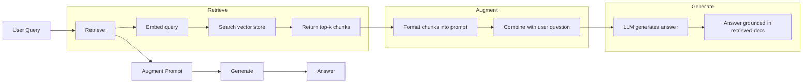
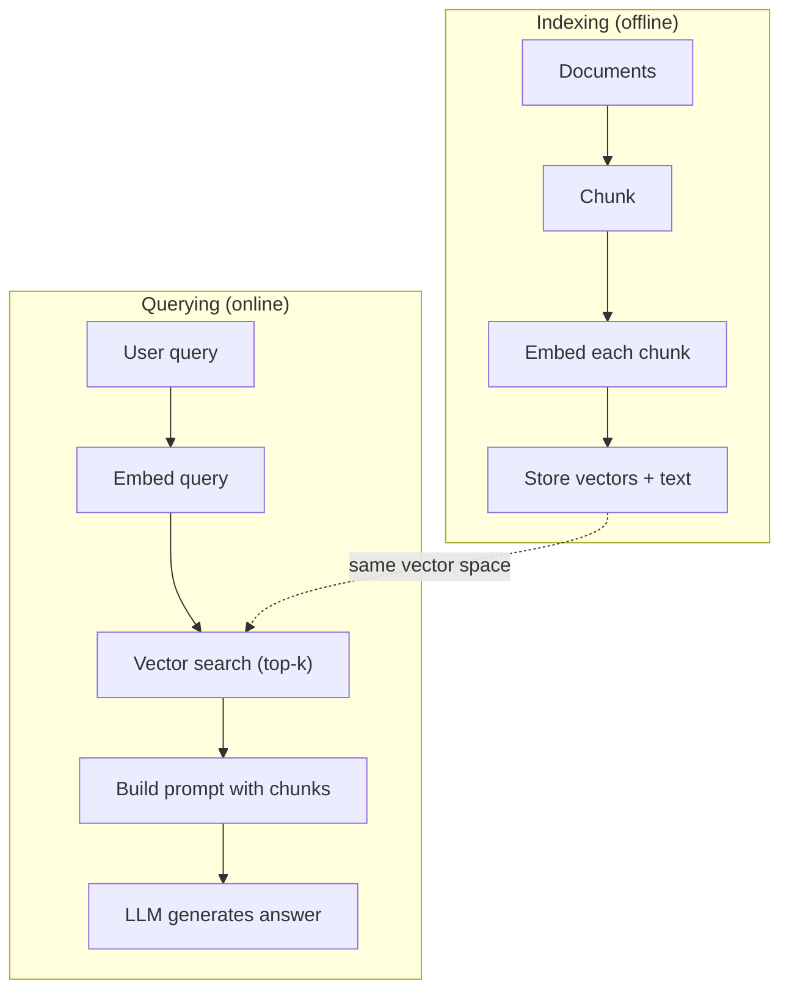
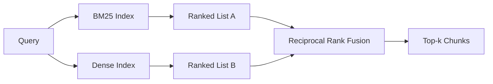
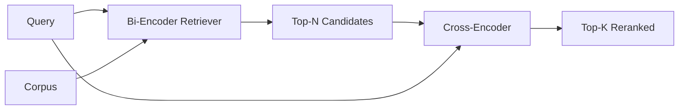

# Embeddings, Chunking, Hybrid Retrieval & Reranking

> Combined lessons (6 parts), merged verbatim — no content removed.

**Type:** Combined

---

## Part 1 (ch210): RAG (Retrieval-Augmented Generation)

> Your LLM knows everything up to its training cutoff. It knows nothing about your company's docs, your codebase, or last week's meeting notes. RAG solves this by retrieving relevant documents and stuffing them into the prompt. It's the most deployed pattern in production AI. If you build one thing from this course, build a RAG pipeline.

**Type:** Build
**Languages:** Python
**Prerequisites:** Phase 10 (LLMs from Scratch), Phase 11 Lessons 01-05
**Time:** ~90 minutes
**Related:** Phase 5 · 23 (Chunking Strategies for RAG) for the six chunking algorithms and when each wins. Phase 5 · 22 (Embedding Models Deep Dive) for picking the embedder. Phase 11 · 07 (Advanced RAG) for hybrid search, reranking, and query transformation.

## Learning Objectives

- Build a complete RAG pipeline: document loading, chunking, embedding, vector storage, retrieval, and generation
- Implement semantic search using a vector database (ChromaDB, FAISS, or Pinecone) with proper indexing
- Explain why RAG is preferred over fine-tuning for knowledge-grounded applications (cost, freshness, attribution)
- Evaluate RAG quality using retrieval metrics (precision, recall) and generation metrics (faithfulness, relevance)

## The Problem

You build a chatbot for your company. A customer asks "What's the refund policy for enterprise plans?" The LLM responds with a generic answer about typical SaaS refund policies. The actual policy, buried in a 200-page internal wiki, says enterprise customers get a 60-day window with pro-rated refunds. The LLM has never seen this document. It cannot know what it was not trained on.

Fine-tuning is one solution. Take the LLM, train it on your internal docs, and deploy the updated model. This works but has serious problems. Fine-tuning costs thousands of dollars in compute. The model becomes stale the moment a document changes. You have no way to know which source the model drew from. And if the company acquires another product line next month, you fine-tune again.

RAG is the other solution. Leave the model untouched. When a question comes in, search your document store for relevant passages, paste them into the prompt before the question, and let the model answer using those passages as context. The document store can be updated in minutes. You can see exactly which documents were retrieved. The model itself never changes. This is why RAG is the dominant pattern in production: it's cheaper, fresher, more auditable, and works with any LLM.

## The Concept

### The RAG Pattern

The entire pattern fits in four steps:



Query -> Retrieve -> Augment prompt -> Generate. Every RAG system follows this pattern. The differences between production RAG systems are in the details of each step: how you chunk, how you embed, how you search, and how you construct the prompt.

### Why RAG Beats Fine-Tuning

| Concern | Fine-tuning | RAG |
|---------|------------|-----|
| Cost | $1,000-$100,000+ per training run | $0.01-$0.10 per query (embedding + LLM) |
| Freshness | Stale until retrained | Updated in minutes by re-indexing docs |
| Auditability | Cannot trace answer to source | Can show exact retrieved passages |
| Hallucination | Still hallucinates freely | Grounded in retrieved documents |
| Data privacy | Training data baked into weights | Documents stay in your vector store |

Fine-tuning changes the model's weights permanently. RAG changes the model's context temporarily. For most applications, temporary context is what you want.

The one case where fine-tuning wins: when you need the model to adopt a specific style, tone, or reasoning pattern that cannot be achieved through prompting alone. For factual knowledge retrieval, RAG wins every time.

### Embedding Models

An embedding model converts text into a dense vector. Similar texts produce vectors that are close together in this high-dimensional space. "How do I reset my password?" and "I need to change my password" produce nearly identical vectors despite sharing few words. "The cat sat on the mat" produces a very different vector.

Common embedding models (2026 lineup -- see Phase 5 · 22 for full analysis):

| Model | Dimensions | Provider | Notes |
|-------|-----------|----------|-------|
| text-embedding-3-small | 1536 (Matryoshka) | OpenAI | Best price/performance for most use cases |
| text-embedding-3-large | 3072 (Matryoshka) | OpenAI | Higher accuracy, truncatable to 256/512/1024 |
| Gemini Embedding 2 | 3072 (Matryoshka) | Google | Top MTEB retrieval; 8K context |
| voyage-4 | 1024/2048 (Matryoshka) | Voyage AI | Domain variants (code, finance, law) |
| Cohere embed-v4 | 1024 (Matryoshka) | Cohere | Strong multilingual, 128K context |
| BGE-M3 | 1024 (dense + sparse + ColBERT) | BAAI (open-weight) | Three views from one model |
| Qwen3-Embedding | 4096 (Matryoshka) | Alibaba (open-weight) | Top open-weight retrieval score |
| all-MiniLM-L6-v2 | 384 | Open-weight (Sentence Transformers) | Prototyping baseline |

For this lesson, we build our own simple embedding using TF-IDF. Not because TF-IDF is what production systems use, but because it makes the concept concrete: text goes in, a vector comes out, similar texts produce similar vectors.

### Vector Similarity

Given two vectors, how do you measure similarity? Three options:

**Cosine similarity**: the cosine of the angle between two vectors. Ranges from -1 (opposite) to 1 (identical). Ignores magnitude, only cares about direction. This is the default for RAG.

```
cosine_sim(a, b) = dot(a, b) / (||a|| * ||b||)
```

**Dot product**: the raw inner product. Larger vectors get higher scores. Useful when magnitude carries information (longer documents might be more relevant).

```
dot(a, b) = sum(a_i * b_i)
```

**L2 (Euclidean) distance**: straight-line distance in the vector space. Smaller distance = more similar. Sensitive to magnitude differences.

```
L2(a, b) = sqrt(sum((a_i - b_i)^2))
```

Cosine similarity is the standard. It handles documents of different lengths gracefully because it normalizes by magnitude. When someone says "vector search," they almost always mean cosine similarity.

### Chunking Strategies

Documents are too long to embed as single vectors. A 50-page PDF might produce a terrible embedding because it contains dozens of topics. Instead, you split documents into chunks and embed each chunk separately.

**Fixed-size chunking**: split every N tokens. Simple and predictable. A 512-token chunk with 50-token overlap means chunk 1 is tokens 0-511, chunk 2 is tokens 462-973, and so on. The overlap ensures you do not split a sentence at an unlucky boundary.

**Semantic chunking**: split at natural boundaries. Paragraphs, sections, or markdown headers. Each chunk is a coherent unit of meaning. More complex to implement but produces better retrieval.

**Recursive chunking**: try to split at the largest boundary first (section headers). If a section is still too large, split at paragraph boundaries. If a paragraph is still too large, split at sentence boundaries. This is the LangChain RecursiveCharacterTextSplitter approach and it works well in practice.

Chunk size matters more than people think:

- Too small (64-128 tokens): each chunk lacks context. "It increased 15% last quarter" means nothing without knowing what "it" refers to.
- Too large (2048+ tokens): each chunk covers multiple topics, diluting relevance. When you search for revenue data, you get a chunk that's 10% about revenue and 90% about headcount.
- Sweet spot (256-512 tokens): enough context to be self-contained, focused enough to be relevant.

Most production RAG systems use 256-512 token chunks with 50-token overlap. Anthropic's RAG guidelines recommend this range.

### Vector Databases

Once you have embeddings, you need somewhere to store and search them. Options:

| Database | Type | Best for |
|----------|------|----------|
| FAISS | Library (in-process) | Prototyping, small to medium datasets |
| Chroma | Lightweight DB | Local development, small deployments |
| Pinecone | Managed service | Production without ops overhead |
| Weaviate | Open source DB | Self-hosted production |
| pgvector | Postgres extension | Already using Postgres |
| Qdrant | Open source DB | High-performance self-hosted |

For this lesson, we build a simple in-memory vector store. It stores vectors in a list and does brute-force cosine similarity search. This is equivalent to FAISS with a flat index. It scales to maybe 100,000 vectors before getting slow. Production systems use approximate nearest neighbor (ANN) algorithms like HNSW to search millions of vectors in milliseconds.

### The Full Pipeline



The indexing phase runs once per document (or when documents update). The querying phase runs on every user request. In production, indexing might process millions of documents over hours. Querying must respond in under a second.

### Real Numbers

Most production RAG systems use these parameters:

- **k = 5 to 10** retrieved chunks per query
- **Chunk size = 256 to 512 tokens** with 50-token overlap
- **Context budget**: 2,500-5,000 tokens of retrieved content per query
- **Total prompt**: ~8,000-16,000 tokens (system prompt + retrieved chunks + conversation history + user query)
- **Embedding dimension**: 384-3072 depending on model
- **Indexing throughput**: 100-1,000 documents per second with API embeddings
- **Query latency**: 50-200ms for retrieval, 500-3000ms for generation

## Build It

### Step 1: Document Chunking

```python
def chunk_text(text, chunk_size=200, overlap=50):
    words = text.split()
    chunks = []
    start = 0
    while start < len(words):
        end = start + chunk_size
        chunk = " ".join(words[start:end])
        chunks.append(chunk)
        start += chunk_size - overlap
    return chunks
```

### Step 2: TF-IDF Embeddings

We build a simple embedding function. TF-IDF (Term Frequency-Inverse Document Frequency) is not a neural embedding, but it converts text to vectors in a way that captures word importance. Frequent words in a document get higher TF. Rare words across the corpus get higher IDF. The product gives a vector where important, distinctive words have high values.

```python
import math
from collections import Counter

def build_vocabulary(documents):
    vocab = set()
    for doc in documents:
        vocab.update(doc.lower().split())
    return sorted(vocab)

def compute_tf(text, vocab):
    words = text.lower().split()
    count = Counter(words)
    total = len(words)
    return [count.get(word, 0) / total for word in vocab]

def compute_idf(documents, vocab):
    n = len(documents)
    idf = []
    for word in vocab:
        doc_count = sum(1 for doc in documents if word in doc.lower().split())
        idf.append(math.log((n + 1) / (doc_count + 1)) + 1)
    return idf

def tfidf_embed(text, vocab, idf):
    tf = compute_tf(text, vocab)
    return [t * i for t, i in zip(tf, idf)]
```

### Step 3: Cosine Similarity Search

```python
def cosine_similarity(a, b):
    dot = sum(x * y for x, y in zip(a, b))
    norm_a = math.sqrt(sum(x * x for x in a))
    norm_b = math.sqrt(sum(x * x for x in b))
    if norm_a == 0 or norm_b == 0:
        return 0.0
    return dot / (norm_a * norm_b)

def search(query_embedding, stored_embeddings, top_k=5):
    scores = []
    for i, emb in enumerate(stored_embeddings):
        sim = cosine_similarity(query_embedding, emb)
        scores.append((i, sim))
    scores.sort(key=lambda x: x[1], reverse=True)
    return scores[:top_k]
```

### Step 4: Prompt Construction

This is where the "augmented" in RAG happens. Take the retrieved chunks, format them into a prompt, and ask the LLM to answer based on the provided context.

```python
def build_rag_prompt(query, retrieved_chunks):
    context = "\n\n---\n\n".join(
        f"[Source {i+1}]\n{chunk}"
        for i, chunk in enumerate(retrieved_chunks)
    )
    return f"""Answer the question based ONLY on the following context.
If the context doesn't contain enough information, say "I don't have enough information to answer that."

Context:
{context}

Question: {query}

Answer:"""
```

### Step 5: The Complete RAG Pipeline

```python
class RAGPipeline:
    def __init__(self):
        self.chunks = []
        self.embeddings = []
        self.vocab = []
        self.idf = []

    def index(self, documents):
        all_chunks = []
        for doc in documents:
            all_chunks.extend(chunk_text(doc))
        self.chunks = all_chunks
        self.vocab = build_vocabulary(all_chunks)
        self.idf = compute_idf(all_chunks, self.vocab)
        self.embeddings = [
            tfidf_embed(chunk, self.vocab, self.idf)
            for chunk in all_chunks
        ]

    def query(self, question, top_k=5):
        query_emb = tfidf_embed(question, self.vocab, self.idf)
        results = search(query_emb, self.embeddings, top_k)
        retrieved = [(self.chunks[i], score) for i, score in results]
        prompt = build_rag_prompt(
            question, [chunk for chunk, _ in retrieved]
        )
        return prompt, retrieved
```

### Step 6: Generation (simulated)

In production, this is where you call the LLM API. For this lesson, we simulate generation by extracting the most relevant sentence from the retrieved context.

```python
def simple_generate(prompt, retrieved_chunks):
    query_words = set(prompt.lower().split("question:")[-1].split())
    best_sentence = ""
    best_score = 0
    for chunk in retrieved_chunks:
        for sentence in chunk.split("."):
            sentence = sentence.strip()
            if not sentence:
                continue
            words = set(sentence.lower().split())
            overlap = len(query_words & words)
            if overlap > best_score:
                best_score = overlap
                best_sentence = sentence
    return best_sentence if best_sentence else "I don't have enough information."
```

## Use It

With a real embedding model and LLM, the code barely changes:

```python
from openai import OpenAI

client = OpenAI()

def embed(text):
    response = client.embeddings.create(
        model="text-embedding-3-small",
        input=text
    )
    return response.data[0].embedding

def generate(prompt):
    response = client.chat.completions.create(
        model="gpt-4o-mini",
        messages=[{"role": "user", "content": prompt}],
        temperature=0
    )
    return response.choices[0].message.content
```

Or with Anthropic:

```python
import anthropic

client = anthropic.Anthropic()

def generate(prompt):
    response = client.messages.create(
        model="claude-sonnet-4-20250514",
        max_tokens=1024,
        messages=[{"role": "user", "content": prompt}]
    )
    return response.content[0].text
```

The pipeline is the same. Swap the embedding function. Swap the generation function. The retrieval logic, chunking, prompt construction -- all identical regardless of which models you use.

For vector storage at scale, replace the brute-force search with a proper vector database:

```python
import chromadb

client = chromadb.Client()
collection = client.create_collection("my_docs")

collection.add(
    documents=chunks,
    ids=[f"chunk_{i}" for i in range(len(chunks))]
)

results = collection.query(
    query_texts=["What is the refund policy?"],
    n_results=5
)
```

Chroma handles the embedding internally (it uses all-MiniLM-L6-v2 by default) and stores the vectors in a local database. Same pattern, different plumbing.

## Ship It

This lesson produces:
- `outputs/prompt-rag-architect.md` -- a prompt for designing RAG systems for specific use cases
- `outputs/skill-rag-pipeline.md` -- a skill that teaches agents how to build and debug RAG pipelines

## Exercises

1. Replace the TF-IDF embeddings with a simple bag-of-words approach (binary: 1 if word present, 0 if not). Compare retrieval quality on the sample documents. TF-IDF should outperform because it weights rare words higher.

2. Experiment with chunk sizes: try 50, 100, 200, and 500 words on the same document set. For each size, run the same 5 queries and count how many return a relevant chunk in the top-3. Find the sweet spot where retrieval quality peaks.

3. Add metadata to each chunk (source document name, chunk position). Modify the prompt template to include source attribution so the LLM cites its sources.

4. Implement a simple evaluation: given 10 question-answer pairs, run each question through the RAG pipeline, and measure what percentage of retrieved chunks contain the answer. This is retrieval recall at k.

5. Build a conversation-aware RAG pipeline: maintain a history of the last 3 exchanges and include them in the prompt alongside the retrieved chunks. Test with follow-up questions like "What about enterprise?" after asking about pricing.

## Key Terms

| Term | What people say | What it actually means |
|------|----------------|----------------------|
| RAG | "AI that reads your docs" | Retrieve relevant documents, paste them into the prompt, and generate an answer grounded in those documents |
| Embedding | "Convert text to numbers" | A dense vector representation of text where similar meanings produce similar vectors |
| Vector database | "Search engine for AI" | A data store optimized for storing vectors and finding the nearest neighbors by similarity |
| Chunking | "Split docs into pieces" | Breaking documents into smaller segments (typically 256-512 tokens) so each can be embedded and retrieved independently |
| Cosine similarity | "How similar are two vectors" | The cosine of the angle between two vectors; 1 = identical direction, 0 = orthogonal, -1 = opposite |
| Top-k retrieval | "Get the k best matches" | Return the k most similar chunks to the query from the vector store |
| Context window | "How much text the LLM can see" | The maximum number of tokens the LLM can process in a single request; retrieved chunks must fit within this |
| Augmented generation | "Answer using given context" | Generating a response using retrieved documents as context rather than relying solely on trained knowledge |
| TF-IDF | "Word importance scoring" | Term Frequency times Inverse Document Frequency; weights words by how distinctive they are within a corpus |
| Indexing | "Preparing docs for search" | The offline process of chunking, embedding, and storing documents so they can be searched at query time |

## Further Reading

- Lewis et al., "Retrieval-Augmented Generation for Knowledge-Intensive NLP Tasks" (2020) -- the original RAG paper from Facebook AI Research that formalized the retrieve-then-generate pattern
- Anthropic's RAG documentation (docs.anthropic.com) -- practical guidelines for chunk sizes, prompt construction, and evaluation
- Pinecone Learning Center, "What is RAG?" -- clear visual explanations of the RAG pipeline with production considerations
- Sentence-BERT: Reimers & Gurevych (2019) -- the paper behind the all-MiniLM embedding models, showing how to train bi-encoders for semantic similarity
- [Karpukhin et al., "Dense Passage Retrieval for Open-Domain Question Answering" (EMNLP 2020)](https://arxiv.org/abs/2004.04906) -- the DPR paper that proved dense bi-encoder retrieval beats BM25 on open-domain QA and set the pattern for modern RAG retrievers.
- [LlamaIndex High-Level Concepts](https://docs.llamaindex.ai/en/stable/getting_started/concepts.html) -- the main concepts to know when building RAG pipelines: data loaders, node parsers, indices, retrievers, response synthesizers.
- [LangChain RAG tutorial](https://python.langchain.com/docs/tutorials/rag/) -- the opposite-flavor orchestrator; chain-of-runnables view of the same retrieve-then-generate pattern.

---

## Part 2 (ch115): Embedding Models — The 2026 Deep Dive

Word2Vec gave you a vector per word. Modern embedding models give you a vector per passage, cross-lingual, with sparse, dense, and multi-vector views, sized to fit your index.

## The Concept

**Dense embeddings.** One vector per passage (384-3072 dim). Cosine similarity ranks passages. Default choice.

**Sparse embeddings.** SPLADE-style. A transformer predicts weight for every vocab token, zeros out most. Captures lexical matching like BM25 with learned term weights.

**Multi-vector (late interaction).** ColBERTv2. One vector per token. MaxSim scoring. Wins on long queries and domain-specific corpora.

**BGE-M3: all three at once.** Single model outputs dense, sparse, and multi-vector representations simultaneously.

**Matryoshka Representation Learning.** First N dimensions form a useful standalone embedding. Truncate 1536 dim to 256 dim and pay ~1% accuracy for 6x storage savings.

### The Three-Tier Pattern

| Use case | Pattern |
|----------|---------|
| Fast first-pass | Dense bi-encoder (BGE-M3, text-3-small) |
| Recall boost | Sparse (SPLADE) + RRF fuse |
| Precision on top-50 | Multi-vector (ColBERTv2) or cross-encoder reranker |

## Build It

### Step 1: Baseline — Dense Embeddings with Sentence-BERT

```python
from sentence_transformers import SentenceTransformer
import numpy as np

encoder = SentenceTransformer("BAAI/bge-small-en-v1.5")
corpus = [
    "The first iPhone launched in 2007.",
    "Apple released the iPod in 2001.",
    "Android is an operating system from Google.",
]
emb = encoder.encode(corpus, normalize_embeddings=True)

query = "When was the iPhone released?"
q_emb = encoder.encode([query], normalize_embeddings=True)[0]
scores = emb @ q_emb
print(sorted(enumerate(scores), key=lambda x: -x[1]))
```

`normalize_embeddings=True` makes dot product equal cosine similarity.

### Step 2: Matryoshka Truncation

```python
def truncate(vectors, dim):
    out = vectors[:, :dim]
    return out / np.linalg.norm(out, axis=1, keepdims=True)

emb_256 = truncate(emb, 256)
emb_128 = truncate(emb, 128)
```

Re-normalize after truncation. Non-Matryoshka models degrade sharply.

### Step 3: BGE-M3 Multi-Functionality

```python
from FlagEmbedding import BGEM3FlagModel

model = BGEM3FlagModel("BAAI/bge-m3", use_fp16=True)

output = model.encode(
    corpus,
    return_dense=True,
    return_sparse=True,
    return_colbert_vecs=True,
)
```

Score fusion:

```python
dense_score = ... # cosine over dense_vecs
sparse_score = model.compute_lexical_matching_score(q_lex, d_lex)
colbert_score = model.colbert_score(q_col, d_col)
final = 0.4 * dense_score + 0.2 * sparse_score + 0.4 * colbert_score
```

### Step 4: MTEB Eval on a Custom Task

```python
from mteb import MTEB

tasks = ["ArguAna", "SciFact", "NFCorpus"]
evaluation = MTEB(tasks=tasks)
results = evaluation.run(encoder, output_folder="./mteb-results")
```

Run candidate models on a representative subset. Leaderboard rank alone is not enough.

## Pitfalls

- Same model for query and doc? Check the model card for asymmetric encoding.
- Missing prefix? `bge-*` models need `"Represent this sentence for searching relevant passages: "` prepended to queries.
- Over-trimming Matryoshka? Validate on your eval set.
- Context truncation? Long docs need chunking (lesson 23).
- Ignoring latency tail? MTEB scores hide p99 latency.

## Use It

| Situation | Pick |
|-----------|------|
| English-only, fast, API | `text-embedding-3-large` or `voyage-3-large` |
| Open-weight, English | `BAAI/bge-large-en-v1.5` |
| Open-weight, multilingual | `BAAI/bge-m3` or `Qwen3-Embedding-8B` |
| Long context (32k+) | Voyage-3-large, Cohere embed-v4 |
| Storage-constrained | Matryoshka-truncated + int8 quantization |

## Exercises

1. **Easy.** Encode 100 sentences with `bge-small-en-v1.5` at full dim (384) and Matryoshka 128. Measure MRR drop.
2. **Medium.** Compare BGE-M3 dense, sparse, and colbert on 500 passages from your domain.
3. **Hard.** Run MTEB on three candidate models. Report MTEB score, p99 latency, and cost.

## Key Terms

| Term | What it actually means |
|------|-----------------------|
| Dense embedding | One fixed-size vector per text. Cosine similarity for ranking. |
| Sparse embedding | One weight per vocab token; mostly zeros. |
| Multi-vector | One vector per token; MaxSim scoring. |
| Matryoshka | First N dims are a valid smaller embedding on their own. |
| MTEB | Massive Text Embedding Benchmark. |
| Asymmetric encoding | Model uses different projections for queries and documents. |

[Reference](https://github.com/rohitg00/ai-engineering-from-scratch/tree/main/phases/05-nlp-foundations-to-advanced/22-embedding-models-deep-dive)

---

## Part 3 (ch116): Chunking Strategies for RAG

Chunking configuration influences retrieval quality as much as the choice of embedding model (Vectara NAACL 2025). Get chunking wrong and no amount of reranking saves you.

## The Concept

Six chunking strategies:

**Fixed chunking.** Split every N characters/tokens. Simplest baseline. Breaks mid-sentence.

**Recursive.** LangChain's `RecursiveCharacterTextSplitter`. Try `\n\n`, then `\n`, then `.`, then space. Falls back cleanly. The 2026 default.

**Semantic.** Embed each sentence. Compute cosine similarity between adjacent sentences. Split where similarity drops below a threshold.

**Sentence.** Split on sentence boundaries. One sentence per chunk or window of N sentences.

**Parent-document.** Store small child chunks for retrieval and larger parent chunk for context. Retrieve by child, return parent.

**Late chunking (2024).** Embed the whole document at the token level first, then pool token embeddings into chunk embeddings.

**Contextual retrieval (Anthropic, 2024).** Prepend each chunk with an LLM-generated summary of its position in the document. 35-50% improvement.

### Match Chunk Size to Query Type

| Query type | Chunk size |
|------------|-----------|
| Factoid ("what is the CEO's name?") | 256-512 tokens |
| Analytical / multi-hop | 512-1024 tokens |
| Whole-section comprehension | 1024-2048 tokens |

## Build It

### Step 1: Fixed and Recursive Chunking

```python
def chunk_fixed(text, size=512, overlap=0):
    step = size - overlap
    return [text[i:i + size] for i in range(0, len(text), step)]

def chunk_recursive(text, size=512, seps=("\n\n", "\n", ". ", " ")):
    if len(text) <= size:
        return [text]
    for sep in seps:
        if sep not in text:
            continue
        parts = text.split(sep)
        chunks = []
        buf = ""
        for p in parts:
            if len(p) > size:
                if buf:
                    chunks.append(buf)
                    buf = ""
                chunks.extend(chunk_recursive(p, size=size, seps=seps[1:] or (" ",)))
                continue
            candidate = buf + sep + p if buf else p
            if len(candidate) <= size:
                buf = candidate
            else:
                if buf:
                    chunks.append(buf)
                buf = p
        if buf:
            chunks.append(buf)
        return [c for c in chunks if c.strip()]
    return chunk_fixed(text, size)
```

### Step 2: Semantic Chunking

```python
def chunk_semantic(text, encoder, threshold=0.6, min_chars=200, max_chars=2048):
    sentences = split_sentences(text)
    if not sentences:
        return []
    embs = encoder.encode(sentences, normalize_embeddings=True)
    chunks = [[sentences[0]]]
    for i in range(1, len(sentences)):
        sim = float(embs[i] @ embs[i - 1])
        current_len = sum(len(s) for s in chunks[-1])
        if sim < threshold and current_len >= min_chars:
            chunks.append([sentences[i]])
        else:
            chunks[-1].append(sentences[i])

    result = []
    for group in chunks:
        text_group = " ".join(group)
        if len(text_group) > max_chars:
            result.extend(chunk_recursive(text_group, size=max_chars))
        else:
            result.append(text_group)
    return result
```

### Step 3: Parent-Document

```python
def chunk_parent_child(text, parent_size=2048, child_size=256):
    parents = chunk_recursive(text, size=parent_size)
    mapping = []
    for p_idx, parent in enumerate(parents):
        children = chunk_recursive(parent, size=child_size)
        for child in children:
            mapping.append({"child": child, "parent_idx": p_idx, "parent": parent})
    return mapping
```

### Step 4: Contextual Retrieval

```python
def contextualize_chunks(document, chunks, llm):
    context_prompts = [
        f"""<document>{document}</document>
Here is the chunk to situate: <chunk>{c}</chunk>
Write 50-100 words placing this chunk in the document's context."""
        for c in chunks
    ]
    contexts = llm.batch(context_prompts)
    return [f"{ctx}\n\n{c}" for ctx, c in zip(contexts, chunks)]
```

## Pitfalls

- Chunking evaluated only on factoid queries misses multi-hop differences.
- Semantic chunking without minimum size produces 40-token fragments.
- Overlap as cargo cult: 2026 studies find often zero benefit.
- No min/max enforcement breaks retrieval.
- Never let a chunk span two documents.

## Use It

| Situation | Strategy |
|-----------|----------|
| First build, unknown corpus | Recursive, 512 tokens, no overlap |
| Factoid QA | Recursive, 256-512 tokens |
| Heavy cross-reference | Late chunking or contextual retrieval |
| Short utterances | One document = one chunk |

Start with recursive 512. Measure recall@5 on a 50-query eval set. Tune from there.

## Exercises

1. **Easy.** Chunk one 20-page document with fixed(512,0), recursive(512,0), and recursive(512,100).
2. **Medium.** Build a 30-query eval set. Measure recall@5 for recursive, semantic, and parent-document.
3. **Hard.** Implement contextual retrieval. Measure MRR improvement over baseline recursive.

## Key Terms

| Term | What it actually means |
|------|-----------------------|
| Chunk | Sub-document unit that gets embedded, indexed, retrieved. |
| Overlap | N tokens shared between adjacent chunks. |
| Semantic chunking | Split where adjacent-sentence embedding similarity drops. |
| Parent-document | Retrieve small children, return larger parents. |
| Late chunking | Embed full doc at token level, pool into chunk vectors. |
| Contextual retrieval | LLM-generated summary prepended to each chunk. |

[Reference](https://github.com/rohitg00/ai-engineering-from-scratch/tree/main/phases/05-nlp-foundations-to-advanced/23-chunking-strategies-rag)

---

## Part 4 (ch478): Chunking Strategies, Compared

> Chunking decides what your retriever can ever surface. Get the boundaries wrong and no model can repair the damage downstream.

**Type:** Build
**Languages:** Python
**Prerequisites:** Phase 11 lessons 04, 06, 07; Phase 19 Track B foundations
**Time:** ~90 minutes

## Learning Objectives

- Implement five chunking strategies: fixed-window, sentence, recursive-split, semantic clustering, structural markdown.
- Measure recall@k on a fixture corpus with gold-labeled answer spans.
- Read a chunk-length distribution and recognize failure modes.
- Pick a default for a new corpus by inspecting three properties.

## The Concept

```mermaid
flowchart LR
  Doc[Source Document] --> S1[Fixed Window]
  Doc --> S2[Sentence]
  Doc --> S3[Recursive Split]
  Doc --> S4[Semantic Cluster]
  Doc --> S5[Structural Markdown]
  S1 --> Chunks1[Chunks]
  S2 --> Chunks2[Chunks]
  S3 --> Chunks3[Chunks]
  S4 --> Chunks4[Chunks]
  S5 --> Chunks5[Chunks]
  Chunks1 --> Index[Embedding Index]
  Chunks2 --> Index
  Chunks3 --> Index
  Chunks4 --> Index
  Chunks5 --> Index
  Index --> Eval[Recall@k vs Gold Spans]
```

## Failure modes

| Failure | Description |
|---------|-------------|
| Orphan sentences | Sentence packing misses the topic sentence |
| Mid-symbol cuts | Fixed-window splits identifiers in half |
| Header-only chunks | Structural splitter emits empty headings |
| Semantic drift | Uniform-topic corpus under-cuts with semantic clustering |

## Build It

`code/main.py` implements five chunkers, `mock_embed`, `DenseIndex`, `eval_recall`.

## Key Terms

| Term | What it actually means |
|------|------------------------|
| Recall@k | Fraction of queries where any top-k chunk overlaps gold answer span |
| Chunk overlap | Re-include last N chars of previous chunk |
| Structural splitter | Cut at H1/H2/H3 boundaries |
| Semantic chunker | Embed sentences, cluster by centroid similarity |

[Reference](https://github.com/rohitg00/ai-engineering-from-scratch/tree/main/phases/19-capstone-projects/64-chunking-strategies-advanced)

---

## Part 5 (ch479): Hybrid Retrieval with BM25 and Dense Embeddings

> Lexical and semantic retrieval fail on opposite query distributions. Hybrid retrieval with RRF votes, and the vote wins on every query class.

**Type:** Build
**Languages:** Python
**Prerequisites:** Phase 11 lessons 04, 06; Phase 19 Track B foundations; lesson 64
**Time:** ~90 minutes

## Learning Objectives

- Implement BM25 from scratch with field weighting, length normalization, and tunable k1, b.
- Build a dense retriever with deterministic mock embedding.
- Implement reciprocal rank fusion exactly as published.
- Tune the RRF k constant and per-modality weights.

## The Concept



### RRF formula

```
score(c) = sum over rankers of 1 / (k + rank(c))
```

Default k = 60. Per-modality weights multiply the rank contribution.

## Tuning knobs

| Knob | Default | Move up when | Move down when |
|------|---------|-------------|----------------|
| BM25 k1 | 1.5 | Terms repeat in documents | Documents are short |
| BM25 b | 0.75 | Long documents say less per word | Length uncorrelated with topic |
| RRF k | 60 | Deep candidates should vote | Top-1 should dominate |

## Build It

`code/main.py` implements: `tokenize`, `BM25Index`, `mock_embed`, `DenseIndex`, `rrf`, `HybridRetriever`.

## Key Terms

| Term | What it actually means |
|------|------------------------|
| BM25 | Probabilistic ranking with idf x saturating tf x length normalization |
| RRF | Sum of 1/(k + rank) across ranked lists |
| k1 | TF saturation control |
| b | Length penalty (0 = ignore, 1 = full) |

[Reference](https://github.com/rohitg00/ai-engineering-from-scratch/tree/main/phases/19-capstone-projects/65-hybrid-retrieval-bm25-dense)

---

## Part 6 (ch480): Cross-Encoder Reranker

> A bi-encoder embeds query and document independently. A cross-encoder concatenates them and reads both at once.

**Type:** Build
**Languages:** Python
**Prerequisites:** Phase 11 lessons 06, 07; Phase 19 Track B foundations; lesson 65
**Time:** ~90 minutes

## Learning Objectives

- Distinguish bi-encoder from cross-encoder by input shape and cost.
- Implement a small cross-encoder from scratch.
- Wire a two-stage retrieve-then-rerank pipeline.
- Measure the latency-vs-quality trade-off.

## The Concept



### Latency vs quality

| N | Recall@1 of stage 2 | Cross passes per query |
|---|--------------------|----------------------|
| 5 | 0.62 | 5 |
| 20 | 0.81 | 20 |
| 50 | 0.86 | 50 |

## Build It

`code/main.py` implements: `CrossEncoder`, `tokenize_pair`, `train_tiny`, `rerank`, `pipeline`.

## Key Terms

| Term | What it actually means |
|------|------------------------|
| Bi-encoder | Encodes query and doc independently; cosine ranks them |
| Cross-encoder | Encodes (query, doc) jointly; one relevance scalar |
| Two-stage pipeline | Cheap retriever returns N, expensive reranker keeps K |
| N (candidate budget) | Number of candidates the cross-encoder scores per query |

[Reference](https://github.com/rohitg00/ai-engineering-from-scratch/tree/main/phases/19-capstone-projects/66-reranker-cross-encoder)
