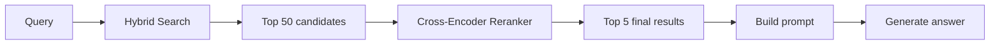
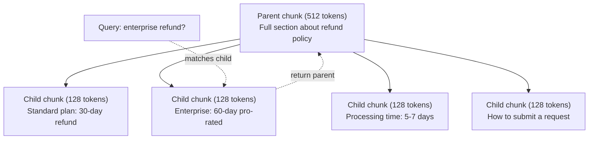
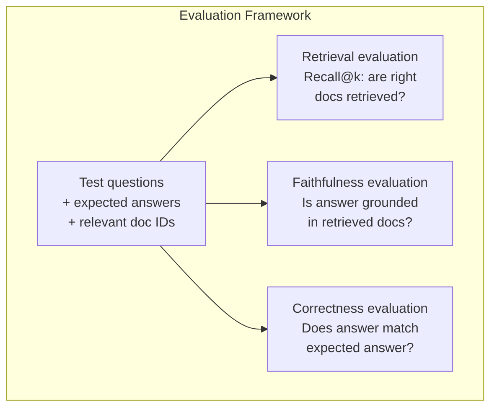
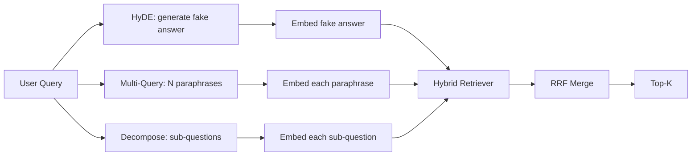
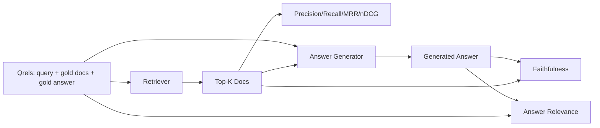
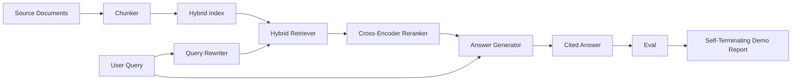

# Advanced RAG Systems, Eval & Codebase RAG

> Combined lessons (6 parts), merged verbatim — no content removed.

**Type:** Combined

---

## Part 1 (ch211): Advanced RAG (Chunking, Reranking, Hybrid Search)

> Basic RAG retrieves the top-k most similar chunks. That works for simple questions. It falls apart for multi-hop reasoning, ambiguous queries, and large corpora. Advanced RAG is the difference between a demo that works on 10 documents and a system that works on 10 million.

**Type:** Build
**Languages:** Python
**Prerequisites:** Phase 11, Lesson 06 (RAG)
**Time:** ~90 minutes
**Related:** Phase 5 · 23 (Chunking Strategies for RAG) covers all six chunking algorithms -- recursive, semantic, sentence, parent-document, late chunking, contextual retrieval -- with Vectara/Anthropic benchmarks. This lesson builds on top: hybrid search, reranking, query transformation.

## Learning Objectives

- Implement advanced chunking strategies (semantic, recursive, parent-child) that preserve document structure and context
- Build a hybrid search pipeline combining BM25 keyword matching with semantic vector search and a cross-encoder reranker
- Apply query transformation techniques (HyDE, multi-query, step-back) to improve retrieval on ambiguous or complex questions
- Diagnose and fix common RAG failures: wrong chunk retrieved, answer not in context, multi-hop reasoning breakdown

## The Problem

You built a basic RAG pipeline in Lesson 06. It works for straightforward questions on a small corpus. Now try these:

**Ambiguous query**: "What was revenue last quarter?" Semantic search returns chunks about revenue strategy, revenue projections, and the CFO's thoughts on revenue growth. All semantically similar to the word "revenue." None containing the actual number. The correct chunk says "$47.2M in Q3 2025" but uses the word "earnings" instead of "revenue." The embedding model thinks "revenue strategy" is closer to the query than "Q3 earnings were $47.2M."

**Multi-hop question**: "Which team had the highest customer satisfaction score improvement?" This requires finding the satisfaction scores for each team, comparing them, and identifying the maximum. No single chunk contains the answer. The information is scattered across team reports.

**Large corpus problem**: You have 2 million chunks. The correct answer is in chunk #1,847,293. Your top-5 retrieval pulls chunks #14, #89,201, #1,200,000, #44, and #901,333. Close in embedding space, but none containing the answer. At this scale, approximate nearest neighbor search introduces enough error that relevant results get pushed out of the top-k.

Basic RAG fails because vector similarity is not the same as relevance. A chunk can be semantically similar to a query without being useful for answering it. Advanced RAG addresses this with four techniques: hybrid search (add keyword matching), reranking (score candidates more carefully), query transformation (fix the query before searching), and better chunking (retrieve at the right granularity).

## The Concept

### Hybrid Search: Semantic + Keyword

Semantic search (vector similarity) is good at understanding meaning. "How do I cancel my subscription?" matches "Steps to terminate your plan" even though they share no words. But it misses exact matches. "Error code E-4021" might not match a chunk containing "E-4021" if the embedding model treats it as noise.

Keyword search (BM25) is the opposite. It excels at exact matches. "E-4021" matches perfectly. But "cancel my subscription" returns zero results if the document says "terminate your plan."

Hybrid search runs both, then merges the results.

**BM25** (Best Matching 25) is the standard keyword search algorithm. It has been the backbone of search engines since the 1990s. The formula:

```
BM25(q, d) = sum over terms t in q:
    IDF(t) * (tf(t,d) * (k1 + 1)) / (tf(t,d) + k1 * (1 - b + b * |d| / avgdl))
```

Where tf(t,d) is the term frequency of t in document d, IDF(t) is the inverse document frequency, |d| is the document length, avgdl is the average document length, k1 controls term frequency saturation (default 1.2), and b controls length normalization (default 0.75).

In plain terms: BM25 scores documents higher when they contain query terms (especially rare ones), but with diminishing returns for repeated terms. A document with the word "revenue" 50 times is not 50x more relevant than one with it once.

### Reciprocal Rank Fusion (RRF)

You have two ranked lists: one from vector search, one from BM25. How do you combine them? Reciprocal Rank Fusion is the standard approach.

```
RRF_score(d) = sum over rankings R:
    1 / (k + rank_R(d))
```

Where k is a constant (typically 60) that prevents the top-ranked result from dominating.

A document ranked #1 in vector search and #5 in BM25 gets: 1/(60+1) + 1/(60+5) = 0.0164 + 0.0154 = 0.0318

A document ranked #3 in vector search and #2 in BM25 gets: 1/(60+3) + 1/(60+2) = 0.0159 + 0.0161 = 0.0320

RRF naturally balances the two signals. A document that ranks highly in both lists gets the best score. A document that ranks #1 in one list but is absent from the other gets a moderate score. This is robust because it uses ranks, not raw scores, so differences in score distributions between the two systems do not matter.

### Reranking

Retrieval (whether vector, keyword, or hybrid) is fast but imprecise. It uses bi-encoders: the query and each document are embedded independently, then compared. The embeddings are computed once and cached. This scales to millions of documents.

Reranking uses cross-encoders: the query and a candidate document are fed together into a model that outputs a relevance score. The model sees both texts simultaneously and can capture fine-grained interactions between them. A cross-encoder can understand that "What were Q3 earnings?" is highly relevant to a chunk containing "$47.2M in Q3" even if a bi-encoder missed the connection.

The trade-off: cross-encoders are 100-1000x slower than bi-encoders because they process the query-document pair jointly. You cannot pre-compute cross-encoder scores for a million documents. The solution: retrieve a larger candidate set (top-50 from hybrid search), then rerank with a cross-encoder to get the final top-5.



Common reranking models (2026 lineup):
- Cohere Rerank 3.5: managed API, multilingual, best recall gain on mixed corpora
- Voyage rerank-2.5: managed API, lowest latency of the hosted options
- Jina-Reranker-v2 Multilingual: open-weight, 100+ languages
- bge-reranker-v2-m3: open-weight, strong baseline
- cross-encoder/ms-marco-MiniLM-L-6-v2: open-weight, runs on CPU for prototyping
- ColBERTv2 / Jina-ColBERT-v2: late-interaction multi-vector rerankers -- O(tokens) not O(docs) at scoring time

### Query Transformation

Sometimes the problem is not retrieval but the query itself. "What was that thing about the new policy change?" is a terrible search query. It contains no specific terms. The embedding is vague. No retrieval system can find the right documents from this.

**Query rewriting**: rephrase the user's query into a better search query. An LLM can do this:

```
User: "What was that thing about the new policy change?"
Rewritten: "Recent policy changes and updates"
```

**HyDE (Hypothetical Document Embeddings)**: instead of searching with the query, generate a hypothetical answer, embed that, and search for similar real documents.

```
Query: "What is the refund policy for enterprise?"
Hypothetical answer: "Enterprise customers are eligible for a full refund
within 60 days of purchase. Refunds are pro-rated based on the remaining
subscription period and processed within 5-7 business days."
```

Embed the hypothetical answer and search for real documents similar to it. The intuition: the hypothetical answer lives closer in embedding space to the real answer than the original question does. Questions and answers have different linguistic structures. By generating a hypothetical answer, you bridge the gap between "question space" and "answer space" in the embedding.

HyDE adds one LLM call before retrieval. This increases latency by 500-2000ms. Worth it when retrieval quality is poor on raw queries.

### Parent-Child Chunking

Standard chunking forces a trade-off: small chunks for precise retrieval, large chunks for sufficient context. Parent-child chunking eliminates this trade-off.

Index small chunks (128 tokens) for retrieval. When a small chunk is retrieved, return its parent chunk (512 tokens) for the prompt. The small chunk matches the query precisely. The parent chunk provides enough context for the LLM to generate a good answer.



The query "enterprise refund?" matches child chunk C2 precisely. But the prompt receives the full parent chunk P, which includes the surrounding context about processing time and submission process.

### Metadata Filtering

Before running vector search, filter the corpus by metadata: date, source, category, author, language. This reduces the search space and prevents irrelevant results.

"What changed in the security policy last month?" should only search documents from the last 30 days in the security category. Without metadata filtering, you search the entire corpus and might retrieve a 2-year-old security document that happens to be semantically similar.

Production RAG systems store metadata alongside each chunk: source document, creation date, category, author, version. Vector databases support pre-filtering by metadata before similarity search, which is critical for performance at scale.

### Evaluation

You built a RAG system. How do you know if it works? Three metrics:

**Retrieval relevance (Recall@k)**: for a set of test questions with known relevant documents, what percentage of relevant documents appear in the top-k results? If the answer to a question is in chunk #47, does chunk #47 appear in the top-5?

**Faithfulness**: is the generated answer grounded in the retrieved documents? If the retrieved chunks say "60-day refund window" and the model says "90-day refund window," that is a faithfulness failure. The model hallucinated despite having the correct context.

**Answer correctness**: does the generated answer match the expected answer? This is the end-to-end metric. It combines retrieval quality and generation quality.

A simple faithfulness check: take each claim in the generated answer and verify it appears (in substance) in the retrieved chunks. If the answer contains a fact not in any retrieved chunk, it is likely hallucinated.



## Build It

### Step 1: BM25 Implementation

```python
import math
from collections import Counter

class BM25:
    def __init__(self, k1=1.2, b=0.75):
        self.k1 = k1
        self.b = b
        self.docs = []
        self.doc_lengths = []
        self.avg_dl = 0
        self.doc_freqs = {}
        self.n_docs = 0

    def index(self, documents):
        self.docs = documents
        self.n_docs = len(documents)
        self.doc_lengths = []
        self.doc_freqs = {}

        for doc in documents:
            words = doc.lower().split()
            self.doc_lengths.append(len(words))
            unique_words = set(words)
            for word in unique_words:
                self.doc_freqs[word] = self.doc_freqs.get(word, 0) + 1

        self.avg_dl = sum(self.doc_lengths) / self.n_docs if self.n_docs else 1

    def score(self, query, doc_idx):
        query_words = query.lower().split()
        doc_words = self.docs[doc_idx].lower().split()
        doc_len = self.doc_lengths[doc_idx]
        word_counts = Counter(doc_words)
        score = 0.0

        for term in query_words:
            if term not in word_counts:
                continue
            tf = word_counts[term]
            df = self.doc_freqs.get(term, 0)
            idf = math.log((self.n_docs - df + 0.5) / (df + 0.5) + 1)
            numerator = tf * (self.k1 + 1)
            denominator = tf + self.k1 * (1 - self.b + self.b * doc_len / self.avg_dl)
            score += idf * numerator / denominator

        return score

    def search(self, query, top_k=10):
        scores = [(i, self.score(query, i)) for i in range(self.n_docs)]
        scores.sort(key=lambda x: x[1], reverse=True)
        return scores[:top_k]
```

### Step 2: Reciprocal Rank Fusion

```python
def reciprocal_rank_fusion(ranked_lists, k=60):
    scores = {}
    for ranked_list in ranked_lists:
        for rank, (doc_id, _) in enumerate(ranked_list):
            if doc_id not in scores:
                scores[doc_id] = 0.0
            scores[doc_id] += 1.0 / (k + rank + 1)
    fused = sorted(scores.items(), key=lambda x: x[1], reverse=True)
    return fused
```

### Step 3: Hybrid Search Pipeline

```python
def hybrid_search(query, chunks, vector_embeddings, vocab, idf, bm25_index, top_k=5, fusion_k=60):
    query_emb = tfidf_embed(query, vocab, idf)
    vector_results = search(query_emb, vector_embeddings, top_k=top_k * 3)
    bm25_results = bm25_index.search(query, top_k=top_k * 3)
    fused = reciprocal_rank_fusion([vector_results, bm25_results], k=fusion_k)
    return fused[:top_k]
```

### Step 4: Simple Reranker

In production, you would use a cross-encoder model. Here we build a reranker that scores query-document relevance using word overlap, term importance, and phrase matching.

```python
def rerank(query, candidates, chunks):
    query_words = set(query.lower().split())
    stop_words = {"the", "a", "an", "is", "are", "was", "were", "what", "how",
                  "why", "when", "where", "do", "does", "for", "of", "in", "to",
                  "and", "or", "on", "at", "by", "it", "its", "this", "that",
                  "with", "from", "be", "has", "have", "had", "not", "but"}
    query_terms = query_words - stop_words

    scored = []
    for doc_id, initial_score in candidates:
        chunk = chunks[doc_id].lower()
        chunk_words = set(chunk.split())

        term_overlap = len(query_terms & chunk_words)

        query_bigrams = set()
        q_list = [w for w in query.lower().split() if w not in stop_words]
        for i in range(len(q_list) - 1):
            query_bigrams.add(q_list[i] + " " + q_list[i + 1])
        bigram_matches = sum(1 for bg in query_bigrams if bg in chunk)

        position_boost = 0
        for term in query_terms:
            pos = chunk.find(term)
            if pos != -1 and pos < len(chunk) // 3:
                position_boost += 0.5

        rerank_score = (
            term_overlap * 1.0
            + bigram_matches * 2.0
            + position_boost
            + initial_score * 5.0
        )
        scored.append((doc_id, rerank_score))

    scored.sort(key=lambda x: x[1], reverse=True)
    return scored
```

### Step 5: HyDE (Hypothetical Document Embeddings)

```python
def hyde_generate_hypothesis(query):
    templates = {
        "what": "The answer to '{query}' is as follows: Based on our documentation, {topic} involves specific policies and procedures that define how the process works.",
        "how": "To address '{query}': The process involves several steps. First, you need to initiate the request. Then, the system processes it according to the defined rules.",
        "default": "Regarding '{query}': Our records indicate specific details and policies related to this topic that provide a comprehensive answer."
    }
    query_lower = query.lower()
    if query_lower.startswith("what"):
        template = templates["what"]
    elif query_lower.startswith("how"):
        template = templates["how"]
    else:
        template = templates["default"]

    topic_words = [w for w in query.lower().split()
                   if w not in {"what", "is", "the", "how", "do", "does", "a", "an",
                                "for", "of", "to", "in", "on", "at", "by", "and", "or"}]
    topic = " ".join(topic_words) if topic_words else "this topic"

    return template.format(query=query, topic=topic)


def hyde_search(query, chunks, vector_embeddings, vocab, idf, top_k=5):
    hypothesis = hyde_generate_hypothesis(query)
    hypothesis_emb = tfidf_embed(hypothesis, vocab, idf)
    results = search(hypothesis_emb, vector_embeddings, top_k)
    return results, hypothesis
```

### Step 6: Parent-Child Chunking

```python
def create_parent_child_chunks(text, parent_size=200, child_size=50):
    words = text.split()
    parents = []
    children = []
    child_to_parent = {}

    parent_idx = 0
    start = 0
    while start < len(words):
        parent_end = min(start + parent_size, len(words))
        parent_text = " ".join(words[start:parent_end])
        parents.append(parent_text)

        child_start = start
        while child_start < parent_end:
            child_end = min(child_start + child_size, parent_end)
            child_text = " ".join(words[child_start:child_end])
            child_idx = len(children)
            children.append(child_text)
            child_to_parent[child_idx] = parent_idx
            child_start += child_size

        parent_idx += 1
        start += parent_size

    return parents, children, child_to_parent
```

### Step 7: Faithfulness Evaluation

```python
def evaluate_faithfulness(answer, retrieved_chunks):
    answer_sentences = [s.strip() for s in answer.split(".") if len(s.strip()) > 10]
    if not answer_sentences:
        return 1.0, []

    grounded = 0
    ungrounded = []
    context = " ".join(retrieved_chunks).lower()

    for sentence in answer_sentences:
        words = set(sentence.lower().split())
        stop_words = {"the", "a", "an", "is", "are", "was", "were", "and", "or",
                      "to", "of", "in", "for", "on", "at", "by", "it", "this", "that"}
        content_words = words - stop_words
        if not content_words:
            grounded += 1
            continue

        matched = sum(1 for w in content_words if w in context)
        ratio = matched / len(content_words) if content_words else 0

        if ratio >= 0.5:
            grounded += 1
        else:
            ungrounded.append(sentence)

    score = grounded / len(answer_sentences) if answer_sentences else 1.0
    return score, ungrounded


def evaluate_retrieval_recall(queries_with_relevant, retrieval_fn, k=5):
    total_recall = 0.0
    results = []

    for query, relevant_indices in queries_with_relevant:
        retrieved = retrieval_fn(query, k)
        retrieved_indices = set(idx for idx, _ in retrieved)
        relevant_set = set(relevant_indices)
        hits = len(retrieved_indices & relevant_set)
        recall = hits / len(relevant_set) if relevant_set else 1.0
        total_recall += recall
        results.append({
            "query": query,
            "recall": recall,
            "hits": hits,
            "total_relevant": len(relevant_set)
        })

    avg_recall = total_recall / len(queries_with_relevant) if queries_with_relevant else 0
    return avg_recall, results
```

## Use It

With a real cross-encoder for reranking:

```python
from sentence_transformers import CrossEncoder

reranker = CrossEncoder("cross-encoder/ms-marco-MiniLM-L-6-v2")

def rerank_with_cross_encoder(query, candidates, chunks, top_k=5):
    pairs = [(query, chunks[doc_id]) for doc_id, _ in candidates]
    scores = reranker.predict(pairs)
    scored = list(zip([doc_id for doc_id, _ in candidates], scores))
    scored.sort(key=lambda x: x[1], reverse=True)
    return scored[:top_k]
```

With Cohere's managed reranker:

```python
import cohere

co = cohere.Client()

def rerank_with_cohere(query, candidates, chunks, top_k=5):
    docs = [chunks[doc_id] for doc_id, _ in candidates]
    response = co.rerank(
        model="rerank-english-v3.0",
        query=query,
        documents=docs,
        top_n=top_k
    )
    return [(candidates[r.index][0], r.relevance_score) for r in response.results]
```

For HyDE with a real LLM:

```python
import anthropic

client = anthropic.Anthropic()

def hyde_with_llm(query):
    response = client.messages.create(
        model="claude-sonnet-4-20250514",
        max_tokens=256,
        messages=[{
            "role": "user",
            "content": f"Write a short paragraph that would be a good answer to this question. Do not say you don't know. Just write what the answer would look like.\n\nQuestion: {query}"
        }]
    )
    return response.content[0].text
```

For production hybrid search with Weaviate:

```python
import weaviate

client = weaviate.connect_to_local()

collection = client.collections.get("Documents")
response = collection.query.hybrid(
    query="enterprise refund policy",
    alpha=0.5,
    limit=10
)
```

The alpha parameter controls the balance: 0.0 = pure keyword (BM25), 1.0 = pure vector, 0.5 = equal weight. Most production systems use alpha between 0.3 and 0.7.

## Ship It

This lesson produces:
- `outputs/prompt-advanced-rag-debugger.md` -- a prompt for diagnosing and fixing RAG quality issues
- `outputs/skill-advanced-rag.md` -- a skill for building production-grade RAG with hybrid search and reranking

## Exercises

1. Compare BM25 vs vector search vs hybrid search on the sample documents. For each of the 5 test queries, record which approach returns the most relevant chunk in position #1. Hybrid search should win on at least 3 out of 5.

2. Implement a metadata filter. Add a "category" field to each document (security, billing, api, product). Before running vector search, filter chunks to only the relevant category. Test with "What encryption is used?" and verify it only searches security-category chunks.

3. Build a full HyDE pipeline using the simple generate function from Lesson 06. Compare retrieval quality (top-3 relevance) between direct query search and HyDE search on all 5 test queries. HyDE should improve results for vague queries.

4. Implement the parent-child chunking strategy on the sample documents. Use child_size=30 and parent_size=100. Search with child chunks but return parent chunks in the prompt. Compare the generated answers to standard chunking with chunk_size=50.

5. Create an evaluation dataset: 10 questions with known answer chunks. Measure Recall@3, Recall@5, and Recall@10 for (a) vector search only, (b) BM25 only, (c) hybrid search, (d) hybrid + reranking. Plot the results and identify where reranking helps most.

## Key Terms

| Term | What people say | What it actually means |
|------|----------------|----------------------|
| BM25 | "Keyword search" | A probabilistic ranking algorithm that scores documents by term frequency, inverse document frequency, and document length normalization |
| Hybrid search | "Best of both worlds" | Running semantic (vector) and keyword (BM25) search in parallel, then merging results with rank fusion |
| Reciprocal Rank Fusion | "Merge ranked lists" | Combining multiple ranked lists by summing 1/(k + rank) for each document across all lists |
| Reranking | "Second pass scoring" | Using a more expensive cross-encoder model to re-score a candidate set from initial retrieval |
| Cross-encoder | "Joint query-document model" | A model that takes a query and document as a single input, producing a relevance score; more accurate than bi-encoders but too slow for full corpus search |
| Bi-encoder | "Independent embedding model" | A model that embeds queries and documents independently; fast because embeddings are precomputed, but less accurate than cross-encoders |
| HyDE | "Search with a fake answer" | Generate a hypothetical answer to the query, embed it, and search for real documents similar to it |
| Parent-child chunking | "Small search, big context" | Index small chunks for precise retrieval but return the larger parent chunk to provide sufficient context |
| Metadata filtering | "Narrow before searching" | Filtering documents by attributes (date, source, category) before running vector search to reduce the search space |
| Faithfulness | "Did it stay grounded" | Whether the generated answer is supported by the retrieved documents, as opposed to hallucinated from the model's training data |

## Further Reading

- Robertson & Zaragoza, "The Probabilistic Relevance Framework: BM25 and Beyond" (2009) -- the definitive reference for BM25, explaining the probabilistic foundations behind the formula
- Cormack et al., "Reciprocal Rank Fusion Outperforms Condorcet and Individual Rank Learning Methods" (2009) -- the original RRF paper showing it beats more complex fusion methods
- Gao et al., "Precise Zero-Shot Dense Retrieval without Relevance Labels" (2022) -- the HyDE paper demonstrating that hypothetical document embeddings improve retrieval without any training data
- Nogueira & Cho, "Passage Re-ranking with BERT" (2019) -- showed cross-encoder reranking on top of BM25 significantly improves retrieval quality
- [Khattab et al., "DSPy: Compiling Declarative Language Model Calls into Self-Improving Pipelines" (2023)](https://arxiv.org/abs/2310.03714) -- treats prompt construction and weight selection as an optimization problem over retrieval pipelines; read this for "program LLMs" instead of "prompt LLMs."
- [Edge et al., "From Local to Global: A Graph RAG Approach to Query-Focused Summarization" (Microsoft Research 2024)](https://arxiv.org/abs/2404.16130) -- GraphRAG paper: entity-relation extraction + Leiden community detection for query-focused summarization; the global vs local retrieval distinction.
- [Asai et al., "Self-RAG: Learning to Retrieve, Generate, and Critique through Self-Reflection" (ICLR 2024)](https://arxiv.org/abs/2310.11511) -- self-evaluating RAG with reflection tokens; the agentic frontier past static retrieve-then-generate.
- [LangChain Query Construction blog](https://blog.langchain.dev/query-construction/) -- how to translate natural-language queries into structured database queries (Text-to-SQL, Cypher) as a pre-retrieval step.

---

## Part 2 (ch481): Query Rewriting: HyDE, Multi-Query, and Decomposition

> The query the user types is not the query your retriever wants. Rewriting bridges the gap before retrieval.

**Type:** Build
**Languages:** Python
**Prerequisites:** Phase 11 lessons 04, 06; Phase 19 Track B foundations; lessons 64, 65
**Time:** ~90 minutes

## Learning Objectives

- Implement HyDE: generate a fake answer, embed that, retrieve against that vector.
- Implement multi-query expansion: N paraphrases, retrieve each, merge by RRF.
- Implement query decomposition: split into sub-questions, retrieve per sub-question.
- Compare the three rewriters head to head on a fixture.

## The Concept



## Build It

`code/main.py` implements: `MockLLM`, `HyDERewriter`, `MultiQueryRewriter`, `DecomposeRewriter`, `retrieve_with_rewriter`.

## Key Terms

| Term | What it actually means |
|------|------------------------|
| HyDE | LLM writes the answer; embed and retrieve on that instead of the query |
| Multi-query | N rewrites of the query; retrieve N times, merge by RRF |
| Decomposition | Multi-topic queries split into sub-questions, retrieved separately |
| Atomic query | Cannot be decomposed without inventing fake sub-questions |

[Reference](https://github.com/rohitg00/ai-engineering-from-scratch/tree/main/phases/19-capstone-projects/67-query-rewriting-hyde)

---

## Part 3 (ch482): RAG Evaluation: Precision, Recall, MRR, nDCG, Faithfulness, Answer Relevance

> If you cannot grade your retrieval and your answer at the same time, you cannot ship the system.

**Type:** Build
**Languages:** Python
**Prerequisites:** Phase 11 lessons 06, 10; Phase 19 Track B foundations; lessons 64-67
**Time:** ~90 minutes

## Learning Objectives

- Compute retrieval metrics: precision@k, recall@k, MRR, nDCG@k.
- Compute answer-grade metrics: faithfulness and answer relevance.
- Build a fixture qrels file.
- Diagnose pipeline failures from metric values.

## The Concept



### Diagnostic table

| Symptom | Likely cause |
|---------|-------------|
| Low recall, low precision | Chunker or retriever |
| Decent recall, low MRR | Reranker needed |
| High MRR, low faithfulness | Generator invents content |
| High faithfulness, low relevance | Query rewriter or generation prompt |

## Build It

`code/main.py` implements: `precision_at_k`, `recall_at_k`, `mean_reciprocal_rank`, `ndcg_at_k`, `extract_claims`, `faithfulness`, `answer_relevance`, `MockJudge`, `evaluate_pipeline`.

## Key Terms

| Term | What it actually means |
|------|------------------------|
| Precision@k | Fraction of top-k that are gold |
| Recall@k | Fraction of gold in top-k |
| MRR | Mean of 1/rank of first relevant document |
| nDCG@k | DCG divided by ideal DCG |
| Faithfulness | Fraction of claims supported by retrieved context |
| Answer relevance | Whether the answer matches the question's intent |

[Reference](https://github.com/rohitg00/ai-engineering-from-scratch/tree/main/phases/19-capstone-projects/68-rag-eval-precision-recall)

---

## Part 4 (ch483): End-to-End RAG System

> Six lessons of components. One pipeline. One eval loop. One self-terminating demo.

**Type:** Build
**Languages:** Python
**Prerequisites:** Phase 11 lessons 06, 10; Phase 19 Track B foundations; lessons 64-68
**Time:** ~90 minutes

## Learning Objectives

- Compose chunker, hybrid retriever, query rewriter, cross-encoder reranker, and answer generator.
- Implement an answer generator that cites claims by chunk anchor.
- Run the lesson 68 eval against the assembled pipeline.
- Build a self-terminating CLI demo.

## The Concept



### Stage interfaces

| Stage | Input | Output |
|-------|-------|--------|
| Chunker | Document text | List of Chunk records |
| Retriever | Query string | Top-N Chunks |
| Rewriter | Query string | List of rewrites |
| Reranker | Query, candidates | Top-K Chunks with scores |
| Generator | Query, top-K Chunks | Answer with citations |

## Build It

`code/main.py` implements: `Chunk`, `Chunker`, `HybridIndex`, `Rewriter`, `Reranker`, `Generator`, `Pipeline`, `run_demo`.

## Key Terms

| Term | What it actually means |
|------|------------------------|
| Pipeline | Composed stages from ingestion to cited answer |
| Citation anchor | (doc_id, chunk_index) reference per claim |
| Refuse-on-low-confidence | Generator returns "I do not know" when reranker top-1 is below threshold |
| Smoke set | Minimal qrels subset running in every PR check |

[Reference](https://github.com/rohitg00/ai-engineering-from-scratch/tree/main/phases/19-capstone-projects/69-end-to-end-rag-system)

---

## Part 5 (ch418): RAG over Codebase (Cross-Repo Semantic Search)

> Every serious engineering org in 2026 runs an internal code search that understands meaning, not just strings. Sourcegraph Amp, Cursor's codebase answers, Augment's enterprise graph, Aider's repomap, Pinterest's internal MCP — same shape. Ingest many repos, parse with tree-sitter, embed function- and class-level chunks, hybrid-search, re-rank, answer with citations. This capstone asks you to build one that handles 2M lines of code across 10 repos and survives incremental re-indexing on every git push.

**Type:** Capstone
**Languages:** Python (ingestion), TypeScript (API + UI)
**Prerequisites:** Phase 5 (NLP foundations), Phase 7 (transformers), Phase 11 (LLM engineering), Phase 13 (tools), Phase 17 (infrastructure)
**Time:** 30 hours

## Problem

By 2026 every frontier coding agent ships with a codebase retrieval layer because context windows alone do not solve cross-repo questions. Claude's 1M-token context helps; it does not eliminate the need for ranked retrieval. Naive cosine search over raw chunks poisons results on generated code, on monorepo duplication, and on the long tail of rarely-imported symbols. The production answer is a hybrid (dense + BM25) search over AST-aware chunks with a re-ranker, backed by a graph of symbol references.

You learn this by indexing a real fleet — not one tutorial repo — and measuring MRR@10, citation faithfulness, and incremental freshness. The failure modes are infrastructural: a 100k-file monorepo, a push that retouches half the files, a query that needs to cross four repos to answer correctly.

## Concept

An AST-aware ingestion pipeline parses each file with tree-sitter, extracts function and class nodes, and chunks at node boundaries rather than fixed token windows. Each chunk gets three representations: a dense embedding (Voyage-code-3 or nomic-embed-code), sparse BM25 terms, and a short natural-language summary. The summary adds a third retrievable modality — users ask "how is X authorized" and the summary mentions "authz", even if the code only has `check_permission`.

Retrieval is hybrid. A query fires both dense and BM25 searches, merges top-k, and hands the union to a cross-encoder re-ranker (Cohere rerank-3 or bge-reranker-v2-gemma-2b). The re-ranked list goes to a long-context synthesizer (Claude Sonnet 4.7 with prompt caching, or Llama 3.3 70B self-hosted) with instructions to cite every claim by file and line range. Answers without citations are rejected by a post-filter.

Incremental freshness is the infrastructure problem. Git push triggers a diff: which files changed, which symbols changed. Only affected chunks re-embed. Affected cross-file symbol edges (imports, method calls) get recomputed. The index stays consistent without reprocessing 2M lines each commit.

## Architecture

```mermaid
graph TD
    push[git push] --> webhook[webhook]
    webhook --> ingest[ingest worker (LlamaIndex Workflow)]
    ingest --> parse[tree-sitter parse + AST chunk]
    parse --> dense[dense (Voyage / bge)]
    parse --> bm25[BM25 index (Tantivy)]
    parse --> summary[summary (LLM, Haiku 4.5)]
    dense --> vector[Qdrant / pgvector]
    bm25 --> vector
    summary --> vector
    vector --> graph[symbol graph (Neo4j / kuzu)]
    query[query] --> agent[LangGraph agent]
    agent --> retrieve[retrieve -> rerank -> synth]
    graph --> retrieve
    retrieve --> model[Claude Sonnet 4.7 1M context]
    model --> answer[answer + file:line citations]
```

## Stack

- Parsing: tree-sitter with 17 language grammars (Python, TS, Rust, Go, Java, C++, etc.)
- Dense embeddings: Voyage-code-3 (hosted) or nomic-embed-code-v1.5 (self-host), bge-code-v1 fallback
- Sparse index: Tantivy (Rust) with BM25F, field-weighted on symbol name vs body
- Vector DB: Qdrant 1.12 with hybrid search, or pgvector + pgvectorscale for teams under 50M vectors
- Chunk summary model: Claude Haiku 4.5 or Gemini 2.5 Flash, prompt-cached
- Re-ranker: Cohere rerank-3 or bge-reranker-v2-gemma-2b self-hosted
- Orchestration: LlamaIndex Workflows for ingestion, LangGraph for query agent
- Synthesizer: Claude Sonnet 4.7 (1M context) with prompt caching
- Symbol graph: Neo4j (managed) or kuzu (embedded) for import and call edges
- Observability: Langfuse spans per retrieval + synthesis step

## Build It

1. **Ingestion walker.** Iterate git history on every push hook. Collect changed files. For each file, parse with tree-sitter, extract function and class nodes with their full source span. Emit chunk records `{repo, path, start_line, end_line, symbol, body}`.

2. **Chunk summarizer.** Batch chunks into Haiku 4.5 calls with prompt caching on the system preamble. Prompt: "Summarize this function in one sentence, naming its public contract and side effects." Store summary alongside the chunk.

3. **Embedding pool.** Two parallel queues: dense (Voyage-code-3 batch 128) and summary (same model, but on the summary string). Write vectors to Qdrant with payload `{repo, path, start_line, end_line, symbol, kind}`.

4. **BM25 index.** Field-weighted Tantivy index: symbol name weight 4, symbol body weight 1, summary weight 2. Enables "find the function named X" queries alongside "find the function that does X".

5. **Symbol graph.** For each chunk, record edges: imports (this file uses symbol Y from repo Z), calls (this function calls method M on class C), inheritance. Store in kuzu. Used at query time to expand retrieval across repo boundaries.

6. **Query agent.** LangGraph with three nodes. `retrieve` fires dense + BM25 in parallel, deduplicates by (repo, path, symbol). `rerank` runs the cross-encoder on top-50 and keeps top-10. `synth` calls Claude Sonnet 4.7 with the reranked chunks in context, caches the system prompt, requires file:line citations.

7. **Citation enforcement.** Parse the model output; any claim without a `(repo/path:start-end)` anchor gets flagged for re-ask or dropped. Return cited-only answer to the user.

8. **Incremental re-index.** On each webhook, compute the symbol-level diff. Only re-embed chunks whose text changed. Recompute symbol edges for chunks whose imports changed. Measure: a 50-file push re-indexed in under 60 seconds for a 2M-LOC fleet.

9. **Eval.** Label 100 cross-repo questions with gold file:line answers. Measure MRR@10, nDCG@10, citation faithfulness (fraction of claims with verifiable anchors), and p50/p99 latency.

## Use It

```console
$ code-rag ask "how is S3 multipart abort wired into our retry budget?"
[retrieve]  12 chunks dense + 7 chunks bm25, 16 unique after dedup
[rerank]    top-5 kept (cohere rerank-3)
[synth]     claude-sonnet-4.7, cache hit rate 68%, 2.1s
answer:
  Multipart aborts are triggered by `AbortMultipartOnFail` in
  services/uploader/retry.go:122-148, which decrements the per-bucket
  retry budget defined in config/budgets.yaml:34-51 ...
  citations: [services/uploader/retry.go:122-148, config/budgets.yaml:34-51,
              libs/s3client/multipart.ts:44-61]
```

## Ship It

Deliverable skill `outputs/skill-codebase-rag.md`. Given a corpus of repos, it stands up the ingestion pipeline, the hybrid index, and the query agent, and returns a cited answer for any cross-repo question. Rubric:

| Weight | Criterion | How it is measured |
|:-:|---|---|
| 25 | Retrieval quality | MRR@10 and nDCG@10 on a 100-question held-out set |
| 20 | Citation faithfulness | Fraction of answer claims with verifiable file:line anchors |
| 20 | Latency and scale | p95 query latency at 10k QPS on the indexed corpus size |
| 20 | Incremental indexing correctness | Time from git push to searchable on a 50-file commit |
| 15 | UX and answer formatting | Citation clickability, snippet previews, follow-up affordance |
| **100** | | |

## Exercises

1. Swap Voyage-code-3 for nomic-embed-code self-hosted. Measure the MRR@10 delta. Report whether the gap closes with re-ranking enabled.

2. Inject 20% generated code (LLM-produced boilerplate) into the corpus and re-evaluate. Observe retrieval poisoning. Add a "generated" flag to the payload and down-weight those hits.

3. Benchmark Qdrant hybrid search vs pgvector + pgvectorscale at your corpus size. Report p99 at batch size 1.

4. Add a sampling-based drift check: weekly, rerun the 100-question eval. Alert on MRR@10 drop > 5%.

5. Extend to cross-language symbol resolution: a Python function that calls a Go service over gRPC. Use the symbol graph to link them.

## Key Terms

| Term | What people say | What it actually means |
|------|-----------------|------------------------|
| AST-aware chunking | "Function-level splits" | Cutting code at tree-sitter node boundaries instead of fixed token windows |
| Hybrid search | "Dense + sparse" | Run BM25 and vector search in parallel, merge top-k, rerank |
| Cross-encoder rerank | "Second-stage rank" | Model that scores each (query, candidate) pair together, more accurate than cosine |
| Prompt caching | "Cached system prompt" | 2026 Claude / OpenAI feature that discounts repeat prefix tokens up to 90% |
| Symbol graph | "Code graph" | Edges for imports, calls, inheritance across files and repos |
| Citation faithfulness | "Grounded answer rate" | Fraction of claims a user can verify by clicking the anchor and reading the referenced span |
| Incremental re-index | "Push-to-search time" | Wall-clock from git push to the changed symbols being queryable |

## Further Reading

- [Sourcegraph Amp](https://ampcode.com)
- [Sourcegraph Cody RAG architecture](https://sourcegraph.com/blog/how-cody-understands-your-codebase)
- [Aider repo-map](https://aider.chat/docs/repomap.html)
- [Augment Code enterprise graph](https://www.augmentcode.com)
- [Qdrant hybrid search docs](https://qdrant.tech/documentation/concepts/hybrid-queries/)
- [Voyage AI code embeddings](https://docs.voyageai.com/docs/embeddings)
- [Cohere rerank-3](https://docs.cohere.com/reference/rerank)
- [Pinterest MCP internal search](https://medium.com/pinterest-engineering)

[Reference](https://github.com/rohitg00/ai-engineering-from-scratch/tree/main/phases/19-capstone-projects/02-rag-over-codebase)

---

## Part 6 (ch424): Production RAG Chatbot for a Regulated Vertical

> Harvey, Glean, Mendable, and LlamaCloud all run the same production shape in 2026. Ingest with docling or Unstructured and ColPali for visuals. Hybrid search. Re-rank with bge-reranker-v2-gemma. Synthesize with Claude Sonnet 4.7 using prompt caching at 60-80% hit rate. Guard with Llama Guard 4 and NeMo Guardrails. Watch with Langfuse and Phoenix. Grade with RAGAS on a 200-question golden set. Build one in a regulated domain (legal, clinical, insurance), and the capstone is passing the golden set, the red team, and the drift dashboard.

**Type:** Capstone
**Languages:** Python (pipeline + API), TypeScript (chat UI)
**Prerequisites:** Phase 5 (NLP), Phase 7 (transformers), Phase 11 (LLM engineering), Phase 12 (multimodal), Phase 17 (infrastructure), Phase 18 (safety)
**Time:** 30 hours

## Problem

Regulated-domain RAG (legal contracts, clinical trial protocols, insurance policies) is the most-shipped production shape of 2026 because the ROI is obvious and the stakes are concrete. Harvey (Allen & Overy) built it for legal. Mendable ships the developer-docs flavor. Glean covers enterprise search. The pattern is: ingest high-fidelity, retrieve hybrid with rerank, synthesize with citation enforcement and prompt caching, guard with multiple safety layers, and monitor drift continuously.

The hard parts are not the model. They are jurisdiction-aware compliance (HIPAA, GDPR, SOC2), citation-level auditability, cost control (prompt caching buys 60-90% discount when hit rate is high), hallucination detection via RAGAS faithfulness, and drift detection when the source documents get updated without the index catching up. This capstone asks you to ship all of it on a 200-question golden set with a red-team suite alongside.

## Concept

The pipeline has two sides. **Ingestion**: docling or Unstructured parses structured documents; ColPali handles visually rich ones; chunks get summaries, tags, and role-based access labels. Vectors go into pgvector + pgvectorscale (under 50M vectors) or Qdrant Cloud; sparse BM25 runs alongside. **Conversation**: LangGraph handles memory and multi-turn; each query runs hybrid retrieval, reranks with bge-reranker-v2-gemma-2b, synthesizes with Claude Sonnet 4.7 (prompt-cached), passes output through Llama Guard 4 and NeMo Guardrails, and emits a citation-anchored response.

The eval stack has four layers. **Golden set** (200 labeled Q/A with citations) for correctness. **Red team** (jailbreaks, PII extraction attempts, off-domain questions) for safety. **RAGAS** for faithfulness / answer relevance / context precision automatically per-turn. **Drift dashboard** (Arize Phoenix) watching retrieval quality and hallucination score weekly.

Prompt caching is the cost lever. Claude 4.5+ and GPT-5+ support caching system prompts + retrieved context. At 60-80% hit rate, per-query cost drops 3-5x. The pipeline must be designed for stable prefixes (system prompt + reranked context first) to achieve high cache hit rates.

## Architecture

```mermaid
graph TD
    docs[documents (contracts, protocols, policies)] --> parse[docling / Unstructured + ColPali]
    parse --> chunks[chunks + summaries + role-labels + jurisdiction tags]
    chunks --> vector[pgvector + pgvectorscale]
    chunks --> bm25[BM25 (Tantivy)]
    query[query + role + jurisdiction] --> agent[LangGraph conversational agent]
    agent --> retrieve[retrieve hybrid]
    retrieve --> filter[filter by role + jurisdiction]
    filter --> rerank[bge-reranker-v2-gemma]
    rerank --> synth[Claude Sonnet 4.7 prompt cached]
    synth --> guard[Llama Guard 4 + NeMo Guardrails + Presidio]
    guard --> output[cite + return]
    eval[eval: RAGAS / Langfuse / Phoenix / red team] --> output
```

## Stack

- Ingestion: Unstructured.io or docling for structured documents; ColPali for visually-rich PDFs
- Vector DB: pgvector + pgvectorscale under 50M vectors; Qdrant Cloud otherwise
- Sparse: Tantivy BM25 with field weights
- Orchestration: LlamaIndex Workflows (ingestion) + LangGraph (conversation)
- Re-ranker: bge-reranker-v2-gemma-2b self-hosted or Voyage rerank-2 hosted
- LLM: Claude Sonnet 4.7 with prompt caching; fallback Llama 3.3 70B self-hosted
- Eval: RAGAS 0.2 online, DeepEval for hallucination and jailbreak suites
- Observability: Langfuse self-hosted with annotation queue; Arize Phoenix for drift
- Guardrails: Llama Guard 4 input/output classifier, NeMo Guardrails v0.12 policy, Presidio PII scrub
- Compliance: role-based access labels on chunks; jurisdiction tags for GDPR/HIPAA

## Build It

1. **Ingestion.** Parse your corpus (1000-10000 documents for a serious build) with Unstructured or docling. For scanned / visual-heavy pages, route through ColPali. Produce chunks with summaries, role-labels, jurisdiction tags.

2. **Index.** Dense embeddings (Voyage-3 or Nomic-embed-v2) into pgvector + pgvectorscale. BM25 side-index via Tantivy. Role and jurisdiction filters as payload.

3. **Hybrid retrieve.** Filter by role+jurisdiction first; then parallel dense + BM25; merge with reciprocal rank fusion; top-20 to reranker; top-5 to synth.

4. **Synthesize with prompt caching.** System prompt + static policies in cache header; reranked context as cache extension; user question as uncached suffix. Target 60-80% cache hit rate in steady state.

5. **Guardrails.** Llama Guard 4 on input; NeMo Guardrails rails block off-domain questions or policy-forbidden topics; Presidio scrubs accidental PII in the output; citation enforcement post-filter.

6. **Golden set.** 200 Q/A pairs labeled by a domain expert with (answer, citations). Score agent on exact-citation match, answer correctness, faithfulness (RAGAS).

7. **Red team.** 50 adversarial prompts: jailbreaks (PAIR, TAP), PII exfiltration attempts, off-domain, cross-jurisdiction leaks. Score with pass/fail and severity.

8. **Drift dashboard.** Arize Phoenix tracks retrieval quality (nDCG, citation faithfulness) weekly. Alert on 5% drop.

9. **Cost report.** Langfuse: prompt-caching hit rate, tokens per query, $/query breakdown by stage.

## Use It

```console
$ chat --role=analyst --jurisdiction=GDPR
> what is the data-retention obligation for EU user profiles under our contract?
[retrieve]  hybrid top-20 filtered to GDPR + analyst-role
[rerank]    top-5 kept
[synth]     claude-sonnet-4.7, cache hit 74%, 0.8s
answer:
  The contract (Section 12.4, Master Services Agreement dated 2024-03-11)
  obligates EU user profile deletion within 30 days of termination per GDPR
  Article 17. The DPA amendment (DPA-v2.1, Section 5) extends this to 14 days
  for "restricted" category data.
  citations: [MSA-2024-03-11 s12.4, DPA-v2.1 s5]
```

## Ship It

`outputs/skill-production-rag.md` describes the deliverable. A regulated-domain chatbot deployed with compliance labels, passed through the rubric, observed with live drift monitoring.

| Weight | Criterion | How it is measured |
|:-:|---|---|
| 25 | RAGAS faithfulness + answer relevance | Online scores on the golden set (200 Q/A) |
| 20 | Citation correctness | Fraction of answers with verifiable source anchors |
| 20 | Guardrail coverage | Llama Guard 4 pass rate + jailbreak suite results |
| 20 | Cost / latency engineering | Prompt-cache hit rate, p95 latency, $/query |
| 15 | Drift monitoring dashboard | Phoenix live dashboard with weekly retrieval-quality trend |
| **100** | | |

## Exercises

1. Build a second corpus slice under a different jurisdiction (e.g., HIPAA alongside GDPR). Demonstrate role+jurisdiction filtering preventing cross-leak on a 20-question cross-jurisdiction probe.

2. Measure prompt-cache hit rate over a week of production traffic. Identify which queries break the cache prefix. Restructure.

3. Add multi-turn memory with a 10k-token summary buffer. Measure whether faithfulness drops as the conversation grows.

4. Swap Claude Sonnet 4.7 for Llama 3.3 70B self-hosted. Measure $/query and faithfulness delta.

5. Add an "unsure" mode: if top reranked scores are below a threshold, the agent says "I do not have confident citations" instead of answering. Measure false-confidence reduction.

## Key Terms

| Term | What people say | What it actually means |
|------|-----------------|------------------------|
| Prompt caching | "Cached system + context" | Claude/OpenAI feature: cached prefix tokens discounted 60-90% on hit |
| RAGAS | "RAG evaluator" | Automated scoring of faithfulness, answer relevance, context precision |
| Golden set | "Labeled eval" | 200+ expert-labeled Q/A with citations; the ground truth |
| Jurisdiction tag | "Compliance label" | GDPR/HIPAA/SOC2 scope attached to chunks; enforced by retrieval filter |
| Citation faithfulness | "Grounded answer rate" | Fraction of claims backed by retrievable source spans |
| Drift | "Retrieval quality decay" | Weekly change in nDCG or citation score; alert threshold 5% |
| Red team | "Adversarial eval" | Pre-release jailbreak, PII extraction, off-domain probes |

## Further Reading

- [Harvey AI](https://www.harvey.ai)
- [Glean enterprise search](https://www.glean.com)
- [Mendable documentation](https://mendable.ai)
- [LlamaCloud Parse + Index](https://docs.llamaindex.ai/en/stable/examples/llama_cloud/llama_parse/)
- [Anthropic prompt caching](https://docs.anthropic.com/en/docs/build-with-claude/prompt-caching)
- [RAGAS 0.2 documentation](https://docs.ragas.io/)
- [Arize Phoenix](https://github.com/Arize-ai/phoenix)
- [Llama Guard 4](https://ai.meta.com/research/publications/llama-guard-4/)
- [NeMo Guardrails v0.12](https://docs.nvidia.com/nemo-guardrails/)

[Reference](https://github.com/rohitg00/ai-engineering-from-scratch/tree/main/phases/19-capstone-projects/08-production-rag-chatbot)
