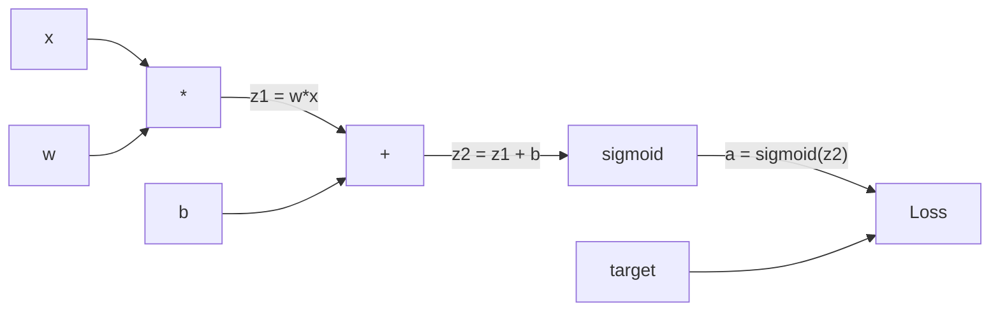
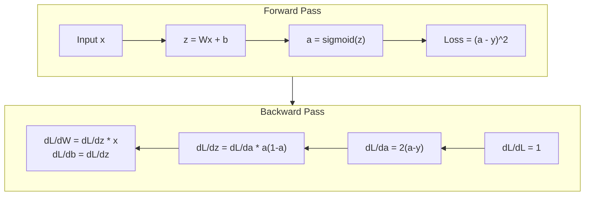

# Backpropagation from Scratch

> Backpropagation is the algorithm that makes learning possible. Without it, neural networks are just expensive random number generators.

**Type:** Build
**Languages:** Python
**Prerequisites:** Lesson 03.02 (Multi-Layer Networks)
**Time:** ~120 minutes

## Learning Objectives

- Implement a Value-based autograd engine that builds a computational graph and computes gradients via topological sort
- Derive the backward pass for addition, multiplication, and sigmoid using the chain rule
- Train a multi-layer network on XOR and circle classification using only your from-scratch backpropagation engine
- Identify the vanishing gradient problem in deep sigmoid networks and explain why gradients shrink exponentially

## The Problem

Your network has a single hidden layer with 768 inputs and 3072 outputs. That's 2,359,296 weights. It made a wrong prediction. Which weights caused the error? Testing each weight individually means 2.3 million forward passes. Backpropagation computes all 2.3 million gradients in a single backward pass.

The naive approach takes geological time. Backpropagation solves this with one forward pass, one backward pass, all gradients computed. The trick is the chain rule from calculus, applied systematically to a computational graph.

## The Concept

### The Chain Rule, Applied to Networks

If y = f(g(x)), then dy/dx = f'(g(x)) * g'(x). You multiply derivatives along the chain. In a neural network, the "chain" is the sequence of operations from input to loss.

### Computational Graphs

Every forward pass builds a graph. Each node is an operation. Each edge carries a value forward and a gradient backward.



Forward pass: values flow left to right. Backward pass: gradients flow right to left. Every node in the graph has one job during the backward pass: take the gradient coming from above, multiply by its local derivative, and pass it down.

### Forward vs Backward



### Vanishing Gradients

Sigmoid derivative maxes out at 0.25. Three layers deep, the gradient has been multiplied by at most 0.25^3 = 0.0156. Ten layers deep: 0.25^10 = 0.000001.

```
sigmoid(z):     Output range [0, 1]
sigmoid'(z):    Max value 0.25 (at z = 0)

After 5 layers:   gradient * 0.25^5 = 0.001x original
After 10 layers:  gradient * 0.25^10 = 0.000001x original
```

This is why deep sigmoid networks are nearly impossible to train. The fix -- ReLU and its variants -- is in Lesson 04.

### Deriving Gradients for a 2-Layer Network

Forward pass:
```
z1 = W1 * x + b1
a1 = sigmoid(z1)
z2 = W2 * a1 + b2
a2 = sigmoid(z2)
L = (a2 - y)^2
```

Backward pass (chain rule step by step):
```
dL/da2 = 2(a2 - y)
da2/dz2 = a2 * (1 - a2)
dL/dz2 = dL/da2 * da2/dz2
dL/dW2 = dL/dz2 * a1
dL/db2 = dL/dz2
dL/da1 = dL/dz2 * W2
da1/dz1 = a1 * (1 - a1)
dL/dz1 = dL/da1 * da1/dz1
dL/dW1 = dL/dz1 * x
dL/db1 = dL/dz1
```

## Build It

### Step 1: The Value Node

Every number in our computation becomes a Value. It stores its data, its gradient, and how it was created.

```python
class Value:
    def __init__(self, data, children=(), op=''):
        self.data = data
        self.grad = 0.0
        self._backward = lambda: None
        self._children = set(children)
        self._op = op

    def __repr__(self):
        return f"Value(data={self.data:.4f}, grad={self.grad:.4f})"
```

### Step 2: Operations with Backward Functions

```python
def __add__(self, other):
    other = other if isinstance(other, Value) else Value(other)
    out = Value(self.data + other.data, (self, other), '+')
    def _backward():
        self.grad += out.grad
        other.grad += out.grad
    out._backward = _backward
    return out

def __mul__(self, other):
    other = other if isinstance(other, Value) else Value(other)
    out = Value(self.data * other.data, (self, other), '*')
    def _backward():
        self.grad += other.data * out.grad
        other.grad += self.data * out.grad
    out._backward = _backward
    return out
```

For addition: d(a+b)/da = 1, d(a+b)/db = 1. For multiplication: d(a*b)/da = b, d(a*b)/db = a.

### Step 3: Sigmoid and Loss

```python
import math

def sigmoid(self):
    x = self.data
    x = max(-500, min(500, x))
    s = 1.0 / (1.0 + math.exp(-x))
    out = Value(s, (self,), 'sigmoid')
    def _backward():
        self.grad += (s * (1 - s)) * out.grad
    out._backward = _backward
    return out

def mse_loss(predicted, target):
    diff = predicted + Value(-target)
    return diff * diff
```

### Step 4: Backward Pass (Topological Sort)

```python
def backward(self):
    topo = []
    visited = set()
    def build_topo(v):
        if v not in visited:
            visited.add(v)
            for child in v._children:
                build_topo(child)
            topo.append(v)
    build_topo(self)
    self.grad = 1.0
    for v in reversed(topo):
        v._backward()
```

### Step 5: Layer and Network

```python
import random

class Neuron:
    def __init__(self, n_inputs):
        scale = (2.0 / n_inputs) ** 0.5
        self.weights = [Value(random.uniform(-scale, scale)) for _ in range(n_inputs)]
        self.bias = Value(0.0)
    def __call__(self, x):
        act = sum((wi * xi for wi, xi in zip(self.weights, x)), self.bias)
        return act.sigmoid()
    def parameters(self):
        return self.weights + [self.bias]

class Layer:
    def __init__(self, n_inputs, n_outputs):
        self.neurons = [Neuron(n_inputs) for _ in range(n_outputs)]
    def __call__(self, x):
        out = [n(x) for n in self.neurons]
        return out[0] if len(out) == 1 else out
    def parameters(self):
        return [p for n in self.neurons for p in n.parameters()]

class Network:
    def __init__(self, sizes):
        self.layers = [Layer(sizes[i], sizes[i+1]) for i in range(len(sizes)-1)]
    def __call__(self, x):
        for layer in self.layers:
            x = layer(x)
            if not isinstance(x, list): x = [x]
        return x[0] if len(x) == 1 else x
    def parameters(self):
        return [p for l in self.layers for p in l.parameters()]
    def zero_grad(self):
        for p in self.parameters(): p.grad = 0.0
```

### Step 6: Train on XOR

```python
random.seed(42)
net = Network([2, 4, 1])

xor_data = [
    ([0.0, 0.0], 0.0), ([0.0, 1.0], 1.0),
    ([1.0, 0.0], 1.0), ([1.0, 1.0], 0.0),
]

learning_rate = 1.0
for epoch in range(1000):
    total_loss = Value(0.0)
    for inputs, target in xor_data:
        x = [Value(i) for i in inputs]
        pred = net(x)
        loss = mse_loss(pred, target)
        total_loss = total_loss + loss
    net.zero_grad()
    total_loss.backward()
    for p in net.parameters():
        p.data -= learning_rate * p.grad
```

Watch the loss decrease. From random predictions to correct XOR outputs, driven entirely by backpropagation.

### Step 7: Circle Classification

```python
random.seed(7)

def generate_circle_data(n=100):
    data = []
    for _ in range(n):
        x1 = random.uniform(-1.5, 1.5)
        x2 = random.uniform(-1.5, 1.5)
        label = 1.0 if x1 * x1 + x2 * x2 < 1.0 else 0.0
        data.append(([x1, x2], label))
    return data

circle_data = generate_circle_data(80)
circle_net = Network([2, 8, 1])

for epoch in range(2000):
    random.shuffle(circle_data)
    for inputs, target in circle_data:
        x = [Value(i) for i in inputs]
        pred = circle_net(x)
        loss = mse_loss(pred, target)
        circle_net.zero_grad()
        loss.backward()
        for p in circle_net.parameters():
            p.data -= 0.5 * p.grad
```

The network discovers the circular decision boundary on its own. No hand-tuning.

## Use It

PyTorch does everything above in a few lines:

```python
import torch
import torch.nn as nn

model = nn.Sequential(
    nn.Linear(2, 4), nn.Sigmoid(),
    nn.Linear(4, 1), nn.Sigmoid(),
)
optimizer = torch.optim.SGD(model.parameters(), lr=1.0)
criterion = nn.MSELoss()

for epoch in range(1000):
    pred = model(X)
    loss = criterion(pred, y)
    optimizer.zero_grad()
    loss.backward()
    optimizer.step()
```

`loss.backward()` is your `total_loss.backward()`. `optimizer.step()` is your manual `p.data -= lr * p.grad`. Same algorithm, industrial-strength implementation.

## Key Terms

| Term | What people say | What it actually means |
|------|----------------|----------------------|
| Backpropagation | "The network learns" | Algorithm that computes dL/dw for every weight using the chain rule backward through the graph |
| Computational graph | "The network structure" | A DAG where nodes are operations and edges carry values (forward) and gradients (backward) |
| Chain rule | "Multiply the derivatives" | The mathematical foundation of backpropagation |
| Gradient | "Direction of steepest ascent" | Partial derivative of loss with respect to a parameter |
| Vanishing gradient | "Deep networks don't learn" | Gradients shrink exponentially through saturating activations like sigmoid |
| Forward pass | "Running the network" | Computing output from inputs and storing intermediate values |
| Backward pass | "Computing gradients" | Traversing the graph in reverse, accumulating gradients |
| Learning rate | "How fast it learns" | Step size when updating weights |
| Topological sort | "The right order" | Ordering graph nodes so gradients are fully accumulated before propagation |
| Autograd | "Automatic differentiation" | System that builds computational graphs and automatically computes gradients |

## Exercises

1. Add `__sub__` and `__neg__` to Value. Verify gradients with a manual calculation for `(a - b)^2`.
2. Add a `relu` method to Value. Replace sigmoid with relu in hidden layers and compare convergence speed.
3. Implement `__pow__` on Value. Use it to replace `mse_loss` with `(predicted - target) ** 2`.
4. Add gradient clipping to the training loop. Train a deeper network (4+ layers) with and without clipping.
5. After training on XOR, print the gradient of every parameter. Identify which layer has the smallest gradients.

## Further Reading

- Rumelhart, Hinton & Williams, "Learning representations by back-propagating errors" (1986)
- 3Blue1Brown, "Neural Networks" series (https://www.youtube.com/playlist?list=PLZHQObOWTQDNU6R1_67000Dx_ZCJB-3pi)

[Reference](https://github.com/rohitg00/ai-engineering-from-scratch/tree/main/phases/03-deep-learning-core/03-backpropagation)
