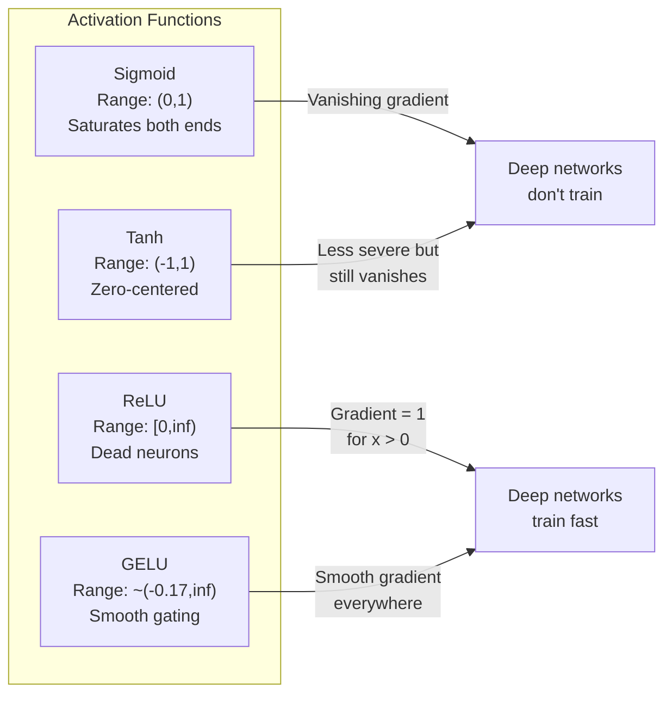
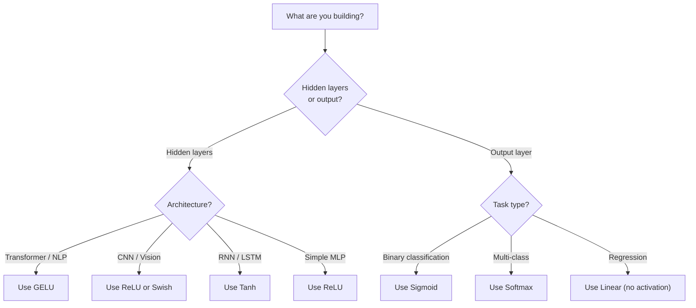

# Activation Functions

> Without nonlinearity, your 100-layer network is a fancy matrix multiply. Activations are the gates that let neural networks think in curves.

**Type:** Build
**Languages:** Python
**Prerequisites:** Lesson 03.03 (Backpropagation)
**Time:** ~75 minutes

## Learning Objectives

- Implement sigmoid, tanh, ReLU, Leaky ReLU, GELU, Swish, and softmax with their derivatives from scratch
- Diagnose the vanishing gradient problem by measuring activation magnitudes through 10+ layers with different activations
- Detect dead neurons in a ReLU network and explain why GELU avoids this failure mode
- Select the correct activation function for a given architecture (transformer, CNN, RNN, output layer)

## The Problem

Stack two linear transformations: y = W2(W1x + b1) + b2 = (W2W1)x + (W2b1 + b2). That's just y = Ax + c -- a single linear transformation. No matter how many linear layers you stack, the result collapses to one matrix multiply.

Without activation functions, depth is an illusion. Activation functions break the linearity, giving the network the ability to bend decision boundaries and approximate arbitrary functions.

## The Concept

### Why Nonlinearity Is Necessary

A linear layer computes f(x) = Wx + b. Stack two: y = W2(W1x + b1) + b2 = (W2W1)x + (W2b1 + b2) = Ax + c. One layer. Insert a nonlinear activation g() between layers and now the substitution breaks: W2 * g(W1x + b1) + b2 cannot be reduced to a single linear transformation.

### Sigmoid

```
sigmoid(x) = 1 / (1 + e^(-x))
sigmoid'(x) = sigmoid(x) * (1 - sigmoid(x))
```

Output range: (0, 1). Maximum derivative is 0.25. After 10 layers: 0.25^10 = 0.000001. The vanishing gradient problem. Additionally, outputs are always positive, causing zig-zagging during gradient descent.

### Tanh

```
tanh(x) = (e^x - e^(-x)) / (e^x + e^(-x))
tanh'(x) = 1 - tanh(x)^2
```

Output range: (-1, 1). Zero-centered, eliminates the zig-zag problem. Maximum derivative is 1.0, but still saturates at extremes.

### ReLU: The Breakthrough

```
relu(x) = max(0, x)
relu'(x) = 1 if x > 0, 0 if x <= 0
```

No vanishing gradient for positive inputs -- gradient is exactly 1. But there is the dead neuron problem: if a neuron's input is always negative, it outputs zero, gradient is zero, and it never updates.

### Leaky ReLU

```
leaky_relu(x) = x if x > 0, alpha * x if x <= 0
```

Where alpha is typically 0.01. The negative side has a small slope, so dead neurons can recover.

### GELU: The Modern Default

Default activation in BERT, GPT, and most modern transformers.

```
gelu(x) = x * Phi(x)
gelu(x) ~= 0.5 * x * (1 + tanh(sqrt(2/pi) * (x + 0.044715 * x^3)))
```

GELU is smooth everywhere, allows small negative values, and has a probabilistic interpretation. It avoids the dead neuron problem entirely.

### Swish / SiLU

```
swish(x) = x * sigmoid(x)
```

Discovered through automated search. Similar to GELU in practice. Used in EfficientNet and some vision models.

### Softmax: The Output Activation

```
softmax(x_i) = e^(x_i) / sum(e^(x_j) for all j)
```

Converts raw scores into a probability distribution. Every output is between 0 and 1, all sum to 1. Standard for multi-class classification.

### Comparison of Shapes



### Which Activation When



## Build It

### Step 1: Implement All Activation Functions with Derivatives

```python
import math

def sigmoid(x):
    x = max(-500, min(500, x))
    return 1.0 / (1.0 + math.exp(-x))

def sigmoid_derivative(x):
    s = sigmoid(x)
    return s * (1 - s)

def tanh_act(x):
    return math.tanh(x)

def tanh_derivative(x):
    t = math.tanh(x)
    return 1 - t * t

def relu(x):
    return max(0.0, x)

def relu_derivative(x):
    return 1.0 if x > 0 else 0.0

def leaky_relu(x, alpha=0.01):
    return x if x > 0 else alpha * x

def leaky_relu_derivative(x, alpha=0.01):
    return 1.0 if x > 0 else alpha

def gelu(x):
    return 0.5 * x * (1 + math.tanh(math.sqrt(2 / math.pi) * (x + 0.044715 * x ** 3)))

def gelu_derivative(x):
    phi = 0.5 * (1 + math.erf(x / math.sqrt(2)))
    pdf = math.exp(-0.5 * x * x) / math.sqrt(2 * math.pi)
    return phi + x * pdf

def swish(x):
    return x * sigmoid(x)

def swish_derivative(x):
    s = sigmoid(x)
    return s + x * s * (1 - s)

def softmax(xs):
    max_x = max(xs)
    exps = [math.exp(x - max_x) for x in xs]
    total = sum(exps)
    return [e / total for e in exps]
```

### Step 2: Vanishing Gradient Experiment

```python
def vanishing_gradient_experiment(activation_fn, name, n_layers=10, n_inputs=5):
    random.seed(42)
    values = [random.gauss(0, 1) for _ in range(n_inputs)]
    print(f"\n{name} through {n_layers} layers:")
    for layer in range(n_layers):
        weights = [random.gauss(0, 1) for _ in range(n_inputs)]
        z = sum(w * v for w, v in zip(weights, values))
        activated = activation_fn(z)
        magnitude = abs(activated)
        print(f"  Layer {layer+1:2d}: magnitude = {magnitude:.6f}")
        values = [activated] * n_inputs

vanishing_gradient_experiment(sigmoid, "Sigmoid")
vanishing_gradient_experiment(relu, "ReLU")
```

### Step 3: Dead Neuron Detector

```python
def dead_neuron_detector(n_inputs=5, hidden_size=20, n_samples=1000):
    random.seed(0)
    weights = [[random.gauss(0, 1) for _ in range(n_inputs)] for _ in range(hidden_size)]
    biases = [random.gauss(0, 1) for _ in range(hidden_size)]
    fire_counts = [0] * hidden_size
    for _ in range(n_samples):
        inputs = [random.gauss(0, 1) for _ in range(n_inputs)]
        for neuron_idx in range(hidden_size):
            z = sum(w * x for w, x in zip(weights[neuron_idx], inputs)) + biases[neuron_idx]
            if relu(z) > 0: fire_counts[neuron_idx] += 1
    dead = sum(1 for c in fire_counts if c == 0)
    print(f"Dead (never fired): {dead}, Healthy: {hidden_size - dead}")
```

## Use It

PyTorch provides all of these as both functional and module forms:

```python
import torch
import torch.nn as nn
import torch.nn.functional as F

x = torch.randn(4, 10)
relu_out = F.relu(x)
gelu_out = F.gelu(x)
sigmoid_out = torch.sigmoid(x)
probs = F.softmax(logits, dim=1)

model = nn.Sequential(
    nn.Linear(10, 64), nn.GELU(),
    nn.Linear(64, 32), nn.GELU(),
    nn.Linear(32, 5),
)
```

Hidden layers in a transformer: GELU. Hidden layers in a CNN: ReLU. Output layer for classification: softmax. Output layer for probabilities: sigmoid.

## Key Terms

| Term | What people say | What it actually means |
|------|----------------|----------------------|
| Activation function | "The nonlinear part" | A function applied after each neuron that breaks linearity |
| Vanishing gradient | "Gradients disappear" | Gradients shrink exponentially through layers with saturating activations |
| Exploding gradient | "Gradients blow up" | Gradients grow exponentially, causing unstable training |
| Dead neuron | "A neuron that stopped learning" | A ReLU neuron whose input is permanently negative, producing zero gradient |
| Sigmoid | "Squishes values to 0-1" | 1/(1+e^-x), historically important but causes vanishing gradients |
| ReLU | "Clips negatives to zero" | max(0, x), the activation that made deep learning practical |
| GELU | "The transformer activation" | Gaussian Error Linear Unit, smooth activation used in BERT/GPT |
| Swish/SiLU | "Self-gated ReLU" | x * sigmoid(x), discovered through automated search |
| Softmax | "Turns scores into probabilities" | Normalizes logits into a probability distribution |
| Leaky ReLU | "ReLU that doesn't die" | max(alpha*x, x) where alpha is small, preventing dead neurons |

## Exercises

1. Implement Parametric ReLU (PReLU) where alpha is a learnable parameter. Train it on the circle dataset.
2. Run the vanishing gradient experiment with 50 layers for sigmoid, tanh, ReLU, and GELU.
3. Implement ELU. Compare its dead neuron rate to ReLU.
4. Build a "gradient health monitor" that warns when any layer's gradient drops below 0.001.
5. Modify the training comparison to use XOR instead of circles. Which activation converges fastest?

## Further Reading

- Nair & Hinton, "Rectified Linear Units Improve Restricted Boltzmann Machines" (2010)
- Hendrycks & Gimpel, "Gaussian Error Linear Units (GELUs)" (2016)
- Ramachandran et al., "Searching for Activation Functions" (2017)
- Glorot & Bengio, "Understanding the difficulty of training deep feedforward neural networks" (2010)

[Reference](https://github.com/rohitg00/ai-engineering-from-scratch/tree/main/phases/03-deep-learning-core/04-activation-functions)
