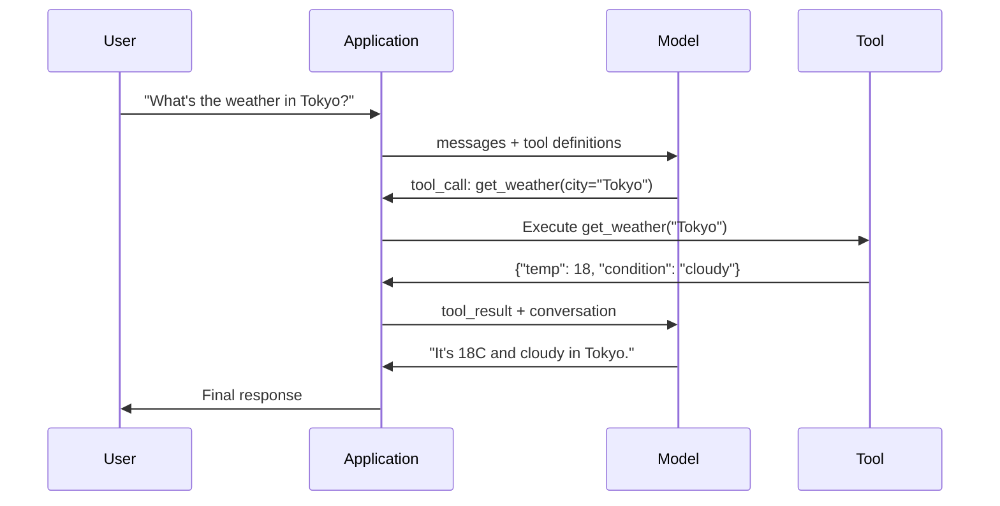

# Function Calling, LangGraph & Framework Tradeoffs

> Combined lessons (3 parts), merged verbatim — no content removed.

**Type:** Combined

---

## Part 1 (ch213): Function Calling & Tool Use

> LLMs cannot do anything. They generate text. That is the entire capability. They cannot check the weather, query a database, send an email, run code, or read a file. Every "AI agent" you have ever seen is an LLM generating JSON that says which function to call -- and then your code actually calling it. The model is the brain. Tools are the hands. Function calling is the nervous system connecting them.

**Type:** Build
**Languages:** Python
**Prerequisites:** Phase 11 Lesson 03 (Structured Outputs)
**Time:** ~75 minutes
**Related:** Phase 11 · 14 (Model Context Protocol) -- when a tool is shared across hosts, graduate from inline function-calling to an MCP server. This lesson covers the inline case; MCP covers the protocol case.

## Learning Objectives

- Implement a function calling loop: define tool schemas, parse the model's tool-call JSON, execute functions, and return results
- Design tool schemas with clear descriptions and typed parameters that the model can reliably invoke
- Build a multi-turn agent loop that chains multiple function calls to answer complex queries
- Handle function calling edge cases: parallel tool calls, error propagation, and preventing infinite tool loops

## The Problem

You build a chatbot. A user asks: "What's the weather in Tokyo right now?"

The model responds: "I don't have access to real-time weather data, but based on the season, Tokyo is likely around 15 degrees Celsius..."

That is a hallucination dressed in a disclaimer. The model does not know the weather. It never will. Weather changes every hour. The model's training data is months old.

The correct answer requires calling the OpenWeatherMap API, getting the current temperature, and returning the real number. The model cannot call APIs. Your code can. The missing piece: a structured protocol that lets the model say "I need to call the weather API with these arguments" and lets your code execute it and feed the result back.

This is function calling. The model outputs structured JSON describing which function to invoke with what arguments. Your application executes the function. The result goes back into the conversation. The model uses the result to produce its final answer.

Without function calling, LLMs are encyclopedias. With it, they become agents.

## The Concept

### The Function Calling Loop

Every tool-use interaction follows the same 5-step loop.



Step 1: the user sends a message. Step 2: the model receives the message along with tool definitions (JSON Schema describing available functions). Step 3: instead of responding with text, the model outputs a tool call -- a structured JSON object with the function name and arguments. Step 4: your code executes the function and captures the result. Step 5: the result goes back to the model, which now has real data to produce its final answer.

The model never executes anything. It only decides what to call and with what arguments. Your code is the executor.

### Tool Definitions: The JSON Schema Contract

Each tool is defined by a JSON Schema that tells the model what the function does, what arguments it takes, and what types those arguments must be.

```json
{
  "type": "function",
  "function": {
    "name": "get_weather",
    "description": "Get current weather for a city. Returns temperature in Celsius and conditions.",
    "parameters": {
      "type": "object",
      "properties": {
        "city": {
          "type": "string",
          "description": "City name, e.g. 'Tokyo' or 'San Francisco'"
        },
        "units": {
          "type": "string",
          "enum": ["celsius", "fahrenheit"],
          "description": "Temperature units"
        }
      },
      "required": ["city"]
    }
  }
}
```

The `description` fields are critical. The model reads them to decide when and how to use the tool. A vague description like "gets weather" produces worse tool selection than "Get current weather for a city. Returns temperature in Celsius and conditions." The description is a prompt for tool selection.

### Provider Comparison

Every major provider supports function calling, but the API surface differs.

| Provider | API Parameter | Tool Call Format | Parallel Calls | Forced Calling |
|----------|--------------|-----------------|---------------|----------------|
| OpenAI (GPT-5, o4) | `tools` | `tool_calls[].function` | Yes (multiple per turn) | `tool_choice="required"` |
| Anthropic (Claude 4.6/4.7) | `tools` | `content[].type="tool_use"` | Yes (multiple blocks) | `tool_choice={"type":"any"}` |
| Google (Gemini 3) | `function_declarations` | `functionCall` | Yes | `function_calling_config` |
| Open-weight (Llama 4, Qwen3, DeepSeek-V3) | Native `tools` on Llama 4; Hermes or ChatML on others | Mixed | Model-dependent | Prompt-based or `tool_choice` if supported |

By 2026 the three closed providers have converged on near-identical JSON-Schema-based formats. Llama 4 ships with a native `tools` field that matches OpenAI's shape. Open-weight fine-tunes still vary -- the Hermes format (NousResearch) is the most common for third-party fine-tunes. For shared tools across hosts, prefer MCP (Phase 11 · 14) over inline function-calling -- the server is the same for all of them.

### Tool Choice: Auto, Required, Specific

You control when the model uses tools.

**Auto** (default): the model decides whether to call a tool or respond directly. "What's 2+2?" -- responds directly. "What's the weather?" -- calls the tool.

**Required**: the model must call at least one tool. Use this when you know the user's intent requires a tool. Prevents the model from guessing instead of looking up real data.

**Specific function**: force the model to call a particular function. `tool_choice={"type":"function", "function": {"name": "get_weather"}}` guarantees the weather tool is called, regardless of the query. Use this for routing -- when upstream logic already determined which tool is needed.

### Parallel Function Calling

GPT-4o and Claude can call multiple functions in a single turn. A user asks: "What's the weather in Tokyo and New York?" The model outputs two tool calls simultaneously:

```json
[
  {"name": "get_weather", "arguments": {"city": "Tokyo"}},
  {"name": "get_weather", "arguments": {"city": "New York"}}
]
```

Your code executes both (ideally concurrently), returns both results, and the model synthesizes a single response. This cuts round trips from 2 to 1. For agents with 5-10 tool calls per query, parallel calling reduces latency by 60-80%.

### Structured Outputs vs Function Calling

Lesson 03 covered structured outputs. Function calling uses the same JSON Schema machinery, but for a different purpose.

**Structured outputs**: force the model to produce data in a specific shape. The output is the final product. Example: extract product info from text as `{name, price, in_stock}`.

**Function calling**: the model declares an intent to execute an action. The output is an intermediate step. Example: `get_weather(city="Tokyo")` -- the model is requesting an action, not producing the final answer.

Use structured outputs when you want data extraction. Use function calling when you want the model to interact with external systems.

### Security: The Non-Negotiable Rules

Function calling is the most dangerous capability you can give an LLM. The model chooses what to execute. If your tool set includes database queries, the model constructs the queries. If it includes shell commands, the model writes them.

**Rule 1: Never pass model-generated SQL directly to a database.** The model can and will generate DROP TABLE, UNION injections, or queries that return every row. Always parameterize. Always validate. Always use an allowlist of operations.

**Rule 2: Allowlist functions.** The model can only call functions you explicitly define. Never build a generic "execute any function by name" tool. If you have 50 internal functions, expose only the 5 the user needs.

**Rule 3: Validate arguments.** The model might pass a city name of `"; DROP TABLE users; --"`. Validate every argument against expected types, ranges, and formats before execution.

**Rule 4: Sanitize tool results.** If a tool returns sensitive data (API keys, PII, internal errors), filter it before sending it back to the model. The model will include tool results in its response verbatim.

**Rule 5: Rate limit tool calls.** A model in a loop can call tools hundreds of times. Set a maximum (10-20 calls per conversation is reasonable). Break infinite loops.

### Error Handling

Tools fail. APIs time out. Databases go down. Files do not exist. The model needs to know when a tool fails and why.

Return errors as structured tool results, not exceptions:

```json
{
  "error": true,
  "message": "City 'Toky' not found. Did you mean 'Tokyo'?",
  "code": "CITY_NOT_FOUND"
}
```

The model reads this, adjusts its arguments, and retries. Models are good at self-correcting from structured error messages. They are bad at recovering from empty responses or generic "something went wrong" errors.

### MCP: Model Context Protocol

MCP is Anthropic's open standard for tool interoperability. Instead of every application defining its own tools, MCP provides a universal protocol: tools are served by MCP servers, consumed by MCP clients (like Claude Code, Cursor, or your application).

One MCP server can expose tools to any compatible client. A Postgres MCP server gives any MCP-compatible agent database access. A GitHub MCP server gives any agent repository access. The tools are defined once, used everywhere.

MCP is to function calling what HTTP is to networking. It standardizes the transport layer so tools become portable.

## Build It

### Step 1: Define the Tool Registry

Build a registry that stores tool definitions and their implementations. Each tool has a JSON Schema definition (what the model sees) and a Python function (what your code executes).

```python
import json
import math
import time
import hashlib


TOOL_REGISTRY = {}


def register_tool(name, description, parameters, function):
    TOOL_REGISTRY[name] = {
        "definition": {
            "type": "function",
            "function": {
                "name": name,
                "description": description,
                "parameters": parameters,
            },
        },
        "function": function,
    }
```

### Step 2: Implement 5 Tools

Build a calculator, weather lookup, web search simulator, file reader, and code runner.

```python
def calculator(expression, precision=2):
    allowed = set("0123456789+-*/.() ")
    if not all(c in allowed for c in expression):
        return {"error": True, "message": f"Invalid characters in expression: {expression}"}
    try:
        result = eval(expression, {"__builtins__": {}}, {"math": math})
        return {"result": round(float(result), precision), "expression": expression}
    except Exception as e:
        return {"error": True, "message": str(e)}


WEATHER_DB = {
    "tokyo": {"temp_c": 18, "condition": "cloudy", "humidity": 72, "wind_kph": 14},
    "new york": {"temp_c": 22, "condition": "sunny", "humidity": 45, "wind_kph": 8},
    "london": {"temp_c": 12, "condition": "rainy", "humidity": 88, "wind_kph": 22},
    "san francisco": {"temp_c": 16, "condition": "foggy", "humidity": 80, "wind_kph": 18},
    "sydney": {"temp_c": 25, "condition": "sunny", "humidity": 55, "wind_kph": 10},
}


def get_weather(city, units="celsius"):
    key = city.lower().strip()
    if key not in WEATHER_DB:
        suggestions = [c for c in WEATHER_DB if c.startswith(key[:3])]
        return {
            "error": True,
            "message": f"City '{city}' not found.",
            "suggestions": suggestions,
            "code": "CITY_NOT_FOUND",
        }
    data = WEATHER_DB[key].copy()
    if units == "fahrenheit":
        data["temp_f"] = round(data["temp_c"] * 9 / 5 + 32, 1)
        del data["temp_c"]
    data["city"] = city
    return data


SEARCH_DB = {
    "python function calling": [
        {"title": "OpenAI Function Calling Guide", "url": "https://platform.openai.com/docs/guides/function-calling", "snippet": "Learn how to connect LLMs to external tools."},
        {"title": "Anthropic Tool Use", "url": "https://docs.anthropic.com/en/docs/tool-use", "snippet": "Claude can interact with external tools and APIs."},
    ],
    "MCP protocol": [
        {"title": "Model Context Protocol", "url": "https://modelcontextprotocol.io", "snippet": "An open standard for connecting AI models to data sources."},
    ],
    "weather API": [
        {"title": "OpenWeatherMap API", "url": "https://openweathermap.org/api", "snippet": "Free weather API with current, forecast, and historical data."},
    ],
}


def web_search(query, max_results=3):
    key = query.lower().strip()
    for db_key, results in SEARCH_DB.items():
        if db_key in key or key in db_key:
            return {"query": query, "results": results[:max_results], "total": len(results)}
    return {"query": query, "results": [], "total": 0}


FILE_SYSTEM = {
    "data/config.json": '{"model": "gpt-4o", "temperature": 0.7, "max_tokens": 4096}',
    "data/users.csv": "name,email,role\nAlice,alice@example.com,admin\nBob,bob@example.com,user",
    "README.md": "# My Project\nA tool-use agent built from scratch.",
}


def read_file(path):
    if ".." in path or path.startswith("/"):
        return {"error": True, "message": "Path traversal not allowed.", "code": "FORBIDDEN"}
    if path not in FILE_SYSTEM:
        available = list(FILE_SYSTEM.keys())
        return {"error": True, "message": f"File '{path}' not found.", "available_files": available, "code": "NOT_FOUND"}
    content = FILE_SYSTEM[path]
    return {"path": path, "content": content, "size_bytes": len(content), "lines": content.count("\n") + 1}


def run_code(code, language="python"):
    if language != "python":
        return {"error": True, "message": f"Language '{language}' not supported. Only 'python' is available."}
    forbidden = ["import os", "import sys", "import subprocess", "exec(", "eval(", "__import__", "open("]
    for pattern in forbidden:
        if pattern in code:
            return {"error": True, "message": f"Forbidden operation: {pattern}", "code": "SECURITY_VIOLATION"}
    try:
        local_vars = {}
        exec(code, {"__builtins__": {"print": print, "range": range, "len": len, "str": str, "int": int, "float": float, "list": list, "dict": dict, "sum": sum, "min": min, "max": max, "abs": abs, "round": round, "sorted": sorted, "enumerate": enumerate, "zip": zip, "map": map, "filter": filter, "math": math}}, local_vars)
        result = local_vars.get("result", None)
        return {"success": True, "result": result, "variables": {k: str(v) for k, v in local_vars.items() if not k.startswith("_")}}
    except Exception as e:
        return {"error": True, "message": f"{type(e).__name__}: {e}"}
```

### Step 3: Register All Tools

```python
def register_all_tools():
    register_tool(
        "calculator", "Evaluate a mathematical expression. Supports +, -, *, /, parentheses, and decimals. Returns the numeric result.",
        {"type": "object", "properties": {"expression": {"type": "string", "description": "Math expression, e.g. '(10 + 5) * 3'"}, "precision": {"type": "integer", "description": "Decimal places in result", "default": 2}}, "required": ["expression"]},
        calculator,
    )
    register_tool(
        "get_weather", "Get current weather for a city. Returns temperature, condition, humidity, and wind speed.",
        {"type": "object", "properties": {"city": {"type": "string", "description": "City name, e.g. 'Tokyo' or 'San Francisco'"}, "units": {"type": "string", "enum": ["celsius", "fahrenheit"], "description": "Temperature units, defaults to celsius"}}, "required": ["city"]},
        get_weather,
    )
    register_tool(
        "web_search", "Search the web for information. Returns a list of results with title, URL, and snippet.",
        {"type": "object", "properties": {"query": {"type": "string", "description": "Search query"}, "max_results": {"type": "integer", "description": "Maximum results to return", "default": 3}}, "required": ["query"]},
        web_search,
    )
    register_tool(
        "read_file", "Read the contents of a file. Returns the file content, size, and line count.",
        {"type": "object", "properties": {"path": {"type": "string", "description": "Relative file path, e.g. 'data/config.json'"}}, "required": ["path"]},
        read_file,
    )
    register_tool(
        "run_code", "Execute Python code in a sandboxed environment. Set a 'result' variable to return output.",
        {"type": "object", "properties": {"code": {"type": "string", "description": "Python code to execute"}, "language": {"type": "string", "enum": ["python"], "description": "Programming language"}}, "required": ["code"]},
        run_code,
    )
```

### Step 4: Build the Function Calling Loop

This is the core engine. It simulates the model deciding which tool to call, executes the tool, and feeds results back.

```python
def simulate_model_decision(user_message, tools, conversation_history):
    msg = user_message.lower()

    if any(word in msg for word in ["weather", "temperature", "forecast"]):
        cities = []
        for city in WEATHER_DB:
            if city in msg:
                cities.append(city)
        if not cities:
            for word in msg.split():
                if word.capitalize() in [c.title() for c in WEATHER_DB]:
                    cities.append(word)
        if not cities:
            cities = ["tokyo"]
        calls = []
        for city in cities:
            calls.append({"name": "get_weather", "arguments": {"city": city.title()}})
        return calls

    if any(word in msg for word in ["calculate", "compute", "math", "what is", "how much"]):
        for token in msg.split():
            if any(c in token for c in "+-*/"):
                return [{"name": "calculator", "arguments": {"expression": token}}]
        if "+" in msg or "-" in msg or "*" in msg or "/" in msg:
            expr = "".join(c for c in msg if c in "0123456789+-*/.() ")
            if expr.strip():
                return [{"name": "calculator", "arguments": {"expression": expr.strip()}}]
        return [{"name": "calculator", "arguments": {"expression": "0"}}]

    if any(word in msg for word in ["search", "find", "look up", "google"]):
        query = msg.replace("search for", "").replace("look up", "").replace("find", "").strip()
        return [{"name": "web_search", "arguments": {"query": query}}]

    if any(word in msg for word in ["read", "file", "open", "cat", "show"]):
        for path in FILE_SYSTEM:
            if path.split("/")[-1].split(".")[0] in msg:
                return [{"name": "read_file", "arguments": {"path": path}}]
        return [{"name": "read_file", "arguments": {"path": "README.md"}}]

    if any(word in msg for word in ["run", "execute", "code", "python"]):
        return [{"name": "run_code", "arguments": {"code": "result = 'Hello from the sandbox!'", "language": "python"}}]

    return []


def execute_tool_call(tool_call):
    name = tool_call["name"]
    args = tool_call["arguments"]

    if name not in TOOL_REGISTRY:
        return {"error": True, "message": f"Unknown tool: {name}", "code": "UNKNOWN_TOOL"}

    tool = TOOL_REGISTRY[name]
    func = tool["function"]
    start = time.time()

    try:
        result = func(**args)
    except TypeError as e:
        result = {"error": True, "message": f"Invalid arguments: {e}"}

    elapsed_ms = round((time.time() - start) * 1000, 2)
    return {"tool": name, "result": result, "execution_time_ms": elapsed_ms}


def run_function_calling_loop(user_message, max_iterations=5):
    conversation = [{"role": "user", "content": user_message}]
    tool_definitions = [t["definition"] for t in TOOL_REGISTRY.values()]
    all_tool_results = []

    for iteration in range(max_iterations):
        tool_calls = simulate_model_decision(user_message, tool_definitions, conversation)

        if not tool_calls:
            break

        results = []
        for call in tool_calls:
            result = execute_tool_call(call)
            results.append(result)

        conversation.append({"role": "assistant", "content": None, "tool_calls": tool_calls})

        for result in results:
            conversation.append({"role": "tool", "content": json.dumps(result["result"]), "tool_name": result["tool"]})

        all_tool_results.extend(results)
        break

    return {"conversation": conversation, "tool_results": all_tool_results, "iterations": iteration + 1 if tool_calls else 0}
```

### Step 5: Argument Validation

Build a validator that checks tool call arguments against the JSON Schema before execution.

```python
def validate_tool_arguments(tool_name, arguments):
    if tool_name not in TOOL_REGISTRY:
        return [f"Unknown tool: {tool_name}"]

    schema = TOOL_REGISTRY[tool_name]["definition"]["function"]["parameters"]
    errors = []

    if not isinstance(arguments, dict):
        return [f"Arguments must be an object, got {type(arguments).__name__}"]

    for required_field in schema.get("required", []):
        if required_field not in arguments:
            errors.append(f"Missing required argument: {required_field}")

    properties = schema.get("properties", {})
    for arg_name, arg_value in arguments.items():
        if arg_name not in properties:
            errors.append(f"Unknown argument: {arg_name}")
            continue

        prop_schema = properties[arg_name]
        expected_type = prop_schema.get("type")

        type_checks = {"string": str, "integer": int, "number": (int, float), "boolean": bool, "array": list, "object": dict}
        if expected_type in type_checks:
            if not isinstance(arg_value, type_checks[expected_type]):
                errors.append(f"Argument '{arg_name}': expected {expected_type}, got {type(arg_value).__name__}")

        if "enum" in prop_schema and arg_value not in prop_schema["enum"]:
            errors.append(f"Argument '{arg_name}': '{arg_value}' not in {prop_schema['enum']}")

    return errors
```

### Step 6: Run the Demo

```python
def run_demo():
    register_all_tools()

    print("=" * 60)
    print("  Function Calling & Tool Use Demo")
    print("=" * 60)

    print("\n--- Registered Tools ---")
    for name, tool in TOOL_REGISTRY.items():
        desc = tool["definition"]["function"]["description"][:60]
        params = list(tool["definition"]["function"]["parameters"].get("properties", {}).keys())
        print(f"  {name}: {desc}...")
        print(f"    params: {params}")

    print(f"\n--- Argument Validation ---")
    validation_tests = [
        ("get_weather", {"city": "Tokyo"}, "Valid call"),
        ("get_weather", {}, "Missing required arg"),
        ("get_weather", {"city": "Tokyo", "units": "kelvin"}, "Invalid enum value"),
        ("calculator", {"expression": 123}, "Wrong type (int for string)"),
        ("unknown_tool", {"x": 1}, "Unknown tool"),
    ]
    for tool_name, args, label in validation_tests:
        errors = validate_tool_arguments(tool_name, args)
        status = "VALID" if not errors else f"ERRORS: {errors}"
        print(f"  {label}: {status}")

    print(f"\n--- Tool Execution ---")
    direct_tests = [
        {"name": "calculator", "arguments": {"expression": "(10 + 5) * 3 / 2"}},
        {"name": "get_weather", "arguments": {"city": "Tokyo"}},
        {"name": "get_weather", "arguments": {"city": "Mars"}},
        {"name": "web_search", "arguments": {"query": "python function calling"}},
        {"name": "read_file", "arguments": {"path": "data/config.json"}},
        {"name": "read_file", "arguments": {"path": "../etc/passwd"}},
        {"name": "run_code", "arguments": {"code": "result = sum(range(1, 101))"}},
        {"name": "run_code", "arguments": {"code": "import os; os.system('rm -rf /')"}},
    ]
    for call in direct_tests:
        result = execute_tool_call(call)
        print(f"\n  {call['name']}({json.dumps(call['arguments'])})")
        print(f"    -> {json.dumps(result['result'], indent=None)[:100]}")
        print(f"    time: {result['execution_time_ms']}ms")

    print(f"\n--- Full Function Calling Loop ---")
    test_queries = [
        "What's the weather in Tokyo?",
        "Calculate (100 + 250) * 0.15",
        "Search for MCP protocol",
        "Read the config file",
        "Run some Python code",
        "Tell me a joke",
    ]
    for query in test_queries:
        print(f"\n  User: {query}")
        result = run_function_calling_loop(query)
        if result["tool_results"]:
            for tr in result["tool_results"]:
                print(f"    Tool: {tr['tool']} ({tr['execution_time_ms']}ms)")
                print(f"    Result: {json.dumps(tr['result'], indent=None)[:90]}")
        else:
            print(f"    [No tool called -- direct response]")
        print(f"    Iterations: {result['iterations']}")

    print(f"\n--- Parallel Tool Calls ---")
    multi_city_query = "What's the weather in tokyo and london?"
    print(f"  User: {multi_city_query}")
    result = run_function_calling_loop(multi_city_query)
    print(f"  Tool calls made: {len(result['tool_results'])}")
    for tr in result["tool_results"]:
        city = tr["result"].get("city", "unknown")
        temp = tr["result"].get("temp_c", "N/A")
        print(f"    {city}: {temp}C, {tr['result'].get('condition', 'N/A')}")

    print(f"\n--- Security Checks ---")
    security_tests = [
        ("read_file", {"path": "../../etc/passwd"}),
        ("run_code", {"code": "import subprocess; subprocess.run(['ls'])"}),
        ("calculator", {"expression": "__import__('os').system('ls')"}),
    ]
    for tool_name, args in security_tests:
        result = execute_tool_call({"name": tool_name, "arguments": args})
        blocked = result["result"].get("error", False)
        print(f"  {tool_name}({list(args.values())[0][:40]}): {'BLOCKED' if blocked else 'ALLOWED'}")
```

## Use It

### OpenAI Function Calling

```python
# from openai import OpenAI
#
# client = OpenAI()
#
# tools = [{
#     "type": "function",
#     "function": {
#         "name": "get_weather",
#         "description": "Get current weather for a city",
#         "parameters": {
#             "type": "object",
#             "properties": {
#                 "city": {"type": "string"},
#                 "units": {"type": "string", "enum": ["celsius", "fahrenheit"]}
#             },
#             "required": ["city"]
#         }
#     }
# }]
#
# response = client.chat.completions.create(
#     model="gpt-4o",
#     messages=[{"role": "user", "content": "Weather in Tokyo?"}],
#     tools=tools,
#     tool_choice="auto",
# )
#
# tool_call = response.choices[0].message.tool_calls[0]
# args = json.loads(tool_call.function.arguments)
# result = get_weather(**args)
#
# final = client.chat.completions.create(
#     model="gpt-4o",
#     messages=[
#         {"role": "user", "content": "Weather in Tokyo?"},
#         response.choices[0].message,
#         {"role": "tool", "tool_call_id": tool_call.id, "content": json.dumps(result)},
#     ],
# )
# print(final.choices[0].message.content)
```

OpenAI returns tool calls as `response.choices[0].message.tool_calls`. Each call has an `id` you must include when returning the result. The model uses this ID to match results to calls. GPT-4o can return multiple tool calls in a single response -- iterate and execute all of them.

### Anthropic Tool Use

```python
# import anthropic
#
# client = anthropic.Anthropic()
#
# response = client.messages.create(
#     model="claude-sonnet-4-20250514",
#     max_tokens=1024,
#     tools=[{
#         "name": "get_weather",
#         "description": "Get current weather for a city",
#         "input_schema": {
#             "type": "object",
#             "properties": {
#                 "city": {"type": "string"},
#                 "units": {"type": "string", "enum": ["celsius", "fahrenheit"]}
#             },
#             "required": ["city"]
#         }
#     }],
#     messages=[{"role": "user", "content": "Weather in Tokyo?"}],
# )
#
# tool_block = next(b for b in response.content if b.type == "tool_use")
# result = get_weather(**tool_block.input)
#
# final = client.messages.create(
#     model="claude-sonnet-4-20250514",
#     max_tokens=1024,
#     tools=[...],
#     messages=[
#         {"role": "user", "content": "Weather in Tokyo?"},
#         {"role": "assistant", "content": response.content},
#         {"role": "user", "content": [{"type": "tool_result", "tool_use_id": tool_block.id, "content": json.dumps(result)}]},
#     ],
# )
```

Anthropic returns tool calls as content blocks with `type: "tool_use"`. The tool result goes in a user message with `type: "tool_result"`. Note the key difference: Anthropic uses `input_schema` for tool parameter definitions, while OpenAI uses `parameters`.

### MCP Integration

```python
# MCP servers expose tools over a standardized protocol.
# Any MCP-compatible client can discover and call these tools.
#
# Example: connecting to a Postgres MCP server
#
# from mcp import ClientSession, StdioServerParameters
# from mcp.client.stdio import stdio_client
#
# server_params = StdioServerParameters(
#     command="npx",
#     args=["-y", "@modelcontextprotocol/server-postgres", "postgresql://localhost/mydb"],
# )
#
# async with stdio_client(server_params) as (read, write):
#     async with ClientSession(read, write) as session:
#         await session.initialize()
#         tools = await session.list_tools()
#         result = await session.call_tool("query", {"sql": "SELECT count(*) FROM users"})
```

MCP decouples tool implementation from tool consumption. The Postgres server knows SQL. The GitHub server knows the API. Your agent just discovers and calls tools -- it does not need provider-specific code for each integration.

## Ship It

This lesson produces `outputs/prompt-tool-designer.md` -- a reusable prompt template for designing tool definitions. Give it a description of what you want a tool to do, and it produces the complete JSON Schema definition with descriptions, types, and constraints.

It also produces `outputs/skill-function-calling-patterns.md` -- a decision framework for implementing function calling in production, covering tool design, error handling, security, and provider-specific patterns.

## Exercises

1. **Add a 6th tool: database query.** Implement a simulated SQL tool with an in-memory table. The tool accepts a table name and filter conditions (not raw SQL). Validate that the table name is in an allowlist and that filter operators are restricted to `=`, `>`, `<`, `>=`, `<=`. Return matching rows as JSON.

2. **Implement retry with error feedback.** When a tool call fails (e.g., city not found), feed the error message back to the model decision function and let it correct its arguments. Track how many retries each call takes. Set a maximum of 3 retries per tool call.

3. **Build a multi-step agent.** Some queries require chaining tool calls: "Read the config file and tell me what model is configured, then search the web for that model's pricing." Implement a loop that runs until the model decides no more tools are needed, passing accumulated results into each decision step. Limit to 10 iterations to prevent infinite loops.

4. **Measure tool selection accuracy.** Create 30 test queries with expected tool names. Run your decision function on all 30 and measure what percentage of the time it selects the correct tool. Identify which queries cause the most confusion between tools.

5. **Implement tool call caching.** If the same tool is called with identical arguments within 60 seconds, return the cached result instead of re-executing. Use a dictionary keyed by `(tool_name, frozenset(args.items()))`. Measure cache hit rates across a conversation with 20 queries.

## Key Terms

| Term | What people say | What it actually means |
|------|----------------|----------------------|
| Function calling | "Tool use" | The model outputs structured JSON describing a function to invoke with specific arguments -- your code executes it, not the model |
| Tool definition | "Function schema" | A JSON Schema object describing a tool's name, purpose, parameters, and types -- the model reads this to decide when and how to use the tool |
| Tool choice | "Calling mode" | Controls whether the model must call a tool (required), may call a tool (auto), or must call a specific tool (named) |
| Parallel calling | "Multi-tool" | The model outputs multiple tool calls in a single turn, reducing round trips -- GPT-4o and Claude both support this |
| Tool result | "Function output" | The return value from executing a tool, sent back to the model as a message so it can use real data in its response |
| Argument validation | "Input checking" | Verifying that model-generated arguments match the expected types, ranges, and constraints before executing the tool |
| MCP | "Tool protocol" | Model Context Protocol -- Anthropic's open standard for exposing tools via servers that any compatible client can discover and call |
| Agent loop | "ReAct loop" | The iterative cycle of model-decides-tool, code-executes-tool, result-feeds-back until the model has enough information to respond |
| Tool poisoning | "Prompt injection via tools" | An attack where tool results contain instructions that manipulate the model's behavior -- sanitize all tool outputs |
| Rate limiting | "Call budget" | Setting a maximum number of tool calls per conversation to prevent infinite loops and runaway API costs |

## Further Reading

- [OpenAI Function Calling Guide](https://platform.openai.com/docs/guides/function-calling) -- the definitive reference for tool use with GPT-4o, including parallel calls, forced calling, and structured arguments
- [Anthropic Tool Use Guide](https://docs.anthropic.com/en/docs/tool-use) -- Claude's tool use implementation with input_schema, multi-tool responses, and tool_choice configuration
- [Model Context Protocol Specification](https://modelcontextprotocol.io) -- the open standard for tool interoperability across AI applications, with server/client architecture
- [Schick et al., 2023 -- "Toolformer: Language Models Can Teach Themselves to Use Tools"](https://arxiv.org/abs/2302.04761) -- the foundational paper on training LLMs to decide when and how to call external tools
- [Patil et al., 2023 -- "Gorilla: Large Language Model Connected with Massive APIs"](https://arxiv.org/abs/2305.15334) -- fine-tuning LLMs for accurate API calls across 1,645 APIs with hallucination reduction
- [Berkeley Function Calling Leaderboard](https://gorilla.cs.berkeley.edu/leaderboard.html) -- real-time benchmark comparing function calling accuracy across GPT-4o, Claude, Gemini, and open models
- [Yao et al., "ReAct: Synergizing Reasoning and Acting in Language Models" (ICLR 2023)](https://arxiv.org/abs/2210.03629) -- the Thought-Action-Observation loop that is the outer agent loop around every tool call; where this lesson ends, Phase 14 picks up.
- [Anthropic -- Building effective agents (Dec 2024)](https://www.anthropic.com/research/building-effective-agents) -- five composable patterns (prompt chaining, routing, parallelization, orchestrator-workers, evaluator-optimizer) built from the single tool-use primitive.

---

## Part 2 (ch220): LangGraph — State Machines for Agents

> A ReAct loop written by hand is a `while True`. A ReAct loop written in LangGraph is a graph you can checkpoint, interrupt, branch, and time-travel through. The agent hasn't changed. The harness around it has.

**Type:** Build
**Languages:** Python
**Prerequisites:** Phase 11 · 09 (Function Calling), Phase 11 · 14 (Model Context Protocol)
**Time:** ~75 minutes

## The Problem

You ship a function-calling agent. It works for three turns, then something goes wrong: the model tries a tool that returns 500, the user changes their mind mid-task, or the agent decides to refund an order without a human signing off. The `while True:` loop has no hooks. You can't pause it, you can't rewind it, and you can't branch off into "what if the model had picked the other tool." The moment you ship this past a demo, the agent becomes a black box that either worked or didn't.

The next step is obvious once you see it. The agent is already a state machine — system prompt plus message history plus pending tool calls plus the next action. Make the state machine explicit: nodes for "the model thinks," "a tool runs," "a human approves," and edges for the conditional transitions between them. Once the graph is explicit, the harness gets four things for free: checkpointing (save state between steps), interrupts (pause for a human), streaming (stream tokens and intermediate events), and time-travel (rewind to a prior state and try a different branch).

LangGraph is the library that ships this abstraction. It is not an agent framework in the LangChain sense ("here is an AgentExecutor, good luck"). It is a graph runtime with first-class state, first-class persistence, and first-class interrupts. The agent loop is something you draw, not something you hand-write.

## The Concept


A `StateGraph` has three things.

1. **State.** A typed dict (TypedDict or Pydantic model) that flows through the graph. Every node receives the full state and returns a partial update, which LangGraph merges using a *reducer* per field — `operator.add` for lists that should accumulate, overwrite by default.
2. **Nodes.** Python functions `state -> partial_state`. Each is a discrete step: "call the model," "run tools," "summarize."
3. **Edges.** Transitions between nodes. Static edges go one place. Conditional edges take a router function `state -> next_node_name` so the graph can branch on model output.

You compile the graph. Compile binds the topology, attaches a checkpointer (optional but essential for production), and returns a runnable. You invoke it with an initial state and a `thread_id`. Every step of execution persists a checkpoint keyed on `(thread_id, checkpoint_id)`.

### The four superpowers

**Checkpointing.** Every node transition writes the new state to a store (in-memory for tests, Postgres/Redis/SQLite for prod). Resume by calling the graph again with the same `thread_id`. The graph picks up where it paused.

**Interrupts.** Mark a node with `interrupt_before=["human_review"]` and execution stops before that node runs. The state persists. Your API responds to the user with "awaiting approval." A later request to the same `thread_id` with `Command(resume=...)` resumes execution.

**Streaming.** `graph.stream(state, mode="updates")` yields state deltas as they happen. `mode="messages"` streams the LLM tokens inside model nodes. `mode="values"` yields full snapshots. You pick what to surface in your UI.

**Time-travel.** `graph.get_state_history(thread_id)` returns the full checkpoint log. Pass any prior `checkpoint_id` to `graph.invoke` and you fork from that point. Great for debugging ("what if the model had picked tool B instead?") and for regression tests that replay production traces.

### Reducers are the point

Every state field has a reducer. Most defaults are fine — a new value overwrites the old. But message lists need `operator.add` so new messages append instead of replacing. Parallel edges merge their updates through the reducer. If two nodes both update `messages` and you forgot the `Annotated[list, add_messages]`, the second wins silently and you lose half the turn. The reducer is the only subtle thing in the library; get it right and the rest composes.

### The ReAct graph in four nodes

A production ReAct agent is four nodes and two edges:

1. `agent` — calls the LLM with the current message history. Returns the assistant message (which may contain tool_calls).
2. `tools` — executes any tool_calls in the last assistant message, appends the tool results as tool messages.
3. A conditional edge from `agent` that routes to `tools` if the last message has tool_calls, else to `END`.
4. A static edge from `tools` back to `agent`.

That is it. You get the full ReAct loop (Thought → Action → Observation → Thought → …) with checkpointing, interrupts, and streaming, in roughly 40 lines of code.

### StateGraph vs Send (fanout)

`Send(node_name, state)` lets a node dispatch parallel subgraphs. Example: the agent decides to query three retrievers at once. Each `Send` spawns a parallel execution of the target node; their outputs merge through the state reducer. This is how LangGraph expresses the orchestrator-workers pattern without threading primitives.

### Subgraphs

A compiled graph can be a node in another graph. The outer graph sees a single node; the inner graph has its own state and its own checkpoints. This is how teams build supervisor-worker agents: the supervisor graph routes user intent to a per-domain worker subgraph.

## Build It

### Step 1: state and nodes

```python
from typing import Annotated, TypedDict
from langchain_core.messages import AnyMessage, HumanMessage, AIMessage
from langgraph.graph import StateGraph, END
from langgraph.graph.message import add_messages
from langgraph.prebuilt import ToolNode
from langgraph.checkpoint.memory import MemorySaver

class State(TypedDict):
    messages: Annotated[list[AnyMessage], add_messages]

def agent_node(state: State) -> dict:
    response = llm.invoke(state["messages"])
    return {"messages": [response]}

def should_continue(state: State) -> str:
    last = state["messages"][-1]
    return "tools" if getattr(last, "tool_calls", None) else END

tool_node = ToolNode(tools=[search_web, read_file])

graph = StateGraph(State)
graph.add_node("agent", agent_node)
graph.add_node("tools", tool_node)
graph.set_entry_point("agent")
graph.add_conditional_edges("agent", should_continue, {"tools": "tools", END: END})
graph.add_edge("tools", "agent")

app = graph.compile(checkpointer=MemorySaver())
```

`add_messages` is the reducer that makes the message list accumulate instead of overwrite. Forgetting it is the most common LangGraph bug.

### Step 2: run with a thread

```python
config = {"configurable": {"thread_id": "user-42"}}
for event in app.stream(
    {"messages": [HumanMessage("find the Anthropic headquarters address")]},
    config,
    stream_mode="updates",
):
    print(event)
```

Every update is a dict `{node_name: state_delta}`. Your frontend can stream these to the UI so users see "agent is thinking… calling search_web… got result… answering."

### Step 3: add a human-in-the-loop interrupt

Mark a node so execution pauses before it runs.

```python
app = graph.compile(
    checkpointer=MemorySaver(),
    interrupt_before=["tools"],  # pause before every tool call
)

state = app.invoke({"messages": [HumanMessage("delete the production database")]}, config)
# state["__interrupt__"] is set. Inspect proposed tool calls.
# If approved:
from langgraph.types import Command
app.invoke(Command(resume=True), config)
# If denied: write a rejection message and resume
app.update_state(config, {"messages": [AIMessage("Blocked by human reviewer.")]})
```

The state, the checkpoint, and the thread all persist across the interrupt. Nothing is in memory except during execution.

### Step 4: time-travel for debugging

```python
history = list(app.get_state_history(config))
for snapshot in history:
    print(snapshot.values["messages"][-1].content[:80], snapshot.config)

# Fork from a prior checkpoint
target = history[3].config  # three steps back
for event in app.stream(None, target, stream_mode="values"):
    pass  # replay from that point forward
```

Passing `None` as the input replays from the given checkpoint; passing a value appends it as an update to that checkpoint's state before resuming. This is how you reproduce a bad agent run without re-running the whole conversation.

### Step 5: swap the checkpointer for production

```python
from langgraph.checkpoint.postgres import PostgresSaver

with PostgresSaver.from_conn_string("postgresql://...") as checkpointer:
    checkpointer.setup()
    app = graph.compile(checkpointer=checkpointer)
```

SQLite, Redis, and Postgres are shipped. `MemorySaver` is for tests. Anything that persists across restarts wants a real store.

## The Skill

> You build agents as graphs, not as `while True` loops.

Before you reach for LangGraph, do a 60-second design:

1. **Name the nodes.** Every discrete decision or side-effecting action is a node. "Agent thinks," "tool runs," "reviewer approves," "response streams." If you can't list them, the task is not agent-shaped yet.
2. **Declare the state.** Minimal TypedDict with a reducer for every list field. Do not stuff everything into `messages`; hoist task-specific fields (a working `plan`, a `budget` counter, a `retrieved_docs` list) to the top level.
3. **Draw the edges.** Static unless the next step depends on model output. Every conditional edge needs a router function with named branches.
4. **Choose a checkpointer up front.** `MemorySaver` for tests, Postgres/Redis/SQLite for anything else. Do not ship without one — no checkpointer means no resume, no interrupt, no time-travel.
5. **Decide interrupts before tools run, not after.** Approvals go on the edge into a side-effecting node so you can cancel before harm; validation goes on the edge out of the model so you can reject bad calls cheaply.
6. **Stream by default.** `mode="updates"` for the UI, `mode="messages"` for token-level streaming inside model nodes, `mode="values"` for full snapshots during eval.

Refuse to ship a LangGraph agent that has no checkpointer. Refuse to ship one that interrupts *after* the side effect. Refuse to ship a `messages` field without `add_messages` as its reducer.

## Exercises

1. **Easy.** Implement the four-node ReAct graph above with a calculator tool and a web-search tool. Verify that `list(app.get_state_history(config))` returns at least four checkpoints for a two-turn conversation.
2. **Medium.** Add a `planner` node that runs before `agent` and writes a structured `plan: list[str]` into state. Have `agent` mark plan steps as done. Fail the test if `plan` is lost across a checkpoint resume (wrong reducer).
3. **Hard.** Build a supervisor graph that routes between three subgraphs (`researcher`, `writer`, `reviewer`) using `Send`. Each subgraph has its own state and checkpointer. Add an `interrupt_before=["writer"]` on the outer graph so a human can approve the research brief. Confirm that time-travel from a prior checkpoint re-runs only the forked branch.

## Key Terms

| Term | What people say | What it actually means |
|------|-----------------|-----------------------|
| StateGraph | "The LangGraph graph" | The builder object you add nodes and edges to before compile. |
| Reducer | "How the field merges" | A function `(old, new) -> merged` applied when a node returns an update for that field; default is overwrite, `add_messages` appends. |
| Thread | "A conversation ID" | A `thread_id` string that scopes all checkpoints for one session. |
| Checkpoint | "A paused state" | A persisted snapshot of the full graph state after a node transition, keyed on `(thread_id, checkpoint_id)`. |
| Interrupt | "Pause for a human" | `interrupt_before` / `interrupt_after` stop execution at a node boundary; resume with `Command(resume=...)`. |
| Time-travel | "Fork from a prior step" | `graph.invoke(None, config_with_old_checkpoint_id)` replays from that checkpoint forward. |
| Send | "Parallel subgraph dispatch" | A constructor a node can return to spawn N parallel executions of a target node. |
| Subgraph | "A compiled graph as a node" | A compiled StateGraph used as a node in another graph; preserves its own state scope. |

## Further Reading

- [LangGraph documentation](https://langchain-ai.github.io/langgraph/) — canonical reference for StateGraph, reducers, checkpointers, and interrupts.
- [LangGraph concepts: state, reducers, checkpointers](https://langchain-ai.github.io/langgraph/concepts/low_level/) — the mental model this lesson uses, straight from the source.
- [LangGraph Persistence and Checkpoints](https://langchain-ai.github.io/langgraph/concepts/persistence/) — the detail on Postgres/SQLite/Redis stores, checkpoint namespaces, and thread IDs.
- [LangGraph Human-in-the-loop](https://langchain-ai.github.io/langgraph/concepts/human_in_the_loop/) — `interrupt_before`, `interrupt_after`, `Command(resume=...)`, and the edit-state pattern.
- [Yao et al., "ReAct: Synergizing Reasoning and Acting in Language Models" (ICLR 2023)](https://arxiv.org/abs/2210.03629) — the pattern every LangGraph agent implements; read it for the reasoning trace rationale.
- [Anthropic — Building effective agents (Dec 2024)](https://www.anthropic.com/research/building-effective-agents) — which graph shapes (chain, router, orchestrator-workers, evaluator-optimizer) to prefer and when.
- Phase 11 · 09 (Function Calling) — the tool-call primitive every LangGraph agent node reuses.
- Phase 11 · 14 (Model Context Protocol) — external tool discovery that plugs into a LangGraph `ToolNode` via the MCP adapter.
- Phase 11 · 17 (Agent framework tradeoffs) — when to pick LangGraph over CrewAI, AutoGen, or Agno.

---

## Part 3 (ch221): Agent Framework Tradeoffs — LangGraph vs CrewAI vs AutoGen vs Agno

> Every framework sells the same demo (research agent builds a report) and hides the same bug (state schema fights with the orchestration layer). Pick the framework whose abstractions match the shape of your problem; everything else is glue you write twice.

**Type:** Learn
**Languages:** Python
**Prerequisites:** Phase 11 · 09 (Function Calling), Phase 11 · 16 (LangGraph)
**Time:** ~45 minutes

## The Problem

You have a task that needs more than one LLM call. Maybe it is a research workflow (plan, search, summarize, cite). Maybe it is a code-review pipeline (parse diff, critique, patch, validate). Maybe it is a multi-turn assistant that books flights, writes emails, and files expense reports. You pick a framework.

Three days later, you discover the framework's abstractions leak. CrewAI gives you roles but fights you when the "researcher" needs to hand a structured plan to the "writer." AutoGen gives you chat between agents but has no first-class state so your checkpoint is a pickle of a conversation log. LangGraph gives you a state graph but forces you to name every transition before you know what the agent will do. Agno gives you a single-agent abstraction that screams when you try to fan out to three concurrent workers.

The fix is not "pick the best framework." It is to match the framework's core abstraction to the shape of your problem. This lesson draws that map.

## The Concept


Four frameworks dominate the 2026 landscape. Their core abstractions are not the same.

| Framework | Core abstraction | Best fit | Worst fit |
|-----------|------------------|----------|-----------|
| **LangGraph** | `StateGraph` — typed state, nodes, conditional edges, checkpointer. | Workflows with explicit state and human-in-the-loop interrupts; production agents needing time-travel debugging. | Loose, role-driven brainstorming where the topology is unknown. |
| **CrewAI** | `Crew` — roles (goal, backstory), tasks, process (sequential or hierarchical). | Role-playing or persona-driven workflows with a short linear/hierarchical plan. | Anything stateful beyond the crew's turn history; complex branching. |
| **AutoGen** | `ConversableAgent` pair — two or more agents that speak in turns until an exit condition. | Multi-agent *dialogue* (teacher-student, proposer-critic, actor-reviewer) where the thinking emerges from the chat. | Deterministic workflows with a known DAG; anything needing durable state across restarts. |
| **Agno** | `Agent` — a single LLM + tools + memory, composable into teams. | Fast-to-build single agents and lightweight teams; strong multi-modality and built-in storage drivers. | Deep, explicitly-branched graphs with custom reducers. |

### What "abstraction" actually means

A framework's core abstraction is the thing you draw on the whiteboard when you pitch the architecture.

- **LangGraph** → you draw a graph. Nodes are steps, edges are transitions, and the state object at every point is typed. The mental model is a state machine.
- **CrewAI** → you draw an org chart. Each role has a job description and a manager routes tasks. The mental model is a small team of specialists.
- **AutoGen** → you draw a Slack DM. Two agents message each other; a third joins if you need a moderator. The mental model is chat.
- **Agno** → you draw a single box with tools hanging off it. Put boxes next to each other for a team. The mental model is "agent with batteries included."

### The state question

State is where most framework choices break down in production.

- **LangGraph.** Typed state (`TypedDict` or Pydantic model), per-field reducers, first-class checkpointer (SQLite/Postgres/Redis). Resume, interrupt, and time-travel are free. *(See Phase 11 · 16.)*
- **CrewAI.** State flows as strings between tasks via the `context` field, or structured through `output_pydantic`. No durable per-crew store out of the box; you bolt on your own if the crew must survive a restart.
- **AutoGen.** State is the chat history and any user-defined `context`. Conversation transcripts persist; arbitrary workflow state does not unless you write adapters.
- **Agno.** Built-in storage drivers (SQLite, Postgres, Mongo, Redis, DynamoDB) attached to an `Agent` via `storage=` — conversation sessions and user memories persist automatically. Not a full graph checkpointer; a session store.

### The branching question

Every non-trivial agent branches. Who decides the branch matters.

- **LangGraph** — you decide, via conditional edges. Routing is a Python function with named branches. Branches are first-class in the compiled graph; the checkpointer records which branch was taken.
- **CrewAI** — the manager decides in hierarchical mode; in sequential mode you decide at build time. Routing is implicit in the task list; there is no first-class "if" outside the manager's prompt.
- **AutoGen** — the agents decide via chat. Branching is emergent from who speaks next. `GroupChatManager` selects the next speaker; you can hand-write a `speaker_selection_method` but the default is LLM-driven.
- **Agno** — the agent decides by which tool to call next. Teams have a coordinator/router/collaborator mode; branching beyond that is the developer's responsibility.

### The observability question

- **LangGraph** — OpenTelemetry via LangSmith or any OTel exporter. Every node transition is a trace span; checkpoints double as replayable traces. LangSmith is the first-party option; Langfuse/Phoenix also have adapters.
- **CrewAI** — first-class OpenTelemetry since late-2025; integrations with Langfuse, Phoenix, Opik, AgentOps.
- **AutoGen** — OpenTelemetry integration via `autogen-core`; AgentOps and Opik have connectors. Tracing granularity is per-agent-message, not per-node.
- **Agno** — built-in `monitoring=True` flag plus OpenTelemetry exporters; tight integration with Langfuse for session traces.

### Cost and latency

All four frameworks add per-call overhead (framework logic, validation, serialization). Rough order of increasing overhead: Agno ≈ LangGraph < CrewAI ≈ AutoGen. The difference is dominated by how much extra LLM routing the framework does. CrewAI's hierarchical manager spends tokens deciding who goes next; AutoGen's `GroupChatManager` likewise. LangGraph only spends tokens where you write `llm.invoke`. Agno's single-agent path is thin.

When cost per run matters, prefer explicit routing (LangGraph edges, AutoGen `speaker_selection_method`) over LLM-selected routing.

### Interoperability

- **LangGraph** ↔ **LangChain** tools, retrievers, LLMs. First-class MCP adapter (tools imported as MCP servers).
- **CrewAI** ↔ tools inherit from `BaseTool`; LangChain tools, LlamaIndex tools, and MCP tools all adapt in. Crew-to-crew delegation via `allow_delegation=True`.
- **AutoGen** → `FunctionTool` wraps any Python callable; MCP adapter available. Tight coupling to AG2 ecosystem for agent-to-agent patterns.
- **Agno** → `@tool` decorator or BaseTool subclass; MCP adapter; tools can be shared across agents and teams.

## The Skill

> You can explain, in one sentence, why a given framework is right for a given agent problem.

Pre-build checklist:

1. **Draw the shape.** Is this a graph (typed state, named transitions)? A role play (specialists hand off work)? A chat (agents talk until done)? A single agent with tools?
2. **Decide who branches.** Developer-decided branching → LangGraph. Manager-agent-decided → CrewAI hierarchical. Chat-emergent → AutoGen. Tool-call-decided → Agno.
3. **Check the state budget.** Do you need resume-from-checkpoint? Time-travel? Human interrupts mid-run? If yes, LangGraph is the default; Agno sessions cover conversation-scoped state.
4. **Check the cost budget.** LLM-selected routing costs extra tokens per turn. If the agent runs thousands of times a day, prefer explicit routing.
5. **Budget the framework overhead.** Every framework is another dependency. If the task is two LLM calls and a tool, write 30 lines of plain Python; no framework is cheaper than no framework.

Refuse to reach for a framework before you can draw the graph, the org chart, the chat, or the agent box. Refuse to pick one that forces you to fight its state model for the thing you actually need.

## The Decision Matrix

| Problem shape | Preferred framework | Why |
|---------------|---------------------|-----|
| Workflow DAG with typed state, human approvals, long-running | LangGraph | First-class state, checkpointer, interrupts, time-travel. |
| Research / writing pipeline with distinct roles | CrewAI (sequential) or LangGraph subgraphs | Role-per-task is cheap to express in CrewAI; scale up with LangGraph when branching gets complex. |
| Proposer-critic or teacher-student dialogue | AutoGen | Two-agent chat is its native shape. |
| Single agent with tools, sessions, memory | Agno | Thinnest setup, built-in storage and memory. |
| Thousands of parallel fanouts with reducers | LangGraph + `Send` | The only one with a first-class parallel-dispatch API. |
| Quick prototype, no framework commitment | Plain Python + provider SDK | No framework is the fastest framework. |

## Exercises

1. **Easy.** Take the same task — "research Anthropic's headquarters, write a 200-word brief, cite sources" — and implement it in LangGraph (four nodes: plan, search, write, cite) and in CrewAI (three roles: researcher, writer, editor). Report token cost per run and lines of code.
2. **Medium.** Build the same task in AutoGen (researcher ↔ writer chat, editor joins via `GroupChat`) and Agno (a single agent with `search_tools` and `write_tools`, plus a session store). Rank the four implementations on (a) cost per run, (b) ability to resume after a crash, (c) ability to inject a human approval before the write step.
3. **Hard.** Build a decision-tree script `pick_framework.py` that takes a short problem description (JSON: `{has_typed_state, has_roles, has_dialogue, has_parallel_fanout, needs_resume}`) and returns a recommendation with one-sentence justification. Verify it on six cases you design yourself.

## Key Terms

| Term | What people say | What it actually means |
|------|-----------------|-----------------------|
| Orchestration | "How the agents coordinate" | The layer that decides which node/role/agent runs next. |
| Durable state | "Resume after a restart" | State that survives process death, attached to a checkpoint or session store. |
| LLM-selected routing | "Let the model decide" | A planner LLM picks the next step each turn; flexible but pays tokens on every decision. |
| Explicit routing | "Developer decides" | A Python function or static edge picks the next step; cheap and auditable. |
| Crew | "A CrewAI team" | Roles + tasks + process (sequential or hierarchical) bound into a single runnable. |
| GroupChat | "AutoGen's multi-agent chat" | A managed conversation between N agents with a speaker selector. |
| Team (Agno) | "Multi-agent Agno" | Route / coordinate / collaborate mode over a set of agents. |
| StateGraph | "LangGraph's graph" | Typed-state, node, conditional-edge, checkpointer abstraction. |

## Further Reading

- [LangGraph documentation](https://langchain-ai.github.io/langgraph/) — StateGraph, checkpointers, interrupts, time-travel.
- [CrewAI documentation](https://docs.crewai.com/) — Crews, Flows, Agents, Tasks, Processes.
- [AutoGen documentation](https://microsoft.github.io/autogen/) — ConversableAgent, GroupChat, teams, tools.
- [Agno documentation](https://docs.agno.com/) — Agent, Team, Workflow, storage, memory.
- [Anthropic — Building effective agents (Dec 2024)](https://www.anthropic.com/research/building-effective-agents) — pattern library (prompt chaining, routing, parallelization, orchestrator-workers, evaluator-optimizer) framework-agnostic.
- [Yao et al., "ReAct: Synergizing Reasoning and Acting" (ICLR 2023)](https://arxiv.org/abs/2210.03629) — the loop every framework dresses up.
- [Wu et al., "AutoGen: Enabling Next-Gen LLM Applications via Multi-Agent Conversation" (2023)](https://arxiv.org/abs/2308.08155) — AutoGen's design paper.
- [Park et al., "Generative Agents: Interactive Simulacra of Human Behavior" (UIST 2023)](https://arxiv.org/abs/2304.03442) — role-play foundation that CrewAI-style persona stacks build on.
- Phase 11 · 16 (LangGraph) — the framework this lesson benchmarks against.
- Phase 11 · 19 (Reflexion) — a pattern that maps cleanly to LangGraph but awkwardly to CrewAI.
- Phase 11 · 22 (Production observability) — how to instrument whichever framework you pick.
