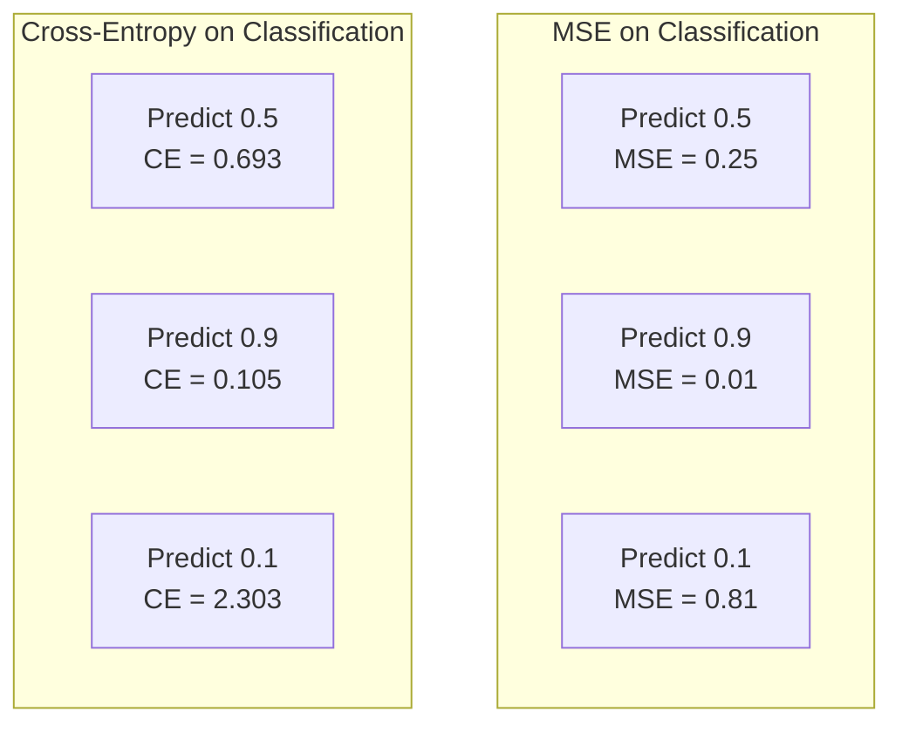
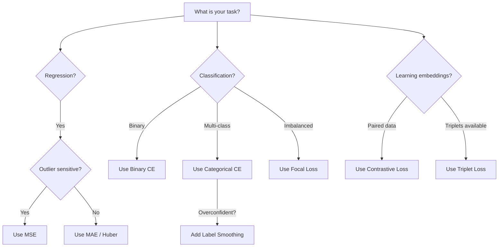

# Loss Functions

> Your network makes a prediction. The ground truth says otherwise. How wrong is it? That number is the loss. Pick the wrong loss function and your model optimizes for the wrong thing entirely.

**Type:** Build
**Languages:** Python
**Prerequisites:** Lesson 03.04 (Activation Functions)
**Time:** ~75 minutes

## Learning Objectives

- Implement MSE, binary cross-entropy, categorical cross-entropy, and contrastive loss (InfoNCE) from scratch with their gradients
- Explain why MSE fails for classification by demonstrating the "predict 0.5 for everything" failure mode
- Apply label smoothing to cross-entropy and describe how it prevents overconfident predictions
- Choose the correct loss function for regression, binary classification, multi-class classification, and embedding learning tasks

## The Problem

A model minimizing MSE on a classification problem will confidently predict 0.5 for everything. It's minimizing loss. It's also useless.

The loss function is the only thing your model actually optimizes. Not accuracy. Not F1 score. If the loss function doesn't capture what you care about, the model will find the mathematically cheapest way to satisfy it, and that way is almost never what you wanted.

## The Concept

### Mean Squared Error (MSE)

```
MSE = (1/n) * sum((y_pred - y_true)^2)
```

The default for regression. Penalizes large errors quadratically. An error of 2 costs 4x as much as an error of 1. This makes MSE sensitive to outliers.

Gradient: `dMSE/dy_pred = (2/n) * (y_pred - y_true)`. Linear in the error.

### Cross-Entropy Loss

**Binary Cross-Entropy (BCE):**
```
BCE = -(y * log(p) + (1 - y) * log(1 - p))
```

When y=1 and you predict p=0.99, loss = -log(0.99) = 0.01. When you predict p=0.01, loss = -log(0.01) = 4.6. That 460x difference is why cross-entropy works.

**Categorical Cross-Entropy:**
```
CCE = -sum(y_i * log(p_i))
```

Only the true class contributes. If the correct class gets probability 0.1 (random), loss = 2.3. If it gets 0.9, loss = 0.105.

### Why MSE Fails for Classification



MSE gradients flatten when predictions are near 0 or 1. Cross-entropy gradients compensate -- the -log cancels the sigmoid's flat regions.

### Label Smoothing

```
smooth_label = (1 - alpha) * one_hot + alpha / num_classes
```

With alpha=0.1 and 10 classes: target becomes [0.01, 0.01, 0.91, 0.01, ...] instead of [0, 0, 1, 0, ...]. Prevents overconfidence, improves generalization.

### Contrastive Loss (InfoNCE)

```
L = -log(exp(sim(z_i, z_j) / tau) / sum(exp(sim(z_i, z_k) / tau)))
```

No labels. Just pairs of inputs and the question: are these similar or different? Used in SimCLR, CLIP, and self-supervised learning.

### Focal Loss

For imbalanced datasets:
```
FL = -alpha * (1 - p_t)^gamma * log(p_t)
```

Easy example (p_t=0.9): weight = 0.01. Hard example (p_t=0.1): weight = 0.81. Down-weights easy examples to focus on hard ones.

### Loss Function Decision Tree



## Build It

### Step 1: MSE and Its Gradient

```python
def mse(predictions, targets):
    n = len(predictions)
    total = sum((p - t) ** 2 for p, t in zip(predictions, targets))
    return total / n

def mse_gradient(predictions, targets):
    n = len(predictions)
    return [2.0 * (p - t) / n for p, t in zip(predictions, targets)]
```

### Step 2: Binary Cross-Entropy

```python
import math

def binary_cross_entropy(predictions, targets, eps=1e-15):
    n = len(predictions)
    total = 0.0
    for p, t in zip(predictions, targets):
        p_clipped = max(eps, min(1 - eps, p))
        total += -(t * math.log(p_clipped) + (1 - t) * math.log(1 - p_clipped))
    return total / n

def bce_gradient(predictions, targets, eps=1e-15):
    grads = []
    for p, t in zip(predictions, targets):
        p_clipped = max(eps, min(1 - eps, p))
        grads.append(-(t / p_clipped) + (1 - t) / (1 - p_clipped))
    return grads
```

### Step 3: Categorical Cross-Entropy with Softmax

```python
def softmax(logits):
    max_val = max(logits)
    exps = [math.exp(x - max_val) for x in logits]
    total = sum(exps)
    return [e / total for e in exps]

def categorical_cross_entropy(logits, target_index, eps=1e-15):
    probs = softmax(logits)
    p = max(eps, probs[target_index])
    return -math.log(p)

def cce_gradient(logits, target_index):
    probs = softmax(logits)
    grads = list(probs)
    grads[target_index] -= 1.0
    return grads
```

The gradient of softmax + cross-entropy simplifies to (predicted probability - 1) for the true class, and (predicted probability) for all other classes.

### Step 4: Label Smoothing

```python
def label_smoothed_cce(logits, target_index, num_classes, alpha=0.1, eps=1e-15):
    probs = softmax(logits)
    loss = 0.0
    for i in range(num_classes):
        smooth_target = (1.0 - alpha + alpha / num_classes) if i == target_index else alpha / num_classes
        p = max(eps, probs[i])
        loss += -smooth_target * math.log(p)
    return loss
```

### Step 5: Contrastive Loss

```python
def cosine_similarity(a, b):
    dot = sum(x * y for x, y in zip(a, b))
    norm_a = math.sqrt(sum(x * x for x in a))
    norm_b = math.sqrt(sum(x * x for x in b))
    if norm_a < 1e-10 or norm_b < 1e-10: return 0.0
    return dot / (norm_a * norm_b)

def contrastive_loss(anchor, positive, negatives, temperature=0.07):
    sim_pos = cosine_similarity(anchor, positive) / temperature
    sim_negs = [cosine_similarity(anchor, neg) / temperature for neg in negatives]
    max_sim = max(sim_pos, max(sim_negs)) if sim_negs else sim_pos
    exp_pos = math.exp(sim_pos - max_sim)
    total_exp = exp_pos + sum(math.exp(s - max_sim) for s in sim_negs)
    return -math.log(max(1e-15, exp_pos / total_exp))
```

## Use It

PyTorch provides all standard loss functions with numerical stability built in:

```python
import torch
import torch.nn as nn
import torch.nn.functional as F

mse_loss = F.mse_loss(predictions, targets)
bce_loss = F.binary_cross_entropy(predictions, targets)
ce_loss = F.cross_entropy(logits, labels)  # combines log-softmax and NLL
ce_smooth = F.cross_entropy(logits, labels, label_smoothing=0.1)
```

Use `F.cross_entropy` (not `F.nll_loss` plus manual softmax). It combines log-softmax and negative log-likelihood in one numerically stable operation.

## Key Terms

| Term | What people say | What it actually means |
|------|----------------|----------------------|
| Loss function | "How wrong the model is" | A differentiable function the optimizer minimizes |
| MSE | "Average squared error" | Mean of squared differences; penalizes large errors quadratically |
| Cross-entropy | "The classification loss" | Measures divergence between predicted and true probability distributions |
| Binary cross-entropy | "BCE" | Cross-entropy for two classes |
| Label smoothing | "Softening the targets" | Replacing hard 0/1 targets with soft values |
| Contrastive loss | "Pull together, push apart" | Makes similar pairs close and dissimilar pairs far in embedding space |
| InfoNCE | "The CLIP/SimCLR loss" | Temperature-scaled cross-entropy over similarity scores |
| Focal loss | "The imbalanced data fix" | Cross-entropy weighted to down-weight easy examples |
| Triplet loss | "Anchor-positive-negative" | Pushes anchor closer to positive than negative by a margin |
| Temperature | "Sharpness knob" | A scalar divisor on logits controlling distribution peakedness |

## Exercises

1. Implement Huber loss. Train a regression network with MSE vs Huber when 5% of targets have outlier noise.
2. Add focal loss to the binary classification loop. Compare standard BCE vs focal loss on an imbalanced dataset.
3. Implement triplet loss with semi-hard negative mining.
4. Run MSE vs cross-entropy comparison tracking gradient magnitudes at each layer.
5. Implement KL divergence loss and verify it gives the same gradients as cross-entropy for one-hot targets.

## Further Reading

- Lin et al., "Focal Loss for Dense Object Detection" (2017)
- Chen et al., "A Simple Framework for Contrastive Learning of Visual Representations" (SimCLR, 2020)
- Szegedy et al., "Rethinking the Inception Architecture" (2016) -- introduced label smoothing
- Hinton et al., "Distilling the Knowledge in a Neural Network" (2015)

[Reference](https://github.com/rohitg00/ai-engineering-from-scratch/tree/main/phases/03-deep-learning-core/05-loss-functions)
