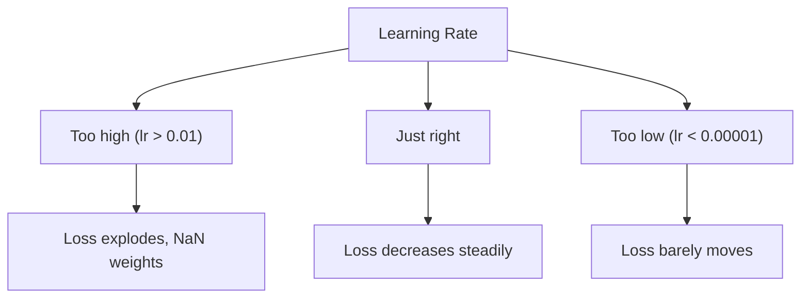
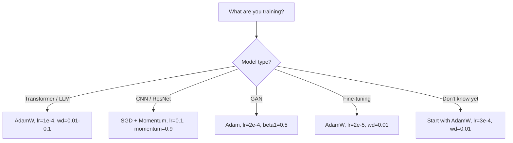

# Optimizers

> Gradient descent tells you which direction to move. It says nothing about how far or how fast. SGD is a compass. Adam is GPS with traffic data.

**Type:** Build
**Languages:** Python
**Prerequisites:** Lesson 03.05 (Loss Functions)
**Time:** ~75 minutes

## Learning Objectives

- Implement SGD, SGD with momentum, Adam, and AdamW optimizers from scratch in Python
- Explain how Adam's bias correction compensates for zero-initialized moment estimates in early training steps
- Demonstrate why AdamW produces better generalization than Adam with L2 regularization on the same task
- Select the appropriate optimizer and default hyperparameters for transformers, CNNs, GANs, and fine-tuning

## The Problem

Vanilla gradient descent applies the same learning rate to every parameter on every step: w = w - lr * gradient. This creates three problems:

1. **Oscillation**: The loss landscape is rarely smooth. Gradients bounce across narrow valleys making tiny progress.
2. **One learning rate for all parameters is wrong**: Some weights need large updates, others tiny.
3. **Saddle points**: Vast flat regions where gradient is near zero. SGD crawls through these.

Adam solves all three. It maintains two running averages per parameter -- mean gradient (momentum) and mean squared gradient (adaptive rate) -- with bias correction.

## The Concept

### Stochastic Gradient Descent (SGD)

```
w = w - lr * gradient
```

The simplest optimizer. The "stochastic" means you use a random mini-batch to estimate the gradient.

### Momentum

```
m_t = beta * m_{t-1} + gradient
w = w - lr * m_t
```

Beta (0.9) controls how much history to keep. Gradients that point in the same direction accumulate. Gradients that flip direction cancel out. This smooths oscillation.

### RMSProp

```
s_t = beta * s_{t-1} + (1 - beta) * gradient^2
w = w - lr * gradient / (sqrt(s_t) + epsilon)
```

First per-parameter adaptive learning rate method. Parameters with large gradients get a smaller effective learning rate.

### Adam: Momentum + RMSProp

```
m_t = beta1 * m_{t-1} + (1 - beta1) * gradient
v_t = beta2 * v_{t-1} + (1 - beta2) * gradient^2
```

**Bias correction** is the key detail. At step 1, m_1 is ten times too small because the moving average hasn't warmed up:

```
m_hat = m_t / (1 - beta1^t)
v_hat = v_t / (1 - beta2^t)

w = w - lr * m_hat / (sqrt(v_hat) + epsilon)
```

Adam defaults: lr=0.001, beta1=0.9, beta2=0.999, epsilon=1e-8.

### AdamW: Weight Decay Done Right

L2 regularization adds lambda * w^2 to the loss. In Adam, the adaptive learning rate scales the regularization term non-uniformly. AdamW applies weight decay directly:

```
w = w - lr * m_hat / (sqrt(v_hat) + epsilon) - lr * lambda * w
```

Every parameter gets the same proportional shrinkage. Used by BERT, GPT, LLaMA, Stable Diffusion.

### Learning Rate: The Most Important Hyperparameter



Common defaults: SGD lr=0.01-0.1, Adam/AdamW lr=1e-4 to 3e-4, Fine-tuning lr=1e-5 to 5e-5.

### When Each Optimizer Wins



## Build It

### Step 1: Vanilla SGD

```python
class SGD:
    def __init__(self, lr=0.01):
        self.lr = lr
    def step(self, params, grads):
        for i in range(len(params)):
            params[i] -= self.lr * grads[i]
```

### Step 2: SGD with Momentum

```python
class SGDMomentum:
    def __init__(self, lr=0.01, beta=0.9):
        self.lr = lr
        self.beta = beta
        self.velocities = None
    def step(self, params, grads):
        if self.velocities is None:
            self.velocities = [0.0] * len(params)
        for i in range(len(params)):
            self.velocities[i] = self.beta * self.velocities[i] + grads[i]
            params[i] -= self.lr * self.velocities[i]
```

### Step 3: Adam

```python
import math

class Adam:
    def __init__(self, lr=0.001, beta1=0.9, beta2=0.999, epsilon=1e-8):
        self.lr = lr
        self.beta1 = beta1
        self.beta2 = beta2
        self.epsilon = epsilon
        self.m = None
        self.v = None
        self.t = 0
    def step(self, params, grads):
        if self.m is None:
            self.m = [0.0] * len(params)
            self.v = [0.0] * len(params)
        self.t += 1
        for i in range(len(params)):
            self.m[i] = self.beta1 * self.m[i] + (1 - self.beta1) * grads[i]
            self.v[i] = self.beta2 * self.v[i] + (1 - self.beta2) * grads[i] ** 2
            m_hat = self.m[i] / (1 - self.beta1 ** self.t)
            v_hat = self.v[i] / (1 - self.beta2 ** self.t)
            params[i] -= self.lr * m_hat / (math.sqrt(v_hat) + self.epsilon)
```

### Step 4: AdamW

```python
class AdamW:
    def __init__(self, lr=0.001, beta1=0.9, beta2=0.999, epsilon=1e-8, weight_decay=0.01):
        self.lr = lr
        self.beta1 = beta1
        self.beta2 = beta2
        self.epsilon = epsilon
        self.weight_decay = weight_decay
        self.m = None
        self.v = None
        self.t = 0
    def step(self, params, grads):
        if self.m is None:
            self.m = [0.0] * len(params)
            self.v = [0.0] * len(params)
        self.t += 1
        for i in range(len(params)):
            self.m[i] = self.beta1 * self.m[i] + (1 - self.beta1) * grads[i]
            self.v[i] = self.beta2 * self.v[i] + (1 - self.beta2) * grads[i] ** 2
            m_hat = self.m[i] / (1 - self.beta1 ** self.t)
            v_hat = self.v[i] / (1 - self.beta2 ** self.t)
            params[i] -= self.lr * m_hat / (math.sqrt(v_hat) + self.epsilon)
            params[i] -= self.lr * self.weight_decay * params[i]
```

## Use It

```python
import torch
import torch.optim as optim

model = torch.nn.Sequential(
    torch.nn.Linear(784, 256), torch.nn.ReLU(),
    torch.nn.Linear(256, 10),
)

optimizer = optim.AdamW(model.parameters(), lr=3e-4, weight_decay=0.01)
scheduler = optim.lr_scheduler.CosineAnnealingLR(optimizer, T_max=100)

for epoch in range(100):
    output = model(torch.randn(32, 784))
    loss = torch.nn.functional.cross_entropy(output, torch.randint(0, 10, (32,)))
    optimizer.zero_grad()
    loss.backward()
    torch.nn.utils.clip_grad_norm_(model.parameters(), max_norm=1.0)
    optimizer.step()
    scheduler.step()
```

The pattern is always: zero_grad, forward, loss, backward, (clip), step, (schedule).

## Key Terms

| Term | What people say | What it actually means |
|------|----------------|----------------------|
| Learning rate | "Step size" | The scalar multiplier on the gradient update |
| SGD | "Basic gradient descent" | Stochastic gradient descent on mini-batches |
| Momentum | "Rolling ball analogy" | Exponential moving average of past gradients |
| RMSProp | "Adaptive learning rate" | Divides gradient by running RMS of recent gradients |
| Adam | "The default optimizer" | Combines momentum and RMSProp with bias correction |
| AdamW | "Adam done right" | Adam with decoupled weight decay |
| Bias correction | "Warmup for running averages" | Compensates for zero initialization of moment estimates |
| Weight decay | "Shrink the weights" | Subtracting a fraction of weight value at each step |
| Gradient clipping | "Capping the gradient norm" | Scaling gradients when norm exceeds a threshold |

## Exercises

1. Implement Nesterov momentum. Compare convergence to standard momentum.
2. Implement learning rate warmup: linear ramp from 0 to max_lr, then cosine decay.
3. Track the effective learning rate for each parameter during Adam training.
4. Implement gradient clipping. Count how many runs diverge with and without clipping.
5. Compare Adam vs AdamW on a network with large weights. Plot L2 norm over training.

## Further Reading

- Kingma & Ba, "Adam: A Method for Stochastic Optimization" (2014)
- Loshchilov & Hutter, "Decoupled Weight Decay Regularization" (2017)
- Smith, "Cyclical Learning Rates for Training Neural Networks" (2017)
- Ruder, "An Overview of Gradient Descent Optimization Algorithms" (2016)

[Reference](https://github.com/rohitg00/ai-engineering-from-scratch/tree/main/phases/03-deep-learning-core/06-optimizers)
