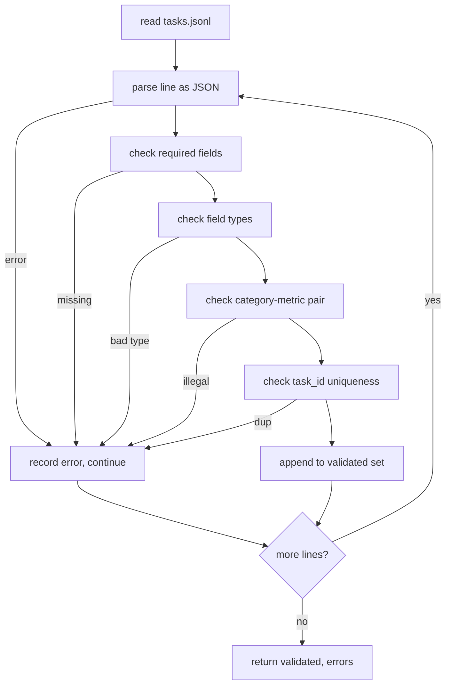
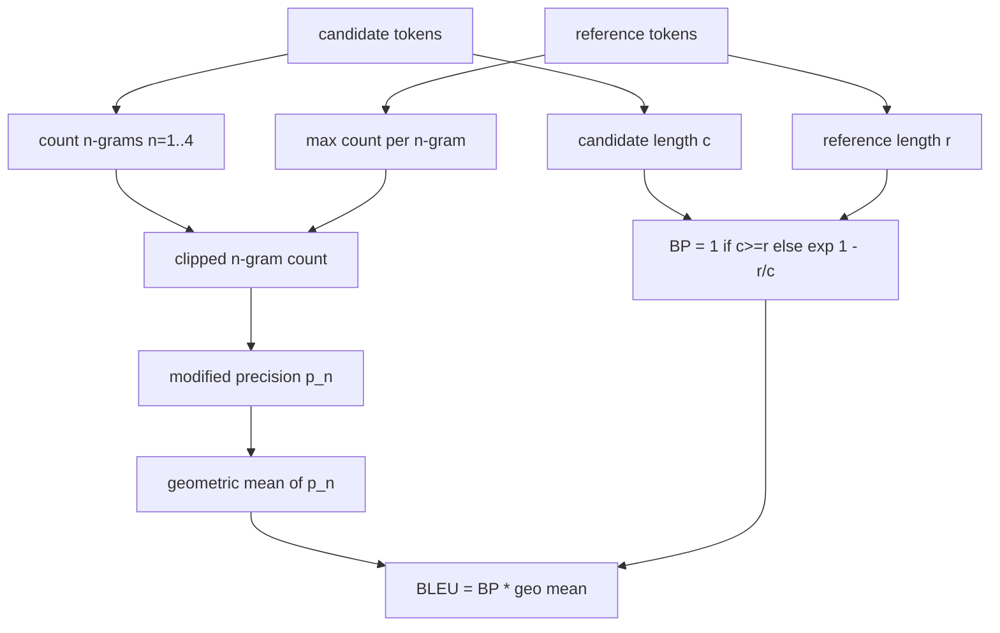
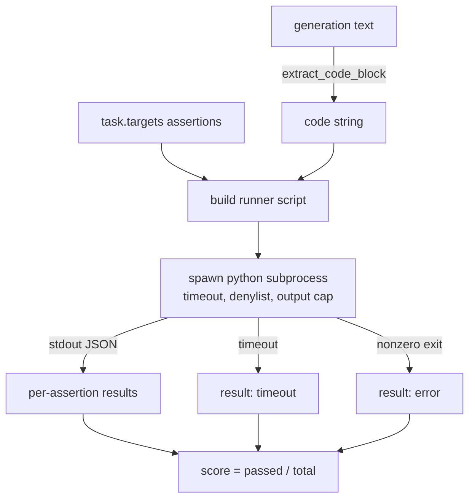
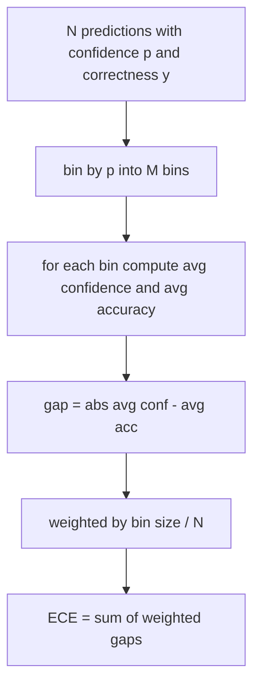
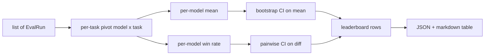
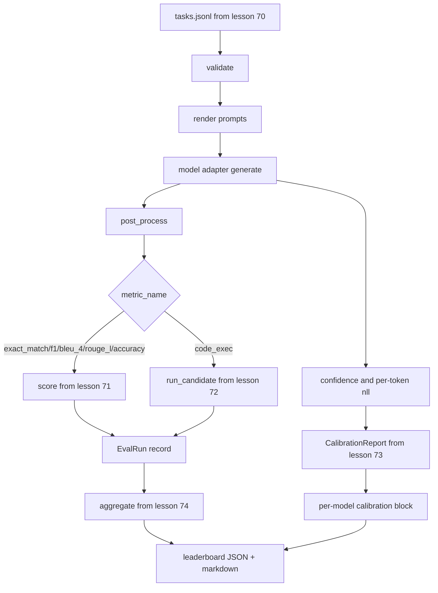

# Metrics, Leaderboards & Eval Runner Build

> Combined lessons (6 parts), merged verbatim — no content removed.

**Type:** Combined

---

## Part 1 (ch484): Task Spec Format

> An eval harness is only as good as the contract its tasks honour. Freeze the JSONL shape and metric vocabulary before you write a single scoring function.

**Type:** Build
**Languages:** Python
**Prerequisites:** Phase 19 Track B foundations
**Time:** ~90 min

## Learning Objectives

- Define a JSONL task record schema covering arithmetic, MCQ, code exec, classification, and summarisation.
- Pin a closed vocabulary of metric names.
- Specify few-shot examples and post-processing rules as part of the task.
- Implement a strict validator that rejects malformed records.
- Ship a 10-task fixture set.

## The record shape

```json
{
  "task_id": "arith_001",
  "category": "arithmetic",
  "prompt": "Compute. Question: 17 + 24\nAnswer:",
  "targets": ["41"],
  "metric_name": "exact_match",
  "few_shot_examples": [
    {"prompt": "Question: 2 + 2\nAnswer:", "completion": "4"}
  ],
  "post_process": "strip_whitespace",
  "metadata": {"difficulty": "easy"}
}
```

## Validator behaviour



## Build It

`main.py` defines `TaskSpec`, `validate_task`, `validate_file`, `render`, and post-process helpers.

## Key Terms

| Term | What it actually means |
|------|------------------------|
| Task spec | JSONL with prompt, targets, metric_name, post_process |
| Metric vocabulary | Closed set: exact_match, f1, bleu_4, rouge_l, accuracy, code_exec |
| Post-process | Deterministic: none, strip_whitespace, lower, extract_letter, etc. |
| Few-shot rendering | Concatenate examples before prompt with blank line separator |

[Reference](https://github.com/rohitg00/ai-engineering-from-scratch/tree/main/phases/19-capstone-projects/70-task-spec-format)

---

## Part 2 (ch485): Classical Metrics

> BLEU, ROUGE-L, F1, exact-match, accuracy. Implement each from first principles so you know what the number means.

**Type:** Build
**Languages:** Python
**Prerequisites:** Phase 19 Track B foundations, lesson 70
**Time:** ~90 min

## Learning Objectives

- Implement exact-match, F1, and accuracy with explicit tokenisation.
- Implement BLEU-4 from the ground up.
- Implement ROUGE-L using longest common subsequence.
- Dispatch on metric_name from lesson 70.
- Pin behaviour with reference vectors.

## Tokenisation

```python
TOKEN_RE = re.compile(r"\w+", re.UNICODE)
def tokenize(text):
    return TOKEN_RE.findall(text.lower())
```

## BLEU-4



## ROUGE-L

Longest common subsequence via DP, then recall, precision, and F1.

## Dispatch contract

```python
def score(metric_name, pred, targets):
    if metric_name == "exact_match": return exact_match(pred, targets)
    if metric_name == "f1": return max(f1_score(pred, t) for t in targets)
    if metric_name == "bleu_4": return max(bleu4(pred, t) for t in targets)
    if metric_name == "rouge_l": return max(rouge_l(pred, t) for t in targets)
    if metric_name == "accuracy": return accuracy(pred, targets)
```

## Build It

`main.py` defines each metric as a free function plus the dispatcher.

## Key Terms

| Term | What it actually means |
|------|------------------------|
| Modified precision | Clipped n-gram count prevents repetition inflation |
| Brevity penalty | Penalizes candidates shorter than reference |
| LCS | Longest common subsequence captures word order without forcing contiguity |
| Smoothing | Add-one to avoid log(0) on missing n-grams |

[Reference](https://github.com/rohitg00/ai-engineering-from-scratch/tree/main/phases/19-capstone-projects/71-classical-metrics)

---

## Part 3 (ch486): Code Exec Metric

> Generated code is right when it passes the tests. The eval harness extracts code, runs it without crashing the host, and tallies pass-rates.

**Type:** Build
**Languages:** Python
**Prerequisites:** Phase 19 Track B foundations, lessons 70, 71
**Time:** ~90 min

## Learning Objectives

- Extract a code block from free-form generation.
- Execute candidate code in an isolated subprocess with timeout and output cap.
- Score a task as fraction of assertions that pass.
- Compute pass-at-k for multiple generation samples.
- Treat sandbox crashes, syntax errors, and timeouts as first-class fail modes.

## The shape of a code-exec task



## Pass-at-k

```
pass_at_k(n, c, k) = 1 - C(n - c, k) / C(n, k)
```

## Exit codes

- `pass`: all assertions passed
- `assertion_fail`: code ran but at least one assertion failed
- `syntax_error`: code did not import or had SyntaxError
- `timeout`: wall clock expired
- `error`: any other crash including denylist hits

## Build It

`main.py` defines `extract_code`, `run_candidate`, `score_code_exec`, and `pass_at_k`.

## Key Terms

| Term | What it actually means |
|------|------------------------|
| Denylist | Import-based blocking of dangerous modules (os.system, subprocess, socket, etc.) |
| Wall-clock timeout | subprocess.run(timeout=t), 3s default, configurable per task |
| Output cap | 256 KB limit; kills child if exceeded |
| Pass-at-k | Unbiased estimator from n samples with c passing |

[Reference](https://github.com/rohitg00/ai-engineering-from-scratch/tree/main/phases/19-capstone-projects/72-code-exec-metric)

---

## Part 4 (ch487): Perplexity and Calibration

> If your model says 90% confident on a thousand answers and gets six hundred right, it is not well calibrated.

**Type:** Build
**Languages:** Python
**Prerequisites:** Phase 19 Track B foundations, lessons 70, 71
**Time:** ~90 min

## Learning Objectives

- Compute token-level perplexity from negative log-probabilities.
- Compute expected calibration error (ECE) from binned confidences.
- Compute Brier score and its decomposition.
- Build reliability diagram data.
- Wire all three into the eval harness.

## Perplexity

```python
def perplexity(neg_log_probs, token_counts):
    total_nll = sum(neg_log_probs)
    total_tokens = sum(token_counts)
    return math.exp(total_nll / total_tokens)
```

## Expected calibration error



## Brier score

```python
def brier(p, y):
    return float(np.mean((p - y) ** 2))
```

## Build It

`main.py` defines `perplexity`, `expected_calibration_error`, `brier_score`, `reliability_diagram`, `CalibrationReport`, `PerplexityResult`.

## Key Terms

| Term | What it actually means |
|------|------------------------|
| Perplexity | Exponentiated average negative log-likelihood per token |
| ECE | Average gap between confidence and accuracy across bins |
| Brier score | Mean squared error between confidence and outcome |
| Reliability diagram | Plot of predicted confidence vs empirical accuracy per bin |

[Reference](https://github.com/rohitg00/ai-engineering-from-scratch/tree/main/phases/19-capstone-projects/73-perplexity-calibration)

---

## Part 5 (ch488): Leaderboard Aggregation

> Per-task scores are easy. Per-model rankings across heterogeneous tasks are harder. Statistical significance is the part everyone skips.

**Type:** Build
**Languages:** Python
**Prerequisites:** Phase 19 Track B foundations, lessons 70, 71, 73
**Time:** ~90 min

## Learning Objectives

- Aggregate per-task scores into per-model rows.
- Normalise heterogeneous scores into [0, 1].
- Rank models by mean and win-rate.
- Compute bootstrap confidence intervals.
- Output leaderboard as JSON and markdown.

## The shape of input

```python
@dataclass
class EvalRun:
    model_id: str
    task_id: str
    metric_name: str
    score: float
    category: str
```

## The output



## Bootstrap CI

Resample tasks with replacement B times, compute mean each time, take alpha/2 and 1-alpha/2 percentiles.

## Build It

`main.py` defines `EvalRun`, `LeaderboardRow`, `aggregate`, `bootstrap_mean_ci`, `bootstrap_pairwise_diff`, `render_markdown`.

## Key Terms

| Term | What it actually means |
|------|------------------------|
| Win-rate | Fraction of tasks where model beats all others |
| Bootstrap | Resample with replacement for CI estimation |
| Pairwise diff | Bootstrap CI of per-task score_A - score_B |
| Per-category mean | Mean score within each category |

[Reference](https://github.com/rohitg00/ai-engineering-from-scratch/tree/main/phases/19-capstone-projects/74-leaderboard-aggregation)

---

## Part 6 (ch489): End-to-End Eval Runner

> Five lessons of plumbing, one lesson to glue them. The runner reads tasks, calls a model adapter, scores, attaches calibration, emits a leaderboard.

**Type:** Build
**Languages:** Python
**Prerequisites:** Phase 19 Track B foundations, lessons 70-74
**Time:** ~90 min

## Learning Objectives

- Define a ModelAdapter interface for any model.
- Run the eval over a fixture JSONL with parallel task execution.
- Compose metric layer with calibration layer in one pass.
- Emit EvalRun records for the leaderboard aggregator.
- Output JSON report and markdown table.

## The pipeline



## Build It

`main.py` is the integration. Imports from lessons 70-74. Mock adapters: `RuleBasedAdapter`, `NoisyAdapter`, `BiasedAdapter`.

## Key Terms

| Term | What it actually means |
|------|------------------------|
| ModelAdapter | Interface with generate(prompt, task) -> Generation |
| Generation | text + confidence + optional token_nll and token_count |
| Calibration buffer | Accumulates (confidence, correct) pairs across tasks |

[Reference](https://github.com/rohitg00/ai-engineering-from-scratch/tree/main/phases/19-capstone-projects/75-end-to-end-eval-runner)
