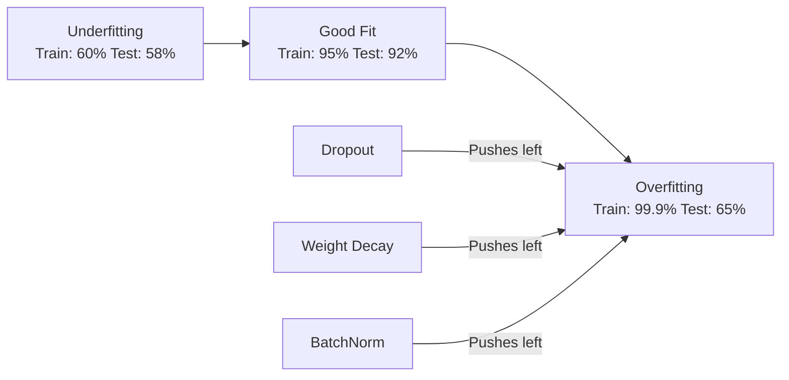
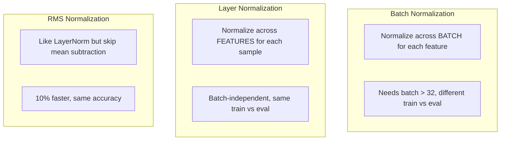
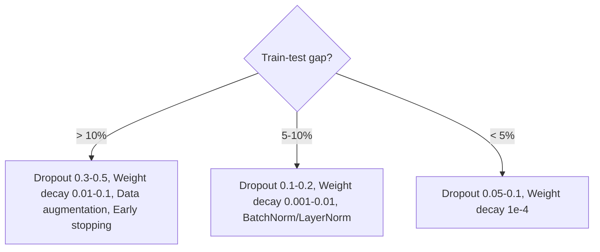

# Regularization

> Your model gets 99% on training data and 60% on test data. It memorized instead of learning. Regularization is the tax you impose on complexity to force generalization.

**Type:** Build
**Languages:** Python
**Prerequisites:** Lesson 03.06 (Optimizers)
**Time:** ~75 minutes

## Learning Objectives

- Implement dropout with inverted scaling, L2 weight decay, batch normalization, layer normalization, and RMSNorm from scratch
- Measure the train-test accuracy gap and diagnose overfitting using regularization experiments
- Explain why transformers use LayerNorm instead of BatchNorm and why modern LLMs prefer RMSNorm
- Apply the correct combination of regularization techniques based on the severity of overfitting

## The Problem

A neural network with enough parameters can memorize any dataset. Zhang et al. (2017) proved this by training standard networks on ImageNet with random labels -- near-zero training loss on completely random labels, but zero test accuracy.

The gap between training performance and test performance is the overfitting gap. Every technique in this lesson attacks that gap from a different angle.

## The Concept

### The Overfitting Spectrum



### Dropout

During training, randomly set each neuron's output to zero with probability p. With p=0.5, half the neurons are zeroed on every forward pass. The network must learn redundant representations.

At test time, use all neurons. With inverted dropout, scaling is applied during training instead:

```
During training:  output = activation(z) * mask / (1 - p)
During testing:   output = activation(z)
```

Default rates: p=0.1 for transformers, p=0.5 for MLPs, p=0.2-0.3 for CNNs.

### Weight Decay (L2 Regularization)

```
total_loss = task_loss + (lambda / 2) * sum(w_i^2)
```

The gradient of the regularization term is lambda * w. At every step, each weight is shrunk toward zero. Large weights get penalized more.

Typical values: 0.01 for AdamW on transformers, 1e-4 for SGD on CNNs.

### Batch Normalization

Normalize the output of each layer across the mini-batch:

```
mu = (1/B) * sum(x_i)
sigma^2 = (1/B) * sum((x_i - mu)^2)
x_hat = (x_i - mu) / sqrt(sigma^2 + eps)
y = gamma * x_hat + beta
```

During training, mu and sigma come from the current mini-batch. During inference, use running averages.

BatchNorm makes the loss landscape smoother, enabling higher learning rates and faster convergence. But it depends on batch statistics -- with batch size < 32, statistics are noisy.

### Layer Normalization

Normalize across features instead of across the batch. Each sample is normalized independently:

```
mu = (1/D) * sum(x_j)
sigma^2 = (1/D) * sum((x_j - mu)^2)
x_hat = (x_j - mu) / sqrt(sigma^2 + eps)
y = gamma * x_hat + beta
```

No dependence on batch size. Transformers use LayerNorm because sequences have variable lengths and batch sizes are often small.

### RMSNorm

LayerNorm without the mean subtraction. Proposed by Zhang & Sennrich (2019):

```
rms = sqrt((1/D) * sum(x_j^2))
y = gamma * x / rms
```

The mean subtraction contributes little to performance but costs computation. LLaMA, Mistral, and most modern LLMs use RMSNorm.

### Normalization Comparison



### When to Apply What



## Build It

### Step 1: Dropout

```python
import random

class Dropout:
    def __init__(self, p=0.5):
        self.p = p
        self.training = True
        self.mask = None
    def forward(self, x):
        if not self.training:
            return list(x)
        self.mask = []
        output = []
        for val in x:
            if random.random() < self.p:
                self.mask.append(0)
                output.append(0.0)
            else:
                self.mask.append(1)
                output.append(val / (1 - self.p))
        return output
```

### Step 2: L2 Weight Decay

```python
def l2_regularization(weights, lambda_reg):
    penalty = sum(w * w for w in weights)
    return lambda_reg * 0.5 * penalty

def l2_gradient(weights, lambda_reg):
    return [lambda_reg * w for w in weights]
```

### Step 3: Batch Normalization

```python
import math

class BatchNorm:
    def __init__(self, num_features, momentum=0.1, eps=1e-5):
        self.gamma = [1.0] * num_features
        self.beta = [0.0] * num_features
        self.eps = eps
        self.momentum = momentum
        self.running_mean = [0.0] * num_features
        self.running_var = [1.0] * num_features
        self.training = True

    def forward(self, batch):
        batch_size = len(batch)
        if self.training:
            mean = [sum(sample[j] for sample in batch) / batch_size for j in range(len(batch[0]))]
            var = [sum((sample[j] - mean[j]) ** 2 for sample in batch) / batch_size for j in range(len(batch[0]))]
            for j in range(len(mean)):
                self.running_mean[j] = (1 - self.momentum) * self.running_mean[j] + self.momentum * mean[j]
                self.running_var[j] = (1 - self.momentum) * self.running_var[j] + self.momentum * var[j]
        else:
            mean = list(self.running_mean)
            var = list(self.running_var)
        output = []
        for sample in batch:
            out_sample = []
            for j in range(len(mean)):
                x_h = (sample[j] - mean[j]) / math.sqrt(var[j] + self.eps)
                out_sample.append(self.gamma[j] * x_h + self.beta[j])
            output.append(out_sample)
        return output
```

### Step 4: Layer Normalization

```python
class LayerNorm:
    def __init__(self, num_features, eps=1e-5):
        self.gamma = [1.0] * num_features
        self.beta = [0.0] * num_features
        self.eps = eps

    def forward(self, x):
        mean = sum(x) / len(x)
        var = sum((xi - mean) ** 2 for xi in x) / len(x)
        output = []
        for j in range(len(x)):
            x_h = (x[j] - mean) / math.sqrt(var + self.eps)
            output.append(self.gamma[j] * x_h + self.beta[j])
        return output
```

### Step 5: RMSNorm

```python
class RMSNorm:
    def __init__(self, num_features, eps=1e-6):
        self.gamma = [1.0] * num_features
        self.eps = eps

    def forward(self, x):
        rms = math.sqrt(sum(xi * xi for xi in x) / len(x) + self.eps)
        return [self.gamma[j] * x[j] / rms for j in range(len(x))]
```

## Use It

```python
import torch
import torch.nn as nn

model = nn.Sequential(
    nn.Linear(784, 256), nn.BatchNorm1d(256), nn.ReLU(), nn.Dropout(0.3),
    nn.Linear(256, 128), nn.BatchNorm1d(128), nn.ReLU(), nn.Dropout(0.3),
    nn.Linear(128, 10),
)

model.train()   # dropout active, BN uses batch stats
out_train = model(torch.randn(32, 784))
model.eval()    # dropout off, BN uses running stats
out_test = model(torch.randn(1, 784))
```

For transformers: LayerNorm, dropout p=0.1.

## Key Terms

| Term | What people say | What it actually means |
|------|----------------|----------------------|
| Overfitting | "Model memorized the data" | Training performance significantly exceeds test performance |
| Regularization | "Preventing overfitting" | Any technique constraining model complexity to improve generalization |
| Dropout | "Random neuron deletion" | Zeroing random neurons during training, forcing redundant representations |
| Weight decay | "L2 penalty" | Shrinking weights toward zero at each step |
| Batch normalization | "Normalize per batch" | Normalizing layer outputs across the batch dimension |
| Layer normalization | "Normalize per sample" | Normalizing across features within each sample |
| RMSNorm | "LayerNorm without the mean" | Root mean square normalization, 10% faster |
| Early stopping | "Stop before overfit" | Halting training when validation loss stops improving |

## Exercises

1. Implement spatial dropout. Compare train-test gap to standard dropout.
2. Combine label smoothing with dropout. Which combination gives the smallest gap?
3. Add BatchNorm between hidden layer and activation. Train with and without BatchNorm at different learning rates.
4. Implement early stopping. Report which epoch had the best test accuracy.
5. Compare LayerNorm vs RMSNorm on a 4-layer network. Verify RMSNorm is faster with the same accuracy.

## Further Reading

- Srivastava et al., "Dropout: A Simple Way to Prevent Neural Networks from Overfitting" (2014)
- Ioffe & Szegedy, "Batch Normalization: Accelerating Deep Network Training by Reducing Internal Covariate Shift" (2015)
- Zhang & Sennrich, "Root Mean Square Layer Normalization" (2019)
- Zhang et al., "Understanding Deep Learning Requires Rethinking Generalization" (2017)

[Reference](https://github.com/rohitg00/ai-engineering-from-scratch/tree/main/phases/03-deep-learning-core/07-regularization)
