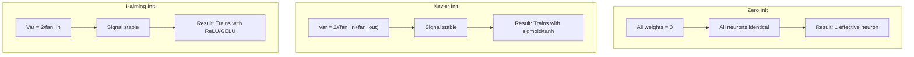
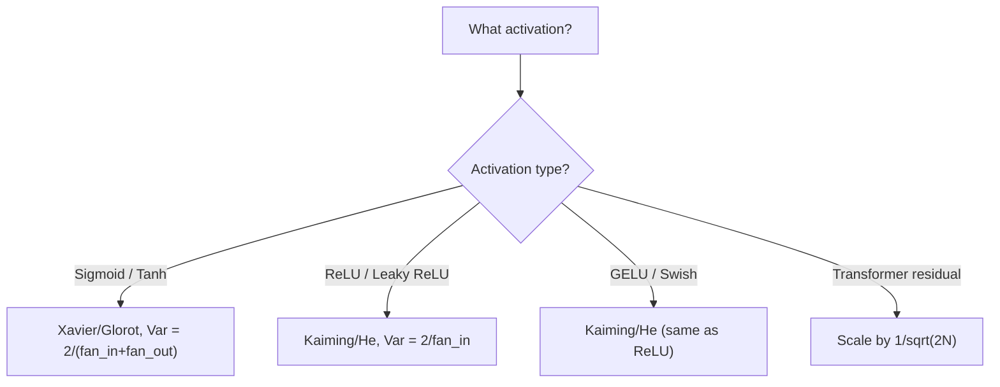

# Weight Initialization and Training Stability

> Initialize wrong and training never starts. Initialize right and 50 layers train as smoothly as 3.

**Type:** Build
**Languages:** Python
**Prerequisites:** Lesson 03.04 (Activation Functions), Lesson 03.07 (Regularization)
**Time:** ~90 minutes

## Learning Objectives

- Implement zero, random, Xavier/Glorot, and Kaiming/He initialization strategies and measure their effect on activation magnitudes through 50 layers
- Derive why Xavier init uses Var(w) = 2/(fan_in + fan_out) and Kaiming uses Var(w) = 2/fan_in
- Demonstrate the symmetry problem with zero initialization and explain why random scale alone is insufficient
- Match the correct initialization strategy to the activation function: Xavier for sigmoid/tanh, Kaiming for ReLU/GELU

## The Problem

Initialize all weights to zero: nothing learns. Every neuron computes the same function, receives the same gradient, and updates identically. Your 512-neuron hidden layer is 512 copies of one neuron.

Initialize too large: activations explode. By layer 10, values hit 1e15. By layer 20, infinity.

Initialize randomly from standard normal: works for 3 layers. At 50 layers, the signal collapses or detonates depending on whether the scale was slightly too small or slightly too large.

## The Concept

### The Symmetry Problem

If all weights start at the same value, every neuron computes the same output, receives the same gradient, and changes by the same amount. Random initialization breaks this symmetry.

### Variance Propagation

Consider a single layer with fan_in inputs: z = w1*x1 + w2*x2 + ... + w_n*x_n. If each weight has variance Var(w) and each input has variance Var(x), the output variance is:

```
Var(z) = fan_in * Var(w) * Var(x)
```

If Var(w) = 1 and fan_in = 512, output variance is 512x input variance. After 10 layers: 512^10 = 1.2e27. Exploded.

If Var(w) = 0.001, output variance shrinks by 0.512 per layer. After 10 layers: 0.00013. Vanished.

The goal: choose Var(w) so signal magnitude stays constant across layers.

### Xavier/Glorot Initialization

For sigmoid and tanh activations:
```
Var(w) = 2 / (fan_in + fan_out)
```

Weights drawn from Uniform(-limit, limit) where limit = sqrt(6 / (fan_in + fan_out)), or Normal(0, sqrt(2 / (fan_in + fan_out))).

### Kaiming/He Initialization

For ReLU activations (ReLU kills half the outputs, effective fan_in is halved):
```
Var(w) = 2 / fan_in
```

Weights drawn from Normal(0, sqrt(2 / fan_in)). The factor of 2 compensates for ReLU zeroing half the activations.

### Transformer Initialization

Residual connections add the output of each sub-layer to its input. Each addition increases variance. GPT-2 scales residual weights by 1/sqrt(2N) where N is the number of layers.



### Choosing the Right Init



## Build It

### Step 1: Initialization Strategies

```python
import math
import random

def zero_init(fan_in, fan_out):
    return [[0.0 for _ in range(fan_in)] for _ in range(fan_out)]

def random_init(fan_in, fan_out, scale=1.0):
    return [[random.gauss(0, scale) for _ in range(fan_in)] for _ in range(fan_out)]

def xavier_init(fan_in, fan_out):
    std = math.sqrt(2.0 / (fan_in + fan_out))
    return [[random.gauss(0, std) for _ in range(fan_in)] for _ in range(fan_out)]

def kaiming_init(fan_in, fan_out):
    std = math.sqrt(2.0 / fan_in)
    return [[random.gauss(0, std) for _ in range(fan_in)] for _ in range(fan_out)]
```

### Step 2: Forward Pass Through 50 Layers

```python
def forward_deep(init_fn, activation_fn, n_layers=50, width=64, n_samples=100):
    random.seed(42)
    layer_magnitudes = []
    inputs = [[random.gauss(0, 1) for _ in range(width)] for _ in range(n_samples)]
    for layer_idx in range(n_layers):
        weights = init_fn(width, width)
        biases = [0.0] * width
        new_inputs = []
        for sample in inputs:
            output = []
            for neuron_idx in range(width):
                z = sum(weights[neuron_idx][j] * sample[j] for j in range(width)) + biases[neuron_idx]
                output.append(activation_fn(z))
            new_inputs.append(output)
        inputs = new_inputs
        magnitudes = []
        for sample in inputs:
            magnitudes.append(sum(abs(v) for v in sample) / width)
        layer_magnitudes.append(sum(magnitudes) / len(magnitudes))
    return layer_magnitudes
```

### Step 3: The Experiment

```python
def run_experiment():
    configs = [
        ("Zero init + Sigmoid", lambda fi, fo: zero_init(fi, fo), sigmoid),
        ("Random N(0,1) + ReLU", lambda fi, fo: random_init(fi, fo, 1.0), relu),
        ("Random N(0,0.01) + ReLU", lambda fi, fo: random_init(fi, fo, 0.01), relu),
        ("Xavier + Sigmoid", xavier_init, sigmoid),
        ("Xavier + Tanh", xavier_init, tanh_act),
        ("Kaiming + ReLU", kaiming_init, relu),
    ]
    for name, init_fn, act_fn in configs:
        mags = forward_deep(init_fn, act_fn)
        print(f"{name}: L1={mags[0]:.4f}, L10={mags[9]:.4f}, L50={mags[49]:.4f}")
```

### Step 4: Symmetry Demonstration

```python
def symmetry_demo():
    weights = zero_init(2, 4)
    biases = [0.0] * 4
    inputs = [0.5, -0.3]
    outputs = [sigmoid(sum(w * x for w, x in zip(w_row, inputs)) + b)
               for w_row, b in zip(weights, biases)]
    all_same = all(abs(o - outputs[0]) < 1e-10 for o in outputs)
    print(f"All identical: {all_same}")  # True
    print(f"Effective parameters: 1 (not {len(weights) * len(weights[0])})")
```

## Use It

PyTorch provides these as built-in functions:

```python
import torch.nn as nn

layer = nn.Linear(512, 256)
nn.init.xavier_uniform_(layer.weight)
nn.init.kaiming_normal_(layer.weight, nonlinearity='relu')
nn.init.zeros_(layer.bias)
```

PyTorch defaults to Kaiming uniform initialization, which is why most simple networks "just work."

## Key Terms

| Term | What people say | What it actually means |
|------|----------------|----------------------|
| Weight initialization | "Set starting weights randomly" | Strategy for initial weight values that determines if a network can train |
| Symmetry breaking | "Make neurons different" | Using random initialization so neurons learn distinct features |
| Fan-in | "Number of inputs" | Incoming connections affecting variance in weighted sum |
| Fan-out | "Number of outputs" | Outgoing connections relevant for gradient variance |
| Xavier/Glorot init | "The sigmoid initialization" | Var(w) = 2/(fan_in + fan_out) for sigmoid/tanh |
| Kaiming/He init | "The ReLU initialization" | Var(w) = 2/fan_in for ReLU networks |
| Variance propagation | "How signals grow through layers" | Analysis of activation variance through layers |
| Exploding activations | "Values go to infinity" | Weight variance too high, activations grow exponentially |

## Exercises

1. Add LeCun initialization (Var = 1/fan_in for SELU). Run the 50-layer experiment and compare.
2. Implement GPT-2 residual scaling. Run 50 layers with and without scaling.
3. Create an "init health check" function that recommends the correct initialization.
4. Run the experiment with fan_in=16 vs fan_in=1024. Show how the gap widens with larger layers.
5. Implement orthogonal initialization. Compare to Kaiming for ReLU networks at 50 layers.

## Further Reading

- Glorot & Bengio, "Understanding the difficulty of training deep feedforward neural networks" (2010)
- He et al., "Delving Deep into Rectifiers" (2015) -- Kaiming initialization
- Radford et al., "Language Models are Unsupervised Multitask Learners" (2019) -- GPT-2
- Mishkin & Matas, "All You Need is a Good Init" (2016)

[Reference](https://github.com/rohitg00/ai-engineering-from-scratch/tree/main/phases/03-deep-learning-core/08-weight-initialization)
