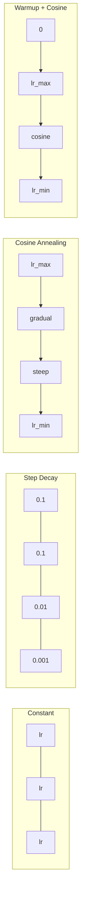
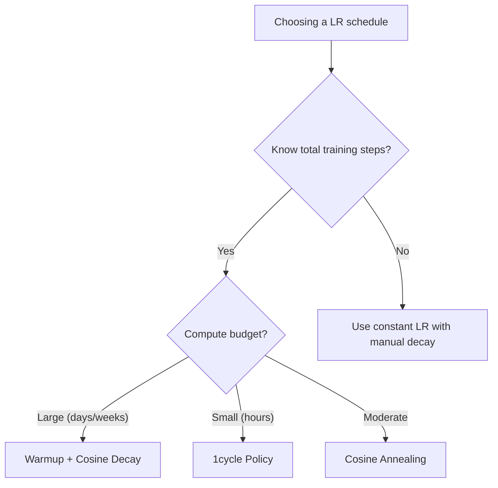

# Learning Rate Schedules and Warmup

> The learning rate is the single most important hyperparameter. Not the architecture. Not the dataset size. Not the activation function. The learning rate. If you tune nothing else, tune this.

**Type:** Build
**Languages:** Python
**Prerequisites:** Lesson 03.06 (Optimizers), Lesson 03.08 (Weight Initialization)
**Time:** ~90 minutes

## Learning Objectives

- Implement constant, step decay, cosine annealing, warmup + cosine, and 1cycle learning rate schedules from scratch
- Demonstrate the three failure modes of learning rate selection: divergence (too high), stalling (too low), and oscillation (no decay)
- Explain why warmup is necessary for Adam-based optimizers and how it stabilizes early training
- Compare convergence speed across all five schedules on the same task and select the appropriate one for a given training budget

## The Problem

The optimal learning rate is not a constant. It changes during training. Early on, you want large steps to cover ground quickly. Late in training, you want tiny steps to settle into a sharp minimum. The difference between a 90% accurate model and a 95% accurate model is often just the schedule.

Every major model uses a learning rate schedule. Llama 3 used peak lr=3e-4 with 2000 warmup steps and cosine decay to 3e-5. GPT-3 used lr=6e-4 with warmup over 375 million tokens. These result from multi-million-dollar hyperparameter sweeps.

## The Concept

### Constant Learning Rate

```
lr(t) = lr_0
```

Rarely optimal. Either too high for the end (oscillation) or too low for the beginning (wasted compute).

### Step Decay

```
lr(t) = lr_0 * gamma^(floor(epoch / step_size))
```

Old-school approach from the ResNet era. ResNet-50 used lr=0.1, drop by 10x at epochs 30, 60, and 90.

### Cosine Annealing

```
lr(t) = lr_min + 0.5 * (lr_max - lr_min) * (1 + cos(pi * t / T))
```

Smooth decay from lr_max to lr_min. No hyperparameters to tune beyond lr_max and lr_min. Default for most modern training runs.

### Warmup: Why You Start Small

Adam initializes running estimates of gradient mean and variance to zero. The first few gradient updates are based on garbage statistics. Warmup fixes this by starting with a tiny learning rate and linearly ramping up:

```
lr(t) = lr_max * (t / warmup_steps)  for t < warmup_steps
```

Typical warmup: 1-5% of total training steps.

### Linear Warmup + Cosine Decay

The modern default. Ramp up linearly, then decay with cosine:

```
if t < warmup_steps:
    lr(t) = lr_max * (t / warmup_steps)
else:
    progress = (t - warmup_steps) / (total_steps - warmup_steps)
    lr(t) = lr_min + 0.5 * (lr_max - lr_min) * (1 + cos(pi * progress))
```

Used by Llama, GPT, PaLM, and most modern transformers.

### 1cycle Policy

Ramp the learning rate up from a low value to a high value in the first half, then ramp it back down. A high learning rate acts as regularization. 1cycle often trains faster than cosine annealing.

### Schedule Shapes



### Decision Flowchart



### Published LR Configs

| Model | Peak LR | Warmup | Schedule |
|-------|---------|--------|----------|
| Llama 3 (405B) | 3e-4 | 2000 steps | Cosine to 3e-5 |
| GPT-3 (175B) | 6e-4 | 375M tokens | Cosine to 0 |
| ResNet-50 | 0.1 | none | Step decay x0.1 at 30,60,90 |
| BERT (340M) | 1e-4 | 10K steps | Linear decay |

## Build It

### Step 1: Schedule Functions

```python
import math

def constant_schedule(step, lr=0.01, **kwargs):
    return lr

def step_decay_schedule(step, lr=0.1, step_size=100, gamma=0.1, **kwargs):
    return lr * (gamma ** (step // step_size))

def cosine_schedule(step, lr=0.01, total_steps=1000, lr_min=1e-5, **kwargs):
    if step >= total_steps: return lr_min
    return lr_min + 0.5 * (lr - lr_min) * (1 + math.cos(math.pi * step / total_steps))

def warmup_cosine_schedule(step, lr=0.01, total_steps=1000, warmup_steps=100, lr_min=1e-5, **kwargs):
    if step < warmup_steps:
        return lr * step / warmup_steps
    progress = (step - warmup_steps) / (total_steps - warmup_steps)
    return lr_min + 0.5 * (lr - lr_min) * (1 + math.cos(math.pi * progress))

def one_cycle_schedule(step, lr=0.01, total_steps=1000, **kwargs):
    mid = max(total_steps // 2, 1)
    if step < mid:
        return (lr / 25) + (lr - lr / 25) * step / mid
    else:
        progress = (step - mid) / max(total_steps - mid, 1)
        return lr * (1 - progress) + (lr / 10000) * progress
```

### Step 2: LR Sensitivity

```python
def lr_sensitivity(data):
    learning_rates = [1.0, 0.1, 0.01, 0.001, 0.0001]
    for lr in learning_rates:
        losses = train_with_schedule(constant_schedule, f"lr={lr}", data, epochs=100, base_lr=lr)
        start, end = losses[0], losses[-1]
        if end > start or math.isnan(end) or end > 1.0:
            status = "DIVERGED"
        elif end > start * 0.9:
            status = "BARELY MOVED"
        elif end < 0.15:
            status = "CONVERGED"
        else:
            status = "LEARNING"
        print(f"  lr={lr:>8.4f}: start={start:.4f}, end={end:.4f}, {status}")
```

## Use It

```python
import torch.optim as optim
from torch.optim.lr_scheduler import CosineAnnealingLR, OneCycleLR, StepLR

optimizer = optim.Adam(model.parameters(), lr=3e-4)
scheduler = CosineAnnealingLR(optimizer, T_max=1000, eta_min=1e-5)

for step in range(1000):
    loss = train_step(model, optimizer)
    scheduler.step()
```

For warmup + cosine with HuggingFace:

```python
from transformers import get_cosine_schedule_with_warmup

scheduler = get_cosine_schedule_with_warmup(
    optimizer, num_warmup_steps=2000, num_training_steps=100000,
)
```

When in doubt, use warmup + cosine with warmup = 3-5% of total steps.

## Key Terms

| Term | What people say | What it actually means |
|------|----------------|----------------------|
| Learning rate | "How fast the model learns" | The scalar multiplying the gradient for parameter updates |
| Schedule | "Change the LR over time" | A function mapping training step to learning rate |
| Warmup | "Start with a small LR" | Linearly ramp LR from zero to target to stabilize optimizer stats |
| Cosine annealing | "Smooth LR decay" | Decreasing LR following a cosine curve |
| Step decay | "Drop LR at milestones" | Multiplying LR by a factor at fixed intervals |
| 1cycle policy | "Up then down" | Ramping LR up then down in a single cycle |
| LR range test | "Find the best learning rate" | Sweep LR to find where loss starts diverging |
| Peak learning rate | "The maximum LR" | Highest LR reached during training, typically after warmup |

## Exercises

1. Implement exponential decay: lr(t) = lr_0 * gamma^t. Compare to cosine annealing.
2. Implement the learning rate range test: train while exponentially increasing LR from 1e-7 to 1.
3. Train with warmup + cosine, vary warmup length: 0%, 1%, 5%, 10%, 20% of total steps.
4. Implement cosine annealing with warm restarts (SGDR).
5. Build a "schedule surgeon" that monitors loss and adjusts LR automatically.

## Further Reading

- Loshchilov & Hutter, "SGDR: Stochastic Gradient Descent with Warm Restarts" (2017)
- Smith, "Super-Convergence: Very Fast Training of Neural Networks Using Large Learning Rates" (2018)
- Touvron et al., "Llama 2: Open Foundation and Fine-Tuned Chat Models" (2023)
- Goyal et al., "Accurate, Large Minibatch SGD: Training ImageNet in 1 Hour" (2017)

[Reference](https://github.com/rohitg00/ai-engineering-from-scratch/tree/main/phases/03-deep-learning-core/09-learning-rate-schedules)
