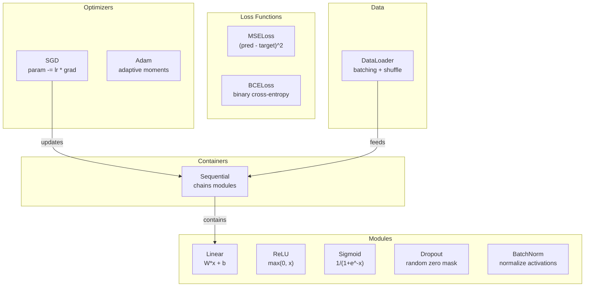

# Build Your Own Mini Framework

> You have built neurons, layers, networks, backprop, activations, loss functions, optimizers, regularization, initialization, and LR schedules. All as separate pieces. Now wire them together into a framework. Not PyTorch. Not TensorFlow. Yours.

**Type:** Build
**Languages:** Python
**Prerequisites:** All of Phase 03 (Lessons 01-09)
**Time:** ~120 minutes

## Learning Objectives

- Build a complete deep learning framework (~500 lines) with Module, Linear, ReLU, Sigmoid, Dropout, BatchNorm, Sequential, loss functions, optimizers, and DataLoader
- Explain the Module abstraction (forward, backward, parameters) and why train/eval mode toggling is necessary
- Wire all components into a working training loop that trains a 4-layer network on circle classification
- Map each component of your framework to its PyTorch equivalent (nn.Module, nn.Sequential, optim.Adam, DataLoader)

## The Problem

You have ten lessons of building blocks scattered across separate files. To train a network, you copy-paste from five different lessons. That is what frameworks solve.

You are going to build the same thing in ~500 lines of Python. No numpy. No external dependencies. When you finish, you will understand exactly what happens when you write `model = nn.Sequential(...)` in PyTorch.

## The Concept

### The Module Abstraction

Every layer in PyTorch inherits from `nn.Module`. A Module has three responsibilities:
1. **forward()** -- compute the output given inputs
2. **parameters()** -- return all trainable weights
3. **backward()** -- compute gradients

### Sequential Container

`nn.Sequential` chains Modules. The container itself is a Module -- it has forward(), parameters(), and backward(). This is the composite pattern.

### Training vs Evaluation Mode

Dropout randomly zeroes neurons during training but passes everything through during evaluation. Batch normalization uses batch statistics during training but running averages during evaluation. The `train()` and `eval()` methods toggle this.

### Framework Architecture



## Build It

### Step 1: Module Base Class

```python
class Module:
    def __init__(self):
        self.training = True
    def forward(self, x): raise NotImplementedError
    def backward(self, grad): raise NotImplementedError
    def parameters(self): return []
    def train(self): self.training = True
    def eval(self): self.training = False
```

### Step 2: Linear Layer

```python
import math, random

class Linear(Module):
    def __init__(self, fan_in, fan_out):
        super().__init__()
        std = math.sqrt(2.0 / fan_in)
        self.weights = [[random.gauss(0, std) for _ in range(fan_in)] for _ in range(fan_out)]
        self.biases = [0.0] * fan_out
        self.weight_grads = [[0.0] * fan_in for _ in range(fan_out)]
        self.bias_grads = [0.0] * fan_out
        self.fan_in = fan_in
        self.fan_out = fan_out
        self.input = None

    def forward(self, x):
        self.input = x
        output = []
        for i in range(self.fan_out):
            val = self.biases[i]
            for j in range(self.fan_in):
                val += self.weights[i][j] * x[j]
            output.append(val)
        return output

    def backward(self, grad):
        input_grad = [0.0] * self.fan_in
        for i in range(self.fan_out):
            self.bias_grads[i] += grad[i]
            for j in range(self.fan_in):
                self.weight_grads[i][j] += grad[i] * self.input[j]
                input_grad[j] += grad[i] * self.weights[i][j]
        return input_grad

    def parameters(self):
        params = []
        for i in range(self.fan_out):
            for j in range(self.fan_in):
                params.append((self.weights, i, j, self.weight_grads))
            params.append((self.biases, i, None, self.bias_grads))
        return params
```

### Step 3: Activation Modules

```python
class ReLU(Module):
    def __init__(self):
        super().__init__()
        self.mask = None
    def forward(self, x):
        self.mask = [1.0 if v > 0 else 0.0 for v in x]
        return [max(0.0, v) for v in x]
    def backward(self, grad):
        return [g * m for g, m in zip(grad, self.mask)]

class Sigmoid(Module):
    def __init__(self):
        super().__init__()
        self.output = None
    def forward(self, x):
        self.output = []
        for v in x:
            v = max(-500, min(500, v))
            self.output.append(1.0 / (1.0 + math.exp(-v)))
        return self.output
    def backward(self, grad):
        return [g * o * (1 - o) for g, o in zip(grad, self.output)]
```

### Step 4: Dropout Module

```python
class Dropout(Module):
    def __init__(self, p=0.5):
        super().__init__()
        self.p = p
        self.mask = None
    def forward(self, x):
        if not self.training:
            return x
        self.mask = [0.0 if random.random() < self.p else 1.0 / (1 - self.p) for _ in x]
        return [v * m for v, m in zip(x, self.mask)]
    def backward(self, grad):
        if self.mask is None: return grad
        return [g * m for g, m in zip(grad, self.mask)]
```

### Step 5: Sequential Container

```python
class Sequential(Module):
    def __init__(self, *modules):
        super().__init__()
        self.modules = list(modules)
    def forward(self, x):
        for module in self.modules:
            x = module.forward(x)
        return x
    def backward(self, grad):
        for module in reversed(self.modules):
            grad = module.backward(grad)
        return grad
    def parameters(self):
        params = []
        for module in self.modules:
            params.extend(module.parameters())
        return params
    def train(self):
        self.training = True
        for module in self.modules:
            module.train()
    def eval(self):
        self.training = False
        for module in self.modules:
            module.eval()
```

### Step 6: Loss Functions

```python
class MSELoss:
    def __call__(self, predicted, target):
        self.predicted = predicted
        self.target = target
        n = len(predicted)
        self.loss = sum((p - t) ** 2 for p, t in zip(predicted, target)) / n
        return self.loss
    def backward(self):
        n = len(self.predicted)
        return [2 * (p - t) / n for p, t in zip(self.predicted, self.target)]

class BCELoss:
    def __call__(self, predicted, target):
        self.predicted = predicted
        self.target = target
        eps = 1e-7
        n = len(predicted)
        self.loss = 0
        for p, t in zip(predicted, target):
            p = max(eps, min(1 - eps, p))
            self.loss += -(t * math.log(p) + (1 - t) * math.log(1 - p))
        self.loss /= n
        return self.loss
    def backward(self):
        eps = 1e-7
        n = len(self.predicted)
        grads = []
        for p, t in zip(self.predicted, self.target):
            p = max(eps, min(1 - eps, p))
            grads.append((-t / p + (1 - t) / (1 - p)) / n)
        return grads
```

### Step 7: Optimizers

```python
class SGD:
    def __init__(self, parameters, lr=0.01):
        self.params = parameters
        self.lr = lr
    def step(self):
        for container, i, j, grad_container in self.params:
            if j is not None:
                container[i][j] -= self.lr * grad_container[i][j]
            else:
                container[i] -= self.lr * grad_container[i]
    def zero_grad(self):
        for container, i, j, grad_container in self.params:
            if j is not None:
                grad_container[i][j] = 0.0
            else:
                grad_container[i] = 0.0

class Adam:
    def __init__(self, parameters, lr=0.001, beta1=0.9, beta2=0.999, eps=1e-8):
        self.params = parameters
        self.lr = lr
        self.beta1 = beta1
        self.beta2 = beta2
        self.eps = eps
        self.t = 0
        self.m = [0.0] * len(parameters)
        self.v = [0.0] * len(parameters)
    def step(self):
        self.t += 1
        for idx, (container, i, j, grad_container) in enumerate(self.params):
            g = grad_container[i][j] if j is not None else grad_container[i]
            self.m[idx] = self.beta1 * self.m[idx] + (1 - self.beta1) * g
            self.v[idx] = self.beta2 * self.v[idx] + (1 - self.beta2) * g * g
            m_hat = self.m[idx] / (1 - self.beta1 ** self.t)
            v_hat = self.v[idx] / (1 - self.beta2 ** self.t)
            update = self.lr * m_hat / (math.sqrt(v_hat) + self.eps)
            if j is not None:
                container[i][j] -= update
            else:
                container[i] -= update
    def zero_grad(self):
        for container, i, j, grad_container in self.params:
            if j is not None:
                grad_container[i][j] = 0.0
            else:
                grad_container[i] = 0.0
```

### Step 8: DataLoader

```python
class DataLoader:
    def __init__(self, data, batch_size=32, shuffle=True):
        self.data = data
        self.batch_size = batch_size
        self.shuffle = shuffle
    def __iter__(self):
        indices = list(range(len(self.data)))
        if self.shuffle:
            random.shuffle(indices)
        for start in range(0, len(indices), self.batch_size):
            batch_indices = indices[start:start + self.batch_size]
            batch = [self.data[i] for i in batch_indices]
            yield [item[0] for item in batch], [item[1] for item in batch]
```

### Step 9: Training Loop

```python
def make_circle_data(n=500, seed=42):
    random.seed(seed)
    data = []
    for _ in range(n):
        x = random.uniform(-2, 2)
        y = random.uniform(-2, 2)
        label = 1.0 if x * x + y * y < 1.5 else 0.0
        data.append(([x, y], [label]))
    return data

def train():
    random.seed(42)
    model = Sequential(
        Linear(2, 16), ReLU(),
        Linear(16, 16), ReLU(),
        Linear(16, 8), ReLU(),
        Linear(8, 1), Sigmoid(),
    )
    criterion = BCELoss()
    optimizer = Adam(model.parameters(), lr=0.01)
    data = make_circle_data(500)
    split = int(len(data) * 0.8)
    train_data, test_data = data[:split], data[split:]
    loader = DataLoader(train_data, batch_size=16, shuffle=True)
    model.train()

    for epoch in range(100):
        total_loss = 0
        total_correct = 0
        total_samples = 0
        for batch_inputs, batch_targets in loader:
            for x, t in zip(batch_inputs, batch_targets):
                pred = model.forward(x)
                loss = criterion(pred, t)
                optimizer.zero_grad()
                grad = criterion.backward()
                model.backward(grad)
                optimizer.step()
                if (pred[0] >= 0.5) == (t[0] >= 0.5):
                    total_correct += 1
                total_samples += 1
            total_loss += loss
        if epoch % 10 == 0 or epoch == 99:
            print(f"Epoch {epoch:3d} | Accuracy: {total_correct/total_samples*100:.1f}%")
```

## Use It

Here is the PyTorch equivalent of what you just built:

```python
import torch.nn as nn

model = nn.Sequential(
    nn.Linear(2, 16), nn.ReLU(),
    nn.Linear(16, 16), nn.ReLU(),
    nn.Linear(16, 8), nn.ReLU(),
    nn.Linear(8, 1), nn.Sigmoid(),
)
criterion = nn.BCELoss()
optimizer = torch.optim.Adam(model.parameters(), lr=0.01)
```

The structure is identical. `Sequential`, `Linear`, `ReLU`, `BCELoss`, `Adam`, `zero_grad`, `backward`, `step`, `train`, `eval`. Every concept maps one-to-one.

## Key Terms

| Term | What people say | What it actually means |
|------|----------------|----------------------|
| Module | "A layer" | Base abstraction with forward(), backward(), parameters() |
| Sequential | "Stack layers in order" | A container that chains modules |
| Forward pass | "Run the network" | Passing input through each module in order |
| Backward pass | "Compute gradients" | Propagating loss gradient through each module in reverse |
| Parameters | "The trainable weights" | All values the optimizer can update |
| Optimizer | "The thing that updates weights" | Algorithm using gradients to update parameters |
| DataLoader | "The thing that feeds data" | Iterator batching and shuffling a dataset |
| Training mode | "model.train()" | Enables dropout, BN uses batch stats |
| Evaluation mode | "model.eval()" | Disables dropout, BN uses running stats |
| Zero grad | "Clear the gradients" | Reset parameter gradients before computing new ones |

## Exercises

1. Add a `SoftmaxCrossEntropyLoss` class. Test on a 3-class spiral dataset.
2. Implement learning rate scheduling. Add `set_lr()` and wire in the cosine schedule.
3. Add `save()` and `load()` to Sequential that serializes weights to JSON.
4. Implement weight decay in the Adam optimizer.
5. Replace the per-sample loop with proper mini-batch gradient accumulation.

## Further Reading

- Paszke et al., "PyTorch: An Imperative Style, High-Performance Deep Learning Library" (2019)
- Chollet, "Deep Learning with Python, Second Edition" (2021)
- Johnson, "Tiny-DNN" (https://github.com/tiny-dnn/tiny-dnn)

[Reference](https://github.com/rohitg00/ai-engineering-from-scratch/tree/main/phases/03-deep-learning-core/10-mini-framework)
