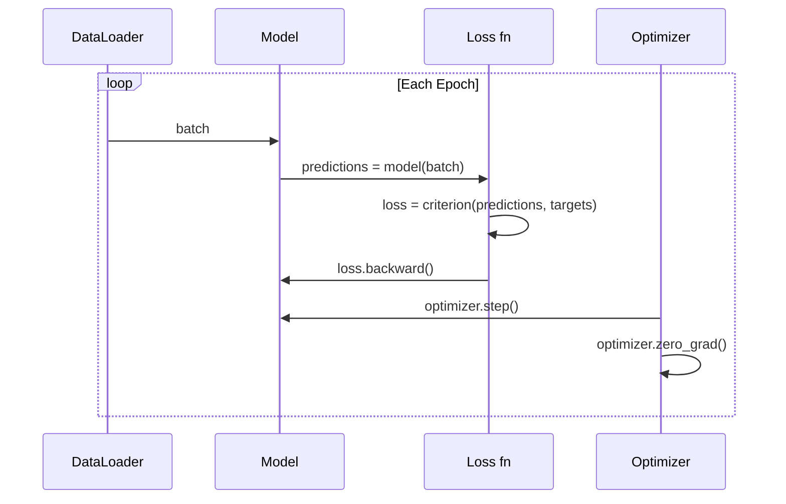

# Introduction to PyTorch

> You built the engine from pistons and crankshafts. Now learn the one everyone actually drives.

**Type:** Build
**Languages:** Python
**Prerequisites:** Lesson 03.10 (Build Your Own Mini Framework)
**Time:** ~75 minutes

## Learning Objectives

- Build and train neural networks using PyTorch's nn.Module, nn.Sequential, and autograd
- Use PyTorch tensors, GPU acceleration, and the standard training loop (zero_grad, forward, loss, backward, step)
- Convert your from-scratch mini framework components to their PyTorch equivalents
- Profile and compare training speed between your pure-Python framework and PyTorch on the same task

## The Problem

Your mini framework trains a 4-layer network on circle classification in pure Python. It is also 500x slower than PyTorch on the same problem. PyTorch dispatches operations to optimized C++/CUDA kernels that run on GPU.

Speed is not the only gap. Your framework has no GPU support, no automatic differentiation, no serialization, no mixed precision. PyTorch fills every gap while keeping the exact same mental model.

## The Concept

### Why PyTorch Won

TensorFlow required defining static computation graphs before running anything. PyTorch launched with eager execution -- you write Python, it runs immediately. This meant standard debugging tools worked. By 2022, PyTorch had over 75% of ML research papers.

### Tensors

A tensor is a multi-dimensional array with three properties: shape, dtype, and device.

```python
import torch
x = torch.zeros(3, 4)           # shape: (3, 4), device: cpu
x = torch.randn(2, 3, 224, 224) # batch of 2 RGB images
x = torch.tensor([1, 2, 3])     # from a Python list
```

**Dtype** controls precision: float32 (default training), float16 (mixed precision), bfloat16 (LLM training), int8 (quantized inference).

**Device** determines where computation happens:
```python
device = torch.device("cuda" if torch.cuda.is_available() else "cpu")
x = torch.randn(3, 4, device=device)
x = x.to("cuda")
x = x.cpu()
```

### Autograd

PyTorch records every operation on tensors into a directed acyclic graph. Calling `.backward()` traverses the graph in reverse to compute gradients automatically.

```python
x = torch.randn(3, requires_grad=True)
y = x ** 2 + 3 * x
z = y.sum()
z.backward()
print(x.grad)  # dz/dx = 2x + 3
```

Three rules:
1. Only leaf tensors with `requires_grad=True` accumulate gradients
2. Call `optimizer.zero_grad()` before each backward pass (gradients accumulate)
3. Use `torch.no_grad()` during evaluation

### nn.Module

```python
import torch.nn as nn

class MLP(nn.Module):
    def __init__(self, input_dim, hidden_dim, output_dim):
        super().__init__()
        self.layer1 = nn.Linear(input_dim, hidden_dim)
        self.relu = nn.ReLU()
        self.layer2 = nn.Linear(hidden_dim, output_dim)
    def forward(self, x):
        x = self.layer1(x)
        x = self.relu(x)
        x = self.layer2(x)
        return x
```

Key building blocks:

| Module | What it does | Parameters |
|--------|-------------|------------|
| nn.Linear(in, out) | Wx + b | in*out + out |
| nn.Conv2d(in_ch, out_ch, k) | 2D convolution | in_ch*out_ch*k*k + out_ch |
| nn.BatchNorm1d(features) | Normalize activations | 2 * features |
| nn.Dropout(p) | Random zeroing | 0 |
| nn.ReLU() | max(0, x) | 0 |
| nn.GELU() | Gaussian error linear | 0 |
| nn.Embedding(vocab, dim) | Lookup table | vocab * dim |

### The Training Loop

Every PyTorch training loop follows the same 5-step pattern:



```python
for epoch in range(num_epochs):
    model.train()
    for inputs, targets in train_loader:
        inputs, targets = inputs.to(device), targets.to(device)
        optimizer.zero_grad()
        outputs = model(inputs)
        loss = criterion(outputs, targets)
        loss.backward()
        optimizer.step()
```

Five lines that trained GPT-4, Stable Diffusion, and LLaMA.

### GPU and Mixed Precision

```python
device = torch.device("cuda" if torch.cuda.is_available() else "cpu")
model = model.to(device)

# Mixed precision
from torch.amp import autocast, GradScaler
scaler = GradScaler()
for inputs, targets in loader:
    with autocast(device_type="cuda"):
        outputs = model(inputs)
        loss = criterion(outputs, targets)
    scaler.scale(loss).backward()
    scaler.step(optimizer)
    scaler.update()
    optimizer.zero_grad()
```

### Comparison: Mini Framework vs PyTorch

| Mini Framework (Lesson 10) | PyTorch |
|---------------------------|---------|
| `model = Sequential(Linear(784, 256), ReLU(), ...)` | `model = nn.Sequential(nn.Linear(784, 256), nn.ReLU(), ...)` |
| `pred = model.forward(x)` | `pred = model(x)` |
| `optimizer.zero_grad()` | `optimizer.zero_grad()` |
| `grad = criterion.backward()` then `model.backward(grad)` | `loss.backward()` |
| `optimizer.step()` | `optimizer.step()` |
| No GPU | `model.to("cuda")` |
| Manual backward for every module | Autograd handles everything |

## Build It

### Step 1: MNIST Data Loading

```python
import torch
import torch.nn as nn
import struct, gzip, urllib.request, os

def download_mnist(path="./mnist_data"):
    base_url = "https://storage.googleapis.com/cvdf-datasets/mnist/"
    files = ["train-images-idx3-ubyte.gz", "train-labels-idx1-ubyte.gz",
             "t10k-images-idx3-ubyte.gz", "t10k-labels-idx1-ubyte.gz"]
    os.makedirs(path, exist_ok=True)
    for f in files:
        filepath = os.path.join(path, f)
        if not os.path.exists(filepath):
            urllib.request.urlretrieve(base_url + f, filepath)

def load_images(filepath):
    with gzip.open(filepath, "rb") as f:
        magic, num, rows, cols = struct.unpack(">IIII", f.read(16))
        data = f.read()
        images = torch.frombuffer(bytearray(data), dtype=torch.uint8)
        return images.reshape(num, rows * cols).float() / 255.0

def load_labels(filepath):
    with gzip.open(filepath, "rb") as f:
        magic, num = struct.unpack(">II", f.read(8))
        data = f.read()
        return torch.frombuffer(bytearray(data), dtype=torch.uint8).long()
```

### Step 2: Define the Model

```python
class MNISTModel(nn.Module):
    def __init__(self):
        super().__init__()
        self.net = nn.Sequential(
            nn.Linear(784, 256), nn.ReLU(), nn.Dropout(0.2),
            nn.Linear(256, 128), nn.ReLU(), nn.Dropout(0.2),
            nn.Linear(128, 10),
        )
    def forward(self, x):
        return self.net(x)
```

235,146 parameters. Tiny by modern standards.

### Step 3: Training Loop

```python
def train_one_epoch(model, loader, criterion, optimizer, device):
    model.train()
    total_loss, correct, total = 0, 0, 0
    for images, labels in loader:
        images, labels = images.to(device), labels.to(device)
        optimizer.zero_grad()
        outputs = model(images)
        loss = criterion(outputs, labels)
        loss.backward()
        optimizer.step()
        total_loss += loss.item() * images.size(0)
        _, predicted = outputs.max(1)
        correct += predicted.eq(labels).sum().item()
        total += labels.size(0)
    return total_loss / total, correct / total

def evaluate(model, loader, criterion, device):
    model.eval()
    total_loss, correct, total = 0, 0, 0
    with torch.no_grad():
        for images, labels in loader:
            images, labels = images.to(device), labels.to(device)
            outputs = model(images)
            loss = criterion(outputs, labels)
            total_loss += loss.item() * images.size(0)
            _, predicted = outputs.max(1)
            correct += predicted.eq(labels).sum().item()
            total += labels.size(0)
    return total_loss / total, correct / total
```

### Step 4: Main

```python
def main():
    device = torch.device("cuda" if torch.cuda.is_available() else "cpu")
    download_mnist()
    train_images = load_images("./mnist_data/train-images-idx3-ubyte.gz")
    train_labels = load_labels("./mnist_data/train-labels-idx1-ubyte.gz")
    test_images = load_images("./mnist_data/t10k-images-idx3-ubyte.gz")
    test_labels = load_labels("./mnist_data/t10k-labels-idx1-ubyte.gz")

    train_dataset = torch.utils.data.TensorDataset(train_images, train_labels)
    test_dataset = torch.utils.data.TensorDataset(test_images, test_labels)
    train_loader = torch.utils.data.DataLoader(train_dataset, batch_size=64, shuffle=True)
    test_loader = torch.utils.data.DataLoader(test_dataset, batch_size=256)

    model = MNISTModel().to(device)
    criterion = nn.CrossEntropyLoss()
    optimizer = torch.optim.Adam(model.parameters(), lr=1e-3)

    for epoch in range(10):
        train_loss, train_acc = train_one_epoch(model, train_loader, criterion, optimizer, device)
        test_loss, test_acc = evaluate(model, test_loader, criterion, device)
        print(f"Epoch {epoch+1:2d} | Train Acc: {train_acc:.4f} | Test Acc: {test_acc:.4f}")

    torch.save(model.state_dict(), "mnist_mlp.pt")
```

Expected: ~97.8% test accuracy after 10 epochs.

## Use It

### Saving and Loading

```python
torch.save(model.state_dict(), "model.pt")
model = MNISTModel()
model.load_state_dict(torch.load("model.pt", weights_only=True))
model.eval()
```

Always save `state_dict()`, not the model object.

### Learning Rate Scheduling

```python
scheduler = torch.optim.lr_scheduler.CosineAnnealingLR(optimizer, T_max=10)
for epoch in range(10):
    train_one_epoch(model, train_loader, criterion, optimizer, device)
    scheduler.step()
```

## Key Terms

| Term | What people say | What it actually means |
|------|----------------|----------------------|
| Tensor | "A multi-dimensional array" | A typed, device-aware array with autograd support |
| Autograd | "Automatic backprop" | Tape-based system recording operations for reverse replay |
| nn.Module | "A layer" | Base class for differentiable computation blocks |
| state_dict | "The model weights" | OrderedDict mapping parameter names to tensors |
| .backward() | "Compute gradients" | Traverse computational graph in reverse |
| .to(device) | "Move to GPU" | Transfer parameters to specified device |
| DataLoader | "The data pipeline" | Iterator for batching, shuffling, parallel data loading |
| Mixed precision | "Use float16" | Train with float16 for speed, float32 for stability |
| Eager execution | "Run it now" | Operations execute immediately when called |
| zero_grad | "Reset gradients" | Clear parameter gradients before next backward pass |

## Exercises

1. Add batch normalization. Insert nn.BatchNorm1d after each linear layer. Compare accuracy.
2. Implement a learning rate finder. Train for one epoch with exponentially increasing LR.
3. Port to GPU with mixed precision. Measure throughput with and without.
4. Build a custom Dataset for Fashion-MNIST. Train the same MLP and compare accuracy.
5. Replace Adam with SGD + momentum. Add CosineAnnealingLR. Compare convergence.

## Further Reading

- Paszke et al., "PyTorch: An Imperative Style, High-Performance Deep Learning Library" (2019)
- PyTorch Tutorials: "Learning PyTorch with Examples" (https://pytorch.org/tutorials/beginner/pytorch_with_examples.html)
- PyTorch Performance Tuning Guide (https://pytorch.org/tutorials/recipes/recipes/tuning_guide.html)
- Horace He, "Making Deep Learning Go Brrrr" (https://horace.io/brrr_intro.html)

[Reference](https://github.com/rohitg00/ai-engineering-from-scratch/tree/main/phases/03-deep-learning-core/11-intro-to-pytorch)
