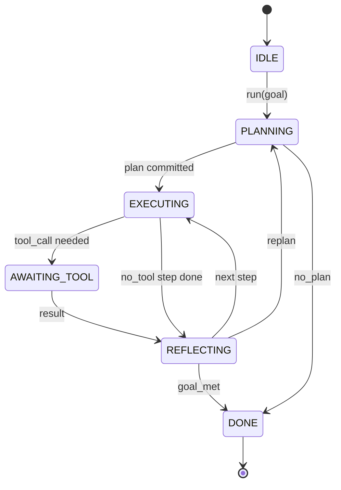
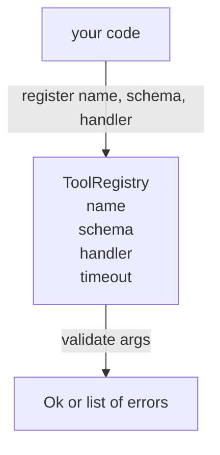
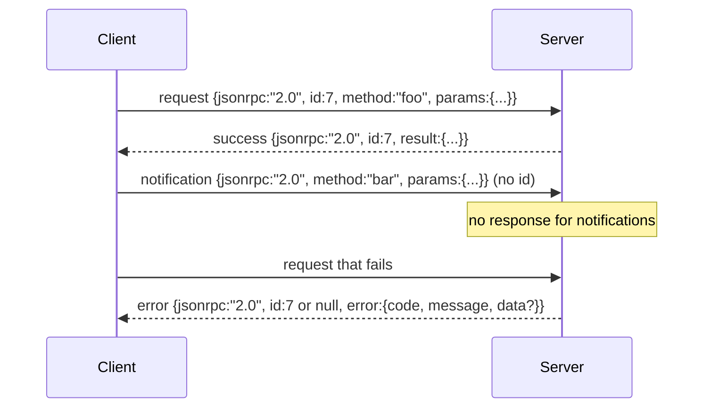
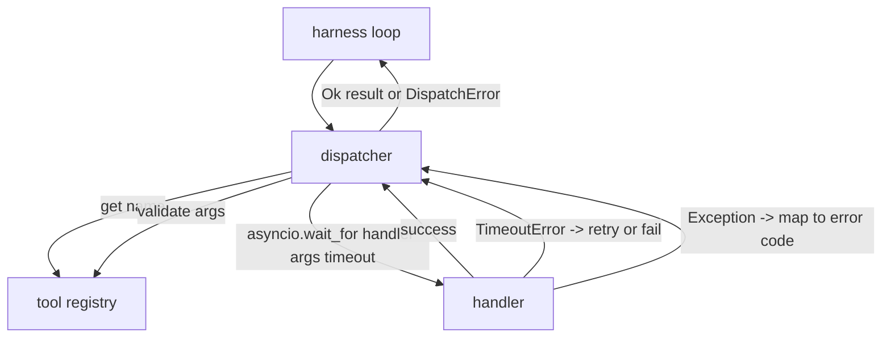
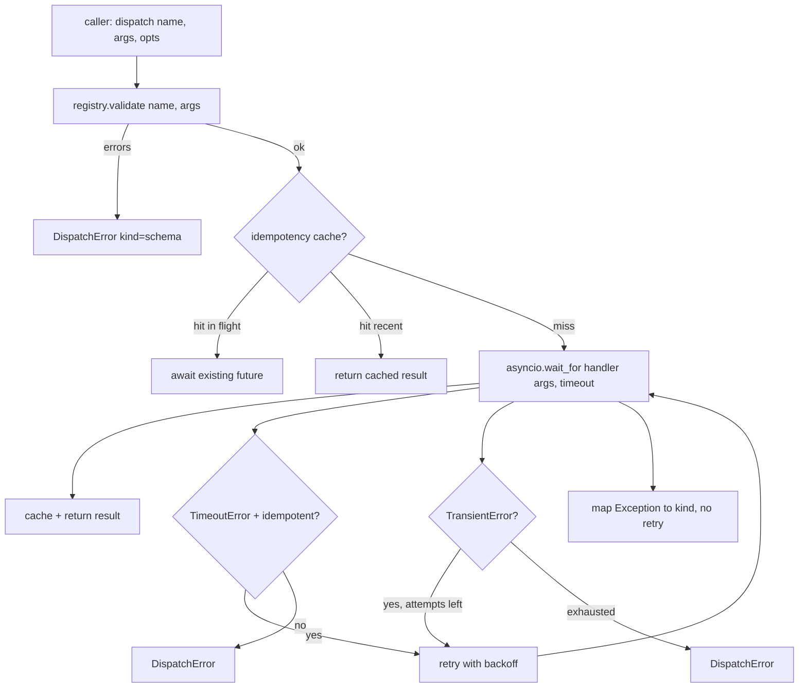

# Agent Harness: Loop, Registry & Transport

> Combined lessons (4 parts), merged verbatim — no content removed.

**Type:** Combined

---

## Part 1 (ch434): Agent Harness Loop Contract

> The harness is the agent. The model is a coprocessor. This lesson freezes the loop contract you can wire any model into.

**Type:** Build
**Languages:** Python
**Prerequisites:** Phase 13 lessons 01-07, Phase 14 lesson 01
**Time:** ~90 minutes

## Learning Objectives

- Specify an agent harness loop as a deterministic state machine with explicit transitions.
- Implement ten lifecycle hook topics that operators wire policy, telemetry, and guardrails into.
- Define two pull points where the loop yields control back to the caller and resumes on a fresh input.
- Enforce per-session budgets (turns, tool calls, wall-clock) without leaking partial state on exceeding.
- Emit a typed stream of eleven event types so downstream UIs and tracers can subscribe without inspecting the loop directly.

## The frame

A coding agent that runs unattended for forty turns is not a chat loop. It is a state machine whose nodes the operator can intercept and whose edges the operator can audit. Once you write the contract down, swapping models, tools, or policies stops being a refactor. It becomes a registration call.

This lesson builds that contract. We name six states, ten hook topics, two pull points, eleven event types, and a budget envelope. Everything else in the harness (tool registry, JSON-RPC transport, dispatcher, planner) plugs into this shape.

## The states

The loop has six states. Five are active. One is terminal.



`IDLE` is the only legal entry point. `DONE` is the only legal exit. `AWAITING_TOOL` is the only state that yields a pull point. Every other transition is internal.

The state machine is deterministic. Given the same event log, the harness re-enters the same state. That property is what lets you replay sessions for debugging without re-calling the model.

## The hook topics

Hooks are the operator's seam into the loop. The harness fires ten topics. Each topic accepts any number of subscribers. Subscribers fire in registration order. A subscriber may mutate the payload, raise to abort the turn, or return a sentinel to skip the next step.

```text
before_plan         after_plan
before_tool_call    after_tool_call
before_step         after_step
on_error
on_pause
on_budget_exceeded
on_complete
```

The shape mirrors what Claude Code, Cursor, and OpenCode all converged on by mid-2025. The names are functional, not branded. A hook that blocks `rm -rf` lives in `before_tool_call`. A hook that ships an OpenTelemetry span lives in `after_step`. A hook that resumes on a paused session lives in `on_pause`.

## The pull points

The loop yields control twice. First on `AWAITING_TOOL` when it cannot make progress without a tool result. Second on `on_pause` when the budget is exhausted or a hook explicitly requests human review.

A pull point is not an exception. It is a return. The caller inspects the harness state, fetches whatever the harness asked for, and calls `resume(payload)`. The harness picks up where it stopped. This is the same shape as a Python generator. The transport over the pull point is your choice. In a TUI it is keypress. Over MCP it is `tools/call`. Over a queue it is a job poll.

## The event stream

The loop appends events to a typed stream at specific points in the contract. The stream is append-only and subscribers can replay from any offset. The eleven implemented event types are:

- `session.start` — emitted once when `run(goal)` is called
- `plan.draft` — emitted when the planner returns a draft plan
- `plan.commit` — emitted after the draft is committed as the active plan
- `step.start` — emitted at the start of each executing step
- `step.end` — emitted at the end of each executing step
- `tool.call` — emitted when a tool-requiring step yields control to the caller
- `tool.result` — emitted on resume with a tool result
- `tool.error` — emitted on resume with an error or when a hook aborts the call
- `budget.warn` — emitted when a budget limit is reached
- `session.pause` — emitted when the loop yields on a pause (budget or hook)
- `session.complete` — emitted once when the loop reaches `DONE`

The events do not duplicate hook payloads. Hooks are imperative (mutate, abort). Events are observational (record, ship). Treat them as orthogonal.

## The budget envelope

A session carries three limits. Turn count, tool call count, wall-clock seconds. Each turn increments turns by one. Each tool call increments tool calls by one. Wall-clock is checked on every state transition. When any limit is reached, the loop fires `on_budget_exceeded`, emits `budget.warn`, then transitions to `IDLE` with a budget-exceeded reason on the next pull point.

The budget is not a kill switch. It is a yield. The caller decides whether to extend the budget and resume, or to close the session.

## What this lesson does not do

It does not call a model. It does not register real tools. It does not implement a transport. Those are the next four lessons. This lesson nails the contract so the next four can plug into it without rewriting.

The deterministic planner in `main.py` is a stand-in. It returns a hardcoded plan of three steps, two of which require a tool result. The point is the loop, not the plan.

## How to read the code

`HarnessLoop` is the main class. It holds state, fires hooks, emits events. `Budget` tracks limits. `Event` is the typed envelope on the stream. `HookRegistry` is the dispatch table. `_transition` is the only function that changes state, so the state machine invariants live in one place.

## Going further

The hardest part of building a harness in production is not the state machine. It is making the contract enforceable. The contract has to survive a hot reload of the planner. It has to survive a tool that returns malformed JSON. It has to survive a hook that raises in `before_tool_call` two-thirds of the way through a forty-turn session. The tests in this lesson exercise those failure modes.

The next lesson adds the tool registry. After that, the JSON-RPC transport. After that, the dispatcher. By lesson twenty-four, the loop in this file will be running a real plan against real tools with real budgets enforced.

[Reference](https://github.com/rohitg00/ai-engineering-from-scratch/tree/main/phases/19-capstone-projects/20-agent-harness-loop-contract)

---

## Part 2 (ch435): Tool Registry with Schema Validation

> A tool the agent cannot validate is a tool the agent cannot call. Build the registry and the schema checker before you build the tools.

**Type:** Build
**Languages:** Python
**Prerequisites:** Phase 13 lessons 01-07, Phase 14 lesson 01
**Time:** ~90 minutes

## Learning Objectives

- Hold a typed registry of tool name → schema → handler that the dispatcher can ask once and trust afterwards.
- Implement a JSON Schema 2020-12 subset that covers the keywords ninety percent of tool calls actually use.
- Return precise, json-pointer-shaped error paths so the model can self-correct in one round trip.
- Reject re-registration without explicit override, since silent overwrites are how production tool catalogs drift.
- Keep the validator pure (no I/O, no time, no globals) so it can be re-run on a replay log.

## Why the registry comes before the tool

A coding agent in 2026 has more registered tools than the model can fit in a single context window. A non-trivial harness will register two hundred tools and surface ten to forty at any given turn. The registry is the source of truth for "what tools exist," "what shape do their arguments take," and "what handler do I call." Once those three answers are pinned, the rest of the harness can stop guessing.

The mistake we are avoiding is shipping handlers without schemas, or shipping schemas without validation. Both are common. Both turn the next layer (the dispatcher) into a guessing game where the only failure mode is a stack trace from the handler.

## What a tool record looks like

```text
ToolRecord
  name        : str          (unique, lowercase alphanumeric and underscore segments separated by dots)
  description : str          (one line, shown to the model)
  schema      : dict         (JSON Schema 2020-12 subset)
  handler     : Callable     (async or sync, returns Any)
  idempotent  : bool         (dispatcher uses this for retry decisions)
  timeout_ms  : int          (override per-tool dispatcher default)
```

The schema is the only field the validator touches. The handler is opaque to it. We separate them on purpose. The schema is data. The handler is code. Mixing them tempts you to put validation logic inside the handler, which is the bug we are stopping.

## The JSON Schema 2020-12 subset

The full 2020-12 spec is a paper. We need eight keywords.

```text
type           string / number / integer / boolean / object / array / null
properties     map of property name -> schema
required       list of property names
enum           list of allowed primitive values
minLength      integer, applies to strings
maxLength      integer, applies to strings
pattern        ECMA-262-compatible regex, applies to strings
items          schema applied to every array element
```

That is enough to cover what a tool API actually needs. The keywords we are not adding (oneOf, anyOf, allOf, $ref, conditionals) are valid in production schemas but turn the validator into a tree walker with cycles.

## Json pointer error paths

When validation fails, the validator returns a list of errors. Each error carries a json-pointer path into the input. A pointer is a slash-prefixed sequence of property names and array indices.

```text
{"a": {"b": [1, 2, "x"]}}
                    ^
                    /a/b/2
```

The model reads error paths better than it reads sentences. If a schema requires `args.user.email` and the model passed an integer, the error should be `/user/email` with `expected_type: string`. The model fixes that in the next call without a round of natural language.

## Registration and override

`register(name, schema, handler, **opts)` rejects re-registration by default. The caller has to pass `override=True` to replace. This is operational hygiene. Two parts of the codebase silently registering the same tool name is the kind of bug that takes a week to find in production.

The registry exposes three read methods. `get(name)` returns the record or raises. `validate(name, args)` returns an `Ok` or a list of errors. `names()` returns the tool names in registration order.

## What the validator is and is not

It is a single pass over the schema tree, recursive. It is pure. It does not call handlers. It does not coerce types (a string `"42"` does not pass a number schema). It does not silently truncate.

It is not a security boundary. A malicious handler can still misbehave after validation passes. The dispatcher adds timeout and sandbox layers. The registry adds shape.

## Shape



## How to read the code

`code/main.py` defines `ToolRegistry`, `ToolRecord`, `ValidationError`, and the eight validator functions. The validator dispatches on `schema["type"]` (or treats a schema with `enum` as untyped enum check). Each type validator returns either an empty list or a list of `ValidationError`. The top-level walker concatenates errors and prepends path segments as it descends.

`code/tests/test_registry.py` covers registration, override, validation success, validation failure with paths, and every keyword in the subset.

## Going further

The two extensions you will want once this lesson lands are `$ref` resolution against a local definitions block, and `additionalProperties: false` for strict shape. Both are small. Both are common to add as the tool catalog grows past fifty tools.

The next lesson builds the JSON-RPC stdio transport that surfaces this registry to a model client. The lesson after wraps both behind a dispatcher with timeouts and retries.

[Reference](https://github.com/rohitg00/ai-engineering-from-scratch/tree/main/phases/19-capstone-projects/21-tool-registry-schema-validation)

---

## Part 3 (ch436): JSON-RPC 2.0 Over Newline-Delimited Stdio

> The transport between a model client and a tool server is JSON-RPC over stdio. Hand-rolling it once teaches you what every framing layer is paying for.

**Type:** Build
**Languages:** Python
**Prerequisites:** Phase 13 lessons 01-07, Phase 14 lesson 01
**Time:** ~90 minutes

## Learning Objectives

- Speak JSON-RPC 2.0 framed as newline-delimited JSON over stdin and stdout.
- Map the five standard error codes (-32700, -32600, -32601, -32602, -32603) and surface them with the right semantics.
- Distinguish requests, responses, notifications, and batches without inventing new envelope keys.
- Handle one parse error per line without poisoning the rest of the stream.
- Build a self-terminating demo using io.BytesIO so the lesson runs without spawning a child process.

## Why JSON-RPC stays the lingua franca

A coding agent in 2026 talks to maybe twelve tool servers in a single session. Each server is a separate process or a remote endpoint. The wire format has been the same since 2013. JSON-RPC 2.0 is two-page spec. It survives because the alternatives (gRPC, HTTP per call, custom binary) all impose a tradeoff JSON-RPC does not: they pick either streaming or batching or transport-coupling. JSON-RPC is symmetric across stdio, sockets, websockets, and HTTP, and a client can drive a server it has never seen if both honor the spec.

This lesson builds the stdio variant. Newline-delimited JSON. Each request is one line. Each response is one line. The transport boundary is `\n`.

## The wire shape

Four envelope shapes exist. Two are spoken by the client. Two are spoken by the server.



A notification has no `id`. The server must not respond to it. If a server returns a response to a notification, the client has no way to attach it to a call site. That single rule keeps the framing math simple.

A batch is a JSON array of requests or notifications. The server replies with an array of responses, in any order, one per non-notification entry. If every entry in the batch is a notification, the server sends nothing back.

## The five error codes

```text
-32700  Parse error      JSON could not be parsed
-32600  Invalid Request  Envelope shape is wrong
-32601  Method not found
-32602  Invalid params
-32603  Internal error
```

The codes between -32000 and -32099 are reserved for server-defined errors. Everything else is application-defined. The lesson sticks to the five. If your handler raises, the transport wraps it as -32603 with the exception class name in `data.exception`.

A parse error has a special rule. The `id` in the response is `null`, because the request never parsed enough to extract an id.

## Newline framing and the BytesIO demo

The transport reads one line at a time. A line is bytes up to and including `\n`. If a line cannot be parsed, the transport writes a -32700 response with `id: null` and continues. The stream is not poisoned. The next line gets parsed fresh.

For the lesson we wrap an `io.BytesIO` pair as stdin and stdout. The server reads requests until EOF, writes responses for each, and returns. The client reads the responses back. No process spawn. No timeouts. The transport behavior is identical to a real subprocess pipe because Python's `io` interface presents the same `.readline()` and `.write()` contract.

## Method dispatch

The transport does not know which methods exist. It hands off to a callable `handler(method, params)` that the harness supplies. The handler returns a result or raises. Three exception classes surface specific codes.

```text
MethodNotFound -> -32601
InvalidParams  -> -32602
Anything else  -> -32603 with exception name in data
```

The transport never sees a tool registry. The registry sits behind the handler. This is the layering we want. The transport speaks JSON-RPC. The registry speaks tool shapes. The dispatcher stitches them together.

## Stream behavior on errors

```text
client writes              server reads             server writes
---------------            -----------              -------------
{...valid request...}      parses ok                {...response, id matches...}
{...broken json...         parse fails              {id:null, error: -32700}
{...valid request...}      parses ok                {...response, id matches...}
{...missing method...}     invalid envelope         {id:X, error: -32600}
```

A broken JSON line does not stop the loop. A missing `method` field does not stop the loop. A handler exception does not stop the loop. The transport keeps reading until EOF.

## Notifications and asymmetric flows

A notification is fire-and-forget. The harness uses notifications for progress events, cancellation signals, and log lines. Notifications are how a long-running tool can stream status updates without round-tripping for each one.

The lesson implements one outbound notification helper, `write_notification`. The server uses it to emit progress while a request is in flight. The demo shows the pattern: a request comes in, the handler emits two progress notifications, then writes the final response.

## How to read the code

`code/main.py` defines `StdioTransport`, the parse helper (`parse_request`), the three write helpers (`write_response`, `write_error`, `write_notification`), and the dispatch loop `serve`. The error code constants live at module scope.

`code/tests/test_transport.py` covers the five error codes, notifications (no response written), batches (array in, array out, notifications skipped), broken JSON (parse error then continue), and the asymmetric flow where a handler writes a notification mid-call.

## Going further

This transport is enough for the lessons that follow. Production transports add three things. A correlation id field that survives forwarding (your `id` is already this, but in a mesh you need an outer trace id too). A cancellation channel (a notification like `$/cancelRequest` with the id of the in-flight call). And a content-type negotiation handshake so the same socket can speak JSON-RPC and Streamable HTTP. None of those change the wire. They add metadata.

[Reference](https://github.com/rohitg00/ai-engineering-from-scratch/tree/main/phases/19-capstone-projects/22-jsonrpc-stdio-transport)

---

## Part 4 (ch437): Function Call Dispatcher

> The dispatcher is where the harness pays for every promise the schema made. Timeouts, retries, dedupe, error mapping. All on one seam.

**Type:** Build
**Languages:** Python
**Prerequisites:** Phase 13 lessons 01-07, Phase 14 lesson 01
**Time:** ~90 minutes

## Learning Objectives

- Wrap a tool handler in a per-call timeout that returns a typed error instead of hanging the loop.
- Apply exponential backoff retry with jitter and a maximum attempt count.
- Deduplicate retries on an idempotency key so a retry that races with a slow original does not run twice.
- Map handler exceptions and transport faults onto a single error envelope the harness loop already understands.
- Bound parallel dispatch with a concurrency limit so a fan-out of forty tool calls does not exhaust the event loop.

## Where the dispatcher sits

Between the harness loop and the tool registry. The transport feeds the loop. The loop hands a tool call to the dispatcher. The dispatcher calls the registry, runs the handler, and returns either a result or a JSON-RPC-shaped error envelope.



The dispatcher is the only layer that knows about timers, retries, and idempotency. The loop does not. The registry does not. The handler does not. That isolation is the point.

## Timeouts

Each tool has a default timeout. The registry record carries `timeout_ms`. The dispatcher overrides it from a per-call override when the harness passes one. We use `asyncio.wait_for`. On timeout, the handler task is cancelled and the dispatcher returns `DispatchError(kind="timeout")`.

A timeout is not a retryable error by default for non-idempotent tools. A `db.write` that timed out may or may not have committed. Retrying duplicates the write. The dispatcher honors the `idempotent` flag from the registry record. Idempotent tools retry. Non-idempotent tools do not.

## Retries with exponential backoff

The retry policy is three attempts maximum. Backoff is exponential with jitter.

```text
attempt 1  -> delay 0
attempt 2  -> delay 0.1s * (1 + random[0..0.5])
attempt 3  -> delay 0.4s * (1 + random[0..0.5])
```

Only `timeout` and `transient` errors retry. A `schema` error, a `not_found`, or an `internal` error does not retry. Schema errors are deterministic. Retrying does not change the outcome and burns the budget.

The retry loop respects the budget from the harness. If the caller's budget has zero remaining tool calls, the dispatcher fails fast on the first attempt and returns `kind="budget_exceeded"`.

## Idempotency key dedupe

A retry that fires while the original is still in flight is a real production bug. The first call hangs at four point nine seconds (just under the timeout). The retry fires at five seconds. Now two requests race against the same backend. If the tool is `payments.charge`, you charged twice.

The dispatcher accepts an optional `idempotency_key`. If the same key is in flight when a call arrives, the dispatcher waits on the in-flight future and returns its result. The cache holds keys for sixty seconds after completion to absorb late retries.

The key is the caller's responsibility. The harness derives it from the planner: `f"{step_id}:{tool_name}:{hash(args)}"`. The dispatcher does not invent keys, because deriving a key from arguments alone makes two semantically-different calls look the same.

## Error envelope

A failed dispatch returns a single shape.



## Concurrency limit on fan-out

`gather(*calls)` runs all coroutines simultaneously. With forty tool calls, that is forty open sockets or forty subprocess pipes. Most backends do not like forty parallel connections from one client.

The dispatcher wraps `gather` in a semaphore. Default concurrency limit is eight. Each call acquires the semaphore before dispatching and releases on completion. The caller sees `gather`-shaped output but the actual scheduling is bounded.

## How to read the code

`code/main.py` defines `Dispatcher`, `DispatchError`, and `TransientError`. The dispatcher takes a registry on construction. The async `dispatch(name, args, ...)` is the only entry point. `gather_bounded(calls)` runs many dispatches with the concurrency limit.

`code/tests/test_dispatcher.py` covers timeout firing, retry on transient, no-retry on schema error, idempotency dedupe, and concurrency limiting.

## Going further

Two extensions production dispatchers add: structured logging at every transition, and circuit breakers — after N failures in a window, a tool gets a cool-down period where dispatches return immediately with `kind="circuit_open"`.

[Reference](https://github.com/rohitg00/ai-engineering-from-scratch/tree/main/phases/19-capstone-projects/23-function-call-dispatcher)
