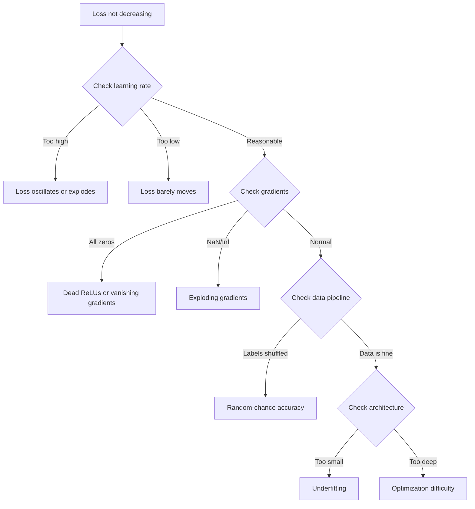

# Debugging Neural Networks

> Your network compiled. It ran. It produced a number. The number is wrong and nothing crashed. Welcome to the hardest kind of debugging -- the kind where there is no error message.

**Type:** Build
**Languages:** Python, PyTorch
**Prerequisites:** Phase 03 Lessons 01-10 (especially backpropagation, loss functions, optimizers)
**Time:** ~90 minutes

## Learning Objectives

- Diagnose common neural network failures (NaN loss, flat loss curve, overfitting, oscillation) using systematic debugging strategies
- Apply the "overfit one batch" technique to verify that your model architecture and training loop are correct
- Inspect gradient magnitudes, activation distributions, and weight norms to identify vanishing/exploding gradient problems
- Build a debugging checklist that covers data pipeline, model architecture, loss function, optimizer, and learning rate issues

## The Problem

Traditional software crashes when broken. Neural networks run to completion, print a loss value, and output predictions -- but are silently wrong. Google researchers estimate 60-70% of ML debugging time is spent on "silent" bugs that produce no errors but degrade model quality.

The difference between a working model and a broken one is often a single misplaced line: a missing `zero_grad()`, a transposed dimension, a learning rate off by 10x.

## The Concept

### The Debugging Mindset

The golden rule: **start simple, add complexity one piece at a time, and verify each piece independently.**



### Symptom 1: Loss Not Decreasing

**Wrong learning rate.** For Adam, start at 1e-3. For SGD, start at 1e-1 or 1e-2. Always try 3 learning rates spanning 10x each.

**Dead ReLUs.** If a neuron's input is always negative, it outputs 0 with 0 gradient. Check: print the fraction of activations that are exactly 0. If >50%, switch to LeakyReLU.

**Vanishing gradients.** In deep networks with sigmoid/tanh, gradients shrink exponentially. Fix: use ReLU/GELU, add residual connections, batch normalization.

**Exploding gradients.** Gradients grow exponentially. Loss jumps to NaN. Fix: gradient clipping, lower learning rate, add normalization.

### Symptom 2: Loss Decreasing But Model is Bad

**Overfitting.** Train-test gap grows over time. Fix: dropout, weight decay, early stopping, data augmentation.

**Data leakage.** Test data leaked into training. Fix: split first, preprocess second, check for duplicates.

**Label errors.** 5-10% of labels in most real datasets are wrong (Northcutt et al., 2021). Fix: use confident learning to find mislabeled examples.

### Symptom 3: NaN or Inf in Loss

**Learning rate too high.** Reduce by 10x.

**log(0) or log(negative).** Clamp predictions to [eps, 1-eps].

**Division by zero.** Add epsilon to denominator.

**Numerical overflow.** Subtract max before exponential (log-sum-exp trick).

### Technique 1: Gradient Checking

Compare analytical gradients (backprop) to numerical gradients (finite differences):

```
grad_numerical = (loss(w + eps) - loss(w - eps)) / (2 * eps)
rel_diff = |grad_analytical - grad_numerical| / max(|grad_analytical|, |grad_numerical|, 1e-8)
```

If `rel_diff < 1e-5`: correct. If `rel_diff > 1e-3`: bug.

### Technique 2: Activation Statistics

| Health indicator | Mean | Std | Diagnosis |
|-----------------|------|-----|-----------|
| Healthy | ~0 | ~1 | Normal |
| Saturated | >>0 or <<0 | ~0 | Stuck at extremes |
| Dead | 0 | 0 | All zeros |
| Exploding | >>10 | >>10 | Growing without bound |

### Technique 3: Gradient Flow Visualization

In a healthy network, gradient magnitudes are roughly similar across layers. If early layers have gradients 1000x smaller than later layers, you have vanishing gradients.

### Technique 4: The Overfit-One-Batch Test

The single most important debugging technique in deep learning. Take one small batch (8-32 samples). Train on it for 100+ iterations. The loss should go to nearly zero and accuracy should hit 100%.

This catches: broken loss functions, broken backward passes, architecture too small, optimizer not connected, data and labels misaligned.

### Technique 5: Learning Rate Finder

Sweep the learning rate from 1e-7 to 10 over one epoch while recording loss. The optimal LR is roughly 10x smaller than the rate where loss starts decreasing fastest.

### Common PyTorch Bugs

| Bug | Symptom | Fix |
|-----|---------|-----|
| Missing `optimizer.zero_grad()` | Loss oscillates | Add before `loss.backward()` |
| Missing `model.eval()` at test | Test accuracy varies | Add `model.eval()` and `torch.no_grad()` |
| Wrong tensor shapes | Silent broadcasting | Print shapes |
| CPU/GPU mismatch | CUDA error | Use `.to(device)` on model AND data |
| Data not normalized | Loss stuck | Normalize inputs to mean=0, std=1 |
| Labels wrong dtype | Cross-entropy error | Cast to `labels.long()` |

### The Master Debugging Table

| Symptom | Likely cause | First to try |
|---------|-------------|-------------|
| Loss stuck at -log(1/num_classes) | Model predicting uniform | Check data pipeline |
| Loss NaN after few steps | LR too high | Reduce LR 10x |
| Loss NaN immediately | log(0) or div by zero | Add epsilon |
| Loss oscillating wildly | LR too high or batch too small | Reduce LR, increase batch |
| Loss decreasing then plateaus | LR too high for fine-tuning | Add LR schedule |
| Training acc high, test acc low | Overfitting | Add dropout, weight decay |
| Both acc = chance | Not learning | Run overfit-one-batch test |
| Both acc low | Underfitting | Bigger model |
| Gradients all zero | Dead ReLUs | Switch to LeakyReLU |
| OOM during training | Batch too large | Reduce batch size |

## Build It

### Step 1: The NetworkDebugger Class

```python
import torch
import torch.nn as nn
import math

class NetworkDebugger:
    def __init__(self, model):
        self.model = model
        self.activation_stats = {}
        self.gradient_stats = {}
        self.loss_history = []
        self.lr_losses = []
        self.hooks = []
        self._register_hooks()

    def _register_hooks(self):
        for name, module in self.model.named_modules():
            if isinstance(module, (nn.Linear, nn.Conv2d, nn.ReLU, nn.LeakyReLU)):
                hook = module.register_forward_hook(self._make_activation_hook(name))
                self.hooks.append(hook)
                hook = module.register_full_backward_hook(self._make_gradient_hook(name))
                self.hooks.append(hook)

    def _make_activation_hook(self, name):
        def hook(module, input, output):
            with torch.no_grad():
                out = output.detach().float()
                self.activation_stats[name] = {
                    "mean": out.mean().item(),
                    "std": out.std().item(),
                    "fraction_zero": (out == 0).float().mean().item(),
                    "min": out.min().item(),
                    "max": out.max().item(),
                }
        return hook

    def _make_gradient_hook(self, name):
        def hook(module, grad_input, grad_output):
            if grad_output[0] is not None:
                with torch.no_grad():
                    grad = grad_output[0].detach().float()
                    self.gradient_stats[name] = {
                        "mean": grad.mean().item(),
                        "std": grad.std().item(),
                        "abs_mean": grad.abs().mean().item(),
                        "max": grad.abs().max().item(),
                    }
        return hook

    def record_loss(self, loss_value):
        self.loss_history.append(loss_value)

    def check_loss_health(self):
        if len(self.loss_history) < 2: return "NOT_ENOUGH_DATA"
        recent = self.loss_history[-10:]
        if any(math.isnan(v) or math.isinf(v) for v in recent): return "NAN_OR_INF"
        if len(self.loss_history) >= 20:
            first_half = sum(self.loss_history[:10]) / 10
            second_half = sum(self.loss_history[-10:]) / 10
            if second_half >= first_half * 0.99: return "NOT_DECREASING"
        return "HEALTHY"

    def check_activations(self):
        issues = []
        for name, stats in self.activation_stats.items():
            if stats["fraction_zero"] > 0.5:
                issues.append(f"DEAD_NEURONS: {name} {stats['fraction_zero']:.0%} zero")
            if abs(stats["mean"]) > 10:
                issues.append(f"EXPLODING: {name} mean={stats['mean']:.2f}")
            if stats["std"] < 1e-6:
                issues.append(f"COLLAPSED: {name} std={stats['std']:.2e}")
        return issues if issues else ["HEALTHY"]

    def check_gradients(self):
        issues = []
        grad_mags = []
        for name, stats in self.gradient_stats.items():
            grad_mags.append((name, stats["abs_mean"]))
            if stats["abs_mean"] < 1e-7:
                issues.append(f"VANISHING: {name} abs_mean={stats['abs_mean']:.2e}")
            if stats["abs_mean"] > 100:
                issues.append(f"EXPLODING: {name} abs_mean={stats['abs_mean']:.2e}")
        if len(grad_mags) >= 2 and grad_mags[0][1] / grad_mags[-1][1] > 100:
            issues.append(f"GRADIENT_RATIO: {grad_mags[0][1]/grad_mags[-1][1]:.0f}x")
        return issues if issues else ["HEALTHY"]

    def print_report(self):
        print(f"\nLoss health: {self.check_loss_health()}")
        print(f"Activations: {self.check_activations()}")
        print(f"Gradients: {self.check_gradients()}")

    def remove_hooks(self):
        for hook in self.hooks:
            hook.remove()
        self.hooks.clear()
```

### Step 2: Overfit-One-Batch Test

```python
def overfit_one_batch(model, x_batch, y_batch, criterion, lr=0.01, steps=200):
    optimizer = torch.optim.Adam(model.parameters(), lr=lr)
    model.train()
    print(f"\nOverfit One Batch | Batch: {x_batch.shape[0]}, Steps: {steps}")
    for step in range(steps):
        optimizer.zero_grad()
        output = model(x_batch)
        loss = criterion(output, y_batch)
        loss.backward()
        optimizer.step()
        if step % 50 == 0 or step == steps - 1:
            preds = output.argmax(dim=1) if output.shape[-1] > 1 else (output > 0).float()
            acc = (preds.squeeze() == y_batch.squeeze()).float().mean().item()
            print(f"  Step {step:3d} | Loss: {loss.item():.6f} | Acc: {acc:.1%}")
    if loss.item() > 0.1:
        print(f"\n  FAIL: Loss did not converge. Model or training loop is broken.")
    else:
        print(f"\n  PASS: Loss converged to {loss.item():.6f}")
```

### Step 3: Learning Rate Finder

```python
def find_learning_rate(model, x_data, y_data, criterion, start_lr=1e-7, end_lr=10, steps=100):
    import copy
    original_state = copy.deepcopy(model.state_dict())
    optimizer = torch.optim.SGD(model.parameters(), lr=start_lr)
    lr_mult = (end_lr / start_lr) ** (1 / steps)
    model.train()
    results = []
    best_loss = float("inf")
    current_lr = start_lr
    for step in range(steps):
        optimizer.zero_grad()
        output = model(x_data)
        loss = criterion(output, y_data)
        if math.isnan(loss.item()) or loss.item() > best_loss * 10:
            break
        best_loss = min(best_loss, loss.item())
        results.append((current_lr, loss.item()))
        loss.backward()
        optimizer.step()
        current_lr *= lr_mult
        for pg in optimizer.param_groups:
            pg["lr"] = current_lr
    model.load_state_dict(original_state)
    if results:
        min_idx = min(range(len(results)), key=lambda i: results[i][1])
        suggested_lr = results[max(0, min_idx - 10)][0]
        print(f"Suggested LR: {suggested_lr:.2e}")
    return results
```

### Step 4: Deliberately Broken Networks

```python
def demo_broken_networks():
    torch.manual_seed(42)
    x = torch.randn(64, 10)
    y = (x[:, 0] > 0).long()
    criterion = nn.CrossEntropyLoss()

    # Bug 1: LR too high (lr=10)
    model1 = nn.Sequential(nn.Linear(10, 32), nn.ReLU(), nn.Linear(32, 2))
    debugger1 = NetworkDebugger(model1)
    opt1 = torch.optim.SGD(model1.parameters(), lr=10.0)
    for step in range(20):
        opt1.zero_grad(); out = model1(x); loss = criterion(out, y)
        debugger1.record_loss(loss.item()); loss.backward(); opt1.step()
    debugger1.print_report()
    debugger1.remove_hooks()

    # Bug 2: Dead ReLUs from bad initialization
    model2 = nn.Sequential(nn.Linear(10, 32), nn.ReLU(), nn.Linear(32, 32), nn.ReLU(), nn.Linear(32, 2))
    with torch.no_grad():
        for m in model2.modules():
            if isinstance(m, nn.Linear): m.weight.fill_(-1.0); m.bias.fill_(-5.0)
    debugger2 = NetworkDebugger(model2)
    opt2 = torch.optim.Adam(model2.parameters(), lr=1e-3)
    for step in range(50):
        opt2.zero_grad(); out = model2(x); loss = criterion(out, y)
        debugger2.record_loss(loss.item()); loss.backward(); opt2.step()
    debugger2.print_report()
    debugger2.remove_hooks()

    # Healthy network
    model_good = nn.Sequential(nn.Linear(10, 32), nn.ReLU(), nn.Linear(32, 2))
    debugger_good = NetworkDebugger(model_good)
    opt_good = torch.optim.Adam(model_good.parameters(), lr=1e-3)
    for step in range(50):
        opt_good.zero_grad(); out = model_good(x); loss = criterion(out, y)
        debugger_good.record_loss(loss.item()); loss.backward(); opt_good.step()
    debugger_good.print_report()
    debugger_good.remove_hooks()
```

## Use It

### PyTorch Built-in Tools

```python
with torch.autograd.detect_anomaly():
    output = model(input_tensor)
    loss = criterion(output, target)
    loss.backward()
```

### Weights & Biases

```python
import wandb
wandb.init(project="debug-training")
for epoch in range(100):
    loss = train_one_epoch()
    wandb.log({"loss": loss, "grad_norm": torch.nn.utils.clip_grad_norm_(model.parameters(), float("inf"))})
```

### The Debug Checklist (Before Full Training)

1. Run overfit-one-batch test. If it fails, stop.
2. Print model summary -- verify parameter count is reasonable.
3. Run a single forward pass with random data -- check output shape.
4. Train for 5 epochs -- verify loss decreases.
5. Check activation statistics -- no dead layers, no explosions.
6. Check gradient flow -- no vanishing, no exploding.
7. Verify data pipeline -- print 5 random samples with labels.

## Key Terms

| Term | What people say | What it actually means |
|------|----------------|----------------------|
| Silent bug | "It runs but gives bad results" | A bug that produces no error but degrades model quality |
| Dead ReLU | "The neurons died" | A ReLU neuron with permanently negative input |
| Vanishing gradients | "Early layers stop learning" | Gradients shrink exponentially through layers |
| Exploding gradients | "Loss went to NaN" | Gradients grow exponentially, overflow |
| Gradient checking | "Verify backprop" | Compare analytical to numerical gradients |
| Overfit-one-batch | "Most important debug test" | Train on one batch to verify model CAN learn |
| LR finder | "Sweep to find the right LR" | Exponentially increase LR, pick before divergence |
| Data leakage | "Test data in training" | Test set information contaminates training |
| Activation statistics | "Monitor layer health" | Mean, std, zero-fraction of layer outputs |
| Gradient clipping | "Cap gradient magnitude" | Scale gradients when norm exceeds threshold |

## Exercises

1. Add an exploding gradient detector. Test on a 20-layer network with no normalization.
2. Build a dead neuron resurrector. Reinitialize dead ReLU weights with Kaiming init.
3. Implement the LR finder with plotting. Find the optimal LR for ResNet-18 on CIFAR-10.
4. Create a data pipeline validator. Check for duplicates, imbalance, normalization, and NaN values.
5. Debug a real failure: introduce a subtle bug in your mini-framework's backward pass, use gradient checking to locate it.

## Further Reading

- Smith, "Cyclical Learning Rates for Training Neural Networks" (2017) -- introduced the LR range test
- Northcutt et al., "Pervasive Label Errors in Test Sets Destabilize Machine Learning Benchmarks" (2021)
- Zhang et al., "Understanding Deep Learning Requires Rethinking Generalization" (2017)
- PyTorch docs on `torch.autograd.detect_anomaly`

[Reference](https://github.com/rohitg00/ai-engineering-from-scratch/tree/main/phases/03-deep-learning-core/13-debugging-neural-networks)
