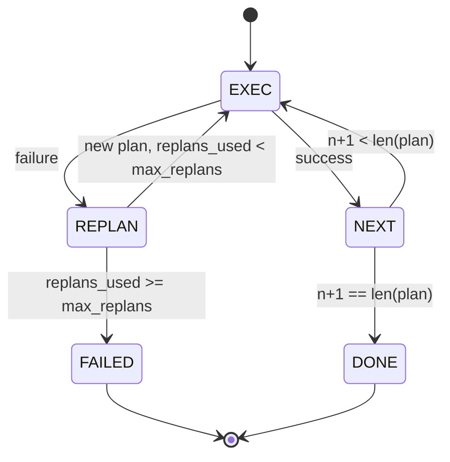
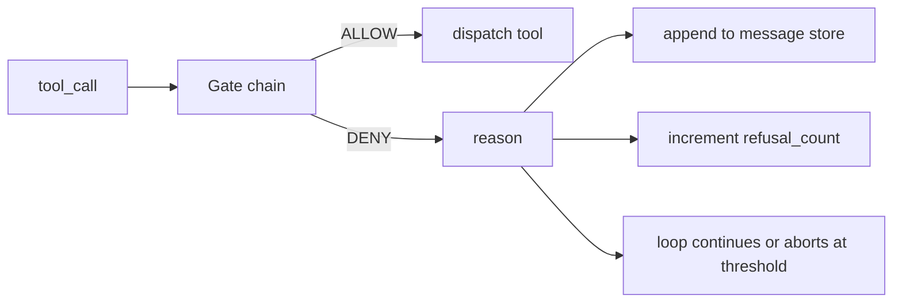
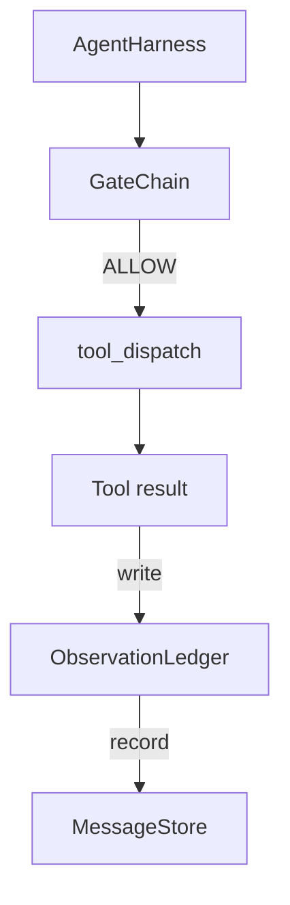
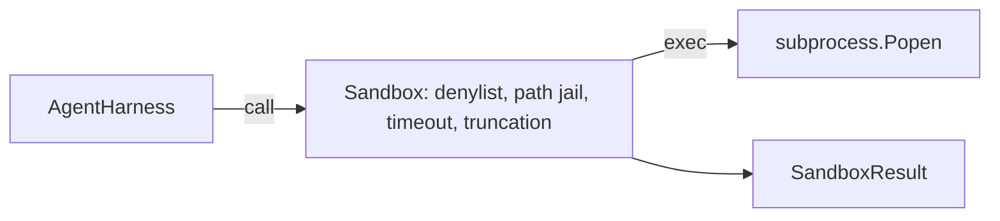
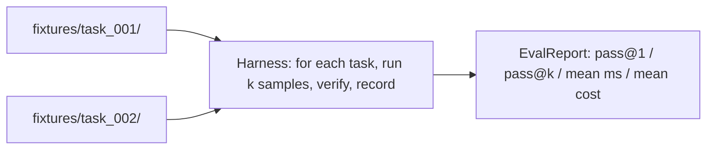
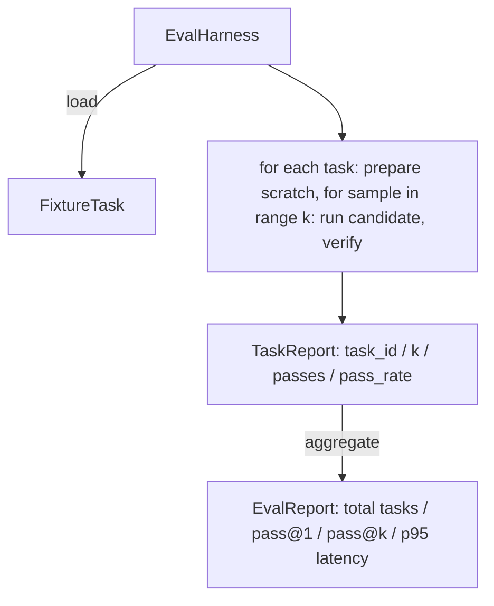
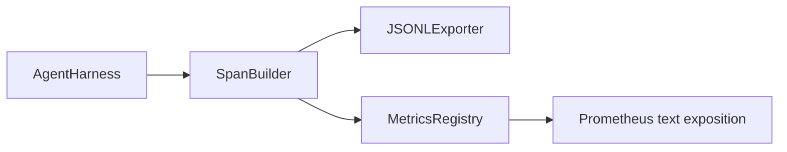
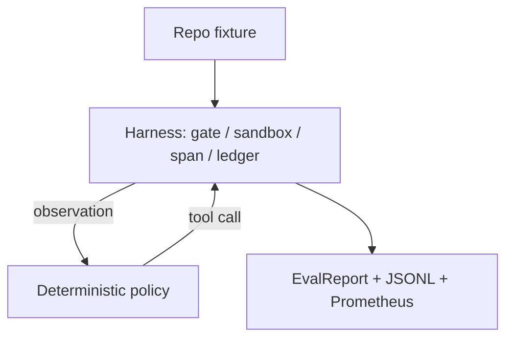
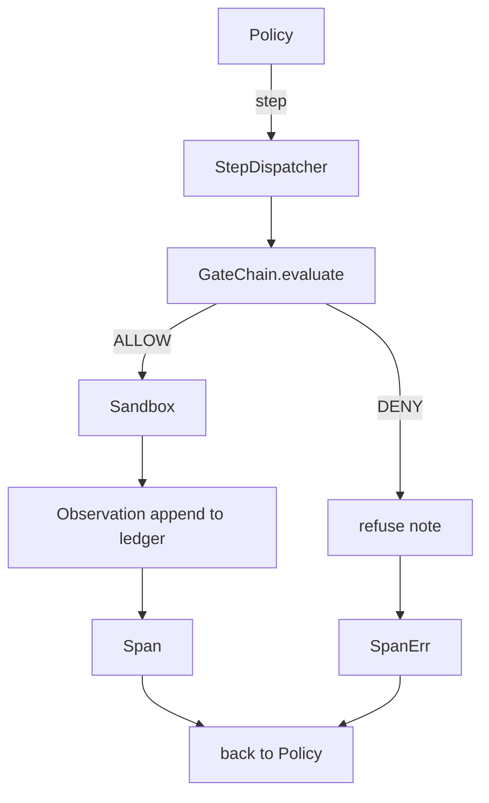

# Harness: Planning, Sandbox, Eval & Demo

> Combined lessons (6 parts), merged verbatim — no content removed.

**Type:** Combined

---

## Part 1 (ch438): Plan-Execute Control Flow

> A plan that cannot survive a failure is a script. A script that can replan is an agent. Build the replanner first.

**Type:** Build
**Languages:** Python
**Prerequisites:** Phase 13 lessons 01-07, Phase 14 lesson 01
**Time:** ~90 minutes

## Learning Objectives

- Represent a plan as an ordered list of typed steps so the executor can reason about progress and outcome.
- Execute steps sequentially with a controlled failure handoff back to the planner.
- Replan from the current cursor with the prior error in the context so the next plan is informed.
- Emit a plan diff on each revision so a downstream tracer or UI can show why the plan changed.
- Enforce two budgets: a hard step ceiling and a hard replan ceiling.

## Plan and execute, not chain-of-thought

A chain-of-thought agent emits tokens and lets the loop guess where the tool call ends. A plan-and-execute agent emits a structured plan first, then executes each step deterministically. The plan is data the harness can introspect. The execution is the harness running that data through a dispatcher.

Two pieces: a planner that produces a plan and an executor that runs the plan. Three options when the executor hits a failure:

```text
1. Abort         (return failed, surface the error)
2. Skip          (mark step failed, continue with the rest)
3. Replan        (hand the error to the planner, get a new plan from the cursor)
```

Replan is the one that turns a script into an agent.

## The Step shape

```text
Step
  id              : int           (monotonic within a plan revision)
  tool_name       : str
  args            : dict
  expected_outcome: str           (planner's stated success condition)
  result          : Any | None
  error           : str | None
```

`expected_outcome` is a short sentence the planner emits alongside the step. It is not enforced by the executor. It is for the replanner and the event stream.

## The executor

The executor is a small state machine. Each step runs through the dispatcher. The outcome is success, failure-replannable, or failure-fatal.



## Plan diffs on revision

When the planner returns a new plan after a failure, the executor emits a `plan.diff` event:

```text
removed: list of step ids that were in the old plan and are not in the new
added  : list of step ids in the new plan that were not in the old
revised: list of step ids whose tool_name or args changed
```

## Two budgets, both hard

`max_steps` caps total step executions across the whole session, including replans. Default is twelve. `max_replans` caps the number of times the planner is called after the first plan. Default is five. A planner that returns the same broken plan five times in a row would otherwise loop until the step budget catches it.

## Result shape

```text
SessionResult
  status      : "completed" | "failed"
  reason      : str     ("goal_met" | "step_budget" | "replan_budget" | "no_plan")
  history     : list[Step]
  revisions   : list[PlanDiff]
  events      : list[Event]
```

## How to read the code

`code/main.py` defines `PlanExecuteAgent`, `Step`, `PlanDiff`, `SessionResult`, and the deterministic planner. The executor is a single `run(goal)` method that returns a `SessionResult`.

## Going further

Two extensions: partial-plan caching (you do not want to re-run the first three of six steps when they already succeeded) and parallel branches (a planner that emits `gather_step` instead of `next_step`).

[Reference](https://github.com/rohitg00/ai-engineering-from-scratch/tree/main/phases/19-capstone-projects/24-plan-execute-control-flow)

---

## Part 2 (ch439): Verification Gates and the Observation Budget

> An agent harness without a verification layer is a wish in a trenchcoat. This lesson builds the deterministic gate chain that decides whether a tool call is allowed to fire, how much of its output the agent is allowed to see, and when the loop has to stop because the agent has read too much.

**Type:** Build
**Languages:** Python (stdlib)
**Prerequisites:** Phase 19 · 20-24, Phase 14 · 33, Phase 14 · 36, Phase 14 · 38
**Time:** ~90 minutes

## Learning Objectives

- Build a `VerificationGate` protocol with a deterministic `evaluate(call)` method.
- Compose budget, recency, whitelist, and regex gates into a chain with short-circuit semantics.
- Track every observation through an `ObservationLedger` keyed by tool and turn.
- Refuse a tool call when the cumulative observation budget would be exceeded.
- Surface a structured `GateDecision` record that downstream observability can ingest.

## The Problem

When an agent harness lets the model call tools freely, three classes of bug appear: unbounded observation (a grep across 200K lines dumps half a million tokens), stale recency (the model rereads old observations as if they were live), and privilege creep (the model invents a tool name and the harness defaults to permissive).

A verification gate is the harness component that says no. It is a deterministic function of `(call, history, ledger)` that returns either ALLOW or DENY with a reason.

## The Concept



Four gates: `WhitelistGate` (allowed tool names), `RegexGate` (tool arguments matched against a regex), `RecencyGate` (only last N turns visible), `BudgetGate` (cumulative tokens ceiling).

## Architecture



## How to read the code

The implementation is a single `main.py` plus tests. `Observation` and `ToolCall` dataclasses define the wire shapes. `ObservationLedger` records `(turn, tool, tokens)` rows. `GateDecision` carries `(allow, reason, gate_name)`. `VerificationGate` is the protocol. `GateChain` wraps an ordered list.

## How this composes with Track A

Previous lessons gave the loop, tool registry, message store, prompt builder, and model router. This lesson adds the layer between the model and the tools. Lesson 26 ships the sandbox. Lesson 27 ships the eval harness. Lesson 28 wires gate decisions into OpenTelemetry spans. Lesson 29 stitches everything into a working coding agent.

[Reference](https://github.com/rohitg00/ai-engineering-from-scratch/tree/main/phases/19-capstone-projects/25-verification-gates-observation-budget)

---

## Part 3 (ch440): Sandbox Runner with Denylist and Path Jail

> The verification gate decides whether a tool call should run. The sandbox decides what happens when it does. This lesson ships a subprocess runner that refuses dangerous executables, refuses dangerous argv shapes, jails every file path to a project root, truncates oversized output, and kills runaway processes on a wall-clock timeout.

**Type:** Build
**Languages:** Python (stdlib)
**Prerequisites:** Phase 19 · 25, Phase 14 · 33, Phase 14 · 38
**Time:** ~90 minutes

## Learning Objectives

- Build a `Sandbox` class wrapping `subprocess.run` with timeout, capture, and truncation.
- Refuse a command by name against a denylist and by structure against an argv inspector.
- Refuse any path argument that resolves outside a declared project root.
- Refuse shell metacharacters when shell mode is off.
- Return a structured `SandboxResult` that downstream observability and the eval harness can ingest.

## The Problem

Three classes of failure recur in agent traces. Dangerous executables (`sudo`, `chmod -R 777`, `rm -rf`). Argv tricks (`python3 -c "import os; os.system('rm -rf /')"`). Path escape (`../../etc/passwd`).

The sandbox is a development-time guardrail: it makes common failure modes loud and stops the agent from doing damage out of sheer ineptitude.

## The Concept

```mermaid
flowchart TD
    Call[ToolCall] --> Run[Sandbox.run()]
    Run --> S1[1. resolve executable against denylist]
    S1 --> S2[2. inspect argv: interpreter -c, shell metachars]
    S2 --> S3[3. resolve path-like arguments against project_root]
    S3 --> S4[4. spawn subprocess with timeout]
    S4 --> S5[5. truncate stdout/stderr]
    S5 --> Result[SandboxResult]
```

## Architecture



The denylist is a frozenset of executable basenames. The argv inspector knows the interpreter shape. The path jail normalizes through `os.path.realpath` then checks against the project root. Symlink escape attempts are blocked by checking realpath, not the literal path.

## What you will build

`SandboxResult` dataclass, `SandboxConfig` dataclass, `Sandbox` class with `run(argv, *, shell=False, cwd=None)`, refusal helpers (`_check_executable_denylist`, `_check_argv_interpreter`, `_check_shell_metachars`, `_check_path_jail`), output truncation with a `truncated` flag, and a demo.

## Why this is not a real sandbox

This sandbox does not use namespaces, cgroups, seccomp, gVisor, or Firecracker. For production agents you layer on top: run inside an unprivileged Docker container, drop capabilities, mount the project root read-only, scrub the environment.

[Reference](https://github.com/rohitg00/ai-engineering-from-scratch/tree/main/phases/19-capstone-projects/26-sandbox-runner-denylist)

---

## Part 4 (ch441): Eval Harness with Fixture Tasks

> A coding agent is only as good as the suite of tasks you measure it against. This lesson builds an evaluation harness that takes a folder of fixture tasks, runs each through a candidate agent, scores pass or fail through a deterministic verifier, and aggregates the results into pass@1, pass@k, mean latency, and mean cost.

**Type:** Build
**Languages:** Python (stdlib)
**Prerequisites:** Phase 19 · 25, Phase 19 · 26, Phase 14 · 30, Phase 14 · 19
**Time:** ~90 minutes

## Learning Objectives

- Define a fixture task as a triple of goal, setup, and verifier.
- Score multiple sample runs per task and compute pass@1 and pass@k.
- Aggregate latency and cost into mean and 95th-percentile metrics.
- Wire deterministic verifiers (file diff, exit code, regex match) into reusable functions.
- Emit a structured JSON report a regression-tracking script can ingest.

## The Problem

Three failure modes plague agent benchmarks: unverified pass (agent claims it fixed the bug but didn't), undetected regression (a prompt change makes the agent 14% worse on a quiet task), and per-task drift (fixtures are renamed and the pass rate looks like a 5% improvement).

## The Concept



Three verifier shapes: `file_equals` (compare file content), `regex_match` (match file against regex), `shell_exit_zero` (shell command exits zero).

## Architecture



## What you will build

`FixtureTask`, `SampleResult`, `TaskReport`, `EvalReport` dataclasses. `VerifierRegistry` with built-in verifiers. `EvalHarness` class. Five fixture tasks bundled in `tasks/`. A deterministic reference candidate.

## Why pass@k and not just pass@1

Real LLM agents are stochastic. A pass@1 of 0.6 looks like a failure. A pass@5 of 0.95 says the agent gets the right answer most of the time but is choosing wrong on early samples.

[Reference](https://github.com/rohitg00/ai-engineering-from-scratch/tree/main/phases/19-capstone-projects/27-eval-harness-fixture-tasks)

---

## Part 5 (ch442): Observability with OTel GenAI Spans and Prometheus Metrics

> An agent harness without observability is a black box that costs money. This lesson hand-rolls a span builder that emits records compliant with the OpenTelemetry GenAI semantic conventions, writes them to a JSON-Lines file, and exposes counters and histograms in Prometheus text format.

**Type:** Build
**Languages:** Python (stdlib)
**Prerequisites:** Phase 19 · 25, Phase 19 · 26, Phase 19 · 27, Phase 13 · 20, Phase 14 · 23
**Time:** ~90 minutes

## Learning Objectives

- Build a span data class shaped to the OpenTelemetry GenAI semantic conventions.
- Implement a JSONL exporter that writes one self-contained span per line.
- Build counters and histograms with labels and Prometheus text-format exposition.
- Wrap any callable in a span context manager that records duration, status, and exceptions.
- Verify that the emitted spans roundtrip through `json.loads` and match the spec shape.

## The Problem

A coding agent in production produces three classes of artifact every turn: a model call, a tool execution, and a verification gate decision. None are useful without structured telemetry. The GenAI semantic conventions define a small set of standard attributes that span emitters across LLM frameworks share.

## The Concept

```mermaid
flowchart TD
    Call[tool / model / gate] --> Span[SpanBuilder.span() context manager]
    Span --> GenAI[GenAISpan: trace_id, span_id, name, gen_ai attributes]
    GenAI --> Writer[JSONLWriter -> traces.jsonl]
    GenAI --> Metrics[MetricsRegistry -> /metrics text/]
```

## Architecture



## What you will build

`GenAISpan` dataclass (trace_id, span_id, parent_span_id, name, attributes, timing, status). `SpanBuilder` with `span(name, attrs)` context manager. `JSONLExporter` with `export(span)`. `Counter` and `Histogram` classes plus `MetricsRegistry`. `prometheus_exposition(registry)` producing text-format output. `wrap_tool_call(name)` decorator.

## Why hand-rolled instead of opentelemetry-sdk

The OTel Python SDK is a real dependency. The hand-rolled version teaches the wire format. In production you wire the same attributes into the real SDK and get the full OTLP exporter.

[Reference](https://github.com/rohitg00/ai-engineering-from-scratch/tree/main/phases/19-capstone-projects/28-observability-otel-traces)

---

## Part 6 (ch443): End-to-End Coding Agent on the Harness

> Track A's payoff. This lesson stitches the gate chain, the sandbox, the eval harness, and the OTel spans into one working coding agent that fixes a real (small, fixture-scale) bug in a multi-file Python project.

**Type:** Build
**Languages:** Python (stdlib)
**Prerequisites:** Phase 19 · 25, Phase 19 · 26, Phase 19 · 27, Phase 19 · 28
**Time:** ~90 minutes

## Learning Objectives

- Compose the gate chain, sandbox, eval harness, and span builder into a single agent loop.
- Implement a deterministic policy that uses read_file, run_tests, and write_file to fix a fixture bug.
- Enforce a global step budget plus an observation token budget across an end-to-end run.
- Emit complete OTel GenAI traces and Prometheus metrics for the full run.
- Verify the agent solves the fixture in fewer than 12 steps with zero gate trips on legal tools.

## The Problem

Most agent demos work in isolation. Compose them and the seams show. The gate chain says ALLOW but the sandbox refuses for a reason the chain did not anticipate. The eval harness records a pass but the OTel spans say the gate refused a tool. This lesson is the integration test for the whole track.

## The Concept



Five states: SURVEY, RUN_TESTS, INSPECT, FIX, VERIFY.



## What you will build

Minimal harness primitives (GateChain, Sandbox, ObservationLedger, SpanBuilder, MetricsRegistry). `CodingAgentPolicy` with five-state state machine. `Repo` helper. `AgentRun` class. A bundled fixture with a buggy Python file and tests.

## Why the policy is not an LLM

A real LLM requires an API key, a network call, and unverifiable stochasticity. Subbing in a deterministic policy lets the lesson run on any developer laptop with zero external dependencies.

## What the demo asserts

Policy solved the fixture in fewer than 12 steps. Observation budget never exceeded. Zero gate denials on legal tools. Every step has a corresponding span. Prometheus exposition contains `tools_called_total` and `tool_latency_ms`.

[Reference](https://github.com/rohitg00/ai-engineering-from-scratch/tree/main/phases/19-capstone-projects/29-end-to-end-coding-task-demo)
