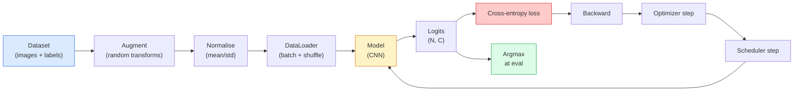

# Image Classification

> A classifier is a function from pixels to a probability distribution over classes. Everything else is plumbing.

**Type:** Build
**Languages:** Python
**Prerequisites:** Phase 2 Lesson 09 (Model Evaluation), Phase 3 Lesson 10 (Mini Framework), Phase 4 Lesson 03 (CNNs)
**Time:** ~75 minutes

## Learning Objectives

- Build an end-to-end image classification pipeline on CIFAR-10: dataset, augmentation, model, training loop, evaluation
- Explain the role of each component and predict how breaking any one of them manifests in the loss curve
- Implement mixup, cutout, and label smoothing from scratch and justify when each is worth adding
- Read a confusion matrix and a per-class precision/recall table to diagnose dataset and model failures beyond aggregate accuracy

## The Problem

Every vision task that ships reduces to image classification at some level. Detection classifies regions. Segmentation classifies pixels. Retrieval ranks by similarity to class centroids. Getting classification right is the skill that transfers to every other task.

Most classification bugs are not in the model. They live in the pipeline: a broken normalisation, an unshuffled training set, augmentation that distorts labels, a validation split contaminated by training data, a learning rate that silently diverges after epoch 30.

## The Concept

### The classification pipeline



### Cross-entropy, logits, and softmax

A classifier produces `C` numbers per image called logits. Applying softmax converts them into a probability distribution:

```
softmax(z)_i = exp(z_i) / sum_j exp(z_j)
```

Cross-entropy measures the negative log probability of the correct class:

```
CE(z, y) = -log( softmax(z)_y )
         = -z_y + log( sum_j exp(z_j) )
```

PyTorch's `nn.CrossEntropyLoss` fuses softmax + NLL in one op and takes raw logits directly.

### Why augmentation works

A CNN has inductive bias for translation but no built-in invariance to crops, flips, colour jitter, or occlusion. The only way to teach it those invariances is to show it pixels that exercise them.

```
Original crop:  "dog facing left"
Flip:           "dog facing right"
Rotate(+15):    "dog, slight tilt"
Colour jitter:  "dog in warmer light"
RandomErasing:  "dog with patch missing"
```

### Mixup and cutmix

```
Mixup:
  lambda ~ Beta(a, a)
  x = lambda * x_i + (1 - lambda) * x_j
  y = lambda * y_i + (1 - lambda) * y_j

Cutmix:
  paste a random rectangle of x_j into x_i
  y = area-weighted mix of y_i and y_j
```

### Label smoothing

Instead of training against `[0, 0, 1, 0, 0]`, train against `[eps/C, eps/C, 1-eps, eps/C, eps/C]` for a small `eps` like 0.1. Built into `nn.CrossEntropyLoss(label_smoothing=0.1)` since PyTorch 1.10.

### Evaluation beyond accuracy

- **Per-class accuracy** — one number per class; surfaces underperforming categories.
- **Confusion matrix** — C x C grid; diagonal is correct, off-diagonals tell you what to fix.
- **Top-1 / Top-5** — whether the correct class is in the top 1 or top 5 predictions.
- **Calibration (ECE)** — does a 0.8 confidence prediction get it right 80% of the time?

## Build It

### Step 1: A deterministic synthetic dataset

```python
import numpy as np
import torch
from torch.utils.data import Dataset

def synthetic_cifar(num_per_class=1000, num_classes=10, seed=0):
    rng = np.random.default_rng(seed)
    X = []
    Y = []
    for c in range(num_classes):
        centre = rng.uniform(0, 1, (3,))
        freq = 2 + c
        for _ in range(num_per_class):
            yy, xx = np.meshgrid(np.linspace(0, 1, 32), np.linspace(0, 1, 32), indexing="ij")
            r = np.sin(xx * freq) * 0.5 + centre[0]
            g = np.cos(yy * freq) * 0.5 + centre[1]
            b = (xx + yy) * 0.5 * centre[2]
            img = np.stack([r, g, b], axis=-1)
            img += rng.normal(0, 0.08, img.shape)
            img = np.clip(img, 0, 1)
            X.append(img.astype(np.float32))
            Y.append(c)
    X = np.stack(X)
    Y = np.array(Y)
    idx = rng.permutation(len(X))
    return X[idx], Y[idx]

class ArrayDataset(Dataset):
    def __init__(self, X, Y, transform=None):
        self.X = X
        self.Y = Y
        self.transform = transform

    def __len__(self):
        return len(self.X)

    def __getitem__(self, i):
        img = self.X[i]
        if self.transform is not None:
            img = self.transform(img)
        img = torch.from_numpy(img).permute(2, 0, 1)
        return img, int(self.Y[i])
```

### Step 2: Normalisation and augmentation

```python
def standardize(mean, std):
    mean = np.array(mean, dtype=np.float32)
    std = np.array(std, dtype=np.float32)
    def _fn(img):
        return (img - mean) / std
    return _fn

def random_hflip(p=0.5):
    def _fn(img):
        if np.random.random() < p:
            return img[:, ::-1, :].copy()
        return img
    return _fn

def random_crop(pad=4):
    def _fn(img):
        h, w = img.shape[:2]
        padded = np.pad(img, ((pad, pad), (pad, pad), (0, 0)), mode="reflect")
        y = np.random.randint(0, 2 * pad)
        x = np.random.randint(0, 2 * pad)
        return padded[y:y + h, x:x + w, :]
    return _fn

def compose(*fns):
    def _fn(img):
        for fn in fns:
            img = fn(img)
        return img
    return _fn
```

### Step 3: Mixup

```python
def mixup_batch(x, y, num_classes, alpha=0.2):
    if alpha <= 0:
        return x, torch.nn.functional.one_hot(y, num_classes).float()
    lam = float(np.random.beta(alpha, alpha))
    idx = torch.randperm(x.size(0), device=x.device)
    x_mixed = lam * x + (1 - lam) * x[idx]
    y_onehot = torch.nn.functional.one_hot(y, num_classes).float()
    y_mixed = lam * y_onehot + (1 - lam) * y_onehot[idx]
    return x_mixed, y_mixed

def soft_cross_entropy(logits, soft_targets):
    log_probs = torch.log_softmax(logits, dim=-1)
    return -(soft_targets * log_probs).sum(dim=-1).mean()
```

### Step 4: The training loop

```python
import torch.nn as nn
from torch.utils.data import DataLoader
from torch.optim import SGD
from torch.optim.lr_scheduler import CosineAnnealingLR

def train_one_epoch(model, loader, optimizer, device, num_classes, use_mixup=True):
    model.train()
    total, correct, loss_sum = 0, 0, 0.0
    for x, y in loader:
        x, y = x.to(device), y.to(device)
        if use_mixup:
            x_m, y_soft = mixup_batch(x, y, num_classes)
            logits = model(x_m)
            loss = soft_cross_entropy(logits, y_soft)
        else:
            logits = model(x)
            loss = nn.functional.cross_entropy(logits, y, label_smoothing=0.1)
        optimizer.zero_grad()
        loss.backward()
        optimizer.step()
        loss_sum += loss.item() * x.size(0)
        total += x.size(0)
        with torch.no_grad():
            pred = logits.argmax(dim=-1)
            correct += (pred == y).sum().item()
    return loss_sum / total, correct / total

@torch.no_grad()
def evaluate(model, loader, device, num_classes):
    model.eval()
    total, correct = 0, 0
    loss_sum = 0.0
    cm = torch.zeros(num_classes, num_classes, dtype=torch.long)
    for x, y in loader:
        x, y = x.to(device), y.to(device)
        logits = model(x)
        loss = nn.functional.cross_entropy(logits, y)
        pred = logits.argmax(dim=-1)
        for t, p in zip(y.cpu(), pred.cpu()):
            cm[t, p] += 1
        loss_sum += loss.item() * x.size(0)
        total += x.size(0)
        correct += (pred == y).sum().item()
    return loss_sum / total, correct / total, cm
```

### Step 5: Put it together

```python
from main import synthetic_cifar, ArrayDataset
from main import standardize, random_hflip, random_crop, compose
from main import mixup_batch, soft_cross_entropy
from main import train_one_epoch, evaluate
from cnns_lenet_to_resnet import TinyResNet

X, Y = synthetic_cifar(num_per_class=500)
split = int(0.9 * len(X))
X_train, Y_train = X[:split], Y[:split]
X_val, Y_val = X[split:], Y[split:]

mean = [0.5, 0.5, 0.5]
std = [0.25, 0.25, 0.25]
train_tf = compose(random_hflip(), random_crop(pad=4), standardize(mean, std))
eval_tf = standardize(mean, std)

train_ds = ArrayDataset(X_train, Y_train, transform=train_tf)
val_ds = ArrayDataset(X_val, Y_val, transform=eval_tf)

train_loader = DataLoader(train_ds, batch_size=128, shuffle=True, num_workers=0)
val_loader = DataLoader(val_ds, batch_size=256, shuffle=False, num_workers=0)

device = "cuda" if torch.cuda.is_available() else "cpu"
model = TinyResNet(num_classes=10).to(device)
optimizer = SGD(model.parameters(), lr=0.1, momentum=0.9, weight_decay=5e-4, nesterov=True)
scheduler = CosineAnnealingLR(optimizer, T_max=10)

for epoch in range(10):
    tr_loss, tr_acc = train_one_epoch(model, train_loader, optimizer, device, 10, use_mixup=True)
    va_loss, va_acc, _ = evaluate(model, val_loader, device, 10)
    scheduler.step()
    print(f"epoch {epoch:2d}  lr {scheduler.get_last_lr()[0]:.4f}  "
          f"train {tr_loss:.3f}/{tr_acc:.3f}  val {va_loss:.3f}/{va_acc:.3f}")
```

### Step 6: Read the confusion matrix

```python
def print_confusion(cm, labels=None):
    c = cm.shape[0]
    labels = labels or [str(i) for i in range(c)]
    print(f"{'':>6}" + "".join(f"{l:>5}" for l in labels))
    for i in range(c):
        row = cm[i].tolist()
        print(f"{labels[i]:>6}" + "".join(f"{v:>5}" for v in row))
    print()
    tp = cm.diag().float()
    fp = cm.sum(dim=0).float() - tp
    fn = cm.sum(dim=1).float() - tp
    prec = tp / (tp + fp).clamp_min(1)
    rec = tp / (tp + fn).clamp_min(1)
    f1 = 2 * prec * rec / (prec + rec).clamp_min(1e-9)
    for i in range(c):
        print(f"{labels[i]:>6}  prec {prec[i]:.3f}  rec {rec[i]:.3f}  f1 {f1[i]:.3f}")

_, _, cm = evaluate(model, val_loader, device, 10)
print_confusion(cm)
```

## Use It

`torchvision` wraps everything above into idiomatic components.

```python
from torchvision.datasets import CIFAR10
from torchvision.transforms import Compose, RandomCrop, RandomHorizontalFlip, ToTensor, Normalize

mean = (0.4914, 0.4822, 0.4465)
std = (0.2470, 0.2435, 0.2616)
train_tf = Compose([
    RandomCrop(32, padding=4, padding_mode="reflect"),
    RandomHorizontalFlip(),
    ToTensor(),
    Normalize(mean, std),
])
eval_tf = Compose([ToTensor(), Normalize(mean, std)])

train_ds = CIFAR10(root="./data", train=True,  download=True, transform=train_tf)
val_ds   = CIFAR10(root="./data", train=False, download=True, transform=eval_tf)
```

## Ship It

This lesson produces:

- `outputs/prompt-classifier-pipeline-auditor.md` — a prompt that audits a training script for the five invariants.
- `outputs/skill-classification-diagnostics.md` — a skill that, given a confusion matrix, summarises per-class failures.

## Exercises

1. **(Easy)** Train the same model with and without mixup for five epochs. Plot train and val loss for both.
2. **(Medium)** Implement Cutout and run an ablation vs no augmentation, hflip+crop, hflip+crop+cutout, hflip+crop+mixup.
3. **(Hard)** Build a CIFAR-100 pipeline and reproduce a ResNet-34 training run to within 1% of published accuracy.

## Key Terms

| Term | What people say | What it actually means |
|------|----------------|----------------------|
| Logits | "Raw outputs" | Pre-softmax vector of C numbers per image |
| Cross-entropy | "The loss" | Negative log-probability of the correct class |
| DataLoader | "The batcher" | Wraps a dataset with shuffling, batching, and multi-worker loading |
| Augmentation | "Random transforms" | Pixel-level transforms that preserve the label |
| Mixup / Cutmix | "Mix two images" | Blend both inputs and labels for smooth interpolation |
| Label smoothing | "Softer targets" | Replace one-hot with (1-eps, eps/(C-1)) |
| Top-k accuracy | "Top-5" | Correct class in the k highest-probability predictions |
| Confusion matrix | "Where errors live" | C x C table of true vs predicted classes |

## Further Reading

- [CS231n: Training Neural Networks](https://cs231n.github.io/neural-networks-3/)
- [Bag of Tricks for Image Classification (He et al., 2019)](https://arxiv.org/abs/1812.01187)
- [mixup: Beyond Empirical Risk Minimization (Zhang et al., 2017)](https://arxiv.org/abs/1710.09412)
- [Why temperature scaling matters (Guo et al., 2017)](https://arxiv.org/abs/1706.04599)

[Reference](https://github.com/rohitg00/ai-engineering-from-scratch/tree/main/phases/04-computer-vision/04-image-classification)
