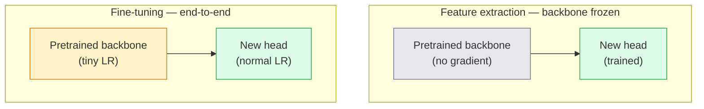

# Transfer Learning & Fine-Tuning

> Somebody else spent a million GPU hours teaching a network what edges, textures, and object parts look like. You should borrow those features before training your own.

**Type:** Build
**Languages:** Python
**Prerequisites:** Phase 4 Lesson 03 (CNNs), Phase 4 Lesson 04 (Image Classification)
**Time:** ~75 minutes

## Learning Objectives

- Distinguish feature extraction from fine-tuning and pick the right one based on dataset size, domain distance, and compute budget
- Load a pretrained backbone, replace its classifier head, and train only the head to a working baseline in under 20 lines
- Progressively unfreeze layers with discriminative learning rates so early generic features get smaller updates than late task-specific ones
- Diagnose the three common failures: feature drift from too-high LR on unfrozen blocks, BN statistics collapse on tiny datasets, and catastrophic forgetting

## The Problem

Training a ResNet-50 on ImageNet costs around 2,000 GPU-hours. Very few teams have that budget for every task they ship. What almost every team actually ships is a pretrained backbone with a new head trained on a few hundred or few thousand task-specific images.

This is not a shortcut. The first conv block of any ImageNet-trained CNN learns edges and Gabor-like filters. The next few blocks learn textures and simple motifs. The middle blocks learn object parts. The final blocks learn combinations that start to look like the 1,000 ImageNet categories. The first 90% of that hierarchy transfers almost unchanged to medical imaging, industrial inspection, satellite data, and every other vision task — because nature has a limited vocabulary of edges and textures. The last 10% is what you actually train.

Getting transfer right has three bugs waiting for you: destroying pretrained features with a too-high learning rate, starving the model of information by freezing too much, and letting BatchNorm's running statistics drift toward a tiny dataset that the rest of the network never learnt from. This lesson walks each of them on purpose.

## The Concept

### Feature extraction vs fine-tuning



| Dataset size | Domain distance | Recipe |
|--------------|-----------------|--------|
| < 1k images | close to ImageNet | Freeze backbone, train head only |
| 1k-10k | close | Freeze first 2-3 stages, fine-tune the rest |
| 10k-100k | any | Fine-tune end-to-end with discriminative LR |
| 100k+ | far | Fine-tune everything; consider training from scratch if domain is far enough |

### Why freezing works at all

The ImageNet features a CNN learns are not specialised to the 1,000 categories. They are specialised to the statistics of natural images: edges at specific orientations, textures, contrast patterns, shape primitives. Those statistics are stable across almost every visual domain a human can name.

### Discriminative learning rates

When you do unfreeze, early layers should train slower than late layers.

```
Typical recipe:

  stage 0 (stem + first group): lr = base_lr / 100    (mostly fixed)
  stage 1:                       lr = base_lr / 10
  stage 2:                       lr = base_lr / 3
  stage 3 (last backbone group): lr = base_lr
  head:                          lr = base_lr  (or slightly higher)
```

### The BatchNorm problem

BN layers hold `running_mean` and `running_var` buffers computed on ImageNet. Options:
1. Fine-tune with BN in train mode.
2. Freeze BN in eval mode.
3. Replace BN with GroupNorm.

### Head design

```
backbone.fc = nn.Linear(backbone.fc.in_features, num_classes)          # ResNet
backbone.classifier[1] = nn.Linear(..., num_classes)                    # EfficientNet, MobileNet
backbone.heads.head = nn.Linear(..., num_classes)                       # torchvision ViT
```

### Layer-wise LR decay

```
lr_layer_k = base_lr * decay^(L - k)
```

### What to evaluate

- **Pretrained-only accuracy** — head accuracy with frozen backbone.
- **Fine-tuned accuracy** — same model after end-to-end training.

## Build It

### Step 1: Load a pretrained backbone

```python
import torch
import torch.nn as nn
from torchvision.models import resnet18, ResNet18_Weights

backbone = resnet18(weights=ResNet18_Weights.IMAGENET1K_V1)
print(backbone)
print("classifier head:", backbone.fc)
print("feature dim:", backbone.fc.in_features)
```

### Step 2: Feature extraction

```python
def make_feature_extractor(num_classes=10):
    model = resnet18(weights=ResNet18_Weights.IMAGENET1K_V1)
    for p in model.parameters():
        p.requires_grad = False
    model.fc = nn.Linear(model.fc.in_features, num_classes)
    return model

model = make_feature_extractor(num_classes=10)
trainable = sum(p.numel() for p in model.parameters() if p.requires_grad)
frozen = sum(p.numel() for p in model.parameters() if not p.requires_grad)
print(f"trainable: {trainable:>10,}")
print(f"frozen:    {frozen:>10,}")
```

### Step 3: Discriminative fine-tuning

```python
def discriminative_param_groups(model, base_lr=1e-3, decay=0.3):
    stages = [
        ["conv1", "bn1"],
        ["layer1"],
        ["layer2"],
        ["layer3"],
        ["layer4"],
        ["fc"],
    ]
    groups = []
    for i, names in enumerate(stages):
        lr = base_lr * (decay ** (len(stages) - 1 - i))
        params = [p for n, p in model.named_parameters()
                  if any(n.startswith(k) for k in names)]
        if params:
            groups.append({"params": params, "lr": lr, "name": "_".join(names)})
    return groups

model = resnet18(weights=ResNet18_Weights.IMAGENET1K_V1)
model.fc = nn.Linear(model.fc.in_features, 10)
for p in model.parameters():
    p.requires_grad = True

groups = discriminative_param_groups(model)
for g in groups:
    print(f"{g['name']:>10s}  lr={g['lr']:.2e}  params={sum(p.numel() for p in g['params']):>8,}")
```

### Step 4: BatchNorm handling

```python
def freeze_bn_stats(model):
    for m in model.modules():
        if isinstance(m, (nn.BatchNorm1d, nn.BatchNorm2d, nn.BatchNorm3d)):
            m.eval()
            for p in m.parameters():
                p.requires_grad = False
    return model
```

### Step 5: Minimal end-to-end fine-tuning loop

```python
from torch.optim import SGD
from torch.utils.data import DataLoader
from torch.optim.lr_scheduler import CosineAnnealingLR
import torch.nn.functional as F

def fine_tune(model, train_loader, val_loader, device, epochs=5, base_lr=1e-3, freeze_bn=False):
    model = model.to(device)
    groups = discriminative_param_groups(model, base_lr=base_lr)
    optimizer = SGD(groups, momentum=0.9, weight_decay=1e-4, nesterov=True)
    scheduler = CosineAnnealingLR(optimizer, T_max=epochs)

    for epoch in range(epochs):
        model.train()
        if freeze_bn:
            freeze_bn_stats(model)
        tr_loss, tr_correct, tr_total = 0.0, 0, 0
        for x, y in train_loader:
            x, y = x.to(device), y.to(device)
            logits = model(x)
            loss = F.cross_entropy(logits, y, label_smoothing=0.1)
            optimizer.zero_grad()
            loss.backward()
            optimizer.step()
            tr_loss += loss.item() * x.size(0)
            tr_total += x.size(0)
            tr_correct += (logits.argmax(-1) == y).sum().item()
        scheduler.step()

        model.eval()
        va_total, va_correct = 0, 0
        with torch.no_grad():
            for x, y in val_loader:
                x, y = x.to(device), y.to(device)
                pred = model(x).argmax(-1)
                va_total += x.size(0)
                va_correct += (pred == y).sum().item()
        print(f"epoch {epoch}  train {tr_loss/tr_total:.3f}/{tr_correct/tr_total:.3f}  "
              f"val {va_correct/va_total:.3f}")
    return model
```

### Step 6: Progressive unfreezing

```python
def progressive_unfreeze_schedule(model):
    stages = ["layer4", "layer3", "layer2", "layer1"]
    yielded = set()

    def start():
        for p in model.parameters():
            p.requires_grad = False
        for p in model.fc.parameters():
            p.requires_grad = True

    def unfreeze(epoch):
        if epoch < len(stages):
            name = stages[epoch]
            yielded.add(name)
            for n, p in model.named_parameters():
                if n.startswith(name):
                    p.requires_grad = True
            return name
        return None

    return start, unfreeze
```

## Use It

```python
from torchvision.models import resnet50, ResNet50_Weights

model = resnet50(weights=ResNet50_Weights.IMAGENET1K_V2)
model.fc = nn.Linear(model.fc.in_features, num_classes)
optimizer = torch.optim.AdamW(model.parameters(), lr=1e-4, weight_decay=1e-4)
```

Two production-grade defaults:
- `timm` ships ~800 pretrained backbones: `timm.create_model("resnet50", pretrained=True, num_classes=10)`
- For transformers: `transformers.AutoModelForImageClassification.from_pretrained(name, num_labels=N)`

## Ship It

- `outputs/prompt-fine-tune-planner.md` — picks strategy based on dataset and budget
- `outputs/skill-freeze-inspector.md` — audits trainable params, BN mode, optimizer state

## Exercises

1. **(Easy)** Train a ResNet18 as linear probe and full fine-tune on synthetic-CIFAR.
2. **(Medium)** Introduce a too-high LR bug on purpose; show divergence then fix with discriminative groups.
3. **(Hard)** Compare three regimes on a medical imaging dataset: frozen, fine-tuned, scratch.

## Key Terms

| Term | What people say | What it actually means |
|------|----------------|----------------------|
| Feature extraction | "Freeze and train head" | Backbone frozen, only new classifier learns |
| Fine-tuning | "Retrain end-to-end" | All parameters trainable, small LR |
| Discriminative LR | "Smaller LR for early layers" | Per-stage LR decay |
| Catastrophic forgetting | "Model lost ImageNet" | Too-high LR overwrites pretrained features |
| Linear probe | "Frozen backbone + linear head" | Evaluation of pretrained feature quality |

## Further Reading

- [How transferable are features in deep neural networks? (Yosinski et al., 2014)](https://arxiv.org/abs/1411.1792)
- [ULMFiT (Howard & Ruder, 2018)](https://arxiv.org/abs/1801.06146)
- [timm documentation](https://huggingface.co/docs/timm)

[Reference](https://github.com/rohitg00/ai-engineering-from-scratch/tree/main/phases/04-computer-vision/05-transfer-learning)
