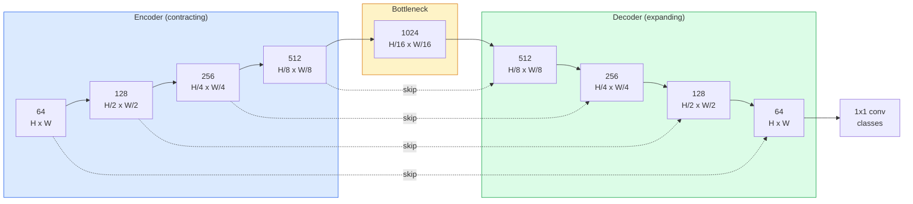

# Semantic Segmentation — U-Net

> Segmentation is classification at every pixel. U-Net makes it work by pairing a downsampling encoder with an upsampling decoder and wiring skip connections between them.

**Type:** Build
**Languages:** Python
**Prerequisites:** Phase 4 Lesson 03 (CNNs), Phase 4 Lesson 04 (Image Classification)
**Time:** ~75 minutes

## Learning Objectives

- Distinguish semantic, instance, and panoptic segmentation
- Build a U-Net from scratch with transposed convolutions and skip connections
- Implement pixel-wise cross-entropy, Dice loss, and the combined loss
- Read IoU and Dice metrics per class

## The Problem

Classification outputs one label. Detection outputs few boxes. Segmentation outputs one label per pixel. For H x W input, output is H x W x C — millions of predictions.

## The Concept

### Semantic vs instance vs panoptic

- **Semantic**: pixel -> class. Two cars merge into one blob.
- **Instance**: pixel -> object id. Only foreground.
- **Panoptic**: every pixel gets class + id.

### The U-Net shape



### Transposed vs bilinear upsample

- Transposed conv: learnable, can produce checkerboard artifacts.
- Bilinear + 3x3 conv: fewer artifacts, fewer parameters.

### Dice loss

```
Dice(p, y) = 2 * sum(p * y) / (sum(p) + sum(y) + eps)
Dice_loss = 1 - Dice
```

Combined loss: `L = L_ce + lambda * L_dice`.

## Build It

### Step 1: Encoder block

```python
import torch
import torch.nn as nn
import torch.nn.functional as F

class DoubleConv(nn.Module):
    def __init__(self, in_c, out_c):
        super().__init__()
        self.net = nn.Sequential(
            nn.Conv2d(in_c, out_c, kernel_size=3, padding=1, bias=False),
            nn.BatchNorm2d(out_c),
            nn.ReLU(inplace=True),
            nn.Conv2d(out_c, out_c, kernel_size=3, padding=1, bias=False),
            nn.BatchNorm2d(out_c),
            nn.ReLU(inplace=True),
        )

    def forward(self, x):
        return self.net(x)
```

### Step 2: Down and up blocks

```python
class Down(nn.Module):
    def __init__(self, in_c, out_c):
        super().__init__()
        self.net = nn.Sequential(
            nn.MaxPool2d(2),
            DoubleConv(in_c, out_c),
        )

    def forward(self, x):
        return self.net(x)

class Up(nn.Module):
    def __init__(self, in_c, out_c):
        super().__init__()
        self.up = nn.Upsample(scale_factor=2, mode="bilinear", align_corners=False)
        self.conv = DoubleConv(in_c, out_c)

    def forward(self, x, skip):
        x = self.up(x)
        if x.shape[-2:] != skip.shape[-2:]:
            x = F.interpolate(x, size=skip.shape[-2:], mode="bilinear", align_corners=False)
        x = torch.cat([skip, x], dim=1)
        return self.conv(x)
```

### Step 3: The U-Net

```python
class UNet(nn.Module):
    def __init__(self, in_channels=3, num_classes=2, base=64):
        super().__init__()
        self.inc = DoubleConv(in_channels, base)
        self.d1 = Down(base, base * 2)
        self.d2 = Down(base * 2, base * 4)
        self.d3 = Down(base * 4, base * 8)
        self.d4 = Down(base * 8, base * 16)
        self.u1 = Up(base * 16 + base * 8, base * 8)
        self.u2 = Up(base * 8 + base * 4, base * 4)
        self.u3 = Up(base * 4 + base * 2, base * 2)
        self.u4 = Up(base * 2 + base, base)
        self.outc = nn.Conv2d(base, num_classes, kernel_size=1)

    def forward(self, x):
        x1 = self.inc(x)
        x2 = self.d1(x1)
        x3 = self.d2(x2)
        x4 = self.d3(x3)
        x5 = self.d4(x4)
        x = self.u1(x5, x4)
        x = self.u2(x, x3)
        x = self.u3(x, x2)
        x = self.u4(x, x1)
        return self.outc(x)

net = UNet(in_channels=3, num_classes=2, base=32)
x = torch.randn(1, 3, 256, 256)
print(f"output: {net(x).shape}")
print(f"params: {sum(p.numel() for p in net.parameters()):,}")
```

### Step 4: Losses

```python
def dice_loss(logits, targets, num_classes, eps=1e-6):
    probs = F.softmax(logits, dim=1)
    targets_one_hot = F.one_hot(targets, num_classes).permute(0, 3, 1, 2).float()
    dims = (0, 2, 3)
    intersection = (probs * targets_one_hot).sum(dim=dims)
    denom = probs.sum(dim=dims) + targets_one_hot.sum(dim=dims)
    dice = (2 * intersection + eps) / (denom + eps)
    return 1 - dice.mean()

def combined_loss(logits, targets, num_classes, lam=1.0):
    ce = F.cross_entropy(logits, targets)
    dc = dice_loss(logits, targets, num_classes)
    return ce + lam * dc, {"ce": ce.item(), "dice": dc.item()}
```

### Step 5: IoU metric

```python
@torch.no_grad()
def iou_per_class(logits, targets, num_classes):
    preds = logits.argmax(dim=1)
    ious = torch.zeros(num_classes)
    for c in range(num_classes):
        pred_c = (preds == c)
        true_c = (targets == c)
        inter = (pred_c & true_c).sum().float()
        union = (pred_c | true_c).sum().float()
        ious[c] = (inter / union) if union > 0 else torch.tensor(float("nan"))
    return ious
```

## Use It

```python
import segmentation_models_pytorch as smp

model = smp.Unet(
    encoder_name="resnet34",
    encoder_weights="imagenet",
    in_channels=3,
    classes=3,
)
```

## Ship It

- `outputs/prompt-segmentation-task-picker.md` — picks semantic/instance/panoptic
- `outputs/skill-segmentation-mask-inspector.md` — reports class distribution

## Exercises

1. **(Easy)** Implement bce_dice_loss for binary segmentation.
2. **(Medium)** Replace bilinear upsample with ConvTranspose2d; compare mIoU.
3. **(Hard)** Train U-Net on a real dataset to within 2 IoU points of smp reference.

## Key Terms

## Further Reading

- [U-Net (Ronneberger et al., 2015)](https://arxiv.org/abs/1505.04597)
- [Fully Convolutional Networks (Long et al., 2015)](https://arxiv.org/abs/1411.4038)
- [segmentation_models_pytorch](https://github.com/qubvel/segmentation_models.pytorch)

[Reference](https://github.com/rohitg00/ai-engineering-from-scratch/tree/main/phases/04-computer-vision/07-semantic-segmentation-unet)
