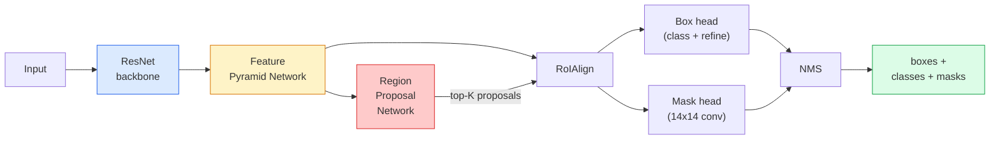

# Instance Segmentation — Mask R-CNN

> Add a tiny mask branch to a Faster R-CNN detector and you have instance segmentation. The hard part is RoIAlign, and it is harder than it looks.

**Type:** Build + Learn
**Languages:** Python
**Prerequisites:** Phase 4 Lesson 06 (YOLO), Phase 4 Lesson 07 (U-Net)
**Time:** ~75 minutes

## Learning Objectives

- Trace the Mask R-CNN architecture: backbone, FPN, RPN, RoIAlign, heads
- Implement RoIAlign from scratch and explain why RoIPool is no longer used
- Use torchvision's pretrained Mask R-CNN for production masks
- Fine-tune Mask R-CNN on a small custom dataset

## The Problem

Semantic segmentation gives one mask per class. Instance segmentation gives one mask per object, even when objects share a class. Counting individuals, tracking, and measuring things all demand instance segmentation.

## The Concept

### The architecture



### Why RoIAlign, not RoIPool

RoIPool rounds box coordinates to integers, misaligning features by up to a full feature-map pixel. RoIAlign samples at exact float coordinates using bilinear interpolation — no rounding anywhere. Lifts mask AP by 3-4 points.

### Output format

```python
{
    "boxes":  (N, 4) in (x1, y1, x2, y2),
    "labels": (N,) class IDs (1-based, 0 = background),
    "scores": (N,) confidence,
    "masks":  (N, 1, H, W) float [0, 1] — threshold at 0.5,
}
```

## Build It

### Step 1: RoIAlign from scratch

```python
import torch
import torch.nn.functional as F

def roi_align_single(feature, box, output_size=7, spatial_scale=1 / 16.0):
    C, H, W = feature.shape
    x1, y1, x2, y2 = [c * spatial_scale - 0.5 for c in box]
    bin_w = (x2 - x1) / output_size
    bin_h = (y2 - y1) / output_size

    grid_y = torch.linspace(y1 + bin_h / 2, y2 - bin_h / 2, output_size)
    grid_x = torch.linspace(x1 + bin_w / 2, x2 - bin_w / 2, output_size)
    yy, xx = torch.meshgrid(grid_y, grid_x, indexing="ij")

    gx = 2 * (xx + 0.5) / W - 1
    gy = 2 * (yy + 0.5) / H - 1
    grid = torch.stack([gx, gy], dim=-1).unsqueeze(0)
    sampled = F.grid_sample(feature.unsqueeze(0), grid, mode="bilinear", align_corners=False)
    return sampled.squeeze(0)
```

### Step 2: Compare to torchvision

```python
from torchvision.ops import roi_align

feature = torch.randn(1, 16, 50, 50)
boxes = torch.tensor([[0, 10, 20, 100, 90]], dtype=torch.float32)

ours = roi_align_single(feature[0], boxes[0, 1:].tolist(), output_size=7, spatial_scale=1/4)
theirs = roi_align(feature, boxes, output_size=(7, 7), spatial_scale=1/4, sampling_ratio=1, aligned=True)[0]

print(f"max|diff|: {(ours - theirs).abs().max().item():.3e}")
```

### Step 3: Load pretrained Mask R-CNN

```python
from torchvision.models.detection import maskrcnn_resnet50_fpn_v2, MaskRCNN_ResNet50_FPN_V2_Weights

model = maskrcnn_resnet50_fpn_v2(weights=MaskRCNN_ResNet50_FPN_V2_Weights.DEFAULT)
model.eval()
```

### Step 4: Run inference

```python
with torch.no_grad():
    x = torch.randn(3, 400, 600)
    predictions = model([x])
p = predictions[0]
print(f"boxes: {tuple(p['boxes'].shape)}, labels: {tuple(p['labels'].shape)}, "
      f"scores: {tuple(p['scores'].shape)}, masks: {tuple(p['masks'].shape)}")

binary_masks = (p['masks'] > 0.5).squeeze(1)
```

### Step 5: Swap heads for custom classes

```python
from torchvision.models.detection.faster_rcnn import FastRCNNPredictor
from torchvision.models.detection.mask_rcnn import MaskRCNNPredictor

def build_custom_maskrcnn(num_classes):
    model = maskrcnn_resnet50_fpn_v2(weights=MaskRCNN_ResNet50_FPN_V2_Weights.DEFAULT)
    in_features = model.roi_heads.box_predictor.cls_score.in_features
    model.roi_heads.box_predictor = FastRCNNPredictor(in_features, num_classes)
    in_features_mask = model.roi_heads.mask_predictor.conv5_mask.in_channels
    hidden_layer = 256
    model.roi_heads.mask_predictor = MaskRCNNPredictor(in_features_mask, hidden_layer, num_classes)
    return model
```

### Step 6: Freeze backbone

```python
def freeze_backbone_and_fpn(model):
    for p in model.backbone.parameters():
        p.requires_grad = False
    return model
```

## Use It

```python
def train_step(model, images, targets, optimizer):
    model.train()
    loss_dict = model(images, targets)
    losses = sum(loss for loss in loss_dict.values())
    optimizer.zero_grad()
    losses.backward()
    optimizer.step()
    return {k: v.item() for k, v in loss_dict.items()}
```

## Ship It

- `outputs/prompt-instance-vs-semantic-router.md`
- `outputs/skill-mask-rcnn-head-swapper.md`

## Exercises

1. **(Easy)** Verify RoIAlign against torchvision on 100 random boxes.
2. **(Medium)** Fine-tune on a 50-image custom dataset; report mask AP@0.5.
3. **(Hard)** Replace mask head with 56x56 output; measure mAP change.

## Key Terms

## Further Reading

- [Mask R-CNN (He et al., 2017)](https://arxiv.org/abs/1703.06870)
- [FPN (Lin et al., 2017)](https://arxiv.org/abs/1612.03144)
- [torchvision Mask R-CNN tutorial](https://pytorch.org/tutorials/intermediate/torchvision_tutorial.html)

[Reference](https://github.com/rohitg00/ai-engineering-from-scratch/tree/main/phases/04-computer-vision/08-instance-segmentation-mask-rcnn)
