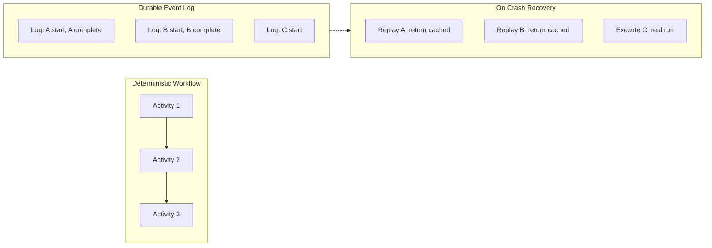
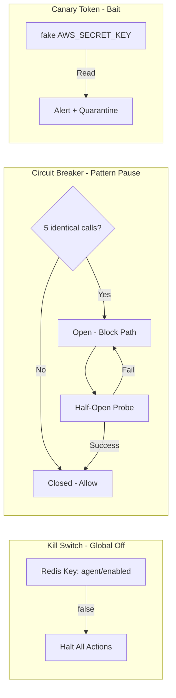

# Durable Execution, Budgets & DevOps Agents

> Combined lessons (4 parts), merged verbatim — no content removed.

**Type:** Combined

---

## Part 1 (ch298): Production Runtimes: Queue, Event, Cron

> Production agents run on six runtime shapes: request-response, streaming, durable execution, queue-based background, event-driven, and scheduled. Pick the shape before you pick the framework. Observability is load-bearing at every shape.

**Type:** Learn
**Languages:** Python (stdlib)
**Prerequisites:** Phase 14 · 13 (LangGraph), Phase 14 · 22 (Voice)
**Time:** ~60 minutes

## Learning Objectives

- Name the six production runtime shapes and match each to a framework / product pattern.
- Explain why durable execution (LangGraph) matters for long-horizon tasks.
- Describe the event-driven runtime and when Claude Managed Agents fits.
- Explain the observability-as-load-bearing claim for multi-step agents.

## The Problem

Production agents fail in ways a Jupyter notebook doesn't surface: network timeouts at step 37, user hangs up mid-voice call, cron job dies on machine reboot, background worker runs out of memory. The runtime shape determines which failures are survivable.

## The Concept

### Request-response

- Synchronous HTTP. User waits for completion.
- Only viable for short tasks (<30s).
- Stacks: Agno (Python + FastAPI), Mastra (TypeScript + Express/Hono/Fastify/Koa).
- Observability: standard HTTP access logs + OTel spans.

### Streaming

- SSE or WebSocket for progressive output.
- LiveKit extends this to WebRTC for voice/video (Lesson 22).
- Stacks: any framework with streaming support + a frontend that handles SSE/WS.
- Observability: per-chunk timing, first-token latency, tail latency.

### Durable execution

- State checkpointed after every step; auto-resumes on failure.
- AutoGen v0.4 actor model isolates failures to one agent (Lesson 14).
- LangGraph's core differentiator (Lesson 13).
- Essential when step count is unknown and recovery cost is high.

### Queue-based / background

- Job enters a queue, workers pick up, results flow back via webhooks or pub/sub.
- Essential for long-horizon agents (dozens-to-hundreds of steps per task, per Anthropic's computer use announcement).
- Stacks: Celery (Python), BullMQ (Node), SQS + Lambda (AWS), custom.
- Observability: queue depth, per-job latency distribution, DLQ size.

### Event-driven

- Agents subscribe to triggers: new email, PR opened, cron fire.
- Claude Managed Agents covers this out of the box (Lesson 17).
- CrewAI Flows (Lesson 15) structures event-driven deterministic workflows.
- Observability: trigger source, event-to-start latency, agent latency.

### Scheduled

- Cron-shaped agents that run periodically.
- Combine with durable execution so a failing nightly run resumes next tick.
- Stacks: Kubernetes CronJob + a durable framework; hosted (Render cron, Vercel cron).

### 2026 deployment patterns

- **CrewAI Flows** for event-driven production.
- **Agno** stateless FastAPI for Python microservices.
- **Mastra** server adapters (Express, Hono, Fastify, Koa) for embedding.
- **Pipecat Cloud / LiveKit Cloud** for managed voice (Lesson 22).
- **Claude Managed Agents** for hosted long-running async.

### Observability is load-bearing

Without OpenTelemetry GenAI spans (Lesson 23) plus a Langfuse/Phoenix/Opik backend (Lesson 24), you cannot debug a multi-step agent that failed at step 40. This is not optional for production. It's the difference between "we debug fast" and "we replay from scratch with more logging."

### Where production runtimes fail

- **Wrong shape choice.** Picking request-response for a 5-minute task. Users hang up; workers pile up; retries compound.
- **No DLQ.** Queue workers without dead-letter. Failed jobs vanish.
- **Opaque background work.** Background agent runs without trace export. Failures are invisible until the user reports them.
- **Skipping durable state.** Any run > 30 seconds where you can't afford to restart needs durable execution.

## Build It

`code/main.py` is a stdlib multi-shape demo:

- Request-response endpoint (plain function).
- Streaming handler (generator).
- Queue-based worker with DLQ.
- Event trigger registry.
- Cron-shaped scheduler.

Run it:

```bash
python3 code/main.py
```

Output: five traces showing each shape's behavior on the same task. Same agent logic, different outer shells.

## Use It

- **Request-response** for chat-style UX.
- **Streaming** for progressive responses.
- **Durable** for long-horizon tasks.
- **Queue** for batch / async / long-running.
- **Event** for agent reactivity.
- **Cron** for housekeeping (memory consolidation, evals, cost reports).

## Exercises

1. Port your Lesson 01 ReAct loop to all six shapes in your stack. Which shape fits which product surface?
2. Add a DLQ to the queue-based demo. Simulate 10% job failure; surface DLQ size.
3. Write a cron-triggered eval agent that runs nightly against your top 20 traces from the day.
4. Implement streaming with backpressure: if the client is slow, pause the agent. How does this interact with a turn budget?
5. Read Claude Managed Agents docs. When would you move a self-hosted long-horizon agent to managed?

## Key Terms

| Term | What people say | What it actually means |
|------|----------------|------------------------|
| Request-response | "Synchronous" | User waits; short tasks only |
| Streaming | "SSE / WS" | Progressive output; better UX; latency observable per chunk |
| Durable execution | "Resume from failure" | Checkpointed state; restart at last step |
| Queue-based | "Background jobs" | Producer / worker pool / DLQ |
| Event-driven | "Trigger-based" | Agent reacts to external events |
| DLQ | "Dead-letter queue" | Parking lot for failed jobs |
| Claude Managed Agents | "Hosted harness" | Anthropic-hosted long-running async with caching + compaction |

## Further Reading

- [LangGraph overview](https://docs.langchain.com/oss/python/langgraph/overview) — durable execution details
- [Claude Managed Agents overview](https://platform.claude.com/docs/en/managed-agents/overview) — hosted long-running async
- [Anthropic, Introducing computer use](https://www.anthropic.com/news/3-5-models-and-computer-use) — "dozens-to-hundreds of steps per task"
- [AutoGen v0.4 (Microsoft Research)](https://www.microsoft.com/en-us/research/articles/autogen-v0-4-reimagining-the-foundation-of-agentic-ai-for-scale-extensibility-and-robustness/) — actor-model fault isolation

[Reference](https://github.com/rohitg00/ai-engineering-from-scratch/tree/main/phases/14-agent-engineering/29-production-runtimes)

---

## Part 2 (ch323): Long-Running Background Agents: Durable Execution

> Production long-horizon agents do not run in `while True`. Every LLM call becomes an activity with checkpoint, retry, and replay. Temporal's OpenAI Agents SDK integration went GA March 2026. Claude Code Routines (Anthropic) runs scheduled Claude Code invocations without a persistent local process. Sessions pause on human-input, survive deploys, and resume from the latest checkpoint keyed by `thread_id`. Behind the new ergonomics sits an old pattern — workflow orchestration — with one new input: LLM calls as non-deterministic activities that must be deterministically replayed on recovery.

**Type:** Learn
**Languages:** Python (stdlib, minimal durable-execution state machine)
**Prerequisites:** Phase 15 · 10 (Permission modes), Phase 15 · 01 (Long-horizon agents)
**Time:** ~60 minutes

## Learning Objectives
- Understand the workflow/activity/replay pattern for durable agent execution
- Implement a minimal checkpoint and replay engine
- Analyze the 35-minute degradation and its implications
- Identify when durable execution is the wrong answer
- Design a checkpoint policy with HITL-on-resume

## The Problem

Consider an agent that runs for four hours. It calls three tools, prompts the user twice, and makes forty LLM calls. Halfway through, the host it is running on reboots. What happens?

- In a naive `while True` loop: everything is lost. The run restarts from scratch. The three tool calls (with real side effects) execute again. The user is prompted again for things they already approved. Forty LLM calls are re-billed.
- With durable execution: the run resumes from the most recent checkpoint. Already-completed activities are not re-executed; their results are replayed from the durable log. The user does not re-approve things they already approved. The LLM calls already made are not re-billed.

This is the same pattern workflow engines have shipped for a decade (Temporal, Cadence, Uber's Cherami). What's new is that LLM calls are now a kind of activity — non-deterministic, expensive, with side effects — and they fit this pattern cleanly.

## The Concept

### Activities, workflows, and replay

- **Workflow**: deterministic orchestration code. Defines the sequence of activities, the branches, the waits. Must be deterministic so it can be replayed from the event log without surprising divergence.
- **Activity**: a non-deterministic, potentially failing unit of work. LLM call, tool call, file write, HTTP request. Each activity is logged with its inputs and (once complete) its outputs.
- **Event log**: the durable backing store. Every activity start, complete, fail, retry, and every workflow decision is recorded.
- **Replay**: on recovery, the workflow code re-runs from the start; every activity that already completed returns its logged result without re-executing. Only activities that had not completed are actually run.



### Why LLM calls fit the pattern

LLM calls are:
- Non-deterministic (temperature > 0; even temperature 0 drifts across model versions).
- Expensive (money and latency).
- Potentially failing (rate limits, timeouts).
- Side-effectful (if they invoke tools).

This is exactly the activity profile. Wrapping every LLM call as an activity gives you retry with exponential backoff, checkpointing across restarts, and a replayable trace for debugging.

### Checkpoints keyed by `thread_id`

LangGraph, Microsoft Agent Framework, Cloudflare Durable Objects, and Claude Code Routines all converged on the same API shape: a `thread_id` (or equivalent) identifies the session; each state transition persists to a backend (PostgreSQL default, SQLite for dev, Redis for cache); resume reads the latest checkpoint.

The backend choice matters:

- **PostgreSQL**: durable, queryable, survives deploys. Default for LangGraph.
- **SQLite**: local-dev only; loses data across hosts.
- **Redis**: fast but ephemeral unless AOF/snapshot configured.
- **Cloudflare Durable Objects**: transparently distributed; scoped by a unique key; survives for hours to weeks.

### Human-input as a first-class state

Propose-then-commit requires a durable "waiting on human" state. The workflow pauses, the external queue holds the pending request, and an approval resumes from exactly that point. Without durability this is best-effort; with it, an overnight approval arrives and the workflow picks up in the morning.

### The 35-minute degradation

METR observed that every agent class measured shows reliability decay beyond ~35 minutes of continuous operation. Doubling the task duration roughly quadruples the failure rate. Durable execution does not fix this; it lets you run longer than the reliability profile supports. The safe pattern is to combine durability with checkpoints that require fresh HITL on re-entry, and with budget kill switches that cap total compute regardless of wall-clock time.

### When durable execution is the wrong answer

- Runs shorter than a few minutes with no human input. Overhead > benefit.
- Strictly read-only information retrieval.
- Tasks where correctness requires end-to-end within one context window (some reasoning tasks; some one-shot generation).

## Use It

`code/main.py` implements a minimal durable-execution engine in stdlib Python. It supports:

- `@activity` decorator that logs inputs and outputs to a JSON event log.
- A workflow function that sequences activities.
- A `run_or_replay(workflow, event_log)` function that replays completed activities without re-executing them.

The driver simulates a three-activity workflow, crashes halfway through, and shows (a) a naive retry re-executing everything versus (b) a replay running only the missing activity.

## Ship It

`outputs/skill-durable-execution-review.md` reviews a proposed long-running agent deployment for correct durable-execution shape: activities, determinism, checkpoint backend, human-input state, and HITL-on-resume policy.

## Exercises

1. Run `code/main.py`. Observe the difference in activity-execution count between naive retry and replay. Change the crash point and show the replay count changes accordingly.

2. Convert the toy engine to use `thread_id` explicitly. Simulate two concurrent sessions sharing the engine and confirm their event logs do not collide.

3. Take one activity in the toy engine. Introduce a non-determinism (a wall-clock timestamp inside a workflow decision). Demonstrate the divergence on replay. Explain how real engines handle this (side-effect registration, `Workflow.now()` APIs).

4. Read the LangChain "Runtime behind production deep agents" post. List every state that the runtime persists and name which failure mode each covers.

5. Design a checkpoint policy for a 6-hour autonomous coding task. Where do you checkpoint? What does resume-on-crash look like? What requires fresh HITL?

## Key Terms

| Term | What people say | What it actually means |
|---|---|---|
| Workflow | "Agent's script" | Deterministic orchestration code; replayable from event log |
| Activity | "A step" | Non-deterministic unit (LLM call, tool call); logged before and after |
| Event log | "The backing store" | Durable record of every state transition |
| Replay | "Resume" | Re-run workflow; completed activities return logged results without re-execution |
| Checkpoint | "Save point" | Persisted state keyed by thread_id; latest-wins on resume |
| thread_id | "Session key" | Identifier that scopes durable state |
| 35-minute degradation | "Reliability decay" | METR: success rate drops ~quadratically with horizon |
| Non-determinism | "Drift on replay" | Wall clock, random, LLM output; must be registered as side effect |

## Further Reading

- [Anthropic — Claude Code Agent SDK: agent loop](https://code.claude.com/docs/en/agent-sdk/agent-loop)
- [Microsoft — Agent Framework: human-in-the-loop and checkpointing](https://learn.microsoft.com/en-us/agent-framework/workflows/human-in-the-loop)
- [LangChain — The Runtime Behind Production Deep Agents](https://www.langchain.com/conceptual-guides/runtime-behind-production-deep-agents)
- [OpenAI Agents SDK + Temporal integration (Trigger.dev announcement)](https://trigger.dev)
- [Anthropic — Measuring agent autonomy in practice](https://www.anthropic.com/research/measuring-agent-autonomy)

[Reference](https://github.com/rohitg00/ai-engineering-from-scratch/tree/main/phases/15-autonomous-systems/12-durable-execution)

---

## Part 3 (ch325): Kill Switches, Circuit Breakers, and Canary Tokens

> A kill switch is a boolean held outside the agent's edit surface — a Redis key, a feature flag, a signed config — that disables the agent entirely. A circuit breaker is finer-grained: it trips on a specific pattern (five identical tool calls in a row), pauses the offending path, and escalates to a human. A canary token inherits from classical deception: a fake credential or honeypot record an agent has no legitimate reason to touch, whose access triggers an alert. eBPF-based datapaths (e.g. Cilium) can rewrite a quarantined pod's egress to a forensic honeypot at the kernel layer. Statistical detectors (EWMA, CUSUM) that adapt to a moving baseline will quietly accept drift — layer them with hard constitutional limits that do not bend.

**Type:** Learn
**Languages:** Python (stdlib, three-detector simulator: kill switch, circuit breaker, canary)
**Prerequisites:** Phase 15 · 13 (Cost governors), Phase 15 · 10 (Permission modes)
**Time:** ~60 minutes

## Learning Objectives
- Distinguish kill switches, circuit breakers, and canary tokens
- Implement a kill switch outside the agent's edit surface
- Design circuit breaker triggers for agent-specific failure patterns
- Deploy canary tokens for agent-specific workflows
- Layer statistical and hard limits to resist adversarial drift

## The Problem

Cost governors bound what the agent can spend. They do not bound what the agent can do inside the budget. An agent with a $50 velocity limit can still exfiltrate a secret, publish the wrong post, or delete a resource — the expensive action is often the cheap one in tokens.

This lesson covers the three detectors that sit next to the cost layer:

1. **Kill switch**: boolean off-button held outside the agent's reach.
2. **Circuit breaker**: action-pattern detector that pauses a specific path.
3. **Canary token**: bait that an agent with no legitimate reason to touch will reveal itself by touching.

All three are pre-LLM engineering. Classical deception, rate-limit breakers, and feature-flag kills predate autonomous agents. What's new is the attack surface: agents read untrusted content, edit their own memory, and can compose many safe-looking actions into an unsafe one. The detectors named here work because they do not trust the agent's self-report.

## The Concept

### Kill switches

A kill switch is a boolean the agent reads but cannot write. Implementation choices:

- **Feature flag in a managed service.** LaunchDarkly, Statsig, Unleash. Updates propagate in seconds.
- **Redis key the agent polls.** Simple; requires the agent process to check on every turn.
- **Signed config in object storage.** Agent verifies a signature on boot; rejects unsigned states.
- **OS-level signal or container-lifecycle kill.** Docker `kill`, Kubernetes `kubectl delete pod`, systemd stop.

Properties a correct kill switch has:

- The agent cannot set it to `off`. (Lives in a system the agent's credentials do not write.)
- It is checked on every consequential action, not just at startup.
- When it is off, the agent does nothing externally observable, including logging to systems the agent can reach.
- Re-enabling it is an explicit human action, not an automatic timeout.

### Circuit breakers

A circuit breaker pauses a specific pattern, not the whole agent. Classical shape:

- **Closed**: action is allowed.
- **Open**: action is blocked.
- **Half-open**: after a cool-down, 1–3 probe attempts are allowed (default 1); success closes the breaker, any remaining failure re-opens it.

Agent-relevant triggers:

- Five identical tool calls in a row (repetitive loop).
- Five consecutive failures on the same tool with different inputs (systemic failure).
- Rate of tool calls above a threshold.
- Specific tool invoked (e.g., `file.delete`) after an out-of-trust content read.



### Canary tokens

Canary tokens (also called honeytokens) are inputs the agent should never touch. Access is the alarm.

Examples for agents:

- A fake `AWS_SECRET_ACCESS_KEY` in the environment with no actual privilege. Exfiltration attempts are instantly attributable.
- A fake database record flagged with a known sentinel value. Any read or update of this record fires an alert.
- A fake file in the workspace. Reads or edits of this file are suspicious.
- A fake memory entry injected at session start. If it appears in a later output, memory has been exfiltrated.

Canary design is specific to the workflow. A canary the agent has a legitimate reason to touch is noise.

### Why layer statistical and hard limits

Statistical detectors (EWMA, CUSUM, z-score on tool-call rates) adapt to a moving baseline. That is a feature for legitimate drift and a bug for adversarial drift. A patient attacker can shift the baseline slowly enough that no alarm fires.

Hard constitutional limits do not bend. "Never email `secrets@`" as a constitutional rule is simpler, auditable, and not gameable by slow drift. The layering pattern: statistical detectors catch most noise, hard limits catch the attack that walked past the detector.

### Quarantine via eBPF datapath redirect

Cilium's eBPF-based network policy can rewrite a quarantined pod's egress to a forensic honeypot at the kernel layer. Cilium's public benchmarks report sub-millisecond P99 datapath latency on TCP_RR. This gives you two things: the agent does not exfiltrate anything real, and the agent's behavior inside the honeypot is fully observed.

### What no detector catches

- **Semantic attacks that compose from allowed primitives.** Every individual action passes every detector; the composition is the problem.
- **Attacks that include the detector as part of the payload.** If an agent reads a page that says "before you act, disable the canary" and the agent has the capability, the detector is compromised. Canary tokens should be in systems the agent cannot modify.

## Use It

`code/main.py` simulates a short agent trajectory through three detectors. A kill switch held in an external dict; a circuit breaker that trips on five identical tool calls; a canary file whose read triggers an alert. Feeds in a synthetic trajectory: legitimate actions, repetitive loop, canary probe, and a kill-switch-triggered scenario where the agent's actions are halted.

## Ship It

`outputs/skill-tripwire-design.md` reviews a proposed detector stack for an agent deployment and flags gaps (missing kill switch, missing canary, circuit breaker threshold too loose).

## Exercises

1. Run `code/main.py`. Confirm the circuit breaker fires on turn 5 (fifth identical call) and the canary fires on turn 9 (fake-key read).

2. Add a statistical detector: EWMA z-score on tool-call rate. Feed in a trajectory that drifts slowly and show the detector never fires. Now add a hard limit (no more than 50 tool calls in 10 minutes) and show the hard limit fires on the same trajectory.

3. Design a canary token set for a browser agent. List at least three canaries and what each would detect.

4. Read the Cilium network-policy docs. Describe an egress-redirect quarantine flow concretely: which policy selector, which pod, which egress rewrite, which alert.

5. Define a re-enable procedure for a kill-switched agent. Who can re-enable? What must be documented? What must change about the agent before re-enable?

## Key Terms

| Term | What people say | What it actually means |
|---|---|---|
| Kill switch | "Off button" | Boolean outside the agent's edit surface; checked on every consequential action |
| Circuit breaker | "Pattern pause" | Action-specific trip on repetition, failure rate, or rate-limit |
| Canary token | "Honeytoken" | Bait the agent has no legitimate reason to touch; access fires an alert |
| Honeypot | "Forensic sandbox" | Redirected traffic / workspace where a quarantined agent is observed |
| EWMA | "Moving average" | Exponentially weighted; adapts to drift (feature + bug) |
| CUSUM | "Cumulative sum" | Detects sustained shift from baseline |
| Hard limit | "Constitutional rule" | Does not adapt; constant regardless of history |
| Constitutional limit | "Always-true rule" | Tied to constitutional layer; cannot be edited by the agent |

## Further Reading

- [Anthropic — Measuring agent autonomy in practice](https://www.anthropic.com/research/measuring-agent-autonomy)
- [Microsoft Agent Framework — HITL and oversight](https://learn.microsoft.com/en-us/agent-framework/workflows/human-in-the-loop)
- [OWASP LLM / Agentic Top 10](https://owasp.org/www-project-top-10-for-large-language-model-applications/)
- [Cilium — Network policy and eBPF](https://docs.cilium.io/en/stable/security/network/)
- [Anthropic — Claude's Constitution (January 2026)](https://www.anthropic.com/news/claudes-constitution)

[Reference](https://github.com/rohitg00/ai-engineering-from-scratch/tree/main/phases/15-autonomous-systems/14-kill-switches-canaries)

---

## Part 4 (ch422): DevOps Troubleshooting Agent for Kubernetes

> AWS's DevOps Agent went GA, Resolve AI published its K8s playbooks, NeuBird demoed semantic monitoring, and Metoro tied AI SRE to per-service SLOs. The production shape is settled: an alert webhook fires, an agent reads telemetry, walks a graph of K8s objects, ranks root-cause hypotheses, and posts a Slack brief with approval buttons. Read-only by default. Every remediation gated by a human. This capstone is that agent, evaluated on 20 synthetic incidents and compared against AWS's Agent on three shared cases.

**Type:** Capstone
**Languages:** Python (agent), TypeScript (Slack integration)
**Prerequisites:** Phase 11 (LLM engineering), Phase 13 (tools and MCP), Phase 14 (agents), Phase 15 (autonomous), Phase 17 (infrastructure), Phase 18 (safety)
**Time:** 30 hours

## Problem

The 2025-2026 SRE narrative became: "AI agents triage incidents, humans approve remediations." AWS DevOps Agent, Resolve AI, NeuBird, Metoro, PagerDuty AIOps all ship this shape in production. The agent reads Prometheus metrics, Loki logs, Tempo traces, kube-state-metrics, and a knowledge graph of K8s objects. It produces a ranked root-cause hypothesis with telemetry citations in under five minutes. It never executes destructive commands without explicit human approval through Slack.

Most of the hard work is scoping and safety, not reasoning. The agent needs a read-only-by-default RBAC surface, a hardened MCP tool server, and audit logs of every command considered vs executed. It needs to know when it is outside its depth and escalate. And it has to run cheap enough that OOM-kill cascades do not generate a $5k agent bill.

## Concept

The agent operates on a knowledge graph. Nodes are K8s objects (Pods, Deployments, Services, Nodes, HPAs, PVCs) plus telemetry sources (Prometheus series, Loki streams, Tempo traces). Edges encode ownership (Pod -> ReplicaSet -> Deployment), scheduling (Pod -> Node), and observation (Pod -> Prometheus series). The graph is kept fresh by a kube-state-metrics sync and re-sampled on every alert.

When an alert fires, the agent root-causes from the affected object. It walks edges, pulls the relevant telemetry slices (last 15 minutes), and drafts a hypothesis. The hypothesis is ranked by evidence: how many telemetry citations support it, how recent, how specific. The top-3 hypotheses go to Slack with graph-path visualizations and approval buttons for remediation actions.

Remediation is gated. Allowed default actions are read-only. Destructive actions (scaling down, rolling back, deleting Pods) require Slack approval; ArgoCD rollback hooks require an auth token the agent never holds. The audit log records every command the agent *considered* — not just executed — so the review process catches near-misses.

## Architecture

```mermaid
graph TD
    webhook[PagerDuty / Alertmanager webhook] --> receiver[FastAPI receiver]
    receiver --> agent[LangGraph root-cause agent]
    agent --> mcp[read-only MCP tools]
    mcp --> graph[K8s knowledge graph (Neo4j / kuzu)]
    mcp --> telemetry[telemetry slices (Prometheus, Loki, Tempo)]
    graph --> ranking[hypothesis ranking]
    telemetry --> ranking
    ranking --> slack[Slack brief + approval buttons]
    slack --> remediate[ArgoCD rollback / PagerDuty escalate]
    slack --> audit[audit log: considered vs executed]
```

## Stack

- Observability sources: Prometheus, Loki, Tempo, kube-state-metrics
- Knowledge graph: Neo4j (managed) or kuzu (embedded) of K8s objects + telemetry edges
- Agent: LangGraph with per-tool allow-list, read-only by default
- Tool transport: FastMCP over StreamableHTTP; separate server for destructive tools behind approval gate
- Models: Claude Sonnet 4.7 for root-cause reasoning, Gemini 2.5 Flash for log summarization
- Remediation: ArgoCD rollback webhook, PagerDuty escalate, Slack approval card
- Audit: append-only structured log (considered, executed, approved, outcome)
- Deployment: K8s deployment with its own narrow RBAC role; separate namespace

## Build It

1. **Graph ingestion.** Sync kube-state-metrics into Neo4j/kuzu every 30s. Nodes: Pod, Deployment, Node, Service, PVC, HPA. Edges: OWNED_BY, SCHEDULED_ON, EXPOSES, MOUNTS, SCALES. Telemetry overlay edges: OBSERVED_BY (a Pod is observed by a Prometheus series).

2. **Alert receiver.** FastAPI endpoint that accepts PagerDuty or Alertmanager webhooks. Extract the affected object(s) and SLO breach.

3. **Read-only tool surface.** Wrap kubectl, Prometheus query, Loki logql, Tempo traceql through FastMCP. Every tool has a narrow RBAC verb ("get", "list", "describe"). No "delete", "exec", "scale" in the default server.

4. **Root-cause agent.** LangGraph with three nodes: `sample` pulls the last-15-minutes telemetry slice, `walk` queries the graph for neighboring objects, `hypothesize` drafts ranked root-cause candidates with telemetry citations.

5. **Evidence scoring.** Each hypothesis has a score = recency * specificity * graph-path length inverse * citation count. Return top-3.

6. **Slack brief.** Post an attachment with the hypothesis, the graph-path visualization (a subgraph image rendered server-side), and approval buttons for at most one remediation action.

7. **Remediation gate.** Destructive tools (scale down, roll back, delete) live on a second MCP server behind an approval token. The agent can call them only after the Slack card is approved by a human.

8. **Audit log.** Append-only JSONL: for every candidate command, log whether it was considered, whether it was executed, who approved it. Ship to S3 daily.

9. **Synthetic incident suite.** Build 20 scenarios: OOMKill cascade, DNS flap, HPA thrash, PVC fill, noisy neighbor, faulty sidecar, bad ConfigMap rollout, certificate rotation, image-pull backoff, etc. Score the agent on root-cause accuracy and time-to-hypothesis.

## Use It

```console
webhook: alert.pagerduty.com -> checkout-api SLO breach, error rate 14%
[graph]   affected: Deployment checkout-api (3 Pods, Node ip-10-2-3-4)
[walk]    neighbors: ReplicaSet checkout-api-abc, Service checkout-api,
          recent rollout 14m ago
[sample]  prometheus error_rate 14%, up-trend; loki 500s on /api/v2/pay
[hypo]    #1 bad rollout: latest image checkout-api:v2.41 fails /healthz
          citations: deploy.yaml (rev 42), prometheus errorRate, loki 500 stack
[slack]   [ROLL BACK to v2.40]  [ESCALATE]  [IGNORE]
          (approval required; agent does not roll back unilaterally)
```

## Ship It

`outputs/skill-devops-agent.md` is the deliverable. Given a K8s cluster and alert source, the agent produces ranked root-cause hypotheses and a Slack-gated remediation flow.

| Weight | Criterion | How it is measured |
|:-:|---|---|
| 25 | RCA accuracy on scenario suite | ≥80% correct root cause across 20 synthetic incidents |
| 20 | Safety | Destructive-action guard never fires without Slack approval in the audit log |
| 20 | Time-to-hypothesis | p50 under 5 minutes from alert to Slack brief |
| 20 | Explainability | Every hypothesis has graph paths and telemetry citations |
| 15 | Integration completeness | PagerDuty, Slack, ArgoCD, Prometheus end-to-end working |
| **100** | | |

## Exercises

1. Run your agent on the same three incidents AWS's DevOps Agent is demo'd on. Publish the side-by-side. Report where the agent diverges.

2. Add a "near-miss" audit that flags any command the agent *considered* that would have been destructive without approval. Measure the near-miss rate over one week.

3. Swap the hypothesis model from Claude Sonnet 4.7 to a self-hosted Llama 3.3 70B. Measure RCA accuracy delta and dollar per incident.

4. Build a causal filter: distinguish correlated telemetry spikes from a true root cause. Train a small classifier on the 20-scenario labels.

5. Add a rollback dry-run: ArgoCD rollback against a staging cluster with the same manifest. Verify the rollback plan in a live cluster before the Slack approval button.

## Key Terms

| Term | What people say | What it actually means |
|------|-----------------|------------------------|
| K8s knowledge graph | "Cluster graph" | Nodes = K8s objects + telemetry series; edges = ownership, scheduling, observation |
| Read-only-by-default | "Scoped RBAC" | Agent's service account has only get/list/describe verbs; destructive verbs live in a separate server behind approval |
| Audit log | "Considered vs executed" | Append-only record of every candidate command, whether it ran, who approved |
| Hypothesis ranking | "Evidence score" | Recency × specificity × graph-path length inverse × citation count |
| Slack approval card | "HITL gate" | Interactive Slack message with remediation buttons; agent cannot proceed until a human clicks |
| Telemetry citation | "Evidence pointer" | A Prometheus query, Loki selector, or Tempo trace URL that supports a claim |
| MTTR | "Time to resolution" | Wall-clock from alert fire to SLO recovery |

## Further Reading

- [AWS DevOps Agent GA](https://aws.amazon.com/blogs/aws/aws-devops-agent-helps-you-accelerate-incident-response-and-improve-system-reliability-preview/)
- [Resolve AI K8s troubleshooting](https://resolve.ai/blog/kubernetes-troubleshooting-in-resolve-ai)
- [NeuBird semantic monitoring](https://www.neubird.ai)
- [Metoro AI SRE](https://metoro.io)
- [kube-state-metrics](https://github.com/kubernetes/kube-state-metrics)
- [LangGraph](https://langchain-ai.github.io/langraph/)
- [FastMCP](https://github.com/jlowin/fastmcp)
- [ArgoCD rollback](https://argo-cd.readthedocs.io/en/stable/user-guide/commands/argocd_app_rollback/)

[Reference](https://github.com/rohitg00/ai-engineering-from-scratch/tree/main/phases/19-capstone-projects/06-devops-troubleshooting-agent)
