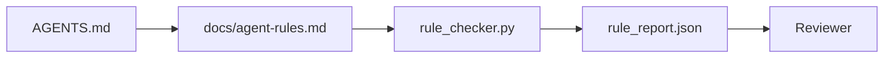
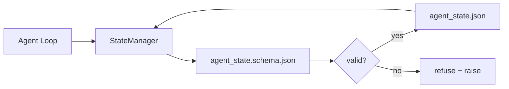

# Why Models Fail, Minimal Workbench & Repo Memory

> Combined lessons (4 parts), merged verbatim — no content removed.

**Type:** Combined

---

## Part 1 (ch300): Agent Workbench Engineering: Why Capable Models Still Fail

> A capable model is not enough. Reliable agents need a workbench: instructions, state, scope, feedback, verification, review, and handoff. Strip those away and even a frontier model produces work that is unsafe to ship.

**Type:** Learn + Build
**Languages:** Python (stdlib)
**Prerequisites:** Phase 14 · 01 (Agent Loop), Phase 14 · 26 (Failure Modes)
**Time:** ~45 minutes

## Learning Objectives

- Separate model capability from execution reliability.
- Name the seven workbench surfaces that decide whether an agent ships.
- Compare a prompt-only run against a workbench-guided run on a small repo task.
- Produce a failure-mode report that maps each missed surface to the symptom it caused.

## The Problem

You drop a frontier model into a real repo and ask it to add input validation. It opens four files, writes plausible code, declares success, and stops. You run the tests. Two fail. A third file is touched that had nothing to do with validation. There is no record of what the agent assumed, what it tried first, or what is left to do.

The model was not wrong about Python. It was wrong about the work. It had no idea what counted as done, where it was allowed to write, what tests were authoritative, or how the next session was supposed to pick up.

This is not a model bug. It is a workbench bug. The surface around the agent is missing the parts that turn a one-shot generation into reliable, resumable engineering.

## The Concept

A workbench is the operating environment that wraps the model during a task. It has seven surfaces:

| Surface | What it carries | Failure when missing |
|---------|-----------------|----------------------|
| Instructions | Startup rules, forbidden actions, definition of done | Agent guesses what shipping means |
| State | Current task, touched files, blockers, next action | Each session restarts from zero |
| Scope | Allowed files, forbidden files, acceptance criteria | Edits leak into unrelated code |
| Feedback | Real command output captured into the loop | Agent declares success on a 400 |
| Verification | Tests, lint, smoke run, scope check | "Looks good" reaches main |
| Review | A second pass with a different role | Builder marks own homework |
| Handoff | What changed, why, what is left | Next session re-discovers everything |

The workbench is independent of the model. You can swap the model and keep the surfaces. You cannot swap the surfaces and keep reliability.

### Workbench versus prompt engineering

Prompting tells the model what you want this turn. A workbench tells the model how to do work across turns and across sessions. Most agent failure stories are workbench failures wearing prompt-engineering clothes.

### Workbench versus framework

A framework gives you a runtime (LangGraph, AutoGen, Agents SDK). A workbench gives the agent a place to work inside that runtime. You need both.

### Reasoning from primitives, not from vendor taxonomies

Strip the agent label off. An agent run is computation that crosses time, processes, and machines. To make that reliable you need the same primitives any production system needs.

| Primitive | What it carries for an agent |
|-----------|------------------------------|
| Function | A tool call, a rule check, a verification step, a model invocation |
| Worker | The builder, the reviewer, the verifier, an MCP server |
| Trigger | Agent loop tick, HTTP request, queue message, cron, file change |
| Runtime | Claude Code's process, LangGraph's runtime, a worker container |
| Queue | The task board, the feedback log, the review inbox |
| Session persistence | `agent_state.json`, checkpoints, KV stores, the repo itself |
| Authorization policy | Allowed/forbidden files, approval boundaries, MCP capability lists |

### What the receipts actually say

- Terminal Bench 2.0 — same model, harness change moved a coding agent from outside the top 30 to rank five.
- Vercel — deleted 80% of its agent's tools; success rate jumped from 80% to 100%.
- Harvey — legal agents more than doubled accuracy through harness optimization alone.
- 88% of enterprise AI agent projects fail to reach production. The failures cluster around runtime, not reasoning.

## Build It

`code/main.py` runs a tiny repo task twice. First as prompt only, then with the seven surfaces wired in. Same model, same task. The script counts which surfaces were missing on the failed run and prints a failure-mode report.

Run it:

```
python3 code/main.py
```

Output: a side-by-side log of the two runs, a `failure_modes.json` summarizing the prompt-only run, and a one-line verdict for the workbench run.

## Use It

Three places workbench surfaces already exist in the wild:

- **Claude Code, Codex, Cursor.** `AGENTS.md` and `CLAUDE.md` are the instructions surface.
- **LangGraph, OpenAI Agents SDK.** Checkpoints and session stores are the state surface.
- **CI on a real repo.** Tests, lint, and type-check are verification.

## Exercises

1. Pick a repo where you already run an agent. Score the seven surfaces from 0 (missing) to 2 (healthy). What is your weakest surface?
2. Extend `main.py` so the prompt-only run also produces a fake "success" claim. Verify the verification gate would have caught it.
3. Add an eighth surface for your own product. Justify why it does not collapse into one of the existing seven.
4. Re-run the script with a different stub agent that hallucinates an extra file write. Which surface catches it first?
5. Map the five industry-recurring failure modes from Phase 14 · 26 onto the seven surfaces. Which mode is each surface designed to absorb?

## Key Terms

| Term | What people say | What it actually means |
|------|----------------|------------------------|
| Workbench | "The setup" | Engineered surfaces around the model that make work reliable |
| Surface | "A doc" or "a script" | A named, machine-readable input the agent reads or writes every turn |
| System of record | "The notes" | The file the agent treats as truth when chat history is gone |
| Definition of done | "Acceptance" | An objective, file-backed checklist the agent cannot fake |
| Workbench audit | "Repo readiness check" | A pass over the seven surfaces that flags missing pieces before work begins |

## Further Reading

- [Addy Osmani, Agent Harness Engineering](https://addyosmani.com/blog/agent-harness-engineering/)
- [LangChain, The Anatomy of an Agent Harness](https://blog.langchain.com/the-anatomy-of-an-agent-harness/)
- [MongoDB, The Agent Harness](https://www.mongodb.com/company/blog/technical/agent-harness-why-llm-is-smallest-part-of-your-agent-system)
- [Anthropic, Effective harnesses for long-running agents](https://www.anthropic.com/engineering/effective-harnesses-for-long-running-agents)
- [Martin Fowler / Birgitta Böckeler, Harness engineering for coding agent users](https://martinfowler.com/articles/harness-engineering.html)

[Reference](https://github.com/rohitg00/ai-engineering-from-scratch/tree/main/phases/14-agent-engineering/31-agent-workbench-why-models-fail)

---

## Part 2 (ch301): The Minimal Agent Workbench

> The smallest useful workbench is three files: a root instructions router, a state file, and a task board. Everything else is layered on top. If a repo cannot carry these three, no model will save it.

**Type:** Build
**Languages:** Python (stdlib)
**Prerequisites:** Phase 14 · 31 (Why Capable Models Still Fail)
**Time:** ~45 minutes

## Learning Objectives

- Define the three files that form the minimum viable workbench.
- Explain why a short root router beats a long monolithic `AGENTS.md`.
- Build a state file the agent can read at every turn and write at the end.
- Build a task board that survives multi-session work without chat history.

## The Problem

Most teams reach for a workbench by writing a 3000-line `AGENTS.md` and calling it done. The model loads it, ignores the parts it cannot summarize, and still fails on the same surfaces it always failed on.

You need the opposite. A tiny root file that routes the agent into deeper files only when relevant. Durable state the agent reads before acting and writes after. A task board that says what is in flight, what is blocked, and what is up next.

Three files. Each one with a job. Each one machine-readable enough to evolve into a real system later.

## The Concept

### AGENTS.md is a router, not a manual

A good `AGENTS.md` is short. It points the agent at:

- The state file (where you are).
- The task board (what is left).
- The deeper rules (under `docs/agent-rules.md`).
- The verification command (how to know it works).

Anything longer goes in deeper docs, loaded only when needed. Long manuals get ignored. Short routers get followed.

### agent_state.json is the system of record

State carries: the active task id, the touched files, the assumptions made, the blockers, and the next action. The agent reads it at every turn. The next session reads it instead of replaying chat.

State lives in a file because chat history is unreliable. Sessions die. Conversations get trimmed. The file does not.

### task_board.json is the queue

The task board carries every task with status `todo | in_progress | done | blocked`. It is the queue the agent pulls from when state is empty, and the queue you read when you want to know whether the agent is on track.

A task on the board has an id, a goal, an owner (`builder`, `reviewer`, or `human`), and acceptance criteria. The board is small on purpose: when it grows past a screen, you have a planning problem, not a board problem.

### Three files is the floor, not the ceiling

Later lessons add scope contracts, feedback runners, verification gates, reviewer checklists, and handoff packets. The three files here are what they all assume.

## Build It

`code/main.py` writes the minimal workbench into an empty repo and demonstrates a single agent turn that:

1. Reads `agent_state.json`.
2. Pulls the next task from `task_board.json` if state is empty.
3. Touches a single file inside scope.
4. Writes back updated state.

Run it:

```
python3 code/main.py
```

The script creates `workdir/` next to itself, lays down the three files, runs one turn, and prints the diff. Re-run it to see how the second turn picks up where the first left off.

## Production patterns in the wild

**Nested `AGENTS.md` with nearest-wins precedence.** OpenAI ships 88 `AGENTS.md` files across its main repo, one per subcomponent. Codex, Cursor, Claude Code, and Copilot all walk from the working file toward the repo root and concatenate every `AGENTS.md` they find on the way.

**Anti-patterns to refuse:** conflicting instructions silently drop the agent from interactive to greedy mode (ICLR 2026 AMBIG-SWE: 48.8% → 28% resolve rate); number priorities instead of stacking them flat.

**Cross-tool symlinks.** A single root file with symlinks (`ln -s AGENTS.md CLAUDE.md`, `ln -s AGENTS.md .github/copilot-instructions.md`, `ln -s AGENTS.md .cursorrules`) keeps every coding agent on the same source of truth.

## Exercises

1. Add a `last_run` timestamp to `agent_state.json`. Refuse to run if the file is older than 24 hours unless an operator confirms.
2. Add a `priority` field to the task board and change the puller to always pick the highest priority `todo`.
3. Migrate `task_board.json` to JSON Lines so each task is a line and diffs are clean in version control.
4. Write a `lint_workbench.py` that fails if `AGENTS.md` is over 80 lines or references a file that does not exist.
5. Decide which one of the three files would hurt the most to lose. Defend it.

## Key Terms

| Term | What people say | What it actually means |
|------|----------------|------------------------|
| Router | `AGENTS.md` | Short root file that points the agent at deeper docs and files |
| State file | "The notes" | Machine-readable record of where the agent is, written every turn |
| Task board | "The backlog" | JSON queue of work with status, owner, acceptance |
| System of record | "Source of truth" | The file the workbench treats as authoritative when chat is gone |

## Further Reading

- [agents.md — the open spec](https://agents.md/) — adopted by Cursor, Codex, Claude Code, Copilot, Gemini, OpenCode
- [Augment Code, A good AGENTS.md is a model upgrade](https://www.augmentcode.com/blog/how-to-write-good-agents-dot-md-files)
- [Blake Crosley, AGENTS.md Patterns](https://blakecrosley.com/blog/agents-md-patterns)
- [Datadog Frontend, Steering AI Agents in Monorepos](https://dev.to/datadog-frontend-dev/steering-ai-agents-in-monorepos-with-agentsmd-13g0)
- [Nx Blog, Teach Your AI Agent How to Work in a Monorepo](https://nx.dev/blog/nx-ai-agent-skills)

[Reference](https://github.com/rohitg00/ai-engineering-from-scratch/tree/main/phases/14-agent-engineering/32-minimal-agent-workbench)

---

## Part 3 (ch302): Agent Instructions as Executable Constraints

> Instructions written as prose are wishes. Instructions written as constraints are tests. The workbench turns each rule into something an agent can check at runtime and a reviewer can verify after the fact.

**Type:** Build
**Languages:** Python (stdlib)
**Prerequisites:** Phase 14 · 32 (Minimal Workbench)
**Time:** ~50 minutes

## Learning Objectives

- Separate routing prose from operational rules.
- Express startup rules, forbidden actions, definition of done, uncertainty handling, and approval boundaries as machine-checkable constraints.
- Implement a rule checker that scores a run against the rule set.
- Make the rule set diff-friendly so review can see what changed.

## The Problem

A typical `AGENTS.md` reads like onboarding documentation. It tells the agent to "be careful" and "test thoroughly" and "ask if unsure." Three days later, the agent ships a change with no tests, writes to a forbidden directory, and never asks because it never knew where the line was.

Instructions are powerful when they are operational and weak when they are aspirational. The fix is to write rules the workbench can interpret and the reviewer can score.

## The Concept

Rules belong in `docs/agent-rules.md`, away from the short root router. Each rule has a name, a category, and a check.



### Five categories that cover most rules

| Category | Question the rule answers | Example |
|----------|---------------------------|---------|
| Startup | What must be true before work begins? | "state file exists and is fresh" |
| Forbidden | What must never happen? | "do not edit `scripts/release.sh`" |
| Definition of done | What proves the task is complete? | "pytest exits 0 and acceptance line passes" |
| Uncertainty | What does the agent do when unsure? | "open a question note instead of guessing" |
| Approval | What requires human approval? | "any new dependency, any prod write" |

### Rules are machine-readable

Each rule has a slug, a category, a one-line description, and a `check` field that names a function in `rule_checker.py`.

### Rules are diff-friendly

Rules live one per heading in a single markdown file. Renames are visible in diffs. New rules sit at the top of their category.

### Rules versus framework guardrails

Framework guardrails enforce rules at runtime. The rule set is the human-readable, reviewable contract those guardrails implement. You need both.

### Progressive disclosure: a map, not an encyclopedia

```
AGENTS.md                  # router, < 50 lines
docs/
  agent-rules.md           # the full rule set
  architecture.md          # loaded when task touches module boundaries
  testing.md               # loaded when task writes or runs tests
  deploy.md                # loaded only for release work, gated behind approval
feature_list.json          # the backlog
```

| Tier | Lives in | Read when | Size budget |
|------|----------|-----------|-------------|
| Router | `AGENTS.md` | Every session | Under ~50 lines |
| Rules | `docs/agent-rules.md` | Every session, on startup | One screen per category |
| Topic docs | `docs/<topic>.md` | Only when task touches that topic | As deep as needed |

## Build It

`code/main.py` ships:

- `agent-rules.md` parser that loads rules into a dataclass.
- `rule_checker.py` style checker functions, one per `check` reference.
- A demo agent run that violates two rules and a check pass that catches them.

```
python3 code/main.py
```

## Production patterns in the wild

**Severity tagging at write time.** Every rule carries `severity`: `block`, `warn`, or `info`. Most teams overstate severity early then quietly weaken it under deadline pressure; tagging at write time forces calibration up front.

**Rule expiry as a forcing function.** Every rule carries an `expires_at` date (default 90 days). Cloudflare's production AI Code Review data (April 2026, 131,246 review runs) showed rule sets with explicit expiry stayed under 30 rules per repo; sets without grew to 80+.

**Markdown-as-source, JSON-as-cache.** `agent-rules.md` is the authored file; `agent-rules.lock.json` is a cache the checker reads in the hot path.

## Use It

- Claude Code, Codex, Cursor read rules at session start and quote them when refusing actions.
- OpenAI Agents SDK guardrails register the same checks as input and output guardrails.
- LangGraph interrupts fire when a node violates a rule.

## Ship It

`outputs/skill-rule-set-builder.md` interviews a project owner, classifies their existing prose instructions into the five categories, and emits a versioned `agent-rules.md` plus a checker stub.

## Exercises

1. Add a sixth category if your product genuinely needs it. Defend why it does not collapse into one of the five.
2. Extend the checker so a rule can carry a severity (`block`, `warn`, `info`) and the report aggregates accordingly.
3. Wire the checker into CI: fail the build if a block-severity rule fails on the latest agent run.
4. Add an "expiry" field per rule. After 90 days without a check fail, the rule is up for review.
5. Find a real `AGENTS.md` and rewrite it as five-category rules. How many of its lines were operational? How many were aspirational?

## Key Terms

| Term | What people say | What it actually means |
|------|----------------|------------------------|
| Operational rule | "A real instruction" | A rule the workbench can check at runtime |
| Aspirational rule | "Be careful" | A rule with no check; either delete or upgrade |
| Definition of done | "Acceptance" | An objective, file-backed proof the task is complete |
| Block severity | "Hard rule" | Violation halts the run; cannot be silenced without an operator |
| Rule expiry | "Stale rule sweep" | A rule with no fails in N days is up for retirement |

## Further Reading

- [OpenAI Agents SDK guardrails](https://platform.openai.com/docs/guides/agents-sdk/guardrails)
- [LangGraph interrupts](https://langchain-ai.github.io/langgraph/how-tos/human_in_the_loop/breakpoints/)
- [Anthropic, Building Effective Agents](https://www.anthropic.com/research/building-effective-agents)
- [Rick Hightower, Agent RuleZ: A Deterministic Policy Engine](https://medium.com/@richardhightower/agent-rulez-a-deterministic-policy-engine-for-ai-coding-agents-9489e0561edf)
- [Cloudflare, Orchestrating AI Code Review at Scale](https://blog.cloudflare.com/ai-code-review/)
- [microservices.io, GenAI development platform — part 1: guardrails](https://microservices.io/post/architecture/2026/03/09/genai-development-platform-part-1-development-guardrails.html)
- [Type-Checked Compliance: Deterministic Guardrails (arXiv 2604.01483)](https://arxiv.org/pdf/2604.01483)
- [logi-cmd/agent-guardrails](https://github.com/logi-cmd/agent-guardrails)
- Phase 14 · 32 — the minimal workbench this rule set drops into
- Phase 14 · 38 — the verification gate that consumes the rule report
- Phase 14 · 39 — the reviewer agent that scores rule compliance

[Reference](https://github.com/rohitg00/ai-engineering-from-scratch/tree/main/phases/14-agent-engineering/33-instructions-as-executable-constraints)

---

## Part 4 (ch303): Repo Memory and Durable State

> Chat history is volatile. The repo is durable. The workbench stores agent state in versioned files so the next session, the next agent, and the next reviewer all read from the same source of truth.

**Type:** Build
**Languages:** Python (stdlib + `jsonschema` optional)
**Prerequisites:** Phase 14 · 32 (Minimal Workbench)
**Time:** ~60 minutes

## Learning Objectives

- Define what belongs in repo memory and what belongs in chat history.
- Author JSON Schemas for `agent_state.json` and `task_board.json`.
- Build a state manager that loads, validates, mutates, and persists state atomically.
- Use the schema to refuse bad writes before they corrupt the workbench.

## The Problem

The agent finishes a session. The chat closes. The next session opens and asks where to start. The model says "let me check the files," reads stale notes, and re-does work that was already complete. Or worse, it rewrites a finished file because no one told it the file was finished.

The workbench fix is repo memory: state lives in JSON files in the repo, written under a schema, persisted atomically, diff-friendly in code review.

## The Concept



### What belongs in repo memory

| Belongs | Does not belong |
|---------|-----------------|
| Active task id | Raw chat transcripts |
| Touched files this session | Token-level reasoning traces |
| Assumptions the agent made | "The user seemed frustrated" |
| Open blockers | Sampled completions |
| Next action | Vendor-specific model ids |

### Schema-first state

JSON Schema covers required keys, allowed `status` values, forbidden values, pattern constraints, and a version field for migrations.

### Atomic writes

Write to a tempfile, fsync, rename over the target. A half-written state file is worse than no file at all.

### Migrations

The state file carries a `schema_version` field; the manager refuses to load a file from a version it cannot migrate.

## Build It

`code/main.py` implements:

- `agent_state.schema.json` and `task_board.schema.json`.
- A stdlib-only validator (subset of JSON Schema).
- `StateManager.load`, `StateManager.update`, `StateManager.commit` with atomic temp-and-rename writes.

```
python3 code/main.py
```

## Production patterns in the wild

**Atomic temp-and-rename is not optional.** A March 2026 Hive project bug report documents the failure mode cleanly: `state.json` was written via `write_text()` and exceptions were caught and silenced.

**Idempotency keys on every non-idempotent tool call.** Log every tool call ID before execution into `pending_calls.jsonl`. On retry, check for the ID; if present, skip the call and use the cached result.

**Separate large artifacts from state.** Don't store CSVs or long transcripts in `agent_state.json`. Keep only the path in state.

**Event sourcing for audit, snapshots for resume.** Append to an event log on every mutation; periodically snapshot to `state.json`.

**Schema migrations or refuse to load.** When the manager loads a file at an unknown version, it refuses to read.

## Use It

- **LangGraph checkpointers.** Same idea, different storage.
- **Letta memory blocks.** Persistent blocks with structured schemas.
- **OpenAI Agents SDK session store.** Pluggable backends, schema-aware.

## Ship It

`outputs/skill-state-schema.md` generates a project-specific JSON Schema pair, a Python `StateManager` wired to atomic writes, and a migration scaffold.

## Exercises

1. Add a `last_human_touch` timestamp. Refuse any agent write within five seconds of a human edit.
2. Extend the validator to support `oneOf` so a task can be either a build task or a review task with different required fields.
3. Add a `schema_version` field and write the migration from v1 to v2 (rename `blockers` to `risks`).
4. Move the storage backend from a local file to SQLite. Keep the `StateManager` API identical.
5. Run two agents against the same state file with a 50 ms write race. What goes wrong and how does the atomic rename save you?

## Key Terms

| Term | What people say | What it actually means |
|------|----------------|------------------------|
| Repo memory | "Notes file" | State stored in tracked files in the repo, under schema |
| Schema-first | "Validate inputs" | Define the contract before the writer, refuse drift |
| Atomic write | "Just rename" | Write to temp, fsync, rename, so partial failures cannot corrupt |
| Migration | "Schema bump" | A script that turns vN state into v(N+1) state |
| System of record | "Source of truth" | The artifact the workbench treats as authoritative |

## Further Reading

- [JSON Schema specification](https://json-schema.org/specification.html)
- [LangGraph checkpointers](https://langchain-ai.github.io/langgraph/concepts/persistence/)
- [Letta memory blocks](https://docs.letta.com/concepts/memory)
- [Fast.io, AI Agent State Checkpointing: A Practical Guide](https://fast.io/resources/ai-agent-state-checkpointing/)
- [Fast.io, AI Agent Workflow State Persistence: Best Practices 2026](https://fast.io/resources/ai-agent-workflow-state-persistence/)
- [Hive Issue #6263 — non-atomic state.json writes silently ignored](https://github.com/aden-hive/hive/issues/6263)
- [eunomia, Checkpoint/Restore Systems: Evolution, Techniques, Applications](https://eunomia.dev/blog/2025/05/11/checkpointrestore-systems-evolution-techniques-and-applications-in-ai-agents/)
- [Indium, 7 State Persistence Strategies for Long-Running AI Agents in 2026](https://www.indium.tech/blog/7-state-persistence-strategies-ai-agents-2026/)
- [Microsoft Agent Framework, Compaction](https://learn.microsoft.com/en-us/agent-framework/agents/conversations/compaction)
- Phase 14 · 08 — memory blocks and sleep-time compute
- Phase 14 · 32 — the three-file minimum this lesson schematizes
- Phase 14 · 40 — handoff packets read from the same schema

[Reference](https://github.com/rohitg00/ai-engineering-from-scratch/tree/main/phases/14-agent-engineering/34-repo-memory-and-state)
