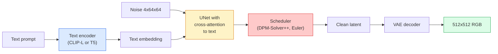

# Stable Diffusion — Architecture & Fine-Tuning

> Stable Diffusion is a DDPM that runs in the latent space of a pretrained VAE, conditioned on text via cross-attention, sampled with a fast deterministic ODE solver, and steered by classifier-free guidance.

**Type:** Learn + Use
**Languages:** Python
**Prerequisites:** Phase 4 Lesson 10 (Diffusion), Phase 7 Lesson 02 (Self-Attention)
**Time:** ~75 minutes

## Learning Objectives

- Trace the five pieces of a Stable Diffusion pipeline: VAE, text encoder, U-Net, scheduler, safety checker
- Explain latent diffusion and why 4x64x64 latents save 48x compute over 3x512x512 pixels
- Use `diffusers` for text-to-image, img2img, inpainting, and ControlNet
- Fine-tune with LoRA on a small custom dataset

## The Problem

Pixel-space DDPM at 512x512 costs 256 GPU-months. Latent diffusion (Rombach et al., CVPR 2022) runs DDPM in a VAE latent space (4x64x64), dropping compute by 48x.

## The Concept

### The pipeline



### Classifier-free guidance (CFG)

```
eps = eps_uncond + w * (eps_cond - eps_uncond)
```

w=7.5 is SD default.

### Latent space geometry

Img2img: encode -> add noise -> denoise -> decode. Inpainting: same but masked.

### LoRA fine-tuning

```
Original: W_q : (d_in, d_out)   frozen
LoRA:     W_q + alpha * (A @ B)   where A : (d_in, r), B : (r, d_out)
```

r is typically 4-32.

## Build It

### Step 1: Text-to-image

```python
import torch
from diffusers import StableDiffusionPipeline

pipe = StableDiffusionPipeline.from_pretrained(
    "runwayml/stable-diffusion-v1-5",
    torch_dtype=torch.float16,
).to("cuda")

image = pipe(
    prompt="a dog riding a skateboard in tokyo, studio ghibli style",
    guidance_scale=7.5,
    num_inference_steps=25,
    generator=torch.Generator("cuda").manual_seed(42),
).images[0]
image.save("dog.png")
```

### Step 2: Swap scheduler

```python
from diffusers import DPMSolverMultistepScheduler, EulerAncestralDiscreteScheduler

pipe.scheduler = DPMSolverMultistepScheduler.from_config(pipe.scheduler.config)
pipe.scheduler = EulerAncestralDiscreteScheduler.from_config(pipe.scheduler.config)
```

### Step 3: Image-to-image

```python
from diffusers import StableDiffusionImg2ImgPipeline
from PIL import Image

img2img = StableDiffusionImg2ImgPipeline.from_pretrained(
    "runwayml/stable-diffusion-v1-5",
    torch_dtype=torch.float16,
).to("cuda")

init_image = Image.open("dog.png").convert("RGB").resize((512, 512))
out = img2img(
    prompt="a dog riding a skateboard, oil painting",
    image=init_image,
    strength=0.6,
    guidance_scale=7.5,
).images[0]
```

### Step 4: Inpainting

```python
from diffusers import StableDiffusionInpaintPipeline

inpaint = StableDiffusionInpaintPipeline.from_pretrained(
    "runwayml/stable-diffusion-inpainting",
    torch_dtype=torch.float16,
).to("cuda")

out = inpaint(
    prompt="a cat",
    image=Image.open("dog.png").convert("RGB").resize((512, 512)),
    mask_image=Image.open("dog_mask.png").convert("L").resize((512, 512)),
    guidance_scale=7.5,
).images[0]
```

### Step 5: LoRA loading

```python
pipe.load_lora_weights("sayakpaul/sd-lora-ghibli")
pipe.fuse_lora(lora_scale=0.8)
image = pipe(prompt="a village square in ghibli style").images[0]
```

### Step 6: LoRA training sketch

```python
# Pseudocode
for step, batch in enumerate(dataloader):
    images, prompts = batch
    latents = vae.encode(images).latent_dist.sample() * 0.18215
    t = torch.randint(0, num_train_timesteps, (batch_size,))
    noise = torch.randn_like(latents)
    noisy_latents = scheduler.add_noise(latents, noise, t)
    text_emb = text_encoder(tokenizer(prompts))
    pred_noise = unet(noisy_latents, t, text_emb)  # LoRA weights injected here
    loss = F.mse_loss(pred_noise, noise)
    loss.backward()
    optimizer.step()
```

## Use It

Production decisions: SD 1.5 (community fine-tunes), SDXL (higher fidelity), SD3/FLUX (SOTA). Scheduler: DPM-Solver++ for 20-30 steps, LCM-LoRA for <1s latency.

## Ship It

- `outputs/prompt-sd-pipeline-planner.md`
- `outputs/skill-lora-training-setup.md`

## Exercises

1. **(Easy)** Generate with guidance_scale in [1, 3, 5, 7.5, 10, 15]; note artifacts.
2. **(Medium)** Run img2img at strength [0.2, 0.4, 0.6, 0.8, 1.0]; describe results.
3. **(Hard)** Train LoRA on 10-20 images of a subject; generate novel scenes.

## Key Terms

## Further Reading

- [Latent Diffusion (Rombach et al., 2022)](https://arxiv.org/abs/2112.10752)
- [CFG (Ho & Salimans, 2022)](https://arxiv.org/abs/2207.12598)
- [LoRA (Hu et al., 2021)](https://arxiv.org/abs/2106.09685)
- [diffusers documentation](https://huggingface.co/docs/diffusers)

[Reference](https://github.com/rohitg00/ai-engineering-from-scratch/tree/main/phases/04-computer-vision/11-stable-diffusion)
