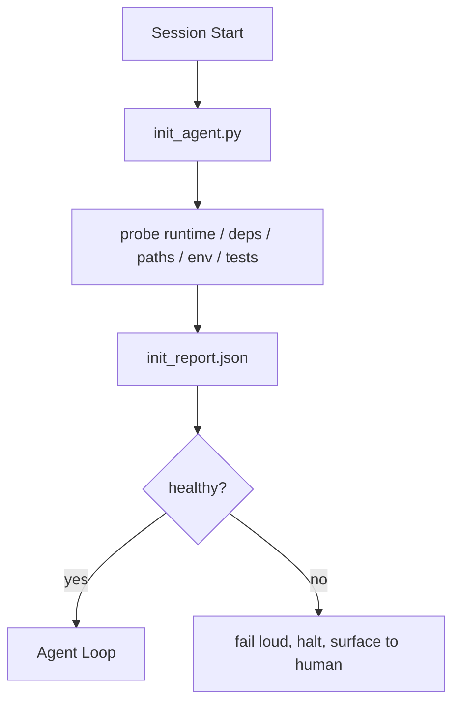
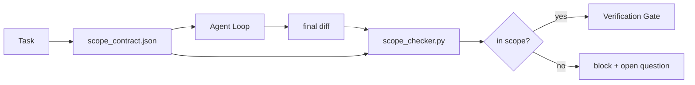
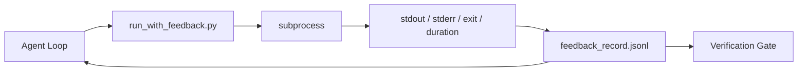
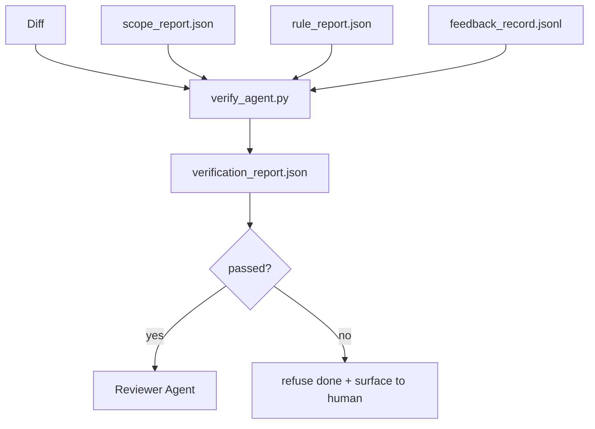

# Init Scripts, Scope, Feedback & Gates

> Combined lessons (4 parts), merged verbatim — no content removed.

**Type:** Combined

---

## Part 1 (ch304): Initialization Scripts for Agents

> Every session that starts cold pays a tax. The agent reads the same files, retries the same probes, and rediscovers the same paths. An init script pays the tax once and writes the answers into state.

**Type:** Build
**Languages:** Python (stdlib)
**Prerequisites:** Phase 14 · 32 (Minimal Workbench), Phase 14 · 34 (Repo Memory)
**Time:** ~45 minutes

## Learning Objectives

- Identify the work an agent should never have to redo per session.
- Build a deterministic init script that probes runtime, dependencies, and repo health.
- Persist the probe result so the agent reads it instead of re-running checks.
- Fail loud, fast, and with one place to look when initialization fails.

## The Problem

Open a session. The agent guesses the Python version. Guesses the test command. Lists the repo root five times to find the entry point. Tries to import a package that is not installed. Asks the user where the config file lives. By the time it makes a real edit, ten thousand tokens have gone to setup work that should have been a single script.

The fix is one initialization script that runs before the agent does anything else and writes a `init_report.json` the agent reads at startup.

## The Concept



### What the init script probes

| Probe | Why it matters |
|-------|----------------|
| Runtime versions | Wrong Python or Node version means silent wrong-version bugs |
| Dependency availability | A missing package later costs ten times the cost of catching it now |
| Test command | The agent must know how to verify; if the command is missing the workbench is broken |
| Repo paths | Hard-coded paths drift; resolve them once and pin |
| Environment variables | Missing `OPENAI_API_KEY` is a failure surface, not a runtime mystery |
| State + board freshness | Stale state from a crashed session is a footgun |
| Last-known-good commit | Anchor for the handoff diff at the end of the session |

### Fail loud, fail fast, fail in one place

A probe failure means halt and surface to the human. No "the agent will figure it out." The whole point of init is to refuse to start when the workbench is broken.

### Idempotent

Run it twice in a row. The second run should be a no-op except for a fresh timestamp.

### Init versus startup rules

Rules describe what must be true to act. Init is the script that establishes that those rules can be checked.

## Build It

`code/main.py` implements `init_agent.py`:

- Five probes: Python version, listed dependencies via `importlib.util.find_spec`, test command resolvability, required env vars, state file freshness.
- The script writes `init_report.json` with the full probe set and exits non-zero if any block-severity probe fails.

```
python3 code/main.py
```

## Production patterns in the wild

**Last-known-good commit anchoring.** If the diff exceeds a budget (default 50 files), refuse to start and require a human to ratify the new baseline.

**Lock files with TTL.** Write a `prereqs.lock` after the first successful probe pass. Subsequent runs trust the lock for N hours and skip expensive probes.

**No network, no LLM, no surprises in the hot path.** If a probe takes longer than three seconds in a dry run, treat that as a workbench smell.

## Use It

- **Claude Code hooks.** `pre-task` hook calls the init script and refuses to launch the agent if it fails.
- **GitHub Actions.** A `setup-agent` job runs the init script; the agent job depends on it.
- **Docker entrypoint.** The agent container runs the init script before exec-ing the agent runtime.

## Ship It

`outputs/skill-init-script.md` interviews the project, classifies its setup work into probes, and emits a project-specific `init_agent.py` plus a CI workflow.

## Exercises

1. Add a probe that diffs the current commit against the last-known-good commit and refuses to start if more than 50 files changed.
2. Wire the script to write a `prereqs.lock` file and refuse to start if the lock is older than seven days.
3. Add a `--fix` flag that auto-installs missing dev dependencies but never modifies runtime dependencies without approval.
4. Move probes from hardcoded functions to a YAML registry. Defend the trade-off.
5. Add a timing budget per probe. A probe that runs longer than three seconds is a workbench smell.

## Key Terms

| Term | What people say | What it actually means |
|------|----------------|------------------------|
| Probe | "A check" | A deterministic function returning `(name, status, detail)` |
| Init report | "Setup output" | JSON written next to state with the probe results |
| Idempotent | "Safe to re-run" | Two runs in a row produce identical reports modulo timestamp |
| Fail loud | "Don't swallow" | Halt and surface to the human; no silent fallback |
| Setup tax | "Bootstrap cost" | The tokens the agent spends per session rediscovering the obvious |

## Further Reading

- [Anthropic, Effective harnesses for long-running agents](https://www.anthropic.com/engineering/effective-harnesses-for-long-running-agents)
- [GitHub Actions, composite actions for setup](https://docs.github.com/en/actions/sharing-automations/creating-actions/creating-a-composite-action)
- [microservices.io, GenAI dev platform: guardrails](https://microservices.io/post/architecture/2026/03/09/genai-development-platform-part-1-development-guardrails.html)
- [Augment Code, How to Build Your AGENTS.md (2026)](https://www.augmentcode.com/guides/how-to-build-agents-md)
- [Codex Blog, Codex CLI Context Compaction](https://codex.danielvaughan.com/2026/03/31/codex-cli-context-compaction-architecture/)
- Phase 14 · 33 — the rule set this script enables
- Phase 14 · 34 — the state file this script seeds
- Phase 14 · 38 — the verification gate the init script feeds
- Phase 14 · 40 — the handoff that consumes the init report's last-known-good

[Reference](https://github.com/rohitg00/ai-engineering-from-scratch/tree/main/phases/14-agent-engineering/35-initialization-scripts)

---

## Part 2 (ch305): Scope Contracts and Task Boundaries

> The model does not know where the work ends. A scope contract is a per-task file that says where the work begins, where it ends, and how to roll back if it spills. The contract turns "stay in scope" from a wish into a check.

**Type:** Build
**Languages:** Python (stdlib)
**Prerequisites:** Phase 14 · 32 (Minimal Workbench), Phase 14 · 33 (Rules as Constraints)
**Time:** ~50 minutes

## Learning Objectives

- Write a scope contract that an agent reads at task start and a verifier reads at task end.
- Specify allowed files, forbidden files, acceptance criteria, rollback plan, and approval boundaries.
- Implement a scope checker that compares a diff against the contract and flags violations.
- Make scope creep visible, automatic, and reviewable.

## The Problem

Agents creep. The task is "fix the login bug." The diff touches the login route, the email helper, the database driver, the README, and the release script. Each touch had a plausible reason in the moment. Together they are a different change than the one that was reviewed.

Scope creep is the most under-monitored failure mode in agent work. The fix is a contract on disk that says what was promised and a check that compares the result against the promise.

## The Concept



### What goes in a scope contract

| Field | Purpose |
|-------|---------|
| `task_id` | Links to the task on the board |
| `goal` | One sentence the reviewer can verify |
| `allowed_files` | Globs the agent may write |
| `forbidden_files` | Globs the agent must not touch |
| `acceptance_criteria` | Test commands or assertion lines that prove done |
| `rollback_plan` | One paragraph the operator can execute if a halt is required |
| `approvals_required` | Actions outside scope that need explicit human sign-off |

### Two altitudes of scope: the feature list and the task contract

The scope contract bounds one task. A `feature_list.json` bounds the project backlog. The agent picks exactly one feature whose `status` is `todo`, writes its `id` into the active scope contract, and is forbidden from starting a second feature in the same session.

```json
{
  "project": "knowledge-base",
  "active": "import-pdf",
  "features": [
    { "id": "import-pdf",   "status": "in_progress", "goal": "import a PDF into the library",        "done_when": "pytest tests/test_import.py && a sample PDF appears in the library view" },
    { "id": "full-text-search", "status": "todo",     "goal": "search document text and rank hits",   "done_when": "query returns ranked results with snippets" }
  ]
}
```

## Build It

`code/main.py` implements:

- `scope_contract.json` schema with glob arrays.
- A diff parser that turns touched files plus run commands into a `RunSummary`.
- A `scope_check` that returns `(violations, in_scope, off_scope)` against the contract.
- Two demo runs: one that stays in scope, one that creeps.

```
python3 code/main.py
```

## Production patterns in the wild

**Violation budgets, not binary failures.** Minor scope slips within budget are surfaced as warnings; only when the budget is exceeded does the merge gate refuse.

**Severity asymmetry by path family.** Off-scope writes to `docs/**` are usually `warn`; off-scope writes to `scripts/**`, `migrations/**`, `config/prod/**` are always `block`.

**Time and network budgets next to file budgets.** A `time_budget_minutes` field bounds wall clock. A `network_egress` allowlist prevents the agent from quietly hitting an external API.

**Multi-contract merge semantics (least privilege).** Intersect `allowed_files`, union `forbidden_files`, min `time_budget_minutes`.

## Use It

- **Claude Code slash commands.** A `/scope` command writes the contract.
- **GitHub PRs.** CI runs the scope checker against the merge diff.
- **LangGraph interrupts.** A scope violation triggers an interrupt asking the human.

## Ship It

`outputs/skill-scope-contract.md` generates a scope contract for a task description and a glob-aware checker that runs in CI.

## Exercises

1. Add a `network_egress` field listing allowed external hosts. Refuse runs that touch other hosts.
2. Extend the checker to fail soft on `docs/**` and hard on `scripts/**`. Justify the asymmetry.
3. Make the contract derive `allowed_files` from a `goal` field using a static rule set (no LLM).
4. Add a `time_budget_minutes` and refuse to continue once the wall clock exceeds it.
5. Run two contracts against the same diff. What is the right merge semantics when both apply?

## Key Terms

| Term | What people say | What it actually means |
|------|----------------|------------------------|
| Scope contract | "The task brief" | Per-task JSON listing allowed/forbidden files, acceptance, rollback |
| Scope creep | "It also touched..." | Files outside the contract changed in the same task |
| Rollback plan | "We can revert" | The one-paragraph operator runbook for halting |
| Approval boundary | "Needs sign-off" | An action listed in the contract as requiring explicit human approval |
| Diff check | "Path audit" | Comparing touched files against the contract globs |

## Further Reading

- [LangGraph human-in-the-loop interrupts](https://langchain-ai.github.io/langgraph/concepts/human_in_the_loop/)
- [OpenAI Agents SDK tool approval policies](https://platform.openai.com/docs/guides/agents-sdk)
- [logi-cmd/agent-guardrails — merge gates and scope validation](https://github.com/logi-cmd/agent-guardrails)
- [Dev|Journal, Preventing AI Agent Configuration Drift with Agent Contract Testing](https://earezki.com/ai-news/2026-05-05-i-built-a-tiny-ci-tool-to-keep-ai-agent-configs-from-drifting-in-my-repo/)
- [Agentic Coding Is Not a Trap (production logs)](https://dev.to/jtorchia/agentic-coding-is-not-a-trap-i-answered-the-viral-hn-post-with-my-own-production-logs-33d9)
- [OpenCode permission globs](https://opencode.ai/docs/agents/)
- [Knostic, AI Coding Agent Security: Threat Models and Protection Strategies](https://www.knostic.ai/blog/ai-coding-agent-security)
- [Augment Code, AI Spec Template](https://www.augmentcode.com/guides/ai-spec-template)
- Phase 14 · 27 — prompt injection defenses that pair with scope locks
- Phase 14 · 33 — the rule set this contract specializes per task
- Phase 14 · 38 — the verification gate the checker reports into

[Reference](https://github.com/rohitg00/ai-engineering-from-scratch/tree/main/phases/14-agent-engineering/36-scope-contracts)

---

## Part 3 (ch306): Runtime Feedback Loops

> Agents that do not see real command output guess. A feedback runner captures stdout, stderr, exit code, and timing into a structured record the next turn can read. Then the agent reacts to facts instead of to its own prediction of facts.

**Type:** Build
**Languages:** Python (stdlib)
**Prerequisites:** Phase 14 · 32 (Minimal Workbench), Phase 14 · 35 (Init Script)
**Time:** ~50 minutes

## Learning Objectives

- Distinguish runtime feedback from observability telemetry.
- Build a feedback runner that wraps shell commands and persists structured records.
- Truncate large outputs deterministically so the loop stays within token budget.
- Refuse to advance the loop when feedback is missing.

## The Problem

The agent says "running tests now." The next message says "all tests pass." The reality is that no test ran. The agent imagined the output, or it ran the command and never read the result, or it read the result and silently truncated the failure line.

A feedback runner removes that gap. Every command goes through the runner. Every record carries the command, the captured stdout and stderr, the exit code, the wall-clock duration, and a one-line agent note.

## The Concept



### What goes in a feedback record

| Field | Why it matters |
|-------|----------------|
| `command` | Exact argv, no shell expansion surprises |
| `stdout_tail` | Last N lines, deterministic truncation |
| `stderr_tail` | Last N lines, separate from stdout |
| `exit_code` | The unambiguous success signal |
| `duration_ms` | Surfaces slow probes and runaway processes |
| `started_at` | Timestamp for replay |
| `agent_note` | One line the agent writes about what it expected |

### Feedback versus telemetry

Telemetry is for human operators reviewing runs across time. Feedback is for the next turn of this run.

### Refuse to advance without feedback

If the runner errors before capturing exit, the record carries `exit_code: null`. The agent loop must refuse to claim success on a `null` exit.

## Build It

`code/main.py` implements:

- `run_with_feedback(command, agent_note)` that wraps `subprocess.run`, captures stdout/stderr/exit/duration, truncates deterministically, appends to `feedback_record.jsonl`.
- A demo that runs three commands (success, failure, slow).

```
python3 code/main.py
```

## Production patterns in the wild

**Redact at write, not at read.** Strip lines matching `^Bearer `, `password=`, `api[_-]?key=`, `AKIA[0-9A-Z]{16}`, `xox[baprs]-`.

**Rotation policy, not a single file.** Cap `feedback_record.jsonl` at 1 MB per file; on overflow rotate to `.1`, `.2`, drop `.5`.

**Parent-command id for retry chains.** Every record gets `command_id`; retries carry `parent_command_id` pointing at the previous attempt.

## Use It

- **Claude Code Bash tool.** Already captures stdout, stderr, exit, and duration.
- **LangGraph nodes.** Wrap any shell node in the runner so the record persists outside graph state.
- **CI logs.** Pipe the JSONL into your CI artifact store.

## Ship It

`outputs/skill-feedback-runner.md` generates a project-specific `run_with_feedback.py` with the right truncation budget.

## Exercises

1. Add a `cwd` field per record so the same command run from different directories is distinguishable.
2. Add a `redaction` step that strips lines matching `^Bearer ` or `password=`. Test on a fixture record.
3. Cap total `feedback_record.jsonl` size at 1 MB by rotating to `.1`, `.2` files.
4. Add a `parent_command_id` so retry chains are visible.
5. Pipe the JSONL into a tiny TUI that highlights the latest non-zero exit.

## Key Terms

| Term | What people say | What it actually means |
|------|----------------|------------------------|
| Feedback record | "Run log" | Structured JSONL entry with command, output, exit, duration |
| Tail truncation | "Trim the log" | Deterministic head+tail capture so records fit in token budget |
| Refuse-on-null | "Block on missing data" | The loop must not advance when `exit_code` is null |
| Agent note | "Expectation tag" | The one-line prediction the agent writes before reading the result |
| Telemetry split | "Two log files" | Feedback for the next turn, telemetry for the operator |

## Further Reading

- [OpenTelemetry GenAI semantic conventions](https://opentelemetry.io/docs/specs/semconv/gen-ai/)
- [Anthropic, Effective harnesses for long-running agents](https://www.anthropic.com/engineering/effective-harnesses-for-long-running-agents)
- [Guardrails AI x MLflow — deterministic safety, PII, quality validators](https://guardrailsai.com/blog/guardrails-mlflow)
- [Aport.io, Best AI Agent Guardrails 2026: Pre-Action Authorization Compared](https://aport.io/blog/best-ai-agent-guardrails-2026-pre-action-authorization-compared/)
- [Andrii Furmanets, AI Agents in 2026: Practical Architecture for Tools, Memory, Evals, Guardrails](https://andriifurmanets.com/blogs/ai-agents-2026-practical-architecture-tools-memory-evals-guardrails)
- Phase 14 · 23 — OTel GenAI conventions for the telemetry side
- Phase 14 · 24 — agent observability platforms
- Phase 14 · 33 — the rule that demands feedback before declaring done
- Phase 14 · 38 — the verification gate that reads the JSONL

[Reference](https://github.com/rohitg00/ai-engineering-from-scratch/tree/main/phases/14-agent-engineering/37-runtime-feedback-loops)

---

## Part 4 (ch307): Verification Gates

> The agent does not get to mark its own work as done. A verification gate reads the scope contract, the feedback log, the rule report, and the diff, and answers a single question: is this task actually complete? If the gate says no, the task is not done, no matter what the chat says.

**Type:** Build
**Languages:** Python (stdlib)
**Prerequisites:** Phase 14 · 33 (Rules), Phase 14 · 36 (Scope), Phase 14 · 37 (Feedback)
**Time:** ~55 minutes

## Learning Objectives

- Define a verification gate as a deterministic function over workbench artifacts.
- Combine rule report, scope report, feedback records, and diff into a single verdict.
- Emit a `verification_report.json` the reviewer agent and CI can both read.
- Refuse to advance a task on any block-severity failure, without exception.

## The Problem

Agents declare success too easily. Three failure shapes dominate:

- "Looks good." The model read its own diff and decided it was correct.
- "Tests passed." Said with confidence. No record of the test actually running.
- "Acceptance met." Acceptance criteria interpreted loosely enough to mean "anything resembling done."

The workbench fix is a single verification gate that reads the artifacts the agent has already produced and makes the call. The gate is deterministic, in version control, and wired into CI.

## The Concept



### What the gate checks

| Check | Source artifact | Severity |
|-------|-----------------|----------|
| All acceptance commands ran | `feedback_record.jsonl` | block |
| All acceptance commands exited zero | `feedback_record.jsonl` | block |
| Scope check has no forbidden writes | `scope_report.json` | block |
| No `null` exit codes in feedback | `feedback_record.jsonl` | block |

### Deterministic, not probabilistic

The gate must produce the same verdict for the same artifact set every time. No LLM judges.

### Refuse without exception

Block-severity findings cannot be overridden by the agent. Only by a human, with a recorded `override_reason` and `overridden_by` user id.

## Build It

`code/main.py` implements:

- A loader for each input artifact.
- A `verify(task_id, artifacts) -> VerdictReport` pure function.
- A demo with three task scenarios: clean pass, scope creep, missing acceptance.

```
python3 code/main.py
```

## Production patterns in the wild

**Defense-in-depth, not single gate.** Pre-commit hook → CI status check → pre-tool authz hook → pre-merge gate.

**Defense by deterministic check, model-judge only for nuance.** Verifiable rewards (unit tests, schema checks, exit codes) answer "did the code solve the problem?" — LLM rubrics answer "is the code readable, secure, on-style?"

**Signed override log, not Slack threads.** Every override emits a row in `outputs/verification/overrides.jsonl` with timestamp, finding code, reason, signing user, HEAD commit.

**Coverage floor as a first-class check.** The gate fails if measured coverage drops below 80% or below the previous merge's floor by more than 1 percentage point.

**`--strict` mode promotes warns to blocks.** For release branches, ship-blocking PRs, or post-incident triage.

## Use It

- **CI step.** Merge protection refuses without `passed: true`.
- **Pre-handoff hook.** No green verdict, no handoff.
- **Manual triage.** Operators read the report when an agent claims success and a human suspects it.

## Ship It

`outputs/skill-verification-gate.md` wires the gate into a specific project: which acceptance commands feed it, which rules are block-severity, how the override audit log is stored.

## Exercises

1. Add a `coverage_floor` check: the test command must produce a coverage report with at least 80%.
2. Support a `--strict` mode that promotes every `warn` to `block`.
3. Make the gate produce a Markdown summary in addition to JSON.
4. Add a `time_since_last_human_touch` check.
5. Run the gate on a real agent diff from your product. How many findings are real and how many are noise?

## Key Terms

| Term | What people say | What it actually means |
|------|----------------|------------------------|
| Verification gate | "The check that stops things" | Deterministic function over workbench artifacts producing a pass/fail verdict |
| Block severity | "Hard fail" | A finding that prevents `passed: true` and requires a signed override |
| Override log | "Why we let it through" | Signed entries with reason and user id, audited by review |
| Acceptance command | "The proof" | A shell command whose zero exit is what `done` means |
| One report path | "Source of truth" | `outputs/verification/<task_id>.json`, consumed by CI and humans alike |

## Further Reading

- [Anthropic, Harness design for long-running application development](https://www.anthropic.com/engineering/harness-design-long-running-apps)
- [OpenAI Agents SDK guardrails](https://platform.openai.com/docs/guides/agents-sdk/guardrails)
- [microservices.io, GenAI dev platform: guardrails](https://microservices.io/post/architecture/2026/03/09/genai-development-platform-part-1-development-guardrails.html)
- [ICMD, The 2026 Playbook for Agentic AI Ops](https://icmd.app/article/the-2026-playbook-for-agentic-ai-ops-guardrails-costs-and-reliability-at-scale-1776661990431)
- [Type-Checked Compliance: Deterministic Guardrails (arXiv 2604.01483)](https://arxiv.org/pdf/2604.01483)
- [logi-cmd/agent-guardrails — merge gate spec](https://github.com/logi-cmd/agent-guardrails)
- [Guardrails AI x MLflow](https://guardrailsai.com/blog/guardrails-mlflow)
- [Akira, Real-Time Guardrails for Agentic Systems](https://www.akira.ai/blog/real-time-guardrails-agentic-systems)
- Phase 14 · 27 — prompt injection defenses
- Phase 14 · 36 — the scope contract this gate enforces
- Phase 14 · 37 — the feedback log this gate scores
- Phase 14 · 39 — the reviewer agent the gate hands off to

[Reference](https://github.com/rohitg00/ai-engineering-from-scratch/tree/main/phases/14-agent-engineering/38-verification-gates)
