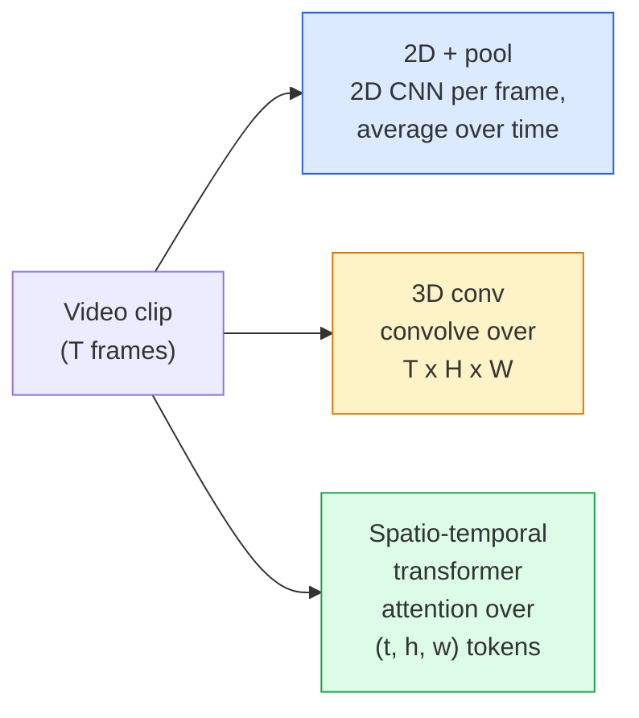

# Video Understanding — Temporal Modeling

> A video is a sequence of images plus the physics that connects them. Every video model either treats time as an extra axis (3D conv), a sequence to attend over (transformer), or a feature to extract once and pool (2D+pool).

**Type:** Learn + Build
**Languages:** Python
**Prerequisites:** Phase 4 Lesson 03 (CNNs), Phase 4 Lesson 04 (Image Classification)
**Time:** ~45 minutes

## Learning Objectives

- Distinguish 2D+pool, 3D conv, and spatio-temporal transformer approaches
- Implement frame sampling and a 2D+pool baseline classifier
- Explain I3D inflation and (2+1)D factorised convs
- Read Kinetics, UCF101, Something-Something metrics

## The Problem

A 30-second video at 30 fps is 900 images. When action is defined by motion itself ("pushing left to right"), looking at single frames fails.

## The Concept

### Three architectural families



### Frame sampling

- Uniform: pick T evenly across clip.
- Dense: random contiguous T-frame window.
- Multi-clip: sample multiple windows, average predictions.

## Build It

### Step 1: Frame sampler

```python
import numpy as np

def sample_uniform(num_frames_total, T):
    if num_frames_total <= T:
        return list(range(num_frames_total)) + [num_frames_total - 1] * (T - num_frames_total)
    step = num_frames_total / T
    return [int(i * step) for i in range(T)]

def sample_dense(num_frames_total, T, rng=None):
    rng = rng or np.random.default_rng()
    if num_frames_total <= T:
        return list(range(num_frames_total)) + [num_frames_total - 1] * (T - num_frames_total)
    start = int(rng.integers(0, num_frames_total - T + 1))
    return list(range(start, start + T))
```

### Step 2: 2D+pool baseline

```python
import torch
import torch.nn as nn
from torchvision.models import resnet18, ResNet18_Weights

class FramePool(nn.Module):
    def __init__(self, num_classes=400, pretrained=True):
        super().__init__()
        weights = ResNet18_Weights.IMAGENET1K_V1 if pretrained else None
        backbone = resnet18(weights=weights)
        self.features = nn.Sequential(*(list(backbone.children())[:-1]))
        self.head = nn.Linear(512, num_classes)

    def forward(self, x):
        N, T = x.shape[:2]
        x = x.view(N * T, *x.shape[2:])
        feats = self.features(x).view(N, T, -1)
        pooled = feats.mean(dim=1)
        return self.head(pooled)

model = FramePool(num_classes=10)
x = torch.randn(2, 8, 3, 224, 224)
print(f"output: {model(x).shape}")
```

### Step 3: I3D-style inflated 3D conv

```python
def inflate_2d_to_3d(conv2d, time_kernel=3):
    out_c, in_c, kh, kw = conv2d.weight.shape
    weight_3d = conv2d.weight.data.unsqueeze(2)
    weight_3d = weight_3d.repeat(1, 1, time_kernel, 1, 1) / time_kernel
    conv3d = nn.Conv3d(in_c, out_c, kernel_size=(time_kernel, kh, kw),
                        padding=(time_kernel // 2, conv2d.padding[0], conv2d.padding[1]),
                        stride=(1, conv2d.stride[0], conv2d.stride[1]),
                        bias=False)
    conv3d.weight.data = weight_3d
    return conv3d
```

### Step 4: Factorised (2+1)D conv

```python
class Conv2Plus1D(nn.Module):
    def __init__(self, in_c, out_c, kernel_size=3):
        super().__init__()
        mid_c = (in_c * out_c * kernel_size * kernel_size * kernel_size) \
                // (in_c * kernel_size * kernel_size + out_c * kernel_size)
        self.spatial = nn.Conv3d(in_c, mid_c, kernel_size=(1, kernel_size, kernel_size),
                                 padding=(0, kernel_size // 2, kernel_size // 2), bias=False)
        self.bn = nn.BatchNorm3d(mid_c)
        self.act = nn.ReLU(inplace=True)
        self.temporal = nn.Conv3d(mid_c, out_c, kernel_size=(kernel_size, 1, 1),
                                  padding=(kernel_size // 2, 0, 0), bias=False)

    def forward(self, x):
        return self.temporal(self.act(self.bn(self.spatial(x))))
```

## Use It

- `torchvision.models.video` — R(2+1)D, MViT, Swin3D
- `pytorchvideo` — model zoo, data loaders for Kinetics/SSv2/AVA

## Ship It

- `outputs/prompt-video-architecture-picker.md`
- `outputs/skill-frame-sampler-auditor.md`

## Exercises

1. **(Easy)** Compute FLOPs for FramePool vs 3D ResNet.
2. **(Medium)** Generate synthetic motion dataset; show FramePool fails.
3. **(Hard)** Build R(2+1)D-18; train on motion dataset to beat FramePool.

## Key Terms

## Further Reading

- [I3D (Carreira & Zisserman, 2017)](https://arxiv.org/abs/1705.07750)
- [R(2+1)D (Tran et al., 2018)](https://arxiv.org/abs/1711.11248)
- [TimeSformer (Bertasius et al., 2021)](https://arxiv.org/abs/2102.05095)

[Reference](https://github.com/rohitg00/ai-engineering-from-scratch/tree/main/phases/04-computer-vision/12-video-understanding)
