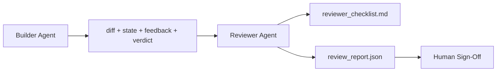
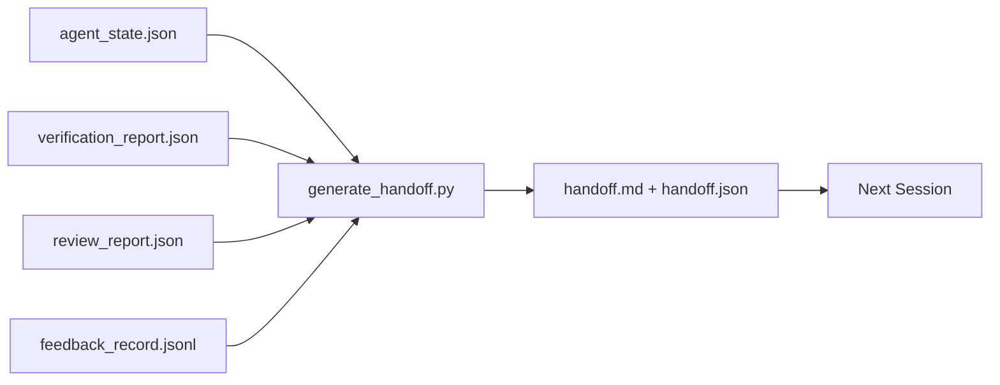
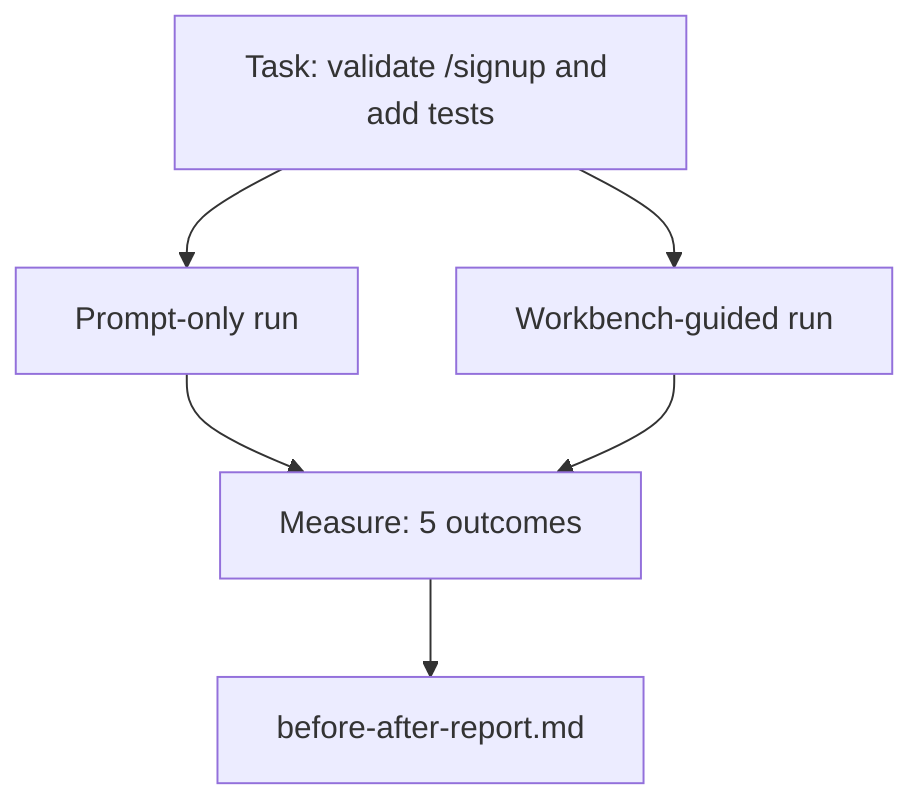
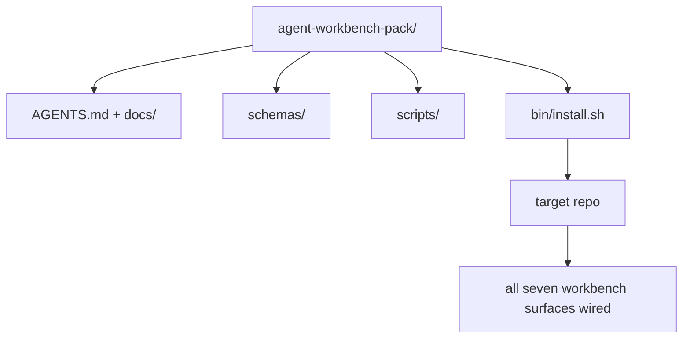

# Reviewer, Handoff & Workbench Capstone

> Combined lessons (4 parts), merged verbatim — no content removed.

**Type:** Combined

---

## Part 1 (ch308): Reviewer Agent: Separate Builder from Marker

> The agent that wrote the code cannot grade it. A reviewer is a second loop with a different system prompt, a different goal, and read-only access to everything the builder produced. The gap between builder and reviewer is where most reliability lives.

**Type:** Build
**Languages:** Python (stdlib)
**Prerequisites:** Phase 14 · 38 (Verification Gate)
**Time:** ~55 minutes

## Learning Objectives

- State why the same agent cannot reliably review its own work.
- Build a reviewer agent loop that consumes builder artifacts and emits a structured review report.
- Author a reviewer rubric that grades specific dimensions, not vibes.
- Wire the reviewer into the workbench so the human review step starts from a real artifact.

## The Problem

You ask the agent to fix a bug. It edits four files, runs the tests, and reports done. The verification gate confirms acceptance ran and scope held. The gate says `passed: true`. You merge. Two days later you find that the fix solved the wrong half of the bug.

Acceptance is necessary, not sufficient. The reviewer asks the questions acceptance cannot ask: did this solve the right problem? Did it expand scope without flagging it? Did it document assumptions that should have been questioned?

## The Concept



### Reviewer rubric

Five dimensions, each scored 0 to 2.

| Dimension | Question |
|-----------|----------|
| Problem fit | Did the change solve the task as stated, not a nearby task? |
| Scope discipline | Were edits confined to the contract or was the contract grown deliberately? |
| Assumptions | Are all hidden assumptions written down somewhere reviewable? |
| Verification quality | Does the acceptance command actually prove the goal? |
| Handoff readiness | Could the next session pick up cleanly from the current state? |

Total out of 10. A run below 7 is a soft fail; a run below 5 is a hard fail.

### The reviewer is a separate role, not a separate model

Same model, different system prompt, different inputs, no write access to the diff.

### The reviewer cannot edit the diff

If the report says "fix this," the next builder turn does the fix; the reviewer goes back to reviewing.

### Reviewer rubric versus verification gate

The gate checks deterministic facts. The reviewer makes qualitative judgments. Both are required.

## Build It

`code/main.py` implements:

- A `ReviewerInputs` dataclass bundling the artifacts.
- A rubric scorer with one function per dimension.
- A `review_report.json` writer with the five scores, total, and verdict.
- Two demo cases: a clean change and a "right tests, wrong problem" change.

```
python3 code/main.py
```

## Production patterns in the wild

Cloudflare's April 2026 AI Code Review system ran 131,246 review runs across 48,095 merge requests in 5,169 repos in 30 days. Median review completed in 3 minutes 39 seconds. Up to seven specialist reviewers ran in parallel under a Review Coordinator.

**Specialist pool, not one big reviewer.** Once the codebase has security-critical, performance-critical, and docs surfaces, split into specialists with smaller prompts.

**Bias mitigation as design requirement.** Four reliable biases: position bias, verbosity bias, self-preference, authority. Mitigations: evaluate both orderings, use 1-4 scales rewarding conciseness, rotate judges across model families, strip author names.

**Calibration set, not vibes.** A 10-20 task historical set with known correct verdicts. Run the reviewer over it on every prompt change.

**Hybrid norm with the gate.** Gate handles deterministic checks; reviewer handles semantic checks.

## Use It

- **Claude Code subagents.** A reviewer subagent runs after the builder closes a task.
- **OpenAI Agents SDK handoffs.** Builder hands off to Reviewer on task completion.
- **Two-model pairing.** Builder on a faster cheaper model. Reviewer on a stronger model.

## Ship It

`outputs/skill-reviewer-agent.md` generates a project-specific reviewer rubric, a reviewer agent stub, and an integration with the verification gate.

## Exercises

1. Add a sixth dimension specific to your product domain. Defend why it is not absorbed by the existing five.
2. Run the reviewer with two different system prompts (terse, verbose). Which produces a report a human is more likely to read?
3. Add a `confidence` field per dimension. Refuse to ship the report when confidence in the lowest dimension is below 0.6.
4. Build a calibration set: 10 historical task close-outs with known correct verdicts.
5. Add a "request more evidence" affordance: the reviewer can ask the builder for a specific test run before scoring.

## Key Terms

| Term | What people say | What it actually means |
|------|----------------|------------------------|
| Reviewer rubric | "Checklist" | Five-dimension 0-2 scoring with a written question per dimension |
| Soft fail | "Needs revisions" | Total below 7; builder gets findings to address |
| Hard fail | "Reject" | Total below 5 or any dimension at 0; halt and surface to human |
| Role separation | "Different prompt" | Same model can be both roles; the discipline is inputs and posture |
| Confidence floor | "Don't ship low-signal reports" | Refuse to emit a verdict when the rubric is uncertain |

## Further Reading

- [OpenAI Agents SDK handoffs](https://platform.openai.com/docs/guides/agents-sdk/handoffs)
- [Anthropic Claude Code subagents](https://docs.anthropic.com/en/docs/agents-and-tools/claude-code/sub-agents)
- [Cloudflare, Orchestrating AI Code Review at Scale](https://blog.cloudflare.com/ai-code-review/)
- [Agent-as-a-Judge: Evaluating Agents with Agents (OpenReview / ICLR)](https://openreview.net/forum?id=DeVm3YUnpj)
- [Adnan Masood, Rubric-Based Evaluations and LLM-as-a-Judge](https://medium.com/@adnanmasood/rubric-based-evals-llm-as-a-judge-methodologies-and-empirical-validation-in-domain-context-71936b989e80)
- [MLflow, LLM-as-a-Judge Evaluation](https://mlflow.org/llm-as-a-judge)
- [LangChain, How to Calibrate LLM-as-a-Judge with Human Corrections](https://www.langchain.com/articles/llm-as-a-judge)
- [Evidently AI, LLM-as-a-judge: a complete guide](https://www.evidentlyai.com/llm-guide/llm-as-a-judge)
- [Arize, LLM as a Judge — Primer and Pre-Built Evaluators](https://arize.com/llm-as-a-judge/)
- Phase 14 · 05 — Self-Refine and CRITIC
- Phase 14 · 30 — Eval-driven agent development
- Phase 14 · 38 — the verification gate the reviewer reads
- Phase 14 · 40 — the handoff packet the reviewer report feeds

[Reference](https://github.com/rohitg00/ai-engineering-from-scratch/tree/main/phases/14-agent-engineering/39-reviewer-agent)

---

## Part 2 (ch309): Multi-Session Handoff

> The session is going to end. The work is not. The handoff packet is the artifact that turns "the agent worked for an hour" into "the next session is productive in the first minute." Build it on purpose, not as an afterthought.

**Type:** Build
**Languages:** Python (stdlib)
**Prerequisites:** Phase 14 · 34 (Repo Memory), Phase 14 · 38 (Verification), Phase 14 · 39 (Reviewer)
**Time:** ~50 minutes

## Learning Objectives

- Identify the seven fields every handoff packet needs.
- Generate a handoff from the workbench artifacts without hand-writing prose.
- Trim large feedback logs into a handoff-sized summary.
- Make the next session's first action deterministic.

## The Problem

The session ends. The agent says "great, we made progress." The next session opens. The next agent asks "where did we leave off?" The first agent's answer is gone. The next agent rediscovers, re-runs the same commands, re-asks the human the same questions, and burns thirty minutes recovering the last thirty seconds of the previous session.

The cost of a bad handoff is paid every session for the life of the task. The fix is a packet generated automatically at session end.

## The Concept



### Seven fields every handoff carries

| Field | Question it answers |
|-------|---------------------|
| `summary` | One paragraph of what was done |
| `changed_files` | The diff at a glance |
| `commands_run` | What was actually executed |
| `failed_attempts` | What was tried and why it did not work |
| `open_risks` | What could bite next session, with severity |
| `next_action` | The first concrete step next session takes |
| `verdict_pointer` | Path to the verification + review reports |

### Leave a clean state

A perfect `handoff.md` is worthless if the next session opens to a half-applied diff, temp files, a stray branch, and tests that error before they even run.

| Check | Clean means |
|-------|-------------|
| Working tree | Every change committed or explicitly stashed with a note |
| Temp artifacts | No `*.tmp`, scratch dirs, debug prints, or commented-out blocks |
| Tests | Green, or red with the failure named in `open_risks` |
| Feature board | `feature_list.json` status reflects reality |
| Branch | On the expected branch, no detached HEAD |

## Build It

`code/main.py` implements:

- A loader that gathers state, verdict, review, and feedback into a `WorkbenchSnapshot`.
- A `generate_handoff(snapshot) -> (markdown, payload)` function.
- A filter that picks the last K feedback entries plus all non-zero exits.

```
python3 code/main.py
```

## Production patterns in the wild

**Compaction strategies vary; the packet schema does not.** Codex CLI, Claude Code, and OpenCode each ship different compaction. The packet is the portable artifact.

**Fresh-session handoff is not compaction.** Compaction extends a session; handoff closes one cleanly and starts the next.

**One active handoff per branch and topic.** Include `branch`, `last_known_good_commit`, and a `status` of `active | superseded | archived`.

**Wrap up before 50-75% context, not at the wall.** Cheap to write while context is intact; expensive when the model is already losing its place.

## Use It

- **Session-end hook.** The runtime fires the generator when the user closes the chat.
- **PR template.** The generator's markdown is also a PR body.
- **Cross-agent handoff.** Build with one product, continue with another.

## Ship It

`outputs/skill-handoff-generator.md` produces a generator tuned to a project's artifact paths, an end-of-session hook, and a `handoff.json` schema.

## Exercises

1. Add an `assumptions_to_validate` field that surfaces every assumption the builder logged but the reviewer did not score above 1.
2. Trim the feedback summary differently for failing runs versus passing ones. Defend the asymmetry.
3. Include a "questions for the human" list.
4. Make the generator idempotent: running it twice produces the same packet.
5. Add a "next session prereqs" section listing exactly the artifacts the next session must load.

## Key Terms

| Term | What people say | What it actually means |
|------|----------------|------------------------|
| Handoff packet | "Session summary" | Generated artifact carrying the seven fields, both markdown and JSON |
| Next action | "What to do first" | The one concrete step that starts the next session |
| Feedback trim | "Log summary" | Last K records plus every non-zero exit |
| Status report | "What we did" | A document missing `next_action`; useful, but not a handoff |
| Verdict pointer | "Receipt" | Path to the verification + review reports for traceability |

## Further Reading

- [Anthropic, Effective harnesses for long-running agents](https://www.anthropic.com/engineering/effective-harnesses-for-long-running-agents)
- [OpenAI Agents SDK handoffs](https://platform.openai.com/docs/guides/agents-sdk/handoffs)
- [Codex Blog, Codex CLI Context Compaction](https://codex.danielvaughan.com/2026/03/31/codex-cli-context-compaction-architecture/)
- [Justin3go, Shedding Heavy Memories: Context Compaction in Codex, Claude Code, OpenCode](https://justin3go.com/en/posts/2026/04/09-context-compaction-in-codex-claude-code-and-opencode)
- [JD Hodges, Claude Handoff Prompt (2026)](https://www.jdhodges.com/blog/ai-session-handoffs-keep-context-across-conversations/)
- [Mervin Praison, Managing Handoffs in Multi-Agent Coding Sessions](https://mer.vin/2026/04/managing-handoffs-in-multi-agent-coding-sessions-fresh-context-without-losing-continuity/)
- [Hermes Issue #20372](https://github.com/NousResearch/hermes-agent/issues/20372)
- [Hermes Issue #499](https://github.com/NousResearch/hermes-agent/issues/499)
- [Microsoft Agent Framework, Compaction](https://learn.microsoft.com/en-us/agent-framework/agents/conversations/compaction)
- [OpenCode, Context Management and Compaction](https://deepwiki.com/sst/opencode/2.4-context-management-and-compaction)
- [LangChain, Context Engineering for Agents](https://www.langchain.com/blog/context-engineering-for-agents)
- Phase 14 · 34 — the state file the generator reads
- Phase 14 · 38 — the verification verdict the packet points at
- Phase 14 · 39 — the reviewer report bundled into the packet

[Reference](https://github.com/rohitg00/ai-engineering-from-scratch/tree/main/phases/14-agent-engineering/40-multi-session-handoff)

---

## Part 3 (ch310): The Workbench on a Real Repo

> Eleven lessons of surfaces are worth nothing if they do not survive contact with a real codebase. This lesson runs the same task twice on a small sample app: prompt-only versus workbench-guided. The numbers do the arguing.

**Type:** Build
**Languages:** Python (stdlib)
**Prerequisites:** Phases 14 · 32 to 14 · 40
**Time:** ~60 minutes

## Learning Objectives

- Bring the seven workbench surfaces together on a small application.
- Run the same task twice (prompt-only and workbench-guided) and measure five outcomes.
- Read the before/after report and decide which surfaces gave the most leverage.
- Defend the workbench against a "but my model is good enough" pushback.

## The Problem

A demo on a toy task convinces no one. The case for the workbench is made when a real-feeling task on a real-feeling repo lands in production with fewer failures, fewer reverts, and a packet the next session can use.

## The Concept



### The task

> Add input validation to `/signup`: reject passwords shorter than 8 characters, return 422 with a typed error envelope. Add a test that proves the new behavior.

### The two pipelines

Prompt-only: read README → read `app.py` → edit files → claim done.

Workbench-guided: run init script → read scope contract → read state → edit allowed files → run acceptance via feedback runner → run verification gate → run reviewer → generate handoff.

### The five outcomes measured

| Outcome | Why it matters |
|---------|----------------|
| `tests_actually_run` | Most "tests passed" claims are unverifiable |
| `acceptance_met` | The test that proves the goal must be the test that ran |
| `files_outside_scope` | Scope creep is the dominant silent failure |
| `handoff_quality` | The next session pays for or benefits from this |
| `reviewer_total` | Qualitative judgment on top of the gate |

## Build It

`code/main.py` orchestrates the two pipelines against the same sample app fixture. Both pipelines are scripted so the measurement is reproducible.

```
python3 code/main.py
```

## Production patterns in the wild

**Terminal Bench Top-30 to Top-5 on the same model.** A coding agent jumped from outside the top 30 to rank five on Terminal Bench 2.0 by changing only the harness. Same model. Different surfaces.

**Vercel 80% to 100% by deleting tools.** Deleting 80% of the agent's tools moved the success rate from 80% to 100%. Negative space wins.

**Harvey 2x accuracy via harness alone.** Legal agents more than doubled their accuracy through harness optimization, no model change.

**88% of enterprise AI agent projects fail to reach production.** Traced to runtime, not reasoning: stale state, brittle retries, overgrown context.

**Long-context collapse.** WebAgent baseline 40-50% success drops to under 10% in long-context conditions.

**False negatives still exist.** Single-step factual tasks, one-line lints, formatter runs — these run faster prompt-only. Enumerate them honestly.

## Use It

This lesson is the case file you cite when someone asks why every PR carries an `agent-rules.md` and a scope contract, or when a team wants to drop the verification gate "just for this sprint."

## Ship It

`outputs/skill-workbench-benchmark.md` is a portable evaluation harness that runs any agent product through both pipelines against a project's own sample app.

## Exercises

1. Add a sixth outcome: time-to-first-meaningful-edit. How do you measure it cleanly?
2. Run the comparison on a real second-day task in your codebase. Where do the workbench numbers slip?
3. Add a "false negative" pass: tasks where prompt-only would have been faster.
4. Replace the scripted "agent" with a real LLM call. Which outcomes get noisier?
5. Author a one-page summary aimed at a non-engineer. What survives the cut?

## Key Terms

| Term | What people say | What it actually means |
|------|----------------|------------------------|
| Sample app | "Toy repo" | Small but realistic enough to exercise all seven surfaces |
| Pipeline | "Workflow" | Ordered sequence of surface reads/writes the agent follows |
| Before/after report | "The receipts" | The artifact you hand to a skeptic |
| False negative | "Workbench overkill" | Tasks where prompt-only is faster |
| Workbench benchmark | "Reliability score" | Portable harness that runs the comparison on your codebase |

## Further Reading

- [LangChain, The Anatomy of an Agent Harness](https://blog.langchain.com/the-anatomy-of-an-agent-harness/)
- [MongoDB, The Agent Harness: Why the LLM Is the Smallest Part of Your Agent System](https://www.mongodb.com/company/blog/technical/agent-harness-why-llm-is-smallest-part-of-your-agent-system)
- [preprints.org, Harness Engineering for Language Agents](https://www.preprints.org/manuscript/202603.1756)
- [HN: Improving 15 LLMs at Coding in One Afternoon](https://news.ycombinator.com/item?id=46988596)
- [Cloudflare, Orchestrating AI Code Review at Scale](https://blog.cloudflare.com/ai-code-review/)
- [Anthropic, Building Effective Agents](https://www.anthropic.com/research/building-effective-agents)
- Phases 14 · 32 to 14 · 40 — the surfaces this lesson exercises end-to-end
- Phase 14 · 19 — SWE-bench, GAIA, AgentBench
- Phase 14 · 30 — eval-driven agent development

[Reference](https://github.com/rohitg00/ai-engineering-from-scratch/tree/main/phases/14-agent-engineering/41-workbench-for-real-repos)

---

## Part 4 (ch311): Capstone: Ship a Reusable Agent Workbench Pack

> The mini-track ends with a pack you drop into any repo. Eleven lessons of surfaces compressed into a directory you can `cp -r` and have an agent working reliably the next morning. The capstone is the artifact this curriculum trades on.

**Type:** Build
**Languages:** Python (stdlib)
**Prerequisites:** Phases 14 · 31 to 14 · 41
**Time:** ~75 minutes

## Learning Objectives

- Package the seven workbench surfaces into one drop-in directory.
- Pin the schemas, scripts, and templates so a new repo gets a known-good baseline.
- Add a single installer script that lays down the pack idempotently.
- Decide what stays in the pack and what stays out, defending the cut for each.

## The Problem

A workbench that lives in a Google Doc, a chat history, and three half-remembered scripts is a workbench that gets rebuilt every quarter. The cure is a versioned pack: a repo or directory with the surfaces, the schemas, the scripts, and a one-command installer.

## The Concept



### The pack layout

```
outputs/agent-workbench-pack/
├── AGENTS.md
├── docs/
│   ├── agent-rules.md
│   ├── reliability-policy.md
│   ├── handoff-protocol.md
│   └── reviewer-rubric.md
├── schemas/
│   ├── agent_state.schema.json
│   ├── task_board.schema.json
│   └── scope_contract.schema.json
├── scripts/
│   ├── init_agent.py
│   ├── run_with_feedback.py
│   ├── verify_agent.py
│   └── generate_handoff.py
├── bin/
│   └── install.sh
└── README.md
```

### The installer

A short `bin/install.sh` (or `bin/install.py`):

1. Refuses to install over an existing pack without `--force`.
2. Copies the pack into the target repo.
3. Wires up CI if a `.github/workflows/` exists.
4. Prints next steps.

### Versioning

The pack carries a `VERSION` file. Schema bumps and script changes that require migrations bump the major. Doc-only changes bump the patch.

## Build It

`code/main.py` assembles the pack into `outputs/agent-workbench-pack/`, seeded with the schemas and scripts from the previous lessons.

```
python3 code/main.py
```

## Production patterns in the wild

**`VERSION` is the contract, not the marketing.** Major bumps require a state migration. Minor bumps require a checker re-run.

**Single source for cross-tool distribution.** The installer emits symlinks (`ln -s AGENTS.md CLAUDE.md`) so a single source of truth fans out to every coding agent.

**`uninstall.sh` that refuses on non-trivial state.** Removes schemas, scripts, docs, and `AGENTS.md` but refuses to proceed if state files have any uncommitted changes.

**Skill-as-publishable. SkillKit-style distribution.** The pack ships as a SkillKit skill: `skillkit install agent-workbench-pack` lays it down across 32 AI agents from a single source.

## Use It

Three places the pack ships:

- **As a directory you drop into a repo.** `cp -r outputs/agent-workbench-pack /path/to/repo`.
- **As a public template repo.** Fork-and-customize, with `VERSION` controlling drift.
- **As a SkillKit skill.** Wired into your agent product so a single command lays it down.

## Ship It

`outputs/skill-workbench-pack.md` generates a project-tuned pack: rules sharpened to the team's history, scope globs matched to the repo, rubric dimensions extended with one domain-specific entry.

## Exercises

1. Decide which optional fifth doc deserves promotion into the canonical pack. Defend the cut.
2. Rewrite the installer as Python with a `--dry-run` flag. Compare ergonomics against bash.
3. Add a `bin/uninstall.sh` that safely removes the pack and refuses if state files have non-trivial history.
4. Add a `lint_pack.py` that fails when the pack drifts from `VERSION`. Wire it into CI.
5. Author the migration runbook from a hand-rolled workbench to this pack.

## Key Terms

| Term | What people say | What it actually means |
|------|----------------|------------------------|
| Workbench pack | "The starter kit" | A versioned directory carrying all seven surfaces |
| Installer | "Setup script" | `bin/install.sh` that lays the pack down idempotently |
| Pack version | "VERSION" | Major bumps for schema/script changes, patch for doc-only |
| Drop-in pack | "cp -r and go" | Pack works without per-repo customization on day one |
| Forkable template | "GitHub template" | Public repo that GitHub's "Use this template" can clone from |

## Further Reading

- Phases 14 · 31 to 14 · 41 — every surface this pack bundles
- [SkillKit](https://github.com/rohitg00/skillkit)
- [Nx Blog, Teach Your AI Agent How to Work in a Monorepo](https://nx.dev/blog/nx-ai-agent-skills)
- [agents.md — the open spec](https://agents.md/)
- [HKUDS/OpenHarness](https://github.com/HKUDS/OpenHarness)
- [andrewgarst/agentic_harness](https://github.com/andrewgarst/agentic_harness)
- [Augment Code, A good AGENTS.md is a model upgrade](https://www.augmentcode.com/blog/how-to-write-good-agents-dot-md-files)
- [Anthropic, Effective harnesses for long-running agents](https://www.anthropic.com/engineering/effective-harnesses-for-long-running-agents)
- [Anthropic, Harness design for long-running application development](https://www.anthropic.com/engineering/harness-design-long-running-apps)
- Phase 14 · 30 — eval-driven agent development
- Phase 14 · 41 — the before/after benchmark this pack improves on

[Reference](https://github.com/rohitg00/ai-engineering-from-scratch/tree/main/phases/14-agent-engineering/42-agent-workbench-capstone)
