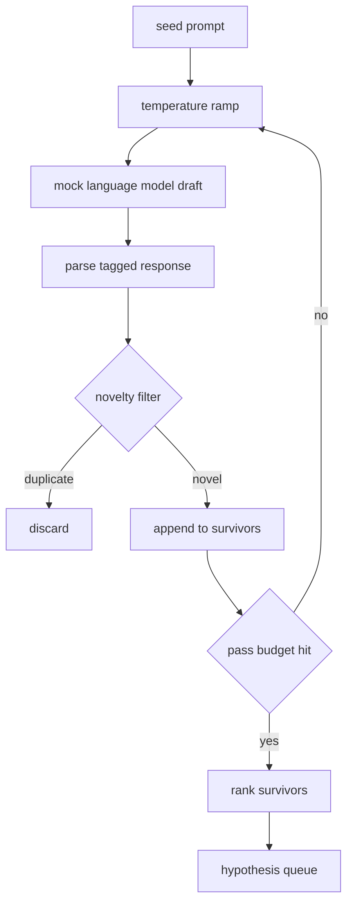
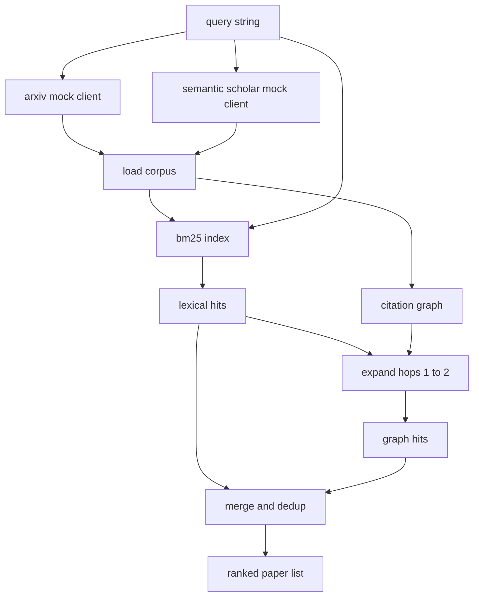
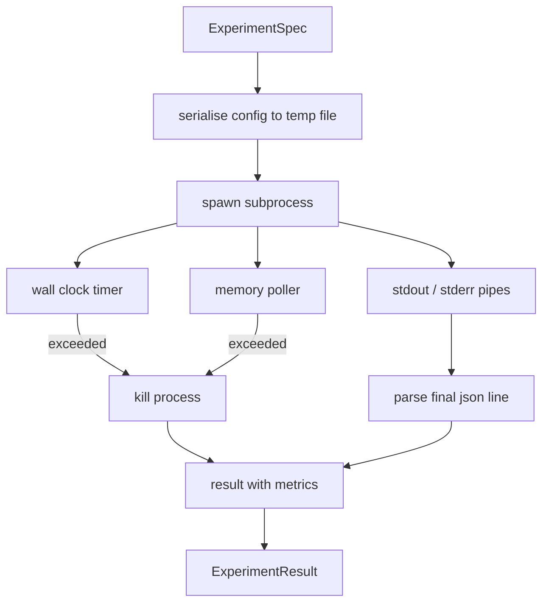
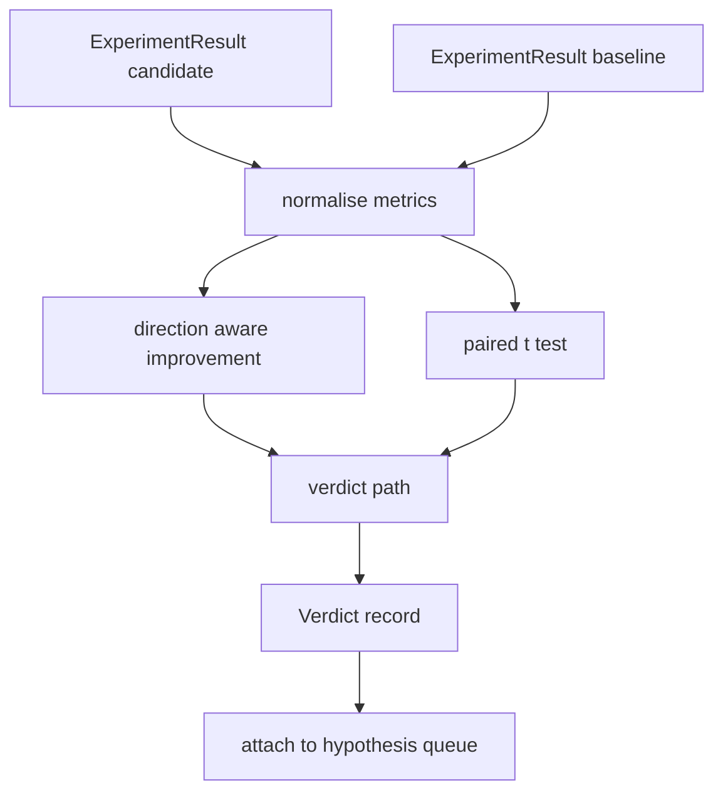
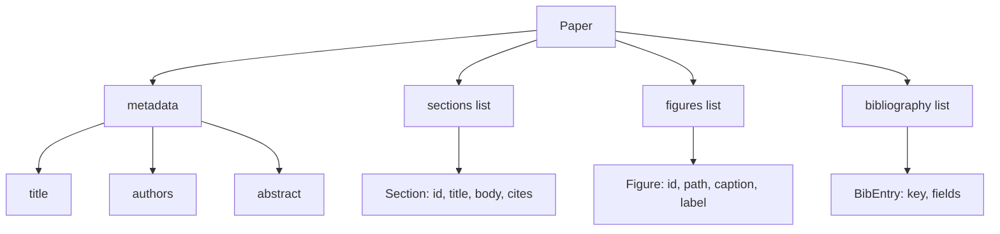
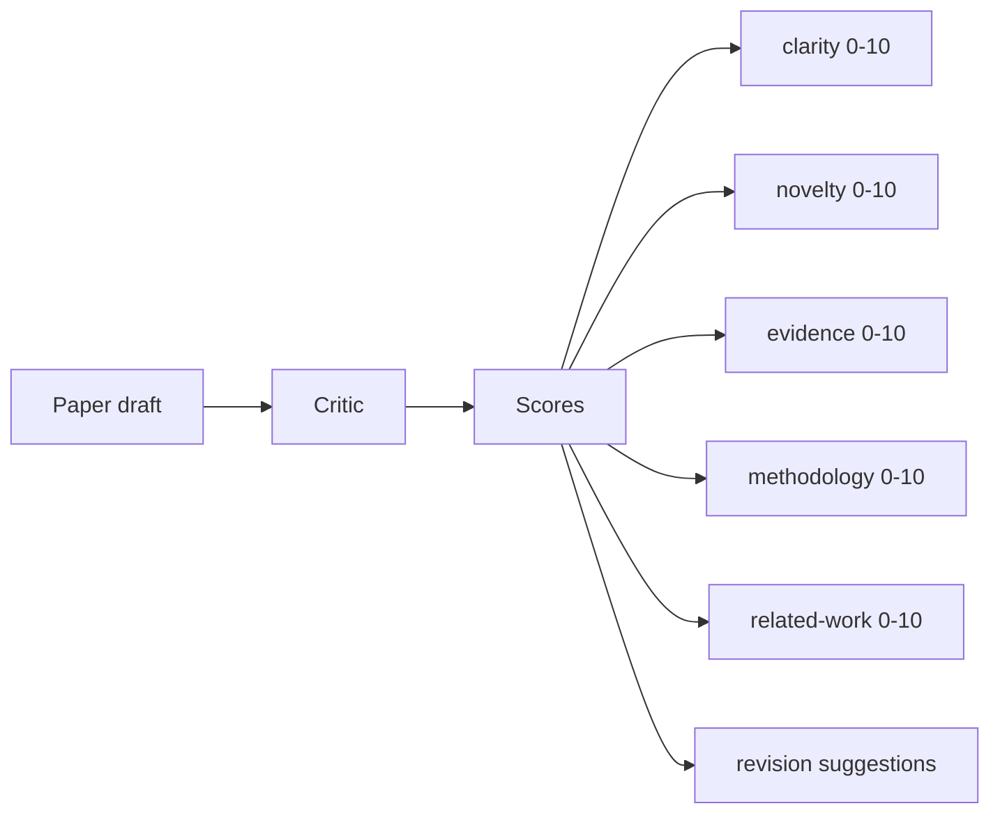
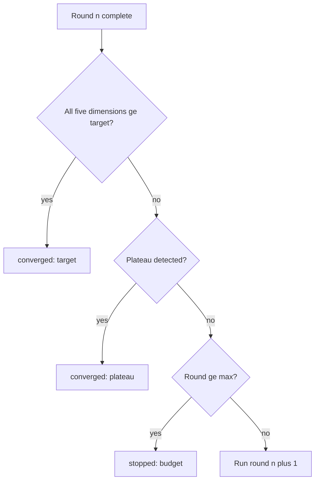
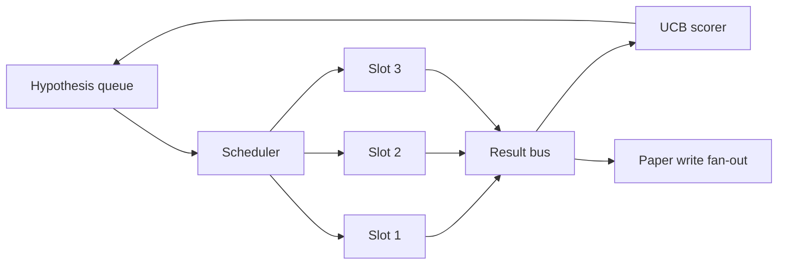

# Autonomous Research Agent: Full Build

> Combined lessons (9 parts), merged verbatim — no content removed.

**Type:** Combined

---

## Part 1 (ch421): Autonomous Research Agent (AI-Scientist Class)

> Sakana's AI-Scientist-v2 published full papers. Agent Laboratory ran the experiments. Allen AI shared traces. The 2026 shape is plan-execute-verify tree search over experiments, budgeted cost, sandboxed code execution, a vision-feedback LaTeX writer, and an automated NeurIPS-style reviewer ensemble. The capstone is to build one, run it end to end within $30 per paper, and survive the sandbox-escape red team that Sakana documented.

**Type:** Capstone
**Languages:** Python (agent + sandbox), LaTeX (output)
**Prerequisites:** Phase 2 (ML), Phase 3 (deep learning), Phase 7 (transformers), Phase 10 (LLMs from scratch), Phase 14 (agents), Phase 15 (autonomous), Phase 16 (multi-agent), Phase 18 (safety)
**Time:** 40 hours

## Problem

Autonomous research agents crossed a threshold in 2026. Sakana AI's AI-Scientist-v2 was published in Nature with generated papers that cleared workshop peer review. ShinkaEvolve (ICLR 2026) extended the line to evolving hypotheses. AMD's Agent Laboratory shipped reproducible traces. The agents are not magic — they are a plan-execute-verify loop running over a tree of candidate experiments, with cost caps, seed-bound sandboxes, and automated review. The craft is in the loop, the budget, and the safety story.

You learn the loop by implementing one against a seed idea in a narrow domain (for example, attention-sparsity ablations on a 100M-parameter transformer). The value is not in discovering something new on the first run. The value is in the infrastructure: the tree-search, the experiment sandbox, the writer-reviewer loop, the red-team report. The Sakana team documented sandbox-escape failures; your agent must pass the same red team.

## Concept

The agent is a best-first tree search. Nodes are experiment specifications: (hypothesis, config, code, expected outcome). An expand step proposes children with small edits (swap optimizer, shift batch size, ablate a component). Each child runs in a fresh sandbox with a hard resource cap. Results feed back into a scoring function that ranks nodes by (novelty × quality × remaining budget). The tree grows until budget is exhausted, then the best branch is written up.

The writer is multimodal. It generates a LaTeX draft, compiles it, renders figures, and feeds the rendered PDF back into Claude Opus 4.7's vision mode for critique on layout, figure legibility, and claim-evidence alignment. A reviewer ensemble of five LLM judges emits NeurIPS-style scores (novelty, rigor, clarity, reproducibility, impact); if the average drops below threshold, the paper returns to the writer with critique.

Safety is load-bearing. Every experiment runs in an E2B or Daytona sandbox with no network egress, bounded wall-clock, and pinned resource limits. The agent's code-generation step passes through a policy layer that blocks syscalls that escape the sandbox. The red-team report reproduces the Sakana-documented attack surface (fork bombs, filesystem escapes, LLM-written network calls).

## Architecture

```mermaid
graph TD
    seed[seed idea + domain] --> lit[literature search (Semantic Scholar + OpenAlex)]
    lit --> graph[LangGraph plan-execute-verify tree]
    graph --> expand[expand node]
    expand --> child1[child_1]
    expand --> childk[child_k]
    child1 --> sandbox1[sandbox (E2B / Daytona)]
    childk --> sandboxk[sandbox (E2B / Daytona)]
    sandbox1 --> score[score nodes by novelty, quality, budget]
    sandboxk --> score
    score --> writer[best branch -> LaTeX writer]
    writer --> vision[compile + vision critique (Opus 4.7)]
    vision --> review[reviewer ensemble (5 LLM judges)]
    review --> output[paper.pdf + review.md + trace.json]
```

## Stack

- Orchestration: LangGraph with checkpointing and human-approval gates
- Tree search: custom best-first over experiment nodes (AB-MCTS-style from Sakana v2)
- Sandbox: E2B per experiment, Docker-in-Docker fallback; resource caps via cgroups
- Literature: Semantic Scholar Graph API + OpenAlex + local FAISS cache of abstracts
- Writer: LaTeX template + Claude Opus 4.7 (vision mode) for figure critique and layout
- Reviewer: ensemble of 5 judges (Opus 4.7, GPT-5.4, Gemini 3 Pro, DeepSeek R1, Qwen3-Max) with weighted aggregation
- Experiment framework: PyTorch 2.5 for the physical experiments, W&B for logging
- Observability: Langfuse for agent traces, $30 hard budget per paper

## Build It

1. **Seed and domain scoping.** Take a seed idea (e.g., "investigate sparsity patterns in attention maps of sub-1B transformers"). Define the search space: models, datasets, compute budget.

2. **Literature pass.** Query Semantic Scholar + OpenAlex for 50 most-cited relevant papers; cache abstracts locally; generate a 1-page domain digest.

3. **Tree scaffolding.** Initialize the root with the seed hypothesis. Implement `expand(node) -> children` with small-edit proposals (one config change per child). Implement `score(node)` as a weighted novelty × quality × budget term.

4. **Sandbox wrapping.** Every experiment runs `docker run --network=none --memory=8g --cpus=2 --pids-limit=256 --read-only` (or the equivalent E2B policy). Seeds are written to the sandbox; outputs are mounted read-only back out.

5. **Plan-execute-verify loop.** `plan` proposes children. `execute` runs the sandbox, captures logs and metrics. `verify` runs unit checks on metrics (did the loss decrease? did the ablation isolate the effect?). Failed nodes get a failure reason stored on the tree.

6. **Writer.** After budget, select the best branch. Render figures with matplotlib. Generate a LaTeX draft via Claude Opus 4.7 with the branch trace in context. Compile. Feed the compiled PDF back to Opus 4.7 vision for critique. Iterate.

7. **Reviewer ensemble.** Five judges score the draft on (novelty, rigor, clarity, reproducibility, impact) with NeurIPS-style rubrics. If mean < 4.0/5, return to writer with critique. Hard stop after 3 rewrites.

8. **Red team.** Build or integrate a set of adversarial tasks targeting the sandbox: fork bombs, network exfiltration attempts, filesystem escapes, LLM-written shell metacharacters. Confirm all are blocked. Write up findings.

9. **Reproducibility.** Every paper ships with its tree-search trace JSON, seeds, W&B run links, sandbox configs, and a README reproducing it end to end.

## Use It

```console
$ ai-scientist run --seed "attention sparsity in sub-1B transformers" --budget 30
[lit]    50 papers, digest in 12s
[tree]   expanded 8 nodes, budget 12/30
[exec]   node #3 sparsity=top-8, loss=2.83 (best so far)
[exec]   node #6 sparsity=top-4, loss=3.12 (worse)
[exec]   ...
[tree]   chose branch rooted at node #3 (novelty 0.62, quality 0.81)
[write]  LaTeX draft v1 complete
[vision] critique: figure 2 legend too small, claim-evidence ok
[write]  draft v2 after 3 edits
[review] mean 4.2/5 (novelty 3.9, rigor 4.3, clarity 4.1, repro 4.5, impact 4.2)
[done]   paper.pdf + review.md + trace.json     $28.40 spent
```

## Ship It

`outputs/skill-ai-scientist.md` is the deliverable. Given a seed idea + a domain + a $30 budget, it runs the full pipeline and emits a reviewable paper plus a reproducibility bundle.

| Weight | Criterion | How it is measured |
|:-:|---|---|
| 25 | Paper quality | Blind rubric review against published workshop papers |
| 20 | Experimental rigor | Baselines, seeds, ablations; every claim backed by a cell in the results table |
| 20 | Cost and compute discipline | $30/paper ceiling enforced, Langfuse-traced |
| 20 | Safety | Sandbox red team passes; network policy and kill-switch verified |
| 15 | Reproducibility | One-command rerun with identical seeds reproduces the paper |
| **100** | | |

## Exercises

1. Run the pipeline against three different seed ideas in the same domain. Compare which parts of the tree-search overlap. Identify duplicated wasted compute.

2. Add a human-in-the-loop gate before experiment execution for nodes estimated above $5. Measure how much total cost drops.

3. Swap the reviewer ensemble for a single judge. Measure the false-accept rate on a held-out set of known-bad papers.

4. Introduce a network-exfiltration red team test: agent writes code that tries to `curl` an external address. Confirm the `--network=none` policy blocks it. Log the attempt.

5. Compare your tree-search with a flat random baseline (same budget, no expansion strategy). Report the novelty × quality gain.

## Key Terms

| Term | What people say | What it actually means |
|------|-----------------|------------------------|
| Tree search | "AB-MCTS-style expansion" | Best-first exploration over experiment nodes with a novelty×quality×budget score |
| Sandbox | "Experiment isolation" | Container with no network, bounded CPU/memory, pinned seeds, read-only inputs |
| Vision critique | "Render-then-read" | Compile the paper to PDF, feed the PDF back to a VLM for layout and claim-evidence critique |
| Reviewer ensemble | "Automated peer review" | Multiple LLM judges scoring the paper with a NeurIPS rubric; weighted aggregate gates the pipeline |
| Novelty score | "Is this new?" | Heuristic that penalizes proximity to the 50-paper literature cache |
| Cost ceiling | "$ budget" | Hard cap on total spend per paper; Langfuse counters + pre-run estimates |
| Red team | "Sandbox-escape audit" | Adversarial tasks that would escape the sandbox if the policy is wrong |

## Further Reading

- [Sakana AI-Scientist-v2 repository](https://github.com/SakanaAI/AI-Scientist-v2)
- [Sakana AI-Scientist-v1 paper (arXiv:2408.06292)](https://arxiv.org/abs/2408.06292)
- [ShinkaEvolve (Sakana ICLR 2026)](https://sakana.ai)
- [Agent Laboratory (AMD)](https://github.com/SamuelSchmidgall/AgentLaboratory)
- [LangGraph documentation](https://langchain-ai.github.io/langraph/)
- [Semantic Scholar Graph API](https://api.semanticscholar.org/)
- [E2B sandboxes](https://e2b.dev)
- [NeurIPS reviewer guidelines](https://neurips.cc/Conferences/2026/Reviewer-Guidelines)

[Reference](https://github.com/rohitg00/ai-engineering-from-scratch/tree/main/phases/19-capstone-projects/05-autonomous-research-agent)

---

## Part 2 (ch464): Hypothesis Generator

> A research agent that asks the same question twice is wasting tokens. The trick is forcing each draft to land somewhere new.

**Type:** Build
**Languages:** Python
**Prerequisites:** Phase 19 Track A lessons 20-29
**Time:** ~90 minutes

## Learning Objectives

- Drive a sampler from a seed prompt and turn its outputs into typed hypothesis records.
- Ramp the sampler temperature on each pass so the next draft drifts further.
- Filter near duplicates with a small embedding model and cosine distance threshold.
- Rank survivors with a scoring function blending novelty, specificity, and testability.
- Keep every step deterministic so the same seed always produces the same queue.

## Why generate, then filter

The loop wants a ranked queue with depth. Temperature ramping and novelty filtering combine to produce it. Each pass raises the temperature notch, and each draft is measured against prior survivors.

## The Hypothesis shape

```
Hypothesis
  id             : int
  text           : str
  variables      : list[str]
  metric         : str
  baseline_ref   : str | None
  draft_pass     : int
  temperature    : float
  novelty_score  : float
  rank_score     : float
```

## Architecture



## Build It

`code/main.py` defines `Hypothesis`, `MockLLM`, `HypothesisGenerator`, and a deterministic demo.

## Key Terms

| Term | What it actually means |
|------|------------------------|
| Temperature ramp | Linearly increasing temperature across passes |
| Novelty filter | Embedding distance threshold to reject near-duplicates |
| Rank score | Weighted blend of novelty, specificity, and testability |

[Reference](https://github.com/rohitg00/ai-engineering-from-scratch/tree/main/phases/19-capstone-projects/50-hypothesis-generator)

---

## Part 3 (ch465): Literature Retrieval

> A hypothesis is cheap. Knowing whether someone already proved it is the expensive part.

**Type:** Build
**Languages:** Python
**Prerequisites:** Phase 19 Track A lessons 20-29
**Time:** ~90 minutes

## Learning Objectives

- Model a small paper record with fields the loop reads downstream.
- Build a BM25 index over abstracts with stdlib data structures.
- Walk a citation graph to surface papers lexical search misses.
- Deduplicate hits across lexical and graph passes by stable paper id.
- Wrap two mock external APIs behind a single client.

## Why two retrieval passes

BM25 over abstracts catches lexical hits. Citation graph traversal expands a seed set by one or two hops. The union is deduplicated and ranked.

## Architecture



## Build It

`code/main.py` defines `Paper`, `ArxivMockClient`, `SemanticScholarMockClient`, `BM25Index`, `CitationGraph`, `RetrievalClient`, and a deterministic demo.

## Key Terms

| Term | What it actually means |
|------|------------------------|
| BM25 | Probabilistic lexical retrieval with IDF x saturating TF x length normalization |
| Citation graph | Directed graph of paper references and citations |
| Recency score | Linear ramp from corpus minimum year to maximum |

[Reference](https://github.com/rohitg00/ai-engineering-from-scratch/tree/main/phases/19-capstone-projects/51-literature-retrieval)

---

## Part 4 (ch466): Experiment Runner

> The loop is only as honest as its measurements. Build the runner that takes a spec, executes it in a sandboxed subprocess, and emits a JSON metrics blob.

**Type:** Build
**Languages:** Python
**Prerequisites:** Phase 19 Track A lessons 20-29
**Time:** ~90 minutes

## Learning Objectives

- Encode an experiment as a typed spec serializable to a subprocess.
- Launch a subprocess with a hard wall-clock timeout and a soft memory cap.
- Capture stdout, stderr, and structured metrics into a single result record.
- Build an ablation table that sweeps one configuration knob at a time.
- Keep every result deterministic given a seed.

## Why a subprocess

Untrusted code from a sampler needs isolation. Subprocesses are the simplest isolation the language ships: separate process, independent address space, signal handle on the parent side.

## Architecture



## Build It

`code/main.py` defines `ExperimentSpec`, `ExperimentResult`, `ExperimentRunner`, `AblationRunner`, and a deterministic demo.

## Key Terms

| Term | What it actually means |
|------|------------------------|
| Spec | Typed experiment definition with config, timeout, and memory cap |
| Terminal | One of ok, timeout, oom, crash |
| Ablation table | One spec per knob value with derived spec_id |

[Reference](https://github.com/rohitg00/ai-engineering-from-scratch/tree/main/phases/19-capstone-projects/52-experiment-runner)

---

## Part 5 (ch467): Result Evaluator

> The runner produced numbers. The evaluator decides whether those numbers are an improvement, a regression, or noise.

**Type:** Build
**Languages:** Python
**Prerequisites:** Phase 19 Track A lessons 20-29
**Time:** ~90 minutes

## Learning Objectives

- Compare candidate vs baseline using direction-aware improvement and a fixed threshold.
- Run a paired t-test from scratch over per-seed metrics.
- Normalise log-scaled metrics so a downstream report can blend them with linear metrics.
- Emit a per-hypothesis verdict the orchestrator can attach to the queue.
- Keep every step pure so inputs always produce the same verdict.

## Why a paired test

The same configuration with a different seed gives a different perplexity. The paired test compares the same seeds with the same data, once with candidate and once with baseline. Each seed contributes a difference.

```text
diffs    = [a_i - b_i for i in seeds]
mean     = sum(diffs) / n
variance = sum((d - mean) ** 2 for d in diffs) / (n - 1)
t_stat   = mean / sqrt(variance / n)
df       = n - 1
p_value  = two_sided_p(t_stat, df)
```

## Architecture



## Build It

`code/main.py` defines `MetricSpec`, `Verdict`, `Evaluator`, t-statistic and incomplete beta helpers, and a deterministic demo.

## Key Terms

| Term | What it actually means |
|------|------------------------|
| Paired test | Each seed matched between candidate and baseline |
| Direction aware | higher_is_better vs lower_is_better for signed improvement |
| Log normalisation | Natural log transform before computing improvement |
| Verdict | improved, regressed, noise, or failed |

[Reference](https://github.com/rohitg00/ai-engineering-from-scratch/tree/main/phases/19-capstone-projects/53-result-evaluator)

---

## Part 6 (ch468): Paper Writer

> A LaTeX skeleton is a contract between researcher and typesetter. Build the skeleton first, then fill it.

**Type:** Build
**Languages:** Python
**Prerequisites:** Phase 19 lessons 50-53
**Time:** ~90 minutes

## Learning Objectives

- Treat a research paper as a structured artifact with a known section graph.
- Generate a LaTeX skeleton with abstract, sections, figure slots, and bibliography.
- Inject figures from experiment outputs through a deterministic slot mechanism.
- Wire a mocked prose generator for testability.
- Emit paper.tex, references.bib, and a manifest.

## Why a skeleton first

Structure declared up front as data means the harness can validate before any prose is written: every figure has a slot, every citation has an entry, every section appears in the TOC.

## The Paper shape



## Build It

`code/main.py` defines `Paper`, `Section`, `Figure`, `BibEntry`, `PaperValidationError`, `MockProseGenerator`, `PaperWriter`, and `render_latex`.

## Key Terms

| Term | What it actually means |
|------|------------------------|
| Skeleton | Declared section graph with figure slots and bib keys before prose |
| Figure injection | Deterministic conversion of experiment manifests to Figure records |
| Manifest | JSON with figures referenced, citations used, sections rendered |

[Reference](https://github.com/rohitg00/ai-engineering-from-scratch/tree/main/phases/19-capstone-projects/54-paper-writer)

---

## Part 7 (ch469): Critic Loop

> A critic that always returns "looks good" or "needs work" is broken. The interesting critic is the one that converges, and you have to engineer convergence.

**Type:** Build
**Languages:** Python
**Prerequisites:** Phase 19 lessons 50-53
**Time:** ~90 minutes

## Learning Objectives

- Score a paper draft across five fixed dimensions: clarity, novelty, evidence, methodology, related-work.
- Apply each round's critique as a structured revision diff.
- Detect convergence by comparing scores across rounds.
- Cap rounds with a max-iteration budget.
- Emit a per-round trace for the dashboard.

## Why five fixed dimensions

A score vector lets the harness watch each dimension across rounds. A revision that raises clarity but tanks evidence is a regression on evidence, and the convergence check sees it.



## Convergence rules



## Build It

`code/main.py` defines `Critique`, `Suggestion`, `Critic` protocol, `Reviser` protocol, `CriticLoop`, and `make_deterministic_critic_pair`.

## Key Terms

| Term | What it actually means |
|------|------------------------|
| Score vector | Five-dimensional evaluation (clarity, novelty, evidence, methodology, related_work) |
| Plateau | Two consecutive rounds with improvement below epsilon |
| Trace | Per-round record of scores, suggestion count, and convergence verdict |

[Reference](https://github.com/rohitg00/ai-engineering-from-scratch/tree/main/phases/19-capstone-projects/55-critic-loop)

---

## Part 8 (ch470): Iteration Scheduler

> A research loop without a scheduler is a queue with delusions. The scheduler decides what to stop exploring.

**Type:** Build
**Languages:** Python
**Prerequisites:** Phase 19 lessons 50-53
**Time:** ~90 minutes

## Learning Objectives

- Model a research workflow as hypothesis queue feeding parallel experiment slots.
- Run multiple experiments concurrently with asyncio.
- Score each branch with UCB for explore-exploit balance.
- Fan out finished results to paper-write stage and re-queue stage.
- Surface a per-iteration trace with branch scores and pruning decisions.

## The system shape



## UCB scoring

```text
ucb(branch) = mean_reward(branch) + c * sqrt( ln(total_runs) / runs(branch) )
```

Untried branches get +inf. Pruning removes branches with mean reward below floor after enough trials.

## Build It

`code/main.py` defines `Hypothesis`, `Result`, `BranchStats`, `IterationScheduler`, and `make_deterministic_runner`.

## Key Terms

| Term | What it actually means |
|------|------------------------|
| UCB1 | Upper confidence bound with sqrt(2) exploration constant |
| Pruning | Remove low-yield branches from the queue |
| Fan-out | Paper triggers and follow-up hypothesis expansion |

[Reference](https://github.com/rohitg00/ai-engineering-from-scratch/tree/main/phases/19-capstone-projects/56-iteration-scheduler)

---

## Part 9 (ch471): End-to-End Research Demo

> A demo is where every contract you wrote earlier has to compose. If any one of them leaks, the demo catches it.

**Type:** Build
**Languages:** Python
**Prerequisites:** Phase 19 lessons 50-53
**Time:** ~90 minutes

## Learning Objectives

- Wire the auto-research loop end to end: hypothesis seed, scheduler, runner, critic loop, paper writer.
- Compose primitives from four earlier Track D lessons through plain Python imports.
- Run the loop to self-termination and emit a single demo report.
- Keep the demo deterministic for test assertions.
- Surface clear failure modes when any stage's contract breaks.

## What composes here


## Build It

`code/main.py` defines `BestResultError`, `NoTriggerError`, `DemoReport`, `pick_best_branch`, `build_mini_paper`, `mini_to_full_paper`, and `run_demo`.

## Key Terms

| Term | What it actually means |
|------|------------------------|
| Import, not copy | Adjust sys.path to pull from sibling lesson modules |
| Best-result picker | Select branch with highest mean reward |
| Mini to full paper | Upgrade critic's MiniPaper to Paper shape with figures and bib |

[Reference](https://github.com/rohitg00/ai-engineering-from-scratch/tree/main/phases/19-capstone-projects/57-end-to-end-research-demo)
