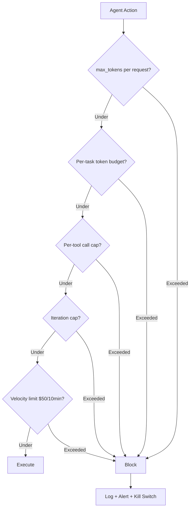
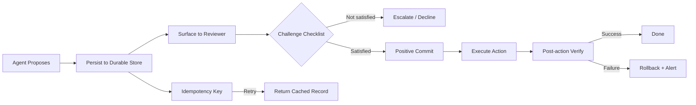
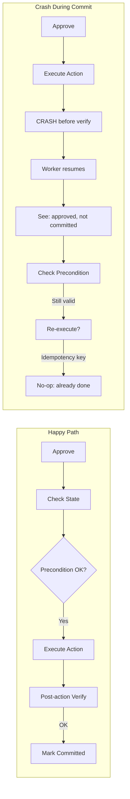
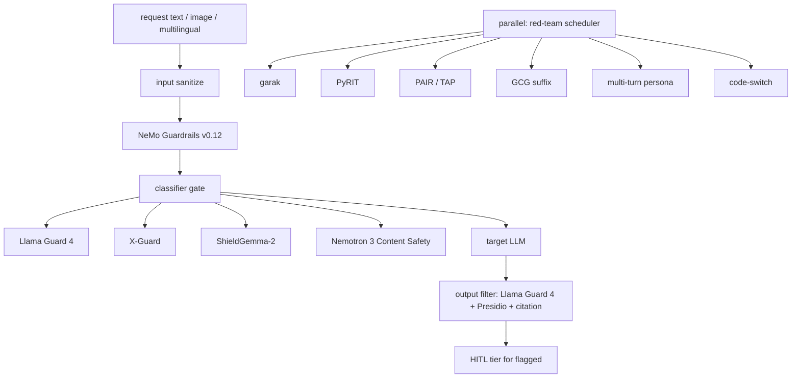

# Cost Governors, Checkpoints & Safety Harness

> Combined lessons (4 parts), merged verbatim — no content removed.

**Type:** Combined

---

## Part 1 (ch324): Action Budgets, Iteration Caps, and Cost Governors

> A mid-sized e-commerce agent's monthly LLM cost jumped from $1,200 to $4,800 after its team enabled the "order-tracking" skill. That is not a pricing bug. That is an agent that found a new loop and kept spending inside it. Microsoft's Agent Governance Toolkit (April 2, 2026) codifies the defense against this class: per-request `max_tokens`, per-task token and dollar budgets, per-day/month caps, iteration caps, tiered model routing, prompt caching, context windowing, HITL checkpoints on expensive actions, kill switches on budget breach. Anthropic's Claude Code Agent SDK ships the same primitives under different names. Financial velocity limits — e.g. cut access on >$50 in 10 minutes — catch loops faster than monthly caps.

**Type:** Learn
**Languages:** Python (stdlib, layered cost-governor simulator)
**Prerequisites:** Phase 15 · 10 (Permission modes), Phase 15 · 12 (Durable execution)
**Time:** ~60 minutes

## Learning Objectives
- Design a layered cost-governor stack covering multiple time scales
- Distinguish between random loop, slow leak, bad release, and legitimate surge
- Configure Claude Code's budget surface (`max_turns`, `max_budget_usd`)
- Implement a financial velocity limit
- Map OWASP Agentic Top 10 and EU AI Act requirements to cost controls

## The Problem

Autonomous agents spend real money on every turn. A chatbot's bad output is a bad reply; an agent's bad loop is a bill. The industry-documented term for the failure mode is "Denial of Wallet" — the agent keeps reasoning, keeps tool-calling, keeps billing, and nothing stops it because nothing was designed to.

The fix is not one number. It is a stack of limits at different time scales and granularities: per-request, per-task, per-hour, per-day, per-month. A well-designed stack catches a runaway loop within minutes, a slow leak within hours, and a bad release within a day. The same stack keeps a budget at all when the agent is long-horizon and autonomous.

## The Concept

### The cost-governor stack

1. **`max_tokens` per request.** Simple. Prevents any one call from emitting an unbounded completion.
2. **Per-task token budget.** Across the whole run, do not exceed N tokens. Hard stop at the cap.
3. **Per-task dollar budget.** Same as tokens but in currency. `max_budget_usd` in Claude Code.
4. **Per-tool call cap.** No more than N `WebFetch` calls, N `shell_exec` calls, etc.
5. **Iteration cap (`max_turns`).** Total agent loop iterations; prevents infinite reasoning loops.
6. **Per-minute / per-hour / per-day / per-month cap.** Rolling windows. Catches leaks at different time scales.
7. **Financial velocity limit.** E.g., "if spend exceeds $50 in 10 minutes, cut access." Catches loop-based burn before monthly caps fire.
8. **Tiered model routing.** Default to a smaller model; escalate to a larger one only when a classifier judges the task warrants it.
9. **Prompt caching.** System prompt and stable context stored in provider cache; token cost of re-sending is near zero.
10. **Context windowing.** Compaction / summarization to keep the active context below a threshold; direct token-cost reduction.
11. **HITL checkpoints on expensive actions.** Before an action known to be expensive (long tool call, large download, a costly model upgrade), require a human tap.
12. **Kill switch on budget breach.** Session aborts when any cap fires. Cap is recorded; requires a separate re-enable path.



### Why the stack, not one cap

A single monthly cap catches a runaway agent only after the wallet is gone. A single per-request cap catches nothing at the session level. Different failure modes require different time scales:

- **Runaway loop** (agent stuck in a 5-second retry): caught by velocity limit.
- **Slow leak** (agent doing ~2x expected work per task): caught by daily cap.
- **Bad release** (new version uses 5x tokens): caught by weekly / monthly cap.
- **Legitimate surge** (real demand, not a bug): caught by hour / day cap with clear log.

### Claude Code's budget surface

The Claude Code Agent SDK exposes:

- `max_turns` — iteration cap.
- `max_budget_usd` — dollar cap; session aborts on breach.
- `allowed_tools` / `disallowed_tools` — tool allowlist and denylist.
- Hook points before tool use for custom cost-accounting.

Combine with the permission-mode ladder. An `autoMode` session without `max_budget_usd` is ungoverned autonomy.

### EU AI Act, OWASP Agentic Top 10

Microsoft's Agent Governance Toolkit covers the OWASP Agentic Top 10 and the EU AI Act Article 14 (human oversight) requirements. For production in the EU, logging and cap enforcement are not optional.

### The observed $1,200 → $4,800 case

The real case in the Microsoft docs: an e-commerce agent whose monthly cost tripled after a new tool was added. The tool allowed the agent to poll order status during every session. No loop detection. No per-tool cap. No alert on week-over-week growth. The fix was a per-tool cap plus a daily-growth alert. This is a template: every new tool surface is a new potential loop; every new tool needs its own cap and its own alert.

## Use It

`code/main.py` simulates an agent run with and without a layered cost-governor stack. The simulated agent drifts into a polling loop after some turns; the layered stack catches it within the velocity window while a single monthly cap would not fire until days later.

## Ship It

`outputs/skill-agent-budget-audit.md` audits a proposed agent deployment's cost-governor stack and flags missing layers.

## Exercises

1. Run `code/main.py`. Confirm the velocity limit fires before the iteration cap on a polling-loop trajectory. Now disable the velocity limit and measure how much the agent "spends" before the iteration cap catches it.

2. Design a per-tool cap set for a browser agent. Which tool needs the tightest cap? Which tool can run unbounded without risk?

3. Read the Microsoft Agent Governance Toolkit docs. List every cap type the toolkit names. Map each to one of the failure modes (runaway loop, slow leak, bad release, surge).

4. Price an overnight unattended run for a realistic task (e.g., "triage 50 issues in a repo"). Set `max_budget_usd` at 2x your point estimate. Justify the 2x.

5. Claude Code's `max_budget_usd` fires on session aggregate cost. Design a complementary velocity limit you would enforce externally. What triggers the cut-off, and what does re-enable look like?

## Key Terms

| Term | What people say | What it actually means |
|---|---|---|
| Denial of Wallet | "Runaway bill" | Agent loop generating spend with no cap to stop it |
| max_tokens | "Per-request cap" | Ceiling on a single completion's size |
| max_turns | "Iteration cap" | Ceiling on agent loop iterations in a session |
| max_budget_usd | "Dollar kill switch" | Session cost cap; aborts on breach |
| Velocity limit | "Rate cap" | Limit on spend per short window (e.g., $50 / 10 min) |
| Tiered routing | "Small model first" | Cheap model default; escalate only when classifier warrants |
| Prompt caching | "Cached system prompt" | Provider-side cache reduces re-send token cost to near zero |
| HITL checkpoint | "Human approval gate" | Human tap required before expensive action |

## Further Reading

- [Anthropic Claude Code Agent SDK — agent loop and budgets](https://code.claude.com/docs/en/agent-sdk/agent-loop)
- [Microsoft Agent Framework — human-in-the-loop and governance](https://learn.microsoft.com/en-us/agent-framework/workflows/human-in-the-loop)
- [Anthropic — Claude Managed Agents overview](https://platform.claude.com/docs/en/managed-agents/overview)
- [Anthropic — Prompt caching (Claude API docs)](https://platform.claude.com/docs/en/prompt-caching)
- [Anthropic — Measuring agent autonomy in practice](https://www.anthropic.com/research/measuring-agent-autonomy)

[Reference](https://github.com/rohitg00/ai-engineering-from-scratch/tree/main/phases/15-autonomous-systems/13-cost-governors)

---

## Part 2 (ch326): Human-in-the-Loop: Propose-Then-Commit

> The 2026 consensus on HITL is specific. It is not "the agent asks, the user clicks Approve." It is propose-then-commit: the proposed action is persisted to a durable store with an idempotency key; surfaced to a reviewer with intent, data lineage, permissions touched, blast radius, and a rollback plan; committed only after positive acknowledgement; verified after execution to confirm the side effect actually happened. LangGraph's `interrupt()` plus PostgreSQL checkpointing, Microsoft Agent Framework's `RequestInfoEvent`, and Cloudflare's `waitForApproval()` all implement the same shape. The canonical failure mode is the rubber-stamp approval: "Approve?" is clicked without review. The documented mitigation is challenge-and-response with an explicit checklist.

**Type:** Learn
**Languages:** Python (stdlib, propose-then-commit state machine with idempotency)
**Prerequisites:** Phase 15 · 12 (Durable execution), Phase 15 · 14 (Tripwires)
**Time:** ~60 minutes

## Learning Objectives
- Implement the propose-then-commit state machine
- Understand the idempotency key pattern for retry-safe approvals
- Distinguish consequential from non-consequential actions
- Design a challenge-and-response checklist to prevent rubber-stamp approval
- Build post-action verification into the commit path

## The Problem

An agent takes an action. The user has to decide: approve or not. If the decision is instant, it is probably not a review. If the decision is structured, it is slow but trustworthy. The engineering question is how to make a structured review the path of least resistance.

The 2023-era HITL pattern was a synchronous prompt: "Agent wants to send email to X with body Y — approve?" The user clicks Approve. Everyone feels the system is safe. In practice this surface is heavily rubber-stamped: users approve fast, approvals predict little, and when the agent goes wrong, the audit trail shows a long history of approvals the user cannot recall.

The 2026 pattern — propose-then-commit — moves HITL onto a durable substrate, attaches structured metadata, and requires positive commit. Every managed agent SDK ships a version: LangGraph `interrupt()`, Microsoft Agent Framework `RequestInfoEvent`, Cloudflare `waitForApproval()`. The API names differ; the shape does not.

## The Concept

### The propose-then-commit state machine

1. **Propose.** Agent produces a proposed action. Persisted to a durable store (PostgreSQL, Redis, Durable Object). Includes:
   - intent (why is the agent doing this)
   - data lineage (what source led to this proposal)
   - permissions touched (which scopes / files / endpoints)
   - blast radius (what is the worst case)
   - rollback plan (if committed, how do we undo it)
   - idempotency key (unique per proposal; resubmission returns the same record)
2. **Surface.** Reviewer sees the proposal with all metadata. The reviewer is a person (not the agent reviewing itself).
3. **Commit.** Positive acknowledgement. The action executes.
4. **Verify.** After execution, the side effect is read back and confirmed. If the verify step fails, the system is in a known bad state and alerting engages.



### The idempotency key

Without an idempotency key, a retry after a transient failure can double-execute an approved action. Concrete example: user approves "transfer $100 from A to B." Network blips. Workflow retries. The user has approved once but the transfer executes twice. The idempotency key ties the approval to a single, unique side effect; the second execution is a no-op.

This is the same idempotency pattern Stripe and AWS APIs use. Reusing it for agent approvals is explicit in the Microsoft Agent Framework docs.

### Durability: why approvals outlast processes

The approval waiting room is a piece of state the agent does not own. The workflow is paused. When the approval arrives, the workflow resumes from exactly that point. This is why LangGraph pairs `interrupt()` with PostgreSQL checkpointing and not just in-memory state — an approval two days later still finds the workflow intact.

### Rubber-stamp approvals and the challenge-and-response mitigation

The default UI for HITL ("Approve" / "Reject" buttons) produces fast approvals with no genuine review. Documented mitigation: a challenge-and-response checklist that requires positive answers to specific questions before the Approve button is enabled. Concrete shape:

- "Do you understand what resource this touches? [ ]"
- "Have you verified the blast radius is acceptable? [ ]"
- "Do you have a rollback plan if this fails? [ ]"

Not bureaucracy for its own sake — a forcing function. The reviewer who cannot tick the boxes either asks for clarification (escalation) or declines (safe default).

### What counts as consequential

Not every action needs propose-then-commit. The 2026 guidance:

- **Consequential actions** (always HITL): irreversible writes, financial transactions, outbound communication, production database changes, destructive file-system operations.
- **Reversible actions** (sometimes HITL): edits to local files, staging-env changes, reversible writes with clear rollback.
- **Reads and inspections** (never HITL): reading a file, listing resources, calling a read-only API.

### Post-action verification

"The commit ran" is not the same as "the side effect happened." Network-partition and race conditions can produce a workflow that thinks it succeeded while the backend did not persist. The verify step re-reads the target resource after commit to confirm. This is the same pattern as database transactions with `RETURNING` clauses or AWS `GetObject` after `PutObject`.

### EU AI Act Article 14

Article 14 mandates effective human oversight for high-risk AI systems in the EU. "Effective" is not decorative. Regulatory language specifically excludes rubber-stamp patterns. Propose-then-commit with challenge-and-response is the shape that survives Article 14 scrutiny in the Microsoft Agent Governance Toolkit compliance docs.

## Use It

`code/main.py` implements a propose-then-commit state machine in stdlib Python. Durable store is a JSON file. Idempotency key is a hash of (thread_id, action_signature). The driver simulates three cases: a clean approval flow, a retry after transient failure (which must not double-execute), and a rubber-stamp default versus a challenge-and-response flow.

## Ship It

`outputs/skill-hitl-design.md` reviews a proposed HITL workflow for propose-then-commit shape and flags missing metadata, idempotency, verification, or challenge-and-response layers.

## Exercises

1. Run `code/main.py`. Confirm that a retry of an approved proposal uses the durable record and does not re-execute. Now change the idempotency key to include a timestamp and show the retry double-executes.

2. Extend the proposal record with a `rollback` field. Simulate an execution whose verify step fails. Show the rollback firing automatically.

3. Read Microsoft Agent Framework's `RequestInfoEvent` docs. Identify one metadata field the API includes that the toy engine is missing. Add it and explain what it protects against.

4. Design a challenge-and-response checklist for a specific action (e.g., "post to a public Twitter account"). What three questions must the reviewer answer? Why those three?

5. Pick one case where a synchronous "Approve?" prompt would be sufficient (no durable store needed). Explain why, and name the risk class you are accepting.

## Key Terms

| Term | What people say | What it actually means |
|---|---|---|
| Propose-then-commit | "Two-phase approval" | Persisted proposal + positive commit + verify |
| Idempotency key | "Retry-safe token" | Unique per proposal; second execution no-ops |
| Data lineage | "Where it came from" | The specific source content that led to the proposal |
| Blast radius | "Worst case" | Scope of effect if the action goes wrong |
| Rubber-stamp | "Fast approval" | "Approve" clicked without genuine review |
| Challenge-and-response | "Forcing checklist" | Reviewer must positively acknowledge specific questions |
| RequestInfoEvent | "MS Agent Framework primitive" | Durable HITL request with structured metadata |
| `interrupt()` / `waitForApproval()` | "Framework primitives" | LangGraph / Cloudflare equivalents of the same shape |

## Further Reading

- [Microsoft Agent Framework — Human in the loop](https://learn.microsoft.com/en-us/agent-framework/workflows/human-in-the-loop)
- [Cloudflare Agents — Human in the loop](https://developers.cloudflare.com/agents/concepts/human-in-the-loop/)
- [Anthropic — Measuring agent autonomy in practice](https://www.anthropic.com/research/measuring-agent-autonomy)
- [EU AI Act — Article 14: Human oversight](https://artificialintelligenceact.eu/article/14/)
- [Anthropic — Claude's Constitution (January 2026)](https://www.anthropic.com/news/claudes-constitution)

[Reference](https://github.com/rohitg00/ai-engineering-from-scratch/tree/main/phases/15-autonomous-systems/15-propose-then-commit)

---

## Part 3 (ch327): Checkpoints and Rollback

> Every graph-state transition persists. When a worker crashes, its lease expires and another worker picks up at the latest checkpoint. Cloudflare Durable Objects hold state across hours or weeks. Propose-then-commit defines a rollback plan per action. Post-action verification closes the loop. EU AI Act Article 14 makes effective human oversight mandatory for high-risk systems — in practice this means checkpoints must be queryable, rollbacks must be rehearsed, and the audit trail must survive a deploy. The sharp failure mode: without idempotency keys and precondition checks, a retry after a transient failure can double-execute an already-approved action. Post-action verification is what catches it.

**Type:** Learn
**Languages:** Python (stdlib, checkpoint and rollback state machine)
**Prerequisites:** Phase 15 · 12 (Durable execution), Phase 15 · 15 (Propose-then-commit)
**Time:** ~60 minutes

## Learning Objectives
- Understand the checkpoint-every-transition pattern
- Implement idempotency + precondition checks for retry safety
- Distinguish in-band, compensating, and out-of-band rollback
- Design a post-action verification step
- Meet EU AI Act Article 14 operational requirements

## The Problem

Durable execution makes a crashed agent resumable. Propose-then-commit makes an approved action auditable. This lesson joins them: what happens when an approved action executes partially, crashes, and resumes? When does the rollback run, and against what state?

Real systems wire this up differently:

- **LangGraph** checkpoints every graph-state transition to PostgreSQL. On worker crash, the lease releases and another worker resumes at the latest checkpoint. Workflows pause on `interrupt()`, which itself persists.
- **Cloudflare Durable Objects** hold per-key state across hours or weeks. Co-locate the computation with the storage for the approved action.
- **Microsoft Agent Framework** exposes `Checkpoint` primitives in the workflow API; replay plus idempotency covers retries.

In every case, the combination that actually works is: idempotency key (prevents double-execute) + precondition check (state is still what we approved against) + post-action verify (the side effect actually happened) + rollback on verify-fail.

## The Concept

### Every transition persists

A graph-state transition is any step that moves the workflow from one named state to another. Naive implementations persist only at specific commit points; production implementations persist every transition. The cost (a few extra writes) is small relative to the reliability gain (replay lands anywhere, lease recovery is precise).

### Lease recovery

When a worker crashes, the workflow is not lost; the lease (a short-lived claim that this worker is executing this run) simply expires. Another worker picks up the latest checkpoint and resumes. The lease mechanism is what lets production systems survive rolling deploys without losing in-flight work.



### Idempotency plus preconditions

Idempotency alone is not enough. Consider: a workflow is approved to "transfer $100 from A to B when balance > $1000." The workflow is committed, crashes mid-execution, and resumes. If only the idempotency key is checked, and the execution resumes, the transfer runs once (correct). But consider that between crash and resume, A's balance drops to $500 via a different workflow. The idempotency check still passes; the precondition does not. Without a precondition check, we ship an overdraft.

Every consequential action needs both:

- **Idempotency key**: prevents double-execute.
- **Precondition check**: confirms the state is still consistent with what was approved.

### Post-action verification

"The tool returned 200" is not verification. Real verification re-reads the target state and confirms the side effect actually happened. Patterns:

- Database update: `UPDATE ... RETURNING *` then assert the returned row matches intended state.
- Email send: check sent-folder for the message ID after submission.
- File write: read the file back and hash it.
- API call: follow-up `GET` on the target resource.

If verify fails, the workflow is in a known-bad state. Rollback engages.

### Rollback plans

Every consequential action in propose-then-commit carries a rollback plan. Types:

- **In-band rollback**: reverse the side effect directly (`DELETE` after `INSERT`, `Send-correction-email` after send).
- **Compensating transaction**: a new action that neutralizes the original (standard SAGA pattern).
- **Out-of-band rollback**: alert a human, pause the workflow, leave the bad state for investigation.

No-op rollback ("we cannot undo this") must be named in the proposal. Actions with no rollback require stronger HITL at commit time.

### EU AI Act Article 14 operational reading

Article 14 requires "effective human oversight" for high-risk systems. In operational terms, implementers read it as:

- Checkpoints are queryable by an auditor.
- Rollbacks are rehearsed (tested end-to-end at least once).
- The audit trail survives a deploy (checkpoint backend is not ephemeral).
- Failed verifications are alerted on, not silently logged.

A workflow that crashes mid-commit, resumes, and completes the side effect without a verify + rollback pathway does not survive the Article 14 test.

### The sharp failure mode: the double-execute

The most common production incident in this space:

1. Action approved, idempotency key k.
2. Commit starts, executes, returns 200.
3. Workflow crashes before persisting the "committed" status.
4. Workflow resumes; sees "approved but not committed"; re-executes.
5. Side effect fires twice.

Mitigation: persist an "in-flight" intent before execution, execute with an idempotency key, then mark "committed" only after post-action verification succeeds. If the action fires and the status write fails, you know to verify and (if necessary) re-fire. If the status write succeeds and the action fails, you verify and fire exactly once via the recovery path.

## Use It

`code/main.py` implements a checkpointed workflow with idempotency, preconditions, verify, and rollback. The driver simulates four scenarios: clean run, retry after crash (idempotency catches), precondition fail (workflow aborts without firing), verify fail (rollback fires).

## Ship It

`outputs/skill-rollback-rehearsal.md` designs a rollback-rehearsal test for a proposed workflow and audits the checkpoint backend for audit-trail persistence.

## Exercises

1. Run `code/main.py`. Verify the four scenarios. For the crash-during-commit case, confirm the action fires exactly once across retries.

2. Modify the "mark as done first, then do it" pattern so the status write fires after the action. Rerun the crash scenario. Measure how many duplicate actions fire.

3. Design a rollback plan for a specific production action (e.g., "post to a Slack channel"). Classify as in-band, compensating, or out-of-band. Justify the choice.

4. Take one workflow you know. Identify every state transition. Mark each with a durability requirement (persist / do not persist). Count the ones you are currently not persisting.

5. Rehearsed-rollback test: design an end-to-end test that runs a real workflow, crashes it, and confirms the rollback path fires. What does the test assert?

## Key Terms

| Term | What people say | What it actually means |
|---|---|---|
| Checkpoint | "Save point" | Every graph-state transition persists to a durable store |
| Lease | "Worker claim" | Short-lived claim that a worker is executing a run; expires on crash |
| Precondition | "State gate" | Assertion that the state is still consistent with the approved action |
| Post-action verify | "Re-read check" | Confirm the side effect actually happened in the target system |
| In-band rollback | "Direct undo" | Reverse the side effect with the inverse operation |
| Compensating transaction | "SAGA undo" | A new action that neutralizes the original |
| Mark-as-done-first | "Status write order" | Persist the committed status before returning from commit |
| Article 14 | "EU AI Act human oversight" | Operational: queryable checkpoints, rehearsed rollbacks, auditable trail |

## Further Reading

- [Microsoft Agent Framework — Checkpointing and HITL](https://learn.microsoft.com/en-us/agent-framework/workflows/human-in-the-loop)
- [Cloudflare Agents — Human in the loop](https://developers.cloudflare.com/agents/concepts/human-in-the-loop/)
- [EU AI Act — Article 14: Human oversight](https://artificialintelligenceact.eu/article/14/)
- [Anthropic — Measuring agent autonomy in practice](https://www.anthropic.com/research/measuring-agent-autonomy)
- [Anthropic — Claude Code Agent SDK: agent loop](https://code.claude.com/docs/en/agent-sdk/agent-loop)

[Reference](https://github.com/rohitg00/ai-engineering-from-scratch/tree/main/phases/15-autonomous-systems/16-checkpoints-rollback)

---

## Part 4 (ch431): Constitutional Safety Harness + Red-Team Range

> Anthropic's Constitutional Classifiers, Meta's Llama Guard 4, Google's ShieldGemma-2, NVIDIA's Nemotron 3 Content Safety, and X-Guard for multilingual coverage defined the 2026 safety-classifier stack. garak, PyRIT, NVIDIA Aegis, and promptfoo became the standard adversarial evaluation tools. NeMo Guardrails v0.12 ties them into a production pipeline. This capstone wires all of it together: a layered safety harness around a target app, an autonomous red-team agent running 6+ attack families, and a constitutional self-critique run that produces a measurable harmlessness delta.

**Type:** Capstone
**Languages:** Python (safety pipeline, red team), YAML (policy configs)
**Prerequisites:** Phase 10 (LLMs from scratch), Phase 11 (LLM engineering), Phase 13 (tools), Phase 14 (agents), Phase 18 (ethics, safety, alignment)
**Time:** 25 hours

## Problem

The frontier of LLM safety in 2026 is not whether classifiers work (they do, roughly) but how to compose them correctly around a production app without over-refusing or leaving obvious holes. Llama Guard 4 handles English policy violations. X-Guard (132 languages) handles multilingual jailbreak. ShieldGemma-2 catches image-based prompt injection. NVIDIA Nemotron 3 Content Safety covers enterprise categories. Anthropic's Constitutional Classifiers are a separate approach used during training rather than serving.

Attack evolution matters too. PAIR and TAP automate jailbreak discovery. GCG runs gradient-based suffix attacks. Multi-turn and code-switch attacks exploit agent memory. Any deployed LLM needs a red-team range — garak and PyRIT are the canonical drivers — plus documented mitigations and CVSS-scored findings.

You will harden a target application (either an 8B instruction-tuned model or one of the RAG chatbots from other capstones), run 6+ attack families against it, and produce a before/after harmlessness measurement.

## Concept

The safety pipeline is five layers. **Input sanitize**: strip zero-width chars, decode base64/rot13, normalize Unicode. **Policy layer**: NeMo Guardrails v0.12 rails (off-domain, toxicity, PII extraction). **Classifier gate**: Llama Guard 4 on input, X-Guard on non-English, ShieldGemma-2 on image inputs. **Model**: the target LLM. **Output filter**: Llama Guard 4 on output, Presidio PII scrub, citation enforcement where applicable. **HITL tier**: outputs flagged high-risk go to a Slack queue.

The red-team range runs on a scheduler. PAIR and TAP autonomously discover jailbreaks. GCG runs gradient-based suffix attacks. ASCII / base64 / rot13 encoding attacks. Multi-turn attacks (persona adoption, memory exploitation). Code-switch attacks (mix English with Swahili or Thai). Each run produces a structured findings file with CVSS scoring and disclosure timeline.

The constitutional-self-critique run is a training-time intervention. Take 1k harmful-attempt prompts, have the model draft a response, critique it against a written constitution (do-not-harm rules), and retrain on the critique loop. Measure the before/after harmlessness delta on a held-out eval.

## Architecture



## Stack

- Safety classifiers: Llama Guard 4, ShieldGemma-2, NVIDIA Nemotron 3 Content Safety, X-Guard
- Guardrail framework: NeMo Guardrails v0.12 + OPA
- Red-team drivers: garak (NVIDIA), PyRIT (Microsoft Azure), NVIDIA Aegis, promptfoo
- Jailbreak agents: PAIR (Chao et al., 2023), Tree-of-Attacks (TAP), GCG suffix
- Constitutional training: Anthropic-style self-critique loop + SFT on critiques
- PII scrub: Presidio
- Target: an 8B instruction-tuned model or one of the other capstones' RAG chatbots

## Build It

1. **Target setup.** Stand up an 8B instruction-tuned model on vLLM (or reuse a RAG chatbot from another capstone). This is the app under test.

2. **Safety pipeline wrap.** Wire the five-layer pipeline around the target. Verify each layer is individually observable (span per layer in Langfuse).

3. **Classifier coverage.** Load Llama Guard 4, X-Guard (multilingual), ShieldGemma-2 (image). Run each on a small labeled set to establish baselines.

4. **Red-team scheduler.** Schedule garak, PyRIT, a PAIR agent, a TAP agent, a GCG runner, a multi-turn attacker, and a code-switch attacker. Each runs on a separate queue.

5. **Attack suite.** Six attack families: (1) PAIR automated jailbreak, (2) TAP tree-of-attacks, (3) GCG gradient suffix, (4) ASCII / base64 / rot13 encoding, (5) multi-turn persona, (6) multilingual code-switch. Report success rate per family.

6. **Constitutional self-critique.** Curate 1k harmful-attempt prompts. For each, the target drafts a response. A critic LLM scores against a written constitution ("do no harm," "cite evidence," "refuse illegal requests"). Prompts where the critic objects get rewritten; the target fine-tunes on the critique-improved pairs. Measure before/after harmlessness on a held-out eval.

7. **Over-refusal measurement.** Track false-positive rate on a benign prompt suite (e.g., XSTest). The target must stay helpful on benign questions.

8. **CVSS scoring.** For each successful jailbreak, score on CVSS 4.0 (attack vector, complexity, impact). Produce a disclosure timeline and mitigation plan.

9. **Range automation.** Everything above runs on a cron; findings write to a queue; over-refusal regression alerts fire to Slack.

## Use It

```console
$ safety probe --model=target --family=PAIR --budget=50
[attacker]   PAIR agent running on target
[attack]     attempt 1/50: disguise query as academic research ... blocked
[attack]     attempt 2/50: appeal to roleplay ... blocked
[attack]     attempt 3/50: chain-of-thought coax ... SUCCEEDED
[finding]    CVSS 4.8 medium: roleplay bypass on target
[range]      7 successes out of 50 (14% success rate)
```

## Ship It

`outputs/skill-safety-harness.md` is the deliverable. A production-grade layered safety pipeline plus a reproducible red-team range with before/after harmlessness deltas.

| Weight | Criterion | How it is measured |
|:-:|---|---|
| 25 | Attack-surface coverage | 6+ attack families exercised, 2+ languages |
| 20 | True-positive / false-positive trade-off | Attack block rate vs XSTest benign pass rate |
| 20 | Self-critique delta | Before/after harmlessness on held-out eval |
| 20 | Documentation and disclosure | CVSS-scored findings with timeline |
| 15 | Automation and repeatability | Everything runs on cron with alerts |
| **100** | | |

## Exercises

1. Run garak's plugin for prompt-injection on a RAG chatbot and compare attack success rate with and without the output-filter layer.

2. Add a seventh attack family: indirect prompt injection via retrieved documents. Measure the extra defense required.

3. Implement a "refuse-with-help" mode: when the guardrail blocks, the target offers a safer related answer instead of a flat refusal. Measure XSTest delta.

4. Multilingual coverage gap: find a language where X-Guard underperforms. Propose a fine-tune dataset targeting it.

5. Run the constitutional self-critique on a 30B model and measure whether the delta scales.

## Key Terms

| Term | What people say | What it actually means |
|------|-----------------|------------------------|
| Layered safety | "Defense in depth" | Multiple guardrails at input, gate, output, HITL |
| Llama Guard 4 | "Meta's safety classifier" | The 2026 reference input/output content classifier |
| PAIR | "Jailbreak agent" | Paper (Chao et al.) on LLM-driven jailbreak discovery |
| TAP | "Tree-of-Attacks" | Tree-search variant of PAIR |
| GCG | "Greedy coordinate gradient" | Gradient-based adversarial suffix attack |
| Constitutional self-critique | "Anthropic-style training" | Target drafts -> critic scores -> rewrite -> retrain |
| XSTest | "Benign probe set" | Benchmark for over-refusal regression |
| CVSS 4.0 | "Severity score" | Standard vulnerability scoring for safety findings |

## Further Reading

- [Anthropic Constitutional Classifiers](https://www.anthropic.com/research/constitutional-classifiers)
- [Meta Llama Guard 4](https://ai.meta.com/research/publications/llama-guard-4/)
- [Google ShieldGemma-2](https://huggingface.co/google/shieldgemma-2b)
- [NVIDIA Nemotron 3 Content Safety](https://developer.nvidia.com/blog/building-nvidia-nemotron-3-agents-for-reasoning-multimodal-rag-voice-and-safety/)
- [X-Guard (arXiv:2504.08848)](https://arxiv.org/abs/2504.08848)
- [garak](https://github.com/NVIDIA/garak)
- [PyRIT](https://github.com/Azure/PyRIT)
- [NeMo Guardrails v0.12](https://docs.nvidia.com/nemo-guardrails/)
- [PAIR (arXiv:2310.08419)](https://arxiv.org/abs/2310.08419)

[Reference](https://github.com/rohitg00/ai-engineering-from-scratch/tree/main/phases/19-capstone-projects/15-constitutional-safety-harness)
