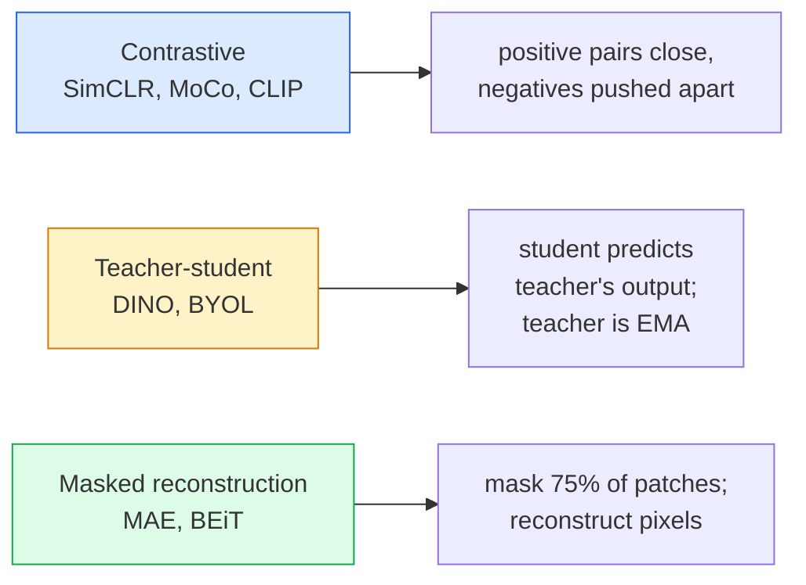

# Self-Supervised Vision — SimCLR, DINO, MAE

> Labels are the bottleneck of supervised vision. Self-supervised pretraining removes them: learn visual features from 100M unlabelled images, fine-tune on 10k labelled ones.

**Type:** Learn + Build
**Languages:** Python
**Prerequisites:** Phase 4 Lesson 04 (Image Classification), Phase 4 Lesson 14 (ViT)
**Time:** ~75 minutes

## Learning Objectives

- Trace the three SSL families: contrastive (SimCLR), teacher-student (DINO), masked reconstruction (MAE)
- Implement InfoNCE loss and explain why batch size matters
- Explain MAE's 75% masking ratio vs BERT's 15%
- Use DINOv2 or MAE checkpoints for linear probing

## The Problem

Supervised ImageNet costs $10M to annotate. SSL pretrains on cheap unlabelled data — YouTube, web crawls — then fine-tunes on a small labelled set.

## The Concept

### Three families



### Why 75% and not 15%

BERT masks 15% of tokens. MAE masks 75%. Image patches have low entropy — neighbouring pixels predict each other. To force semantic understanding, mask aggressively.

### Linear probe evaluation

Freeze encoder, train linear classifier on top. Pure measure of feature quality.

## Build It

### Step 1: Two-view augmentation

```python
import torch
import torchvision.transforms as T

two_view_train = lambda: T.Compose([
    T.RandomResizedCrop(96, scale=(0.2, 1.0)),
    T.RandomHorizontalFlip(),
    T.ColorJitter(0.4, 0.4, 0.4, 0.1),
    T.RandomGrayscale(p=0.2),
    T.ToTensor(),
])

class TwoViewDataset(torch.utils.data.Dataset):
    def __init__(self, base):
        self.base = base
        self.aug = two_view_train()

    def __len__(self):
        return len(self.base)

    def __getitem__(self, i):
        img, _ = self.base[i]
        return self.aug(img), self.aug(img)
```

### Step 2: InfoNCE loss

```python
import torch.nn.functional as F

def info_nce(z1, z2, tau=0.1):
    N, D = z1.shape
    z = torch.cat([z1, z2], dim=0)
    sim = z @ z.T / tau

    mask = torch.eye(2 * N, dtype=torch.bool, device=z.device)
    sim = sim.masked_fill(mask, float("-inf"))

    targets = torch.cat([torch.arange(N, 2 * N), torch.arange(0, N)]).to(z.device)
    return F.cross_entropy(sim, targets)
```

### Step 3: Sanity check

```python
z1 = F.normalize(torch.randn(16, 32), dim=-1)
z2 = z1.clone()
loss_same = info_nce(z1, z2, tau=0.1).item()
z2_random = F.normalize(torch.randn(16, 32), dim=-1)
loss_random = info_nce(z1, z2_random, tau=0.1).item()
print(f"identical pairs: {loss_same:.3f}   random pairs: {loss_random:.3f}")
```

### Step 4: MAE-style masking

```python
def random_mask_indices(num_patches, mask_ratio=0.75, seed=0):
    g = torch.Generator().manual_seed(seed)
    n_keep = int(num_patches * (1 - mask_ratio))
    perm = torch.randperm(num_patches, generator=g)
    visible = perm[:n_keep]
    masked = perm[n_keep:]
    return visible.sort().values, masked.sort().values

num_patches = 196
visible, masked = random_mask_indices(num_patches, mask_ratio=0.75)
print(f"visible: {len(visible)} / {num_patches}")
print(f"masked:  {len(masked)} / {num_patches}")
```

## Use It

```python
import torch
from transformers import AutoImageProcessor, AutoModel

processor = AutoImageProcessor.from_pretrained("facebook/dinov2-base")
model = AutoModel.from_pretrained("facebook/dinov2-base")
model.eval()

with torch.no_grad():
    inputs = processor(images=[pil_image], return_tensors="pt")
    outputs = model(**inputs)
    embedding = outputs.last_hidden_state[:, 0]
```

## Ship It

- `outputs/prompt-ssl-pretraining-picker.md`
- `outputs/skill-linear-probe-runner.md`

## Exercises

1. **(Easy)** Plot tau in [0.05, 0.1, 0.2, 0.5] vs InfoNCE loss.
2. **(Medium)** Implement DINO-style centre buffer; show collapse without it.
3. **(Hard)** Train MAE on CIFAR-100; compare linear-probe vs supervised.

## Key Terms

## Further Reading

- [SimCLR (Chen et al., 2020)](https://arxiv.org/abs/2002.05709)
- [DINO (Caron et al., 2021)](https://arxiv.org/abs/2104.14294)
- [MAE (He et al., 2022)](https://arxiv.org/abs/2111.06377)
- [DINOv2 (Oquab et al., 2023)](https://arxiv.org/abs/2304.07193)

[Reference](https://github.com/rohitg00/ai-engineering-from-scratch/tree/main/phases/04-computer-vision/17-self-supervised-vision)
