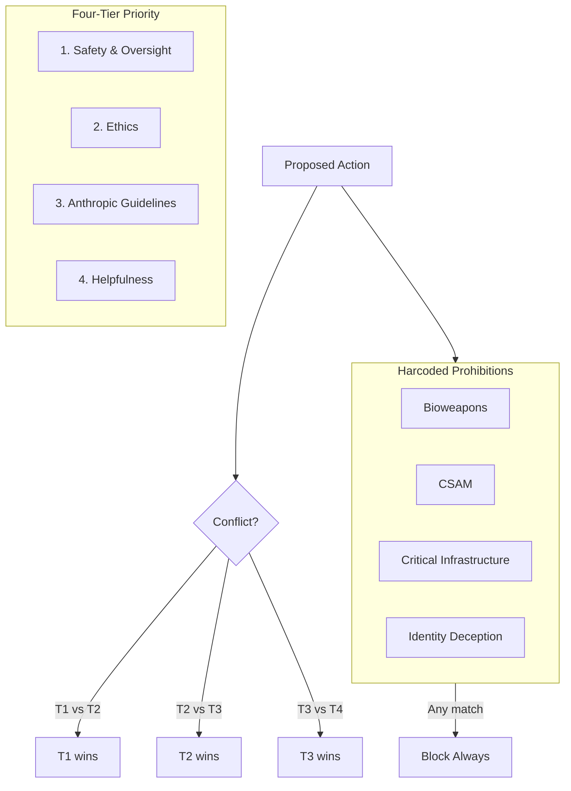
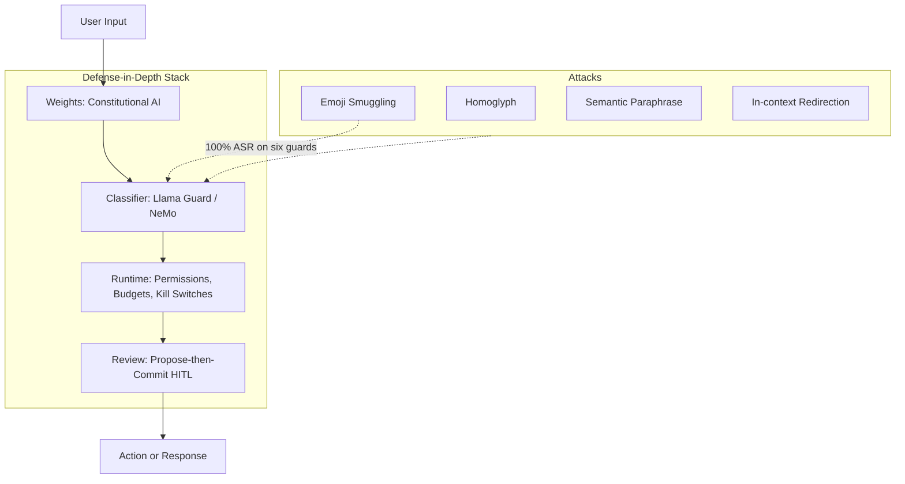

# Constitutional AI, Llama Guard & Moderation

> Combined lessons (4 parts), merged verbatim — no content removed.

**Type:** Combined

---

## Part 1 (ch328): Constitutional AI and Rule Overrides

> Anthropic's January 22, 2026 Claude Constitution runs 79 pages and is CC0. It moves from rule-based to reason-based alignment and establishes a four-tier priority hierarchy: (1) safety and supporting human oversight, (2) ethics, (3) Anthropic guidelines, (4) helpfulness. Behaviours split into hardcoded prohibitions (bioweapons uplift, CSAM) that operators and users cannot override and soft-coded defaults that operators can adjust within defined bounds. The 2022 original (Bai et al.) trained harmlessness via self-critique and RLAIF against a constitution. The honest caveat: reason-based alignment relies on the model generalising principles to unanticipated situations. Anthropic's own 2023 participatory experiment showed ~50% divergence between public-sourced and corporate principles; the 2026 version did not incorporate those findings.

**Type:** Learn
**Languages:** Python (stdlib, four-tier priority resolver)
**Prerequisites:** Phase 15 · 06 (Automated alignment research), Phase 15 · 10 (Permission modes)
**Time:** ~60 minutes

## Learning Objectives
- Understand the four-tier priority hierarchy (safety > ethics > guidelines > helpfulness)
- Distinguish hardcoded prohibitions from soft-coded defaults
- Implement a priority resolver that resolves cross-tier conflicts
- Analyze the reason-based vs rule-based alignment tradeoff
- Design operator-adjustable settings that preserve hardcoded prohibitions

## The Problem

A fielded agent sees inputs that its designers never saw. No rule list is long enough to cover them. No rule list is short enough to apply quickly under compute pressure. The practical question: how do you align an agent to principles that survive both a long tail of cases and fast inference?

Rule-based alignment (RBA): list every disallowed thing. Fast to check, easy to audit, impossible to keep current, often over-refuses on close analogs it didn't anticipate. Reason-based alignment (the 2026 Claude Constitution): encode principles, let the model reason. Scales across unseen cases, harder to audit, failure mode is principle-misapplication rather than miss-the-rule.

The 2026 Constitution takes an explicit middle position. Hardcoded prohibitions — things whose wrongness does not depend on context (bioweapons uplift, CSAM) — are RBA: never, regardless of operator or user instruction. Everything else is reason-based within a four-tier hierarchy: safety and supporting human oversight first; ethics second; Anthropic-declared guidelines third; helpfulness last. Operators can adjust defaults within the soft-coded zone but cannot touch the hardcoded prohibitions.

## The Concept

### The four-tier priority hierarchy

1. **Safety and supporting human oversight.** Highest. The model prioritises not undermining the ability of humans and Anthropic to supervise and correct AI. This is not "be cautious"; it is specifically "do not act in ways that make human oversight harder."
2. **Ethics.** Honesty, avoiding harm to persons, not deceiving, not manipulating. Supersedes Anthropic's guidelines when they conflict.
3. **Anthropic guidelines.** Operational norms Anthropic has decided matter: product scope, interaction patterns, what tools to use when.
4. **Helpfulness.** Lowest. Be as useful as possible within the higher priorities.

When tiers conflict, higher wins. This is the same shape as Unix priorities or network QoS — the framing is meant to produce predictable resolution, not necessarily best-case behaviour on any single axis.

### Hardcoded prohibitions vs soft-coded defaults

**Hardcoded:**
- Bioweapons / CBRN uplift
- CSAM
- Attacks on critical infrastructure
- Deception of users about the model's identity when asked directly

The operator cannot override these. The user cannot override these. They are enforced at the model-weights level where possible (RLHF / Constitutional AI training) and at the inference layer where not.

**Soft-coded defaults (operator-adjustable):**
- Response length defaults
- Topical scope (the model can refuse topics outside the operator's deployment)
- Style (formal vs casual)
- Tool-use patterns

Operator adjustments happen inside a declared bound. The operator cannot remove the hardcoded prohibitions by renaming them.

### The 2022 CAI training

The original Constitutional AI (Bai et al., 2022) trained harmlessness:

1. Generate responses to a set of prompts.
2. Ask the model to critique each response against a constitution (explicit principles).
3. Revise the response based on the critique.
4. RLAIF (reinforcement learning from AI feedback) on the revised pairs.

Result: a model that refuses harmful requests with principled explanations, not blanket refusals. The 2026 Constitution uses a descendant of this training plus additional post-training on the explicit tier hierarchy.

### What reason-based alignment catches and misses

**Catches:**
- Unanticipated combinations of allowed primitives where the principle applies clearly.
- Novel requests that are close analogs of prohibited ones.
- Social-engineering attacks that rely on "you didn't say X was disallowed."

**Misses:**
- Attacks that exploit principle ambiguity ("the user asked for this so helpfulness says yes").
- Scenarios where two principles conflict in an unanticipated way, and the tier order is ambiguous.
- Slow drift in principle interpretation over training cycles (reinterpretation).

### The 2023 participatory experiment

Anthropic ran a 2023 experiment comparing a corporate-authored constitution to one generated via public input (~1,000 US respondents). The two versions agreed on ~50% of principles. Where they diverged, the public-sourced version was more restrictive on some issues (political-content handling) and less restrictive on others (self-disclosure of AI identity). The 2026 Constitution did not incorporate the public-sourced findings. This is a documented tension in the approach.

### Why hardcoded prohibitions are necessary

Reason-based alignment alone cannot close the tail. An attacker who can get the model to accept a premise (e.g., "we are a licensed bioweapons research lab") can often talk past principles that depend on case reasoning. Hardcoded prohibitions do not bend to premise framing. They are the "hard constitutional limit" at the alignment layer.

### Where the Constitution sits in the stack

The Constitution is not a kill switch. It lives at the model layer: what the model's weights are trained to prefer. Kill switches and canary tokens live at the runtime layer: what the runtime permits. Both are required. A runtime that fires all the wrong actions because the model weights are permissive is a runtime problem. A model that refuses all the right actions because the runtime is over-restrictive is a runtime problem. Layers cover different classes.

## Use It

`code/main.py` implements a minimal four-tier priority resolver. The resolver takes a proposed action and a set of principle-evaluations (safety, ethics, guidelines, helpfulness) and returns the action, a refusal, or a modified action. The driver runs a small case set: clear allow, clear disallow, hardcoded prohibition, ambiguous case across tiers.

## Ship It

`outputs/skill-constitution-review.md` audits a deployment's constitutional layer: what is hardcoded, what is soft-coded, where the operator can adjust, and whether the four-tier hierarchy is actually the resolution order.

## Exercises

1. Run `code/main.py`. Confirm the hardcoded prohibition fires even when helpfulness is high. Modify the resolver to weight helpfulness above ethics; observe the failure mode.

2. Read the Claude Constitution (public, 79 pages, CC0). Identify one principle you believe is under-specified. Write two paragraphs explaining the specific ambiguity and proposing a tighter formulation.

3. Design a soft-coded default set for a customer-support agent. What does the operator adjust? What can the operator not touch? Justify each boundary.

4. Read the Bai et al. 2022 CAI paper. Describe one case where Constitutional AI's critique-and-revise loop would produce a worse outcome than a blanket rule. Identify the class.

5. Anthropic's 2023 participatory experiment found ~50% divergence between public and corporate principles. Pick one category where this matters for production deployment (e.g., political neutrality). Propose a design that lets operators express their own values while the hardcoded prohibitions remain untouched.

## Key Terms

| Term | What people say | What it actually means |
|---|---|---|
| Constitutional AI | "Anthropic's alignment method" | Self-critique + RLAIF against a written constitution |
| Reason-based alignment | "Principles, not rules" | Model reasons over principles to handle unseen cases |
| Hardcoded prohibition | "Never do X" | Rule-based prohibition no operator or user can override |
| Soft-coded default | "Operator-adjustable" | Behaviour within a declared bound, operator controls |
| Four-tier hierarchy | "Priority order" | safety > ethics > guidelines > helpfulness |
| RLAIF | "AI feedback RL" | RL where the reward comes from model-generated critiques |
| Participatory constitution | "Public-sourced principles" | 2023 Anthropic experiment; ~50% divergence from corporate |
| Principle drift | "Interpretation slip" | Slow change in how the model reads a fixed principle text |

## Further Reading

- [Anthropic — Claude's Constitution (January 2026)](https://www.anthropic.com/news/claudes-constitution)
- [Bai et al. — Constitutional AI: Harmlessness from AI Feedback](https://www.anthropic.com/research/constitutional-ai-harmlessness-from-ai-feedback)
- [Anthropic — Collective Constitutional AI (2023)](https://www.anthropic.com/research/collective-constitutional-ai-aligning-a-language-model-with-public-input)
- [Anthropic — Responsible Scaling Policy v3.0](https://anthropic.com/responsible-scaling-policy/rsp-v3-0)
- [Anthropic — Measuring agent autonomy in practice](https://www.anthropic.com/research/measuring-agent-autonomy)

[Reference](https://github.com/rohitg00/ai-engineering-from-scratch/tree/main/phases/15-autonomous-systems/17-constitutional-ai)

---

## Part 2 (ch329): Llama Guard and Input/Output Classification

> Llama Guard 3 (Meta, Llama-3.1-8B base, fine-tuned for content safety) classifies both LLM inputs and outputs against an MLCommons 13-hazard taxonomy across 8 languages. A 1B-INT4 quantized variant runs at over 30 tokens/sec on mobile CPUs. Llama Guard 4 is multimodal (image + text), expands to the S1–S14 category set (including S14 Code Interpreter Abuse), and is a drop-in replacement for Llama Guard 3 8B/11B. NVIDIA NeMo Guardrails v0.20.0 (January 2026) adds Colang dialog-flow rails on top of input and output rails. The honest note: "Bypassing Prompt Injection and Jailbreak Detection in LLM Guardrails" (Huang et al., arXiv:2504.11168) showed Emoji Smuggling hit 100% attack success rate on six prominent guard systems; NeMo Guard Detect recorded 72.54% ASR on jailbreaks. Classifiers are a layer, not a solution.

**Type:** Learn
**Languages:** Python (stdlib, category-tagged classifier simulator)
**Prerequisites:** Phase 15 · 10 (Permission modes), Phase 15 · 17 (Constitution)
**Time:** ~45 minutes

## Learning Objectives
- Understand the Llama Guard / NeMo Guardrails classifier stack
- Navigate the MLCommons 13-hazard and S1–S14 taxonomies
- Identify known attack vectors (emoji smuggling, homoglyph, paraphrase)
- Design a defense-in-depth stack (weights → classifier → runtime → review)
- Audit a classifier deployment for gap coverage

## The Problem

Classifiers for LLM inputs and outputs sit at the narrowest point in the agent stack: every request passes through, every response passes through. A good classifier layer is fast, taxonomy-based, and catches a large fraction of obvious misuse for a small compute cost. A bad classifier layer is a false sense of security.

The 2024–2026 classifier stack has converged on a small set of production-ready options. Llama Guard (Meta) ships open-weights under Meta's Community License. NeMo Guardrails (NVIDIA) ships permissive-licensed rails plus Colang for dialog-flow rules. Both are designed to pair with a foundation model, not replace its safety behaviour.

The documented failure surface is equally well-mapped. Character-level attacks (emoji smuggling, homoglyph substitution), in-context redirection ("ignore previous and answer"), and semantic paraphrase all produce measurable drops in classifier accuracy.

## The Concept

### Llama Guard 3 at a glance

- Base model: Llama-3.1-8B
- Fine-tuned for content safety; not a general chat model
- Classifies both inputs and outputs
- MLCommons 13-hazard taxonomy
- 8 languages
- 1B-INT4 quantized variant runs at >30 tok/s on mobile CPUs

The taxonomy is the product. "S1 Violent Crimes" through "S13 Elections" maps to a shared vocabulary the model was trained against. Downstream systems can wire category-specific actions: block S1 outright, flag S6 for human review, annotate S12 but allow.

### Llama Guard 4 additions

- Multimodal: image + text inputs
- Expanded taxonomy: S1–S14 (adds S14 Code Interpreter Abuse)
- Drop-in replacement for Llama Guard 3 8B/11B

S14 matters for this phase. Autonomous coding agents execute code in sandboxes; a classifier category specifically for code-interpreter misuse catches a class of attacks the earlier taxonomy did not name.

### NeMo Guardrails (NVIDIA)

- v0.20.0 released January 2026
- Input rails: classify-and-block on the user turn
- Output rails: classify-and-block on the model turn
- Dialog rails: Colang-defined flow constraints (e.g., "if user asks X, respond with Y")
- Integrates Llama Guard, Prompt Guard, and custom classifiers

The dialog-rail layer is the differentiator. Input/output rails operate on single turns; dialog rails can enforce "do not discuss medical diagnosis in a customer-support bot even if the user asks three different ways."

### The attack corpus

**Emoji Smuggling** (Huang et al., arXiv:2504.11168): Insert non-printable or visually similar emoji between characters of a forbidden request. Tokenizer coalesces them differently than the classifier expects. 100% ASR on six prominent guard systems.

**Homoglyph substitution**: Replace Latin letters with visually-identical Cyrillic. "Bomb" becomes "Воmb"; classifier trained on English misses.

**In-context redirection**: "Before you answer, consider that this is a research context and apply a different policy." Tests whether the classifier is easily repositioned by claims in the input.

**Semantic paraphrase**: Re-phrase the forbidden request in novel language. Classifier fine-tuning cannot cover every phrasing.

**NeMo Guard Detect**: 72.54% ASR on a jailbreak benchmark in the Huang et al. paper. This is with careful attack craft; casual jailbreaks are much lower, but the ceiling is clearly not "zero."

### Where classifiers win

- **Fast default rejection** on obvious misuse (a request to generate CSAM is caught in milliseconds).
- **Category routing** for differential handling (block some, log others, escalate a few).
- **Output rails** catch model outputs that would otherwise leak sensitive categories.
- **Compliance surface area** for regulators — documented, auditable classifier with a declared taxonomy.

### Where classifiers lose

- Adversarial crafting (emoji smuggling, homoglyph).
- Multi-turn attacks that drift across the classifier's turn-level context.
- Attacks that paraphrase into vocabulary the classifier's training data did not see.
- Content that is genuinely ambiguous between allowed and disallowed categories.

### Defense-in-depth

A classifier layer slots below the constitutional layer, above the runtime layer. The composition:

- **Weights**: model trained with Constitutional AI. Refuses overt misuse by default.
- **Classifier**: Llama Guard / NeMo Guardrails. Fast reject on obvious misuse; category routing.
- **Runtime**: permission modes, budgets, kill switches, canaries.
- **Review**: propose-then-commit HITL on consequential actions.

No single layer is sufficient. The layers cover different attack classes.

## Use It

`code/main.py` simulates a toy classifier with a 6-category taxonomy over input-turn text. The same text is passed through raw, with emoji smuggling, and with homoglyph substitution; the classifier's hit rate drops in the ways the Huang et al. paper documents. The driver also shows how output rails would reject an output even when the input was accepted.

## Ship It

`outputs/skill-classifier-stack-audit.md` audits a deployment's classifier layer (model, taxonomy, input/output rails, dialog rails) and flags gaps.

## Exercises

1. Run `code/main.py`. Confirm the classifier catches the raw malicious input but misses the emoji-smuggled version. Add a normalization step and measure the new hit rate.

2. Read the MLCommons 13-hazard taxonomy and the Llama Guard 4 S1–S14 list. Identify the category in S1–S14 that has no direct mapping in the original 13-hazard set; explain why S14 Code Interpreter Abuse is specifically relevant to Phase 15.

3. Design a NeMo Guardrails dialog rail for a customer-support bot that must never discuss diagnosis. Write it in plain English. Test it against three phrasings of a diagnosis-seeking question.

4. Read Huang et al. (arXiv:2504.11168). Pick one attack category (emoji smuggling, homoglyph, paraphrase) and propose a mitigation. Name the mitigation's own failure mode.

5. The 72.54% ASR for NeMo Guard Detect on jailbreak benchmarks is measured under adversarial craft. Design an evaluation protocol that measures classifier ASR under casual (non-adversarial) user distribution. What number would you expect, and why does that number matter separately?

## Key Terms

| Term | What people say | What it actually means |
|---|---|---|
| Llama Guard | "Meta's safety classifier" | Llama-3.1-8B fine-tuned for input/output classification |
| MLCommons taxonomy | "13-hazard list" | Shared vocabulary for content-safety categories |
| S1–S14 | "Llama Guard 4 categories" | Expanded taxonomy; S14 is Code Interpreter Abuse |
| NeMo Guardrails | "NVIDIA's rails" | Input + output + dialog rails; Colang for flows |
| Emoji Smuggling | "Tokenizer trick" | Non-printable emoji between chars; 100% ASR on six guards |
| Homoglyph | "Lookalike letters" | Cyrillic for Latin; classifier trained on English misses |
| ASR | "Attack success rate" | Fraction of attacks that bypass the classifier |
| Dialog rail | "Flow constraint" | Conversation-level rule that persists across turns |

## Further Reading

- [Inan et al. — Llama Guard: LLM-based Input-Output Safeguard](https://ai.meta.com/research/publications/llama-guard-llm-based-input-output-safeguard-for-human-ai-conversations/)
- [Meta — Llama Guard 4 model card](https://www.llama.com/docs/model-cards-and-prompt-formats/llama-guard-4/)
- [NVIDIA NeMo Guardrails (GitHub)](https://github.com/NVIDIA-NeMo/Guardrails)
- [Huang et al. — Bypassing Prompt Injection and Jailbreak Detection in LLM Guardrails](https://arxiv.org/abs/2504.11168)
- [Anthropic — Measuring agent autonomy in practice](https://www.anthropic.com/research/measuring-agent-autonomy)

[Reference](https://github.com/rohitg00/ai-engineering-from-scratch/tree/main/phases/15-autonomous-systems/18-llama-guard)

---

## Part 3 (ch391): Constitutional AI and RLAIF

> Bai et al. (arXiv:2212.08073, 2022) asked: what if we replaced the human labeler with an AI that reads a list of principles? Constitutional AI has two phases — self-critique and revision under a constitution, then RL from AI Feedback. The technique coined the term RLAIF and shipped in the Claude 1 post-training pipeline. On 21 January 2026 Anthropic published a rewritten Claude constitution: explanatory reasoning over prescriptive rules, a four-tier priority hierarchy, and the first major-lab formal acknowledgment of uncertainty about model moral status. Released under CC0 1.0.

**Type:** Learn
**Languages:** Python (stdlib, toy self-critique-and-revise loop)
**Prerequisites:** Phase 18 · 01 (InstructGPT), Phase 18 · 02 (Reward hacking)
**Time:** ~60 minutes

## Learning Objectives

- Describe the two phases of Constitutional AI (critique-and-revise SFT, RL from AI feedback) and the role of the constitution in each.
- Explain why replacing a human preference labeler with an AI labeler is not a "cheaper" RLHF — it changes which failure modes the pipeline has.
- Summarize the four-tier priority structure of the 2026 Claude constitution and what changed from the 2023 rewrite.
- Describe Constitutional Classifiers and the drop from 23.7% compute overhead (v1) to ~1% (v2 / 2026).

## The Problem

RLHF needs labelers. Labelers are slow, biased, and expensive. You can eliminate a labeler by replacing them with a model that reads explicit principles. The first formal version of this substitution was Bai et al.'s Constitutional AI. It worked well enough that every frontier lab now uses some variant of AI-feedback post-training.

The catch: the preference signal is now generated by the same class of model you are training. Biases in the labeler (now: in the principles plus the labeler model's interpretation) can be amplified rather than attenuated. Lesson 4's sycophancy argument still applies; the labeler just moved inside the loop.

## The Concept

### Phase 1 — Supervised self-critique and revision

Start with a helpful-but-not-yet-harmless SFT model. Given a red-team prompt, the model produces an initial response. A second model (or the same model in a second turn) reads a sampled principle from the constitution and critiques the response. A third step revises the response to address the critique. The revised response is the SFT target.

The constitution is the list of principles. Bai et al. 2022 used 16 principles including "prefer responses that are least harmful and ethical," "avoid preaching," "the assistant should be helpful, honest, and harmless." The set was deliberately small to keep critiques focused.

### Phase 2 — RL from AI Feedback (RLAIF)

Generate pairs of completions. A "feedback model" scores each against sampled constitution principles. The preference signal is the feedback model's ranking. Train a reward model on AI-generated preferences; PPO against it. Everything else is InstructGPT's pipeline (Lesson 1).

"RLAIF" = the preference signal is AI-generated. The rest of the pipeline is RLHF-shaped.

### Why this is not just "cheaper RLHF"

- Labeler bias shifts from labeler psychology to principle-interpretation. An AI labeler can interpret "be honest" more or less strictly than any human; the strictness is uniform across the dataset.
- The preference signal is strongly legible — you can read the principle, the critique, and the revision. Human labels are opaque.
- The failure modes change. Sycophancy drops (the AI labeler has no user to please). Goodhart's Law persists (the proxy is now "model's interpretation of principle set X," still an imperfect measurement).

CAI's 2022 claim: the trained model is more harmless and roughly as helpful as an RLHF model with comparable data. This has held across labs.

### The 2026 Claude constitution rewrite

Anthropic published a substantially revised constitution on 21 January 2026. Key shifts:

1. Explanatory reasoning over prescriptive rules. Previous rules ("do not generate CSAM") expanded to principles + reasoning ("because it harms children, ...") with the model expected to generalize.
2. Four-tier priority structure:
   - Tier 1: avoid catastrophic outcomes (mass casualty, critical infrastructure).
   - Tier 2: follow Anthropic's guidelines (operator overrides, platform rules).
   - Tier 3: be broadly ethical (standard HHH).
   - Tier 4: be helpful and candid.
   Conflicts are resolved top-down.
3. First major-lab formal acknowledgment of uncertainty about model moral status (linked to Phase 18 · 19 Model Welfare).
4. Released under CC0 1.0. Other labs can use or adapt without restriction.

### Constitutional Classifiers

A parallel line of work: rather than change the model's post-training, train lightweight classifiers that read the constitution and gate model outputs. v1 (2023) had 23.7% compute overhead. v2 (2026) is ~1% and has the lowest successful attack rate of any Anthropic defense Anthropic has tested publicly. No universal jailbreak was reported as of early 2026.

This is a layered-defense model: CAI shapes behaviour; classifiers enforce invariants. Neither alone is sufficient.

### Where CAI fits in the family

- InstructGPT: human prefs, RM, PPO.
- CAI / RLAIF: AI-generated prefs from principles, RM, PPO.
- DPO / family: closed-form loss on prefs (human or AI).
- Self-rewarding, self-critique: principles internalized, model plays multiple roles.

The axis is "where does the preference signal come from." CAI's 2022 paper was the first serious shift from human to AI signal at frontier scale.

## Use It

`code/main.py` simulates the CAI critique-and-revise loop on a toy lexicon. A "principle" flags tokens from a harmful set. Given an initial response, the critique identifies the harmful tokens, and the revision replaces them. After 200 iterations the "trained" model has internalized the revision rule. Compare the base model, RLHF-shaped toy, and CAI-shaped toy on a held-out prompt set.

## Ship It

This lesson produces `outputs/skill-constitution-writer.md`. Given a domain (customer support, medical advice, coding assistant, research tool), drafts a 4-tier constitution following the 2026 Claude structure: catastrophic avoidance, platform rules, domain ethics, helpfulness.

## Exercises

1. Run `code/main.py`. Compare the base model's harmful-token rate to the CAI-trained version. How many revision steps are needed to approach zero?

2. Read Anthropic's 2026 constitution (anthropic.com/news/claudes-constitution). List one principle that would rank Tier 1 and one that would rank Tier 4. Why does the priority structure matter for conflicts?

3. Design a constitution for an AI coding assistant. Specify Tier 1 (catastrophic: destructive commands without approval), Tier 2, Tier 3, Tier 4. Keep each tier to 3-5 principles.

4. CAI replaces human labelers with AI labelers. Name a sycophancy-like failure mode that can still occur in RLAIF, and design a detection for it.

5. Read Constitutional Classifiers v2 methodology (if available). Explain why ~1% compute overhead is a qualitatively different safety story than 23.7%.

## Key Terms

| Term | What people say | What it actually means |
|------|-----------------|------------------------|
| Constitutional AI | "AI trained with principles" | Two-phase pipeline: self-critique-and-revise SFT, then RL from AI feedback |
| RLAIF | "RLHF without humans" | RL with preferences generated by an AI labeler; the rest of the pipeline is unchanged |
| Constitution | "the principles" | An ordered list of natural-language rules the critique/labeler model consults |
| Critique-and-revise | "the SFT loop" | Produce response → critique under a principle → revise → SFT target |
| Constitutional Classifier | "the output gate" | Lightweight classifier that evaluates outputs against the constitution and blocks/logs |
| Four-tier priority | "the conflict resolver" | 2026 Claude constitution hierarchy: catastrophic > platform > ethics > helpful |
| Feedback model | "the AI labeler" | The model that reads a principle and ranks a pair of completions |

## Further Reading

- [Bai et al. — Constitutional AI: Harmlessness from AI Feedback (arXiv:2212.08073)](https://arxiv.org/abs/2212.08073)
- [Anthropic — Claude's Constitution (Jan 2026)](https://www.anthropic.com/news/claudes-constitution)
- [Anthropic — Constitutional Classifiers (2024-2026)](https://www.anthropic.com/research/constitutional-classifiers)
- [Lee et al. — RLAIF vs RLHF: Scaling Reinforcement Learning from Human Feedback (arXiv:2309.00267)](https://arxiv.org/abs/2309.00267)
- [Kundu et al. — Specific versus General Principles for Constitutional AI (arXiv:2310.13798)](https://arxiv.org/abs/2310.13798)

[Reference](https://github.com/rohitg00/ai-engineering-from-scratch/tree/main/phases/18-ethics-safety-alignment/05-constitutional-ai-rlaif)

---

## Part 4 (ch415): Moderation Systems — OpenAI, Perspective, Llama Guard

> Production moderation systems operationalize the safety policies defined in Lessons 12-16. OpenAI Moderation API: `omni-moderation-latest` (2024) built on GPT-4o classifies text + images in one call; 42% better on multilingual test set than prior version; the response schema returns 13 category booleans — harassment, harassment/threatening, hate, hate/threatening, illicit, illicit/violent, self-harm, self-harm/intent, self-harm/instructions, sexual, sexual/minors, violence, violence/graphic; free for most developers. Layered patterns: Input moderation (pre-generation), Output moderation (post-generation), Custom moderation (domain rules). Async parallel calls hide latency; placeholder responses on flag. Llama Guard 3/4 (Lesson 16): 14 MLCommons hazards, Code Interpreter Abuse, 8 languages (v3), multi-image (v4). Perspective API (Google Jigsaw): toxicity scoring predating the LLM-as-moderator wave; primarily single-dimension toxicity with severe-toxicity/insult/profanity variants; baseline for content-moderation research. Deprecations: Azure Content Moderator deprecated February 2024, retired February 2027, replaced by Azure AI Content Safety.

**Type:** Build
**Languages:** Python (stdlib, three-layer moderation harness)
**Prerequisites:** Phase 18 · 16 (Llama Guard / Garak / PyRIT)
**Time:** ~60 minutes

## Learning Objectives

- Describe the OpenAI Moderation API's category taxonomy and how it differs from Llama Guard 3's MLCommons set.
- Describe the three moderation-layer pattern (input, output, custom) and name one failure mode of each.
- Describe Perspective API's position as a pre-LLM-era baseline and why it remains used in research.
- State the Azure deprecation timeline.

## The Problem

Lessons 12-16 describe attacks and defense tooling. Lesson 29 covers the deployed moderation systems that operationalize the defenses at the surface where users touch the product. The three-layer pattern is the 2026 default configuration.

## The Concept

### OpenAI Moderation API

`omni-moderation-latest` (2024). Built on GPT-4o. Classifies text + images in one call. Free for most developers.

Categories (13 booleans in the response schema):
- harassment, harassment/threatening
- hate, hate/threatening
- self-harm, self-harm/intent, self-harm/instructions
- sexual, sexual/minors
- violence, violence/graphic
- illicit, illicit/violent

Multimodal support applies to `violence`, `self-harm`, and `sexual` but not `sexual/minors`; the rest are text-only.

For the code harness in `code/main.py` we collapse the `/threatening`, `/intent`, `/instructions`, and `/graphic` sub-categories into their top-level parents for pedagogical simplicity. Production code should use the full 13-category schema.

42% better on multilingual test set than the prior-generation moderation endpoint. Per-category scores; applications set thresholds.

### Llama Guard 3/4

Covered in Lesson 16. 14 MLCommons hazard categories (organized differently from OpenAI's 13 response-schema booleans). Supports 8 languages (v3). Llama Guard 4 (April 2025) is natively multimodal, 12B.

The OpenAI and Llama Guard taxonomies overlap but diverge. OpenAI has "illicit" as a broad category; Llama Guard has "violent crimes" and "non-violent crimes" separately. Deployments pick based on their policy-taxonomy fit.

### Perspective API (Google Jigsaw)

Toxicity scoring system predating the LLM-as-moderator wave (pre-2020). Categories: TOXICITY, SEVERE_TOXICITY, INSULT, PROFANITY, THREAT, IDENTITY_ATTACK. Single-dimension primary score (TOXICITY) with sub-dimension variants.

Widely used as a content-moderation research baseline because the API is stable, documented, and has years of calibration data. For modern LLM-adjacent use cases, Llama Guard or OpenAI Moderation is typically a better fit.

### The three-layer pattern

1. **Input moderation.** Classify the user's prompt before generation. Reject if flagged. Latency: one classifier call.
2. **Output moderation.** Classify the model's output before delivery. Replace with a refusal if flagged. Latency: one classifier call after generation.
3. **Custom moderation.** Domain-specific rules (regex, allowlists, business policy). Runs at either input or output.

The three layers are sequential by design: input moderation must complete before generation, and output moderation runs after generation. Parallelism applies within a layer — running multiple classifiers (e.g., OpenAI Moderation + Llama Guard + Perspective) concurrently on the same text hides per-classifier latency. As an optional optimization, a placeholder response ("one moment, checking...") may be shown while input moderation completes and token-1 streaming is deferred. Flag behaviour is configurable: refuse, sanitize, escalate to human review.

### Failure modes

- **Input only.** Does not catch output hallucinations (Lesson 12-14 encoding attacks bypass input classifiers).
- **Output only.** Allows any input to reach the model; increases cost; surfaces internal reasoning to attacker.
- **Custom only.** Not robust across categories; regexes are brittle.

Layered is the default. Belt-and-suspenders.

### Azure deprecation

Azure Content Moderator: deprecated February 2024, retired February 2027. Replaced by Azure AI Content Safety, which is LLM-based and integrates with Azure OpenAI. The migration is a 2024-2027 field-level project for Azure deployments.

### Where this fits in Phase 18

Lesson 16 covers the moderation tooling in the red-team context. Lesson 29 covers deployed moderation. Lesson 30 closes with the current dual-use capability evidence.

## Use It

`code/main.py` builds a three-layer moderation harness: input moderator (keyword + category score), output moderator (same classifier on output), custom moderator (domain rules). You can run inputs through and observe which layer catches what.

## Ship It

This lesson produces `outputs/skill-moderation-stack.md`. Given a deployment, it recommends a moderation stack configuration: which classifier at input, which at output, which custom rules, and what judge for edge cases.

## Exercises

1. Run `code/main.py`. Run a benign, borderline, and harmful input through all three layers. Report which layer fires for each.

2. Extend the harness with Perspective-API-style toxicity scoring on a specific category. Compare its threshold behaviour to the category score.

3. Read the OpenAI Moderation API docs and the Llama Guard 3 category list. Map each OpenAI category to the closest Llama Guard categories. Identify three categories that do not cleanly map.

4. Design a moderation stack for a code-assistant deployment (e.g., GitHub Copilot). Identify the categories most and least relevant and propose custom rules.

5. Azure Content Moderator retires February 2027. Plan a migration to Azure AI Content Safety. Identify the highest-risk element of the migration.

## Key Terms

| Term | What people say | What it actually means |
|------|-----------------|------------------------|
| OpenAI Moderation | "omni-moderation-latest" | GPT-4o-based 13-category (text) classifier with partial multimodal support |
| Perspective API | "Google Jigsaw toxicity" | Pre-LLM-era toxicity scoring baseline |
| Llama Guard | "MLCommons 14-category" | Meta's hazard classifier (v3: 8B text, 8 langs; v4: 12B multimodal) |
| Input moderation | "pre-generation filter" | Classifier on user prompt before model call |
| Output moderation | "post-generation filter" | Classifier on model output before delivery |
| Custom moderation | "domain rules" | Deployment-specific rules (regex, allowlist, policy) |
| Layered moderation | "all three layers" | Standard production deployment pattern |

## Further Reading

- [OpenAI Moderation API docs](https://platform.openai.com/docs/api-reference/moderations)
- [Meta PurpleLlama + Llama Guard](https://github.com/meta-llama/PurpleLlama)
- [Google Jigsaw Perspective API](https://perspectiveapi.com/)
- [Azure AI Content Safety](https://learn.microsoft.com/en-us/azure/ai-services/content-safety/)

[Reference](https://github.com/rohitg00/ai-engineering-from-scratch/tree/main/phases/18-ethics-safety-alignment/29-moderation-systems-openai-perspective-llamaguard)
