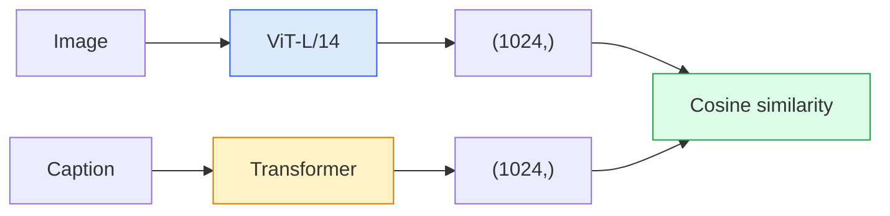

# Open-Vocabulary Vision — CLIP

> Train an image encoder and a text encoder together so that matching (image, caption) pairs land at the same point in a shared space. That is the whole trick.

**Type:** Build + Use
**Languages:** Python
**Prerequisites:** Phase 4 Lesson 14 (ViT), Phase 4 Lesson 17 (Self-Supervised)
**Time:** ~45 minutes

## Learning Objectives

- Explain CLIP's two-tower architecture and contrastive objective
- Use pretrained CLIP/SigLIP for zero-shot classification
- Implement zero-shot classification from scratch
- Distinguish CLIP, SigLIP, OpenCLIP, LLaVA

## The Problem

Traditional classifiers are closed-vocabulary: 1000 classes only. CLIP trains on 400M (image, caption) pairs and classifies into any set at inference.

## The Concept

### Two towers



### Contrastive objective

```
sim_matrix = image_embeddings @ text_embeddings.T / tau
loss = (cross_entropy(sim_matrix, arange(N)) + cross_entropy(sim_matrix.T, arange(N))) / 2
```

### SigLIP: per-pair sigmoid loss

```
loss = mean of log(1 + exp(-y_ij * sim_ij))
```

Removes batch-level normalisation; trains better at small batches.

### Zero-shot classification

1. Compose prompt per class: "a photo of a {class}"
2. Encode all prompts -> T (C, d)
3. Encode image -> I (1, d)
4. I @ T.T -> (1, C) -> argmax

## Build It

### Step 1: Tiny two-tower model

```python
import torch
import torch.nn as nn
import torch.nn.functional as F

class TwoTower(nn.Module):
    def __init__(self, img_in=128, txt_in=64, emb=64):
        super().__init__()
        self.image_proj = nn.Sequential(nn.Linear(img_in, 128), nn.ReLU(), nn.Linear(128, emb))
        self.text_proj = nn.Sequential(nn.Linear(txt_in, 128), nn.ReLU(), nn.Linear(128, emb))
        self.logit_scale = nn.Parameter(torch.ones([]) * 2.6592)

    def forward(self, img_feats, txt_feats):
        i = F.normalize(self.image_proj(img_feats), dim=-1)
        t = F.normalize(self.text_proj(txt_feats), dim=-1)
        return i, t, self.logit_scale.exp()
```

### Step 2: Contrastive loss

```python
def clip_loss(image_emb, text_emb, logit_scale):
    N = image_emb.size(0)
    sim = logit_scale * image_emb @ text_emb.T
    targets = torch.arange(N, device=sim.device)
    l_i = F.cross_entropy(sim, targets)
    l_t = F.cross_entropy(sim.T, targets)
    return (l_i + l_t) / 2
```

### Step 3: Zero-shot classifier

```python
@torch.no_grad()
def zero_shot_classify(model, image_feats, class_text_feats, class_names):
    i = F.normalize(model.image_proj(image_feats), dim=-1)
    t = F.normalize(model.text_proj(class_text_feats), dim=-1)
    sim = i @ t.T
    pred = sim.argmax(dim=-1)
    return [class_names[p] for p in pred.tolist()]
```

### Step 4: Sanity check

```python
torch.manual_seed(0)
model = TwoTower()

img = torch.randn(8, 128)
txt = torch.randn(8, 64)
i, t, scale = model(img, txt)
loss = clip_loss(i, t, scale)
print(f"loss: {loss.item():.3f} (expected ~log(8) = 2.08)")
```

## Use It

```python
import open_clip

model, _, preprocess = open_clip.create_model_and_transforms("ViT-B-32", pretrained="laion2b_s34b_b79k")
tokenizer = open_clip.get_tokenizer("ViT-B-32")

image = preprocess(Image.open("dog.jpg")).unsqueeze(0)
text = tokenizer(["a photo of a dog", "a photo of a cat", "a photo of a car"])

with torch.no_grad():
    image_features = model.encode_image(image)
    text_features = model.encode_text(text)
    image_features = image_features / image_features.norm(dim=-1, keepdim=True)
    text_features = text_features / text_features.norm(dim=-1, keepdim=True)
    probs = (100.0 * image_features @ text_features.T).softmax(dim=-1)

print(probs)
```

## Ship It

- `outputs/prompt-zero-shot-class-picker.md`
- `outputs/skill-image-text-retriever.md`

## Exercises

1. **(Easy)** Zero-shot CIFAR-10 with 80 templates; report accuracy.
2. **(Medium)** Compare single-template vs 80-template averaged embeddings.
3. **(Hard)** Build zero-shot image retrieval index with FAISS.

## Key Terms

## Further Reading

- [CLIP (Radford et al., 2021)](https://arxiv.org/abs/2103.00020)
- [SigLIP (Zhai et al., 2023)](https://arxiv.org/abs/2303.15343)
- [OpenCLIP](https://github.com/mlfoundations/open_clip)

[Reference](https://github.com/rohitg00/ai-engineering-from-scratch/tree/main/phases/04-computer-vision/18-open-vocab-clip)
