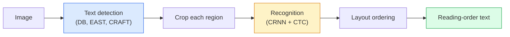

# OCR & Document Understanding

> OCR is a three-stage pipeline — detect text boxes, recognise the characters, then lay them out. Every modern OCR system reorders these stages or merges them.

**Type:** Learn + Use
**Languages:** Python
**Prerequisites:** Phase 4 Lesson 06 (Detection), Phase 7 Lesson 02 (Self-Attention)
**Time:** ~45 minutes

## Learning Objectives

- Trace classical OCR pipeline and modern end-to-end alternatives (Donut, Qwen-VL-OCR)
- Implement CTC loss for sequence-to-sequence OCR training
- Use PaddleOCR or EasyOCR for production document parsing
- Distinguish OCR, layout parsing, and document understanding

## The Problem

Images full of text: receipts, invoices, IDs, forms. Extracting structured data from them is one of the highest-value applied-vision problems.

## The Concept

### Classical pipeline



### CTC

CTC marginalises over alignments. Raw output "h h h _ _ e e l l _ l l o _ _" reduces to "hello".

### Modern end-to-end

- Donut: ViT encoder + text decoder, emits JSON directly.
- TrOCR, Qwen-VL-OCR: VLMs fine-tuned for OCR.

## Build It

### Step 1: CTC loss + greedy decoder

```python
import torch
import torch.nn.functional as F

def ctc_loss(log_probs, targets, input_lengths, target_lengths, blank=0):
    return F.ctc_loss(log_probs, targets, input_lengths, target_lengths,
                      blank=blank, reduction="mean", zero_infinity=True)

def greedy_ctc_decode(log_probs, blank=0):
    preds = log_probs.argmax(dim=-1).transpose(0, 1).cpu().tolist()
    out = []
    for seq in preds:
        decoded = []
        prev = None
        for idx in seq:
            if idx != prev and idx != blank:
                decoded.append(idx)
            prev = idx
        out.append(decoded)
    return out
```

### Step 2: Tiny CRNN recogniser

```python
import torch.nn as nn

class TinyCRNN(nn.Module):
    def __init__(self, vocab_size=40, hidden=128, feat=32):
        super().__init__()
        self.cnn = nn.Sequential(
            nn.Conv2d(1, feat, 3, 1, 1), nn.BatchNorm2d(feat), nn.ReLU(inplace=True),
            nn.MaxPool2d(2),
            nn.Conv2d(feat, feat * 2, 3, 1, 1), nn.BatchNorm2d(feat * 2), nn.ReLU(inplace=True),
            nn.MaxPool2d(2),
            nn.Conv2d(feat * 2, feat * 4, 3, 1, 1), nn.BatchNorm2d(feat * 4), nn.ReLU(inplace=True),
            nn.MaxPool2d((2, 1)),
            nn.Conv2d(feat * 4, feat * 4, 3, 1, 1), nn.BatchNorm2d(feat * 4), nn.ReLU(inplace=True),
            nn.MaxPool2d((2, 1)),
        )
        self.rnn = nn.LSTM(feat * 4, hidden, bidirectional=True, batch_first=True)
        self.head = nn.Linear(hidden * 2, vocab_size)

    def forward(self, x):
        f = self.cnn(x)
        f = f.mean(dim=2).transpose(1, 2)
        h, _ = self.rnn(f)
        return F.log_softmax(self.head(h).transpose(0, 1), dim=-1)
```

### Step 3: Synthetic OCR data

```python
import numpy as np

def synthetic_line(text, height=32, char_width=16):
    W = char_width * len(text)
    img = np.ones((height, W), dtype=np.float32)
    for i, c in enumerate(text):
        x = i * char_width
        shade = 0.0 if c.isalnum() else 0.5
        img[6:height - 6, x + 2:x + char_width - 2] = shade
    return img

def build_batch(strings, vocab):
    H = 32
    W = 16 * max(len(s) for s in strings)
    imgs = np.ones((len(strings), 1, H, W), dtype=np.float32)
    target_lengths = []
    targets = []
    for i, s in enumerate(strings):
        imgs[i, 0, :, :16 * len(s)] = synthetic_line(s)
        ids = [vocab.index(c) for c in s]
        targets.extend(ids)
        target_lengths.append(len(ids))
    return torch.from_numpy(imgs), torch.tensor(targets), torch.tensor(target_lengths)

vocab = ["_"] + list("0123456789abcdefghijklmnopqrstuvwxyz")
imgs, targets, lengths = build_batch(["hello", "world"], vocab)
print(f"images: {imgs.shape}")
```

### Step 4: Training sketch

```python
model = TinyCRNN(vocab_size=len(vocab))
opt = torch.optim.Adam(model.parameters(), lr=1e-3)

for step in range(200):
    strings = ["abc" + str(step % 10)] * 4 + ["xyz" + str((step + 1) % 10)] * 4
    imgs, targets, target_lens = build_batch(strings, vocab)
    log_probs = model(imgs)
    input_lens = torch.full((8,), log_probs.size(0), dtype=torch.long)
    loss = ctc_loss(log_probs, targets, input_lens, target_lens, blank=0)
    opt.zero_grad(); loss.backward(); opt.step()
```

## Use It

- PaddleOCR: `paddleocr.PaddleOCR(lang="en").ocr(image_path)`
- EasyOCR: Python-native
- Donut: ViT + text decoder for end-to-end document parsing

```python
from transformers import DonutProcessor, VisionEncoderDecoderModel

processor = DonutProcessor.from_pretrained("naver-clova-ix/donut-base-finetuned-cord-v2")
model = VisionEncoderDecoderModel.from_pretrained("naver-clova-ix/donut-base-finetuned-cord-v2")
```

## Ship It

- `outputs/prompt-ocr-stack-picker.md`
- `outputs/skill-ctc-decoder.md`

## Exercises

1. **(Easy)** Train TinyCRNN on 5-digit numbers; report CER.
2. **(Medium)** Replace greedy with beam search; report CER delta.
3. **(Hard)** Use PaddleOCR on 20 receipts; compute F1 on item_name/price.

## Key Terms

## Further Reading

- [CRNN (Shi et al., 2015)](https://arxiv.org/abs/1507.05717)
- [CTC (Graves et al., 2006)](https://www.cs.toronto.edu/~graves/icml_2006.pdf)
- [Donut (Kim et al., 2022)](https://arxiv.org/abs/2111.15664)
- [PaddleOCR](https://github.com/PaddlePaddle/PaddleOCR)

[Reference](https://github.com/rohitg00/ai-engineering-from-scratch/tree/main/phases/04-computer-vision/19-ocr-document-understanding)
