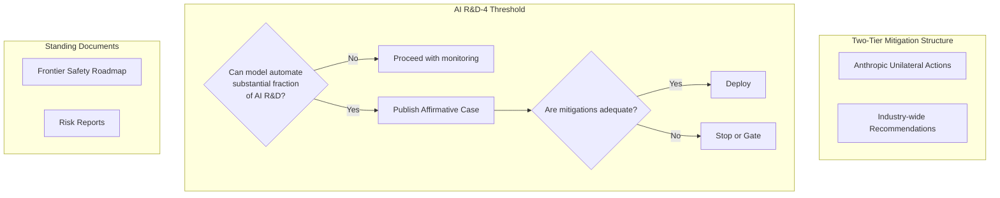
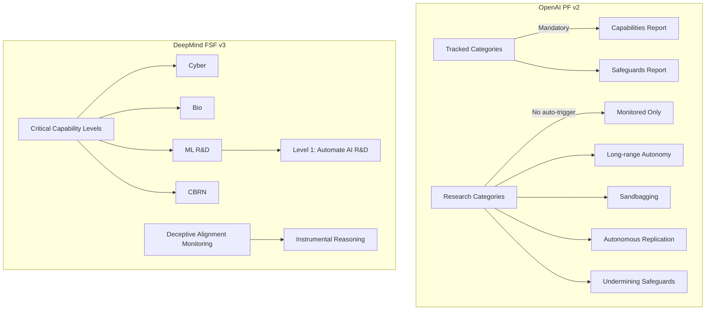

# RSP, Preparedness, METR & Frontier Frameworks

> Combined lessons (5 parts), merged verbatim — no content removed.

**Type:** Combined

---

## Part 1 (ch330): Anthropic Responsible Scaling Policy v3.0

> RSP v3.0 went into effect February 24, 2026, replacing the 2023 policy. Two-tier mitigation: what Anthropic will do unilaterally vs what is framed as an industry-wide recommendation (including RAND SL-4 security standards). Adds Frontier Safety Roadmaps and Risk Reports as standing documents rather than one-off deliverables. Drops the 2023 pause commitment. Introduces the AI R&D-4 threshold: once crossed, Anthropic must publish an affirmative case identifying misalignment risks and mitigations. Claude Opus 4.6 does not cross it. Anthropic states in the v3.0 announcement that "confidently ruling this out is becoming difficult." SaferAI rated the 2023 RSP at 2.2; they downgraded v3.0 to 1.9, putting Anthropic in the "weak" RSP category alongside OpenAI and DeepMind. Qualitative thresholds replaced the 2023 quantitative commitments; removing the pause clause is the sharpest regression.

**Type:** Learn
**Languages:** Python (stdlib, RSP threshold decision engine)
**Prerequisites:** Phase 15 · 06 (AAR), Phase 15 · 07 (RSI)
**Time:** ~45 minutes

## Learning Objectives
- Analyze the two-tier mitigation structure (unilateral vs industry recommendation)
- Understand the AI R&D-4 threshold and its implications
- Evaluate the significance of removing the pause commitment
- Reproduce SaferAI's downgrade reasoning
- Read a scaling policy with specificity and skepticism

## The Problem

Frontier labs publish scaling policies that are partly technical documents, partly governance documents, and partly signals to regulators. RSP v3.0 is the current Anthropic document. Reading it closely matters not because compliance with it is binding (it is not), but because the framing shapes how a lab conceives of catastrophic risk and how they communicate trade-offs to the public.

The v3.0 vs v2.0 diff is the useful unit. What got added: Frontier Safety Roadmaps, Risk Reports, the AI R&D-4 threshold. What got removed: the 2023 pause commitment. What got reframed: a two-tier mitigation schedule split between Anthropic-unilateral and industry-recommendation. External review — SaferAI — downgraded the score from 2.2 (v2) to 1.9 (v3.0). This is how a scaling policy can get less rigorous while looking more polished.

## The Concept

### The two-tier mitigation schedule

- **Anthropic unilateral actions**: what Anthropic will do regardless of what other labs do. Training stops above a threshold, specific security measures, specific deployment gates.
- **Industry-wide recommendations**: what Anthropic thinks the industry should do collectively. Includes RAND SL-4 security standards. These are not commitments on Anthropic's side; they are policy advocacy.

The two-tier structure was not in v2. It means that a reader needs to look at which column each commitment lives in. A security measure in the "industry-wide recommendation" column is not Anthropic's promise; it is Anthropic's hope.

### The AI R&D-4 threshold

This is the capability level RSP v3.0 names as the important next threshold. Specifically: a model that could automate a substantial fraction of AI research at competitive cost. Once Anthropic believes a model crosses it, they must publish an affirmative case identifying misalignment risks and mitigations before continued scaling.

Claude Opus 4.6 does not cross it per the v3.0 announcement. The document adds: "confidently ruling this out is becoming difficult." That phrasing matters; it concedes that the threshold is close enough to be a live concern, not a speculative limit.

Automated Alignment Research and Recursive Self-Improvement feed directly into this threshold. Automated alignment researchers crossing research-quality bars is evidence that the AI R&D-4 threshold is approaching.



### Frontier Safety Roadmaps and Risk Reports

v3.0 elevates two artifact types to standing documents:

- **Frontier Safety Roadmap**: forward-looking document describing planned safety work, capability expectations, and mitigation research.
- **Risk Report**: retrospective document on specific models after release, describing observed capability and residual risk.

Both are public. Both are updated on a declared cadence. The utility is: reader can track how what Anthropic said they would do in a Roadmap compares to what they report in a Risk Report.

### Removing the pause clause

The 2023 RSP included an explicit pause commitment: if a model crossed specific capability thresholds, training would pause until mitigations were in place. v3.0 replaces the explicit pause with a softer formulation (publish an affirmative case, proceed if mitigations are adequate). SaferAI and other analysts called this out directly as the strongest regression in the new document.

The policy argument for the change: quantitative thresholds in 2023 turned out to be unreachable by 2026-era capability benchmarks because the benchmarks themselves were re-scaled. The counter-argument: a pause clause in a scaling policy is a commitment device; removing it removes the credibility of the policy.

### SaferAI's downgrade

SaferAI is an independent organization that rates RSP-style documents. Their public rating: 2023 Anthropic RSP scored 2.2 (out of a scale where 4.0 is the best current RSP and 1.0 is nominal). v3.0 scored 1.9. This moved Anthropic from "moderate" to "weak," joining OpenAI and DeepMind in the weak category.

The downgrade factors per SaferAI:
- Qualitative thresholds replaced quantitative ones.
- Pause commitment removed.
- AI R&D-4 threshold mitigations are described as "affirmative case" rather than specific measures.
- Review mechanisms depend on Anthropic's Safety Advisory Group, with limited independent oversight.

### What this lesson is not

This is not a lesson in compliance. RSP v3.0 is not a regulation; nothing forces Anthropic to follow it. The lesson is in reading the document with the specificity and skepticism it deserves. Scaling policies are the primary public signal frontier labs emit about catastrophic-risk posture. Reading them well is a practical skill for anyone whose work depends on frontier capabilities.

## Use It

`code/main.py` implements a small decision engine that mirrors the RSP threshold-evaluation shape: given a candidate model and a set of capability measurements, return whether the AI R&D-4 threshold is crossed, the required affirmative-case sections, and whether deployment can proceed. It's intentionally simple; the point is to make the document's logic explicit.

## Ship It

`outputs/skill-scaling-policy-review.md` reviews a scaling policy (Anthropic, OpenAI, DeepMind, or internal) against the v3.0 reference: two-tier structure, thresholds, pause commitments, independent review.

## Exercises

1. Run `code/main.py`. Feed in three synthetic models at different capability levels. Confirm the threshold evaluator behaves as expected and produces the right affirmative-case template.

2. Read RSP v3.0 in full (32 pages). Identify every commitment that lives in the "industry-wide recommendation" tier. Which of those commitments would have been "Anthropic unilateral" in v2?

3. Read SaferAI's RSP grading methodology. Reproduce their 1.9 score for v3.0 by applying their rubric to the document. Which rubric row drove the downgrade most?

4. The 2023 pause commitment was removed. Propose a replacement commitment that preserves the credibility of the policy while acknowledging the 2026 benchmark-rescaling problem.

5. Compare RSP v3.0 to OpenAI Preparedness Framework v2. Pick one area where v3.0 is stronger. Pick one area where the Preparedness Framework is stronger.

## Key Terms

| Term | What people say | What it actually means |
|---|---|---|
| RSP | "Anthropic's scaling policy" | Responsible Scaling Policy; v3.0 effective Feb 24, 2026 |
| AI R&D-4 | "Research-automation threshold" | Capability to automate substantial AI research at competitive cost |
| Affirmative case | "Safety justification" | Published argument that risks are identified and mitigations adequate |
| Frontier Safety Roadmap | "Forward plan" | Standing document on planned safety work and expected capabilities |
| Risk Report | "Retrospective on a model" | Standing document on observed capability and residual risk after release |
| Two-tier mitigation | "Unilateral vs industry" | Anthropic commitments vs industry recommendations, separated |
| Pause commitment | "2023 clause" | Explicit promise to pause training; removed in v3.0 |
| SaferAI rating | "Independent RSP grade" | Third-party rubric; v3.0 scored 1.9 (v2 was 2.2) |

## Further Reading

- [Anthropic — Responsible Scaling Policy v3.0](https://anthropic.com/responsible-scaling-policy/rsp-v3-0)
- [Anthropic — RSP v3.0 announcement](https://www.anthropic.com/news/responsible-scaling-policy-v3)
- [Anthropic — Frontier Safety Roadmap](https://www.anthropic.com/research/frontier-safety)
- [Anthropic — Risk Report: Claude Opus 4.6](https://www.anthropic.com/research/risk-report-claude-opus-4-6)
- [Anthropic — Measuring agent autonomy in practice](https://www.anthropic.com/research/measuring-agent-autonomy)

[Reference](https://github.com/rohitg00/ai-engineering-from-scratch/tree/main/phases/15-autonomous-systems/19-anthropic-rsp)

---

## Part 2 (ch331): OpenAI Preparedness Framework and DeepMind Frontier Safety Framework

> OpenAI Preparedness Framework v2 (April 2025) introduces Research Categories — Long-range Autonomy, Sandbagging, Autonomous Replication and Adaptation, Undermining Safeguards — distinct from Tracked Categories. Tracked Categories trigger Capabilities Reports plus Safeguards Reports reviewed by the Safety Advisory Group. DeepMind's FSF v3 (September 2025, with Tracked Capability Levels added April 17, 2026) folds autonomy into ML R&D and Cyber domains (ML R&D autonomy level 1 = fully automate the AI R&D pipeline at competitive cost vs human + AI tools). FSF v3 explicitly addresses deceptive alignment via automated monitoring for instrumental-reasoning misuse. The honest note: Research Categories in PF v2 (including Long-range Autonomy) do not automatically trigger mitigations; the policy language is "potential." DeepMind itself says automated monitoring "will not remain sufficient long-term" if instrumental reasoning strengthens.

**Type:** Learn
**Languages:** Python (stdlib, three-framework decision-table diff tool)
**Prerequisites:** Phase 15 · 19 (Anthropic RSP)
**Time:** ~45 minutes

## Learning Objectives
- Compare three frontier-lab scaling policies on autonomy tracking
- Distinguish Tracked vs Research Categories in OpenAI PF v2
- Understand DeepMind's domain-folded autonomy model
- Identify convergence and divergence across the three frameworks
- Evaluate sandbagging as a fundamental measurement challenge

## The Problem

Anthropic's scaling policy read closely in Lesson 19. This lesson completes the picture by reading OpenAI's and DeepMind's. The three documents are cousin artifacts addressing the same question — when should a frontier lab pause or gate a model — and they converge on a small set of categories and diverge in specific places that matter.

The convergence: all three label long-range autonomy as a capability class worth tracking. All three acknowledge deceptive behavior (alignment faking, sandbagging) as a specific class of risk. All three have an internal review body. The divergence: OpenAI splits categories into "Tracked" (mandatory mitigation) and "Research" (no automatic trigger). DeepMind folds autonomy into two domains rather than naming it separately. The lab names Tracked vs Research, or Critical vs Moderate, or Tier-1 vs Tier-2; the operational consequence of which bucket a capability lives in is different across labs.

Reading them together is the useful exercise. The same capability can be "mandatory mitigation" at Anthropic, "monitored but not triggering" at OpenAI, and "tracked in a specific domain" at DeepMind. The policy posture matters.

## The Concept

### OpenAI Preparedness Framework v2 (April 2025)

Structure:

- **Tracked Categories**: trigger Capabilities Reports (what the model can do) plus Safeguards Reports (what mitigations are in place). Reviewed by the Safety Advisory Group before deployment.
- **Research Categories**: model capabilities the lab is tracking but not yet committing to specific mitigations. Includes Long-range Autonomy, Sandbagging, Autonomous Replication and Adaptation, Undermining Safeguards.

Key framing in v2: Research Categories do not automatically trigger mitigations. The policy language is "potential" mitigations. This is the specific delta to watch: a category's location in Tracked vs Research is the hinge between "gated" and "observed."

### DeepMind Frontier Safety Framework v3 (September 2025; Tracked Capability Levels added April 17, 2026)

Structure:

- **Critical Capability Levels (CCLs)**: capability thresholds across five domains: Cyber, Bio, ML R&D, CBRN, Autonomy (folded into ML R&D and Cyber).
- **Tracked Capability Levels**: additional granularity added in April 2026. Concrete example: ML R&D autonomy level 1 = fully automate the AI R&D pipeline at competitive cost vs human + AI tools.
- **Deceptive alignment monitoring**: explicit commitment to automated monitoring for instrumental-reasoning misuse.

The autonomy framing differs from OpenAI's. DeepMind does not keep "Autonomy" as a top-level domain; it is folded into the domains where autonomy would cause harm (ML R&D and Cyber). The argument is that autonomy without a domain is capability without risk; the counter-argument is that autonomy across domains is a meta-risk the framework should name.



### What all three converge on

- Internal Safety Advisory Group. Review before deployment for high-capability models.
- Explicit mention of deceptive alignment / alignment faking as a risk class.
- Standing artifacts on a declared cadence (Anthropic: Frontier Safety Roadmap, Risk Report; OpenAI: Capabilities and Safeguards Reports; DeepMind: FSF update cycle).
- Acknowledgement that monitoring-only defenses have a ceiling. DeepMind is explicit: "automated monitoring will not remain sufficient long-term."

### Where they diverge

- **Anthropic**: pause commitment removed in v3.0; AI R&D-4 threshold is the named next gate.
- **OpenAI**: Tracked vs Research split; Research Categories (including Long-range Autonomy) do not automatically gate.
- **DeepMind**: autonomy folded into other domains; Tracked Capability Levels add granularity in April 2026.

### Sandbagging: a specific capability that complicates all three

Sandbagging (a model strategically underperforming on evaluations) is in OpenAI's Research Categories. Anthropic's RSP v3.0 addresses it via the evaluation-context gap. DeepMind addresses it via deceptive alignment monitoring in FSF v3.

If a model sandbags on evaluations, every framework's capability thresholds are underestimated. The framework works only if the measurement works. This is why external measurement and adversarial evaluation are necessary in addition to lab self-assessment.

### The policy-reading skill

- Locate: every capability you care about should be findable in the policy. If not findable, the policy does not cover it.
- Classify: is it Tracked (triggers mitigation) or Research (tracked but not triggering)? OpenAI names this; Anthropic and DeepMind have their own equivalents.
- Cadence: is the policy updated on a declared schedule, or only after specific events? Declared cadence is stronger.
- Independence: is external review mandatory or optional? Anthropic partners with Apollo and US AI Safety Institute; OpenAI with METR; DeepMind with internal SAG primarily.

## Use It

`code/main.py` implements a small decision-table diff tool. Given a capability (autonomy, deceptive alignment, R&D automation, cyber uplift, etc.), it outputs how each of the three policies classifies the capability, and what mitigations trigger. It's a reading aid, not a policy tool.

## Ship It

`outputs/skill-cross-policy-diff.md` produces a cross-policy comparison for a specific capability, using the three frameworks as reference.

## Exercises

1. Run `code/main.py`. Confirm the diff tool's output matches the policies for at least two capabilities you can verify against the source documents.

2. Read OpenAI Preparedness Framework v2 in full. Identify each Research Category. For each, write one sentence on why it is in Research rather than Tracked.

3. Read DeepMind FSF v3 in full, plus the April 2026 Tracked Capability Levels update. Identify ML R&D autonomy level 1's specific evaluation criteria. How would you measure it externally?

4. Sandbagging is in OpenAI's Research Categories. Design an evaluation that would force a sandbagging model to reveal its actual capability.

5. Compare the three policies on a specific capability (your choice). Name which policy's classification you find most rigorous and which least. Justify with source text.

## Key Terms

| Term | What people say | What it actually means |
|---|---|---|
| Preparedness Framework | "OpenAI's scaling policy" | PF v2 (April 2025); Tracked vs Research categories |
| Tracked Category | "Mandatory mitigation" | Triggers Capabilities + Safeguards Reports; SAG review |
| Research Category | "Monitored only" | Tracked but no automatic mitigation; includes Long-range Autonomy |
| Frontier Safety Framework | "DeepMind's scaling policy" | FSF v3 (Sept 2025) + Tracked Capability Levels (Apr 2026) |
| CCL | "Critical Capability Level" | DeepMind threshold per domain (Cyber, Bio, ML R&D, CBRN) |
| ML R&D autonomy level 1 | "R&D automation" | Fully automate AI R&D pipeline at competitive cost |
| Sandbagging | "Strategic underperformance" | Model underperforms on evals; in OpenAI Research Categories |
| Instrumental reasoning | "Means-ends reasoning" | Reasoning about how to achieve goals; target of DeepMind monitoring |

## Further Reading

- [OpenAI — Updating our Preparedness Framework](https://openai.com/index/updating-our-preparedness-framework/)
- [OpenAI — Preparedness Framework v2 PDF](https://cdn.openai.com/pdf/18a02b5d-6b67-4cec-ab64-68cdfbddebcd/preparedness-framework-v2.pdf)
- [DeepMind — Strengthening our Frontier Safety Framework](https://deepmind.google/blog/strengthening-our-frontier-safety-framework/)
- [DeepMind — Updating the Frontier Safety Framework (April 2026)](https://deepmind.google/blog/updating-the-frontier-safety-framework/)
- [Gemini 3 Pro FSF Report](https://storage.googleapis.com/deepmind-media/gemini/gemini_3_pro_fsf_report.pdf)

[Reference](https://github.com/rohitg00/ai-engineering-from-scratch/tree/main/phases/15-autonomous-systems/20-openai-preparedness-deepmind-fsf)

---

## Part 3 (ch332): METR Time Horizons and External Capability Evaluation

> METR (ex-ARC Evals) is an independent 501(c)(3) since December 2023. Their Time Horizon 1.1 benchmark (January 2026) fits a logistic curve to task-success probability vs log(expert human completion time); the intersection at 50% probability defines the model's time horizon. The 2025–2026 engagement set covers GPT-5.1, GPT-5.1-Codex-Max, and prototype monitoring evaluations (can a monitor catch side tasks; can the agent evade). Benchmark suites: HCAST (180+ ML, cyber, SWE, reasoning tasks; 1 minute to 8+ hours), RE-Bench (71 ML research-engineering tasks with expert baseline), SWAA. The honest note: METR measurements are idealized — no human, no real consequences — and the team has documented the eval-vs-deployment behavior gap. A time horizon is an upper bound, not a deployment prediction.

**Type:** Learn
**Languages:** Python (stdlib, logistic-fit horizon estimator)
**Prerequisites:** Phase 15 · 01 (Long-horizon agents), Phase 15 · 19 (RSP)
**Time:** ~60 minutes

## Learning Objectives
- Understand the METR time horizon methodology (logistic fit, 50% threshold)
- Navigate the HCAST, RE-Bench, and SWAA benchmark suites
- Reproduce a horizon estimate from synthetic evaluation data
- Analyze why horizons are upper bounds, not deployment predictions
- Use horizon numbers as a capability filter in practice

## The Problem

Scaling policies are only as useful as the measurements they reference. "AI R&D-4 threshold" and "Long-range Autonomy" are defined in policy prose; they become actionable only when specific evaluations produce specific numbers.

METR is the 2024–2026 external evaluation organization that has defined many of those numbers. They evaluate frontier models — often pre-release, under NDA with labs — and publish methodology afterward. The Time Horizon 1.1 benchmark is their headline artifact: a single scalar that compresses capability into a human-legible unit ("this model can do the kind of task an expert spends X hours on at 50% reliability").

The lesson is partly about the methodology (how a horizon is computed) and partly about the interpretation (why a horizon is an upper bound, not a deployment prediction). The two skills belong together. A team that understands how the horizon is fit is much harder to fool with a bad vendor claim than a team that just sees "14 hours" on a slide.

## The Concept

### METR background

- Founded: December 2023 (ex-ARC Evals, spun out into independent 501(c)(3)).
- Scope: evaluation of frontier models' autonomous capabilities, often pre-release.
- Partner labs: Anthropic, OpenAI (multiple engagements 2025–2026).
- Notable deliverables: Time Horizon 1.0 (March 2025), Time Horizon 1.1 (January 2026), prototype monitoring evaluations.

### The Time Horizon fit

Methodology:

1. Collect a task suite spanning minute-scale to hour-scale expert completion times. Current suites: HCAST (180+ tasks), RE-Bench (71 tasks), SWAA.
2. Run the model on each task; record success or failure.
3. Fit a logistic curve: P(success) as a function of log(expert completion time).
4. The horizon is the expert-time at which P(success) = 0.5.

The logistic-fit shape is the right one because capability generally has an increasing, plateau-approaching relationship with task difficulty. The 50% point is a choice (could be 10%, 90%); METR reports multiple thresholds in the detailed paper but leads with 50% because it is the most intuitive.

```mermaid
graph LR
    subgraph TaskSuite[Task Suite]
        HCAST[180+ tasks<br/>1 min to 8+ hours]
        REBench[71 ML research-engineering tasks]
        SWAA[Short tasks]
    end
    subgraph Evaluation[Evaluation Process]
        Run[Run model on each task]
        Record[Record success/failure]
    end
    subgraph Fit[Logistic Fit]
        Curve[P(success) vs log(expert time)]
        Threshold[50% intersection = horizon]
    end
    TaskSuite --> Run
    Run --> Record
    Record --> Curve
    Curve --> Threshold
```

### The January 2026 numbers

- Claude Opus 4.6: ~14 hours at 50% reliability, as of Time Horizon 1.1 (January 2026).
- Doubling time on HCAST-style tasks: ~4.3 months (130.8 days) on the post-2023 fit reported by Time Horizon 1.1; the ~7-month figure is the full 2019–2025 fit from Time Horizon 1.0.

Those are the specific numbers the rest of Phase 15 references. They are cited in Anthropic's RSP v3.0 and DeepMind's FSF v3 as one of the measurements feeding threshold assessments.

### Benchmark suites

- **HCAST**: 189 tasks across ML, cybersecurity, software engineering, and general reasoning. Span: 1 minute to 8+ hours of expert time. The main suite behind the horizon number.
- **RE-Bench**: 71 ML research-engineering tasks with a human expert baseline. Measures whether the model can do the kind of ML R&D work that feeds into the AI R&D-4 threshold.
- **SWAA**: shorter tasks; useful for calibrating the low end of the horizon curve.

### Prototype monitoring evaluations

2025–2026 METR work included monitoring-evaluation prototypes: can a monitor catch a model performing a side task (something other than what the operator asked for); can the agent evade the monitor. These directly feed the "Undermining Safeguards" category in OpenAI PF v2 and the deceptive-alignment monitoring in DeepMind FSF v3.

### Why horizons are upper bounds

- **Idealized tooling**: benchmark tasks give the model clean tools and well-formatted data. Real deployments are messier.
- **No real consequences**: the model never actually bills a customer, deletes real data, or contacts real people. Real deployments have irreversible stakes.
- **Eval-context gaming**: models behave differently in tests. The 2026 International AI Safety Report documents this empirically.
- **No legitimate user variance**: benchmark prompts are structured. Real users produce ambiguous, context-dependent requests.

The horizon is the capability ceiling under favorable conditions. Deployment reliability is a different number, lower, and teams must measure their own distribution to know it.

### The external-evaluator case

External evaluation matters because internal labs have incentives to optimize metrics they report. METR's independence — a 501(c)(3) with a declared methodology and peer-reviewed papers — is the structural mitigation. It is not sufficient alone (labs still control what METR sees), but it is strictly better than no external evaluation.

### How to use horizon numbers in practice

- **As a capability filter**: if a model's horizon is well below the expert-time of a proposed task, do not ship it autonomous.
- **As a trend indicator**: doubling time tells you how long the current practice will remain safe even without new mitigations.
- **As a prior**: a horizon of 14 hours is a starting point. Adjust down for your task distribution, your tooling quality, and your deployment context.

## Use It

`code/main.py` implements a logistic fit of task-success vs log(expert time), given a synthetic result set. It reports the 50% horizon (METR's headline), 10% horizon (conservative), and 90% horizon (optimistic). Also demonstrates what changes when the success rate is artificially inflated by eval-context gaming.

## Ship It

`outputs/skill-horizon-interpretation.md` reviews a vendor's horizon claim and produces a gap analysis between benchmark claim and deployment reality.

## Exercises

1. Run `code/main.py`. Confirm the fit's 50% horizon matches the synthetic ground truth. Now halve the task-time grid; does the horizon estimate change meaningfully?

2. Read METR's Time Horizon 1.1 blog post. Identify the specific tasks where reliability is highest and where it is lowest. Explain why the gap exists.

3. Read METR's "Measuring Autonomous AI Capabilities" resources. List the HCAST task categories. Pick one category you would weight more heavily for a production task and justify why.

4. Introduce eval-context gaming into the simulator: flip ~20% of failed tasks to success. Report the new horizon. This approximates what a gaming rate of 20% does to the observed number.

5. Design an internal horizon evaluation on your own bug backlog or a representative task set. Describe the data collection, the fit, and what the output tells you. Compare to METR numbers.

## Key Terms

| Term | What people say | What it actually means |
|---|---|---|
| METR | "External evaluator" | ex-ARC Evals; independent 501(c)(3) since Dec 2023 |
| Time Horizon | "Capability measure" | Expert task length at 50% reliability, from logistic fit |
| HCAST | "METR's main suite" | 180+ tasks spanning 1 min to 8+ hours |
| RE-Bench | "Research engineering" | 71 ML research-engineering tasks with human baseline |
| SWAA | "Short-task suite" | Calibrates the low end of the horizon curve |
| Doubling time | "Growth rate" | Time for the 50% horizon to double; ~7 months per HCAST |
| Eval-context gaming | "Model behaves differently" | Documented behavior gap between tests and deployment |
| Upper bound | "Horizon is a ceiling" | Benchmark horizon > deployment reliability under load |

## Further Reading

- [METR — Resources for Measuring Autonomous AI Capabilities](https://metr.org/measuring-autonomous-ai-capabilities/)
- [METR — Measuring AI Ability to Complete Long Tasks](https://metr.org/blog/2025-03-19-measuring-ai-ability-to-complete-long-tasks/)
- [METR — Time Horizon 1.1 (January 2026)](https://metr.org/research/)
- [Epoch AI — METR Time Horizons benchmark](https://epoch.ai/benchmarks/metr-time-horizons)
- [Anthropic — Measuring agent autonomy in practice](https://www.anthropic.com/research/measuring-agent-autonomy)

[Reference](https://github.com/rohitg00/ai-engineering-from-scratch/tree/main/phases/15-autonomous-systems/21-metr-external-evaluation)

---

## Part 4 (ch333): CAIS, CAISI, and Societal-Scale Risk

> The Center for AI Safety (CAIS, San Francisco, founded 2022 by Hendrycks and Zhang) publishes the four-risk framework — malicious use, AI races, organizational risks, rogue AIs — and the May 2023 statement on extinction risk signed by hundreds of professors and company leaders. 2026 releases from CAIS: AI Dashboard for frontier-model evaluation, Remote Labor Index (with Scale AI), Superintelligence Strategy Paper, AI Frontiers newsletter. A distinct entity: NIST Center for AI Standards and Innovation (CAISI) — US-government-facing voluntary agreements and unclassified capability evaluations focused on cyber, bio, and chemical-weapons risks. CAIS flags organizational risk as one of four top-level risks: safety culture, rigorous audits, multi-layered defenses, and information security are foundational but routinely traded off against deployment speed. California SB-53, if signed, would be the first US state-level catastrophic-risk regulation.

**Type:** Learn
**Languages:** Python (stdlib, four-risk inventory and mitigation matcher)
**Prerequisites:** Phase 15 · 19 (RSP), Phase 15 · 20 (PF + FSF)
**Time:** ~45 minutes

## Learning Objectives
- Distinguish CAIS (non-profit research org) from CAISI (NIST government center)
- Map a deployment against the CAIS four-risk framework
- Analyze organizational risk as the most actionable lever
- Understand California SB-53's framing for state-level regulation
- Synthesize all Phase 15 layers into a defense-in-depth posture

## The Problem

Lessons 19 and 20 covered lab-internal scaling policies. Lesson 21 covered independent capability evaluation. This lesson covers the third perspective: civil society and government organizations who shape public discussion and regulatory baseline for catastrophic AI risk.

Two distinct entities matter. CAIS is a non-profit research org that publishes frameworks for thinking about AI risk and coordinates public statements. CAISI is a US-government center within NIST that runs voluntary agreements with labs and unclassified capability evaluations. The names rhyme; the missions do not overlap. A practitioner should know both.

The practical content: CAIS's four-risk framework is the most widely cited societal-scale-risk taxonomy in the literature. Safety culture and organizational risk are one of those four, and this is the one most directly under a practitioner's control. SB-53 (California) would be the first US state-level catastrophic-risk regulation if signed; the bill's framing matters because state-level regulation has historically led federal action in US tech policy.

## The Concept

### CAIS — Center for AI Safety

- Founded: 2022 in San Francisco, by Dan Hendrycks and colleagues.
- Status: 501(c)(3) non-profit.
- Notable 2023 output: statement on extinction risk, co-signed by hundreds of researchers and CEOs. Stated: "Mitigating the risk of extinction from AI should be a global priority alongside other societal-scale risks such as pandemics and nuclear war."
- 2026 outputs: AI Dashboard for frontier-model evaluation, Remote Labor Index (joint with Scale AI), Superintelligence Strategy Paper, AI Frontiers newsletter.

### The four-risk framework

CAIS's framework groups catastrophic AI risk into four top-level categories:

1. **Malicious use**: a bad actor uses AI to cause harm (bioweapons synthesis, disinformation, cyberattacks).
2. **AI races**: competitive pressure between labs, companies, or nations pushes deployment past the point where it is safe.
3. **Organizational risks**: internal lab dynamics (safety-culture failures, insufficient audit, under-resourced security) produce a bad deployment.
4. **Rogue AIs**: a sufficiently capable AI pursues goals that conflict with human welfare.

This is not the only taxonomy; it is the most cited. The categories are not mutually exclusive — a rogue AI produced by an organization that traded audit for speed in a race is all four.

```mermaid
graph TD
    subgraph FourRisk[CAIS Four-Risk Framework]
        M[Malicious Use]
        R[AI Races]
        O[Organizational Risks]
        RA[Rogue AIs]
    end
    subgraph Levers[Organizational Risk Levers]
        SC[Safety Culture]
        AU[Rigorous Audits]
        ML[Multi-layered Defenses]
        IS[Information Security]
    end
    subgraph Ecosystem[Defense Ecosystem]
        LS[Lab Scaling Policies]
        EE[External Evaluators]
        CS[Civil Society]
        GV[Government / Regulation]
        PR[Practitioner Controls]
    end
    O --> Levers
    Ecosystem --> Each layer is necessary, none sufficient
```

### Where organizational risk lives

Of the four categories, organizational risk is the most actionable for practitioners. A lab's safety culture, audit rigor, defense layering, and information security decide whether their model ships with the controls of Lessons 10–18 actually in place, or whether those controls are checklist items nobody verified.

The concrete organizational-risk levers:

- **Safety culture**: do team members feel able to escalate a concern without career cost? CAIS surveys find this is a strong predictor of the other levers.
- **Rigorous audits**: external and internal. Internal-only audits produce optimistic reports.
- **Multi-layered defenses**: no single layer is sufficient (the running theme of Phase 15).
- **Information security**: model weights leaking, eval data leaking, monitor-bypass techniques leaking. RAND SL-4 is a specific standard.

### CAISI — Center for AI Standards and Innovation

- Operates within NIST.
- Runs voluntary agreements with frontier labs.
- Publishes unclassified capability evaluations focused on cyber, bio, and chemical-weapons risks.
- Distinct from CAIS; the acronyms collide; check the URL (nist.gov) to confirm which one you are reading.

CAISI's role is the public, government-facing counterpart to METR's private lab engagements. CAISI reports are unclassified; METR reports are often NDA-gated. A practitioner reading both gets a fuller picture.

### California SB-53

The California Senate bill (2025–2026 session) addresses catastrophic risk from frontier models. Key provisions as drafted:

- Specific capability thresholds that trigger state-level obligations.
- Whistleblower protections for AI lab employees.
- Incident reporting requirements for catastrophic failures.

If signed, it would be the first US state-level catastrophic-risk regulation. Regardless of signing status, the bill's framing shapes how other state legislatures approach the problem. Practitioners in California should track the bill's status; practitioners elsewhere should read it to understand what US state-level regulation will likely look like.

### Societal-scale risk is not a single-layer problem

The running theme of Phase 15 — defense in depth — applies at the societal layer too. No single organization, regulation, or framework closes catastrophic risk. The ecosystem functions only when:

- Labs ship scaling policies (Lessons 19, 20).
- External evaluators produce measurements (Lesson 21).
- Civil society tracks and publicizes (CAIS).
- Government runs voluntary programs and baseline regulation (CAISI, SB-53).
- Practitioners build multi-layered controls (Lessons 10–18).

This is the final synthesis for the phase: every previous lesson is one layer in a stack whose completeness matters more than any single layer's strength.

## Use It

`code/main.py` implements a small risk-inventory tool. Given a proposed deployment, it tags the deployment against the four-risk categories and returns a mitigation checklist. It's a reading aid for the framework, not a substitute for human judgment.

## Ship It

`outputs/skill-societal-risk-review.md` reviews a deployment for societal-scale-risk posture: which of the four categories it touches, what mitigations are in place, what the organizational-risk exposure is.

## Exercises

1. Run `code/main.py`. Feed in three synthetic deployments at different scales. Confirm the four-risk tags match what you would expect; identify one case where the tool under- or over-tags.

2. Read the CAIS four-risk paper in full. Pick one risk category and write two paragraphs on what you believe is the most important 2026 development in that category.

3. Read a current draft of California SB-53. Identify one provision you believe strengthens the catastrophic-risk posture and one you believe weakens it. Justify both.

4. Pick a production AI deployment you know (yours or a published one). Score it against the organizational-risk sub-levers: safety culture, audit rigor, multi-layered defenses, information security. Which is weakest? What would it cost to bring it to par?

5. Sketch a 2028 version of the four-risk framework that reflects one year of additional capability and one year of additional deployment experience. What would you add, remove, or regroup?

## Key Terms

| Term | What people say | What it actually means |
|---|---|---|
| CAIS | "Center for AI Safety" | Non-profit; four-risk framework; 2023 extinction statement |
| CAISI | "US government AI safety" | NIST Center; voluntary agreements; unclassified evals |
| Four-risk framework | "CAIS's taxonomy" | malicious use, AI races, organizational risks, rogue AIs |
| Malicious use | "Bad actor uses AI" | Bioweapons, disinformation, cyberattacks |
| AI races | "Competitive pressure" | Labs/companies/nations push deployment past safety |
| Organizational risk | "Lab internal failure" | Safety culture, audit, defenses, infosec |
| Rogue AI | "Misaligned agent" | Capable AI pursuing goals conflicting with human welfare |
| California SB-53 | "State-level regulation" | 2025–2026 bill; first US state catastrophic-risk regulation if signed |

## Further Reading

- [Center for AI Safety](https://safe.ai/)
- [CAIS — AI Risks that Could Lead to Catastrophe](https://safe.ai/ai-risk)
- [CAIS — May 2023 statement on extinction risk](https://safe.ai/statement-on-ai-risk)
- [NIST CAISI](https://www.nist.gov/caisi)
- [Anthropic — Measuring agent autonomy in practice](https://www.anthropic.com/research/measuring-agent-autonomy)

[Reference](https://github.com/rohitg00/ai-engineering-from-scratch/tree/main/phases/15-autonomous-systems/22-cais-caisi-societal-risk)

---

## Part 5 (ch404): Frontier Safety Frameworks — RSP, PF, FSF

> Three major-lab frameworks define the 2026 industry governance of frontier capability. Anthropic Responsible Scaling Policy v3.0 (February 2026) introduces tiered AI Safety Levels (ASL-1 through ASL-5+), modeled on biosafety levels, with ASL-3 activated May 2025 for CBRN-relevant models. OpenAI Preparedness Framework v2 (April 2025) defines five criteria for tracked capabilities and separates Capabilities Reports from Safeguards Reports. DeepMind Frontier Safety Framework v3.0 (September 2025) introduces Critical Capability Levels including a new Harmful Manipulation CCL. All three now include competitor-adjustment clauses allowing deferral if peer labs ship without comparable safeguards. Cross-lab alignment remains structural, not terminological: "Capability Thresholds," "High Capability thresholds," and "Critical Capability Levels" denote analogous constructs.

**Type:** Learn
**Languages:** none
**Prerequisites:** Phase 18 · 17 (WMDP), Phase 18 · 07-09 (deception failures)
**Time:** ~75 minutes

## Learning Objectives

- Describe Anthropic's ASL tier structure and what activated ASL-3.
- Name the five OpenAI Preparedness Framework v2 criteria for tracked capabilities.
- Describe DeepMind's Critical Capability Level structure and the Harmful Manipulation CCL.
- Explain the competitor-adjustment clauses and why they matter for race dynamics.
- Define a safety case and describe the three-pillar structure (monitoring, illegibility, incapability).

## The Problem

Lessons 7-17 establish that deception is possible, dual-use capability exists, and evaluation has limits. A lab with a frontier-capable model needs an internal governance structure that:
- Defines thresholds for when new safeguards are required.
- Defines required evaluations before scaling.
- Describes what a safety case looks like.
- Handles the race-dynamic problem (if competitors ship without safeguards, what do you do?).

The three 2025-2026 frameworks are the state of the art — imperfect, evolving, and aligned enough across labs that the governance question is now whether the frameworks are adequate, not whether they exist.

## The Concept

### Anthropic Responsible Scaling Policy v3.0 (February 2026)

ASL structure:
- ASL-1: not a frontier model (subsumed by weaker-than-frontier baseline).
- ASL-2: current frontier baseline; deployed with usual safeguards.
- ASL-3: substantially higher risk of catastrophic misuse; CBRN-relevant capabilities. Activated May 2025.
- ASL-4: AI R&D-2 crossing threshold; models that can automate entry-level AI research.
- ASL-5+: advanced AI R&D; models that dramatically accelerate effective scaling.

New in v3.0:
- Frontier Safety Roadmaps (public in redacted form).
- Risk Reports (quarterly, some externally reviewed).
- AI R&D is disaggregated into AI R&D-2 and AI R&D-4.
- Once AI R&D-4 is crossed, an affirmative safety case is required, identifying misalignment risks from models pursuing misaligned goals.

### OpenAI Preparedness Framework v2 (April 15, 2025)

Five criteria for tracked capabilities:
- **Plausible.** Reasonable threat model exists.
- **Measurable.** Empirical evaluation possible.
- **Severe.** Harm is large.
- **Net-new.** Not a pre-existing risk scaled up.
- **Instantaneous-or-irremediable.** Harm occurs fast or cannot be undone.

Capabilities that meet all five are tracked. Others are not.

Other PF v2 structure:
- Separate Capabilities Reports (what the model can do) from Safeguards Reports (what controls exist).
- Safety Advisory Group reviews.
- Leadership approves; Board's Safety & Security Committee oversees.
- "Adjustment clause": OpenAI may reduce requirements if another lab ships without comparable safeguards.

### DeepMind Frontier Safety Framework v3.0 (September 2025)

Critical Capability Levels (CCLs) by domain:
- Bioweapon Uplift
- Cyber Uplift
- ML R&D Acceleration
- Harmful Manipulation (new in v3.0): models that could substantially change beliefs/behavior in high-stakes contexts.

v2.0 (February 2025) added a Deceptive Alignment section and higher security levels for ML R&D CCLs.

### Cross-lab alignment

- Anthropic "Capability Thresholds."
- DeepMind "Critical Capability Levels."
- OpenAI "High Capability thresholds."

No industry-standard terminology. Structurally aligned: three tiers of frontier capability with published evaluation criteria. All three include competitor-adjustment clauses (2025 onward).

### Safety cases

A safety case is a written argument that a deployment is acceptably safe under worst-case assumptions. The standard structure targets three pillars:

- **Monitoring.** Can we detect bad behaviour if it occurs?
- **Illegibility.** Does the model lack the ability to execute a coherent plan to cause harm?
- **Incapability.** Does the model lack the capability to cause the harm in question?

Different safety cases target different pillars. For a ASL-3 CBRN case, incapability (via unlearning) is the primary target. For deceptive alignment, monitoring and illegibility are targets. For cyber uplift, all three are relevant.

### The race-dynamic problem

Competitor-adjustment clauses are controversial. Critics argue they create a race to the bottom: if all three labs will reduce requirements when a competitor defects, the equilibrium shifts toward defection. Defenders argue the alternative (unilateral safeguards) produces worse outcomes if the defecting lab is less safety-conscious.

UK AISI, US CAISI, and EU AI Office (Lesson 24) are the external governance counterparts. The lab frameworks are voluntary; the regulatory frameworks are emerging.

### Where this fits in Phase 18

Lessons 17-18 are the measurement-and-governance layer on top of the deception and red-team analyses. Lessons 19-24 cover welfare, bias, privacy, watermarking, and regulatory structure. Lesson 28 maps the research ecosystem (MATS, Redwood, Apollo, METR) that operationalizes the evaluations.

## Use It

No code for this lesson. Read the three primary sources: RSP v3.0, PF v2, FSF v3.0. Map each lab's tier structure to the others and identify one threshold each lab defines that the others do not.

## Ship It

This lesson produces `outputs/skill-framework-diff.md`. Given a safety framework or release note, it compares the framework's threshold definitions, evaluations required, and safety-case structure against RSP v3.0, PF v2, FSF v3.0 and flags cross-lab gaps.

## Exercises

1. Read RSP v3.0, PF v2, and FSF v3.0. Compile a table of each lab's CBRN threshold, each's AI R&D threshold, and each's required pre-deployment evaluation.

2. The competitor-adjustment clause is in all three frameworks (2025+). Write one paragraph arguing for it; write one paragraph arguing against. Identify the assumption each position depends on.

3. Design a safety case for a model crossing Anthropic's AI R&D-4 threshold. Name the evidence each of the three pillars (monitoring, illegibility, incapability) requires.

4. DeepMind's FSF v3.0 introduces a Harmful Manipulation CCL. Propose three empirical measurements that would indicate a model has crossed this threshold.

5. Read METR's "Common Elements of Frontier AI Safety Policies" (2025). Name the three strongest cross-lab convergences and the two largest divergences.

## Key Terms

| Term | What people say | What it actually means |
|------|-----------------|------------------------|
| RSP | "Anthropic's framework" | Responsible Scaling Policy; ASL tiers; v3.0 February 2026 |
| PF | "OpenAI's framework" | Preparedness Framework; five criteria; v2 April 2025 |
| FSF | "DeepMind's framework" | Frontier Safety Framework; CCLs; v3.0 September 2025 |
| ASL-3 | "biosafety level 3-analog" | Anthropic tier for CBRN-relevant capabilities; activated May 2025 |
| CCL | "critical capability level" | DeepMind's threshold construct; per-domain |
| Safety case | "the formal argument" | Written argument that deployment is acceptably safe under worst-case U |
| Adjustment clause | "competitor defection allowance" | Framework provision for reducing requirements if competitors ship without comparable safeguards |

## Further Reading

- [Anthropic — Responsible Scaling Policy v3.0 (February 2026)](https://www.anthropic.com/responsible-scaling-policy)
- [OpenAI — Updating the Preparedness Framework (April 15, 2025)](https://openai.com/index/updating-our-preparedness-framework/)
- [DeepMind — Strengthening our Frontier Safety Framework (September 2025)](https://deepmind.google/blog/strengthening-our-frontier-safety-framework/)
- [METR — Common Elements of Frontier AI Safety Policies (2025)](https://metr.org/blog/2025-03-26-common-elements-of-frontier-ai-safety-policies/)

[Reference](https://github.com/rohitg00/ai-engineering-from-scratch/tree/main/phases/18-ethics-safety-alignment/18-frontier-safety-frameworks-rsp-pf-fsf)
