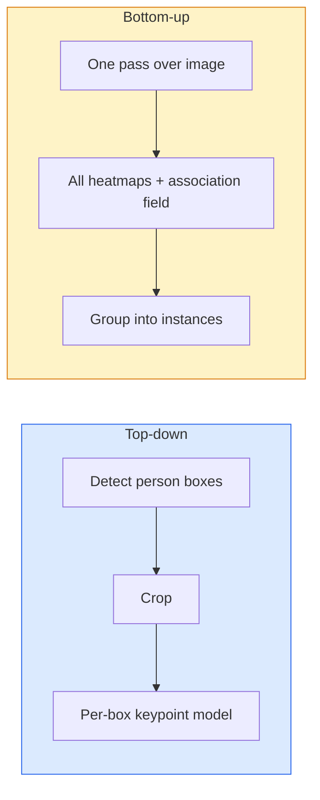

# Keypoint Detection & Pose Estimation

> A pose is a set of ordered keypoints. A keypoint detector is a heatmap regressor. Everything else is bookkeeping.

**Type:** Build
**Languages:** Python
**Prerequisites:** Phase 4 Lesson 06 (Detection), Phase 4 Lesson 07 (U-Net)
**Time:** ~45 minutes

## Learning Objectives

- Distinguish top-down and bottom-up pose estimation
- Regress heatmaps for K keypoints and extract coordinates at inference
- Explain Part Affinity Fields (PAFs) for bottom-up association
- Use MediaPipe Pose or MMPose for production keypoint estimation

## The Problem

Keypoint tasks: human pose, face landmarks, hand pose, animal pose. All share the same structure: detect K discrete points and output (x, y).

## The Concept

### Top-down vs bottom-up



### Heatmap regression

Predict H x W heatmap per keypoint with Gaussian blob at true location.

### Part Affinity Fields (PAFs)

2-channel unit vector field per limb. Integrate along candidate connections; higher integral = stronger match.

## Build It

### Step 1: Gaussian heatmap target

```python
import numpy as np

def gaussian_heatmap(size, cx, cy, sigma=2.0):
    yy, xx = np.meshgrid(np.arange(size), np.arange(size), indexing="ij")
    return np.exp(-((xx - cx) ** 2 + (yy - cy) ** 2) / (2 * sigma ** 2)).astype(np.float32)

hm = gaussian_heatmap(64, 32, 32, sigma=2.0)
print(f"peak: {hm.max():.3f}")
```

### Step 2: Tiny keypoint head

```python
import torch.nn as nn
import torch.nn.functional as F

class TinyKeypointNet(nn.Module):
    def __init__(self, num_keypoints=4, base=16):
        super().__init__()
        self.down1 = nn.Sequential(nn.Conv2d(3, base, 3, 2, 1), nn.ReLU(inplace=True))
        self.down2 = nn.Sequential(nn.Conv2d(base, base * 2, 3, 2, 1), nn.ReLU(inplace=True))
        self.mid = nn.Sequential(nn.Conv2d(base * 2, base * 2, 3, 1, 1), nn.ReLU(inplace=True))
        self.up1 = nn.ConvTranspose2d(base * 2, base, 2, 2)
        self.up2 = nn.ConvTranspose2d(base, num_keypoints, 2, 2)

    def forward(self, x):
        h1 = self.down1(x)
        h2 = self.down2(h1)
        h3 = self.mid(h2)
        u1 = self.up1(h3)
        return self.up2(u1)
```

### Step 3: Extract keypoint coordinates

```python
def heatmap_to_coords(heatmaps):
    N, K, H, W = heatmaps.shape
    hm = heatmaps.reshape(N, K, -1)
    idx = hm.argmax(dim=-1)
    ys = (idx // W).float()
    xs = (idx % W).float()
    return torch.stack([xs, ys], dim=-1)

coords = heatmap_to_coords(torch.randn(2, 4, 32, 32))
print(f"coords: {coords.shape}")
```

### Step 4: Synthetic dataset

```python
def make_synthetic_sample(size=64):
    img = np.ones((3, size, size), dtype=np.float32)
    rng = np.random.default_rng()
    kps = rng.integers(8, size - 8, size=(4, 2))
    for cx, cy in kps:
        img[:, cy - 2:cy + 2, cx - 2:cx + 2] = 0.0
    hms = np.stack([gaussian_heatmap(size, cx, cy) for cx, cy in kps])
    return img, hms, kps
```

### Step 5: Training

```python
model = TinyKeypointNet(num_keypoints=4)
opt = torch.optim.Adam(model.parameters(), lr=3e-3)

for step in range(200):
    batch = [make_synthetic_sample() for _ in range(16)]
    imgs = torch.from_numpy(np.stack([b[0] for b in batch]))
    hms = torch.from_numpy(np.stack([b[1] for b in batch]))
    pred = model(imgs)
    pred = F.interpolate(pred, size=hms.shape[-2:], mode="bilinear", align_corners=False)
    loss = F.mse_loss(pred, hms)
    opt.zero_grad(); loss.backward(); opt.step()
```

## Use It

- MediaPipe Pose: sub-10ms latency, WebGL + mobile
- MMPose: every SOTA architecture with pretrained weights
- YOLOv8-pose: fastest real-time multi-person pose

## Ship It

- `outputs/prompt-pose-stack-picker.md`
- `outputs/skill-heatmap-to-coords.md`

## Exercises

1. **(Easy)** Train on 4-point synthetic; report mean L2 error.
2. **(Medium)** Add sub-pixel refinement; report accuracy gain.
3. **(Hard)** Build 2-person bottom-up pipeline with PAFs.

## Key Terms

## Further Reading

- [OpenPose (Cao et al., 2017)](https://arxiv.org/abs/1812.08008)
- [HRNet (Sun et al., 2019)](https://arxiv.org/abs/1902.09212)
- [ViTPose (Xu et al., 2022)](https://arxiv.org/abs/2204.12484)

[Reference](https://github.com/rohitg00/ai-engineering-from-scratch/tree/main/phases/04-computer-vision/21-keypoint-pose)
