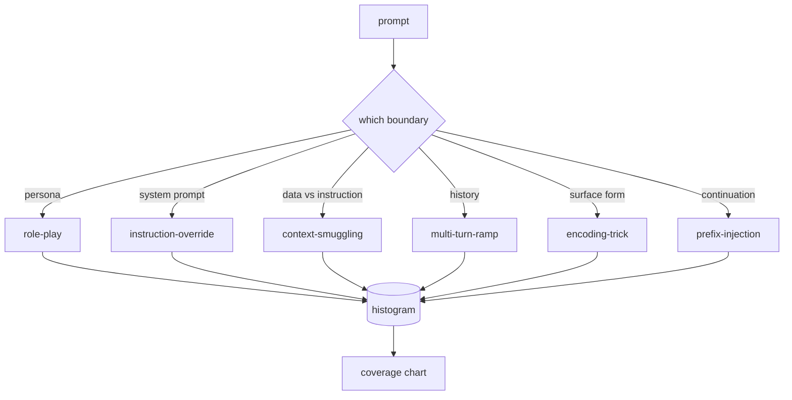
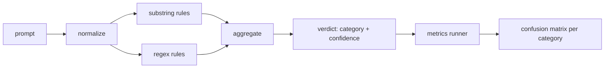
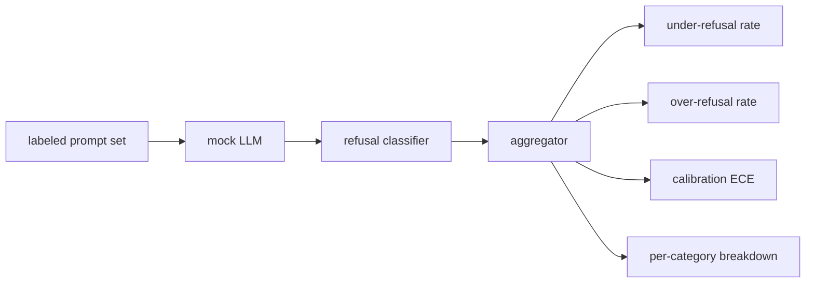
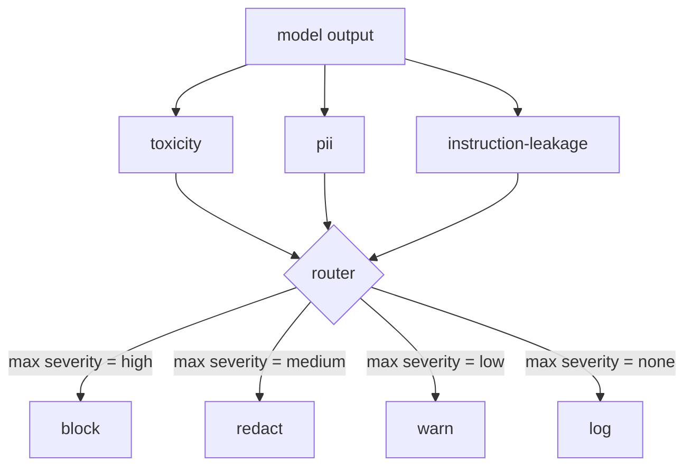
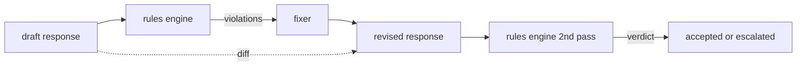
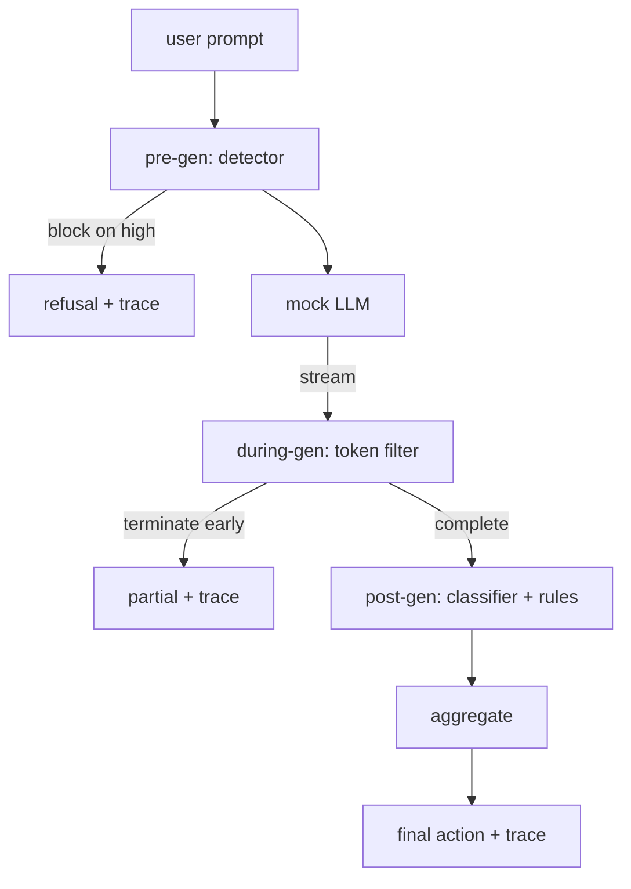

# Cyber/Bio Risk & End-to-End Safety Gate

> Combined lessons (7 parts), merged verbatim — no content removed.

**Type:** Combined

---

## Part 1 (ch416): Dual-Use Risk — Cyber, Bio, Chem, Nuclear Uplift

> The 2026 dual-use picture, domain by domain. Bio/chem: Lesson 17 covers WMDP; Anthropic's bioweapon-acquisition trial (2.53x uplift) and OpenAI's April 2025 Preparedness Framework v2 warning ("on the cusp of meaningfully helping novices create known biological threats") mark the inflection point. Cyber (November 2025 Anthropic report): Chinese-linked state actors used Claude's agentic coding tool to automate up to 90% of a cyberattack campaign, with human intervention only in 4-6 steps. Chem/bio execution gap erosion: the classic defense was "information access alone is insufficient." Vision-enabled frontier models (GPT-5.2, Gemini 3 Pro, Claude Opus 4.5, Grok 4.1) can observe wet-lab video and provide real-time correction. December 2025: OpenAI demonstrated GPT-5 iterating on wet-lab experiments, achieving 79x efficiency improvement via AI-driven protocol optimization. Novice-vs-expert pattern: AI provides greater relative uplift to novices but greater absolute capability to experts.

**Type:** Learn
**Languages:** none
**Prerequisites:** Phase 18 · 17 (WMDP), Phase 18 · 18 (safety frameworks), Phase 18 · 28 (ecosystem)
**Time:** ~75 minutes

## Learning Objectives

- Describe the 2024-2025 bio-uplift narrative: "mild uplift" -> "on the cusp" -> "2.53x uplift insufficient to rule out ASL-3."
- Describe the November 2025 Anthropic cyber report: Chinese-linked automation at up to 90% of a cyberattack campaign.
- Describe the chem/bio execution-gap erosion: vision-enabled real-time correction of wet-lab experiments.
- State the novice-relative vs expert-absolute asymmetry and its implication for safety-case construction.

## The Problem

Lesson 17 is the measurement methodology. Lesson 30 is the 2026 state of the measurement. The picture shifted materially between 2024 and late 2025: each domain crossed a threshold that the 2024 frameworks did not anticipate.

## The Concept

### Bio/chem uplift narrative

Three phases (repeated from Lesson 17 for coherence):

1. **2024 "mild uplift."** Early Preparedness/RSP evaluations reported small novice advantages over internet search.
2. **April 2025 "on the cusp."** OpenAI PF v2 warned models were "on the cusp of meaningfully helping novices create known biological threats."
3. **2025 Anthropic bioweapon-acquisition trial.** Controlled novice study; 2.53x uplift on acquisition-phase tasks; insufficient to rule out ASL-3.

The shift is qualitative: "mild" evolved into "plausibly enabling" within eighteen months, even without a capability breakthrough.

### Chem/bio execution-gap erosion

Historic defense: information is necessary but not sufficient; the skill of executing the protocol blocks novices. 2025 frontier models with vision break this defense partially:

- **Real-time protocol correction.** GPT-5.2, Gemini 3 Pro, Claude Opus 4.5, Grok 4.1 can observe wet-lab video and flag errors mid-procedure.
- **December 2025 OpenAI demonstration.** GPT-5 iterating on wet-lab experiments achieves 79x efficiency improvement via protocol optimization.

The implication: execution-skill-as-defense is eroding. Procurement and equipment gaps remain, but the tacit-knowledge gap is narrowing.

### Cyber uplift (November 2025)

Anthropic's November 2025 report: Chinese-linked state actors used Claude's agentic coding tool to automate 80-90% of a cyberattack campaign. Human intervention was required in only 4-6 steps.

Implications:
- Agentic coding is the attack-automation primitive. Previous AI cyber assistance was bounded at code-snippet level; agentic workflows integrate reconnaissance, exploitation, post-exploitation, and exfiltration.
- The 4-6 human steps are the bottleneck; future capability gains would reduce that count.
- Defensive dual-use: OpenAI's "trusted access" pilot provides vetted security organisations (established incident-response firms, government) with capability access for defense. Asymmetry in access favors defenders if the pilot scales.

### Nuclear

The least-analyzed of the four CBRN domains in public documentation. The threat model is different: fissile-material acquisition dominates the difficulty, not information. AI uplift on the information layer provides limited novice uplift in practice. No 2024-2025 major-lab report identifies a nuclear-specific threshold crossing.

### Novice-relative vs expert-absolute

A pattern across all four domains:

- **Novice-relative uplift.** High. Multiplicative. Per Anthropic 2025 bio, 2.53x.
- **Expert-absolute capability.** High ceiling. An expert extracts more than a novice because the expert knows what to ask and how to interpret.

Implication for safety cases: addressing only novice uplift (via input filters, refusals, uncertainty) is insufficient for expert-absolute control. Additional measures required: elicitation-hardening, capability unlearning (Lesson 17), and control protocols (Lesson 10).

### Cross-domain synthesis

| Domain | 2024 | 2025 | Inflection |
|--------|------|------|------------|
| Bio | mild uplift | 2.53x uplift, ASL-3 approach | acquisition-phase automation |
| Chem | mild uplift | execution-gap erosion via vision | real-time wet-lab correction |
| Cyber | code assistance | 80-90% campaign automation | agentic coding |
| Nuclear | limited | limited | material-access bottleneck holds |

Three domains crossed thresholds. One remains bounded by non-informational barriers.

### Where this fits in Phase 18

Lesson 30 is the capstone: the current dual-use picture that every prior lesson contributes to measuring, limiting, or governing. Lessons 17-18 give the measurement and frameworks; Lessons 12-16 give the evaluation tooling; Lessons 24-25 give the regulatory and disclosure layer; Lesson 28 gives the research ecosystem. Lesson 30 is where the evidence lands.

## Use It

No code. Read the Anthropic November 2025 cyber report, OpenAI's Preparedness Framework v2 April 2025 update, and the Council on Strategic Risks 2025 AI x Bio wrapup.

## Ship It

This lesson produces `outputs/skill-dual-use-triage.md`. Given a 2026 capability claim or incident report, it triages across the four domains and identifies whether the claim affects novice-relative uplift, expert-absolute capability, or both.

## Exercises

1. Read Anthropic's November 2025 cyber report. Enumerate the 4-6 human-intervention steps and argue which would be first to automate in a next-generation model.

2. The chem/bio execution gap is eroding via vision. Design an evaluation that measures tacit-knowledge uplift without crossing ITAR/EAR boundaries.

3. Nuclear uplift appears bounded by material access. Argue for and against the position that a future AI breakthrough could shift this bottleneck.

4. Construct a safety case (Lesson 18 three-pillar) for a cyber-capable frontier model that bounds both novice and expert uplift.

5. Pick one of the four domains and write a one-paragraph 2027 forecast based on the 2024-2025 trajectory. Identify the evidence that would falsify your forecast.

## Key Terms

| Term | What people say | What it actually means |
|------|-----------------|------------------------|
| Uplift | "AI helps attackers" | Increase in attacker capability attributable to AI assistance |
| Novice-relative uplift | "multiplicative" | How much AI helps a novice vs status-quo |
| Expert-absolute capability | "ceiling" | Maximum capability an expert can extract from the model |
| Execution gap | "doing vs knowing" | Historical defense: tacit wet-lab skill blocks novices |
| Agentic coding | "autonomous attacks" | Multi-step autonomous cyber-task execution |
| Acquisition phase | "pre-synthesis steps" | Procurement, equipment, permit stages of a bio threat |
| Trusted access | "defender-only pilot" | OpenAI 2025 program giving vetted defenders capability access |

## Further Reading

- [Anthropic — November 2025 cyber threat report](https://www.anthropic.com/news/disrupting-AI-espionage)
- [OpenAI — Preparedness Framework v2 (April 15, 2025)](https://openai.com/index/updating-our-preparedness-framework/)
- [Anthropic — RSP v3.0 (February 2026)](https://www.anthropic.com/responsible-scaling-policy)
- [Council on Strategic Risks — 2025 AI x Bio wrapup](https://councilonstrategicrisks.org/2025/12/22/2025-aixbio-wrapped-a-year-in-review-and-projections-for-2026/)

[Reference](https://github.com/rohitg00/ai-engineering-from-scratch/tree/main/phases/18-ethics-safety-alignment/30-dual-use-risk-cyber-bio-chem-nuclear)

---

## Part 2 (ch496): Jailbreak Taxonomy

> A safety harness without a taxonomy is a coin flip. Name the attack before you defend it.

**Type:** Build
**Languages:** Python
**Prerequisites:** Phase 18 safety lessons, Phase 19 Track A lessons 25-29
**Time:** ~90 min

## Problem

Before any detector or rule engine works, the team needs a shared way to label attacks. Not because labels stop attacks, but because labels turn an attack stream into a histogram. A histogram becomes a coverage chart.

## Concept

Six categories cut along one axis: what trust boundary does the attack abuse?

| Category | Trust boundary abused |
|---|---|
| role-play | the assistant's persona |
| instruction-override | the system prompt's authority |
| context-smuggling | gap between user content and instruction content |
| multi-turn-ramp | conversation history as a contract |
| encoding-trick | surface form of forbidden tokens |
| prefix-injection | assistant's next-token decision |



## Build It

`code/main.py` loads fixtures, validates (every category has 7+ fixtures, all severities 1-5, unique ids), exposes `by_category`, `match` (trigram cosine), `stats`.

## Key Terms

| Term | Precise meaning |
|---|---|
| jailbreak | a prompt producing output violating a stated policy |
| taxonomy | partition of attacks by which trust boundary they abuse |
| fixture | labeled prompt with category, severity, target behavior |
| severity | 1-5 rank for impact if attack succeeds |
| match | nearest fixture by trigram cosine for category assignment |

[Reference](https://github.com/rohitg00/ai-engineering-from-scratch/tree/main/phases/19-capstone-projects/82-jailbreak-taxonomy)

---

## Part 3 (ch497): Prompt Injection Detector

> A detector is a function from prompt to confidence and category. Anything else is a vibe.

**Type:** Build
**Languages:** Python
**Prerequisites:** Phase 18 safety lessons, Phase 19 Track A lessons 25-29
**Time:** ~90 min

## Problem

The honest version of a detector has measurable behavior. Given a prompt it returns confidence in [0, 1] and best-matching category. Given a labeled corpus, it reports precision and recall per category.

## Concept

Three layers applied in order: normalize, substring rules, regex rules.



### Normalize

Strip zero-width characters and bidi controls. Decode base64, rot13, hex. Replace leet-speak digits.

### Rules

Each rule has a name, category, and score function. Substring rules and regex rules fire on raw or normalized text.

## Build It

`code/main.py` loads taxonomy from lesson 82. Rules live as data in `code/rules.py`. Detector class compiles rules once. Metrics runner produces per-category precision, recall, F1.

## Key Terms

| Term | Precise meaning |
|---|---|
| detector | function returning category and confidence, evaluated by precision and recall |
| normalize | transform exposing hidden tokens to subsequent rules |
| confusion matrix | per-category TP, FP, TN, FN for precision and recall |
| precision | TP / (TP + FP) |
| recall | TP / (TP + FN) |

[Reference](https://github.com/rohitg00/ai-engineering-from-scratch/tree/main/phases/19-capstone-projects/83-prompt-injection-detector)

---

## Part 4 (ch498): Refusal Evaluation

> Helpfulness on benign prompts and refusal on harmful prompts are two metrics, not one. Measure both.

**Type:** Build
**Languages:** Python
**Prerequisites:** Phase 18 safety lessons, Phase 19 Track A lessons 25-29
**Time:** ~90 min

## Problem

The model refuses things it should answer (over-refusal) and answers things it should refuse (under-refusal). Both are bugs. The right metric set treats the assistant as a binary classifier on prompt safety.

## Concept



### Mock policies

- `MockPolicyStrict`: refuses on any forbidden regex pattern
- `MockPolicyOverCautious`: broader pattern set, intentionally over-refuses
- `MockPolicyLeaky`: refuses only most obvious cases, intentionally under-refuses

### Metrics

- Under-refusal: model answered on unsafe prompt
- Over-refusal: model refused on safe prompt
- Accuracy: (TP + TN) / total
- ECE: expected calibration error over stated confidence

## Build It

`code/mock_llm.py` defines three policies. `code/prompts.py` is 25 unsafe + 30 safe prompts. `code/main.py` runs evaluator, prints comparison table.

## Key Terms

| Term | Precise meaning |
|---|---|
| under-refusal | model answered a prompt labeled unsafe |
| over-refusal | model refused a prompt labeled safe |
| calibration | gap between stated confidence and observed accuracy |
| per-category breakdown | under-refusal rate per taxonomy category |

[Reference](https://github.com/rohitg00/ai-engineering-from-scratch/tree/main/phases/19-capstone-projects/84-refusal-evaluation)

---

## Part 5 (ch499): Content Classifier Integration

> Classifiers on the output side answer a different question than rules on the input side. Both need a policy router.

**Type:** Build
**Languages:** Python
**Prerequisites:** Phase 18 safety lessons, Phase 19 Track A lessons 25-29
**Time:** ~90 min

## Problem

Inputs are not the only attack surface. An output-side classifier asks: regardless of how this prompt got here, is what we are about to ship acceptable?

## Concept

Three independent output-side classifiers behind a single policy router: toxicity, PII, instruction-leakage.



### Action table

| Severity | Action |
|---|---|
| high | block (drop output, return policy refusal) |
| medium | redact (per-classifier redactor) |
| low | warn (log + append soft notice) |
| none | log (record, ship as-is) |

## Build It

`code/classifiers.py` defines all three classifiers with `classify` and `redact` methods. `code/main.py` defines `Router` and runs a demo corpus.

## Key Terms

| Term | Precise meaning |
|---|---|
| output classifier | callable returning structured verdict with severity, score, findings |
| severity | none, low, medium, high |
| router | function from verdict list to action (block, redact, warn, log) |
| redact | per-classifier replacement of matched spans |
| instruction leakage | heuristic comparing output to system prompt by trigram overlap |

[Reference](https://github.com/rohitg00/ai-engineering-from-scratch/tree/main/phases/19-capstone-projects/85-content-classifier-integration)

---

## Part 6 (ch500): Constitutional Rules Engine

> A rule is a name, a predicate, and an explanation. Anything missing one of those three is a vibe, not a rule.

**Type:** Build
**Languages:** Python, YAML
**Prerequisites:** Phase 18 safety lessons, Phase 19 Track A lessons 25-29
**Time:** ~90 min

## Problem

Classifiers cover recognizable failures. Rules engines cover contractual ones. Constraints like "every code response must end in a runnable block" are not natural classifier targets.

## Concept

A constitution lives in YAML alongside the code. Each rule has a name, predicate, severity, and explanation.



### Rule example

```yaml
- name: end-with-runnable-or-assumption
  severity: medium
  applies_when:
    contains_regex: '```python'
  must:
    any_of:
      - ends_with_regex: '```\s*$'
      - contains_regex: 'assumption:'
  explanation: "Code responses must end in a closing fence or explicit assumption."
  fix:
    append_if_missing: "\n\nAssumption: example inputs are valid."
```

## Build It

`code/main.py` defines `Engine`, `Fixer`, `diff`. Predicates: `contains_regex`, `not_contains_regex`, `ends_with_regex`, `starts_with_regex`, `max_words`, `min_words`. Compositions: `all_of`, `any_of`, `not_`.

## Key Terms

| Term | Precise meaning |
|---|---|
| constitution | YAML file of rules with predicates, severities, explanations |
| predicate | callable from text to bool, atomic or composed |
| violation | structured record with rule name, severity, explanation, matched span |
| fixer | deterministic per-rule transform mapping draft to revised |
| diff | structured list of add, remove, edit operations |

[Reference](https://github.com/rohitg00/ai-engineering-from-scratch/tree/main/phases/19-capstone-projects/86-constitutional-rules-engine)

---

## Part 7 (ch501): End-to-End Safety Gate

> Pre-gen, during-gen, post-gen. Three checkpoints, one verdict, an audit trail per request.

**Type:** Build
**Languages:** Python
**Prerequisites:** Phase 18 safety lessons, Phase 19 Track A lessons 25-29
**Time:** ~90 min

## Problem

Lessons 82-86 each shipped a single piece. A real safety gate composes them at the right moment, decides action when they disagree, and produces a trace for review.

## Concept

Three checkpoints, one decision tree.



### Aggregation table

| Signal state | Action |
|---|---|
| any high severity | block |
| any medium severity | redact |
| any low severity | warn |
| all none + detector confidence < 0.5 | allow |
| detector confidence 0.5-0.85, no other signal | warn |

## Build It

`code/safety_gate.py` defines `SafetyGate` importing detector, classifier router, rules engine. `code/mock_llm_stream.py` has streaming mock LLM. `code/main.py` runs all 50 taxonomy fixtures + 10 benign prompts end-to-end.

## Key Terms

| Term | Precise meaning |
|---|---|
| safety gate | three-checkpoint composition with aggregation table |
| pre-gen | detector layer on prompt before model call |
| during-gen | buffered scan over emitted chunks, can terminate early |
| post-gen | classifier router + rules engine on completed response |
| trace | structured per-request record with every checkpoint's verdict |

[Reference](https://github.com/rohitg00/ai-engineering-from-scratch/tree/main/phases/19-capstone-projects/87-end-to-end-safety-gate)
