# Why Multi-Agent, Protocols, Supervisors & Group Chat

> Combined lessons (8 parts), merged verbatim — no content removed.

**Type:** Combined

---

## Part 1 (ch334): Why Multi-Agent?

> One agent hits a wall. The smart move is not a bigger agent - it is more agents.

**Type:** Learn
**Languages:** TypeScript
**Prerequisites:** Phase 14 (Agent Engineering)
**Time:** ~60 minutes

## Learning Objectives

- Identify the single-agent ceiling (context overflow, mixed expertise, sequential bottleneck) and explain when splitting into multiple agents is the right move
- Compare orchestration patterns (pipeline, parallel fan-out, supervisor, hierarchical) and select the right one for a given task structure
- Design a multi-agent system with clear role boundaries, shared state, and a communication contract
- Analyze the tradeoffs of multi-agent complexity (latency, cost, debugging difficulty) versus single-agent simplicity

## The Problem

You built a single agent in Phase 14. It works. It can read files, run commands, call APIs, and reason about results. Then you point it at a real codebase: 200 files, three languages, tests that depend on infrastructure, and a requirement to research external APIs before writing code.

The agent chokes. Not because the LLM is dumb, but because the task exceeds what one agent loop can handle. The context window fills up with file contents. The agent forgets what it read 40 tool calls ago. It tries to be a researcher, a coder, and a reviewer all at once, and does all three poorly.

This is the single-agent ceiling. You hit it every time a task requires:
- **More context than fits in one window** - reading 50 files blows past 200k tokens
- **Different expertise at different stages** - research requires different prompting than code generation
- **Work that can happen in parallel** - why read three files sequentially when you can read them simultaneously?

## The Concept

### The Single-Agent Ceiling

A single agent is one loop, one context window, one system prompt. Three things break:

1. **Context saturation** - tool results pile up. By turn 30, the agent has consumed 150k tokens of file contents, command outputs, and prior reasoning. Critical details from turn 5 get lost.

2. **Role confusion** - a system prompt that says "you are a researcher, coder, reviewer, and tester" produces an agent that half-researches, half-codes, and never finishes reviewing.

3. **Sequential bottleneck** - the agent reads file A, then file B, then file C. Three serial LLM calls. Three serial tool executions. No parallelism.

### The Multi-Agent Solution

Split the work. Give each agent one job, one context window, and one system prompt tuned for that job. Each agent has:
- A focused system prompt ("You are a code reviewer. Your only job is finding bugs.")
- Its own context window (not polluted by other agents' work)
- A clear input/output contract (receives research notes, outputs code)

### Real Systems That Do This

**Claude Code subagents** - when Claude Code spawns a subagent with `Task`, it creates a child agent with a scoped task. The parent keeps its context clean. The child does focused work and returns a summary.

**Devin** - runs a planner agent, a coder agent, and a browser agent. The planner breaks work into steps. The coder writes code. The browser researches documentation. Each has separate context.

**Multi-agent coding teams (SWE-bench)** - top-performing systems on SWE-bench use a researcher that reads the codebase, a planner that designs the fix, and a coder that implements it. Single-agent systems score lower.

**ChatGPT Deep Research** - spawns multiple search agents in parallel, each exploring a different angle, then synthesizes results.

### The Spectrum

Multi-agent is not binary. It is a spectrum from single agent (one loop, one context) through subagents, pipeline, team, to swarm (many identical agents with shared state, emergent behavior).

### The Four Multi-Agent Patterns

**Pattern 1: Pipeline** - Each agent transforms the data and passes it forward. Simple to reason about. Failure in one stage blocks the rest.

**Pattern 2: Fan-out / Fan-in** - Split work across parallel agents, then merge results. Good for tasks that decompose into independent subtasks.

**Pattern 3: Orchestrator-Worker** - A smart orchestrator decides what to do, delegates to workers, and synthesizes results. The orchestrator is itself an agent with tools for spawning workers.

**Pattern 4: Peer Swarm** - No central orchestrator. Agents communicate peer-to-peer. Decisions emerge from interaction. Harder to debug, but scales to many agents.

### When NOT to Use Multi-Agent

Multi-agent adds complexity. Every message between agents is a potential failure point. Debugging goes from "read one conversation" to "trace messages across five agents."

Stay single-agent when: the task fits in one context window (under ~100k tokens of working data), you do not need different system prompts for different stages, sequential execution is fast enough, or the task is simple enough that splitting it adds more overhead than value.

The complexity cost: every agent boundary is a lossy compression step, coordination logic is its own source of bugs, latency increases (N agents means N serial LLM calls minimum), and cost multiplies (each agent burns tokens independently).

Rule of thumb: if a task takes fewer than 20 tool calls and fits in 100k tokens, keep it single-agent.

## Build It

### Step 1: The Overloaded Single Agent

A single agent trying to do everything with one massive system prompt and one context window:

```typescript
type AgentResult = {
  content: string;
  tokensUsed: number;
  toolCalls: number;
};

async function singleAgentApproach(task: string): Promise<AgentResult> {
  const systemPrompt = `You are a full-stack developer. You must:
1. Research the requirements
2. Write the code
3. Review the code for bugs
4. Write tests
Do ALL of these in a single conversation.`;

  const contextWindow: string[] = [];
  let totalTokens = 0;
  let totalToolCalls = 0;

  const research = await fakeLLMCall(systemPrompt, `Research: ${task}`);
  contextWindow.push(research.output);
  totalTokens += research.tokens;
  totalToolCalls += research.calls;

  const code = await fakeLLMCall(
    systemPrompt,
    `Given this research:\n${contextWindow.join("\n")}\n\nNow write code for: ${task}`
  );
  contextWindow.push(code.output);
  totalTokens += code.tokens;
  totalToolCalls += code.calls;

  const review = await fakeLLMCall(
    systemPrompt,
    `Given all previous context:\n${contextWindow.join("\n")}\n\nReview the code.`
  );
  contextWindow.push(review.output);
  totalTokens += review.tokens;
  totalToolCalls += review.calls;

  return {
    content: contextWindow.join("\n---\n"),
    tokensUsed: totalTokens,
    toolCalls: totalToolCalls,
  };
}
```

Problems: the context window grows with every stage, the system prompt is generic, and nothing runs in parallel.

### Step 2: Specialist Agents

Split it so each agent gets one job:

```typescript
type SpecialistAgent = {
  name: string;
  systemPrompt: string;
  run: (input: string) => Promise<AgentResult>;
};

function createSpecialist(name: string, systemPrompt: string): SpecialistAgent {
  return {
    name,
    systemPrompt,
    run: async (input: string) => {
      const result = await fakeLLMCall(systemPrompt, input);
      return {
        content: result.output,
        tokensUsed: result.tokens,
        toolCalls: result.calls,
      };
    },
  };
}

const researcher = createSpecialist(
  "researcher",
  "You are a technical researcher. Read documentation, find patterns, and summarize findings."
);

const coder = createSpecialist(
  "coder",
  "You are a senior TypeScript developer. Given requirements and research notes, write clean, tested code."
);

const reviewer = createSpecialist(
  "reviewer",
  "You are a code reviewer. Find bugs, security issues, and logic errors."
);
```

Each specialist has a focused prompt and a clean context window.

### Step 3: Coordinate Through Messages

Wire the specialists together with explicit message passing:

```typescript
type AgentMessage = {
  from: string;
  to: string;
  content: string;
  timestamp: number;
};

async function multiAgentApproach(task: string): Promise<AgentResult> {
  const messages: AgentMessage[] = [];
  let totalTokens = 0;
  let totalToolCalls = 0;

  const researchResult = await researcher.run(task);
  messages.push({ from: "researcher", to: "coder", content: researchResult.content, timestamp: Date.now() });
  totalTokens += researchResult.tokensUsed;
  totalToolCalls += researchResult.toolCalls;

  const coderInput = messages.filter((m) => m.to === "coder").map((m) => `[From ${m.from}]: ${m.content}`).join("\n");
  const codeResult = await coder.run(coderInput);
  messages.push({ from: "coder", to: "reviewer", content: codeResult.content, timestamp: Date.now() });
  totalTokens += codeResult.tokensUsed;
  totalToolCalls += codeResult.toolCalls;

  const reviewerInput = messages.filter((m) => m.to === "reviewer").map((m) => `[From ${m.from}]: ${m.content}`).join("\n");
  const reviewResult = await reviewer.run(reviewerInput);
  messages.push({ from: "reviewer", to: "orchestrator", content: reviewResult.content, timestamp: Date.now() });
  totalTokens += reviewResult.tokensUsed;
  totalToolCalls += reviewResult.toolCalls;

  return {
    content: messages.map((m) => `[${m.from} -> ${m.to}]: ${m.content}`).join("\n\n"),
    tokensUsed: totalTokens,
    toolCalls: totalToolCalls,
  };
}
```

Each agent receives only the messages addressed to it. No context pollution.

### Step 4: Compare

```typescript
async function compare() {
  const task = "Build a rate limiter middleware for an Express.js API";
  console.log("=== Single Agent ===");
  const single = await singleAgentApproach(task);
  console.log(`Tokens: ${single.tokensUsed}`);
  console.log(`Tool calls: ${single.toolCalls}`);

  console.log("\n=== Multi-Agent ===");
  const multi = await multiAgentApproach(task);
  console.log(`Tokens: ${multi.tokensUsed}`);
  console.log(`Tool calls: ${multi.toolCalls}`);
}
```

The multi-agent version uses more total tokens but each agent's context stays clean and the quality of each stage improves.

## Exercises

1. Add a fourth specialist: a "tester" agent that receives code from the coder and review feedback from the reviewer, then writes tests
2. Modify the pipeline so the reviewer can send feedback back to the coder for a revision loop (max 2 rounds)
3. Convert the sequential pipeline into a fan-out: run the researcher and a "requirements analyzer" agent in parallel, then merge their outputs before passing to the coder

## Key Terms

| Term | What people say | What it actually means |
|------|----------------|----------------------|
| Swarm | "A hive mind of AI agents" | A set of peer agents with shared state and no fixed leader. |
| Orchestrator | "The boss agent" | An agent whose tools include spawning and managing other agents. |
| Coordinator | "The traffic cop" | A non-agent component that routes messages between agents based on rules. |
| Consensus | "The agents agree" | A protocol where multiple agents must reach agreement before proceeding. |
| Emergent behavior | "The agents figured it out themselves" | System-level patterns from agent interactions that were not explicitly programmed. |
| Fan-out / fan-in | "Map-reduce for agents" | Splitting a task across parallel agents, then combining their results. |
| Message passing | "Agents talk to each other" | Structured data sent from one agent to another, replacing shared context windows. |

## Further Reading

- [The Landscape of Emerging AI Agent Architectures](https://arxiv.org/abs/2409.02977)
- [AutoGen: Enabling Next-Gen LLM Applications](https://arxiv.org/abs/2308.08155)
- [Claude Code subagents documentation](https://docs.anthropic.com/en/docs/claude-code)
- [CrewAI documentation](https://docs.crewai.com/)

[Reference](https://github.com/rohitg00/ai-engineering-from-scratch/tree/main/phases/16-multi-agent-and-swarms/01-why-multi-agent)

---

## Part 2 (ch335): Heritage of FIPA-ACL and Speech Acts

> Before MCP, before A2A, there was FIPA-ACL. In 2000 the IEEE Foundation for Intelligent Physical Agents ratified an agent communication language with twenty performatives, two content languages, and a set of interaction protocols — contract net, subscribe/notify, request-when. It faded from industry because the ontology overhead was too heavy for the web, but the LLM revival of multi-agent systems is quietly reimplementing the same ideas without the formal semantics: JSON contracts stand in for performatives, natural language stands in for ontologies.

**Type:** Learn
**Languages:** Python (stdlib)
**Prerequisites:** Phase 16 · 01 (Why Multi-Agent)
**Time:** ~60 minutes

## Problem

The 2026 agent-protocol landscape is busy: MCP for tools, A2A for agents, ACP for enterprise audit, ANP for decentralized trust, NLIP for natural-language content, plus CA-MCP and two dozen research proposals. Each spec announces itself as foundational.

The honest read is that most of them are rediscovering a very specific twenty-year-old decision tree. Speech-act theory from Austin (1962) and Searle (1969) gave us "utterances are actions." KQML (1993) turned that into a wire protocol. FIPA-ACL (ratified 2000) produced the reference standardization: twenty performatives, content languages SL0/SL1, interaction protocols for contract-net and subscribe-notify. JADE and JACK were the Java reference platforms. The effort faded around 2010 because the ontology overhead was too heavy and the web was winning.

When you look at MCP's `tools/call`, A2A's task lifecycle, or CA-MCP's shared context store, you are looking at a softer, JSON-native rehash of FIPA decisions. Knowing the heritage tells you two things: which new "innovations" are actually reinventions, and which old failure modes the new specs will rediscover.

## Concept

### Speech acts, in one paragraph

Austin noticed that some sentences do not describe the world — they change it. "I promise." "I request." "I declare." He called these performative utterances. Searle formalized five categories: assertive, directive, commissive, expressive, declarative. KQML (Finin et al., 1993) made this operational for software agents: a message is a performative (the action) plus content (what the action is about). FIPA-ACL cleaned up KQML's gaps and standardized around twenty performatives.

### The twenty FIPA performatives (partial list)

| Performative | Intent |
|---|---|
| `inform` | "I tell you P is true" |
| `request` | "I ask you to do X" |
| `query-if` | "Is P true?" |
| `query-ref` | "What is the value of X?" |
| `propose` | "I propose we do X" |
| `accept-proposal` | "I accept the proposal" |
| `reject-proposal` | "I reject the proposal" |
| `agree` | "I agree to do X" |
| `refuse` | "I refuse to do X" |
| `confirm` | "I confirm P is true" |
| `disconfirm` | "I deny P" |
| `not-understood` | "Your message did not parse" |
| `cfp` | "Call for proposals on X" |
| `subscribe` | "Notify me when X changes" |
| `cancel` | "Cancel the ongoing X" |
| `failure` | "I tried X and failed" |

### Canonical FIPA-ACL message

```
(inform
  :sender       agent1@platform
  :receiver     agent2@platform
  :content      "((price IBM 83))"
  :language     SL0
  :ontology     finance
  :protocol     fipa-request
  :conversation-id   conv-42
  :reply-with   msg-17
)
```

Seven fields carry the protocol envelope; one field (`content`) carries the payload.

### The two legacy platforms

**JADE** (Java Agent DEvelopment framework, 1999–2020s) was the most-used FIPA-compliant runtime. Agents extended a base class, exchanged ACL messages, ran inside containers, and coordinated using "behaviors."

**JACK** (Agent Oriented Software, commercial) emphasized BDI (Belief-Desire-Intention) reasoning on top of FIPA messages.

Both declined once the web stack ate multi-agent use cases. MCP and A2A are the runtime "containers" of 2026.

### Why FIPA faded

- **Ontology overhead.** FIPA required a shared ontology to parse `content`. Agreeing on ontologies is a years-long standards process. The web just used HTTP + JSON.
- **Formal semantics nobody used.** SL (Semantic Language) gave rigorous truth conditions, but most production systems used free-form content and ignored the formalism.
- **Tooling lock-in.** JADE was Java-only; JACK was commercial. Polyglot teams routed around both.
- **The internet won the stack.** REST, then JSON-RPC, then gRPC replaced ACL's transport.

### The LLM revival is FIPA-lite

Compare a FIPA `request` to an MCP `tools/call`:

```
(request                                {
  :sender  agent1                         "jsonrpc": "2.0",
  :receiver tool-server                   "method":  "tools/call",
  :content "(lookup stock IBM)"           "params":  {"name":"lookup_stock",
  :ontology finance                                   "arguments":{"symbol":"IBM"}},
  :conversation-id c42                    "id": 42
)                                        }
```

Same envelope, different syntax. Both carry: who, whom, intent, payload, correlation id.

### The trade-off, stated plainly

What FIPA gave you and modern specs drop: formal semantics, a canonical catalog of performatives, and decades of interaction-protocol patterns with known correctness properties.

What modern specs give you and FIPA did not: JSON-native payloads, natural-language content that LLMs can interpret, web-stack transport (HTTP, SSE, WebSocket), and capability discovery via self-describing documents.

### Interaction protocols worth porting

1. **Contract Net Protocol (CNP).** Manager issues `cfp` (call for proposals); bidders respond with `propose`; manager accepts/rejects. This is the canonical task-market pattern.
2. **Subscribe/Notify.** Subscriber sends `subscribe`; publisher sends `inform` whenever the topic changes.
3. **Request-When.** "Do X when condition Y holds." Delayed-action with pre-conditions.

### What breaks when you drop the ontology

Without a shared ontology, agents infer meaning from natural-language content. The documented 2026 failure mode is **semantic drift**: two agents use the same word ("customer") for subtly different concepts. Mitigations: JSON Schema on `content`, typed artifacts, explicit performative in the envelope.

### The 2026 specs, mapped to speech-act heritage

| Modern spec | FIPA analog | What it keeps | What it drops |
|---|---|---|---|
| MCP `tools/call` | `request` | explicit intent, correlation id | formal semantics, ontology |
| MCP `resources/read` | `query-ref` | explicit intent, correlation id | formal semantics |
| A2A Task lifecycle | contract-net + request-when | async lifecycle, state transitions | formal completeness guarantees |
| A2A streaming events | subscribe/notify | async push | typed-predicate subscription |
| CA-MCP shared context | blackboard (Hayes-Roth 1985) | multi-writer shared memory | logical consistency model |
| NLIP | natural-language content | LLM-native | schema |

## Build It

`code/main.py` implements a pure-stdlib FIPA-ACL translator. It encodes and decodes the canonical ACL envelope and shows how every MCP / A2A message shape reduces to the same seven fields. The demo encodes five MCP-style and A2A-style messages as FIPA-ACL, decodes FIPA-ACL back to the modern equivalent, and runs a toy Contract Net negotiation between one manager and three bidders using `cfp`, `propose`, `accept-proposal`, `reject-proposal`.

```
python3 code/main.py
```

## Use It

`outputs/skill-fipa-mapper.md` is a skill that reads any agent-protocol spec and produces the FIPA-ACL mapping.

## Ship It

Do not bring FIPA-ACL back. Bring back its checklist:

- What is the intent primitive (performative) of each message?
- Is there a correlation id for request-response and cancellation?
- Is there an explicit content language?
- Are interaction protocols first-class, or are you re-implementing contract-net from scratch?
- What happens when two agents disagree about content meaning (semantic drift)?

## Exercises

1. Run `code/main.py`. Observe the round-trip encoding. Identify which FIPA performative corresponds to `tools/call`, `resources/read`, and A2A task creation.
2. Extend the contract-net demo with a `cancel` performative that lets the manager withdraw the task mid-bid.
3. Read FIPA ACL Message Structure (http://www.fipa.org/specs/fipa00037/) sections 4.1–4.3. Pick one performative not covered in this lesson and describe its modern JSON-RPC analog.
4. Read Liu et al., arXiv:2505.02279. For each of MCP, A2A, ACP, ANP, list the FIPA performative families they keep and drop.
5. Design a minimal JSON-Schema for the `content` field of a `request` performative in your own system.

## Key Terms

| Term | What people say | What it actually means |
|------|----------------|------------------------|
| Speech act | "An utterance that does something" | Austin/Searle: utterances as actions. The theoretical parent of ACL. |
| FIPA | "That old XML thing" | IEEE Foundation for Intelligent Physical Agents. Standardized ACL in 2000. |
| ACL | "Agent Communication Language" | FIPA's envelope format: performative + content + metadata. |
| Performative | "The verb" | The intent class of a message: `inform`, `request`, `propose`, `cfp`, etc. |
| KQML | "FIPA's predecessor" | Knowledge Query and Manipulation Language (1993). |
| Ontology | "Shared vocabulary" | A formal definition of the concepts the content language talks about. |
| Contract Net | "Task market" | Manager issues cfp; bidders propose; manager accepts. |
| Interaction protocol | "Pattern of messages" | A sequence of performatives with known correctness. |

## Further Reading

- [Liu et al. — A Survey of Agent Interoperability Protocols](https://arxiv.org/html/2505.02279v1)
- [FIPA ACL Message Structure Specification (fipa00037)](http://www.fipa.org/specs/fipa00037/)
- [MCP specification 2025-11-25](https://modelcontextprotocol.io/specification/2025-11-25)
- [A2A specification](https://a2a-protocol.org/latest/specification/)

[Reference](https://github.com/rohitg00/ai-engineering-from-scratch/tree/main/phases/16-multi-agent-and-swarms/02-fipa-acl-heritage)

---

## Part 3 (ch336): Communication Protocols

> Agents that can't speak the same language aren't a team. They're strangers shouting into the void.

**Type:** Build
**Languages:** TypeScript
**Prerequisites:** Phase 14 (Agent Engineering), Lesson 16.01 (Why Multi-Agent)
**Time:** ~120 minutes

## Learning Objectives

- Implement MCP tool discovery and invocation so agents can use tools exposed by external servers
- Build an A2A agent card and task endpoint that allows one agent to delegate work to another over HTTP
- Compare MCP (tool access), A2A (agent-to-agent), ACP (enterprise audit), and ANP (decentralized trust) and explain which protocol solves which problem
- Wire multiple protocols together in a single system where agents discover tools via MCP and delegate tasks via A2A

## The Problem

You split your system into multiple agents. A researcher, a coder, a reviewer. They're great at their individual jobs. But now you need them to actually talk to each other.

Your first attempt is obvious: pass strings around. The researcher returns a blob of text, the coder parses it however it can. It works until the coder misinterprets a research summary, or two agents deadlock waiting for each other, or you need agents built by different teams to collaborate. Suddenly "just pass strings" falls apart.

The AI ecosystem has responded with four protocols, each solving a different slice of the problem:
- **MCP** for tool access
- **A2A** for agent-to-agent collaboration
- **ACP** for enterprise auditability
- **ANP** for decentralized identity and trust

## The Concept

### The Protocol Landscape

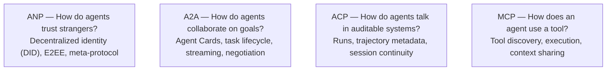

### MCP (Recap)

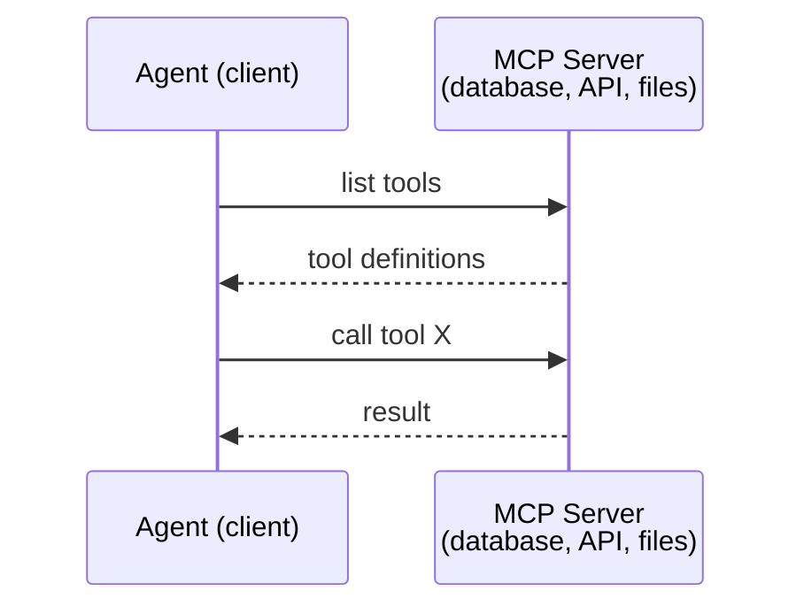

MCP is **agent-to-tool** communication. It doesn't help agents talk to each other.

### A2A (Agent2Agent Protocol)

Created by Google (now under Linux Foundation as `lf.a2a.v1`). A2A is the protocol for **peer-to-peer agent collaboration**. Each agent publishes an **Agent Card** at a well-known URL.

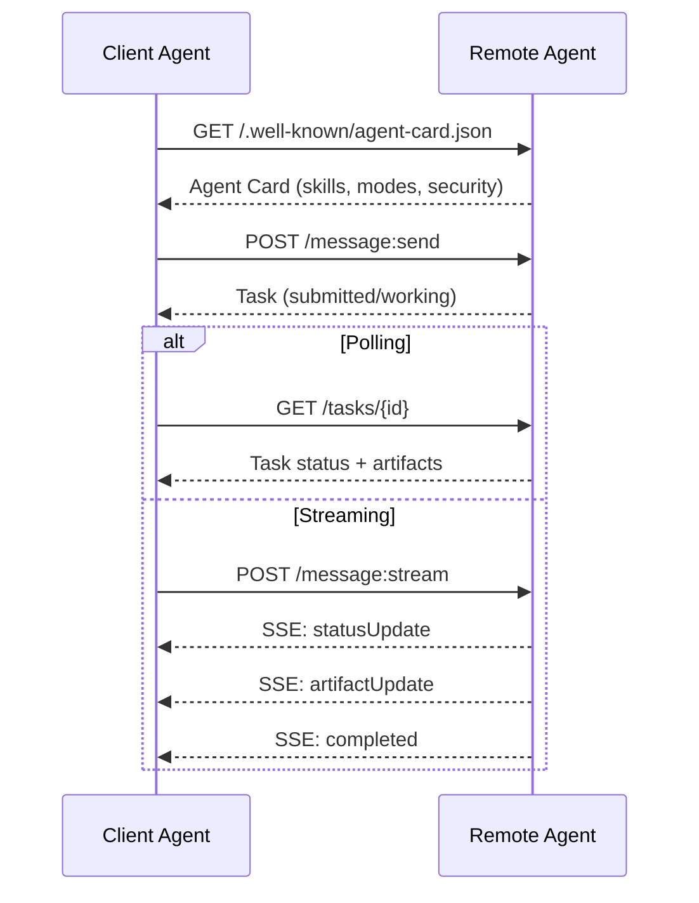

#### The Real Agent Card

```json
{
  "name": "Research Agent",
  "description": "Searches documentation and summarizes findings",
  "version": "1.0.0",
  "supportedInterfaces": [
    { "url": "https://research-agent.example.com/a2a/v1", "protocolBinding": "JSONRPC", "protocolVersion": "1.0" },
    { "url": "https://research-agent.example.com/a2a/rest", "protocolBinding": "HTTP+JSON", "protocolVersion": "1.0" }
  ],
  "capabilities": { "streaming": true, "pushNotifications": false },
  "defaultInputModes": ["text/plain", "application/json"],
  "defaultOutputModes": ["text/plain", "application/json"],
  "skills": [
    { "id": "web-research", "name": "Web Research", "description": "Searches the web and synthesizes findings", "tags": ["research", "search", "summarization"], "examples": ["Research the latest changes in React 19"] }
  ],
  "securitySchemes": { "bearer": { "httpAuthSecurityScheme": { "scheme": "Bearer", "bearerFormat": "JWT" } } },
  "security": [{ "bearer": [] }]
}
```

#### Task Lifecycle

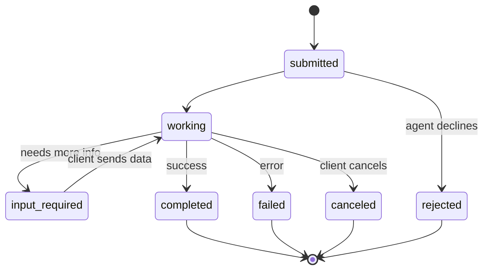

| State | Terminal? | Meaning |
|---|---|---|
| `TASK_STATE_SUBMITTED` | No | Acknowledged, not yet processing |
| `TASK_STATE_WORKING` | No | Actively being processed |
| `TASK_STATE_INPUT_REQUIRED` | No | Agent needs more info from client |
| `TASK_STATE_AUTH_REQUIRED` | No | Authentication needed |
| `TASK_STATE_COMPLETED` | Yes | Finished successfully |
| `TASK_STATE_FAILED` | Yes | Finished with error |
| `TASK_STATE_CANCELED` | Yes | Canceled before completion |
| `TASK_STATE_REJECTED` | Yes | Agent declined the task |

#### Wire Format

Client sends a task:
```json
{
  "jsonrpc": "2.0", "id": 1, "method": "SendMessage",
  "params": {
    "message": { "messageId": "msg-001", "role": "ROLE_USER", "parts": [{ "text": "Research React 19 compiler features" }] },
    "configuration": { "acceptedOutputModes": ["text/plain", "application/json"], "historyLength": 10 }
  }
}
```

Agent responds:
```json
{
  "jsonrpc": "2.0", "id": 1,
  "result": {
    "task": {
      "id": "task-abc-123", "contextId": "ctx-xyz-789",
      "status": { "state": "TASK_STATE_COMPLETED", "timestamp": "2026-03-27T10:30:00Z" },
      "artifacts": [{ "artifactId": "art-001", "name": "research-results", "parts": [{ "data": { "findings": ["React 19 compiler auto-memoizes components"] }, "mediaType": "application/json" }] }]
    }
  }
}
```

### ACP (Agent Communication Protocol)

Created by IBM / BeeAI. ACP is the **enterprise protocol** with **TrajectoryMetadata**: every agent response can carry a detailed log of the reasoning steps and tool calls.

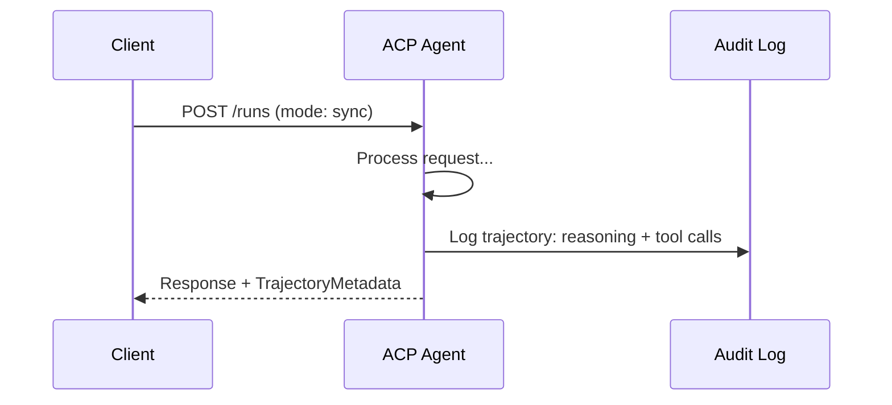

#### Run Lifecycle

| Mode | Behavior |
|---|---|
| `sync` | Blocking. Response contains the complete result. |
| `async` | Returns 202 immediately. Poll `GET /runs/{id}` for status. |
| `stream` | SSE stream. |

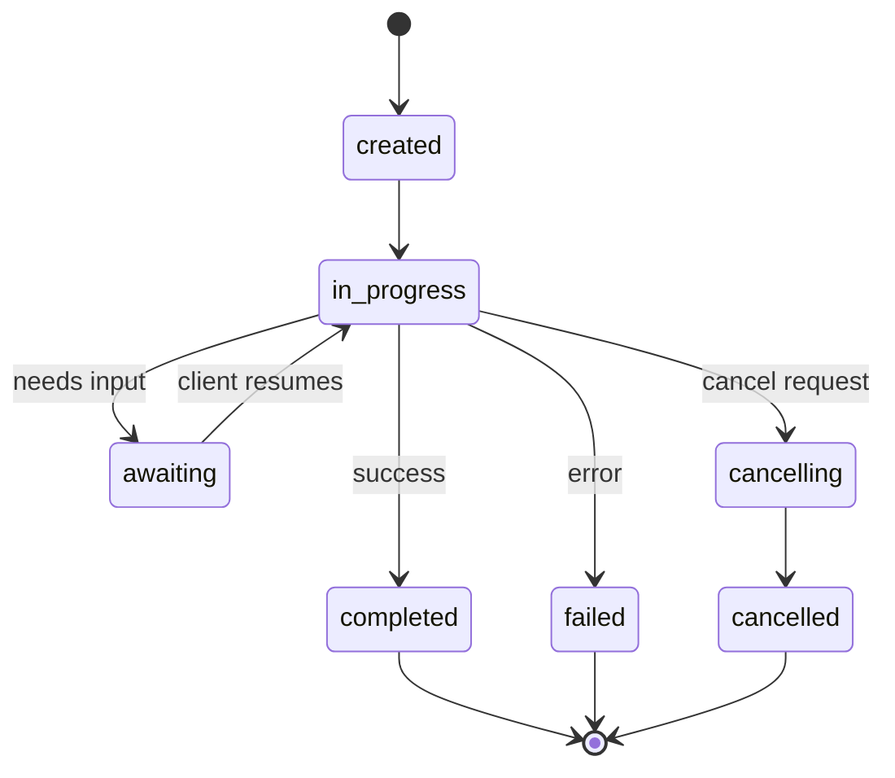

#### TrajectoryMetadata

```json
{
  "role": "agent/researcher",
  "parts": [{
    "content_type": "text/plain",
    "content": "The weather in San Francisco is 72F and sunny.",
    "metadata": {
      "kind": "trajectory",
      "message": "I need to check the weather for this location",
      "tool_name": "weather_api",
      "tool_input": { "location": "San Francisco, CA" },
      "tool_output": { "temperature": 72, "condition": "sunny" }
    }
  }]
}
```

### ANP (Agent Network Protocol)

Created by open-source community. ANP is the **decentralized identity protocol** using W3C DIDs and end-to-end encryption.

#### Three layers

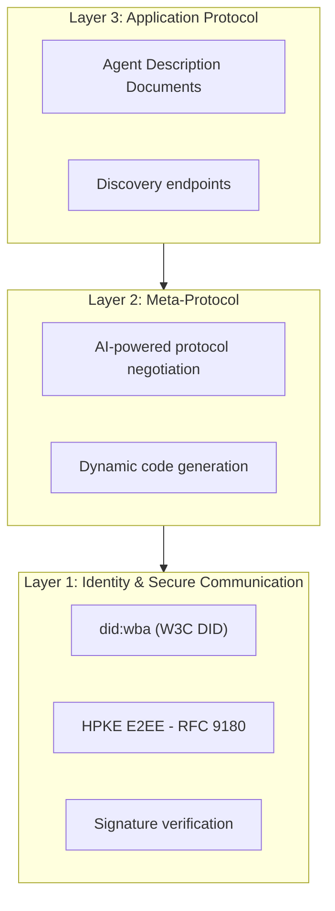

#### DID Document

```json
{
  "@context": ["https://www.w3.org/ns/did/v1", "https://w3id.org/security/suites/jws-2020/v1"],
  "id": "did:wba:example.com:user:alice",
  "verificationMethod": [
    { "id": "did:wba:example.com:user:alice#key-1", "type": "EcdsaSecp256k1VerificationKey2019", "controller": "did:wba:example.com:user:alice", "publicKeyJwk": { "crv": "secp256k1", "x": "NtngWpJUr-rlNNbs0u-Aa8e16OwSJu6UiFf0Rdo1oJ4", "y": "qN1jKupJlFsPFc1UkWinqljv4YE0mq_Ickwnjgasvmo", "kty": "EC" } }
  ],
  "authentication": ["did:wba:example.com:user:alice#key-1"],
  "keyAgreement": ["did:wba:example.com:user:alice#key-x25519-1"],
  "humanAuthorization": ["did:wba:example.com:user:alice#key-1"],
  "service": [{ "id": "did:wba:example.com:user:alice#agent-description", "type": "AgentDescription", "serviceEndpoint": "https://example.com/agents/alice/ad.json" }]
}
```

#### Meta-Protocol Negotiation

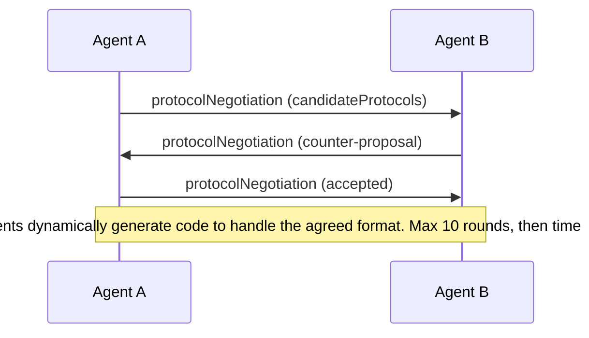

### Comparison

| | MCP | A2A | ACP | ANP |
|---|---|---|---|---|
| **Created by** | Anthropic | Google / Linux Foundation | IBM / BeeAI | Community |
| **Spec format** | JSON-RPC | JSON-RPC / REST / gRPC | OpenAPI 3.1 (REST) | JSON-RPC |
| **Primary use** | Agent to Tool | Agent to Agent | Agent to Agent | Agent to Agent |
| **Discovery** | Tool listing | `/.well-known/agent-card.json` | `GET /agents` | `/.well-known/agent-descriptions` |
| **Identity** | Implicit (local) | Security schemes (OAuth, mTLS) | Server-level | W3C DID (`did:wba`) with E2EE |
| **Audit trail** | N/A | Basic (task history) | TrajectoryMetadata | Not formally specified |
| **State machine** | N/A | 9 task states | 7 run states | N/A |
| **Streaming** | N/A | SSE | SSE | Transport-agnostic |
| **Unique feature** | Tool schemas | Agent Cards + Skills | Trajectory audit trail | Meta-protocol negotiation |

### How They Work Together

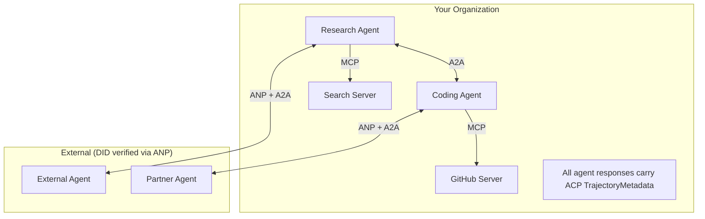

## Build It

### Step 1: Core Message Types

```typescript
import crypto from "node:crypto";

type MessageRole = "user" | "agent";

type MessagePart =
  | { kind: "text"; text: string }
  | { kind: "data"; data: unknown; mediaType: string }
  | { kind: "file"; name: string; url: string; mediaType: string };

type TrajectoryEntry = {
  reasoning: string;
  toolName?: string;
  toolInput?: unknown;
  toolOutput?: unknown;
  timestamp: number;
};

type AgentMessage = {
  id: string;
  role: MessageRole;
  parts: MessagePart[];
  trajectory?: TrajectoryEntry[];
  replyTo?: string;
  timestamp: number;
};

function createMessage(role: MessageRole, parts: MessagePart[], replyTo?: string): AgentMessage {
  return { id: crypto.randomUUID(), role, parts, replyTo, timestamp: Date.now() };
}

function textMessage(role: MessageRole, text: string): AgentMessage {
  return createMessage(role, [{ kind: "text", text }]);
}
```

### Step 2: A2A Agent Card and Registry

```typescript
type Skill = {
  id: string; name: string; description: string; tags: string[];
  inputModes: string[]; outputModes: string[];
};

type AgentCard = {
  name: string; description: string; version: string; url: string;
  capabilities: { streaming: boolean; pushNotifications: boolean };
  defaultInputModes: string[]; defaultOutputModes: string[];
  skills: Skill[];
};

class AgentRegistry {
  private cards: Map<string, AgentCard> = new Map();

  register(card: AgentCard) { this.cards.set(card.name, card); }

  discoverBySkillTag(tag: string): AgentCard[] {
    return [...this.cards.values()].filter((card) =>
      card.skills.some((skill) => skill.tags.includes(tag)));
  }

  discoverByInputMode(mimeType: string): AgentCard[] {
    return [...this.cards.values()].filter((card) =>
      card.defaultInputModes.includes(mimeType) ||
      card.skills.some((skill) => skill.inputModes.includes(mimeType)));
  }

  resolve(name: string): AgentCard | undefined { return this.cards.get(name); }
  listAll(): AgentCard[] { return [...this.cards.values()]; }
}
```

### Step 3: A2A Task Lifecycle

```typescript
type TaskState = "submitted" | "working" | "input-required" | "auth-required" | "completed" | "failed" | "canceled" | "rejected";

const TERMINAL_STATES: TaskState[] = ["completed", "failed", "canceled", "rejected"];

type TaskStatus = { state: TaskState; message?: AgentMessage; timestamp: number; };
type Artifact = { id: string; name: string; parts: MessagePart[]; };

type Task = { id: string; contextId: string; status: TaskStatus; artifacts: Artifact[]; history: AgentMessage[]; };

type TaskEvent =
  | { kind: "statusUpdate"; taskId: string; status: TaskStatus }
  | { kind: "artifactUpdate"; taskId: string; artifact: Artifact; append: boolean; lastChunk: boolean; };

type TaskHandler = (task: Task, message: AgentMessage) => AsyncGenerator<TaskEvent>;

class TaskManager {
  private tasks: Map<string, Task> = new Map();
  private handlers: Map<string, TaskHandler> = new Map();
  private listeners: Map<string, ((event: TaskEvent) => void)[]> = new Map();

  registerHandler(agentName: string, handler: TaskHandler) { this.handlers.set(agentName, handler); }

  subscribe(taskId: string, listener: (event: TaskEvent) => void) {
    const existing = this.listeners.get(taskId) ?? [];
    existing.push(listener);
    this.listeners.set(taskId, existing);
  }

  async sendMessage(agentName: string, message: AgentMessage, contextId?: string): Promise<Task> {
    const handler = this.handlers.get(agentName);
    if (!handler) {
      const task = this.createTask(contextId);
      task.status = { state: "rejected", timestamp: Date.now(), message: textMessage("agent", `No handler for ${agentName}`) };
      return task;
    }
    const task = this.createTask(contextId);
    task.history.push(message);
    task.status = { state: "submitted", timestamp: Date.now() };
    this.processTask(task, handler, message).catch((err) => {
      task.status = { state: "failed", timestamp: Date.now(), message: textMessage("agent", String(err)) };
    });
    return task;
  }

  getTask(taskId: string): Task | undefined { return this.tasks.get(taskId); }

  cancelTask(taskId: string): boolean {
    const task = this.tasks.get(taskId);
    if (!task || TERMINAL_STATES.includes(task.status.state)) return false;
    task.status = { state: "canceled", timestamp: Date.now() };
    this.emit(taskId, { kind: "statusUpdate", taskId, status: task.status });
    return true;
  }

  private createTask(contextId?: string): Task {
    const task: Task = { id: crypto.randomUUID(), contextId: contextId ?? crypto.randomUUID(), status: { state: "submitted", timestamp: Date.now() }, artifacts: [], history: [] };
    this.tasks.set(task.id, task);
    return task;
  }

  private async processTask(task: Task, handler: TaskHandler, message: AgentMessage) {
    task.status = { state: "working", timestamp: Date.now() };
    this.emit(task.id, { kind: "statusUpdate", taskId: task.id, status: task.status });
    try {
      for await (const event of handler(task, message)) {
        if (TERMINAL_STATES.includes(task.status.state)) break;
        if (event.kind === "statusUpdate") task.status = event.status;
        if (event.kind === "artifactUpdate") {
          const existing = task.artifacts.find((a) => a.id === event.artifact.id);
          if (existing && event.append) existing.parts.push(...event.artifact.parts);
          else task.artifacts.push(event.artifact);
        }
        this.emit(task.id, event);
      }
    } catch (err) {
      task.status = { state: "failed", timestamp: Date.now(), message: textMessage("agent", String(err)) };
      this.emit(task.id, { kind: "statusUpdate", taskId: task.id, status: task.status });
    }
  }

  private emit(taskId: string, event: TaskEvent) {
    for (const listener of this.listeners.get(taskId) ?? []) listener(event);
  }
}
```

### Step 4: ACP-Style Audit Trail

```typescript
type AuditEntry = {
  runId: string; agentName: string; input: AgentMessage[]; output: AgentMessage[];
  trajectory: TrajectoryEntry[];
  status: "created" | "in-progress" | "completed" | "failed" | "awaiting";
  startedAt: number; completedAt?: number; sessionId?: string;
};

class AuditableRunner {
  private log: AuditEntry[] = [];
  private handlers: Map<string, (input: AgentMessage[]) => Promise<{ output: AgentMessage[]; trajectory: TrajectoryEntry[] }>> = new Map();

  registerAgent(name: string, handler: (input: AgentMessage[]) => Promise<{ output: AgentMessage[]; trajectory: TrajectoryEntry[] }>) {
    this.handlers.set(name, handler);
  }

  async run(agentName: string, input: AgentMessage[], sessionId?: string): Promise<AuditEntry> {
    const entry: AuditEntry = { runId: crypto.randomUUID(), agentName, input: structuredClone(input), output: [], trajectory: [], status: "created", startedAt: Date.now(), sessionId };
    this.log.push(entry);
    const handler = this.handlers.get(agentName);
    if (!handler) { entry.status = "failed"; return entry; }
    entry.status = "in-progress";
    try {
      const result = await handler(input);
      entry.output = structuredClone(result.output);
      entry.trajectory = structuredClone(result.trajectory);
      entry.status = "completed";
      entry.completedAt = Date.now();
    } catch (err) {
      entry.status = "failed";
      entry.trajectory.push({ reasoning: `Error: ${String(err)}`, timestamp: Date.now() });
      entry.completedAt = Date.now();
    }
    return entry;
  }

  getFullAuditLog(): AuditEntry[] { return structuredClone(this.log); }
  getAuditLogForAgent(agentName: string): AuditEntry[] { return structuredClone(this.log.filter((e) => e.agentName === agentName)); }
  getAuditLogForSession(sessionId: string): AuditEntry[] { return structuredClone(this.log.filter((e) => e.sessionId === sessionId)); }
  getTrajectoryForRun(runId: string): TrajectoryEntry[] { const entry = this.log.find((e) => e.runId === runId); return entry ? structuredClone(entry.trajectory) : []; }
}
```

### Step 5: ANP-Style Identity Verification

```typescript
type VerificationMethod = { id: string; type: string; controller: string; publicKeyDer: string; };
type DIDDocument = { id: string; verificationMethod: VerificationMethod[]; authentication: string[]; keyAgreement: string[]; humanAuthorization: string[]; service: { id: string; type: string; serviceEndpoint: string }[]; };
type AgentIdentity = { did: string; document: DIDDocument; privateKey: crypto.KeyObject; publicKey: crypto.KeyObject; };

class IdentityRegistry {
  private documents: Map<string, DIDDocument> = new Map();

  publish(doc: DIDDocument) { this.documents.set(doc.id, doc); }
  resolve(did: string): DIDDocument | undefined { return this.documents.get(did); }

  verify(did: string, signature: string, payload: string): boolean {
    const doc = this.documents.get(did);
    if (!doc) return false;
    const authKeys = doc.verificationMethod.filter((vm) => doc.authentication.includes(vm.id));
    for (const key of authKeys) {
      const publicKey = crypto.createPublicKey({ key: Buffer.from(key.publicKeyDer, "base64"), format: "der", type: "spki" });
      if (crypto.verify(null, Buffer.from(payload), publicKey, Buffer.from(signature, "hex"))) return true;
    }
    return false;
  }

  requiresHumanAuth(did: string, operationKeyId: string): boolean {
    const doc = this.documents.get(did);
    if (!doc) return false;
    return doc.humanAuthorization.includes(operationKeyId);
  }
}

function createIdentity(domain: string, agentName: string): AgentIdentity {
  const did = `did:wba:${domain}:agent:${agentName}`;
  const { publicKey, privateKey } = crypto.generateKeyPairSync("ed25519");
  const publicKeyDer = publicKey.export({ format: "der", type: "spki" }).toString("base64");
  const keyId = `${did}#key-1`;
  const encKeyId = `${did}#key-x25519-1`;
  const document: DIDDocument = {
    id: did,
    verificationMethod: [{ id: keyId, type: "Ed25519VerificationKey2020", controller: did, publicKeyDer }, { id: encKeyId, type: "X25519KeyAgreementKey2019", controller: did, publicKeyDer }],
    authentication: [keyId], keyAgreement: [encKeyId], humanAuthorization: [],
    service: [{ id: `${did}#agent-description`, type: "AgentDescription", serviceEndpoint: `https://${domain}/agents/${agentName}/ad.json` }],
  };
  return { did, document, privateKey, publicKey };
}

function signPayload(identity: AgentIdentity, payload: string): string {
  return crypto.sign(null, Buffer.from(payload), identity.privateKey).toString("hex");
}
```

### Step 6: Protocol Gateway

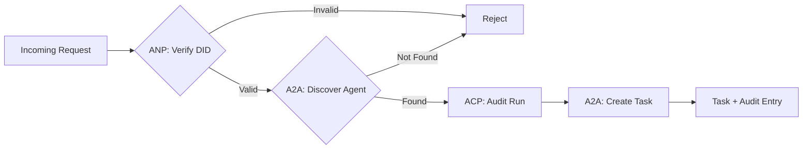

```typescript
class ProtocolGateway {
  private registry: AgentRegistry;
  private taskManager: TaskManager;
  private auditRunner: AuditableRunner;
  private identityRegistry: IdentityRegistry;

  constructor(registry: AgentRegistry, taskManager: TaskManager, auditRunner: AuditableRunner, identityRegistry: IdentityRegistry) {
    this.registry = registry; this.taskManager = taskManager; this.auditRunner = auditRunner; this.identityRegistry = identityRegistry;
  }

  async delegateTask(fromDid: string, signature: string, targetAgent: string, message: AgentMessage, sessionId?: string): Promise<{ task: Task; audit: AuditEntry } | { error: string }> {
    if (!this.identityRegistry.verify(fromDid, signature, message.id)) return { error: "Identity verification failed" };
    const card = this.registry.resolve(targetAgent);
    if (!card) return { error: `Agent ${targetAgent} not found in registry` };
    const audit = await this.auditRunner.run(targetAgent, [message], sessionId);
    const task = await this.taskManager.sendMessage(targetAgent, message);
    return { task, audit };
  }

  async discoverAndDelegate(fromDid: string, signature: string, skillTag: string, message: AgentMessage): Promise<{ task: Task; audit: AuditEntry } | { error: string }> {
    const candidates = this.registry.discoverBySkillTag(skillTag);
    if (candidates.length === 0) return { error: `No agents found with skill tag: ${skillTag}` };
    return this.delegateTask(fromDid, signature, candidates[0].name, message);
  }
}
```

### Step 7: Wire It All Together

```typescript
async function protocolDemo() {
  const registry = new AgentRegistry();
  registry.register({ name: "researcher", description: "Searches and summarizes findings", version: "1.0.0", url: "https://researcher.local/a2a/v1", capabilities: { streaming: true, pushNotifications: false }, defaultInputModes: ["text/plain"], defaultOutputModes: ["text/plain", "application/json"], skills: [{ id: "web-research", name: "Web Research", description: "Searches the web", tags: ["research", "search", "summarization"], inputModes: ["text/plain"], outputModes: ["application/json"] }] });
  registry.register({ name: "coder", description: "Writes code from specs", version: "1.0.0", url: "https://coder.local/a2a/v1", capabilities: { streaming: false, pushNotifications: false }, defaultInputModes: ["text/plain", "application/json"], defaultOutputModes: ["text/plain"], skills: [{ id: "code-gen", name: "Code Generation", description: "Generates code", tags: ["coding", "generation"], inputModes: ["text/plain", "application/json"], outputModes: ["text/plain"] }] });

  const taskManager = new TaskManager();
  const auditRunner = new AuditableRunner();
  const researchTrajectory: TrajectoryEntry[] = [];

  taskManager.registerHandler("researcher", async function* (task, message) {
    yield { kind: "statusUpdate" as const, taskId: task.id, status: { state: "working" as const, timestamp: Date.now() } };
    researchTrajectory.push({ reasoning: "Searching for React 19 documentation", toolName: "web_search", toolInput: { query: "React 19 compiler features" }, toolOutput: { results: ["react.dev/blog/react-19", "github.com/react/react"] }, timestamp: Date.now() });
    yield { kind: "artifactUpdate" as const, taskId: task.id, artifact: { id: crypto.randomUUID(), name: "research-results", parts: [{ kind: "data" as const, data: { findings: ["React 19 compiler auto-memoizes components"], sources: ["react.dev/blog/react-19"] }, mediaType: "application/json" }] }, append: false, lastChunk: true };
    yield { kind: "statusUpdate" as const, taskId: task.id, status: { state: "completed" as const, timestamp: Date.now() } };
  });

  auditRunner.registerAgent("researcher", async () => ({ output: [textMessage("agent", "React 19 compiler auto-memoizes components")], trajectory: researchTrajectory }));

  const identityRegistry = new IdentityRegistry();
  const coderIdentity = createIdentity("coder.local", "coder");
  const researcherIdentity = createIdentity("researcher.local", "researcher");
  identityRegistry.publish(coderIdentity.document);
  identityRegistry.publish(researcherIdentity.document);

  const gateway = new ProtocolGateway(registry, taskManager, auditRunner, identityRegistry);

  console.log("=== Protocol Demo ===\n");
  console.log("1. Agent Discovery (A2A)");
  const researchAgents = registry.discoverBySkillTag("research");
  console.log("   Found", researchAgents.length, "agent(s):", researchAgents.map((a) => a.name));

  console.log("\n2. Identity Verification (ANP)");
  const message = textMessage("user", "Research React 19 compiler features");
  const signature = signPayload(coderIdentity, message.id);
  const verified = identityRegistry.verify(coderIdentity.did, signature, message.id);
  console.log("   Coder DID:", coderIdentity.did);
  console.log("   Signature verified:", verified);

  console.log("\n3. Task Delegation (A2A + ACP + ANP)");
  const result = await gateway.delegateTask(coderIdentity.did, signature, "researcher", message, "session-001");
  if ("error" in result) { console.log("   Error:", result.error); return; }
  console.log("   Task ID:", result.task.id);
  console.log("   Task state:", result.task.status.state);

  console.log("\n4. Audit Trail (ACP)");
  console.log("   Run ID:", result.audit.runId);
  console.log("   Status:", result.audit.status);
  console.log("   Trajectory steps:", result.audit.trajectory.length);
  for (const step of result.audit.trajectory) {
    console.log("     -", step.reasoning);
    if (step.toolName) console.log("       Tool:", step.toolName);
  }
}

protocolDemo().catch((err) => { console.error("Protocol demo failed:", err); process.exitCode = 1; });
```

## What Goes Wrong

**Schema drift.** Agent A publishes an Agent Card advertising `application/json` output but the JSON schema changes between versions. Fix: version your skills and output schemas.

**State machine violations.** An agent handler yields a `completed` event then tries to yield more artifacts. Fix: check terminal state before yielding.

**Trust resolution failures.** Agent A tries to verify Agent B's DID but Agent B's domain is down. ANP recommends fail closed with the principle of least trust.

**Trajectory bloat.** ACP trajectory logging is powerful but expensive. A complex agent that makes 200 tool calls per run produces massive audit entries. Fix: log trajectory at configurable verbosity levels.

**Discovery thundering herd.** 50 agents all query `GET /agents` simultaneously on startup. Fix: cache Agent Cards with TTL.

## Picking the Right Protocol

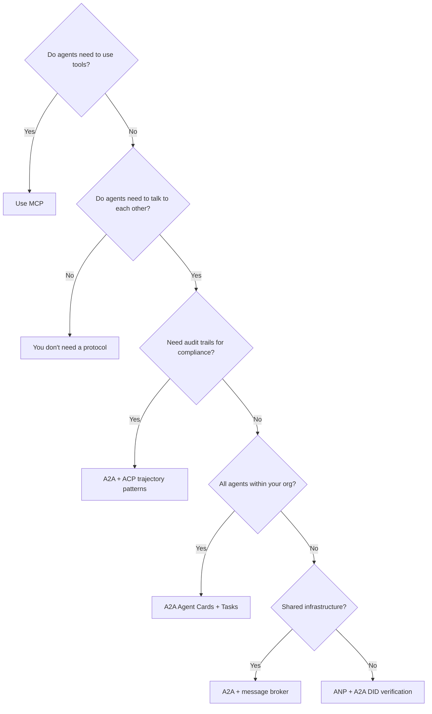

## Exercises

1. **Multi-hop task delegation.** Extend the `TaskManager` so an agent handler can delegate subtasks to other agents.
2. **Streaming audit trail.** Modify the `AuditableRunner` to support streaming mode using async generators.
3. **DID rotation.** Add key rotation to the `IdentityRegistry` with a grace period.
4. **Protocol negotiation.** Implement ANP's meta-protocol concept.
5. **Rate-limited discovery.** Add a `RateLimitedRegistry` wrapper that caches Agent Card lookups.

## Key Terms

| Term | What people say | What it actually means |
|------|----------------|----------------------|
| MCP | "The protocol for AI tools" | A client-server protocol for agents to discover and use tools. |
| A2A | "Google's agent protocol" | A peer-to-peer protocol for agent collaboration under the Linux Foundation. |
| ACP | "Enterprise agent messaging" | IBM/BeeAI's REST API for agent runs with TrajectoryMetadata. |
| ANP | "Decentralized agent identity" | A community protocol using `did:wba` for cryptographic identity. |
| Agent Card | "An agent's business card" | A JSON document at `/.well-known/agent-card.json`. |
| DID | "Decentralized ID" | W3C standard for cryptographically verifiable identities. |
| TrajectoryMetadata | "The audit receipt" | ACP's mechanism for attaching reasoning steps and tool calls. |
| Meta-protocol | "Agents negotiating how to talk" | ANP's approach where agents use natural language to agree on formats. |

## Further Reading

- [Google A2A specification](https://github.com/google/A2A)
- [IBM/BeeAI ACP specification](https://github.com/i-am-bee/acp)
- [Agent Network Protocol](https://github.com/agent-network-protocol/AgentNetworkProtocol)
- [Model Context Protocol docs](https://modelcontextprotocol.io/)
- [W3C Decentralized Identifiers](https://www.w3.org/TR/did-core/)
- [RFC 9180 (HPKE)](https://www.rfc-editor.org/rfc/rfc9180)

[Reference](https://github.com/rohitg00/ai-engineering-from-scratch/tree/main/phases/16-multi-agent-and-swarms/03-communication-protocols)

---

## Part 4 (ch337): The Multi-Agent Primitive Model

> Every multi-agent framework shipping in 2026 — AutoGen, LangGraph, CrewAI, OpenAI Agents SDK, Microsoft Agent Framework — is a point in a four-dimensional design space. Four primitives, nothing more: the agent, the handoff, the shared state, the orchestrator.

**Type:** Learn
**Languages:** Python (stdlib)
**Prerequisites:** Phase 14 (Agent Engineering), Phase 16 · 01 (Why Multi-Agent)
**Time:** ~60 minutes

## Problem

Every six months a new multi-agent framework ships. Each press release claims to be "the right abstraction." Underneath the marketing, the four primitives are stable. Learn them once, read every new framework in one paragraph.

## Concept

### The four primitives

1. **Agent** — a system prompt plus a tool list. Stateless; every run starts from its system prompt and the current message history.
2. **Handoff** — a structured transfer of control from one agent to another. Mechanically, a tool call that returns a new agent or a graph edge that follows a condition.
3. **Shared state** — any data structure that more than one agent can read (sometimes write). Message pool, blackboard, key-value store, vector memory.
4. **Orchestrator** — whoever decides who speaks next. Options: an explicit graph (deterministic), an LLM speaker-selector (soft), the last speaker's handoff call (OpenAI Swarm), or a scheduler over a queue (swarm architecture).

### How every 2026 framework maps to it

| Framework | Agent | Handoff | Shared state | Orchestrator |
|-----------|-------|---------|--------------|--------------|
| OpenAI Swarm / Agents SDK | `Agent(instructions, tools)` | tool returns Agent | caller's problem | the LLM's next handoff call |
| AutoGen v0.4 / AG2 | `ConversableAgent` | speaker-selector on GroupChat | message pool | selector function (LLM or round-robin) |
| CrewAI | `Agent(role, goal, backstory)` | `Process.Sequential / Hierarchical` | Task outputs chained | manager LLM or static order |
| LangGraph | node function | graph edge + condition | `StateGraph` reducer | the graph, deterministic |
| Microsoft Agent Framework | agent + orchestration patterns | pattern-specific | thread / context | pattern-specific |
| Google ADK | agent + A2A card | A2A task | A2A artifacts | host decides |

### Why this matters

Once you see the primitives, framework comparison becomes a short checklist:
- Does the orchestrator trust the LLM to route (Swarm) or does it pin routing in code (LangGraph)?
- Is shared state full-history (GroupChat) or projected (StateGraph reducer)?
- Can agents modify each other's prompts (CrewAI manager) or only hand off (Swarm)?

### The stateless insight

Every primitive except shared state is stateless. Agent is a function of (prompt, tools). Handoff is a function call. Orchestrator is a scheduler. **The only stateful thing in the system is shared state.** That is where all the interesting bugs live: memory poisoning, message ordering, versioning, write contention.

### Anatomy of a single primitive

**Agent** = `(system_prompt, tools, model, optional_name)`. No memory. No state.

**Handoff** = `(from_agent, to_agent, reason, payload)`. Three implementations: function return, graph edge, speaker selection.

**Shared state** = `{ messages: [], artifacts: {}, context: {} }`. Two topologies: **full pool** (every agent sees every message) and **projected** (agents see a role-scoped view).

**Orchestrator** = `({state, last_speaker}) -> next_agent`. Four flavors: static, LLM-selected, handoff-driven, queue-driven.

## Build It

`code/main.py` implements the four primitives in ~150 lines of stdlib Python. No real LLM — each agent is a scripted policy so the focus stays on the coordination structure.

The file exports:
- `Agent` — a dataclass of name, system prompt, tools, policy function.
- `Handoff` — a function that returns a new agent.
- `SharedState` — a thread-safe message pool.
- `Orchestrator` — three variants: `StaticOrchestrator`, `HandoffOrchestrator`, `LLMSelectorOrchestrator` (simulated).

```
python3 code/main.py
```

Expected output: three orchestrator runs, one per pattern. Each prints the final message pool. The handoff-driven run reaches fewer agents if the researcher decides it is done early.

## Exercises

1. Run `code/main.py` three times with different agent policies. Observe how the orchestrator choice changes which agents run.
2. Implement a fourth orchestrator type: a queue-driven one where agents poll shared state for work. What deadlock can happen, and how do you detect it?
3. Take the LangGraph quickstart and rewrite it as the four primitives.
4. Read the OpenAI Swarm cookbook. Identify which of the four primitives Swarm makes most ergonomic, and which one it pushes to the caller.
5. Find one framework in this table that hides shared state entirely. Explain what breaks when agents need to coordinate across handoffs without re-reading history.

## Key Terms

| Term | What people say | What it actually means |
|------|----------------|------------------------|
| Agent | "An LLM with tools" | A `(system_prompt, tools, model)` triple. Stateless. |
| Handoff | "Transfer of control" | A structured call that names the next agent and optional payload. |
| Shared state | "Memory" / "context" | The only stateful part of a multi-agent system. |
| Orchestrator | "Coordinator" | Whoever decides who runs next. |
| Primitive | "Abstraction" | One of the four axes every framework parameterizes. |
| Message pool | "Shared chat history" | Full-history shared state. |
| Projected state | "Scoped view" | Role-specific view into shared state. |
| Speaker selection | "Who talks next" | Orchestrator pattern where a function picks the next agent from a group. |

## Further Reading

- [OpenAI cookbook: Orchestrating Agents — Routines and Handoffs](https://developers.openai.com/cookbook/examples/orchestrating_agents)
- [AutoGen stable docs](https://microsoft.github.io/autogen/stable/)
- [LangGraph workflows and agents](https://docs.langchain.com/oss/python/langgraph/workflows-agents)
- [CrewAI introduction](https://docs.crewai.com/en/introduction)
- [AG2 (community AutoGen continuation)](https://github.com/ag2ai/ag2)

[Reference](https://github.com/rohitg00/ai-engineering-from-scratch/tree/main/phases/16-multi-agent-and-swarms/04-primitive-model)

---

## Part 5 (ch338): Supervisor / Orchestrator-Worker Pattern

> One lead agent plans and delegates; specialized workers execute in parallel contexts and report back. This is the pattern behind Anthropic's Research system (Claude Opus 4 as lead, Sonnet 4 as subagents), measured at +90.2% over single-agent Opus 4 on internal research evals.

**Type:** Learn + Build
**Languages:** Python (stdlib, `threading`)
**Prerequisites:** Phase 16 · 04 (Primitive Model)
**Time:** ~75 minutes

## Problem

Research is the prototypical task that single-agent systems fail. You ask "what changed in multi-agent systems between 2023 and 2026?" A single agent reads five papers sequentially, fills half its context with their text, and then has to reason about all of them together. It forgets the first paper by the time it reaches the fifth. It cannot parallelize.

The supervisor pattern fixes this: one lead agent plans the search, delegates each sub-question to a worker, and synthesizes. Each worker gets its own 200k-token window for a narrow question. The lead never sees the raw papers — only the worker summaries.

Anthropic's production Research system reports +90.2% on internal research evals vs a single Opus 4. The same post notes that 80% of the BrowseComp variance is explained by *token usage alone*. Fresh context per subagent is the main mechanism.

## Concept

### The pattern

```
                 ┌──────────────┐
                 │   Lead       │  plans, decomposes,
                 │  (Opus 4)    │  synthesizes
                 └──┬────┬───┬──┘
                    │    │   │
            ┌───────┘    │   └───────┐
            ▼            ▼           ▼
      ┌─────────┐  ┌─────────┐  ┌─────────┐
      │ Worker1 │  │ Worker2 │  │ Worker3 │
      │(Sonnet) │  │(Sonnet) │  │(Sonnet) │
      └─────────┘  └─────────┘  └─────────┘
         fresh       fresh        fresh
         context     context      context
```

The lead never reads the raw materials. The workers never see each other's work until the lead synthesizes. Each arrow is a handoff with a narrow artifact.

### Why it wins

1. **Fresh context per subagent.** A worker exploring "FIPA-ACL heritage" does not carry the 40k tokens the lead spent planning.
2. **Specialization via prompt.** The lead's prompt is "decompose and synthesize," not "research." Each worker's prompt is narrow.
3. **Parallelism.** Workers run concurrently. Wall-clock time is roughly `max(worker_times) + plan + synthesis`, not `sum(worker_times)`.

### Engineering lessons (Anthropic 2025)

- **Scale effort to query complexity.** Simple queries: one agent, 3-10 tool calls. Complex queries: 10+ agents.
- **Broad then narrow.** Decompose into broad sub-questions first, then spawn more workers per sub-question if needed.
- **Rainbow deployments.** Agents are long-running and stateful. Traditional blue-green does not work. Rainbow: gradual rollout of new versions while old ones drain.
- **Token usage dominates.** Multi-agent is ~15x the tokens of single-agent. Only run it when the task value justifies the cost.

### The LangGraph turn

LangGraph originally shipped a `langgraph-supervisor` library with `create_supervisor`. In 2025 LangChain moved the recommendation to implementing the supervisor pattern via tool-calling directly, because tool calls give more control over what the supervisor sees.

### The failure modes

- **Lead hallucinates the plan.** If the lead generates sub-questions that do not decompose the real question, workers do precise research on the wrong target.
- **Workers over-explore.** Without explicit scope boundaries, workers drift beyond their assigned sub-question.
- **Synthesis conflicts.** Two workers return contradictory facts. The lead must either re-ask or note the disagreement explicitly.

### When supervisor is wrong

- **Sequential tasks.** If step 2 needs step 1's output, parallelism buys nothing. Use a pipeline.
- **Simple queries.** Single-agent handles them faster and cheaper.
- **Strict determinism.** Static graphs are better when audit/replay matter more than adaptability.

## Build It

`code/main.py` implements a supervisor of three parallel workers using `threading`. The lead decomposes a query into sub-questions, workers run concurrently on each sub-question, and the lead synthesizes. No real LLMs — the workers are scripted to simulate fetch-and-summarize.

Key structure:
- `Lead.plan(query)` splits a query into 3 sub-questions.
- `Worker.run(sub_q)` returns a fake summary.
- `Lead.run(query)` kicks off workers in threads, joins, and synthesizes.

```
python3 code/main.py
```

Output shows the plan, the parallel worker traces with start/end timestamps, and the final synthesis. Three 0.3-second workers run in ~0.35 seconds, not 0.9.

## Ship It

Checklist before deploying a supervisor pattern:
- **Model pairing.** Lead on a reasoning-tier model (Opus class). Workers on a faster, cheaper model (Sonnet, `o4-mini`).
- **Worker timeout.** Any worker that exceeds 2x median runtime gets killed.
- **Token cap per worker.** Hard limit prevents a runaway worker from blowing the budget.
- **Observability.** Trace the lead's plan, each worker's tool calls, and the synthesis.
- **Rainbow rollout.** Stateful long-running agents need gradual version transition, not hot swap.

## Exercises

1. Run `code/main.py`, then modify the lead to spawn 5 workers instead of 3. Observe the wall-clock effect.
2. Implement a worker timeout: kill any worker that runs longer than 0.5 seconds and have the lead synthesize the remaining results.
3. Add a conflict-detection step to the lead's synthesis: if two workers return contradictory answers, the lead notes the disagreement rather than picking one.
4. Read Anthropic's Research-system engineering post. List three practices that this toy demo would need to adopt to run in production.
5. Compare LangGraph's `create_supervisor` (legacy) vs the new tool-calling recommendation.

## Key Terms

| Term | What people say | What it actually means |
|------|----------------|------------------------|
| Supervisor | "Lead agent" | An orchestrator agent that plans, delegates, and synthesizes. |
| Worker | "Subagent" | A focused agent invoked by the supervisor with narrow scope. |
| Orchestrator-worker | "Supervisor pattern" | Same thing, different name. |
| Fresh context | "Clean window" | A worker's context starts from its system prompt and assigned question. |
| Rainbow deployment | "Gradual rollout" | Long-running stateful agents need versioned drain-and-replace. |
| Token dominance | "Context is the variable" | 80% of research-eval variance comes from total tokens used. |
| Scale effort | "Match agent count to complexity" | Lead estimates query difficulty, spawns workers accordingly. |
| Synthesis conflict | "Workers disagree" | Lead must surface disagreement, not silently pick one. |

## Further Reading

- [Anthropic engineering — How we built our multi-agent research system](https://www.anthropic.com/engineering/multi-agent-research-system)
- [LangGraph workflows and agents](https://docs.langchain.com/oss/python/langgraph/workflows-agents)
- [LangGraph supervisor reference](https://reference.langchain.com/python/langgraph-supervisor)
- [OpenAI cookbook — Orchestrating Agents: Routines and Handoffs](https://developers.openai.com/cookbook/examples/orchestrating_agents)

[Reference](https://github.com/rohitg00/ai-engineering-from-scratch/tree/main/phases/16-multi-agent-and-swarms/05-supervisor-orchestrator-pattern)

---

## Part 6 (ch339): Hierarchical Architecture and Its Failure Mode

> Hierarchical is supervisor nested. Manager agents over sub-managers over workers. CrewAI `Process.hierarchical` is the textbook version: a `manager_llm` dynamically delegates tasks and validates outputs. It is the natural pattern when the task is a real org chart. It is also the pattern most likely to collapse into managerial looping.

**Type:** Learn + Build
**Languages:** Python (stdlib)
**Prerequisites:** Phase 16 · 05 (Supervisor Pattern)
**Time:** ~60 minutes

## Problem

Once the supervisor pattern clicks, the natural next step is "what if the workers are themselves supervisors?" Teams have sub-teams; companies have departments of departments. Hierarchical architectures mirror that.

The issue: LLM managers are not the same as human managers. A human manager has stable priors about what their reports know. An LLM manager re-reasons the org every turn from whatever is in its context. Tiny drift in that context, and the whole tree misallocates work.

## Concept

### The shape

```
                 Manager
                 ┌─────┐
                 └──┬──┘
           ┌────────┴────────┐
           ▼                 ▼
       Sub-Mgr A         Sub-Mgr B
       ┌─────┐           ┌─────┐
       └──┬──┘           └──┬──┘
         ┌┴──┬──┐          ┌┴──┐
         ▼   ▼  ▼          ▼   ▼
       W1  W2  W3         W4  W5
```

Every internal node plans, delegates, and synthesizes. Only leaves do work.

### Where it shines

- **Clear org mapping.** If the real task is departmental, the hierarchy is explicit.
- **Local summarization.** Each sub-manager synthesizes its team's output before the top manager sees it.

### Where it breaks

1. **Task assignment error.** The manager hallucinates a decomposition and delegates to the wrong sub-manager. The error only surfaces at the top synthesis.
2. **Output misinterpretation.** Sub-manager returns "unable to verify claim X." Top manager summarizes as "claim X not confirmed." Meaning drifts at every level.
3. **Consensus loops.** Two sub-managers disagree; top manager asks them to reconcile; they re-delegate down; workers re-run; loop.

### The deciding question

Sequential (linear pipeline) vs hierarchical: does your task actually have independent sub-teams, or is it one linear flow pretending to be a tree?

### CrewAI's implementation

`Process.hierarchical` wires a manager LLM over specialist crews. The manager receives the top-level task, assigns subtasks to crews, evaluates crew outputs, and decides whether to accept, re-delegate, or iterate.

### LangGraph's implementation

LangGraph uses nested `create_supervisor` calls. The inner supervisor has its own graph; the outer supervisor treats the inner graph as an opaque node.

## Build It

`code/main.py` runs a 3-level hierarchy:
- top manager: splits a task into "engineering" and "legal" branches,
- engineering sub-manager: splits into "frontend" and "backend" workers,
- legal sub-manager: one worker.

Demo contrasts happy path (everyone agrees) against a **perturbed path** where the top manager's decomposition mislabels "legal" as "finance" and watches the error cascade.

```
python3 code/main.py
```

## Ship It

If you ship hierarchical:
- **Cap tree depth at 2.** Three levels already hides most errors from observability.
- **Explicit reconciliation budget.** Set max rounds before the top manager must commit. Usually 2.
- **Provenance on every synthesis.** Each node's summary must cite which leaf outputs produced it.
- **Alert on decomposition drift.** Log the manager's decomposition per step; diff against the user query.

## Exercises

1. Run `code/main.py` and compare happy vs perturbed. How many levels of manager hand-off does it take before the top output fully diverges from the user's question?
2. Add a third level (top → sub → sub-sub → worker). Measure how often the perturbed path corrects itself vs fully diverges as depth grows.
3. Implement a "canary" worker at each sub-manager that is always asked the original user question unchanged.
4. Read CrewAI's `Process.hierarchical` docs. Identify one concrete guardrail CrewAI applies.
5. Compare nested LangGraph supervisors to CrewAI hierarchical. Which makes reconciliation loops cheaper to detect?

## Key Terms

| Term | What people say | What it actually means |
|------|----------------|------------------------|
| Hierarchical | "Org chart pattern" | Supervisors over supervisors; only leaves do work. |
| Manager LLM | "The boss" | The LLM that decomposes, assigns, and validates at an internal node. |
| Decomposition drift | "The boss lost the plot" | Top manager's split no longer covers the original question. |
| Reconciliation loop | "Endless meetings" | Sub-managers disagree; top re-delegates; workers re-run; loop until budget exhausted. |
| Depth-2 ceiling | "Don't go deeper than 2 levels" | Empirical guardrail: 3+ levels collapses observability. |
| Canary question | "Ground truth at every level" | A worker that is always asked the original query unchanged. |
| Provenance chain | "Who said what" | Trace from each synthesis back to the leaf outputs that produced it. |

## Further Reading

- [CrewAI introduction — Process.hierarchical](https://docs.crewai.com/en/introduction)
- [LangGraph supervisor reference](https://reference.langchain.com/python/langgraph-supervisor)
- [Anthropic engineering — Research system](https://www.anthropic.com/engineering/multi-agent-research-system)
- [Cemri et al. — Why Do Multi-Agent LLM Systems Fail?](https://arxiv.org/abs/2503.13657)

[Reference](https://github.com/rohitg00/ai-engineering-from-scratch/tree/main/phases/16-multi-agent-and-swarms/06-hierarchical-architecture)

---

## Part 7 (ch343): Group Chat and Speaker Selection

> AutoGen GroupChat and AG2 GroupChat share one conversation across N agents; a selector function (LLM, round-robin, or custom) picks who speaks next. This is the archetype of emergent multi-agent conversation — agents do not know their role in a static graph, they just react to the shared pool.

**Type:** Learn + Build
**Languages:** Python (stdlib)
**Prerequisites:** Phase 16 · 04 (Primitive Model)
**Time:** ~60 minutes

## Problem

Static graphs (LangGraph) are great when the workflow is known. Real conversations are not static: sometimes the coder asks the reviewer, sometimes the researcher, sometimes the writer. Hardcoding every possible handoff produces an edge explosion. You want agents reacting to a shared pool, with some function deciding who talks next.

## Concept

### The shape

```
              ┌─── shared pool ────┐
              │   m1  m2  m3  ...  │
              └─────────┬──────────┘
                        │ (everyone reads all)
      ┌───────┬─────────┼─────────┬───────┐
      ▼       ▼         ▼         ▼       ▼
    Agent A  Agent B  Agent C  Agent D  Selector
                                           │
                                           ▼
                                  "next speaker = C"
```

Every agent sees every message. A selector function is invoked at each turn to pick who speaks next.

### The three selector flavors

**Round-robin.** Fixed cycle. Deterministic. Scales linearly in N but ignores context.

**LLM-selected.** A call to an LLM that reads the recent pool and returns the best next speaker. Context-aware but slow.

**Custom.** A Python function with whatever logic you want.

### The ConversableAgent API

```
agent = ConversableAgent(name="coder", system_message="You write Python.", llm_config={...})
chat = GroupChat(agents=[coder, reviewer, tester], messages=[])
manager = GroupChatManager(groupchat=chat, llm_config={...})
```

`GroupChatManager` holds the selector. When an agent completes a turn, the manager calls the selector, which returns the next agent.

### Termination

Three common patterns: max rounds, "TERMINATE" token, goal-reached check.

### The AutoGen → AG2 split and Microsoft Agent Framework merge

In early 2025, Microsoft began a major rewrite of AutoGen (v0.4) around an event-driven actor model. The community forked AutoGen v0.2's GroupChat semantics as AG2. In February 2026, Microsoft announced AutoGen would go to maintenance mode, merging into Microsoft Agent Framework. AG2 is the preferred upstream for v0.2-compatible code.

### When GroupChat fits

- **Emergent conversations.** You do not want to pre-wire every possible next-speaker.
- **Role-mixing tasks.** Coder asks researcher, researcher asks archivist, archivist asks coder back.
- **Exploratory problem-solving.** Think "brainstorm meeting," not "assembly line."

### When it fails

- **Strict determinism.** The LLM selector can be inconsistent.
- **Sycophancy cascades.** Agents defer to whoever spoke most confidently.
- **Context bloat.** Every agent reads every message.
- **Hot speakers.** One agent dominates the conversation.

## Build It

`code/main.py` implements a GroupChat from scratch in stdlib. Three agents (coder, reviewer, manager), round-robin and LLM-selected variants, and a termination on a `TERMINATE` token.

```
python3 code/main.py
```

## Ship It

Checklist:
- **Max rounds cap.** Always. 10-20 for typical tasks.
- **Speaker-balance metric.** Track turns per agent; alert when imbalance exceeds a threshold.
- **Termination token.** `TERMINATE` or a dedicated verifier agent.
- **Projection or scoped memory.** After ~10 messages, consider giving each agent only a scoped view.
- **Selector logging.** For LLM-selected variants, log both the selector's input and its choice.

## Exercises

1. Run `code/main.py`. Compare the conversation under round-robin vs LLM-selected.
2. Add a "max-speaks-per-agent" rule in the selector.
3. Implement a goal-reached termination: stop when the reviewer returns "approved."
4. Read the AutoGen stable docs on GroupChat. Identify the default selector used by `GroupChatManager`.
5. Read the AG2 repo and compare its v0.2 GroupChat to the v0.4 event-driven version.

## Key Terms

| Term | What people say | What it actually means |
|------|----------------|------------------------|
| GroupChat | "Agents in one chat room" | Shared message pool + selector function. |
| Speaker selection | "Who talks next" | The function that picks the next agent. |
| GroupChatManager | "The meeting host" | AutoGen component that owns the selector. |
| ConversableAgent | "The base agent" | AutoGen base class. |
| Termination token | "The 'stop' word" | Sentinel string that ends the chat. |
| Hot speaker | "One agent dominates" | Failure mode where the selector keeps picking the same agent. |
| Context bloat | "Pool grows unbounded" | Each agent reads every prior message. |
| Projection | "Scoped view" | Role-specific view into the shared pool. |

## Further Reading

- [AutoGen group chat docs](https://microsoft.github.io/autogen/stable/user-guide/core-user-guide/design-patterns/group-chat.html)
- [AG2 repo](https://github.com/ag2ai/ag2)
- [Microsoft Agent Framework docs](https://microsoft.github.io/agent-framework/)
- [AutoGen v0.4 release notes](https://microsoft.github.io/autogen/stable/)

[Reference](https://github.com/rohitg00/ai-engineering-from-scratch/tree/main/phases/16-multi-agent-and-swarms/10-group-chat-speaker-selection)

---

## Part 8 (ch344): Handoffs and Routines — Stateless Orchestration

> OpenAI's Swarm (October 2024) distilled multi-agent orchestration to two primitives: **routines** (instructions + tools as a system prompt) and **handoffs** (a tool that returns another Agent). No state machine, no branching DSL — the LLM routes by calling the right handoff tool.

**Type:** Learn + Build
**Languages:** Python (stdlib)
**Prerequisites:** Phase 16 · 04 (Primitive Model)
**Time:** ~60 minutes

## Problem

Every multi-agent framework wants you to learn its DSL: LangGraph nodes and edges, CrewAI crews and tasks, AutoGen GroupChat and managers. Swarm pushes in the opposite direction: use the tool-calling capability the model already has. Handoffs become tool calls.

## Concept

### Two primitives

**Routine.** A system prompt that defines an agent's role and available tools.

**Handoff.** A tool the agent can call that returns a new Agent object. The Swarm runtime detects the Agent return value and switches the active agent for the next turn.

```
def transfer_to_refunds():
    return refund_agent  # Swarm sees Agent return → switch active agent

triage_agent = Agent(
    name="triage",
    instructions="Route the user to the right specialist.",
    functions=[transfer_to_refunds, transfer_to_sales, transfer_to_support],
)
```

### Why it is viral

- **Small API.** Two concepts to learn.
- **Uses what the model already does.** Tool calling is already production-grade across providers.
- **No state-machine burden.** The agents' prompts describe who they hand off to.

### The stateless trade

Swarm is explicitly stateless between runs. Memory, continuity, long-running tasks — all the caller's problem. In production (OpenAI Agents SDK, March 2025) this was one of the main things that changed: the SDK adds built-in session management, guardrails, and tracing while keeping the handoff primitive.

### When Swarm/handoffs fit

- **Triage patterns.** Front-line agent routes user to a specialist.
- **Skill-based handoffs.** "If the task needs code, call the coder."
- **Short, bounded conversations.** Customer support, FAQ-to-ticket.

### When Swarm struggles

- **Long sessions with shared memory.** Handoffs reset state.
- **Parallel execution.** Handoff is one-at-a-time.
- **Audit and replay.** LLM's handoff choice is not deterministic.

### OpenAI Agents SDK (March 2025)

Adds session state, guardrails, tracing, and handoff filters. The handoff primitive survives.

### Swarm vs GroupChat

GroupChat: a selector picks the next speaker from outside. Swarm: the current agent picks its successor by calling a handoff tool.

## Build It

`code/main.py` implements Swarm from scratch: an Agent dataclass, a handoff mechanism (tool returns Agent), and a run loop that detects agent switches.

Demo: a triage agent routes to refund, sales, or support specialists.

```
python3 code/main.py
```

## Ship It

Checklist:
- **Handoff logging.** Every handoff writes a trace event.
- **Context transfer rules.** Decide what moves on handoff.
- **Guardrail on handoff.** Handoff to a specialist with different tool permissions must be authenticated.
- **Loop detection.** Detect two agents handing back and forth.
- **Fallback agent.** If a handoff target does not exist, fall back to a safe default.

## Exercises

1. Run `code/main.py`, triage to the refund agent. Confirm the second turn's active agent is refund.
2. Add a loop-detection rule: if the same two agents have handed off 3 times in a row, force an exit.
3. Read the OpenAI Agents SDK docs on handoff filters. Implement a "summarize-on-handoff" version.
4. Compare the Swarm handoff to a GroupChatManager selector. Which pattern makes prompt injection worse, and why?
5. Read the Swarm cookbook. Identify one explicit design decision Swarm makes that OpenAI Agents SDK changed or kept.

## Key Terms

| Term | What people say | What it actually means |
|------|----------------|------------------------|
| Routine | "The agent prompt" | System prompt + tool list. Defines role and available handoffs. |
| Handoff | "Transfer to another agent" | A tool that returns a new Agent. The runtime switches active agent. |
| Stateless | "No memory between runs" | Swarm does not persist anything. |
| Active agent | "Who's speaking now" | The agent currently holding the conversation. |
| Context transfer | "What moves on handoff" | Policy for what history the incoming agent sees. |
| Handoff loop | "Agents ping-pong" | Failure mode where two agents keep handing back to each other. |
| OpenAI Agents SDK | "Production Swarm" | March 2025 successor; adds sessions, guardrails, tracing. |
| Handoff filter | "Gate on transfer" | SDK feature to inspect and modify context at the handoff boundary. |

## Further Reading

- [OpenAI cookbook — Orchestrating Agents: Routines and Handoffs](https://developers.openai.com/cookbook/examples/orchestrating_agents)
- [OpenAI Swarm repo](https://github.com/openai/swarm)
- [OpenAI Agents SDK docs](https://openai.github.io/openai-agents-python/)
- [Anthropic handoff-in-Claude notes](https://docs.anthropic.com/en/docs/claude-code)

[Reference](https://github.com/rohitg00/ai-engineering-from-scratch/tree/main/phases/16-multi-agent-and-swarms/11-handoffs-and-routines)
