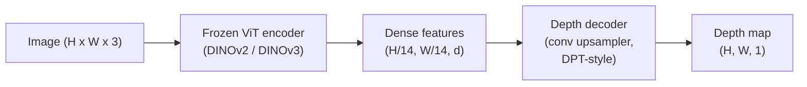

# Monocular Depth & Geometry Estimation

> A depth map is a single-channel image where each pixel is a distance from the camera. Predicting it from one RGB frame used to be impossible without stereo or LiDAR. In 2026 a frozen ViT encoder plus a lightweight head gets within a few percent of ground truth.

**Type:** Build + Use
**Languages:** Python
**Prerequisites:** Phase 4 Lesson 14 (ViT), Phase 4 Lesson 17 (Self-Supervised Vision), Phase 4 Lesson 07 (U-Net)
**Time:** ~60 minutes

## Learning Objectives

- Distinguish relative and metric depth and state which one each production model (MiDaS, Marigold, Depth Anything V3, ZoeDepth) solves
- Use Depth Anything V3 (DINOv2 backbone) to predict depth for arbitrary single images with no calibration
- Explain why monocular depth works at all from a single image (perspective cues, texture gradients, learned priors) and what it cannot recover (absolute scale, occluded geometry)
- Lift 2D detections to 3D points using a depth map and pinhole camera intrinsics

## The Problem

Depth is the missing axis in 2D computer vision. Given RGB, you know where things appear in the image plane; you do not know how far they are. Depth sensors (stereo rigs, LiDAR, time-of-flight) solve this directly but are expensive, fragile, and limited in range.

Monocular depth estimation — predicting depth from a single RGB frame — used to produce blurry, unreliable output. By 2026 large pretrained encoders changed that: Depth Anything V3 uses a frozen DINOv2 backbone and produces depth maps that generalise across indoor, outdoor, medical, and satellite domains. Marigold reframes depth as a conditional diffusion problem. ZoeDepth regresses true metric distances.

Depth is also the bridge between 2D detection and 3D understanding: multiply a detected box's pixels by depth and you lift the 2D object into a 3D point cloud. That is the core of every AR occlusion system, every obstacle-avoidance pipeline, and every "pick up the cup" robot.

## The Concept

### Relative vs metric depth

- **Relative depth** — ordered `z` values without a real-world unit.
- **Metric depth** — absolute distance in metres from the camera.

MiDaS and Depth Anything V3 produce relative depth. Marigold produces relative depth. ZoeDepth, UniDepth, and Metric3D produce metric depth.

### The encoder-decoder pattern



Depth Anything V3 freezes the encoder and trains only the DPT-style decoder.

### Why a single image produces depth at all

- **Perspective** — parallel lines in 3D converge in 2D.
- **Texture gradient** — surfaces far away have smaller, denser texture.
- **Occlusion order** — nearer objects occlude farther ones.
- **Size constancy** — known objects (cars, humans) give approximate scale.
- **Atmospheric perspective** — distant objects appear hazier and bluer in outdoor scenes.

### What monocular depth cannot do

- **Absolute metric scale** without intrinsics or a known object in the scene.
- **Occluded geometry** — the back of a chair is unseen.
- **Truly untextured / reflective surfaces** — mirrors, glass, uniform walls.

### Depth Anything V3 in 2026

- Vanilla DINOv2 ViT-L/14 as encoder (frozen).
- DPT decoder.
- Trained on posed image pairs from diverse sources.
- Predicts spatially consistent geometry from an arbitrary number of visual inputs.

### Marigold — diffusion for depth

Marigold (Ke et al., CVPR 2024) reframes depth estimation as conditional image-to-image diffusion. Output depth maps are exceptionally sharp at object boundaries. Trade-off: slower inference than feed-forward models (10-50 denoising steps).

### Intrinsics and the pinhole camera

```
fx, fy, cx, cy = camera intrinsics
X = (u - cx) * d / fx
Y = (v - cy) * d / fy
Z = d
```

### Evaluation

- **AbsRel** (absolute relative error): `mean(|d_pred - d_gt| / d_gt)`. 0.05-0.1 for production models.
- **delta < 1.25**: fraction of pixels where `max(d_pred/d_gt, d_gt/d_pred) < 1.25`. 0.9+ for SOTA.

## Build It

### Step 1: Depth metrics

```python
import torch

def abs_rel_error(pred, target, mask=None):
    if mask is not None:
        pred = pred[mask]
        target = target[mask]
    return (torch.abs(pred - target) / target.clamp(min=1e-6)).mean().item()

def delta_accuracy(pred, target, threshold=1.25, mask=None):
    if mask is not None:
        pred = pred[mask]
        target = target[mask]
    ratio = torch.maximum(pred / target.clamp(min=1e-6), target / pred.clamp(min=1e-6))
    return (ratio < threshold).float().mean().item()
```

### Step 2: Scale-and-shift alignment

```python
def align_scale_shift(pred, target, mask=None):
    if mask is not None:
        p = pred[mask]
        t = target[mask]
    else:
        p = pred.flatten()
        t = target.flatten()
    A = torch.stack([p, torch.ones_like(p)], dim=1)
    coeffs, *_ = torch.linalg.lstsq(A, t.unsqueeze(-1))
    a, b = coeffs[:2, 0]
    return a * pred + b
```

### Step 3: Lift depth to a point cloud

```python
import numpy as np

def depth_to_point_cloud(depth, intrinsics):
    H, W = depth.shape
    fx, fy, cx, cy = intrinsics
    v, u = np.meshgrid(np.arange(H), np.arange(W), indexing="ij")
    z = depth
    x = (u - cx) * z / fx
    y = (v - cy) * z / fy
    return np.stack([x, y, z], axis=-1)

depth = np.random.uniform(0.5, 4.0, (240, 320))
intr = (320.0, 320.0, 160.0, 120.0)
pc = depth_to_point_cloud(depth, intr)
print(f"point cloud shape: {pc.shape}  (H, W, 3)")
```

### Step 4: Smoke test with a synthetic depth scene

```python
def synthetic_depth(size=96):
    yy, xx = np.meshgrid(np.arange(size), np.arange(size), indexing="ij")
    depth = 1.0 + (yy / size) * 4.0
    mask = (np.abs(xx - size / 2) < size / 6) & (np.abs(yy - size * 0.6) < size / 6)
    depth[mask] = 2.0
    return depth.astype(np.float32)

gt = torch.from_numpy(synthetic_depth(96))
pred = gt + 0.3 * torch.randn_like(gt)
aligned = align_scale_shift(pred, gt)
print(f"before align  absRel = {abs_rel_error(pred, gt):.3f}")
print(f"after align   absRel = {abs_rel_error(aligned, gt):.3f}")
```

### Step 5: Depth Anything V3 usage (reference)

```python
import torch
from transformers import pipeline
from PIL import Image

pipe = pipeline(task="depth-estimation", model="LiheYoung/depth-anything-v2-large")

image = Image.open("street.jpg").convert("RGB")
out = pipe(image)
depth_np = np.array(out["depth"])
```

## Use It

- **Depth Anything V3** — the default for relative depth.
- **Marigold** — highest visual quality, slow inference.
- **UniDepth** — metric depth with camera intrinsics estimation.
- **ZoeDepth** — older, still reliable.
- **MiDaS v3.1** — legacy but stable.

Typical integration: RGB frame → depth model → detector → lift box centroids through depth to 3D → downstream AR occlusion, path planning, object-size estimation.

## Ship It

This lesson produces:

- `outputs/prompt-depth-model-picker.md` — picks between Depth Anything V3, Marigold, UniDepth, MiDaS given latency, metric-vs-relative need, and scene type.
- `outputs/skill-depth-to-pointcloud.md` — a skill that builds point clouds from depth maps with correct intrinsics handling and export to `.ply`.

## Exercises

1. **(Easy)** Run Depth Anything V2 on any 10 images of your desk. Save depth as grayscale PNGs and inspect. Identify one object whose predicted depth looks wrong and explain why the monocular cues failed.
2. **(Medium)** Given RGB + depth from Depth Anything V2, lift to a point cloud and render with `open3d`. Compare two scenes (indoor / outdoor).
3. **(Hard)** Take five pairs of images that differ only by a known object's position (e.g. bottle moved 30 cm closer). Use UniDepth to predict metric depth on both. Report the predicted distance delta vs the true 30 cm.

## Key Terms

| Term | What people say | What it actually means |
|------|----------------|----------------------|
| Monocular depth | "Single-image depth" | Depth estimation from one RGB frame, no stereo or LiDAR |
| Relative depth | "Ordered depth" | Ordered z-values without real-world units |
| Metric depth | "Absolute distance" | Depth in metres; requires calibration or a model trained with metric supervision |
| AbsRel | "Absolute relative error" | Mean of |d_pred - d_gt| / d_gt; standard depth metric |
| Delta accuracy | "delta < 1.25" | Fraction of pixels with prediction within 25% of ground truth |
| Pinhole camera | "fx, fy, cx, cy" | The camera model used to lift (u, v, d) to (X, Y, Z) |
| DPT | "Dense Prediction Transformer" | The conv-based decoder used on top of frozen ViT encoders for depth |
| DINOv2 backbone | "The reason it works" | Self-supervised features that generalise across domains without depth labels |

## Further Reading

- [Depth Anything V3 paper page](https://depth-anything.github.io/)
- [Marigold (Ke et al., CVPR 2024)](https://marigoldmonodepth.github.io/)
- [UniDepth (Piccinelli et al., 2024)](https://arxiv.org/abs/2403.18913)
- [MiDaS v3.1 (Intel ISL)](https://github.com/isl-org/MiDaS)
- [DINOv3 blog post (Meta)](https://ai.meta.com/blog/dinov3-self-supervised-vision-model/)

> Reference: [ai-engineering/phases/04-computer-vision/26-monocular-depth/docs/en.md](https://github.com/anomalyco/ai-engineering/blob/main/phases/04-computer-vision/26-monocular-depth/docs/en.md)
