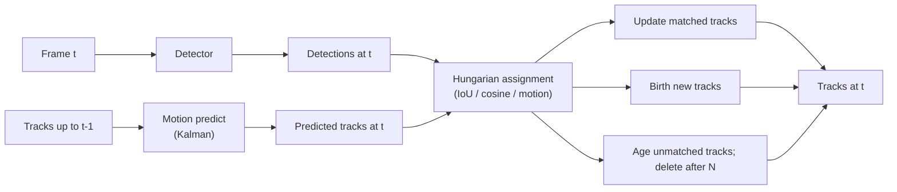

# Multi-Object Tracking & Video Memory

> Tracking is detection plus association. Detect every frame. Match this frame's detections to last frame's tracks by ID.

**Type:** Build
**Languages:** Python
**Prerequisites:** Phase 4 Lesson 06 (YOLO Detection), Phase 4 Lesson 08 (Mask R-CNN), Phase 4 Lesson 24 (SAM 3)
**Time:** ~60 minutes

## Learning Objectives

- Distinguish tracking-by-detection from query-based tracking and name the algorithm families (SORT, DeepSORT, ByteTrack, BoT-SORT, SAM 2 memory tracker, SAM 3.1 Object Multiplex)
- Implement IoU + Hungarian assignment from scratch for classic tracking-by-detection
- Explain SAM 2's memory bank and why it handles occlusion better than IoU-based association
- Read the three tracking metrics (MOTA, IDF1, HOTA) and pick which one matters for a given use case

## The Problem

A detector tells you where the objects are in a single frame. A tracker tells you which detection in frame `t` is the same object as a detection in frame `t-1`. Without that, you cannot count objects crossing a line, follow a ball through an occlusion, or know "car #4 has been in the lane for 8 seconds."

Tracking is essential to every video-facing product: sports analytics, surveillance, autonomous driving, medical video analysis, wildlife monitoring. The core building blocks are shared: a per-frame detector, a motion model (Kalman filter or something richer), an association step (Hungarian algorithm on IoU / cosine / learned features), and a track lifecycle (birth, update, death).

2026 brought two new patterns: **SAM 2 memory-based tracking** (feature-memory instead of motion-model association) and **SAM 3.1 Object Multiplex** (shared memory for many instances of the same concept). This lesson walks the classical stack first, then the memory-based approach.

## The Concept

### Tracking-by-detection



Every tracker you will encounter in 2026 is a variation on this loop:

- **SORT** (2016): Kalman filter + IoU Hungarian. Simple, fast, no appearance model.
- **DeepSORT** (2017): SORT + a CNN-based appearance feature per track (ReID embedding).
- **ByteTrack** (2021): associates low-confidence detections as a second stage.
- **BoT-SORT** (2022): Byte + camera motion compensation + ReID.
- **StrongSORT / OC-SORT** — ByteTrack descendants with better motion and appearance.

### Kalman filter in one paragraph

A Kalman filter maintains a per-track state `(x, y, w, h, dx, dy, dw, dh)` with a covariance. At each frame, **predict** the state using a constant-velocity model, then **update** with the matched detection. This gives smooth trajectories and the ability to continue a track through a short occlusion (1-5 frames).

### The Hungarian algorithm

Given an `M x N` cost matrix (tracks x detections), find the one-to-one assignment that minimises total cost. Cost is usually `1 - IoU(track_bbox, detection_bbox)` or negative cosine similarity.

### ByteTrack's key idea

Standard trackers drop low-confidence detections (< 0.5). ByteTrack keeps them as **second-stage candidates**: after matching tracks to high-confidence detections, unmatched tracks try to match low-confidence detections with a looser IoU threshold.

### SAM 2 memory-based tracking

SAM 2 handles video by keeping a **memory bank** of per-instance spatio-temporal features. On subsequent frames, the memory is cross-attended against the new frame's features, and the decoder produces a mask for the same instance.

No Kalman filter, no Hungarian assignment. The association is implicit in the memory-attention operation.

### SAM 3.1 Object Multiplex

Prior SAM 2 / SAM 3 tracking keeps a separate memory bank per instance. Object Multiplex (March 2026) collapses them into one shared memory with **per-instance query tokens**. Cost scales sub-linearly in number of instances.

### Three metrics to know

- **MOTA** — 1 - (FN + FP + ID switches) / GT. Conflates detection and association failures.
- **IDF1** — harmonic mean of ID precision and recall. For ID-switch-sensitive tasks.
- **HOTA** — decomposes into detection accuracy (DetA) and association accuracy (AssA). Community standard.

## Build It

### Step 1: IoU-based cost matrix

```python
import numpy as np

def bbox_iou(a, b):
    ax1, ay1, ax2, ay2 = a[:, 0], a[:, 1], a[:, 2], a[:, 3]
    bx1, by1, bx2, by2 = b[:, 0], b[:, 1], b[:, 2], b[:, 3]
    inter_x1 = np.maximum(ax1[:, None], bx1[None, :])
    inter_y1 = np.maximum(ay1[:, None], by1[None, :])
    inter_x2 = np.minimum(ax2[:, None], bx2[None, :])
    inter_y2 = np.minimum(ay2[:, None], by2[None, :])
    inter = np.clip(inter_x2 - inter_x1, 0, None) * np.clip(inter_y2 - inter_y1, 0, None)
    area_a = (ax2 - ax1) * (ay2 - ay1)
    area_b = (bx2 - bx1) * (by2 - by1)
    union = area_a[:, None] + area_b[None, :] - inter
    return inter / np.clip(union, 1e-8, None)
```

### Step 2: Minimal SORT-style tracker

```python
from scipy.optimize import linear_sum_assignment

class Track:
    def __init__(self, tid, bbox, frame):
        self.id = tid
        self.bbox = bbox
        self.last_frame = frame
        self.hits = 1

    def update(self, bbox, frame):
        self.bbox = bbox
        self.last_frame = frame
        self.hits += 1


class SimpleTracker:
    def __init__(self, iou_threshold=0.3, max_age=5):
        self.tracks = []
        self.next_id = 1
        self.iou_threshold = iou_threshold
        self.max_age = max_age

    def step(self, detections, frame):
        if not self.tracks:
            for d in detections:
                self.tracks.append(Track(self.next_id, d, frame))
                self.next_id += 1
            return [(t.id, t.bbox) for t in self.tracks]

        track_boxes = np.array([t.bbox for t in self.tracks])
        det_boxes = np.array(detections) if len(detections) else np.empty((0, 4))

        iou = bbox_iou(track_boxes, det_boxes) if len(det_boxes) else np.zeros((len(track_boxes), 0))
        cost = 1 - iou
        cost[iou < self.iou_threshold] = 1e6

        matched_track = set()
        matched_det = set()
        if cost.size > 0:
            row, col = linear_sum_assignment(cost)
            for r, c in zip(row, col):
                if cost[r, c] < 1.0:
                    self.tracks[r].update(det_boxes[c], frame)
                    matched_track.add(r); matched_det.add(c)

        for i, d in enumerate(det_boxes):
            if i not in matched_det:
                self.tracks.append(Track(self.next_id, d, frame))
                self.next_id += 1

        self.tracks = [t for t in self.tracks if frame - t.last_frame <= self.max_age]
        return [(t.id, t.bbox) for t in self.tracks]
```

### Step 3: Synthetic trajectory test

```python
def synthetic_frames(num_frames=20, num_objects=3, H=240, W=320, seed=0):
    rng = np.random.default_rng(seed)
    starts = rng.uniform(20, 200, size=(num_objects, 2))
    velocities = rng.uniform(-5, 5, size=(num_objects, 2))
    frames = []
    for f in range(num_frames):
        dets = []
        for i in range(num_objects):
            cx, cy = starts[i] + f * velocities[i]
            dets.append([cx - 10, cy - 10, cx + 10, cy + 10])
        frames.append(dets)
    return frames

tracker = SimpleTracker()
for f, dets in enumerate(synthetic_frames()):
    tracks = tracker.step(dets, f)
```

### Step 4: ID-switch metric

```python
def count_id_switches(tracks_per_frame, gt_per_frame):
    prev_assignment = {}
    switches = 0
    for tracks, gts in zip(tracks_per_frame, gt_per_frame):
        if not tracks or not gts:
            continue
        t_boxes = np.array([b for _, b in tracks])
        g_boxes = np.array([b for _, b in gts])
        iou = bbox_iou(g_boxes, t_boxes)
        for g_idx, (gt_id, _) in enumerate(gts):
            j = iou[g_idx].argmax()
            if iou[g_idx, j] > 0.5:
                t_id = tracks[j][0]
                if gt_id in prev_assignment and prev_assignment[gt_id] != t_id:
                    switches += 1
                prev_assignment[gt_id] = t_id
    return switches
```

## Use It

Production trackers in 2026:

- `ultralytics` — YOLOv8 + ByteTrack / BoT-SORT built-in.
- `supervision` (Roboflow) — ByteTrack wrappers plus annotation utilities.
- SAM 2 / SAM 3.1 — memory-based tracking via `processor.track()`.
- Custom stack: detector (YOLOv8 / RT-DETR) + `sort-tracker` / `OC-SORT` / `StrongSORT`.

Picking:
- Pedestrians / cars at 30+ fps: **ByteTrack with ultralytics**.
- Many instances of one class in a crowd: **SAM 3.1 Object Multiplex**.
- Heavy occlusions: **DeepSORT / StrongSORT** (ReID features).
- Sports / complex interactions: **BoT-SORT** or learned trackers (MOTRv3).

## Ship It

This lesson produces:

- `outputs/prompt-tracker-picker.md` — picks SORT / ByteTrack / BoT-SORT / SAM 2 / SAM 3.1 given scene type, occlusion patterns, and latency budget.
- `outputs/skill-mot-evaluator.md` — writes a complete evaluation harness for MOTA / IDF1 / HOTA against ground-truth tracks.

## Exercises

1. **(Easy)** Run the synthetic tracker above with 3, 10, and 30 objects. Report ID-switch count in each case.
2. **(Medium)** Add a constant-velocity Kalman predict step before association. Show that short (2-3 frame) occlusions no longer cause ID switches.
3. **(Hard)** Integrate SAM 2's memory-based tracker (via `transformers`) as an alternative tracker backend. Run both SimpleTracker and SAM 2 on a 30-second clip of a crowd and compare ID-switch counts.

## Key Terms

| Term | What people say | What it actually means |
|------|----------------|----------------------|
| Tracking-by-detection | "Detect then associate" | Per-frame detector + Hungarian assignment on IoU / appearance |
| Kalman filter | "Motion predict" | Linear dynamics + covariance for smooth track predictions and occlusion handling |
| Hungarian algorithm | "Optimal assignment" | Solves the minimum-cost bipartite matching problem |
| ByteTrack | "Low-confidence second pass" | Re-match unmatched tracks to low-confidence detections |
| DeepSORT | "SORT + appearance" | Adds a ReID feature for cross-frame matching |
| Memory bank | "SAM 2 trick" | Per-instance spatio-temporal features stored across frames |
| Object Multiplex | "SAM 3.1 shared memory" | Single shared memory with per-instance queries for fast many-object tracking |
| HOTA | "Modern tracking metric" | Decomposes into detection and association accuracy |

## Further Reading

- [SORT (Bewley et al., 2016)](https://arxiv.org/abs/1602.00763)
- [DeepSORT (Wojke et al., 2017)](https://arxiv.org/abs/1703.07402)
- [ByteTrack (Zhang et al., 2022)](https://arxiv.org/abs/2110.06864)
- [BoT-SORT (Aharon et al., 2022)](https://arxiv.org/abs/2206.14651)
- [HOTA (Luiten et al., 2020)](https://arxiv.org/abs/2009.07736)
- [SAM 2 video segmentation (Meta, 2024)](https://ai.meta.com/sam2/)
- [SAM 3.1 Object Multiplex (Meta, March 2026)](https://ai.meta.com/blog/segment-anything-model-3/)

> Reference: [ai-engineering/phases/04-computer-vision/27-multi-object-tracking/docs/en.md](https://github.com/anomalyco/ai-engineering/blob/main/phases/04-computer-vision/27-multi-object-tracking/docs/en.md)
