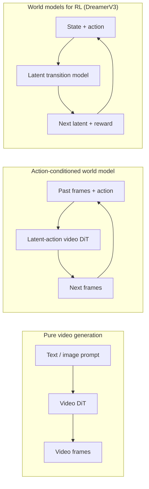

# World Models & Video Diffusion

> A video model that predicts the next seconds of a scene is a world simulator. Condition that prediction on actions and you have a learned game engine.

**Type:** Learn + Build
**Languages:** Python
**Prerequisites:** Phase 4 Lesson 10 (Diffusion), Phase 4 Lesson 12 (Video Understanding), Phase 4 Lesson 23 (DiT + Rectified Flow)
**Time:** ~75 minutes

## Learning Objectives

- Explain the difference between a pure video generation model (Sora 2) and an action-conditioned world model (Genie 3, DreamerV3)
- Describe a video DiT: spatio-temporal patches, 3D position encoding, joint attention across (T, H, W) tokens
- Trace how a world model plugs into robotics: VLM plans → video model simulates → inverse dynamics emits actions
- Pick between Sora 2, Genie 3, Runway GWM-1 Worlds, Wan-Video, and HunyuanVideo for a given use case

## The Problem

Video generation and world modelling converged in 2026. A model that can generate a coherent minute of video has, in some sense, learned how the world moves: object permanence, gravity, causality, style. If you condition that prediction on actions (walk left, open the door), the video model becomes a learnable simulator that can replace a game engine, a driving simulator, or a robotics environment.

The stakes are concrete. Genie 3 generates playable environments from a single image. Runway GWM-1 Worlds synthesises infinite explorable scenes. Sora 2 produces minute-long videos with synchronised audio and modelled physics. NVIDIA Cosmos-Drive, Wayve Gaia-2, and Tesla DrivingWorld generate realistic driving video for autonomous-vehicle training data.

## The Concept

### Three families of world-modelling



- **Sora 2** is pure video generation conditioned on prompts. No action interface.
- **Genie 3**, **GWM-1 Worlds**, **Mirage / Magica** are action-conditioned world models.
- **DreamerV3** and the classic RL world-model family predict in a latent space.

### Video DiT architecture

```
Video latent:          (C, T, H, W)
Patchify (spatial):    grid of P_h x P_w patches per frame
Patchify (temporal):   group P_t frames into a temporal patch
Resulting tokens:      (T / P_t) * (H / P_h) * (W / P_w) tokens
```

Positional encoding is 3D. Attention can be:
- **Full joint** — all tokens attend to all tokens. O(N^2). Prohibitive for long videos.
- **Divided** — alternate temporal attention and spatial attention. Used by TimeSformer and most video DiTs.
- **Window** — local windows in (t, h, w). Used by Video Swin.

### Conditioning on actions: latent action models

Genie learns a **latent action** per frame by discriminatively predicting the action between a pair of consecutive frames. At inference, a user can specify a latent action and the model generates the next frame consistent with that action.

Sora skips the action interface entirely.

### Physical plausibility

Sora 2's 2026 release explicitly advertised **physical plausibility**: weight, balance, object permanence, cause-and-effect. Plausibility remains the dominant failure mode for all video generation models.

### Autonomous driving world models

- **Cosmos-Drive-Dreams** (NVIDIA) — generates minutes of driving video for RL training.
- **Gaia-2** (Wayve) — trajectory-conditioned scene synthesis for policy evaluation.
- **DrivingWorld** (Tesla) — simulates varied weather, time-of-day, traffic conditions.

### Robotics stack: VLM + video model + inverse dynamics

1. **VLM** parses the goal, plans a high-level action sequence.
2. **Video generation model** simulates what executing each action would look like.
3. **Inverse dynamics model** extracts the concrete motor commands.

### Model landscape in 2026

| Model | Use | Parameters | Output | License |
|-------|-----|------------|--------|---------|
| Sora 2 | text-to-video, audio | — | 1-min 1080p + audio | API only |
| Runway Gen-5 | text/image-to-video | — | 10s clips | API |
| Runway GWM-1 Worlds | interactive world | — | infinite 3D rollout | API |
| Genie 3 | interactive world from image | 11B+ | playable frames | research preview |
| Wan-Video 2.1 | open text-to-video | 14B | high-quality clips | non-commercial |
| HunyuanVideo | open text-to-video | 13B | 10s clips | permissive |
| Cosmos / Cosmos-Drive | autonomous driving sim | 7-14B | driving scenes | NVIDIA open |

## Build It

### Step 1: 3D patchify for video

```python
import torch
import torch.nn as nn

class VideoPatch3D(nn.Module):
    def __init__(self, in_channels=4, dim=64, patch_t=2, patch_h=2, patch_w=2):
        super().__init__()
        self.proj = nn.Conv3d(in_channels, dim, kernel_size=(patch_t, patch_h, patch_w), stride=(patch_t, patch_h, patch_w))
        self.patch_t = patch_t
        self.patch_h = patch_h
        self.patch_w = patch_w

    def forward(self, x):
        x = self.proj(x)
        n, c, t, h, w = x.shape
        tokens = x.reshape(n, c, t * h * w).transpose(1, 2)
        return tokens, (t, h, w)
```

### Step 2: 3D rotary position encoding

```python
def rope_3d(tokens, t_dim, h_dim, w_dim, grid):
    T, H, W = grid
    n, seq, d = tokens.shape
    assert seq == T * H * W
    t_idx = torch.arange(T, device=tokens.device).repeat_interleave(H * W)
    h_idx = torch.arange(H, device=tokens.device).repeat_interleave(W).repeat(T)
    w_idx = torch.arange(W, device=tokens.device).repeat(T * H)
    freqs_t = torch.exp(-torch.log(torch.tensor(10000.0)) * torch.arange(t_dim // 2, device=tokens.device) / (t_dim // 2))
    freqs_h = torch.exp(-torch.log(torch.tensor(10000.0)) * torch.arange(h_dim // 2, device=tokens.device) / (h_dim // 2))
    freqs_w = torch.exp(-torch.log(torch.tensor(10000.0)) * torch.arange(w_dim // 2, device=tokens.device) / (w_dim // 2))
    emb_t = torch.cat([torch.sin(t_idx[:, None] * freqs_t), torch.cos(t_idx[:, None] * freqs_t)], dim=-1)
    emb_h = torch.cat([torch.sin(h_idx[:, None] * freqs_h), torch.cos(h_idx[:, None] * freqs_h)], dim=-1)
    emb_w = torch.cat([torch.sin(w_idx[:, None] * freqs_w), torch.cos(w_idx[:, None] * freqs_w)], dim=-1)
    return tokens + torch.cat([emb_t, emb_h, emb_w], dim=-1)
```

### Step 3: Divided attention block

```python
class DividedAttentionBlock(nn.Module):
    def __init__(self, dim=64, heads=2):
        super().__init__()
        self.time_attn = nn.MultiheadAttention(dim, heads, batch_first=True)
        self.space_attn = nn.MultiheadAttention(dim, heads, batch_first=True)
        self.ln1 = nn.LayerNorm(dim)
        self.ln2 = nn.LayerNorm(dim)
        self.ln3 = nn.LayerNorm(dim)
        self.mlp = nn.Sequential(nn.Linear(dim, 4 * dim), nn.GELU(), nn.Linear(4 * dim, dim))

    def forward(self, x, grid):
        T, H, W = grid
        n, seq, d = x.shape
        xt = x.view(n, T, H * W, d).permute(0, 2, 1, 3).reshape(n * H * W, T, d)
        a, _ = self.time_attn(self.ln1(xt), self.ln1(xt), self.ln1(xt), need_weights=False)
        xt = (xt + a).reshape(n, H * W, T, d).permute(0, 2, 1, 3).reshape(n, seq, d)
        xs = xt.view(n, T, H * W, d).reshape(n * T, H * W, d)
        a, _ = self.space_attn(self.ln2(xs), self.ln2(xs), self.ln2(xs), need_weights=False)
        xs = (xs + a).reshape(n, T, H * W, d).reshape(n, seq, d)
        xs = xs + self.mlp(self.ln3(xs))
        return xs
```

### Step 4: Compose a tiny video DiT

```python
class TinyVideoDiT(nn.Module):
    def __init__(self, in_channels=4, dim=64, depth=2, heads=2):
        super().__init__()
        self.patch = VideoPatch3D(in_channels=in_channels, dim=dim, patch_t=2, patch_h=2, patch_w=2)
        self.blocks = nn.ModuleList([DividedAttentionBlock(dim, heads) for _ in range(depth)])
        self.out = nn.Linear(dim, in_channels * 2 * 2 * 2)

    def forward(self, x):
        tokens, grid = self.patch(x)
        for blk in self.blocks:
            tokens = blk(tokens, grid)
        return self.out(tokens), grid
```

### Step 5: Check shapes

```python
vid = torch.randn(1, 4, 8, 16, 16)
model = TinyVideoDiT()
out, grid = model(vid)
print(f"input  {tuple(vid.shape)}")
print(f"tokens grid {grid}")
print(f"output {tuple(out.shape)}")
```

## Use It

Production access patterns for 2026:
- **Sora 2 API** (OpenAI) — text-to-video, synchronised audio.
- **Runway Gen-5 / GWM-1** — image-to-video, interactive worlds.
- **Wan-Video 2.1 / HunyuanVideo** — open-source self-host.
- **Cosmos / Cosmos-Drive** (NVIDIA) — driving simulation open weights.
- **Genie 3** — research preview.

## Ship It

This lesson produces:

- `outputs/prompt-video-model-picker.md` — picks between Sora 2 / Runway / Wan / HunyuanVideo / Cosmos given task, license, and latency.
- `outputs/skill-physical-plausibility-checks.md` — a skill that defines automated checks (object permanence, gravity, continuity) to run on any generated video before shipping.

## Exercises

1. **(Easy)** Compute the token count for a 5-second 360p video at patch-t=2, patch-h=8, patch-w=8. Reason about memory for attention at this size.
2. **(Medium)** Swap the divided attention block for a full joint attention block and measure the shape and parameter count. Explain why divided attention is necessary.
3. **(Hard)** Build a minimal latent-action video model: take a dataset of (frame_t, action_t, frame_{t+1}) triples, train a tiny video DiT conditioned on action embeddings, and show that different actions produce different next frames.

## Key Terms

| Term | What people say | What it actually means |
|------|----------------|----------------------|
| World model | "Learned simulator" | A model that predicts future observations given state and action |
| Video DiT | "Spacetime transformer" | Diffusion transformer with 3D patchification and divided attention |
| Latent action | "Inferred control" | Discrete or continuous action latent inferred from frame pairs |
| Divided attention | "Time then space" | Two attention operations per block — across time then across space |
| Object permanence | "Things stay real" | Scene property that video models must learn |
| FVD | "Fréchet Video Distance" | Video equivalent of FID; primary visual quality metric |
| Inverse dynamics model | "Observations to actions" | Given (state, next state), output the action that connects them |
| Cosmos-Drive | "NVIDIA driving sim" | Open-weights autonomous-driving world model |

## Further Reading

- [Sora technical report (OpenAI)](https://openai.com/index/video-generation-models-as-world-simulators/)
- [Genie: Generative Interactive Environments (Bruce et al., 2024)](https://arxiv.org/abs/2402.15391)
- [TimeSformer (Bertasius et al., 2021)](https://arxiv.org/abs/2102.05095)
- [DreamerV3 (Hafner et al., 2023)](https://arxiv.org/abs/2301.04104)
- [Cosmos-Drive-Dreams (NVIDIA, 2025)](https://research.nvidia.com/labs/toronto-ai/cosmos-drive-dreams/)
- [Top 10 Video Generation Models 2026 (DataCamp)](https://www.datacamp.com/blog/top-video-generation-models)
- [From Video Generation to World Model — survey repo](https://github.com/ziqihuangg/Awesome-From-Video-Generation-to-World-Model/)

> Reference: [ai-engineering/phases/04-computer-vision/28-world-models-video-diffusion/docs/en.md](https://github.com/anomalyco/ai-engineering/blob/main/phases/04-computer-vision/28-world-models-video-diffusion/docs/en.md)
