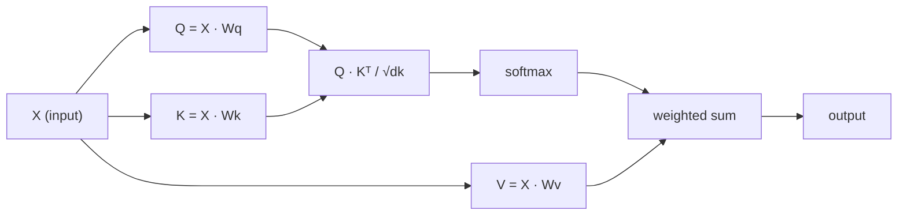

# Self-Attention from Scratch

> Attention is a lookup table where every word asks "who matters to me?" — and learns the answer.

**Type:** Build
**Languages:** Python
**Prerequisites:** Phase 3 (Deep Learning Core), Phase 5 Lesson 10 (Sequence-to-Sequence)
**Time:** ~90 minutes

## Learning Objectives

- Implement scaled dot-product self-attention from scratch using only NumPy, including query/key/value projections and the softmax-weighted sum
- Build a multi-head attention layer that splits heads, computes parallel attention, and concatenates results
- Trace how the attention matrix captures token relationships and explain why scaling by sqrt(d_k) prevents softmax saturation
- Apply causal masking to convert bidirectional attention into autoregressive (decoder-style) attention

## The Problem

RNNs process sequences one token at a time. By the time you reach token 50, the information from token 1 has been squeezed through 50 compression steps. Long-range dependencies get crushed into a fixed-size hidden state — a bottleneck that no amount of LSTM gating fully solves.

The 2014 Bahdanau attention paper showed the fix: let the decoder look back at every encoder position and decide which ones matter for the current step. But it was still bolted onto an RNN. The 2017 "Attention Is All You Need" paper asked a sharper question: what if attention is the *only* mechanism? No recurrence. No convolution. Just attention.

Self-attention lets every position in a sequence attend to every other position in a single parallel step. That is what makes transformers fast, scalable, and dominant.

## The Concept

### The Database Lookup Analogy

Think of attention as a soft database lookup:

```
Traditional database:
  Query: "capital of France"  -->  exact match  -->  "Paris"

Attention:
  Query: "capital of France"  -->  similarity to ALL keys  -->  weighted blend of ALL values
```

Every token generates three vectors:
- **Query (Q)**: "What am I looking for?"
- **Key (K)**: "What do I contain?"
- **Value (V)**: "What information do I provide if selected?"

The dot product between a query and all keys produces attention scores. High score means "this key matches my query." Those scores weight the values. The output is a weighted sum of values.

### Q, K, V Computation

Each token embedding gets projected through three learned weight matrices:

```
Input embeddings (sequence of n tokens, each d-dimensional):
  X = [x1, x2, x3, ..., xn]       shape: (n, d)

Three weight matrices:
  Wq  shape: (d, dk)
  Wk  shape: (d, dk)
  Wv  shape: (d, dv)

Projections:
  Q = X @ Wq    shape: (n, dk)      each token's query
  K = X @ Wk    shape: (n, dk)      each token's key
  V = X @ Wv    shape: (n, dv)      each token's value
```

### The Attention Matrix

Once you have Q, K, V for all tokens, attention scores form a matrix:

```
Scores = Q @ K^T    shape: (n, n)

              k1    k2    k3    k4    k5
        +-----+-----+-----+-----+-----+
   q1   | 2.1 | 0.3 | 0.1 | 0.8 | 0.2 |
        +-----+-----+-----+-----+-----+
   q2   | 0.4 | 1.9 | 0.7 | 0.1 | 0.3 |
        +-----+-----+-----+-----+-----+
   q3   | 0.2 | 0.6 | 2.3 | 0.5 | 0.1 |
        +-----+-----+-----+-----+-----+
   q4   | 0.9 | 0.1 | 0.4 | 1.7 | 0.6 |
        +-----+-----+-----+-----+-----+
   q5   | 0.1 | 0.3 | 0.2 | 0.5 | 2.0 |
        +-----+-----+-----+-----+-----+

Each row: one token's attention over the entire sequence
```

### Why Scale?

The dot products grow with dimension dk. If dk = 64, dot products can be in the range of tens, pushing softmax into regions where gradients vanish. The fix: divide by sqrt(dk).

```
Scaled scores = (Q @ K^T) / sqrt(dk)
```

### Softmax Turns Scores into Weights

```
Raw scores for q1:   [2.1, 0.3, 0.1, 0.8, 0.2]
                            |
                         softmax
                            |
Attention weights:   [0.52, 0.09, 0.07, 0.14, 0.08]   (sums to ~1.0)
```

### Weighted Sum of Values

```
output_i = sum( attention_weight[i][j] * v_j  for all j )

For token 1:
  output_1 = 0.52 * v1 + 0.09 * v2 + 0.07 * v3 + 0.14 * v4 + 0.08 * v5
```

### Full Pipeline



Formula in one line:

```
Attention(Q, K, V) = softmax( Q @ K^T / sqrt(dk) ) @ V
```

## Build It

### Step 1: Softmax from scratch

```python
import numpy as np

def softmax(x):
    shifted = x - np.max(x, axis=-1, keepdims=True)
    exp_x = np.exp(shifted)
    return exp_x / np.sum(exp_x, axis=-1, keepdims=True)
```

### Step 2: Scaled dot-product attention

```python
def scaled_dot_product_attention(Q, K, V):
    dk = Q.shape[-1]
    scores = Q @ K.T / np.sqrt(dk)
    weights = softmax(scores)
    output = weights @ V
    return output, weights
```

### Step 3: Self-attention class with learned projections

```python
class SelfAttention:
    def __init__(self, d_model, dk, dv, seed=42):
        rng = np.random.default_rng(seed)
        scale = np.sqrt(2.0 / (d_model + dk))
        self.Wq = rng.normal(0, scale, (d_model, dk))
        self.Wk = rng.normal(0, scale, (d_model, dk))
        scale_v = np.sqrt(2.0 / (d_model + dv))
        self.Wv = rng.normal(0, scale_v, (d_model, dv))
        self.dk = dk

    def forward(self, X):
        Q = X @ self.Wq
        K = X @ self.Wk
        V = X @ self.Wv
        output, weights = scaled_dot_product_attention(Q, K, V)
        return output, weights
```

### Step 4: Run it on a sentence

```python
sentence = ["The", "cat", "sat", "on", "the", "mat"]
n_tokens = len(sentence)
d_model = 8
dk = 4
dv = 4

rng = np.random.default_rng(42)
X = rng.normal(0, 1, (n_tokens, d_model))

attn = SelfAttention(d_model, dk, dv, seed=42)
output, weights = attn.forward(X)

print("Attention weights (each row: where that token looks):")
for i, token in enumerate(sentence):
    print(f"{token:>6}", end="")
    for j in range(n_tokens):
        print(f"{weights[i][j]:6.3f}", end="")
    print()
```

### Step 5: Visualize attention with ASCII heatmap

```python
def ascii_heatmap(weights, tokens, chars=" ░▒▓█"):
    n = len(tokens)
    print(f"\n{'':>6}", end="")
    for t in tokens:
        print(f"{t:>6}", end="")
    print()
    for i in range(n):
        print(f"{tokens[i]:>6}", end="")
        for j in range(n):
            level = int(weights[i][j] * (len(chars) - 1) / weights.max())
            level = min(level, len(chars) - 1)
            print(f"{'  ' + chars[level] + '   '}", end="")
        print()
```

## Use It

PyTorch's `nn.MultiheadAttention` does exactly what we built:

```python
import torch
import torch.nn as nn

d_model = 8
n_heads = 2
mha = nn.MultiheadAttention(embed_dim=d_model, num_heads=n_heads, batch_first=True)
X_torch = torch.randn(1, 6, d_model)
output, attn_weights = mha(X_torch, X_torch, X_torch)
```

The key difference: multi-head attention runs multiple attention functions in parallel, each with its own Q, K, V projections of size dk = d_model / n_heads.

## Ship It

This lesson produces `outputs/prompt-attention-explainer.md` — a prompt for explaining attention through the database lookup analogy.

## Exercises

1. Modify `scaled_dot_product_attention` to accept an optional mask matrix that sets certain positions to negative infinity before softmax (this is how causal/decoder masking works)
2. Implement multi-head attention from scratch: split Q, K, V into `n_heads` chunks, run attention on each, concatenate, and project through a final weight matrix Wo
3. Take two different sentences of the same length, feed them through the same SelfAttention instance, and compare their attention patterns

## Key Terms

| Term | What people say | What it actually means |
|------|----------------|----------------------|
| Query (Q) | "The question vector" | A learned projection representing what information this token is looking for |
| Key (K) | "The label vector" | A learned projection representing what information this token contains |
| Value (V) | "The content vector" | A learned projection carrying the actual information aggregated by attention scores |
| Scaled dot-product attention | "The attention formula" | softmax(QK^T / sqrt(dk)) @ V — scaling prevents softmax saturation |
| Self-attention | "The token looks at itself and others" | Attention where Q, K, V all come from the same sequence |
| Attention weights | "How much focus" | A probability distribution over positions, produced by softmax over scaled dot products |
| Multi-head attention | "Parallel attention" | Running multiple attention functions with different projections, then concatenating results |

## Further Reading

- [Attention Is All You Need (Vaswani et al., 2017)](https://arxiv.org/abs/1706.03762)
- [The Illustrated Transformer (Jay Alammar)](https://jalammar.github.io/illustrated-transformer/)
- [The Annotated Transformer (Harvard NLP)](https://nlp.seas.harvard.edu/annotated-transformer/)

---

[Reference](https://github.com/rohitg00/ai-engineering-from-scratch/tree/main/phases/07-transformers-deep-dive/02-self-attention-from-scratch)
