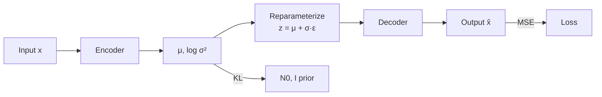

# Autoencoders & Variational Autoencoders (VAE)

> A plain autoencoder compresses then reconstructs. It memorizes. It does not generate. Add one trick — force the code to look Gaussian — and you get a sampler. That single trick, the reparameterization of `z = μ + σ·ε`, is why every latent-diffusion and flow-matching image model you use in 2026 has a VAE at the input.

**Type:** Build
**Languages:** Python
**Prerequisites:** Phase 3 · 02 (Backprop), Phase 3 · 07 (CNNs), Phase 8 · 01 (Taxonomy)
**Time:** ~75 minutes

## The Problem

Compress a 784-pixel MNIST digit to a 16-number code, then reconstruct. A plain autoencoder will ace reconstruction MSE but the code space is a lumpy mess. Pick a random point in the code space, decode it, and you get noise. It has no sampler. It is a compression model dressed up.

What you actually want is: (a) the code space is a clean, smooth distribution you can sample from — say an isotropic Gaussian `N(0, I)`, (b) decoding any sample produces a plausible digit, and (c) the encoder and decoder still compress well.

Kingma's 2013 VAE solves this by training the encoder to output a *distribution* `q(z|x) = N(μ(x), σ(x)²)`, pulling that distribution toward the prior `N(0, I)` via a KL penalty, and then sampling `z` from `q(z|x)` before decoding. At inference time, drop the encoder, sample `z ~ N(0, I)`, decode.

## The Concept



**Autoencoder.** `z = encoder(x)`, `x̂ = decoder(z)`, loss = `||x - x̂||²`. Code space unstructured.

**VAE encoder.** Outputs two vectors: `μ(x)` and `log σ²(x)`. These define `q(z|x) = N(μ, diag(σ²))`.

**Reparameterization trick.** Sampling from `q(z|x)` is not differentiable. Rewrite the sample as `z = μ + σ·ε` where `ε ~ N(0, I)`. Now `z` is a deterministic function of `(μ, σ)` plus a non-parameter noise — gradients flow through `μ` and `σ`.

**Loss.** Evidence Lower BOund (ELBO), two terms:

```
loss = reconstruction + β · KL[q(z|x) || N(0, I)]
     = ||x - x̂||²  + β · Σ_i ( σ_i² + μ_i² - log σ_i² - 1 ) / 2
```

Reconstruction pushes `x̂` toward `x`. KL pushes `q(z|x)` toward the prior. They trade off. Small β (<1) = sharper samples, code space less Gaussian. Large β (>1) = cleaner code space, blurrier samples.

**Sampling.** At inference: draw `z ~ N(0, I)`, forward through decoder. One forward pass — no iterative sampling like diffusion.

## Build It

`code/main.py` implements a tiny VAE without numpy or torch. Input is 8-dimensional synthetic data drawn from a 2-component Gaussian mixture in 8-D. Encoder and decoder are single hidden-layer MLPs.

### Step 1: encoder forward

```python
def encode(x, enc):
    h = tanh(add(matmul(enc["W1"], x), enc["b1"]))
    mu = add(matmul(enc["W_mu"], h), enc["b_mu"])
    log_sigma2 = add(matmul(enc["W_sig"], h), enc["b_sig"])
    return mu, log_sigma2
```

`log σ²` instead of `σ` so the network output is unconstrained.

### Step 2: reparameterize and decode

```python
def reparameterize(mu, log_sigma2, rng):
    eps = [rng.gauss(0, 1) for _ in mu]
    sigma = [math.exp(0.5 * lv) for lv in log_sigma2]
    return [m + s * e for m, s, e in zip(mu, sigma, eps)]

def decode(z, dec):
    h = tanh(add(matmul(dec["W1"], z), dec["b1"]))
    return add(matmul(dec["W_out"], h), dec["b_out"])
```

### Step 3: the ELBO

```python
def elbo(x, x_hat, mu, log_sigma2, beta=1.0):
    recon = sum((a - b) ** 2 for a, b in zip(x, x_hat))
    kl = 0.5 * sum(math.exp(lv) + m * m - lv - 1 for m, lv in zip(mu, log_sigma2))
    return recon + beta * kl, recon, kl
```

Exact closed-form KL because both distributions are Gaussian.

### Step 4: generate

```python
def sample(dec, z_dim, rng):
    z = [rng.gauss(0, 1) for _ in range(z_dim)]
    return decode(z, dec)
```

That is the generative model. Five lines.

## Pitfalls

- **Posterior collapse.** KL term drives `q(z|x) → N(0, I)` so aggressively that `z` carries no info about `x`. Fix: β-annealing (start β=0, ramp to 1), free bits, or skip the KL on inactive dimensions.
- **Blurry samples.** The Gaussian decoder likelihood implies MSE reconstruction, which is Bayes-optimal for L2 (the mean) — the mean of a set of plausible digits is a fuzzy digit. Fix: discrete decoder (VQ-VAE, NVAE), or use the VAE only as an encoder and stack diffusion on the latents.
- **β too large, too early.** See posterior collapse. Start at β≈0.01 and ramp.
- **Latent dim too small.** 16-D works for MNIST, 256-D for ImageNet 256², 2048-D for ImageNet 1024². Stable Diffusion's VAE compresses 512×512×3 → 64×64×4.

## Use It — The 2026 VAE Stack

| Situation | Pick |
|-----------|------|
| Image-latent encoder for diffusion | Stable Diffusion VAE (`sd-vae-ft-ema`) or Flux VAE |
| Audio-latent encoder | Encodec (Meta), SoundStream, or DAC (Descript) |
| Video latents | Sora's spatiotemporal patches, Latte VAE, WAN VAE |
| Disentangled representation learning | β-VAE, FactorVAE, TCVAE |
| Discrete latents (for transformer modelling) | VQ-VAE, RVQ (ResidualVQ) |
| Continuous latents for generation | Plain VAE, then condition a flow/diffusion model in that latent space |

## Production Note

In a Stable Diffusion / Flux / SD3 pipeline the VAE is called twice per request — once to encode (if doing img2img / inpainting) and once to decode. At 1024² the decoder pass is often the single largest activation-memory peak in the whole pipeline because it upsamples `128×128×16` latents back to `1024×1024×3`.

- **Slice or tile the decode.** `diffusers` exposes `pipe.vae.enable_slicing()` and `pipe.vae.enable_tiling()`. Essential for 1024²+ on consumer GPUs.
- **bf16 decoder, fp32 numerics for the final resize.** Always prefer the fp16-fix variant or use bf16.

## Key Terms

| Term | What people say | What it actually means |
|------|-----------------|-----------------------|
| Autoencoder | Encode-decode network | `x → z → x̂`, learn MSE. Not generative. |
| VAE | AE with a sampler | Encoder outputs a distribution, KL penalty shapes code space. |
| ELBO | Evidence lower bound | `log p(x) ≥ recon - KL[q(z\|x) || p(z)]`; tight when `q = p(z\|x)`. |
| Reparameterization | `z = μ + σ·ε` | Rewrites stochastic node as deterministic + pure noise. Enables backprop through sampling. |
| Prior | `p(z)` | Target distribution for the latent, typically `N(0, I)`. |
| Posterior collapse | "KL term wins" | Encoder ignores `x`, outputs the prior; decoder must hallucinate. |
| β-VAE | Tunable KL weight | `loss = recon + β·KL`. Higher β = more disentangled but blurrier. |
| VQ-VAE | Discrete latent | Replace continuous `z` with nearest codebook vector; enables transformer modelling. |

## Exercises

1. **Easy.** Change `β` in `code/main.py` to `0.01`, `0.1`, `1.0`, `5.0`. Record the final reconstruction MSE and KL.
2. **Medium.** Replace the Gaussian decoder likelihood with a Bernoulli likelihood (cross-entropy loss). Compare sample quality.
3. **Hard.** Extend `code/main.py` into a mini VQ-VAE: replace the continuous `z` with a nearest-neighbour lookup in a codebook of K=32 entries. Compare reconstruction MSE.

## Further Reading

- [Kingma & Welling (2013). Auto-Encoding Variational Bayes](https://arxiv.org/abs/1312.6114)
- [Higgins et al. (2017). β-VAE: Learning Basic Visual Concepts with a Constrained Variational Framework](https://openreview.net/forum?id=Sy2fzU9gl)
- [van den Oord et al. (2017). Neural Discrete Representation Learning](https://arxiv.org/abs/1711.00937)
- [Vahdat & Kautz (2021). NVAE: A Deep Hierarchical Variational Autoencoder](https://arxiv.org/abs/2007.03898)
- [Rombach et al. (2022). High-Resolution Image Synthesis with Latent Diffusion Models](https://arxiv.org/abs/2112.10752)
- [Défossez et al. (2022). High Fidelity Neural Audio Compression](https://arxiv.org/abs/2210.13438)

[Reference](https://github.com/rohitg00/ai-engineering-from-scratch/tree/main/phases/08-generative-ai/02-autoencoders-vae)
