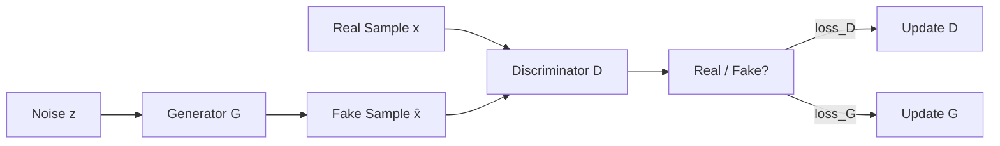

# GANs — Generator vs Discriminator

> Goodfellow's trick in 2014 was to skip density entirely. Two networks. One makes fakes. One catches them. They fight until the fakes are indistinguishable from real. It shouldn't work. It often doesn't. When it does, the samples are still the sharpest in the literature for narrow domains.

**Type:** Build
**Languages:** Python
**Prerequisites:** Phase 3 · 02 (Backprop), Phase 3 · 08 (Optimizers), Phase 8 · 02 (VAE)
**Time:** ~75 minutes

## The Problem

VAEs produce blurry samples because their MSE decoder loss is Bayes-optimal for the *mean* image — and the mean of many plausible digits is a fuzzy digit. You want a loss that rewards *plausibility*, not pixel-wise proximity to any one target. There is no closed-form for plausibility. You have to learn it.

Goodfellow's idea: train a classifier `D(x)` to distinguish real images from fakes. Train a generator `G(z)` to fool `D`. The loss signal for `G` is whatever `D` currently thinks makes something look real. This signal updates as `G` improves, chasing a moving target. If both networks converge, `G` has learned the data distribution without ever writing down `log p(x)`.

This is adversarial training. The math is a minimax game:

```
min_G max_D  E_real[log D(x)] + E_fake[log(1 - D(G(z)))]
```

## The Concept



**Generator `G(z)`.** Maps a noise vector `z ~ N(0, I)` to a sample `x̂`. A decoder-shaped network (dense or transposed conv).

**Discriminator `D(x)`.** Maps a sample to a scalar probability (or score). Real → 1, fake → 0.

**Loss.** Two alternating updates:

- **Train `D`:** `loss_D = -[ log D(x) + log(1 - D(G(z))) ]`. Binary cross-entropy on real=1, fake=0.
- **Train `G`:** `loss_G = -log D(G(z))`. This is the *non-saturating* form.

**Training loop.** One step of `D`, one step of `G`. Repeat.

## Variants That Made GANs Work

| Year | Innovation | Fix |
|------|------------|-----|
| 2015 | DCGAN | Conv/deconv, batch norm, LeakyReLU — the first stable architecture. |
| 2017 | WGAN, WGAN-GP | Replace BCE with Wasserstein distance + gradient penalty. Fixes vanishing gradient. |
| 2017 | Spectral normalization | Lipschitz-bound the discriminator. Still used in 2026 discriminators. |
| 2018 | Progressive GAN | Train low-res first, add layers. First megapixel results. |
| 2019 | StyleGAN / StyleGAN2 | Mapping network + adaptive instance norm. State of the art for fixed-domain photorealism. |
| 2024 | R3GAN | Rebrands with stronger regularization; works on 1024² without tricks. |

## Build It

`code/main.py` trains a tiny GAN on 1-D data: a mixture of two Gaussians. Generator and discriminator are single-hidden-layer MLPs.

### Step 1: non-saturating loss

```python
def g_loss(d_fake):
    # maximize log D(G(z))  <=>  minimize -log D(G(z))
    return -sum(math.log(max(p, 1e-8)) for p in d_fake) / len(d_fake)
```

### Step 2: one discriminator step per generator step

```python
for step in range(steps):
    # train D
    real_batch = sample_real(batch_size)
    fake_batch = [G(z) for z in sample_noise(batch_size)]
    update_D(real_batch, fake_batch)

    # train G
    fake_batch = [G(z) for z in sample_noise(batch_size)]  # fresh fakes
    update_G(fake_batch)
```

### Step 3: watch for mode collapse

```python
if step % 200 == 0:
    samples = [G(z) for z in sample_noise(500)]
    mode_a = sum(1 for s in samples if s < 0)
    mode_b = 500 - mode_a
    if min(mode_a, mode_b) < 50:
        print("  [!] mode collapse: one mode is starved")
```

## Pitfalls

- **Discriminator too strong.** Cut D's learning rate by 2-5x, or add instance/layer noise. If D reaches >95% accuracy, G is dead.
- **Generator memorizes a mode.** Add noise to D inputs, use a minibatch-discriminator layer, or switch to WGAN-GP.
- **Batch norm leaking statistics.** Use instance norm or spectral norm instead.
- **One-shot sampling is a lie for conditional tasks.** You still need CFG scales, truncation tricks, and re-sampling.

## Use It — The 2026 GAN Stack

| Situation | Pick |
|-----------|------|
| Photoreal human faces, fixed pose | StyleGAN3 (sharpest, smallest) |
| Anime / stylized faces | StyleGAN-XL or Stable Diffusion LoRA |
| Image-to-image translation | Pix2Pix / CycleGAN or ControlNet |
| Fast 1-step text-to-image | Adversarial distillation of diffusion (SDXL-Turbo, SD3-Turbo) |
| Perceptual loss inside a diffusion trainer | Small GAN discriminator on image crops |
| Anything multi-modal, open-ended | Don't — use diffusion or flow matching |

## Production Note

GANs no longer win on sample quality for open-domain generation, but they still win on inference cost.

- **No prefill, no decode stages.** A single `G(z)` forward pass. TTFT ≈ total latency.
- **No KV-cache pressure.** The only state is the weights.
- **Trivial continuous batching.** Since every request takes the same fixed FLOPs, a static batch is usually optimal.

This is why GAN distillation (SDXL-Turbo, SD3-Turbo, ADD, LCM) is the dominant technique for fast text-to-image.

## Key Terms

| Term | What people say | What it actually means |
|------|-----------------|-----------------------|
| Generator | "G" | Noise-to-sample network, `G: z → x̂`. |
| Discriminator | "D" | Classifier `D: x → [0, 1]`, real vs fake. |
| Minimax | "The game" | `min_G max_D` of a joint objective. |
| Non-saturating loss | "The fix" | Use `-log D(G(z))` for G instead of `log(1 - D(G(z)))`. |
| Mode collapse | "G memorized one thing" | Generator produces few distinct outputs despite diverse data. |
| WGAN | "Wasserstein" | Replace BCE with Earth-Mover distance + gradient penalty. |
| Spectral norm | "Lipschitz trick" | Constrain D's weight norms to bound its slope. |
| StyleGAN | "The one that works" | Mapping network + AdaIN; best-in-class for faces. |

## Exercises

1. **Easy.** Run `code/main.py` with the stock settings. Then set `D_LR = 5 * G_LR` and rerun. How fast does G's loss collapse to a constant?
2. **Medium.** Replace the Goodfellow BCE loss with the WGAN loss and clip D's weights to `[-0.01, 0.01]`. Is training more stable?
3. **Hard.** Extend the 1-D example to 2-D data (mixture of 8 Gaussians on a ring). Track how many of the 8 modes the generator captures.

## Further Reading

- [Goodfellow et al. (2014). Generative Adversarial Nets](https://arxiv.org/abs/1406.2661)
- [Radford et al. (2015). Unsupervised Representation Learning with DCGAN](https://arxiv.org/abs/1511.06434)
- [Arjovsky, Chintala, Bottou (2017). Wasserstein GAN](https://arxiv.org/abs/1701.07875)
- [Miyato et al. (2018). Spectral Normalization for GANs](https://arxiv.org/abs/1802.05957)
- [Karras et al. (2020). Analyzing and Improving the Image Quality of StyleGAN](https://arxiv.org/abs/1912.04958)
- [Karras et al. (2021). Alias-Free Generative Adversarial Networks](https://arxiv.org/abs/2106.12423)
- [Sauer et al. (2023). Adversarial Diffusion Distillation](https://arxiv.org/abs/2311.17042)

[Reference](https://github.com/rohitg00/ai-engineering-from-scratch/tree/main/phases/08-generative-ai/03-gans-generator-discriminator)
