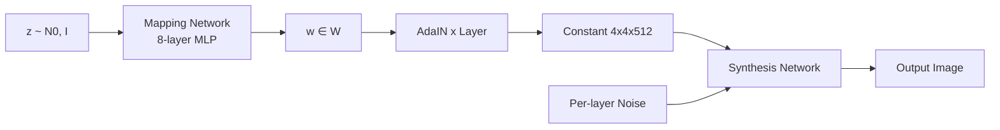

# StyleGAN

> Most generators stir `z` into every layer at the same time. StyleGAN split it apart: first map `z` to an intermediate `w`, then *inject* `w` at every resolution level through AdaIN. That single change untangled the latent space and made photorealistic faces a solved problem for seven years running.

**Type:** Build
**Languages:** Python
**Prerequisites:** Phase 8 · 03 (GANs), Phase 4 · 08 (Normalization), Phase 3 · 07 (CNNs)
**Time:** ~45 minutes

## The Problem

A DCGAN maps `z` to an image through a stack of transposed convolutions. The problem: `z` controls everything — pose, lighting, identity, background — entangled together. Move along one axis of `z`, all four change. You cannot ask the model "same person, different pose" because the representation does not factor that way.

Karras et al. (2019, NVIDIA) proposed: stop feeding `z` directly into conv layers. Feed a constant `4×4×512` tensor as the network input. Learn an 8-layer MLP that maps `z ∈ Z → w ∈ W`. Inject `w` at every resolution via *adaptive instance normalization* (AdaIN): normalize each conv feature map, then scale and shift by affine projections of `w`. Add per-layer noise for stochastic detail (skin pores, hair strands).

The result: `W` has roughly orthogonal axes for "high-level style" (pose, identity) vs "fine style" (lighting, color).

## The Concept



**Mapping network.** `f: Z → W`, an 8-layer MLP. `Z = N(0, I)^512`. `W` is not forced to be Gaussian — it learns a data-adapted shape.

**Synthesis network.** Starts from a learned constant `4×4×512`. Each resolution block: `upsample → conv → AdaIN(w_i) → noise → conv → AdaIN(w_i) → noise`.

**AdaIN.**

```
AdaIN(x, y) = y_scale · (x - mean(x)) / std(x) + y_bias
```

where `y_scale` and `y_bias` come from affine projections of `w`.

**Per-layer noise.** Single-channel Gaussian noise added to each feature map, scaled by a learned per-channel factor. Controls stochastic detail without affecting global structure.

**Truncation trick.** At inference, sample `z`, compute `w = mapping(z)`, then `w' = ŵ + ψ·(w - ŵ)` where `ŵ` is the mean `w` over many samples. `ψ < 1` trades diversity for quality.

## StyleGAN 1 → 2 → 3

| Version | Year | Innovation |
|---------|------|------------|
| StyleGAN | 2019 | Mapping network + AdaIN + noise + progressive growing. |
| StyleGAN2 | 2020 | Weight demodulation replaces AdaIN (fixes droplet artifacts); skip/residual architecture; path-length regularization. |
| StyleGAN3 | 2021 | Alias-free convolution + equivariant kernels; eliminates texture sticking to pixel grid. |
| StyleGAN-XL | 2022 | Class-conditional, 1024², ImageNet. |

## Build It

`code/main.py` implements a toy "style-GAN lite" in 1-D: a mapping MLP, a synthesis function that takes a learned constant vector and modulates it with `w`-derived scale/bias, and per-layer noise.

### Step 1: mapping network

```python
def mapping(z, M):
    h = z
    for i in range(num_layers):
        h = leaky_relu(add(matmul(M[f"W{i}"], h), M[f"b{i}"]))
    return h
```

### Step 2: adaptive instance normalization

```python
def adain(x, w_scale, w_bias):
    mu = mean(x)
    sd = std(x)
    x_norm = [(xi - mu) / (sd + 1e-8) for xi in x]
    return [w_scale * xi + w_bias for xi in x_norm]
```

### Step 3: per-layer noise

```python
def add_noise(x, sigma, rng):
    return [xi + sigma * rng.gauss(0, 1) for xi in x]
```

## Pitfalls

- **Droplet artifacts.** StyleGAN 1 produced a blobby droplet in the feature maps because AdaIN zeroed out mean. StyleGAN 2's weight demodulation fixes it.
- **Texture sticking.** StyleGAN 3's alias-free convolutions fix this with windowed sinc filters.
- **Mode coverage.** Truncation `ψ < 0.7` looks clean but samples from a narrow cone.
- **Inversion is lossy.** Inverting a real photo into `W` is usually done through optimization or an encoder.

## Use It

| Use case | Approach |
|----------|----------|
| Photoreal human faces (anime, product, narrow) | StyleGAN3 FFHQ / custom fine-tune |
| Face editing from a photo | e4e inversion + StyleSpace / InterFaceGAN directions |
| Face swap / reenactment | StyleGAN + encoder + blending |
| Avatar pipelines | StyleGAN3 w/ ADA for low-data fine-tune |
| Domain adaptation from a few images | Freeze mapping network, fine-tune synthesis |

## Production Note

StyleGAN3 on a 4090 generates a 1024² FFHQ face in under 10 ms — `num_steps = 1`, no VAE decode, no cross-attention pass. A 50-step SDXL + VAE-decode pipeline at the same resolution is ~3 seconds. That is a **300× gap**.

- **No scheduler, no batcher.** Static batch at the target occupancy is optimal.
- **Truncation `ψ` is the safety knob.** Lower `ψ` at peak load, raise it for premium users.

## Key Terms

| Term | What people say | What it actually means |
|------|-----------------|-----------------------|
| Mapping network | "The MLP" | `f: Z → W`, 8 layers, decouples latent geometry from data statistics. |
| W space | "The style space" | Output of the mapping network; roughly disentangled. |
| AdaIN | "Adaptive instance norm" | Normalize feature map, then scale + shift by `w`-projection. |
| Truncation trick | "Psi" | `w = mean + ψ·(w - mean)`, ψ<1 trades diversity for quality. |
| Path-length regularization | "PL reg" | Penalizes large changes in image per unit change in `w`; makes `W` smoother. |
| Weight demodulation | "The StyleGAN2 fix" | Normalize conv weights instead of activations; kills droplet artifacts. |
| Alias-free | "StyleGAN3's trick" | Windowed sinc filters; eliminates texture sticking to the pixel grid. |
| Inversion | "Find w for a real image" | Optimize or encode `x → w` so `G(w) ≈ x`. |

## Exercises

1. **Easy.** Run `code/main.py` with `adain_on=True` and `adain_on=False`. Compare the spread of outputs for a fixed latent vs perturbed latent.
2. **Medium.** Implement mixing regularization: for a training batch, compute `w_a`, `w_b`, and apply `w_a` for the first half of synthesis and `w_b` for the second half.
3. **Hard.** Take a pretrained StyleGAN3 FFHQ model. Find the `w` direction that controls "smile" by training an SVM on labelled samples.

## Further Reading

- [Karras et al. (2019). A Style-Based Generator Architecture for GANs](https://arxiv.org/abs/1812.04948)
- [Karras et al. (2020). Analyzing and Improving the Image Quality of StyleGAN](https://arxiv.org/abs/1912.04958)
- [Karras et al. (2021). Alias-Free Generative Adversarial Networks](https://arxiv.org/abs/2106.12423)
- [Tov et al. (2021). Designing an Encoder for StyleGAN Image Manipulation](https://arxiv.org/abs/2102.02766)
- [Sauer et al. (2022). StyleGAN-XL: Scaling StyleGAN to Large Diverse Datasets](https://arxiv.org/abs/2202.00273)

[Reference](https://github.com/rohitg00/ai-engineering-from-scratch/tree/main/phases/08-generative-ai/05-stylegan)
