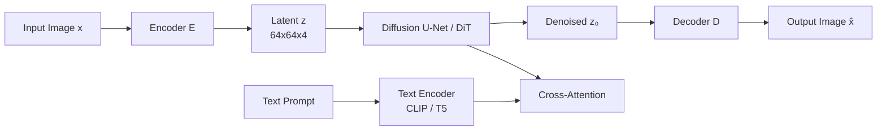

# Latent Diffusion & Stable Diffusion

> Pixel-space diffusion on 512×512 images is a computational war crime. Rombach et al. (2022) noticed that you do not need all 786k dimensions to generate an image — you need enough to capture semantic structure, and a separate decoder for the rest. Run diffusion inside a VAE's latent space. That one idea is Stable Diffusion.

**Type:** Build
**Languages:** Python
**Prerequisites:** Phase 8 · 02 (VAE), Phase 8 · 06 (DDPM), Phase 7 · 09 (ViT)
**Time:** ~75 minutes

## The Problem

Pixel-space diffusion at 512² means the U-Net runs on tensors of shape `[B, 3, 512, 512]`. Each sampling step is ~100 GFLOPS for a 500M-param U-Net. Fifty steps is 5 TFLOPS per image.

Most of those FLOPs go to pushing perceptually unimportant details through the net — the high-frequency texture that a lossy VAE could compress away. Rombach's idea: train a VAE once (the *first stage*), freeze it, and run diffusion entirely in the 4-channel 64×64 latent space (the *second stage*). Same U-Net. 1/16th the pixels. ~64x fewer FLOPs for comparable quality.

## The Concept



**Two stages, separately trained.**

1. **Stage 1 — VAE.** Encoder `E(x) → z`, decoder `D(z) → x`. Target compression: 8× downsample in each spatial axis. Loss = reconstruction (L1 + LPIPS perceptual) + KL (small weight). Often trained with an adversarial loss so decoded images are sharp.

2. **Stage 2 — diffusion on `z`.** Treat `z = E(x_real)` as the data. Train a U-Net (or DiT) to denoise `z_t`. At inference: sample `z_0` via diffusion, then `x = D(z_0)`.

**Text conditioning.** Two additional components. A frozen text encoder (CLIP-L for SD 1.x, CLIP-L+OpenCLIP-G for SD 2/XL, T5-XXL for SD3 and Flux). A cross-attention injection: every U-Net block takes `[Q = image features, K = V = text tokens]` and mixes them in.

## Architecture Variants

| Model | Year | Backbone | Latent shape | Text encoder | Params |
|-------|------|----------|--------------|--------------|--------|
| SD 1.5 | 2022 | U-Net | 64×64×4 | CLIP-L (77 tokens) | 860M |
| SD 2.1 | 2022 | U-Net | 64×64×4 | OpenCLIP-H | 865M |
| SDXL | 2023 | U-Net + refiner | 128×128×4 | CLIP-L + OpenCLIP-G | 2.6B + 6.6B |
| SDXL-Turbo | 2023 | Distilled | 128×128×4 | same | 1-4 step |
| SD3 | 2024 | MMDiT | 128×128×16 | T5-XXL + CLIP-L + CLIP-G | 2B / 8B |
| Flux.1-dev | 2024 | MMDiT | 128×128×16 | T5-XXL + CLIP-L | 12B |

## Build It

`code/main.py` stacks a toy 1-D "VAE" on top of the DDPM from Lesson 06 and adds class conditioning with classifier-free guidance.

### Step 1: encoder/decoder

```python
def encode(x):    return x * 0.5
def decode(z):    return z * 2.0
```

A real VAE has trained weights. For pedagogy, this linear map is enough to show that diffusion operates on `z` without caring about the original data space.

### Step 2: classifier-free guidance

During training, drop the class label 10% of the time (replace with a null token). At inference, compute both `ε_cond` and `ε_uncond`, then:

```python
eps_cfg = (1 + w) * eps_cond - w * eps_uncond
```

`w = 0` = no guidance (full diversity), `w = 3` = default, `w = 7+` = saturated.

### Step 3: text conditioning (concept)

Replace the class label with a frozen text encoder output. Feed the text embedding to the U-Net via cross-attention:

```python
h = h + CrossAttention(Q=h, K=text_embed, V=text_embed)
```

This is the only substantive difference between a class-conditional diffusion model and Stable Diffusion.

## Pitfalls

- **VAE-scale mismatch.** SD 1.x VAEs have a scaling constant (`scaling_factor ≈ 0.18215`) applied after encoding. Forgetting this makes the U-Net train on latents with wildly wrong variance.
- **Text encoder silently wrong.** SD3 needs T5-XXL with >=128 tokens.
- **Mixing latent spaces.** SDXL, SD3, Flux all use different VAEs. A LoRA trained on SDXL latents will not work on SD3.
- **CFG too high.** `w > 10` produces saturated, oily images. The sweet spot is `w = 3-7`.

## Use It — Production Stacks in 2026

| Target | Recommended backbone |
|--------|----------------------|
| Narrow domain, paired data | SDXL fine-tune (LoRA / full) |
| Open-domain text-to-image, open weights | Flux.1-dev (12B) or SD3.5-Large |
| Fastest inference, open weights | Flux.1-schnell (1-4 step) or SDXL-Lightning |
| Best prompt adherence, hosted | GPT-Image / DALL-E 3, Midjourney v7, Imagen 4 |
| Edit workflows | Flux.1-Kontext |
| Research, baseline | SD 1.5 |

## Production Note — Running Flux-12B on an 8GB Consumer GPU

1. **Staggered loading.** Encode the prompt first, *delete* the encoders, load the DiT, denoise, *delete* the DiT, load the VAE, decode.
2. **4-bit quantization via bitsandbytes.** `BitsAndBytesConfig(load_in_4bit=True, bnb_4bit_compute_dtype=torch.bfloat16)` on both the T5 encoder and the DiT. Cuts memory 8×.
3. **CPU offload.** `pipe.enable_model_cpu_offload()` auto-swaps modules between CPU and GPU as each forward pass advances. Adds 10-20% latency but makes the pipeline run at all.

## Key Terms

| Term | What people say | What it actually means |
|------|-----------------|-----------------------|
| First stage | "The VAE" | Trained encoder/decoder pair; compresses 512² to 64². |
| Second stage | "The U-Net" | Diffusion model over the latent space. |
| CFG | "Guidance scale" | `(1+w)·ε_cond - w·ε_uncond`; tunes conditioning strength. |
| Null token | "Empty prompt embed" | Unconditional embed used for `ε_uncond`. |
| Cross-attention | "How text gets in" | Each U-Net block attends to text tokens as K and V. |
| DiT | "Diffusion Transformer" | Replace U-Net with a transformer over latent patches; scales better. |
| MMDiT | "Multi-modal DiT" | SD3's architecture: text and image streams with joint attention. |
| VAE scaling factor | "Magic number" | Divides latents by ~5.4 so diffusion operates in unit-variance space. |

## Exercises

1. **Easy.** Run `code/main.py` with guidance `w ∈ {0, 1, 3, 7, 15}`. Record mean sample by class. At what `w` do the class means diverge past the real data means?
2. **Medium.** Swap the toy linear encoder for a tanh-MLP encoder/decoder pair with a reconstruction loss. Retrain diffusion on the new latents.
3. **Hard.** Set up a real Stable Diffusion inference with diffusers: load `sdxl-base`, run 30 Euler steps with CFG=7, time it. Now switch to `sdxl-turbo` with 4 steps and CFG=0. Describe what changed and why.

## Further Reading

- [Rombach et al. (2022). High-Resolution Image Synthesis with Latent Diffusion Models](https://arxiv.org/abs/2112.10752)
- [Podell et al. (2023). SDXL: Improving Latent Diffusion Models for High-Resolution Image Synthesis](https://arxiv.org/abs/2307.01952)
- [Peebles & Xie (2023). Scalable Diffusion Models with Transformers (DiT)](https://arxiv.org/abs/2212.09748)
- [Esser et al. (2024). Scaling Rectified Flow Transformers for High-Resolution Image Synthesis](https://arxiv.org/abs/2403.03206)
- [Ho & Salimans (2022). Classifier-Free Diffusion Guidance](https://arxiv.org/abs/2207.12598)

[Reference](https://github.com/rohitg00/ai-engineering-from-scratch/tree/main/phases/08-generative-ai/07-latent-diffusion-stable-diffusion)
