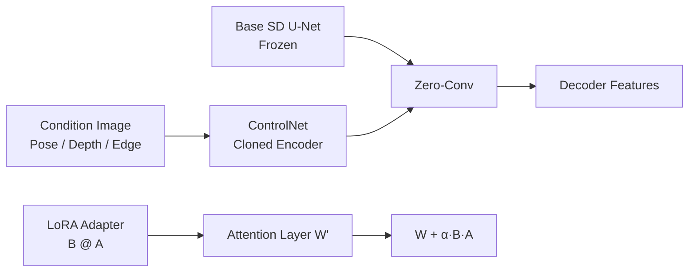

# ControlNet, LoRA & Conditioning

> Text alone is a clumsy control signal. ControlNet lets you clone a pretrained diffusion model and steer it with a depth map, pose skeleton, scribble, or edge image. LoRA lets you fine-tune a 2B-parameter model by training 10 million parameters. Together they turned Stable Diffusion from a toy into the 2026 image pipeline that ships at every agency.

**Type:** Build
**Languages:** Python
**Prerequisites:** Phase 8 · 07 (Latent Diffusion), Phase 10 (LLMs from Scratch — for LoRA foundation)
**Time:** ~75 minutes

## The Problem

A prompt like "a woman in a red dress walking a dog on a busy street" gives the model no information about *where* the dog is, *what pose* the woman is in, or *the perspective* of the street. Text pins down about 10% of what you need to specify an image. The rest is visual and cannot be described efficiently in words.

Training a new conditional model from scratch for every signal (pose, depth, canny, segmentation) is prohibitive. You want to keep the 2.6B-param SDXL backbone frozen, attach a small side-network that reads the conditioning, and have it nudge the backbone's intermediate features. That is ControlNet.

You also want to teach the model new concepts (your face, your product, your style) without retraining the full model. You want a 100x smaller delta. That is LoRA — low-rank adapters that plug into existing attention weights.

## The Concept



### ControlNet (Zhang et al., 2023)

Take a pretrained SD. *Clone* the encoder half of the U-Net. Freeze the original. Train the clone to accept an extra conditioning input (edges, depth, pose). Connect the clone back to the decoder half of the original with *zero-convolution* skip connections (1×1 convs initialized to zero — start as a no-op, learn a delta).

```
SD U-Net decoder:   ... ← orig_enc_features + zero_conv(controlnet_enc(condition))
```

Zero-conv init means ControlNet starts as identity — no harm even before training. Train on 1M (prompt, condition, image) triples with the standard diffusion loss.

Per-modality ControlNets ship as small side models (~360M for SDXL, ~70M for SD 1.5). You can compose them at inference:

```
features += weight_a * control_a(depth) + weight_b * control_b(pose)
```

### LoRA (Hu et al., 2021)

For any linear layer `W ∈ R^{d×d}` in the model, freeze `W` and add a low-rank delta:

```
W' = W + ΔW,  ΔW = B @ A,  A ∈ R^{r×d},  B ∈ R^{d×r}
```

with `r << d`. Rank 4-16 is standard for attention, rank 64-128 for heavy fine-tunes. Number of new parameters: `2 · d · r` instead of `d²`. For SDXL attention with `d=640`, `r=16`: 20k params per adapter instead of 410k — a 20x reduction.

At inference you can scale the LoRA: `W' = W + α · B @ A`. `α = 0.5-1.5` is normal. Multiple LoRAs stack additively.

### IP-Adapter (Ye et al., 2023)

A tiny adapter that accepts an *image* as conditioning (alongside text). Uses the CLIP image encoder to produce image tokens, injects them into cross-attention alongside text tokens. ~20MB per base model.

## Composability Matrix

| Tool | What it controls | Size | When to use |
|------|------------------|------|-------------|
| ControlNet | Spatial structure (pose, depth, edges) | 70-360MB | Exact layout, composition |
| LoRA | Style, subject, concept | 20-200MB | Personalization, style |
| IP-Adapter | Style or subject from reference image | 20MB | No text can describe the look |
| Textual Inversion | Single concept as a new token | 10KB | Legacy, mostly replaced by LoRA |
| DreamBooth | Full fine-tune on a subject | 2-5GB | Strong identity, high compute |

## Build It

`code/main.py` simulates the two mechanisms on 1-D.

### Step 1: LoRA math

```python
def lora(W, A, B, x, alpha=1.0):
    # W is frozen; A, B are the trainable low-rank factors.
    return [W[i][j] * x[j] for i, j in ...] + alpha * (B @ (A @ x))
```

### Step 2: zero-init side network

```python
side_out = control_net(x, condition)
gated = gate * side_out  # gate initialized to 0
h = base(x) + gated
```

At step 0 the output is identical to base. Early training updates `gate` slowly — no catastrophic drift.

## Pitfalls

- **Over-scaling LoRAs.** `α = 2` or `α = 3` is a common "make it stronger" hack that produces over-stylized / broken outputs. Keep `α ≤ 1.5`.
- **ControlNet weight conflict.** Using a Pose ControlNet at weight 1.0 and a Depth ControlNet at weight 1.0 usually overshoots. Sum of weights ≈ 1.0 is a safe default.
- **LoRA on the wrong base.** SDXL LoRAs silently no-op on SD 1.5 because the attention dimensions do not match.
- **LoRA weight-merging and storage.** You can bake a LoRA into the base model weights for faster inference, but you lose the ability to scale `α` at runtime.

## Use It — 2026 Pipeline

| Goal | 2026 pipeline |
|------|---------------|
| Reproduce a brand's art style | LoRA trained on ~30 curated images at rank 32 |
| Put my face in a generated image | DreamBooth or LoRA + IP-Adapter-FaceID |
| Specific pose + prompt | ControlNet-Openpose + SDXL + text |
| Depth-aware composition | ControlNet-Depth + SD3 |
| Reference + prompt | IP-Adapter + text |
| Exact layout | ControlNet-Scribble or ControlNet-Canny |
| Background replace | ControlNet-Seg + Inpainting |
| Fast 1-step style | LCM-LoRA on SDXL-Turbo |

## Production Note

A real text-to-image SaaS serves hundreds of LoRAs and a dozen ControlNets over the same base checkpoint.

- **Hot-swap LoRAs, do not merge.** Merging `W' = W + α·B·A` into the base gives ~3-5% faster per-step inference but freezes `α`. Diffusers exposes `pipe.load_lora_weights()` + `pipe.set_adapters([...], adapter_weights=[...])` for per-request activation.
- **ControlNet as a second attention lane.** The cloned encoder runs in parallel with the base. Budget for ~1.5× step cost per active ControlNet.
- **Quantized LoRAs too.** If you quantized the base, the LoRA delta also quantizes cleanly to 8-bit or 4-bit.

## Key Terms

| Term | What people say | What it actually means |
|------|-----------------|-----------------------|
| ControlNet | "Spatial control" | Cloned encoder + zero-conv skips; reads a conditioning image. |
| Zero convolution | "Starts as identity" | 1×1 conv initialized to zero; ControlNet starts as no-op. |
| LoRA | "Low-rank adapter" | `W + B @ A`, `r << d`; 100x fewer params than a full fine-tune. |
| rank r | "The knob" | LoRA compression; 4-16 typical, 64+ for heavy personalization. |
| α | "LoRA strength" | Runtime scaling of the LoRA delta. |
| IP-Adapter | "Reference image" | Small image-conditioning adapter via CLIP-image tokens. |
| DreamBooth | "Full subject fine-tune" | Train the full model on ~30 images of a subject. |

## Exercises

1. **Easy.** In `code/main.py`, vary the LoRA rank `r` from 1 to 4. At what rank does the LoRA exactly match a rank-2 target delta?
2. **Medium.** Train two separate LoRAs on two target transforms. Load them together and show their additive interaction. When does the interaction break linearity?
3. **Hard.** Use diffusers to stack: SDXL-base + Canny-ControlNet (weight 0.8) + a style LoRA (α 0.8) + IP-Adapter (weight 0.6). Measure FID-vs-prompt-adherence trade-off as the stack weights vary.

## Further Reading

- [Zhang, Rao, Agrawala (2023). Adding Conditional Control to Text-to-Image Diffusion Models](https://arxiv.org/abs/2302.05543)
- [Hu et al. (2021). LoRA: Low-Rank Adaptation of Large Language Models](https://arxiv.org/abs/2106.09685)
- [Ye et al. (2023). IP-Adapter: Text Compatible Image Prompt Adapter](https://arxiv.org/abs/2308.06721)
- [Mou et al. (2023). T2I-Adapter: Learning Adapters to Dig Out More Controllable Ability](https://arxiv.org/abs/2302.08453)
- [Ruiz et al. (2023). DreamBooth: Fine Tuning Text-to-Image Diffusion Models for Subject-Driven Generation](https://arxiv.org/abs/2208.12242)

[Reference](https://github.com/rohitg00/ai-engineering-from-scratch/tree/main/phases/08-generative-ai/08-controlnet-lora-conditioning)
