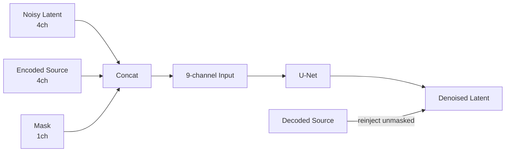

# Inpainting, Outpainting & Image Editing

> Text-to-image makes new things. Inpainting fixes old ones. In production, 70% of billable image work is editing — swap a background, remove a logo, extend the canvas, regenerate a hand. Inpainting is where diffusion earns its keep.

**Type:** Build
**Languages:** Python
**Prerequisites:** Phase 8 · 07 (Latent Diffusion), Phase 8 · 08 (ControlNet & LoRA)
**Time:** ~75 minutes

## The Problem

A client sends a perfect product photo with a distracting sign in the background. You want to erase the sign and leave everything else pixel-identical. You cannot run text-to-image from scratch — the result will have a different color, different lighting, different product angle. You want to regenerate *only* the masked region, and you want the regeneration to respect the surrounding context.

That is inpainting. Variants:

- **Inpainting.** Regenerate inside a mask, keep outside pixels.
- **Outpainting.** Regenerate outside a mask (or beyond the canvas), keep inside.
- **Image editing.** Regenerate the whole image but keep semantic or structural fidelity to the original (SDEdit, InstructPix2Pix).

## The Concept



### The Naive Approach (and Why It's Wrong)

Run standard text-to-image with a mask. At each sampling step, replace the unmasked region of the noisy latent with the forward-diffused clean image. It works... badly. Boundary artifacts bleed through because the model has no information about what is in the masked region.

### The Proper Inpainting Model

Train a modified U-Net that takes 9 input channels instead of 4:

```
input = concat([ noisy_latent (4ch), encoded_image (4ch), mask (1ch) ], dim=channel)
```

The extra channels are a copy of the VAE-encoded source image plus a single-channel mask. SD-Inpaint, SDXL-Inpaint, Flux-Fill all use this 9-channel (or analog) input.

### SDEdit (Meng et al., 2022) — Free Editing

Add noise to the source image up to some intermediate `t`, then run the reverse chain from `t` down to 0 with a new prompt. No retraining. The choice of starting `t` trades fidelity for creative freedom:

- `t/T = 0.3` → nearly identical to source, small stylistic changes
- `t/T = 0.6` → moderate edits, preserves coarse structure
- `t/T = 0.9` → generated from near-noise, minimal source preservation

### InstructPix2Pix (Brooks et al., 2023)

Fine-tune a diffusion model on `(input_image, instruction, output_image)` triples. At inference, condition on both the input image and a text instruction ("make it sunset", "add a dragon"). Two CFG scales: image scale and text scale.

### RePaint (Lugmayr et al., 2022)

Keep a standard unconditional diffusion model. At each reverse step, resample — jump back to a noisier state occasionally and regenerate. Avoids boundary artifacts. Used when you don't have a trained inpainting model.

## Build It

`code/main.py` implements a toy 1-D inpainting scheme on 5-dimensional data.

### Step 1: 5-D DDPM data

```python
def sample_data(rng):
    cluster = rng.choice([0, 1])
    center = [-1.0] * 5 if cluster == 0 else [1.0] * 5
    return [c + rng.gauss(0, 0.2) for c in center], cluster
```

### Step 2: train denoiser over all 5 dims

Standard DDPM. Net outputs 5-D noise prediction for 5-D noisy input.

### Step 3: at inference, mask-aware reverse

```python
def inpaint_step(x_t, mask, clean_image, alpha_bars, t, rng):
    # replace unmasked dims with a freshly noised version of the clean source
    a_bar = alpha_bars[t]
    for i in range(len(x_t)):
        if not mask[i]:
            x_t[i] = math.sqrt(a_bar) * clean_image[i] + math.sqrt(1 - a_bar) * rng.gauss(0, 1)
    # ...then run the normal reverse step on x_t
```

### Step 4: outpainting

Outpainting is inpainting with the mask inverted: mask the new canvas, fill the rest with the original. Identical training objective.

## Pitfalls

- **Seams.** The naive approach leaves visible boundaries. Fix: dilate the mask by 8-16 pixels, or use a proper inpainting model.
- **Mask leakage.** If the conditioning image's unmasked region is low-quality, it pollutes the generation inside the mask.
- **CFG interacts with mask size.** High CFG on a small mask = saturated patch. Reduce CFG for small edits.
- **SDEdit fidelity cliff.** Going from `t/T = 0.5` to `t/T = 0.6` can lose the subject's identity.
- **Prompt mismatch.** The prompt should describe the *whole* image, not just the new content.

## Use It

| Task | Pipeline |
|------|----------|
| Remove object, small mask | SD-Inpaint or Flux-Fill, standard prompt |
| Replace sky | SD-Inpaint + "blue sky at sunset" |
| Extend canvas | SDXL outpaint mode (8px feather) or Flux-Fill with outpaint mask |
| Regenerate hand / face | SD-Inpaint + ControlNet-Openpose |
| Change style of one region | SDEdit at `t/T=0.5` on masked region |
| "Make it sunset" | InstructPix2Pix or Flux-Kontext |
| Background replacement | SAM mask → SD-Inpaint |

SAM (Meta's Segment Anything, 2023) + diffusion inpaint is the 2026 background-removal pipeline.

## Production Note

Users editing an image expect sub-5-second round trips. A 30-step SDXL-Inpaint at 1024² is 3-4 s on an L4, plus SAM mask generation (~200 ms) and VAE encode/decode (~500 ms).

- **SAM-H is the slow one.** SAM-H at 1024² is ~200 ms; SAM-ViT-B is ~40 ms with minor quality loss.
- **Skip the encode when possible.** If you have the latents from the previous generation, pass them directly via `latents=...`.
- **Flux-Kontext is the 2025 answer.** Single forward pass over `(source_image, instruction)` — no separate mask, no SDEdit noise sweep.

## Key Terms

| Term | What people say | What it actually means |
|------|-----------------|-----------------------|
| Inpainting | "Fill the hole" | Regenerate inside a mask; keep outside pixels. |
| Outpainting | "Extend the canvas" | Regenerate outside the canvas; keep inside. |
| 9-channel U-Net | "Proper inpainting model" | U-Net with `noisy \| encoded-source \| mask` as input. |
| SDEdit | "Img2img with noise level" | Noise to time `t`, denoise with new prompt. |
| InstructPix2Pix | "Text-only edits" | Fine-tuned diffusion on (image, instruction, output) triples. |
| RePaint | "No retraining" | Re-noise periodically during reverse to reduce seams. |
| SAM | "Segment Anything" | Mask generator by clicks or boxes; pairs with inpaint. |

## Exercises

1. **Easy.** In `code/main.py`, vary the fraction of dimensions masked from 0.2 to 0.8. At what fraction does the inpaint quality equal unconditional generation?
2. **Medium.** Implement RePaint: at every 10th reverse step, jump back 5 steps (add noise) and re-denoise. Measure whether it reduces boundary residual.
3. **Hard.** Use Hugging Face diffusers to compare: SD 1.5 Inpaint + ControlNet-Openpose vs Flux.1-Fill on 20 face-regeneration tasks.

## Further Reading

- [Lugmayr et al. (2022). RePaint: Inpainting using Denoising Diffusion Probabilistic Models](https://arxiv.org/abs/2201.09865)
- [Meng et al. (2022). SDEdit: Guided Image Synthesis and Editing with Stochastic Differential Equations](https://arxiv.org/abs/2108.01073)
- [Brooks, Holynski, Efros (2023). InstructPix2Pix](https://arxiv.org/abs/2211.09800)
- [Kirillov et al. (2023). Segment Anything](https://arxiv.org/abs/2304.02643)
- [Ravi et al. (2024). SAM 2: Segment Anything in Images and Videos](https://arxiv.org/abs/2408.00714)
- [Hertz et al. (2022). Prompt-to-Prompt Image Editing with Cross-Attention Control](https://arxiv.org/abs/2208.01626)

[Reference](https://github.com/rohitg00/ai-engineering-from-scratch/tree/main/phases/08-generative-ai/09-inpainting-outpainting-editing)
