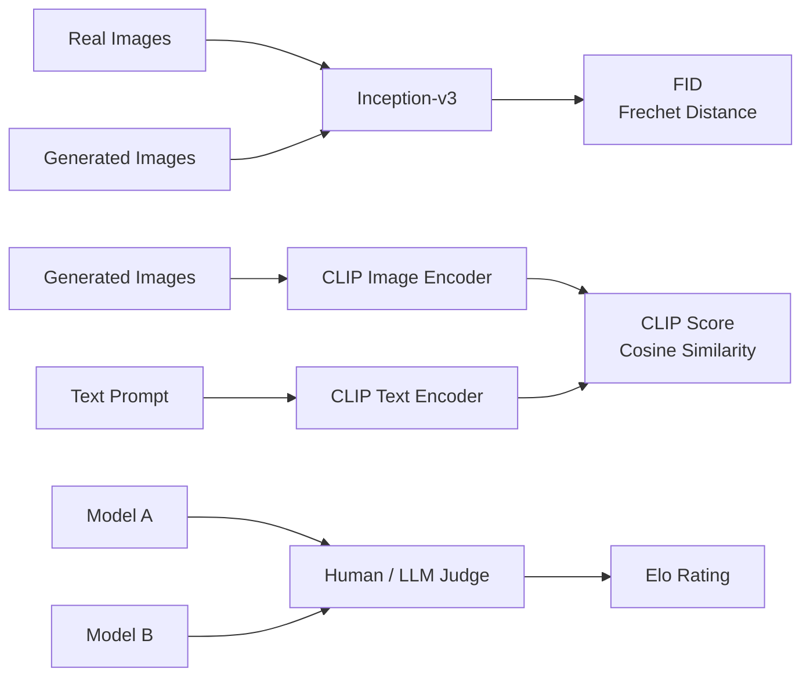

# Evaluation — FID, CLIP Score, Human Preference

> Every generative model leaderboard cites FID, CLIP score, and a win rate from a human-preference arena. Each number has a failure mode a determined researcher can game. If you do not know the failure modes, you cannot tell a real improvement from a gaming run.

**Type:** Build
**Languages:** Python
**Prerequisites:** Phase 8 · 01 (Taxonomy), Phase 2 · 04 (Evaluation Metrics)
**Time:** ~45 minutes

## The Problem

A generative model is judged on *sample quality* and *conditioning adherence*. Neither has a closed-form measure. Your model has to render 10,000 images; something has to assign them numbers; you have to trust the numbers across model families, across resolutions, across architectures. Three metrics survived the 2014-2026 gauntlet:

- **FID (Frechet Inception Distance).** A distance between two distributions — real and generated — in an Inception network's feature space. Lower is better.
- **CLIP score.** Cosine similarity between a generated image's CLIP-image embedding and a prompt's CLIP-text embedding. Higher is better.
- **Human preference.** Pit two models head-to-head on the same prompt, have humans (or a GPT-4-class model) pick the better one, aggregate to an Elo score.

## The Concept



### FID — Sample Quality

Heusel et al. (2017). Steps:
1. Extract Inception-v3 features (2048-D) for N real images and N generated.
2. Fit a Gaussian to each pool: compute mean `mu_r, mu_g` and covariance `Sigma_r, Sigma_g`.
3. FID = `||mu_r - mu_g||^2 + Tr(Sigma_r + Sigma_g - 2 * sqrt(Sigma_r * Sigma_g))`.

Failure modes:
- **Biased on small N.** Always use N >= 10,000.
- **Inception-dependent.** Inception-v3 was trained on ImageNet. Domains far from ImageNet produce meaningless FID.
- **Gaming.** Overfitting to the Inception prior gives low FID without visual quality improvement.

### CLIP Score — Prompt Adherence

For a generated image + prompt:

```
clip_score = cos_sim( CLIP_image(x_gen), CLIP_text(prompt) )
```

Failure modes:
- **CLIP's own blind spots.** Weak compositional reasoning.
- **Short prompt bias.** Short prompts have more matches.
- **Prompt gaming.** Including "high quality, 4k, masterpiece" inflates CLIP score.

### Human Preference — The Ground Truth

Pick a pool of prompts. Generate with model A and model B. Show pairs to humans (or a strong LLM judge). Aggregate wins into an Elo or Bradley-Terry score.

Benchmarks: **PartiPrompts** (Google, 1,600 diverse prompts), **HPSv2** (107k human annotations), **ImageReward** (137k preference pairs), **PickScore** (2.6M preferences).

Failure modes:
- **Judge variance.** Non-experts have different preferences than experts.
- **Prompt distribution.** Cherry-picked prompts favor one family.
- **LLM-judge reward hacking.** GPT-4-judge gets fooled by pretty-but-wrong outputs.

## Build It

`code/main.py` implements FID, CLIP-score-like, and Elo aggregation on synthetic "feature vectors".

### Step 1: FID in four lines

```python
def fid(real_features, gen_features):
    mu_r, cov_r = mean_and_cov(real_features)
    mu_g, cov_g = mean_and_cov(gen_features)
    mean_diff = sum((a - b) ** 2 for a, b in zip(mu_r, mu_g))
    trace_term = trace(cov_r) + trace(cov_g) - 2 * sqrt_cov_product(cov_r, cov_g)
    return mean_diff + trace_term
```

### Step 2: CLIP-style cosine-similarity

```python
def clip_like(image_feat, text_feat):
    dot = sum(a * b for a, b in zip(image_feat, text_feat))
    norm = math.sqrt(dot_self(image_feat) * dot_self(text_feat))
    return dot / max(norm, 1e-8)
```

### Step 3: Elo aggregation

```python
def elo_update(r_a, r_b, winner, k=32):
    expected_a = 1 / (1 + 10 ** ((r_b - r_a) / 400))
    actual_a = 1.0 if winner == "a" else 0.0
    r_a_new = r_a + k * (actual_a - expected_a)
    r_b_new = r_b - k * (actual_a - expected_a)
    return r_a_new, r_b_new
```

## Pitfalls

- **FID at N=1000.** Heuristic is unreliable under N=10k. Papers reporting low-N FID are gaming.
- **Comparing FID across resolutions.** Inception's 299x299 resize changes the feature distribution.
- **Reporting one seed.** Run 3 seeds minimum. Report std.
- **CLIP score inflation via negative prompts.** Some pipelines boost CLIP by over-fitting the prompt.
- **Elo bias from prompt overlap.** If both models saw a benchmark prompt during training, Elo is meaningless.
- **Human eval paid-crowd skew.** Prolific, MTurk annotators skew younger / tech-friendly.

## Use It — Production Eval Protocol in 2026

| Pillar | Minimum | Recommended |
|--------|---------|-------------|
| Sample quality | FID on 10k vs held-out real | + CMMD on 5k + FID on subset per category |
| Prompt adherence | CLIP score on 30k | + HPSv2 + ImageReward + VQA-style question answering |
| Preference | 200 blinded pairs vs baseline | + 2000 paired human + LLM-judge + Chatbot Arena |
| Failure analysis | 50 hand-flagged | 500 hand-flagged + automated safety classifier |

All four pillars in one report = claim. Any one alone = marketing.

## Production Note

Running FID on 10k samples means generating 10k images. For a 50-step SDXL base at 1024^2 on a single L4, that is ~11 hours of single-request inference.

- **Batch hard, forget latency.** Offline eval = static batching at the largest size that fits in memory.
- **Cache the real features.** The Inception (FID) or CLIP (CLIP-score, CMMD) feature extraction over the real reference set is run *once*, stored as a `.npz`.

For CI / regression gates: run FID + CLIP score on a 500-sample subset per PR (~30 min); run full 10k FID + HPSv2 + Elo nightly.

## Key Terms

| Term | What people say | What it actually means |
|------|-----------------|-----------------------|
| FID | "Frechet Inception Distance" | Frechet distance of Gaussian fits to real vs gen Inception features. |
| CLIP score | "Text-image similarity" | Cosine similarity between CLIP image and text embeddings. |
| CMMD | "FID's replacement" | CLIP-feature MMD; less biased, no Gaussian assumption. |
| IS | "Inception score" | Exp KL(p(y|x) || p(y)); correlates poorly on modern models, retired. |
| HPSv2 / ImageReward / PickScore | "Learned preference proxies" | Small models trained on human preferences; used as automatic judges. |
| Elo | "Chess rating" | Bradley-Terry aggregation of pairwise wins. |
| PartiPrompts | "The benchmark prompt set" | 1,600 Google-curated prompts across 12 categories. |
| FD-DINO | "Self-sup replacement" | FD using DINOv2 features; better for out-of-ImageNet domains. |

## Exercises

1. **Easy.** Run `code/main.py`. Compare FID at N=100 vs N=1000 on the same synthetic distributions. Report bias magnitude.
2. **Medium.** Implement CMMD from synthetic CLIP-style features. Compare sensitivity to quality differences vs FID.
3. **Hard.** Replicate the HPSv2 setup: take 1000 image-prompt pairs from a subset of Pick-a-Pic, fine-tune a small CLIP-based scorer on the preferences, and measure its agreement with a held-out set.

## Further Reading

- [Heusel et al. (2017). GANs Trained by a Two Time-Scale Update Rule Converge to a Local Nash Equilibrium (FID)](https://arxiv.org/abs/1706.08500)
- [Jayasumana et al. (2024). Rethinking FID: Towards a Better Evaluation Metric for Image Generation (CMMD)](https://arxiv.org/abs/2401.09603)
- [Radford et al. (2021). Learning Transferable Visual Models from Natural Language Supervision (CLIP)](https://arxiv.org/abs/2103.00020)
- [Wu et al. (2023). HPSv2: A Comprehensive Human Preference Score](https://arxiv.org/abs/2306.09341)
- [Xu et al. (2023). ImageReward: Learning and Evaluating Human Preferences for Text-to-Image Generation](https://arxiv.org/abs/2304.05977)
- [Yu et al. (2023). Scaling Autoregressive Models for Content-Rich Text-to-Image Generation (Parti + PartiPrompts)](https://arxiv.org/abs/2206.10789)

[Reference](https://github.com/rohitg00/ai-engineering-from-scratch/tree/main/phases/08-generative-ai/14-evaluation-fid-clip-score)
