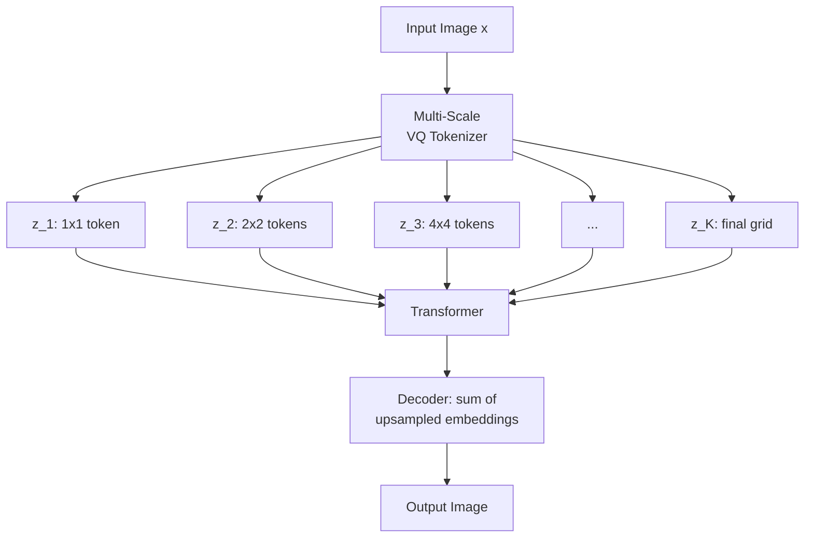

# Visual Autoregressive Modeling (VAR): Next-Scale Prediction

> Diffusion models sample iteratively in time (denoising steps). VAR samples iteratively in scale — it predicts a 1x1 token, then 2x2, then 4x4, up to the final resolution, each scale conditioning on the previous. The 2024 paper showed VAR matches GPT-style scaling laws for image generation and beats DiT at the same compute budget. This lesson builds the core mechanism.

**Type:** Build
**Languages:** Python (with numpy)
**Prerequisites:** Phase 7 Lesson 03 (Multi-Head Attention), Phase 8 Lesson 06 (DDPM)
**Time:** ~90 minutes

## The Problem

Autoregressive generation dominated language modeling because it scales predictably: more compute, more parameters, lower perplexity, better outputs. Image generation had two main AR attempts before 2024: PixelRNN/PixelCNN (pixel-by-pixel) and DALL-E 1 / Parti / MuseGAN (token-by-token on VQ-VAE codes).

Both suffered from a generation-order problem. Pixels and tokens are arranged in a 2D grid, but the AR model has to visit them in a 1D raster order. An early corner pixel has no idea what the image eventually becomes. Generation quality scaled worse than GPT-on-text and never reached diffusion-model quality at matched compute.

VAR fixes the generation-order problem by changing what is being generated. Instead of predicting image tokens one by one in space, VAR predicts a whole image at increasing resolutions. Step 1: predict a 1x1 token (the overall image "summary"). Step 2: predict a 2x2 grid of tokens (coarser features). Step 3: predict a 4x4 grid. Step K: predict the final (H/8)x(W/8) grid.

Each scale attends to all previous scales (causally in "scale order") and parallel within its own scale. The order problem disappears: the whole image at scale k is produced in one transformer pass.

## The Concept



### VQ-VAE Multi-Scale Tokenizer

VAR needs a **multi-scale discrete tokenizer**. For an image x, it produces a sequence of progressively higher-resolution token grids:

```
x -> encoder -> latent f
f -> tokenize at 1x1: token grid z_1 of shape (1, 1)
f -> tokenize at 2x2: token grid z_2 of shape (2, 2)
...
f -> tokenize at (H/p)x(W/p): token grid z_K of shape (H/p, W/p)
```

Each z_k uses the same codebook (typical size 4096-16384). The tokenization at each scale is not independent — it is trained so that summing the residuals at each scale reconstructs f:

```
f approx = upsample(embed(z_1), target_size) + ... + upsample(embed(z_K), target_size)
```

This is a **residual VQ** variant. Scale k captures what scales 1..k-1 missed. Decoder takes the sum of all scale embeddings and produces the image.

### Next-Scale Prediction

The generative model is a transformer that sees tokens from all previous scales and predicts the tokens at the next scale.

Input sequence structure:
```
[START, z_1 tokens, z_2 tokens, z_3 tokens, ..., z_K tokens]
```

Position embeddings encode both scale index and spatial position within the scale. Attention is causal in scale order: token at scale k, position (i, j) can attend to all tokens at scales 1..k and to tokens at scale k itself.

Training loss: at each scale k, predict the tokens z_k given all prior-scale tokens. Cross-entropy loss on the discrete VQ codes. Same structure as GPT except the "sequence" is now scale-structured.

### Generation

At inference:
```
generate z_1 = sample from p(z_1)                    # 1 token
generate z_2 = sample from p(z_2 | z_1)              # 4 tokens in parallel
generate z_3 = sample from p(z_3 | z_1, z_2)         # 16 tokens in parallel
...
decode: f = sum of embed-and-upsample scales 1..K
image = VAE_decoder(f)
```

For K = 10 scales, generation is 10 transformer forward passes. Each pass produces its entire scale in parallel — no per-token autoregression within a scale.

### Why Next-Scale Wins Over Next-Token

Three structural wins:
1. **Coarse-to-fine aligns with natural image statistics.** Low-frequency structure is stable and predictable; high-frequency detail is conditional on low-frequency content.
2. **Parallel generation within scale.** All tokens at a scale in one step. Effective generation length is log-scale instead of linear.
3. **No generation order bias.** Tokens at scale k see all of scale k-1; there is no "left-of" or "above" bias.

### Scaling Law

Tian et al. demonstrated that VAR follows a power-law scaling curve for FID on ImageNet — just like GPT does for perplexity. Doubling parameters or compute reliably halves error. This was the first image-generative model to exhibit this kind of scaling behavior as cleanly as language models.

### Relationship to Diffusion

VAR and diffusion share the same data-compression story: both break the generation problem into a sequence of easier subproblems.

- Diffusion: gradually add noise, learn to undo one step.
- VAR: gradually add resolution, learn to predict the next scale.

They are different axes through the problem. Both yield tractable conditional distributions. Empirically VAR is faster at inference (fewer passes, all parallel within a scale) and matches or beats DiT on class-conditional ImageNet.

## Build It

In `code/main.py` you will:
1. Build a tiny **multi-scale VQ tokenizer** on synthetic "image" data (2D patterns).
2. Train a **VAR-style next-scale predictor** (conditional histograms as a stand-in for a transformer).
3. Sample by calling the predictor 4 times (4 scales) and decoding.
4. Verify that scale-ordered training makes generation parallel within a scale.

### Step 1: multi-scale residual VQ tokenizer

```python
def downsample(img, target):
    """Average-pool an HxW image down to target x target."""
    h, w = img.shape
    if target == h:
        return img.copy()
    factor = h // target
    return img.reshape(target, factor, target, factor).mean(axis=(1, 3))

def tokenize_multiscale(img, codebooks):
    """Residual VQ: each scale tokenizes what previous scales missed."""
    residual = img.copy()
    tokens = []
    for scale, book in zip(SCALES, codebooks):
        coarse = downsample(residual, scale)
        tok = encode(coarse, book)
        recon = book[tok]
        residual = residual - upsample(recon, IMG)
        tokens.append(tok)
    return tokens
```

### Step 2: next-scale predictor (conditional histogram)

```python
def fit_predictor(token_streams):
    """One conditional histogram per scale, keyed on previous-scale summary."""
    predictors = [{} for _ in SCALES]
    for stream in token_streams:
        for k in range(len(SCALES)):
            ctx = context_key(stream[:k])
            table = predictors[k].setdefault(ctx, np.ones(CODEBOOK))
            for tok in stream[k].reshape(-1):
                table[int(tok)] += 1.0
    for table in predictors:
        for key, counts in table.items():
            table[key] = counts / counts.sum()
    return predictors
```

### Step 3: generation loop

```python
def generate(predictors, codebooks, rng):
    """One VAR sample: K passes, parallel-within-scale, causal across scales."""
    drawn = []
    for k, scale in enumerate(SCALES):
        ctx = context_key(drawn[:k])
        probs = predictors[k].get(ctx)
        if probs is None:
            probs = np.ones(CODEBOOK) / CODEBOOK
        size = scale * scale
        flat = np.array([sample_categorical(probs, rng) for _ in range(size)])
        drawn.append(flat.reshape(scale, scale))
    image = detokenize_multiscale(drawn, codebooks)
    return image, drawn
```

## Key Terms

| Term | What people say | What it actually means |
|------|----------------|----------------------|
| VAR | "Visual AutoRegressive" | Image generation by next-scale prediction over a pyramid of VQ token grids |
| Next-scale prediction | "Predict coarser, then finer" | The model predicts tokens at increasing resolution scales, conditioning on all previous scales |
| Multi-scale VQ tokenizer | "Residual VQ" | VQ-VAE that produces K token grids of increasing resolution, with decoder summing all scales |
| Scale k | "Pyramid level k" | One of K resolution levels, from 1x1 at k=1 up to (H/p)x(W/p) at k=K |
| Parallel-within-scale | "One forward per scale" | All tokens at scale k are predicted in one transformer pass, not autoregressively |
| Causal-across-scales | "Scale-ordered attention" | Token at scale k can attend to all of scales 1..k but not scales k+1..K |
| Residual VQ | "Additive tokenization" | Each scale's tokens encode the residual left by lower scales; decoder sums all scale embeddings |
| VAR scaling law | "Image GPT scaling" | FID follows a predictable power law in compute, like language models' perplexity |
| HART | "Hybrid VAR + text" | Text-conditional VAR variant combining MaskGIT-style iterative decoding with VAR's scale structure |

## Exercises

1. **Scale count ablation.** Train VAR with 4, 6, 8, 10 scales. Measure reconstruction quality vs number of autoregressive passes.
2. **Codebook size.** Train tokenizers with codebook sizes 512, 4096, 16384. Larger codebooks give better reconstruction but harder prediction.
3. **Parallel-within-scale check.** For a trained VAR, measure the attention pattern explicitly. Within scale k, does the model attend to cross-scale positions but not intra-scale?
4. **VAR vs DiT scaling.** For the same ImageNet class-conditional task, train VAR and DiT at matched param budgets (e.g., 33M, 130M, 458M). Plot FID vs compute.
5. **Text conditioning.** Extend VAR to take a text embedding (CLIP pooled) as an extra conditioning input via adaLN. This is the HART recipe.

## Further Reading

- [Tian et al., 2024 - "Visual Autoregressive Modeling: Scalable Image Generation via Next-Scale Prediction"](https://arxiv.org/abs/2404.02905)
- [Peebles and Xie, 2022 - "Scalable Diffusion Models with Transformers"](https://arxiv.org/abs/2212.09748)
- [Esser et al., 2021 - "Taming Transformers for High-Resolution Image Synthesis"](https://arxiv.org/abs/2012.09841)
- [van den Oord et al., 2017 - "Neural Discrete Representation Learning"](https://arxiv.org/abs/1711.00937)
- [Tang et al., 2024 - "HART: Efficient Visual Generation with Hybrid Autoregressive Transformer"](https://arxiv.org/abs/2410.10812)

[Reference](https://github.com/rohitg00/ai-engineering-from-scratch/tree/main/phases/08-generative-ai/19-visual-autoregressive-var)
